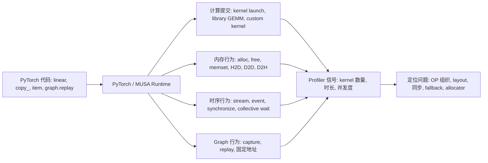
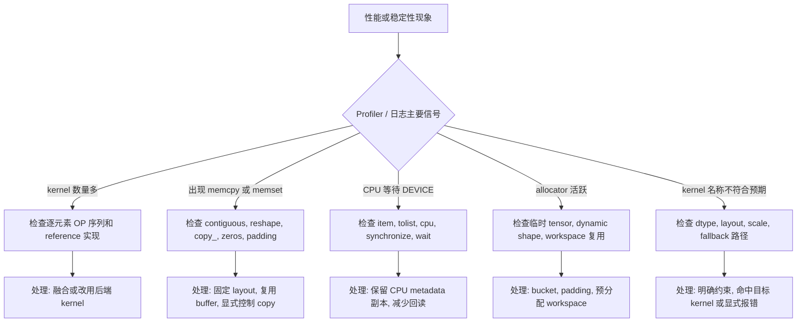
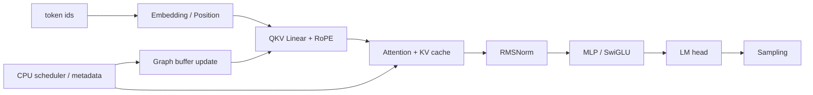
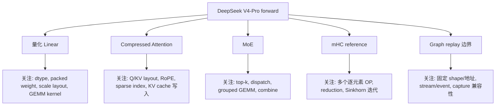

# PyTorch 常见 OP 与 LLM 推理实战

> 每种 OP 的运行时行为：F.linear 什么时候走 cuBLAS 什么时候走量化 GEMM，view 和 reshape 差在哪，LLaMA 和 DeepSeek V4 各用了哪些 OP

---

## 阅读主线

阅读时先建立“上层 OP 到底层执行行为”的映射，再进入源码。重点不是记住每个 PyTorch API 的完整语义，而是识别这些 API 最终会表现成哪类计算、内存、同步或 Graph 行为。



后续章节按这条线阅读：先判断 OP 属于计算、layout、内存、同步还是 Graph 行为，再看它是否处在 decode 热点路径、CPU-DEVICE 边界或固定地址 replay 路径中。

---

## 第一章 PyTorch 常见 OP 分类

OP（算子）是 PyTorch 中执行张量操作的基本单元。`F.linear` 做矩阵乘法，`softmax` 做归一化，`view` 改张量形状。一个 PyTorch API 不等于一个 GPU kernel：

| 类型 | 示例 | 实际 GPU 行为 |
|------|------|-------------|
| 只改 metadata | `view`, `unsqueeze`, `transpose` | 零拷贝，不触发 kernel |
| 触发数据复制 | `contiguous`，stride 不兼容的 `reshape` | HBM 内存拷贝 |
| 调用库 kernel | `F.linear`, `softmax`, `topk` | cuBLAS/cuDNN/自定义 kernel |
| 多个 kernel 序列 | RMSNorm 的 `square→mean→rsqrt→mul` | 每个 OP 独立 launch |

### 1.1 GPU OP

作用于 DEVICE tensor，是 Transformer forward 的主体。

| 类别 | 常见 OP | 用法 |
|------|---------|------|
| 创建初始化 | `empty`、`zeros`、`ones`、`full` | 分配 input buffer、KV cache、logits |
| 原地更新 | `copy_`、`fill_`、`zero_`、`clamp_` | 更新 metadata、清理 padding |
| Shape/Layout | `view`、`reshape`、`transpose`、`contiguous` | QKV head layout、维度整理 |
| 索引映射 | `gather`、`scatter_`、`index_select` | KV page/slot、MoE dispatch |
| 序列组合 | `arange`、`cat`、`stack`、`split`、`pad` | positions 展开、batch 拼接 |
| 数学与激活 | `sum`、`mean`、`square`、`rsqrt`、`silu`、`softmax` | RMSNorm、SwiGLU、attention |
| 线性代数 | `F.linear`、`matmul`、`bmm`、`einsum` | QKV/MLP/LM head 投影 |
| 路由 | `topk`、`argmax` | MoE 专家选择、sampling |
| dtype/device | `to`、`float`、`bfloat16`、`int` | 精度转换、CPU/DEVICE 边界 |

### 1.2 CPU OP

在线推理中，CPU 侧负责 request queue、KV block 管理；DEVICE 侧负责张量计算。

| 类别 | 常见 OP | 用法 |
|------|---------|------|
| Python 容器 | `list`、`dict`、`range` | scheduler、request state |
| CPU tensor | `torch.tensor(..., device="cpu")` | `seq_lens_cpu`、bucket 选择 |
| 标量读取 | `.item()` | 获取最终 token id |
| H2D | `to(device)` | metadata 上传到 GPU |

### 1.3 Sync OP

管理 CPU、DEVICE stream 和 Graph replay 的时序。

| 类别 | 常见 API | 用法 |
|------|---------|------|
| 全设备同步 | `synchronize()` | benchmark、调试 |
| Stream/Event | `Stream`、`Event.record()`、`wait_event()` | copy/compute 编排 |
| Graph 边界 | `graph.replay()` 前后 wait | replay 前更新 buffer |
| 隐式同步 | `.item()`、`.tolist()`、`.cpu()` | 对 GPU tensor 用会触发 CPU 等待 |

### 1.4 Dynamic Shape OP

输出 shape 依赖输入数据。eager 模式正常，Graph capture 中会导致失败。

| OP | 固定 shape 替代方案 |
|----|-------------------|
| `nonzero`、`argwhere` | fixed mask + padding |
| `unique` | fixed capacity 或 histogram |
| `masked_select` | `where` 保持原 shape |

### 1.5 Graph OP

CUDA Graph 把一组固定 shape、固定地址的 kernel 序列录制为一张图，replay 时一次调用执行全部 kernel。

```
预分配 buffer → warmup → capture 录制 → copy_ 更新输入 → replay 重放
```

| 阶段 | 常见 API | 说明 |
|------|---------|------|
| 预分配 | `empty`、`zeros` | capture 前创建固定 buffer |
| warmup/capture | `graph.capture_begin/capture_end` | 固定 shape 和地址执行一次 |
| 更新输入 | `copy_`、`_foreach_copy_`、`fill_` | replay 前只改 buffer 内容 |
| 执行 | `graph.replay()` | 复用录制路径 |

---

## 第二章 OP 常见性能问题与排查

PyTorch OP 的性能问题通常来自五类行为：隐式 copy、临时分配、CPU-DEVICE 同步、动态 shape，以及未命中预期 kernel 或 fallback 路径。

排查时先看 profiler 中的可见信号，再回到源码定位对应 OP。不要只看 Python 代码是否简洁，要判断它是否引入了额外 kernel、copy、同步、分配或 fallback。



### 2.1 Layout 与隐式 Copy

`view`/`reshape`/`transpose`/`permute`/`contiguous()` 是 Transformer 中最常见的 layout OP。`view` 通常是零拷贝，但要求 stride 兼容；`reshape` 在 stride 不兼容时可能分配新 tensor；`contiguous()` 会把非连续 layout 复制成连续内存。QKV head layout、RoPE 输入、KV cache layout 和 custom kernel 输入都依赖这些 layout 结果。

| 现象 | 常见 OP | 根因 | 处理方式 |
|------|---------|------|----------|
| `reshape` 后延迟抖动 | `reshape`、`permute`、`transpose` | stride 不兼容导致隐式 copy | 能用 `view` 时优先 `view`；kernel 前显式检查 `stride`/`is_contiguous` |
| kernel 前多一次 copy | `contiguous()` | 目标 kernel 只支持连续输入 | 把 layout 转换前移、复用转换结果，或融合到 kernel 内 |
| broadcast 写错 | `expand` + inplace OP | expanded tensor 可能是 zero-stride view | 不对 expanded view 原地写，必要时先 `clone`/`contiguous` |

### 2.2 分配、初始化与 Buffer 生命周期

`empty`/`new_empty`/`empty_like` 只分配内存，不初始化。高频推理路径经常用它们预分配 workspace，后续 kernel 必须完整写入。Graph replay 还要求 input/output/metadata tensor 的对象地址保持不变——replay 前应使用 `copy_`/`fill_`/`zero_` 更新内容，而不是创建新 tensor。

| 场景 | 推荐方式 | 风险 |
|------|----------|------|
| graph input/output | capture 前预分配，replay 前 `copy_` 更新内容 | replay 中替换 tensor 对象会破坏固定地址 |
| padding 槽位 | replay 前 `fill_`/`zero_` 清理 | 残留值会影响 attention mask、cache 或 logits |
| 临时 workspace | 按 batch/seq bucket 复用 | 每步分配增加 allocator 开销和地址不稳定 |

### 2.3 由多个独立 kernel 执行的 OP 序列

RMSNorm、SwiGLU、attention softmax 和 MoE combine 常用多个 PyTorch OP 表达 reference 语义。reference 实现便于验证数学逻辑，但每个 OP 往往会单独触发 kernel launch，并读写中间 tensor。在线热点路径通常需要 fused kernel 或后端原生 kernel 承担同一段计算。

| OP 序列 | 语义 | 性能问题 |
|-------|------|----------|
| `square → mean → rsqrt → mul` | RMSNorm / Q norm | 多次读取 hidden states，多次 launch |
| `chunk → silu → clamp → mul` | SwiGLU | 中间 tensor 多，激活、裁剪和乘法分别执行 |
| `softmax → matmul` | attention reference | score tensor 大，占显存和带宽 |
| `where`/`nonzero → index_select → scatter` | MoE dispatch/combine | token 数动态，allocator 和调度复杂 |
| `topk → gather → normalize` | MoE routing / sampling | top-k shape、排序和 dtype 会传导到后续 kernel |

### 2.4 CPU-DEVICE 同步边界

`.item()`、`.tolist()`、`.cpu()`、`.numpy()` 是最容易被忽略的同步来源。对 CPU tensor 调用它们通常没问题；对 GPU/MUSA tensor 调用时，CPU 需要等待前序 DEVICE 计算完成，再做 D2H 拷贝或标量读取。

| API | 合理位置 | 风险位置 |
|-----|----------|----------|
| `.item()` | CPU侧元数据副本、最终标量、benchmark 结束 | GPU seq_lens、GPU logits、Graph 内部分支 |
| `.tolist()` | CPU scheduler 的长度列表、最终 token 列表 | GPU 上 `bincount` 后回读并驱动 Python expert loop |
| `.cpu()` | 最终输出、少量 logprob、离线分析 | 完整 logits、hidden states、KV metadata |
| `synchronize()` | profiling 边界、错误定位 | decode 单步、通信计算重叠区 |

### 2.5 Dynamic Shape、Compile 与 Graph

`nonzero`/`unique`/`masked_select`、mask 后变长 `index_select`、数据相关 `cat`/`split` 会让输出 shape 随输入内容变化。它们在 eager 模式表达力强，但会让 `torch.compile` 产生 guard 或 graph break，也会破坏 Graph replay 的固定 shape/固定地址约束。

| 动态来源 | 典型 OP | 更稳定的表达 |
|----------|---------|--------------|
| 有效 token 数变化 | `nonzero`、boolean indexing | fixed mask + padding |
| expert 负载变化 | `where`、`bincount(...).tolist()` | fixed top-k、固定 expert capacity、padded metadata |
| request 长度变化 | data-dependent `cat`/`split` | CPU scheduler bucket + fixed metadata |
| sparse index 数量变化 | 动态 `topk(k)` | 固定 k，超出部分用 sentinel/padding |

### 2.6 dtype、量化与 Fallback

BF16/FP16/FP8/FP4、activation scale、weight scale、block size、packed layout 和输出 dtype 是一组接口约束。`to(dtype)` 不只是精度转换，也可能改变 kernel 路径、Graph capture 能力和数值误差分布。

| 问题 | 表现 | 处理方式 |
|------|------|----------|
| dtype/layout 不匹配 | fallback 到 PyTorch reference 或通用 kernel | 打印/统计执行路径，确认输入满足 kernel 约束 |
| scale layout 不匹配 | FP8/FP4 GEMM 结果错误或性能异常 | 固定 block size，明确 scale shape、stride 和连续性 |
| 反复 cast | 多余 `float`/`half`/`bfloat16`/`to` | 在模块边界集中转换 |
| silent fallback | 语义正确但性能异常 | 对不支持组合显式报错或受控 fallback |

---

## 第三章 LLaMA 用了哪些 OP

LLaMA 是大多数开源模型的基座——Qwen、Mistral、Yi 沿用同一骨架。下面按 decode 单步的执行顺序，列出每个阶段使用的 OP。



源码中的 OP 分为三个层次：**数学语义**（`linear`、`softmax`、`silu`）、**layout 和 metadata**（`view`、`transpose`、`arange`、`copy_`）、**服务边界**（`.cpu()`、Graph replay、KV cache page 写入）。

一层典型 Transformer block 的简化结构：

```python
def transformer_forward(input_ids, positions, kv_cache):
    hidden = embed_tokens(input_ids)
    for layer in layers:
        residual = hidden
        hidden = layer.input_norm(hidden)
        hidden = layer.attention(hidden, positions, kv_cache)
        hidden = residual + hidden

        residual = hidden
        hidden = layer.post_attention_norm(hidden)
        hidden = residual + layer.mlp(hidden)

    hidden = final_norm(hidden)
    logits = lm_head(hidden[:, -1])
    next_token = sample(logits)
    return next_token, kv_cache
```

---

### 3.1 Embedding、Position 与 RoPE

Embedding 把离散 token id 变成 hidden states，Position 生成每个 token 的位置信息，RoPE 把 position 注入 Q/K 的部分维度。

```python
def embedding_and_rope(input_ids, q, k, start_pos, freqs_cis):
    # 把离散 token id 映射成连续 hidden states。
    hidden = F.embedding(input_ids, embed_weight)

    # 为本轮 token 生成连续 position id，prefill 与 decode 都依赖该范围。
    positions = torch.arange(
        start_pos, start_pos + input_ids.numel(),
        device=input_ids.device, dtype=torch.long)

    # Q/K projection 输出整理成 attention head layout。
    q = q.view(-1, num_heads, head_dim)
    k = k.view(-1, num_kv_heads, head_dim)

    # 只拆出需要 RoPE 的维度，其余维度保持 pass-through。
    q_rope, q_pass = q[..., :rope_dim], q[..., rope_dim:]
    k_rope, k_pass = k[..., :rope_dim], k[..., rope_dim:]

    # positions 查表得到旋转频率，unsqueeze 补 head 维用于 broadcast。
    freqs = freqs_cis[positions].unsqueeze(1)
    q_rope = apply_rotary(q_rope, freqs)
    k_rope = apply_rotary(k_rope, freqs)

    # 拼回完整 head_dim，供 attention kernel 消费。
    q = torch.cat([q_rope, q_pass], dim=-1)
    k = torch.cat([k_rope, k_pass], dim=-1)
    return hidden, positions, q, k
```

#### 涉及的 OP 及作用

| 子模块 | 核心 OP | 作用 |
|--------|---------|------|
| Token embedding | `F.embedding` | 离散 token id → 连续 hidden states |
| Position | `arange`、`unsqueeze` | 生成 prefill/decode 的位置索引 |
| RoPE layout | `view`、slice | 按 head_dim 拆分/拼合，stride 兼容时零拷贝 |
| RoPE 旋转 | `mul`、`add`、复数运算 | 位置编码注入 Q/K |
| 拼接 | `cat` | 将 RoPE 维和 nope 维合并 |

---

### 3.2 Attention 与 KV Cache

Attention 是 OP 组织最密集的模块。

```python
def attention_forward(hidden, attn_mask, kv_cache, slot_mapping):
    # 一次 linear 生成 Q/K/V，再沿 hidden 维切分。
    qkv = F.linear(hidden, qkv_weight)
    q, k, v = qkv.chunk(3, dim=-1)                     # chunk 切分（返回 view）

    # 转成 [batch, heads, seq, head_dim]，匹配 attention 计算布局。
    q = q.view(batch, seq, num_heads, head_dim).transpose(1, 2)
    k = k.view(batch, seq, num_kv_heads, head_dim).transpose(1, 2)
    v = v.view(batch, seq, num_kv_heads, head_dim).transpose(1, 2)

    # slot_mapping 映射到 paged KV cache 的 page 与 page 内 offset。
    page_idx = torch.div(slot_mapping, page_size, rounding_mode="floor")
    page_offset = slot_mapping % page_size

    # 写 cache 前恢复 token-major layout，保证 token 与 slot 一一对应。
    kv_cache[page_idx, page_offset, 0] = k.reshape(-1, num_kv_heads, head_dim)
    kv_cache[page_idx, page_offset, 1] = v.reshape(-1, num_kv_heads, head_dim)

    # reference attention：显式生成 score/prob，便于校验语义。
    scores = torch.matmul(q, k.transpose(-2, -1)) * scale
    scores = scores.masked_fill(attn_mask, float("-inf"))
    probs = torch.softmax(scores, dim=-1)
    out = torch.matmul(probs, v)

    # 输出恢复到 hidden layout，再进入 output projection。
    out = out.transpose(1, 2).contiguous().view(batch, seq, hidden_size)
    return F.linear(out, o_weight), kv_cache
```

#### 涉及的 OP 及作用

| 子模块 | 核心 OP | 作用 |
|--------|---------|------|
| QKV 投影 | `F.linear` | 主 GEMM 入口，hidden→Q/K/V |
| 切分 | `chunk` | 沿 hidden 最后一维拆 Q/K/V |
| Head layout | `view`、`transpose` | `[batch, seq, hidden]` → `[heads, batch, head_dim]` |
| KV cache 写入 | `div`、`%`、advanced indexing | slot→page/offset 分页写入 |
| Attention 计算 | `matmul`、`masked_fill`、`softmax` | Q×K、causal mask、归一化 |
| 输出投影 | `F.linear` | 恢复到 hidden 维度 |

**举一反三**：读完 LLaMA 的 Attention，再看任意模型的 Attention 实现时，可以从相同的三个位置入手——它们在任何 Transformer 变体中都存在：(1) `transpose(1,2)` 后的 `contiguous()` 是否必要——如果 downstream fused kernel 支持非连续 layout，这行 copy 可移除；(2) KV cache 写入是 `advanced indexing` 还是 custom kernel——前者在 decode 热路径触发三次 launch（div/%/indexing）；(3) attention 计算是 reference（`matmul→softmax→matmul`）还是 fused kernel——前者 materialize 完整 score tensor，显存和带宽开销随 seqlen 平方增长。

---

### 3.3 RMSNorm 与 SwiGLU MLP

```python
def rmsnorm_mlp(hidden, residual):
    # norm 计算使用 FP32，降低 reduction 的数值误差。
    x = hidden.float()
    rstd = torch.rsqrt(x.square().mean(dim=-1, keepdim=True) + eps)
    normed = (x * rstd).to(hidden.dtype) * norm_weight

    # SwiGLU: gate/up 共用一次 projection，再按最后一维拆分。
    gate_up = F.linear(normed, gate_up_weight)
    gate, up = gate_up.chunk(2, dim=-1)

    # SiLU(gate) 与 up 逐元素相乘。
    gate = F.silu(gate)
    down = F.linear(gate * up, down_weight)

    return residual + down
```

#### 涉及的 OP 及作用

| 子模块 | 核心 OP | 作用 |
|--------|---------|------|
| RMSNorm | `float`、`square`、`mean`、`rsqrt`、`mul` | reference: 4 个 OP；高性能用 fused kernel |
| SwiGLU gate | `F.linear`、`silu` | 门控信号 |
| SwiGLU up | `F.linear` | 升维投影 |
| SwiGLU down | `F.linear`、`mul` | 降维回 hidden |
| 残差 | `+` | residual add |

---

### 3.4 总结：LLaMA 用到了哪些 OP

| 阶段 | GPU 计算 OP | Layout/Metadata OP | CPU 边界 |
|------|------------|-------------------|---------|
| Embedding | `F.embedding` | — | — |
| Position | — | `arange`、`unsqueeze` | — |
| QKV | `F.linear` | `view`、`transpose`、`chunk` | — |
| RoPE | `mul`、`add` | slice、`cat` | — |
| Attention | `matmul`、`softmax`、`masked_fill` | `transpose`、`contiguous`、`view` | — |
| KV Cache | `div`、`%` | indexing | — |
| RMSNorm | `square`、`mean`、`rsqrt`、`mul` | `float`、`to(dtype)` | — |
| SwiGLU | `F.linear`(×3)、`silu`、`mul` | — | — |
| LM Head | `F.linear` | `[:, -1]` slice | — |
| Sampling | `argmax`/`topk`/`softmax` | — | `.item()` |

---


---

## 第四章 DeepSeek V4 用了哪些 OP

DeepSeek V4-Pro（61 层、7168 维、384 专家、1M 上下文）在 LLaMA 基础上增加了量化 Linear、DSA 压缩注意力、MoE 和 mHC。每个模块引入了一组新的 OP。



---

### 4.1 量化 Linear：dtype 分派与 packed weight

DeepSeek V4-Pro 的线性层根据权重 dtype 选择不同的 GEMM 路径。

```python
def linear(x, weight, bias=None):
    # 该实现只覆盖无 bias 路径，量化 GEMM 接口不接收 bias。
    assert bias is None

    # FP4/FP8 权重先量化 activation，再调用对应 GEMM wrapper。
    if weight.dtype == torch.float4_e2m1fn_x2:
        x, s = act_quant(x, block_size=128, scale_fmt=scale_fmt, scale_dtype=scale_dtype)
        return fp4_gemm(x, s, weight, weight.scale, scale_dtype)

    elif weight.dtype == torch.float8_e4m3fn:
        x, s = act_quant(x, block_size=128, scale_fmt=scale_fmt, scale_dtype=scale_dtype)
        return fp8_gemm(x, s, weight, weight.scale, scale_dtype)

    else:
        # 普通 dtype 使用 PyTorch dense linear 作为 reference/fallback。
        return F.linear(x, weight)
```

量化 Linear 的权重初始化也特殊——FP4 权重两个值打包为一个 byte：

```python
if dtype == torch.float4_e2m1fn_x2:
    # K 维减半: 2 个 FP4 打包为 1 byte
    self.weight = nn.Parameter(torch.empty(out_features, in_features // 2,
                                            dtype=torch.float4_e2m1fn_x2))
    # scale 沿 K 维每 32 个元素共享 1 个
    self.weight.scale = nn.Parameter(torch.empty(out_features, in_features // 32,
                                                  dtype=torch.float8_e8m0fnu))
elif dtype == torch.float8_e4m3fn:
    self.weight = nn.Parameter(torch.empty(out_features, in_features, dtype=dtype))
    # scale 沿 K 维每 128 个元素共享 1 个
    self.weight.scale = nn.Parameter(torch.empty(
        (out_features + 127) // 128, (in_features + 127) // 128, dtype=torch.float8_e8m0fnu))
```

| 模块 | 核心 OP | 特点 |
|------|---------|------|
| dtype 分派 | `weight.dtype` 判断 | FP4→`fp4_gemm`, FP8→`fp8_gemm`, BF16→`F.linear` |
| 量化 | `act_quant` | 对 activation 分块量化, 生成 scale |
| GEMM | `fp4_gemm`/`fp8_gemm` | 同时读 activation/weight/双 scale |

---

### 4.2 Compressed Attention：MLA + DSA

DeepSeek V4 的注意力是 **MLA (Multi-Head Latent Attention)** + **DSA (DeepSeek Sparse Attention)** 的组合。

```python
# Q 路径：projection 后整理成 head layout，并只对 RoPE 维旋转。
qr = q = self.q_norm(self.wq_a(x))
q = self.wq_b(q).unflatten(-1, (self.n_local_heads, self.head_dim))
q *= torch.rsqrt(q.square().mean(-1, keepdim=True) + self.eps)    # MLA self-norm
apply_rotary_emb(q[..., -rd:], freqs_cis)                          # 只对 RoPE 维旋转

# KV 路径：单头投影 + norm + RoPE + 原地 FP8 量化。
kv = self.wkv(x)                                          # [B, 512]  单 KV head
kv = self.kv_norm(kv)
apply_rotary_emb(kv[..., -rd:], freqs_cis)                # RoPE 部分旋转
act_quant(kv[..., :-rd], 64, scale_fmt, scale_dtype, True) # nope 部分原地量化

# sparse attention index 由窗口 index 和压缩 index 拼成。
topk_idxs = get_window_topk_idxs(128, bsz, seqlen, start_pos)
if self.compress_ratio == 4:
    compress_topk_idxs = self.indexer(x, qr, start_pos, offset)  # C4Indexer
    topk_idxs = torch.cat([topk_idxs, compress_topk_idxs], dim=-1)
topk_idxs = topk_idxs.int()

# attention kernel 直接消费 Q、KV、sink 和 sparse index。
o = sparse_attn(q, kv_cache, self.attn_sink, topk_idxs, self.softmax_scale)

# 反 RoPE + 输出投影
apply_rotary_emb(o[..., -rd:], freqs_cis, inverse=True)   # 输出中 RoPE 部分旋转复原
o = o.view(bsz, seqlen, self.n_local_groups, -1)
o = torch.einsum("bsgd,grd->bsgr", o, self.wo_a.weight)   # 分组低秩 wo_a
x = self.wo_b(o.flatten(2))                                 # wo_b 展开
```

| 模块 | 核心 OP | 特点 |
|------|---------|------|
| Q 低秩 | `wq_a`→`q_norm`→`wq_b` | 4096→1024→32768，参数省 3x |
| Q self-norm | `square`、`mean`、`rsqrt` | MLA 特有：Q 自己做 RMS 归一化 |
| KV 投影 | `wkv` | 单头 512 维，所有 Q 头共享 |
| KV 量化 | `act_quant(..., inplace=True)` | nope 部分原地 FP8 量化 |
| 压缩索引 | `cat`、`topk` | SWA 128 + C4 512 = 640 tokens |
| 稀疏注意力 | `sparse_attn` | 只对 topk_idxs 计算精确注意力 |
| 反 RoPE | `apply_rotary_emb(..., inverse=True)` | 输出中 RoPE 部分的旋转复原 |
| 输出低秩 | `einsum`、`wo_b` | `[B,G,D] → [B,G,R] → [B,D]` |

**举一反三**：DSA 的核心模式——"压缩→索引→稀疏注意力"——可推广到任意需要长上下文的推理场景：(1) Compressor 的 `softmax` 分组加权本质是学到的池化，替换为 `mean` 或 `max` 可实现无参数压缩基线；(2) C4Indexer 的 `einsum→relu→topk` 本质是倒排索引检索——解码时可将压缩 KV 缓存预存为连续 tensor，避免 per-step 的 gather 开销；(3) 可通过 profiler 观察 `sparse_attn` 的 topk 实际命中的 token 分布，验证压缩率是否合理——命中率过低说明压缩丢失了关键上下文。

---

### 4.3 MoE：Router + Expert Dispatch

```python
def moe_forward(x, gate, experts, shared_expert, input_ids):
    # gate 输出每个 token 的 top-k expert 权重和 expert id。
    weights, indices = gate(x, input_ids.flatten())

    # 使用 FP32 输出 buffer 累加各 expert 的结果。
    y = torch.zeros_like(x, dtype=torch.float32)

    # reference 路径把 expert 计数回读到 CPU，用于跳过空 expert。
    counts = torch.bincount(indices.flatten(),
                            minlength=n_routed_experts).tolist()

    for i in range(experts_start_idx, experts_end_idx):
        if counts[i] == 0: continue
        # 找到路由到当前 expert 的 token，并按对应 top-k 权重执行 expert。
        idx, top = torch.where(indices == i)
        y[idx] += experts[i](x[idx], weights[idx, top, None])

    y += shared_expert(x)                                   # 共享专家
    return y
```

| 阶段 | 核心 OP | 特点 |
|------|---------|------|
| Router | `linear`、`softplus`、`sqrt` | V4: `sqrt(softplus(x))` |
| Top-k | `topk`、`gather` | 固定 k=6，shape 可预测 |
| 统计 | `bincount(...).tolist()` | GPU→CPU 同步, 仅 reference |
| Dispatch | `where`、advanced indexing | 按 expert id 动态选 token |
| Combine | `+=`、broadcast | 权重累加回原始位置 |

**举一反三**：读完 DeepSeek V4 的 MoE 实现，再看任意 MoE 模型时，关注以下三个层次——它们对应 MoE 特有的 OP 行为：(1) `topk` shape 是否在 Graph capture 中固定——topk 的 k 固定但输出 token 数动态，reference 用 `where` 产生变长输出，生产环境用 DeepEP all-to-all 保持固定 shape；(2) per-expert `for` 循环是否包含 Python 分支——每个 iteration 的 `if counts[i]==0: continue` 在 Python 侧引入分支预测开销，生产环境将 dispatch 交给 custom kernel 在 GPU 侧完成；(3) `bincount(...).tolist()` 在 decode 热路径引入 GPU→CPU 同步——适合 reference 验证，生产应替换为 GPU 侧的 fixed-capacity histogram。

---

### 4.4 mHC (multi-Head Compression)

```python
# 合并 HC copy 维后的 hidden 用于计算 mixing 参数。
x = x.flatten(2).float()
rsqrt = torch.rsqrt(x.square().mean(-1, keepdim=True) + eps)

# RMS-like scale 控制 mixing 参数幅度。
mixes = F.linear(x, hc_fn) * rsqrt                        # [B, S, 24]

# split/sinkhorn 生成 pre、post 和 comb 三组 HC 参数。
pre, post, comb = hc_split_sinkhorn(
    mixes, hc_scale, hc_base, hc_mult=4,
    sinkhorn_iters=20, eps=1e-6)
# pre: [B,S,4] 压缩权重, post: [B,S,4] 解压权重, comb: [B,S,4,4] 交互

# pre 权重作用在 HC copy 维上，sum 后回到普通 hidden。
y = torch.sum(pre.unsqueeze(-1) * x.view(shape), dim=2)   # [B,S,D]

# hc_post: [B,S,D] + residual → [B,S,4,D]
y = (post.unsqueeze(-1) * x.unsqueeze(-2)
     + (comb.unsqueeze(-1) * residual.unsqueeze(-2)).sum(dim=2))
```

| 阶段 | 核心 OP | 特点 |
|------|---------|------|
| 展平 | `flatten`、`float` | 多维→线性输入 |
| 归一化 | `square`、`mean`、`rsqrt` | per-token scale |
| mixing | `F.linear`、`mul` | hidden→pre/post/comb 参数 |
| Sinkhorn | `hc_split_sinkhorn` | 20 次行/列归一化，GPU kernel 化 |
| 压缩 | `unsqueeze`、broadcast、`sum` | pre 权重加权求和 |
| 解压 | `unsqueeze`、broadcast、`sum` | post+comb 恢复 hc_mult 维 |

---

### 4.5 总结：DeepSeek V4 的 OP 全景

与 LLaMA 相比，DeepSeek V4 新增/变化的 OP：

| 模块 | 新增 OP | 用途 |
|------|---------|------|
| 量化 Linear | `act_quant`、`fp4_gemm`/`fp8_gemm` | FP8/FP4 量化推理 |
| MLA | `square`、`mean`、`rsqrt`(Q 自归一化) | Q 低秩后额外归一化 |
| DSA Compressor | `softmax`(按 compress_ratio 分组)、加权`sum` | 4:1 或 128:1 KV 压缩 |
| DSA Indexer | `einsum`、`relu`、`topk`、`cat` | 检索 top-512 压缩 token |
| MoE Gate | `softplus`、`sqrt`(V4 专属) | sqrtsoftplus 路由评分 |
| MoE Dispatch | `where`、`bincount`、`+=` | 动态 token→expert 分发 |
| mHC | `flatten`、`F.linear`(hc_fn)、Sinkhorn | 4 头压缩→处理→解压 |
| 输出投影 | `einsum("bsgd,grd->bsgr")` | 分组低秩 wo_a |

---

## 附录 PyTorch 常见 OP 详细用例与 MUSA 输出

附录中的每个用例遵循统一结构：输入张量 → 操作序列 → 输出值 → 源码位置映射。用例结构统一为：输入张量 → 操作序列 → 输出值 → 源码位置。：(1) 输入 shape/dtype/device 是否与操作兼容——不兼容时定位到隐式 cast 或 copy；(2) 输出是否为原位修改——`copy_` 和 `fill_` 保留了原始 tensor 地址，`cat` 和 `stack` 则分配新 tensor；(3) MUSA 输出值与预期计算是否吻合——数值偏差超过 1e-3 时，检查是否引入了中间精度的 FP32→BF16 截断。

### A.1 Tensor 创建与初始化

#### `torch.empty`

```python
x = torch.empty((2, 3), dtype=torch.float32, device="musa:0")
# → Tensor(shape=(2,3), dtype=float32, device=musa:0)  内容未初始化
```

#### `torch.zeros` / `torch.zeros_like`

```python
x = torch.zeros((2, 3), dtype=torch.int64, device="musa:0")
# → value=[[0,0,0],[0,0,0]]
```

#### `torch.full`

```python
x = torch.full((2, 3), -1, dtype=torch.int64, device="musa:0")
# → value=[[-1,-1,-1],[-1,-1,-1]]
```

### A.2 原地更新

#### `copy_`

```python
a = torch.zeros(3, device="musa:0")
b = torch.tensor([1, 2, 3], device="musa:0")
a.copy_(b)
# → a = [1, 2, 3]  (地址不变, Graph replay 安全)
```

#### `masked_fill_`

```python
x = torch.tensor([[1, 2], [3, 4]], device="musa:0")
mask = torch.tensor([[True, False], [False, True]], device="musa:0")
x.masked_fill_(mask, -1)
# → [[-1, 2], [3, -1]]
```

### A.3 Shape/Layout

#### `view` (零拷贝)

```python
q = torch.arange(1, 17, dtype=torch.float32).view(2, 2, 4)  # 零拷贝
q_t = q.transpose(1, 2)           # stride 改变, 非连续
q_cont = q_t.contiguous()         # ★ 真实 HBM copy
```

#### `unsqueeze` / `squeeze`

```python
x = torch.tensor([1, 2, 3], device="musa:0")
y = x.unsqueeze(0)      # shape=(1,3)  零拷贝
z = y.squeeze(0)        # shape=(3,)   零拷贝
```

### A.4 序列组合

#### `arange` + `repeat_interleave`

```python
positions = torch.arange(0, 4, device="musa:0")             # [0,1,2,3]
extend_lens = torch.tensor([2, 1, 1], device="musa:0")
req_indices = torch.repeat_interleave(
    torch.arange(3, device="musa:0"), extend_lens)
# → [0,0,1,2]
```

#### `cat` / `stack`

```python
a = torch.tensor([[1,2]], device="musa:0")
b = torch.tensor([[3,4]], device="musa:0")
c = torch.cat([a, b], dim=0)     # shape=(2,2), value=[[1,2],[3,4]]
d = torch.stack([a, b], dim=0)   # shape=(2,1,2)
```

### A.5 索引映射

#### `gather` + `where` (MoE dispatch)

```python
scores = torch.tensor([[0.1, 0.9, 0.2], [0.8, 0.3, 0.4]], device="musa:0")
topk_weights, topk_ids = scores.topk(k=2, dim=-1)
# topk_ids = [[1, 2], [0, 2]]

# where: 找属于某个 expert 的 token
idx, top = torch.where(topk_ids == 1)
# idx = [0], top = [0]  → token 0 的 top-0 位置是 expert 1
```

### A.6 数学与激活

#### RMSNorm reference

```python
x = torch.tensor([[1.0, 0.0], [1.0, 1.0], [0.0, 1.0], [2.0, 1.0]], device="musa:0")
rms = x * torch.rsqrt(x.square().mean(-1, keepdim=True) + 1e-6)
```

#### SwiGLU clamp

```python
gate, up = torch.tensor([[1.0, -2.0, 20.0, -20.0]], device="musa:0").chunk(2, dim=-1)
gate = F.silu(gate).clamp(max=10.0)
up = up.clamp(min=-10.0, max=10.0)
out = gate * up
# → [[7.310585975646973, 2.3840584754943848]]
```

### A.7 Graph 用例

#### 普通 Graph: capture → copy_ → replay

```python
# 固定 buffer
x = torch.zeros((2, 3), dtype=torch.float32, device="musa:0")
w = torch.tensor([[1.0, 0.5], [2.0, 1.0], [3.0, 1.5]], device="musa:0")
out = torch.empty((2, 2), dtype=torch.float32, device="musa:0")

# warmup
stream = torch.musa.Stream()
with torch.musa.stream(stream):
    for _ in range(3):
        out.copy_(F.silu(x @ w))

# capture
graph = torch.musa.MUSAGraph()
with torch.musa.stream(stream):
    graph.capture_begin()
    out.copy_(F.silu(x @ w))
    graph.capture_end()

# replay: 只改输入内容
x.copy_(torch.tensor([[1.0, 2.0, 3.0], [4.0, 5.0, 6.0]], device="musa:0"))
graph.replay()
# → out = [[13.99, 6.99], [32.0, 16.0]]
```

#### HC pre/post reference 验证

```python
x = torch.arange(12, dtype=torch.float32, device="musa:0").reshape(2, 2, 3)
hc_fn = torch.arange(48, dtype=torch.float32, device="musa:0").reshape(8, 6) / 10.0

# hc_pre: flatten → rms → linear → sigmoid → weighted sum
x_flat = x.flatten(1).float()
rstd = torch.rsqrt(x_flat.square().mean(-1, keepdim=True) + 1e-5)
mixes = (F.linear(x_flat, hc_fn) * rstd).unsqueeze(1)
pre = torch.sigmoid(mixes[:, :, :2])
y = (pre.squeeze(1).unsqueeze(-1) * x_flat.view(x.size())).sum(dim=1)

# MUSA 输出: hc_y shape=(2,3),
#   value=[[2.975, 4.827, 6.679], [14.002, 15.839, 17.675]]
```

---

## 回顾总结

本文基于 Transformer 和 DeepSeek V4-Pro 的真实结构，分析 PyTorch OP 在计算、layout、metadata、同步和 Graph replay 中分别承担什么角色。

1. **先看 OP 类型**：GPU OP 负责张量计算和 layout，CPU OP 负责调度与 metadata，Sync OP 改变执行时序，Dynamic Shape OP 带来 shape 不确定性，Graph OP 依赖固定地址和固定执行序列。
2. **性能问题常来自放置位置不合适**：`contiguous()`、`.item()`、`masked_select`、`bincount(...).tolist()`、动态 `cat`/`split` 单独看都合理，但放入 decode 热点路径、Graph replay 内部或大 tensor 处理路径里，就可能成为瓶颈。
3. **Transformer 按模块组织 OP**：Embedding/Position、Attention/KV cache、RMSNorm/MLP、MoE、Logits/Sampling 都有稳定的 OP 组合方式。先看模块输入输出，再看每个 OP 是否改变 layout、分配内存、触发同步或制造动态 shape。
4. **DeepSeek V4-Pro 放大了 OP 约束**：FP8/FP4 Linear 要同时看 activation scale、weight scale、packed layout 和 GEMM 路径；Compressed Attention 要同时看 Q/KV layout、top-k index 和 sparse kernel；MoE/HC/MHC 要区分 reference 计算序列和热点执行路径。
5. **MUSA 用例用于验证语义和边界**：最小例子展示了 `copy_`、Graph replay、KV indexing、MoE combine、sampling 回传等 OP 的输入输出。验证时除了能否运行，还要检查输出 shape、dtype、device、数值和同步边界是否符合预期。

后续分析任意 PyTorch OP 时，按以下顺序检查：功能语义和输入输出 → layout/dtype → 分配或同步行为 → 所在模块角色（reference、metadata 准备、Graph replay 前更新或热点张量计算）。

---

> 推荐阅读路径: 第一章 OP 分类 → 第二章 性能问题排查 → 第三章 LLaMA → 第四章 DeepSeekV4 → 附录 OP 详细用例 → 回顾总结
