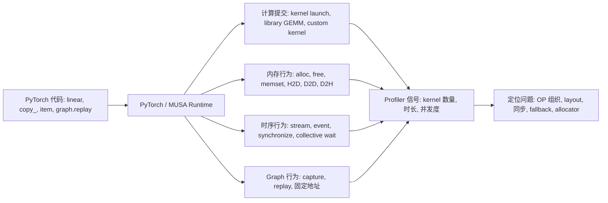
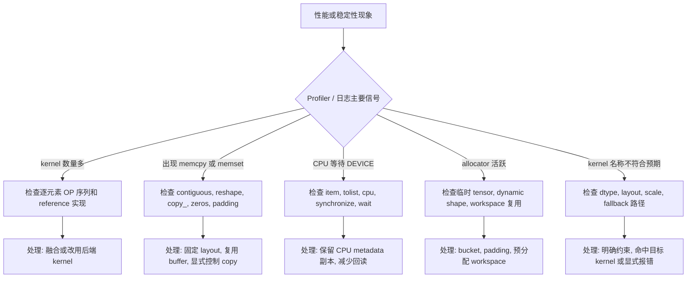
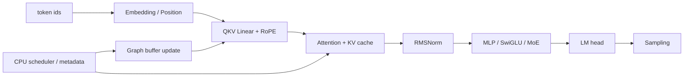
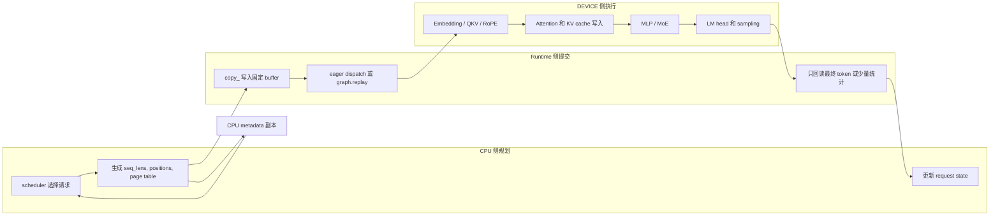
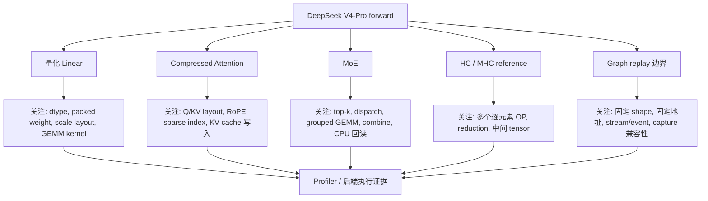
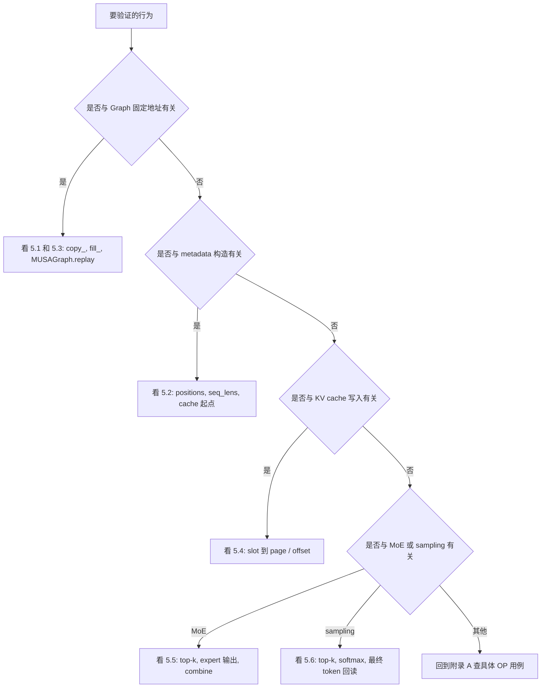
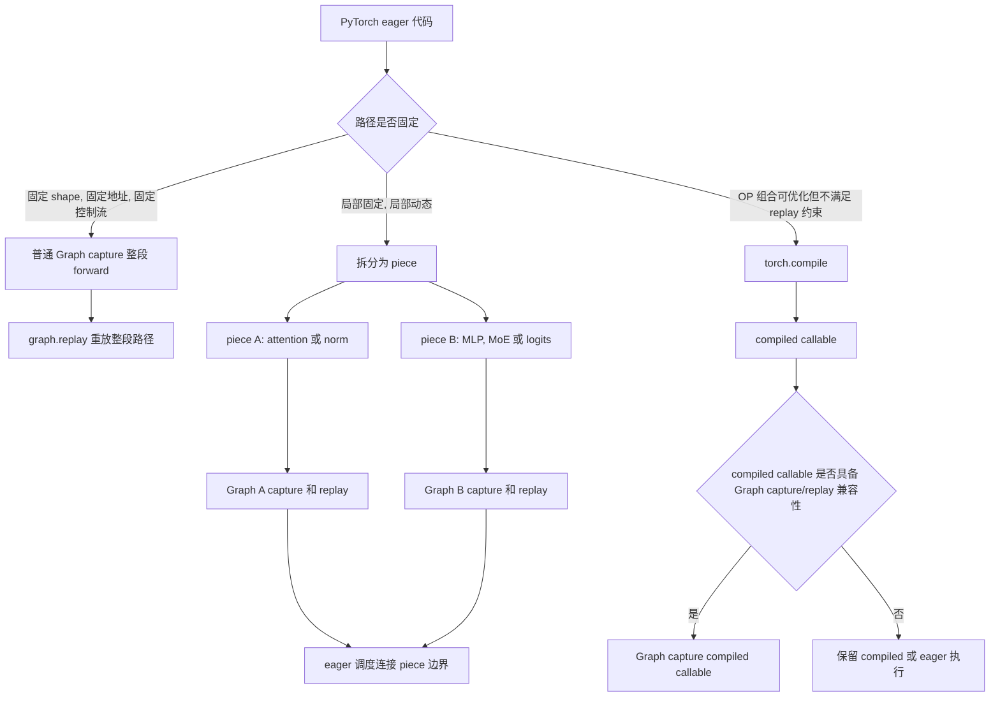
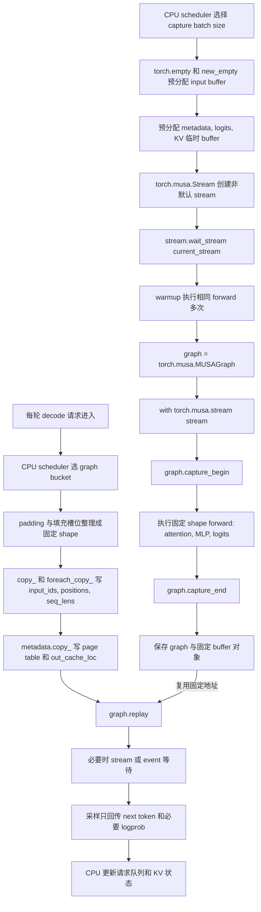
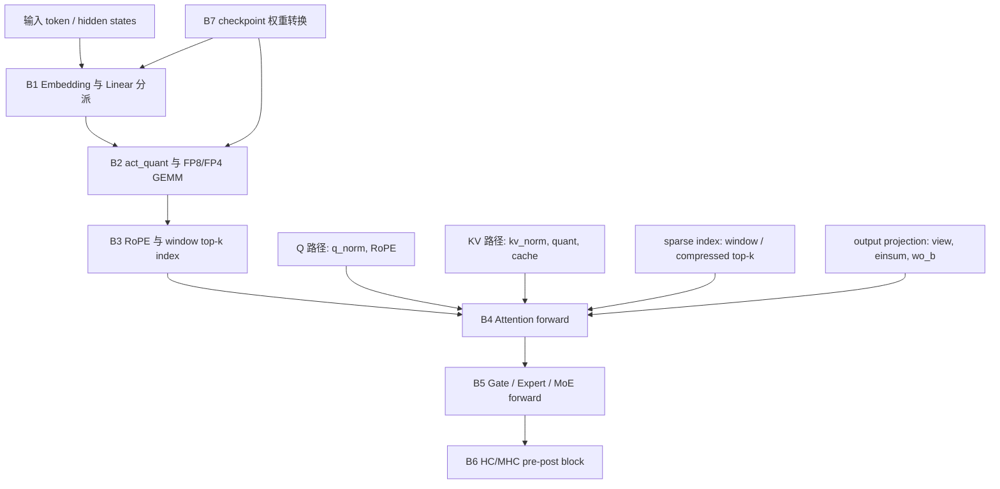

# PyTorch 常见 OP 分享：分类、性能与 DeepSeek V4 实践

## 文章提纲

本文围绕 PyTorch 常见 OP 展开，依次说明 OP 分类、Transformer 中的组织方式、DeepSeek V4-Pro 源码中的实际用法，以及 MUSA 最小用例验证。阅读顺序如下：

1. **PyTorch 常见 OP 分类**：将 OP 分为 GPU OP、CPU OP、Sync OP、Dynamic Shape OP 和 Graph OP，说明每类在推理路径中的职责、边界和常见 API。
2. **注意事项和性能问题**：围绕 layout、分配、由多个独立 kernel 执行的 OP 序列、CPU-DEVICE 同步、dynamic shape、dtype/量化和 Graph 约束说明常见风险。
3. **Transformer 架构中的 OP 组织**：从 token embedding 到 attention、KV cache、RMSNorm/MLP、logits/sampling，说明 forward 中各模块使用哪些 OP。
4. **DeepSeek V4-Pro 源码分析**：按 Linear、Attention、MoE、HC/MHC 和权重转换模块分析源码中用到的 OP，以及这些 OP 的组织方式。
5. **MUSA 最小用例与结果**：把前面出现的模块抽成可运行用例，展示输入、代码和 MUSA 执行输出。
6. **回顾总结**：给出 PyTorch OP 的检查顺序，覆盖功能语义、输入输出、内存行为、同步边界、Graph 约束和执行路径。

附录 A 保留 PyTorch 常见 OP 的详细用例和 MUSA 输出；附录 B 保留 DeepSeek V4-Pro 源码分析；附录 C 保留 DeepSeek V4 在 SGLang 中的源码分析。

## 阅读主线

阅读时建议先建立“上层 OP 到底层执行行为”的映射，再进入源码。重点不是记住每个 PyTorch API 的完整语义，而是识别这些 API 最终会表现成哪类计算、内存、同步或 Graph 行为。



后续章节可以按这条线阅读：先判断 OP 属于计算、layout、内存、同步还是 Graph 行为，再看它是否处在 decode 热点路径、CPU-DEVICE 边界或固定地址 replay 路径中。

## 1. PyTorch 常见 OP 如何分类

按执行位置和工程作用，PyTorch OP 分为 GPU OP、CPU OP、Sync OP、Dynamic Shape OP 和 Graph OP。不同类别对应不同的执行位置、输入输出约束、内存行为和同步行为。

`view` 通常只是零拷贝改 shape，`reshape` 在 stride 不兼容时会触发真实 copy。

`.item()` 读取 CPU 标量时只涉及 CPU侧访问，但作用在 DEVICE tensor 上会让 CPU 等待 DEVICE侧计算完成。

`copy_` 可用于普通赋值，也可用于 Graph replay 前更新固定地址 buffer。

### 1.1 GPU OP

GPU OP 作用于 DEVICE tensor，覆盖张量创建、layout 整理、索引映射、数学计算、线性代数、路由和 dtype/device 转换。它们是 Transformer forward、KV cache、MoE、sampling 和 Graph replay 的主体。

| 类别 | 常见 OP | 主要用途 | 注意事项 |
|------|---------|----------|--------------|
| 创建初始化 | `empty`、`new_empty`、`empty_like`、`zeros`、`ones`、`full` | 创建 input buffer、KV cache、logits、workspace | `empty` 不初始化；Graph replay 中不要替换 capture 过的 tensor 对象 |
| 原地更新 | `copy_`、`_foreach_copy_`、`fill_`、`zero_`、`clamp_`、`masked_fill_` | 更新 metadata、清理 padding、写 graph buffer、裁剪激活 | 原地 OP 会覆盖输入；padding 槽位必须清理 |
| Shape/Layout | `view`、`reshape`、`flatten`、`unsqueeze`、`squeeze`、`expand`、`permute`、`transpose`、`contiguous` | QKV head layout、RoPE 输入、MoE expert 维度、kernel 输入布局 | `view` 要求 stride 兼容；`contiguous` 可能真实 copy；`expand` 不适合原地写 |
| 索引映射 | slice、advanced indexing、`gather`、`take_along_dim`、`index_select`、`scatter_` | KV page/slot、MoE dispatch/combine、sampling mask | index dtype/device 要匹配；重复写、越界和 mask 广播最容易出错 |
| 序列组合 | `arange`、`repeat_interleave`、`cat`、`stack`、`split`、`chunk`、`pad`、`where` | positions 展开、batch 拼接、gate/up 切分、bucket padding | 动态输出会影响 allocator、compile 和 Graph replay |
| 数学与激活 | `sum`、`mean`、`square`、`rsqrt`、`sigmoid`、`silu`、`gelu`、`relu`、`softmax`、`clamp` | RMSNorm、SwiGLU、attention/sampling、reference 实现 | 多个逐元素/归约 OP 分别调度时会带来多次 launch 和 HBM 读写 |
| 线性代数与路由 | `F.linear`、`matmul`、`mm`、`bmm`、`einsum`、`topk`、`sort`、`argmax` | QKV/O projection、MLP、LM head、MoE top-k、sampling | dtype、layout、scale、top-k shape 和排序稳定性要明确 |
| dtype/device | `to`、`float`、`half`、`bfloat16`、`int`、`long` | metadata dtype、BF16/FP8/FP4 路径、CPU/DEVICE 边界 | 避免 OP 间反复 cast；`to(device)` 可能引入 H2D/D2H copy |

### 1.2 CPU OP

CPU OP 服务调度和状态管理，不直接承担大张量计算。在线推理里，CPU侧负责 request queue、prefix cache、bucket 选择、KV block 管理、metadata 构造和协议输出；DEVICE侧负责 attention、MLP/MoE、logits 和 sampling 的张量计算。

| 类别 | 常见 OP | 典型场景 | 注意事项 |
|------|---------|----------|----------|
| Python 容器 | `list`、`dict`、`len`、`range`、`sort` | scheduler、request state、block table、prefix cache | 可以放在 Graph 外；不要驱动 decode 单步里的 DEVICE tensor 分支 |
| CPU tensor | `torch.tensor(..., device="cpu")`、CPU-side `max/sum` | `seq_lens_cpu`、batch size、bucket 选择 | CPU侧元数据副本要和 DEVICE侧 metadata 同步 |
| CPU-DEVICE 转换 | `.cpu()`、`.numpy()`、`.tolist()` | 日志、调试、最终 token、少量统计 | GPU tensor 回 CPU 通常会触发同步和 D2H copy |
| 标量读取 | `.item()`、`int(tensor)` | loss scalar、最终 token id、CPU侧决策标量 | 对 GPU tensor 高频调用会把异步执行变成 CPU 等待 |
| H2D metadata | `torch.as_tensor(..., device)`、`to(device)` | seq_lens、positions、page table 上传 | 高频路径要复用固定 buffer，避免零散小 tensor 上传 |

### 1.3 Sync OP

Sync OP 管理 CPU、DEVICE stream、Graph replay 和分布式 rank 的时序。它们本身不一定做数学计算，但会改变执行并行度。

| 类别 | 常见 API/OP | 合理用法 | 风险 |
|------|-------------|----------|------|
| 全设备同步 | `torch.cuda.synchronize()`、`torch.musa.synchronize()` | benchmark、错误定位、程序结束前等待 | 放进 decode 热点路径会打断 CPU/DEVICE 并行 |
| Stream/Event | `Stream`、`current_stream()`、`Event.record()`、`wait_event()` | copy/compute 编排、异步 H2D、局部依赖 | wait 范围过大等价于串行化 |
| Graph 边界 | `graph.replay()` 前后必要 wait | replay 前更新固定 buffer，读取输出前等待 | capture 内出现不支持的同步会失败 |
| 分布式同步 | `all_reduce`、`reduce_scatter`、`all_gather`、work wait | TP/EP/DP 通信、MoE expert 交换 | 过早 wait 会破坏通信与计算重叠 |
| 隐式同步 | `.item()`、`.tolist()`、`.cpu()` | 最终结果回传、低频统计 | 看起来不是同步 API，但会让 CPU 等 DEVICE |

### 1.4 Dynamic Shape OP

Dynamic Shape OP 的输出 shape 依赖输入数据内容。它们适合 eager 调试和 CPU 规划，但会增加 compile guard、Graph replay 固定 shape、通信 bucket 和 workspace 复用的复杂度。

| 类型 | 常见 OP | 使用场景 | 稳定化方式 |
|------|---------|----------|------------|
| 位置发现 | `nonzero`、`argwhere` | 找有效 token、稀疏 mask 调试 | 用 fixed mask + padding 保持 shape |
| 去重统计 | `unique`、`unique_consecutive` | expert/block/request 分布统计 | 在线路径优先 fixed capacity 或 histogram |
| Mask 压缩 | `masked_select`、boolean indexing | 抽取有效 token/logits | 延迟敏感路径用 `where` 保持原 shape |
| 动态切分拼接 | data-dependent `cat/split` | 动态 batch、变长 request | scheduler 侧 bucket + padding |
| 数据依赖索引 | mask 后 `gather/index_select` | MoE token 选择、KV block 选择 | 固定 top-k、padded index、sentinel |

### 1.5 Graph OP

Graph OP 用于固定 shape、固定地址、固定执行序列的 replay。Graph 不会让单个数学 OP 自动变快，它减少的是 Python 调度和 kernel launch 开销，适合小 batch、多 kernel、重复执行的 decode 路径。

| 阶段 | 常见 API/OP | 用法 | 注意事项 |
|------|-------------|------|----------|
| 预分配 | `empty`、`new_empty`、`zeros` | capture 前创建固定 input/output/metadata buffer | replay 中不能替换 tensor 对象 |
| warmup/capture | `Stream`、`MUSAGraph`、`capture_begin/capture_end` | 用固定 shape 和固定地址执行一次 | allocator、kernel cache、backend 状态需要提前稳定 |
| 更新输入 | `copy_`、`_foreach_copy_`、`fill_`、`zero_` | replay 前只改 buffer 内容 | 新分配和对象替换会破坏 capture 假设 |
| 执行 | `graph.replay()` | 相同 bucket 下复用录制路径 | dynamic shape、CPU sync、不支持 capture 的调用会导致失败 |

## 2. OP 常见注意事项和性能问题

PyTorch OP 的性能问题通常来自五类行为：隐式 copy、临时分配、CPU-DEVICE 同步、动态 shape，以及未命中预期 kernel 或 fallback 路径。

排查时先看 profiler 中的可见信号，再回到源码定位对应 OP。不要只看 Python 代码是否简洁，要判断它是否引入了额外 kernel、copy、同步、分配或 fallback。



### 2.1 Layout 与隐式 Copy

`view/reshape/transpose/permute/contiguous` 是 Transformer 中最常见的 layout OP。`view` 通常是零拷贝，但要求 stride 兼容；`reshape` 在 stride 不兼容时可能分配新 tensor；`contiguous()` 会把非连续 layout 复制成连续内存。

QKV head layout、RoPE 输入、KV cache layout 和 custom kernel 输入都依赖这些 layout 结果。

| 现象 | 常见 OP | 根因 | 处理方式 |
|------|---------|------|----------|
| `reshape` 后延迟抖动 | `reshape`、`permute`、`transpose` | stride 不兼容导致隐式 copy | 能用 `view` 时优先 `view`；kernel 前显式检查 `stride/is_contiguous` |
| kernel 前多一次 copy | `contiguous()` | 目标 kernel 只支持连续输入 | 把 layout 转换前移、复用转换结果，或融合到 kernel 内 |
| broadcast 写错 | `expand` + inplace OP | expanded tensor 可能是 zero-stride view | 不对 expanded view 原地写，必要时先 `clone/contiguous` |

### 2.2 分配、初始化与 Buffer 生命周期

`empty/new_empty/empty_like` 只分配内存，不初始化。高频推理路径经常用它们预分配 workspace，后续 kernel 必须完整写入。

Graph replay 还要求 input/output/metadata tensor 的对象地址保持不变。replay 前应使用 `copy_/fill_/zero_` 更新内容，而不是创建新 tensor。

| 场景 | 推荐方式 | 风险 |
|------|----------|------|
| graph input/output | capture 前预分配，replay 前 `copy_` 更新内容 | replay 中替换 tensor 对象会破坏固定地址 |
| padding 槽位 | replay 前 `fill_/zero_` 清理 | 残留值会影响 attention mask、cache 或 logits |
| 临时 workspace | 按 batch/seq bucket 复用 | 每步分配增加 allocator 开销和地址不稳定 |

### 2.3 由多个独立 kernel 执行的 OP 序列

RMSNorm、SwiGLU、attention softmax 和 MoE combine 常用多个 PyTorch OP 表达 reference 语义。reference 实现便于验证数学逻辑，但每个 OP 往往会单独触发 kernel launch，并读写中间 tensor。

在线热点路径通常需要 fused kernel 或后端原生 kernel 承担同一段计算。

| OP 序列 | 语义 | 性能问题 |
|-------|------|----------|
| `square -> mean -> rsqrt -> mul` | RMSNorm / Q norm | 多次读取 hidden states，多次 launch |
| `chunk -> silu -> clamp -> mul` | SwiGLU | 中间 tensor 多，激活、裁剪和乘法分别执行 |
| `softmax -> matmul` | attention reference | score tensor 大，占显存和带宽 |
| `where/nonzero -> index_select -> scatter` | MoE dispatch/combine | token 数动态，allocator 和调度复杂 |
| `topk -> gather -> normalize` | MoE routing / sampling | top-k shape、排序和 dtype 会传导到后续 kernel |

### 2.4 CPU-DEVICE 同步边界

`.item()`、`.tolist()`、`.cpu()`、`.numpy()` 是最容易被忽略的同步来源。对 CPU tensor 调用它们通常没问题；对 GPU/MUSA tensor 调用时，CPU 需要等待前序 DEVICE 计算完成，再做 D2H 拷贝或标量读取。

| API | 合理位置 | 风险位置 |
|-----|----------|----------|
| `.item()` | CPU侧元数据副本、最终标量、benchmark 结束 | GPU seq_lens、GPU logits、Graph 内部分支 |
| `.tolist()` | CPU scheduler 的长度列表、最终 token 列表 | GPU 上 `bincount` 后回读并驱动 Python expert loop |
| `.cpu()` | 最终输出、少量 logprob、离线分析 | 完整 logits、hidden states、KV metadata |
| `synchronize()` | profiling 边界、错误定位 | decode 单步、通信计算重叠区 |

### 2.5 Dynamic Shape、Compile 与 Graph

`nonzero/unique/masked_select`、mask 后变长 `index_select`、数据相关 `cat/split` 会让输出 shape 随输入内容变化。它们在 eager 模式表达力强，但会让 `torch.compile` 产生 guard 或 graph break，也会破坏 Graph replay 的固定 shape/固定地址约束。

| 动态来源 | 典型 OP | 更稳定的表达 |
|----------|---------|--------------|
| 有效 token 数变化 | `nonzero`、boolean indexing | fixed mask + padding |
| expert 负载变化 | `where`、`bincount(...).tolist()` | fixed top-k、固定 expert capacity、padded metadata |
| request 长度变化 | data-dependent `cat/split` | CPU scheduler bucket + fixed metadata |
| sparse index 数量变化 | 动态 `topk(k)` | 固定 k，超出部分用 sentinel/padding |

### 2.6 dtype、量化与 Fallback

BF16/FP16/FP8/FP4、activation scale、weight scale、block size、packed layout 和输出 dtype 是一组接口约束。`to(dtype)` 不只是精度转换，也可能改变 kernel 路径、Graph capture 能力和数值误差分布。

| 问题 | 表现 | 处理方式 |
|------|------|----------|
| dtype/layout 不匹配 | fallback 到 PyTorch reference 或通用 kernel | 打印/统计执行路径，确认输入满足 kernel 约束 |
| scale layout 不匹配 | FP8/FP4 GEMM 结果错误或性能异常 | 固定 block size，明确 scale shape、stride 和连续性 |
| 反复 cast | 多余 `float/half/bfloat16/to` | 在模块边界集中转换 |
| silent fallback | 语义正确但性能异常 | 对不支持组合显式报错或受控 fallback |

## 3. Transformer 架构中的 OP 组织

从 OP 角度看，Transformer 的主干计算按层重复展开：token id 先进入 embedding 和 position/RoPE，hidden states 经过 attention 与 KV cache，再进入 RMSNorm、MLP/SwiGLU 或 MoE，最后生成 logits 并完成 sampling。

训练路径还包括 loss、backward、optimizer 和分布式通信；推理路径更关注 KV cache、Graph replay、CPU scheduler 和 sampling 边界。



可以先把 decode 单步拆成 CPU 规划、Runtime 提交和 DEVICE 执行三段。这样读后面的 attention、MoE 和 Graph 代码时，能先判断某段逻辑位于哪个边界。



一层典型 Transformer block 的源码结构可以简化为以下形式。3.1 到 3.5 按同一顺序拆解各段源码中的 OP：

```python
def transformer_forward(input_ids, positions, attn_mask, kv_cache):
    # token id 先查表得到 hidden states，后续所有 block 都围绕 hidden 更新。
    hidden = embed_tokens(input_ids)
    for layer in layers:
        # attention 子层：norm -> attention -> residual add。
        residual = hidden
        hidden = layer.input_norm(hidden)
        attn_out, kv_cache = layer.attention(hidden, positions, attn_mask, kv_cache)
        hidden = residual + attn_out

        # MLP/MoE 子层：再次 norm 后更新 hidden。
        residual = hidden
        hidden = layer.post_attention_norm(hidden)
        hidden = residual + layer.mlp(hidden)

    # decode 常只取最后一个 token 做 LM head 和 sampling。
    hidden = final_norm(hidden)
    logits = lm_head(hidden[:, -1])
    next_token = sample(logits)
    return next_token, kv_cache
```

源码中的 OP 组织分为三个层次：数学语义，例如 `linear`、`softmax`、`silu`、`sum`；layout 和 metadata，例如 `view`、`transpose`、`arange`、`copy_`；服务边界，例如 `.cpu()`、Graph replay、KV cache page 写入。

分析性能问题时，要同时看 OP 本身和它所在的位置。同一个 OP 出现在高频路径、动态 shape 路径或 CPU-DEVICE 边界时，对 kernel launch、内存分配、同步等待和数据拷贝的影响会明显不同。

### 3.1 Embedding、Position 与 RoPE

Embedding 阶段把离散 token id 变成 hidden states，position 阶段生成每个 token 的位置信息，RoPE 把 position 注入 Q/K 的部分维度。常见 OP 是 `embedding`、`arange`、`repeat_interleave`、`to(int32/int64)`、`view/unsqueeze`、`sin/cos`、`mul/add`。

典型源码：

```python
def embedding_and_rope(input_ids, q, k, start_pos, freqs_cis):
    # 把离散 token id 映射成连续 hidden states。
    hidden = F.embedding(input_ids, embed_weight)

    # 为本轮 token 生成连续 position id，prefill 与 decode 都依赖该范围。
    positions = torch.arange(
        start_pos,
        start_pos + input_ids.numel(),
        device=input_ids.device,
        dtype=torch.long,
    )

    # Q/K projection 输出整理成 attention head layout。
    q = q.view(-1, num_heads, head_dim)
    k = k.view(-1, num_kv_heads, head_dim)

    # 只拆出需要 RoPE 的维度，其余维度保持 pass-through。
    q_rope, q_pass = q[..., :rope_dim], q[..., rope_dim:]
    k_rope, k_pass = k[..., :rope_dim], k[..., rope_dim:]

    # positions 查表得到旋转频率，unsqueeze 补 head 维用于 broadcast。
    freqs = freqs_cis[positions].unsqueeze(1)
    q_rope = apply_rotary(q_rope, freqs)
    k_rope = apply_rotary(k_rope, freqs)

    # 拼回完整 head_dim，供 attention kernel 消费。
    q = torch.cat([q_rope, q_pass], dim=-1)
    k = torch.cat([k_rope, k_pass], dim=-1)
    return hidden, positions, q, k
```

源码解析：

- `F.embedding` 的输入是 token id，输出是 `[tokens, hidden]`；token id dtype 和 device 不匹配会直接影响查表。
- `torch.arange` 生成 position id，prefill 常生成一段连续位置，decode 常只生成新增 token 的位置。
- `view` 把 Q/K 从扁平 hidden 维整理成 head layout；如果上游 projection 输出 layout 不兼容，后面需要显式处理 `contiguous()`。
- `unsqueeze(1)` 给 RoPE 频率补 head 维，依赖 broadcast；它通常不复制数据。
- `cat` 把 RoPE 维和 pass-through 维拼回完整 head_dim；拼接会产生新 tensor，热点路径常由 fused RoPE 或 attention prepare kernel 处理。

| 子模块 | 常见 OP | 组织方式 | 注意事项 |
|--------|---------|----------|----------|
| Token embedding | `F.embedding`、indexing | token id -> `[tokens, hidden]` | token id dtype 通常是 int64/int32，device 要一致 |
| Position | `arange`、`repeat_interleave`、`cat` | 生成 prefill/decode positions | 变长请求通常在 CPU scheduler 侧整理成固定 metadata |
| RoPE | `view/reshape`、`unsqueeze`、`mul/add` | Q/K 按 head_dim 拆分后旋转 | layout 要匹配 attention kernel；避免不必要 `contiguous()` |

### 3.2 Attention 与 KV Cache

Attention 是 OP 组织最密集的模块：`F.linear/matmul` 生成 Q/K/V，`view/transpose/unflatten` 整理 head layout，RoPE 更新 Q/K，attention kernel 读取 Q/K/V 和 metadata，KV cache 通过 indexing 或 custom kernel 写入 page/slot。

典型源码：

```python
def attention_forward(hidden, attn_mask, kv_cache, slot_mapping):
    # 一次 linear 生成 Q/K/V，再沿 hidden 维切分。
    qkv = F.linear(hidden, qkv_weight, qkv_bias)
    q, k, v = qkv.chunk(3, dim=-1)

    # 转成 [batch, heads, seq, head_dim]，匹配 attention 计算布局。
    q = q.view(batch, seq, num_heads, head_dim).transpose(1, 2)
    k = k.view(batch, seq, num_kv_heads, head_dim).transpose(1, 2)
    v = v.view(batch, seq, num_kv_heads, head_dim).transpose(1, 2)

    # slot_mapping 映射到 paged KV cache 的 page 与 page 内 offset。
    page_idx = torch.div(slot_mapping, page_size, rounding_mode="floor")
    page_offset = slot_mapping % page_size

    # 写 cache 前恢复 token-major layout，保证 token 与 slot 一一对应。
    k_for_cache = k.transpose(1, 2).reshape(-1, num_kv_heads, head_dim)
    v_for_cache = v.transpose(1, 2).reshape(-1, num_kv_heads, head_dim)
    kv_cache[page_idx, page_offset, 0] = k_for_cache
    kv_cache[page_idx, page_offset, 1] = v_for_cache

    # reference attention：显式生成 score/prob，便于校验语义。
    scores = torch.matmul(q, k.transpose(-2, -1)) * scale
    scores = scores.masked_fill(attn_mask, float("-inf"))
    probs = torch.softmax(scores, dim=-1)
    out = torch.matmul(probs, v)

    # 输出恢复到 hidden layout，再进入 output projection。
    out = out.transpose(1, 2).contiguous().view(batch, seq, hidden_size)
    return F.linear(out, o_weight), kv_cache
```

源码解析：

- `F.linear` 生成 QKV，是 attention 的主要 GEMM 入口；量化模型还要看 activation scale、weight scale 和 packed layout。
- `chunk(3, dim=-1)` 按 hidden 最后一维切分 Q/K/V，要求 qkv projection 输出维度严格匹配。
- `view + transpose` 把 `[batch, seq, hidden]` 变成 `[batch, heads, seq, head_dim]`；`transpose` 后通常是非连续 layout。
- `slot_mapping -> div/% -> advanced indexing` 表达 Paged KV cache 写入，page index、offset 和 token 顺序必须一致。
- `matmul -> masked_fill -> softmax -> matmul` 是 attention reference 实现；大模型在线推理通常用 fused attention kernel 避免显式 materialize 大 score tensor。
- `transpose(...).contiguous().view(...)` 是 attention 输出回到 hidden layout 的常见写法，`contiguous()` 可能成为额外 copy。

| 子模块 | 常见 OP | 组织方式 | 注意事项 |
|--------|---------|----------|----------|
| QKV projection | `F.linear`、`matmul` | hidden -> Q/K/V | dtype、weight layout、activation scale 决定执行路径 |
| Head layout | `view`、`unflatten`、`transpose`、`contiguous` | `[tokens, hidden]` -> `[tokens, heads, head_dim]` | stride 不匹配会触发 copy 或 kernel 输入错误 |
| Mask/score | `where`、`masked_fill`、`softmax`、`matmul/einsum` | reference attention 或小规模验证 | 大规模在线推理通常由 fused attention kernel 执行 |
| KV cache | advanced indexing、`copy_`、`scatter_`、`div/%` | token slot -> page/offset | page index、offset、dtype 和越界检查要明确 |

### 3.3 RMSNorm、MLP 与 SwiGLU

RMSNorm reference 通常是 `square -> mean -> rsqrt -> mul`；MLP/SwiGLU 通常是 `linear -> chunk/split -> silu/sigmoid/gelu -> mul -> linear`。这些 reference 计算序列能清楚表达数学语义，但在线热点路径通常需要 fused kernel 或后端原生 kernel。

典型源码：

```python
def rmsnorm_mlp(hidden, residual):
    # norm 计算使用 FP32，降低 reduction 的数值误差。
    x = hidden.float()
    rstd = torch.rsqrt(x.square().mean(dim=-1, keepdim=True) + eps)
    normed = (x * rstd).to(hidden.dtype) * norm_weight

    # gate/up 共用一次 projection，再按最后一维拆分。
    gate_up = F.linear(normed, gate_up_weight)
    gate, up = gate_up.chunk(2, dim=-1)

    # SwiGLU：SiLU(gate) 与 up 逐元素相乘。
    gate = F.silu(gate)
    intermediate = gate * up

    # down projection 后与 residual 相加。
    out = F.linear(intermediate, down_weight)
    return residual + out
```

源码解析：

- `float()` 常用于提升 norm 计算精度，但会引入 dtype 转换；输出通常再 cast 回模型 dtype。
- `square -> mean -> rsqrt -> mul` 直接表达 RMSNorm，但会产生多个逐元素/归约 OP。
- `F.linear` 生成 gate/up 两路，再用 `chunk` 切开；`chunk` 返回 view，后续 OP 共享上游 storage 视图。
- `silu(gate) * up` 是 SwiGLU 的计算语义；如果有 `clamp_`，它会原地覆盖 gate/up 分支。
- `residual + out` 是残差加法，训练中还会影响 autograd 保存 tensor；推理中通常关注是否能与 norm 或 projection 融合。

| 子模块 | 常见 OP | 组织方式 | 注意事项 |
|--------|---------|----------|----------|
| RMSNorm | `square`、`mean`、`rsqrt`、`mul` | hidden 归一化 | reduction 维度和 eps 要固定；多个小 OP 容易 launch 多 |
| Gate/Up | `F.linear`、`chunk`、`split` | hidden -> gate/up | split 后 view 的 layout 要满足后续激活 |
| SwiGLU | `silu`、`sigmoid`、`clamp`、`mul` | activation(gate) * up | `clamp_` 是原地写，会覆盖输入 |
| Down projection | `F.linear`、`matmul` | intermediate -> hidden | 量化路径要关注 scale 和 packed weight |

### 3.4 MoE Routing、Expert 与 Combine

MoE 在 Transformer 中把 MLP 替换为多个 expert。Router 先用 `linear/softmax/topk/gather` 选 expert，dispatch 把 token 发到 expert，expert MLP 计算后再 combine。

reference 代码常用 `where/index_select/scatter/sum` 表达语义；高性能实现会把 dispatch、grouped GEMM 和 combine 融合或批处理。

典型源码：

```python
def moe_forward(hidden):
    # router 把每个 token 映射到 expert 分数。
    router_logits = F.linear(hidden, router_weight)
    router_probs = torch.softmax(router_logits, dim=-1)

    # 选择每个 token 的 top-k expert，并归一化路由权重。
    topk_weight, topk_id = torch.topk(router_probs, k=num_experts_per_token, dim=-1)
    topk_weight = topk_weight / topk_weight.sum(dim=-1, keepdim=True)

    # output 用于按 token 累加各 expert 的加权结果。
    output = torch.zeros_like(hidden)
    for expert_id in range(num_experts):
        # 找到路由到当前 expert 的 token；输出长度由数据决定。
        token_idx, choice_idx = torch.where(topk_id == expert_id)
        if token_idx.numel() == 0:
            continue
        # reference 写法使用 advanced indexing 做 dispatch 和 combine。
        expert_in = hidden[token_idx]
        expert_out = experts[expert_id](expert_in)
        output[token_idx] += expert_out * topk_weight[token_idx, choice_idx].unsqueeze(-1)
    return output
```

源码解析：

- `F.linear -> softmax -> topk` 把 dense expert score 变成固定 top-k expert id 和权重。
- `topk_weight / sum(...)` 做权重归一化，`keepdim=True` 保证 broadcast shape 稳定。
- `zeros_like` 创建输出 buffer；如果后续路径没有完整覆盖，初值会影响 combine 结果。
- `where(topk_id == expert_id)` 产生动态长度索引，reference 代码可读，但不适合 Graph replay 内部。
- `hidden[token_idx]` 和 `output[token_idx] += ...` 是 advanced indexing；重复 index、累加顺序和 dtype 都会影响数值。
- 在线推理常把 token dispatch、grouped GEMM 和 combine 放进融合或批处理实现，避免 Python expert loop 和动态小 GEMM。

| 阶段 | 常见 OP | 组织方式 | 注意事项 |
|------|---------|----------|----------|
| Router score | `linear`、`softmax/sigmoid` | hidden -> expert score | score dtype 和归一化方式要与模型配置一致 |
| Expert 选择 | `topk`、`gather` | score -> top-k id/weight | top-k 输出 shape 建议固定 |
| Dispatch | `where`、`index_select`、`scatter_`、`bincount` | token -> expert bucket | 动态 token 数会影响 Graph 和通信 bucket |
| Expert MLP | grouped GEMM、`silu`、`mul` | expert hidden -> expert output | 多 expert 小 GEMM 容易低利用率 |
| Combine | `unsqueeze`、broadcast、`sum`、all-reduce | expert output -> token output | 权重 shape、重复 expert 和通信 wait 点要明确 |

### 3.5 Logits、Sampling 与 Graph Replay

LM head 用 `F.linear/matmul` 把 hidden 映射到 vocab logits；sampling 用 `softmax/topk/argmax/where` 选择 token。在线服务应避免频繁将完整 logits 拉回 CPU，CPU侧只保留最终 token、少量 logprob 和统计信息。

decode 阶段还会把 input、positions、seq_lens、page table 等写入固定 buffer，再通过 Graph replay 执行固定路径。

典型源码：

```python
def decode_step(input_ids, positions, fixed_buffers, graph=None):
    # replay 前只更新固定 buffer 内容，不替换 tensor 对象。
    fixed_buffers.input_ids[: input_ids.numel()].copy_(input_ids)
    fixed_buffers.positions[: positions.numel()].copy_(positions)
    fixed_buffers.seq_lens.fill_(1)

    if graph is not None:
        # graph 内复用 capture 时记录的 kernel 顺序和 tensor 地址。
        graph.replay()
        logits = fixed_buffers.logits
    else:
        # eager 路径用于对照验证或未 capture 的场景。
        hidden = model_forward(fixed_buffers.input_ids, fixed_buffers.positions)
        logits = F.linear(hidden[:, -1], lm_head_weight)

    # sampling 留在 DEVICE侧，仅最终 token 回传 CPU。
    topk_vals, topk_ids = torch.topk(logits, k=top_k, dim=-1)
    probs = torch.softmax(topk_vals / temperature, dim=-1)
    next_token = topk_ids[:, 0]
    return next_token.cpu().tolist(), probs
```

源码解析：

- `copy_` 把真实请求写入固定 input buffer，服务 Graph replay 的固定地址约束。
- `fill_` 用于清理或初始化固定 metadata；如果 padding 槽位残留旧值，attention 和 logits 都可能被污染。
- `graph.replay()` 复用固定 shape 和固定执行序列，减少 Python 调度和 launch 开销。
- `F.linear(hidden[:, -1], lm_head_weight)` 表示只对最后一个 token 做 LM head，是 decode 常见优化。
- `topk -> softmax` 保留在 DEVICE侧；`.cpu().tolist()` 只回传最终 token，避免把完整 logits 拉回 CPU。

| 场景 | 常见 OP | 组织方式 | 注意事项 |
|------|---------|----------|----------|
| LM head | `F.linear`、`matmul` | hidden -> vocab logits | vocab 大，显存和带宽压力高 |
| Sampling | `topk`、`softmax`、`argmax`、`where` | logits -> next token | 候选数量动态会影响 graph/compile |
| CPU 边界 | `.cpu()`、`.tolist()`、`.item()` | 只回传最终 token/少量统计 | 避免完整 logits 回 CPU |
| Graph replay | `copy_`、`fill_`、`zero_`、`graph.replay()` | replay 前更新固定 buffer | shape、地址和执行序列必须固定 |

## 4. DeepSeek V4-Pro 源码中的 OP 组织

DeepSeek V4-Pro 在 Transformer OP 基础上叠加了更多约束：量化 Linear 引入 FP8/FP4、activation scale 和 packed weight；Compressed Attention 引入 sparse index、compressed KV 和 `topk/where/cat`；MoE 引入 router、top-k expert、dispatch/combine。

HC/MHC 用 reference 计算序列表达可验证语义。

正文只保留必要片段，完整源码摘录放在附录 B。

阅读 DeepSeek V4-Pro 源码时，先按模块识别对应的执行行为，再读具体代码。量化 Linear 主要对应 GEMM 路径选择，Attention 主要对应 layout、sparse index 和 KV cache，MoE 主要对应动态路由和多个 expert 计算，Graph 主要对应固定地址 replay。



### 4.1 量化 Linear：dtype 分派、activation scale 与 packed weight

DeepSeek V4-Pro 的 `linear` 根据权重 dtype 选择执行路径：FP4/FP8 权重先对 activation 做 `act_quant`，再进入量化 GEMM；普通权重才走 PyTorch reference。

```python
def linear(x: torch.Tensor, weight: torch.Tensor, bias: Optional[torch.Tensor] = None) -> torch.Tensor:
    # 该实现只覆盖无 bias 路径，量化 GEMM 接口不接收 bias。
    assert bias is None

    # FP4/FP8 权重先量化 activation，再调用对应 GEMM wrapper。
    if weight.dtype == torch.float4_e2m1fn_x2:
        x, s = act_quant(x, block_size, scale_fmt, scale_dtype)
        return fp4_gemm(x, s, weight, weight.scale, scale_dtype)
    elif weight.dtype == torch.float8_e4m3fn:
        x, s = act_quant(x, block_size, scale_fmt, scale_dtype)
        return fp8_gemm(x, s, weight, weight.scale, scale_dtype)
    else:
        # 普通 dtype 使用 PyTorch dense linear 作为 reference/fallback。
        return F.linear(x, weight)
```

| 位置 | 主要 OP | 组织方式 | 注意事项 |
|------|---------|----------|----------|
| 参数创建 | `torch.empty` | 创建 packed FP4/FP8 weight 和 scale tensor | `empty` 后必须由权重加载完整写入 |
| activation 量化 | `act_quant`、`to(dtype)` | BF16/FP32 activation -> quant activation + scale | block size、scale dtype 和 layout 是接口约束 |
| GEMM | `fp4_gemm/fp8_gemm` | quant activation + quant weight + scale -> output | packed layout、scale shape 和输出 dtype 要一致 |
| reference | `F.linear` | 普通 dtype 或 fallback 路径 | 可以验证语义，但热点路径要确认是否进入预期执行路径 |

### 4.2 Compressed Attention：layout、RoPE、top-k index 与 sparse kernel

Attention 模块先生成 Q/KV，再做 head layout、RoPE、Q norm、KV quant 和 sparse/compressed index，最后调用 sparse attention kernel。这些 PyTorch OP 主要用于组织输入，而不是单独完成完整 attention 计算。

```python
# Q 路径：projection 后整理成 head layout，并只对 RoPE 维旋转。
q = self.wq_b(qr)
q = q.unflatten(-1, (self.n_local_heads, self.head_dim))
apply_rotary_emb(q[..., -rd:], freqs_cis)
q *= torch.rsqrt(q.square().mean(-1, keepdim=True) + self.eps)

# KV 路径：norm、RoPE 和非 RoPE 维原地量化。
kv = self.wkv(x)
kv = self.kv_norm(kv)
apply_rotary_emb(kv[..., -rd:], freqs_cis)
act_quant(kv[..., :-rd], 64, scale_fmt, scale_dtype, True)

# sparse attention index 由窗口 index 和压缩 index 拼成。
topk_idxs = get_window_topk_idxs(win, bsz, seqlen, start_pos)
if self.compress_ratio:
    compress_topk_idxs = self.indexer(x, qr, start_pos, offset)
    topk_idxs = torch.cat([topk_idxs, compress_topk_idxs], dim=-1)
topk_idxs = topk_idxs.int()

# attention kernel 直接消费 Q、KV、sink 和 sparse index。
o = sparse_attn(q, kv, self.attn_sink, topk_idxs, self.softmax_scale)
```

| 模块 | 主要 OP | 组织方式 | 注意事项 |
|------|---------|----------|----------|
| Q layout | `unflatten/view` | projection 输出 -> `[batch, seq, heads, head_dim]` | stride 不兼容会影响后续 kernel |
| Q norm | `square`、`mean`、`rsqrt`、`mul_` | 对 Q 做 RMS-like normalization | 多个小 OP 可用于 reference，热点路径关注融合 |
| KV 路径 | `kv_norm`、`act_quant(..., inplace=True)` | KV norm 后对非 RoPE 维量化 | 原地量化要确认后续不需要原 BF16 值 |
| sparse index | `topk`、`where`、`cat`、`int` | window index + compressed index -> sparse index | `k`、sentinel `-1`、index dtype 要与 kernel 一致 |
| attention kernel | `sparse_attn` | 读取 Q/KV/topk index 输出 attention | layout、padding head、index 越界和 graph capture 都会影响稳定性 |

### 4.3 MoE：Router、Expert Dispatch 与 Combine

MoE 模块先用 gate 产生 `weights` 和 `indices`，再按 expert id 分发 token。reference 写法便于观察 OP 语义：`topk/gather` 生成固定 top-k expert，`where/indexing` 找到属于某个 expert 的 token，`sum/+=` 完成 combine。

```python
# gate 输出每个 token 的 top-k expert 权重和 expert id。
weights, indices = self.gate(x, input_ids.flatten())

# 使用 FP32 输出 buffer 累加各 expert 的结果。
y = torch.zeros_like(x, dtype=torch.float32)

# reference 路径把 expert 计数回读到 CPU，用于跳过空 expert。
counts = torch.bincount(indices.flatten(), minlength=self.n_routed_experts).tolist()
for i in range(self.experts_start_idx, self.experts_end_idx):
    if counts[i] == 0:
        continue
    # 找出路由到当前 expert 的 token，并按对应 top-k 权重执行 expert。
    idx, top = torch.where(indices == i)
    y[idx] += self.experts[i](x[idx], weights[idx, top, None])

# shared expert 输出与 routed expert 输出合并。
y += self.shared_experts(x)
```

| 阶段 | 主要 OP | 组织方式 | 注意事项 |
|------|---------|----------|----------|
| Router | `linear`、`softmax/sigmoid/softplus` | hidden -> expert score | score 函数和归一化要匹配模型配置 |
| Top-k | `topk`、`gather` | expert score -> top-k id/weight | top-k shape 固定，便于后续 kernel 和 metadata |
| 统计 | `bincount(...).tolist()` | 统计每个 expert token 数 | GPU tensor 回 CPU 会同步；适合 reference，不适合热点路径 |
| Dispatch | `where`、advanced indexing | 按 expert id 选 token | 输出 token 数动态，会影响 Graph 和 workspace |
| Combine | `+=`、broadcast、`sum` | expert output 按权重回写 token | 重复 index、dtype 和累加顺序会影响数值 |

### 4.4 HC/MHC：Reference 计算序列如何表达数学语义

HC/MHC 模块使用 PyTorch 基础 OP 表达 reference 语义：先 flatten hidden，转成 float，做 RMS-like normalization，再用 `F.linear` 生成 mixing 参数，最后通过 broadcast 和 `sum` 合成输出。

该 reference 实现适合语义验证，也会产生多次 kernel launch 和中间 tensor 读写。

```python
# 合并 HC copy 维后的 hidden 用于计算 mixing 参数。
x = x.flatten(2).float()

# RMS-like scale 控制 mixing 参数幅度。
rsqrt = torch.rsqrt(x.square().mean(-1, keepdim=True) + self.norm_eps)
mixes = F.linear(x, hc_fn) * rsqrt

# split/sinkhorn 生成 pre、post 和 comb 三组 HC 参数。
pre, post, comb = hc_split_sinkhorn(
    mixes, hc_scale, hc_base, self.hc_mult, self.hc_sinkhorn_iters, self.hc_eps
)

# pre 权重作用在 HC copy 维上，sum 后回到普通 hidden。
y = torch.sum(pre.unsqueeze(-1) * x.view(shape), dim=2)
```

| 阶段 | 主要 OP | 组织方式 | 注意事项 |
|------|---------|----------|----------|
| 展平 | `flatten`、`view` | 多维 hidden -> 线性输入 | `view` 需要 layout 兼容 |
| 归一化 | `float`、`square`、`mean`、`rsqrt` | 计算 per-token scale | cast 和 reduction 维度要明确 |
| mixing | `F.linear`、`mul` | hidden -> pre/post/comb 参数 | weight shape 和输出切分要匹配 |
| 合成 | `unsqueeze`、broadcast、`sum` | mixing 参数和 hidden 合成输出 | 多个 broadcast/归约 OP 会产生中间读写 |

### 4.5 权重转换与 Packed Layout

量化模型的运行时性能不只取决于 forward 里的 OP，也取决于加载阶段如何把 checkpoint 权重转换成运行时 layout。DeepSeek V4-Pro 的转换逻辑使用 `view(uint8)`、bit op、`stack`、`flatten`、`transpose` 等 OP 把 packed FP4 数据展开并重排。

```python
# packed FP4 先按 uint8 读取底层字节。
x = x.view(torch.uint8)

# 每个字节拆成 low/high 两个 nibble。
low = x & 0x0F
high = (x >> 4) & 0x0F

# 查表恢复两个 FP4 逻辑值，并展平成连续元素。
x = torch.stack([FP4_TABLE[low.long()], FP4_TABLE[high.long()]], dim=-1).flatten(2)

# 重排成运行时 GEMM 需要的 block/tile layout。
x = x.view(bOut, fp8_block_size, bIn, fp8_block_size).transpose(1, 2)
```

| 主要 OP | 组织方式 | 注意事项 |
|---------|----------|----------|
| `view(torch.uint8)` | 按字节解释 packed 数据 | 只改变解释方式，不等于数值转换 |
| bit op | 拆 low/high nibble | 要明确 endian、pack 顺序和 table 映射 |
| `stack/flatten` | 把两个半字节恢复成连续元素 | shape 变化必须和 block size 对齐 |
| `transpose/view` | 转成运行时 GEMM 需要的 tile layout | stride 和 contiguous 影响加载后 kernel 输入 |

## 5. MUSA 上的模块最小用例与验证输出

| 场景 | 章节 | 关注的主要 OP |
|------|------|--------------|
| 验证 graph replay 或 buffer 复用行为 | §5.1 | `copy_`, `fill_`, `zero_`, `MUSAGraph.replay()` |
| 验证 prefill metadata（positions 展开、cache 起始位置） | §5.2 | `arange`, `tolist()`, `repeat_interleave` |
| 验证 decode graph bucket 固定地址 + padding 正确性 | §5.3 | `MUSAGraph.replay()`, `copy_`, padding |
| 调试 Paged KV cache 写入 / page slot 映射 | §5.4 | advanced indexing, `div`, `%` |
| 验证 MoE routing 权重与 expert combine 路径 | §5.5 | `topk`, `softmax`, `unsqueeze`, `sum` |
| 验证 sampling 后处理不把完整 logits 或大概率表拉回 CPU | §5.6 | `.cpu()`, `.tolist()`, `softmax` |

面对长代码示例时，先按要验证的行为选择小节。每个用例只回答一个问题：这段上层 OP 在 MUSA 上是否按预期产生固定地址、同步、copy、layout 或路由行为。



### 5.1 主要 OP 序列的 MUSA 最小用例

本用例不依赖 SGLang 运行时对象，直接复现典型 OP 组合与执行边界：graph replay buffer 批量拷贝、metadata 原地 `copy_`、MUSA graph 固定地址 replay、HC pre/post reference 链，以及 SwiGLU clamp 路径。

```python
import torch
import torch.nn.functional as F
from dataclasses import dataclass


def fmt(t):
    # 打印 tensor 的 shape/dtype/device；小 tensor 同时打印数值，便于核对 MUSA 输出。
    if isinstance(t, torch.Tensor):
        if t.numel() <= 40:
            return f"shape={tuple(t.shape)}, dtype={str(t.dtype).replace('torch.', '')}, device={t.device}, value={t.detach().cpu().tolist()}"
        return f"shape={tuple(t.shape)}, dtype={str(t.dtype).replace('torch.', '')}, device={t.device}"
    return repr(t)


def grouped_foreach_copy(dsts, srcs):
    # 按 dtype 分组后批量 copy，模拟 replay 前多个固定 buffer 的集中更新。
    groups = {}
    for dst, src in zip(dsts, srcs):
        groups.setdefault((dst.dtype, src.dtype), ([], []))
        groups[(dst.dtype, src.dtype)][0].append(dst)
        groups[(dst.dtype, src.dtype)][1].append(src)
    for group_dsts, group_srcs in groups.values():
        torch._foreach_copy_(group_dsts, group_srcs)


@dataclass
class RawDecodeMetadata:
    # 只保留 decode replay 需要的三个 metadata tensor。
    req_pool_indices: torch.Tensor
    seq_lens: torch.Tensor
    out_cache_loc: torch.Tensor

    def copy_(self, other):
        # 原地复制字段内容，保持 capture 时绑定的 tensor 对象不变。
        self.req_pool_indices.copy_(other.req_pool_indices)
        self.seq_lens.copy_(other.seq_lens)
        self.out_cache_loc.copy_(other.out_cache_loc)


def hc_pre_reference(x, hc_fn, eps=1e-5):
    # HC pre reference：展平多 copy hidden，生成 pre/post/comb 参数。
    shape, dtype = x.size(), x.dtype
    x_flat = x.flatten(1).float()
    rstd = torch.rsqrt(x_flat.square().mean(-1, keepdim=True) + eps)
    mixes = (F.linear(x_flat, hc_fn) * rstd).unsqueeze(1)
    pre = torch.sigmoid(mixes[:, :, : shape[1]])
    post = torch.sigmoid(mixes[:, 0, shape[1] : 2 * shape[1]])
    comb_raw = mixes[:, 0, 2 * shape[1] : 2 * shape[1] + shape[1] * shape[1]]
    comb = comb_raw.view(shape[0], shape[1], shape[1]).softmax(dim=1)
    y = (pre.squeeze(1).unsqueeze(-1) * x_flat.view(shape)).sum(dim=1)
    return y.to(dtype), post.to(dtype), comb.to(dtype)


def hc_post_reference(x, residual, post, comb):
    # HC post reference：把当前输出和 residual 按 post/comb 合成回多 copy 状态。
    return (
        post.unsqueeze(-1) * x.unsqueeze(1)
        + (comb.unsqueeze(-1) * residual.unsqueeze(2)).sum(dim=1)
    ).type_as(x)


device = torch.device("musa:0")
# 1. replay buffer：模拟 DecodeInputBuffers.populate_from_forward_batch。
input_ids = torch.zeros(4, dtype=torch.int64, device=device)
req_pool_indices = torch.zeros(2, dtype=torch.int64, device=device)
seq_lens = torch.empty(2, dtype=torch.int32, device=device)
out_cache_loc = torch.empty(4, dtype=torch.int64, device=device)
seq_lens.fill_(1)
out_cache_loc.zero_()
grouped_foreach_copy(
    [input_ids[:3], req_pool_indices[:2], seq_lens[:2], out_cache_loc[:3]],
    [
        torch.tensor([11, 12, 13], device=device),
        torch.tensor([7, 8], device=device),
        torch.tensor([5, 6], dtype=torch.int32, device=device),
        torch.tensor([100, 101, 102], device=device),
    ],
)

# 2. metadata copy_：模拟 DSV4RawDecodeMetadata.copy_。
captured = RawDecodeMetadata(
    req_pool_indices=torch.zeros(2, dtype=torch.int64, device=device),
    seq_lens=torch.zeros(2, dtype=torch.int32, device=device),
    out_cache_loc=torch.zeros(4, dtype=torch.int64, device=device),
)
temp = RawDecodeMetadata(req_pool_indices, seq_lens, out_cache_loc)
captured.copy_(temp)

# 3. graph replay：capture 后只改输入内容，不替换 inp/graph_out 对象。
inp = torch.ones((2, 2), device=device)
graph_out = torch.empty_like(inp)
stream = torch.musa.Stream()
stream.wait_stream(torch.musa.current_stream())
with torch.musa.stream(stream):
    for _ in range(3):
        graph_out.copy_(inp * 2 + 1)
torch.musa.current_stream().wait_stream(stream)
graph = torch.musa.MUSAGraph()
with torch.musa.stream(stream):
    graph.capture_begin()
    graph_out.copy_(inp * 2 + 1)
    graph.capture_end()
inp.fill_(4)
graph.replay()
torch.musa.synchronize()

# 4. HC pre/post fallback：验证 flatten/norm/linear/broadcast/sum 的 reference 语义。
x = torch.arange(12, dtype=torch.float32, device=device).reshape(2, 2, 3)
hc_fn = torch.arange(48, dtype=torch.float32, device=device).reshape(8, 6) / 10.0
hc_y, post, comb = hc_pre_reference(x, hc_fn)
hc_post = hc_post_reference(hc_y, x, post, comb)

# 5. SwiGLU clamp：复现 fused_moe.py 中 gate/up 限幅后的乘法路径。
swiglu_in = torch.tensor([[1.0, -2.0, 20.0, -20.0]], device=device)
gate, up = swiglu_in.chunk(2, dim=-1)
gate = F.silu(gate).clamp(max=10.0)
up = up.clamp(min=-10.0, max=10.0)
swiglu_out = gate * up

print("input_ids", fmt(input_ids))
print("captured.req_pool_indices", fmt(captured.req_pool_indices))
print("captured.seq_lens", fmt(captured.seq_lens))
print("captured.out_cache_loc", fmt(captured.out_cache_loc))
print("graph_out", fmt(graph_out))
print("hc_y", fmt(hc_y))
print("post", fmt(post))
print("comb", fmt(comb))
print("hc_post", fmt(hc_post))
print("swiglu_out", fmt(swiglu_out))
```

MUSA 运行结果（MUSA stdout）：

```text
input_ids shape=(4,), dtype=int64, device=musa:0, value=[11, 12, 13, 0]
captured.req_pool_indices shape=(2,), dtype=int64, device=musa:0, value=[7, 8]
captured.seq_lens shape=(2,), dtype=int32, device=musa:0, value=[5, 6]
captured.out_cache_loc shape=(4,), dtype=int64, device=musa:0, value=[100, 101, 102, 0]
graph_out shape=(2, 2), dtype=float32, device=musa:0, value=[[9.0, 9.0], [9.0, 9.0]]
hc_y shape=(2, 3), dtype=float32, device=musa:0, value=[[2.9752485752105713, 4.827154636383057, 6.679060459136963], [14.002138137817383, 15.838565826416016, 17.674991607666016]]
post shape=(2, 2), dtype=float32, device=musa:0, value=[[0.9995744824409485, 0.9999781847000122], [0.999838650226593, 0.999995231628418]]
comb shape=(2, 2, 2), dtype=float32, device=musa:0, value=[[[0.002611535834148526, 0.0026115409564226866], [0.9973884224891663, 0.9973884224891663]], [[0.0008589610224589705, 0.0008589610224589705], [0.9991409778594971, 0.9991409778594971]]]
hc_post shape=(2, 2, 3), dtype=float32, device=musa:0, value=[[[5.9661478996276855, 8.817265510559082, 11.668384552001953], [5.967349052429199, 8.819214820861816, 11.671079635620117]], [[22.99730110168457, 25.833431243896484, 28.66956329345703], [22.999492645263672, 25.835912704467773, 28.67232894897461]]]
swiglu_out shape=(1, 2), dtype=float32, device=musa:0, value=[[7.310585975646973, 2.3840584754943848]]
```

验证结论：该用例执行通过。输出显示 `captured.*` 字段通过 `copy_` 写入固定 metadata 对象，`graph_out` 在 replay 后从输入 `4` 得到 `9`，HC pre/post 链输出符合预期，SwiGLU clamp 路径输出 `[[7.310585975646973, 2.3840584754943848]]`。

### 5.2 Prefill Metadata 构造最小用例

Prefill 阶段会把 CPU scheduler 的 `seq_lens`、`extend_lens` 和 KV cache 起始位置转换成 DEVICE侧的 `positions`、`req_pool_indices`、`out_cache_loc`。涉及 OP 包括 CPU侧元数据副本、`.tolist()`、`arange`、`cat`、`repeat_interleave`、indexing 和加法。

```python
import torch


def fmt(t):
    # 输出 tensor 结构和值，便于核对 position/cache metadata。
    if isinstance(t, torch.Tensor):
        return f"shape={tuple(t.shape)}, dtype={str(t.dtype).replace('torch.', '')}, device={t.device}, value={t.detach().cpu().tolist()}"
    return repr(t)


device = torch.device("musa:0")
# CPU 侧保存请求长度，scheduler 可直接读取这些标量。
seq_lens_cpu = torch.tensor([3, 2], dtype=torch.int32, device="cpu")
extend_lens_cpu = torch.tensor([2, 1], dtype=torch.int32, device="cpu")
start_pos_cpu = seq_lens_cpu - extend_lens_cpu

# 把每个请求的增量 token 展开成 DEVICE 侧 position 序列。
positions = torch.cat([
    torch.arange(int(s), int(s + e), dtype=torch.int64, device=device)
    for s, e in zip(start_pos_cpu.tolist(), extend_lens_cpu.tolist())
])

# 为每个增量 token 生成所属 request 的 index。
req_pool_indices = torch.repeat_interleave(
    torch.arange(2, dtype=torch.int64, device=device),
    extend_lens_cpu.to(device=device, dtype=torch.int64),
)

# 按 request 的 cache 起点和本地 offset 计算写入位置。
base_cache_loc = torch.tensor([10, 20], dtype=torch.int64, device=device)
local_offsets = torch.cat([
    torch.arange(int(e), dtype=torch.int64, device=device)
    for e in extend_lens_cpu.tolist()
])
out_cache_loc = base_cache_loc[req_pool_indices] + local_offsets

print("positions", fmt(positions))
print("req_pool_indices", fmt(req_pool_indices))
print("out_cache_loc", fmt(out_cache_loc))
```

MUSA 运行结果（MUSA stdout）：

```text
positions shape=(3,), dtype=int64, device=musa:0, value=[1, 2, 1]
req_pool_indices shape=(3,), dtype=int64, device=musa:0, value=[0, 0, 1]
out_cache_loc shape=(3,), dtype=int64, device=musa:0, value=[10, 11, 20]
```

验证结论：该用例把两个请求的增量 token 展开成 3 个 prefill token。第 0 个请求写入 cache 位置 `10,11`，第 1 个请求写入 cache 位置 `20`。

### 5.3 Decode Graph Replay 最小用例

Decode 阶段每步只新增少量 token，适合把固定 batch bucket capture 成 graph。replay 前通过 `copy_` 更新 `input_ids` 和 `positions`，graph 内执行固定的 `stack -> matmul -> copy_` 路径。

```python
import torch


def fmt(t):
    # 打印 graph 输入和输出，验证 padding 槽位是否保持为 0。
    if isinstance(t, torch.Tensor):
        return f"shape={tuple(t.shape)}, dtype={str(t.dtype).replace('torch.', '')}, device={t.device}, value={t.detach().cpu().tolist()}"
    return repr(t)


device = torch.device("musa:0")
# 固定 bucket 大小为 4，真实 batch 可小于该大小。
input_ids = torch.zeros(4, dtype=torch.float32, device=device)
positions = torch.zeros(4, dtype=torch.float32, device=device)
logits = torch.empty((4, 3), dtype=torch.float32, device=device)
weight = torch.tensor([[0.1, 0.2, 0.3], [1.0, 1.5, 2.0]], device=device)

# warmup 初始化 kernel/allocator 状态，降低 capture 时的额外干扰。
stream = torch.musa.Stream()
stream.wait_stream(torch.musa.current_stream())
with torch.musa.stream(stream):
    for _ in range(3):
        hidden = torch.stack([input_ids, positions], dim=1)
        logits.copy_(hidden @ weight)
torch.musa.current_stream().wait_stream(stream)

# capture 固定的 stack -> matmul -> copy_ 执行路径。
graph = torch.musa.MUSAGraph()
with torch.musa.stream(stream):
    graph.capture_begin()
    hidden = torch.stack([input_ids, positions], dim=1)
    logits.copy_(hidden @ weight)
    graph.capture_end()

# replay 前只更新固定 buffer 内容；后两个位置模拟 padding。
input_ids.copy_(torch.tensor([5, 6, 0, 0], dtype=torch.float32, device=device))
positions.copy_(torch.tensor([9, 10, 0, 0], dtype=torch.float32, device=device))
graph.replay()
torch.musa.synchronize()

print("input_ids", fmt(input_ids))
print("positions", fmt(positions))
print("logits", fmt(logits))
```

MUSA 运行结果（MUSA stdout）：

```text
input_ids shape=(4,), dtype=float32, device=musa:0, value=[5.0, 6.0, 0.0, 0.0]
positions shape=(4,), dtype=float32, device=musa:0, value=[9.0, 10.0, 0.0, 0.0]
logits shape=(4, 3), dtype=float32, device=musa:0, value=[[9.5, 14.5, 19.5], [10.600000381469727, 16.200000762939453, 21.799999237060547], [0.0, 0.0, 0.0], [0.0, 0.0, 0.0]]
```

验证结论：graph capture 后没有替换 `input_ids`、`positions` 和 `logits` 对象，只更新内容。真实 batch 为 2，bucket 大小为 4，padding 位置输出保持 0。

### 5.4 KV Cache 写入最小用例

Paged KV cache 根据 `slot_mapping` 将新 token 的 K/V 写入 page 和 page offset。该用例用一个 K cache 展示 `div`、取模、advanced indexing 和原地写入。

```python
import torch


def fmt(t):
    # 打印 page/offset 和 cache 内容，验证写入位置。
    if isinstance(t, torch.Tensor):
        return f"shape={tuple(t.shape)}, dtype={str(t.dtype).replace('torch.', '')}, device={t.device}, value={t.detach().cpu().tolist()}"
    return repr(t)


device = torch.device("musa:0")
# cache shape: [page, page_offset, kv_head, head_dim]。
kv_cache = torch.zeros((3, 2, 1, 2), dtype=torch.float32, device=device)
slot_mapping = torch.tensor([1, 4, 5], dtype=torch.int64, device=device)
page_size = 2

# slot id 拆成 page index 和 page 内 offset。
page_idx = torch.div(slot_mapping, page_size, rounding_mode="floor")
page_offset = slot_mapping % page_size

# 新 token 的 K 值按 page/offset 写入 cache。
new_k = torch.tensor([[[1.0, 1.5]], [[2.0, 2.5]], [[3.0, 3.5]]], device=device)
kv_cache[page_idx, page_offset] = new_k
selected = kv_cache[page_idx, page_offset]

print("page_idx", fmt(page_idx))
print("page_offset", fmt(page_offset))
print("selected", fmt(selected))
print("kv_cache", fmt(kv_cache))
```

MUSA 运行结果（MUSA stdout）：

```text
page_idx shape=(3,), dtype=int64, device=musa:0, value=[0, 2, 2]
page_offset shape=(3,), dtype=int64, device=musa:0, value=[1, 0, 1]
selected shape=(3, 1, 2), dtype=float32, device=musa:0, value=[[[1.0, 1.5]], [[2.0, 2.5]], [[3.0, 3.5]]]
kv_cache shape=(3, 2, 1, 2), dtype=float32, device=musa:0, value=[[[[0.0, 0.0]], [[1.0, 1.5]]], [[[0.0, 0.0]], [[0.0, 0.0]]], [[[2.0, 2.5]], [[3.0, 3.5]]]]
```

验证结论：`slot_mapping=[1,4,5]` 被拆成 page `[0,2,2]` 和 offset `[1,0,1]`，新 token 的 cache 写入后可按相同索引读回。

### 5.5 MoE 路由与 Combine 最小用例

场景：MoE 推理先用 router logits 选 top-k expert，再按路由权重合并 expert 输出。该用例用 `softmax`、`topk`、`unsqueeze`、broadcast multiply 和 `sum` 表达最小路由计算。

```python
import torch


def fmt(t):
    # 输出路由结果和 combine 结果，便于核对 top-k 权重。
    if isinstance(t, torch.Tensor):
        return f"shape={tuple(t.shape)}, dtype={str(t.dtype).replace('torch.', '')}, device={t.device}, value={t.detach().cpu().tolist()}"
    return repr(t)


device = torch.device("musa:0")
hidden = torch.tensor([[1.0, 2.0], [3.0, 4.0], [5.0, 6.0]], device=device)
router_logits = torch.tensor([[1.0, 3.0, 0.0], [2.0, 0.5, 1.5], [0.0, 1.0, 4.0]], device=device)

# router logits 转成概率后，为每个 token 选择两个 expert。
probs = torch.softmax(router_logits, dim=-1)
topk_vals, topk_ids = torch.topk(probs, k=2, dim=-1)

# 用 expert id 构造可验证的 expert 输出，再按 top-k 权重合并。
expert_scale = (topk_ids.to(torch.float32) + 1.0).unsqueeze(-1)
expert_out = hidden.unsqueeze(1) * expert_scale
combined = (expert_out * topk_vals.unsqueeze(-1)).sum(dim=1)

print("topk_ids", fmt(topk_ids))
print("topk_vals", fmt(topk_vals))
print("combined", fmt(combined))
```

MUSA 运行结果（MUSA stdout）：

```text
topk_ids shape=(3, 2), dtype=int64, device=musa:0, value=[[1, 0], [0, 2], [2, 1]]
topk_vals shape=(3, 2), dtype=float32, device=musa:0, value=[[0.8437947034835815, 0.11419519037008286], [0.546549379825592, 0.3314989507198334], [0.9362395405769348, 0.04661262407898903]]
combined shape=(3, 2), dtype=float32, device=musa:0, value=[[1.801784634590149, 3.603569269180298], [4.623138427734375, 6.1641845703125], [14.509719848632812, 17.411663055419922]]
```

验证结论：该用例保留 MoE 上层语义：router 产生 expert id 和权重，expert 输出按 `topk_vals` 加权合并。SGLang DeepSeek V4 的在线推理热点路径应由 fused kernel 执行 expert GEMM、dispatch 和 combine。

### 5.6 Sampling 后处理最小用例

Logits 输出后执行 temperature、top-k、softmax 和 next token 选择。该用例保留 DEVICE侧的 top-k 和概率计算，只把最终 `next_token` 作为必要结果拷回 CPU。

```python
import torch


def fmt(t):
    # 只打印 top-k 候选和最终 token，避免完整概率表回传 CPU。
    if isinstance(t, torch.Tensor):
        return f"shape={tuple(t.shape)}, dtype={str(t.dtype).replace('torch.', '')}, device={t.device}, value={t.detach().cpu().tolist()}"
    return repr(t)


device = torch.device("musa:0")
logits = torch.tensor([[1.0, 3.0, 2.0, -1.0], [0.5, 0.0, 4.0, 1.0]], device=device)
temperature = 0.5

# temperature 缩放和 top-k 选择保留在 MUSA tensor 上。
scaled = logits / temperature
topk_vals, topk_ids = torch.topk(scaled, k=2, dim=-1)
probs = torch.softmax(topk_vals, dim=-1)
next_token = topk_ids[:, 0]

# CPU 只接收最终 token id。
next_token_cpu = next_token.cpu().tolist()

print("topk_ids", fmt(topk_ids))
print("topk_vals", fmt(topk_vals))
print("probs", fmt(probs))
print("next_token_cpu", next_token_cpu)
```

MUSA 运行结果（MUSA stdout）：

```text
topk_ids shape=(2, 2), dtype=int64, device=musa:0, value=[[1, 2], [2, 3]]
topk_vals shape=(2, 2), dtype=float32, device=musa:0, value=[[6.0, 4.0], [8.0, 2.0]]
probs shape=(2, 2), dtype=float32, device=musa:0, value=[[0.8807970285415649, 0.11920291185379028], [0.9975274205207825, 0.0024726237170398235]]
next_token_cpu [1, 2]
```

验证结论：sampling 计算主要保留在 MUSA tensor 上，CPU-DEVICE 边界只发生在最终 token 回传处。在线服务应避免频繁将完整 logits 或大概率表 `.cpu()`。

### 5.7 Graph 深入用法与 MUSA 示例

本节展开 §1.5 的 Graph 生命周期，覆盖 SGLang DeepSeek V4 的 graph 用法、三类执行方式对比（普通 Graph / Piecewise Graph / torch.compile）以及 Graph 相关 OP 的使用约束，最后总结 DSV4 graph 的三个设计约束。

SGLang DeepSeek V4 的 graph 流程遵循“动态决策在 Graph 外，固定 tensor 计算在 Graph 内”：CPU scheduler 处理变长请求和 KV 管理，DEVICE侧 graph 只读取已经 padding/bucket 化的固定 buffer。


图中包含三类边界：`dict/list/deque/bisect`、prefix cache、KV allocator、tokenizer 和协议处理属于 Graph 外；`copy_/_foreach_copy_` 是 Graph 外到 Graph 内的入口；attention、MLP/MoE、logits 等固定执行路径适合 capture。

动态 shape OP、`.item()`、完整 tensor `.cpu()` 或 Python 容器进入 Graph 内，会破坏 Graph 外/内边界。

#### SGLang DeepSeek V4 中的 Graph 用法

Graph 录制固定的 DEVICE侧执行流程。第一次 capture 时，SGLang 固定 kernel 顺序、tensor 地址和 stream 依赖；后续 replay 时，Python 不再在 decode 单步中重复调度，而是把新请求的数据写入既有 buffer，再重放同一段执行流程。

该机制降低了小 batch、多 kernel decode 场景中的单步调度开销。

SGLang graph 服务在线推理 decode。请求进入 scheduler 后，CPU侧先确定本轮 batch、seq_len、KV cache 位置和 graph bucket。

例如真实 batch 为 3 时，scheduler 会选择已 capture 的 `bs=4` bucket。

进入 replay 前，SGLang 不重新创建 `input_ids`、`positions`、`seq_lens`、`out_cache_loc` 等 tensor，而是把真实内容 `copy_` 到 capture 时留下的固定 buffer。batch 不足的槽位用 padding 或填充请求补齐。

随后 attention metadata、KV page 信息和 logits buffer 都保持对象地址不变，最后调用 `graph.replay()`。

DSV4 attention metadata 也遵循同一模式：普通 tensor 字段原地 `copy_`，FlashMLA 这类特殊 metadata 按实现约定更新引用，把动态请求转换成固定形状的 tensor 输入。

一轮 SGLang decode 的流程为：CPU scheduler 选择请求和 bucket；CPU侧计算 padding、page table、seq_lens 等 metadata；DEVICE侧固定 buffer 接收 `copy_`。

随后 graph replay 执行 embedding、attention、MLP/MoE、logits 等固定路径；replay 结束后只回传最终 token、必要 logprob 或统计值给采样和调度。

`.item()`、`.tolist()`、新 tensor 分配和动态 Python 分支应避开 graph 延迟敏感路径。它们会破坏 capture 固定性，或把异步执行变成 CPU侧等待 DEVICE侧。

进入 graph 的 OP 应避免改变 tensor 地址、产生动态 shape、触发 CPU 同步、依赖 Python 分支，或调用不支持 capture 的 backend。

#### 普通 Graph、Piecewise Graph 与 torch.compile

普通 Graph、Piecewise Graph 和 `torch.compile` 对应三类不同需求。普通 Graph 避免同一段 DEVICE侧执行每步都被 Python 重新调度。

Piecewise Graph 处理整段 forward 较动态、但局部片段的 shape、地址和控制流固定的场景。

`torch.compile` 让编译器融合、重排或生成更高效的执行图。三者可以组合使用，但约束不同。

典型配合方式是：普通 Graph 捕获整段固定执行路径；Piecewise Graph 捕获多个局部固定片段；`torch.compile` 将 eager 片段优化成 callable 后，Graph 在固定 shape 下 capture 该 callable 的执行。



推进时先保证 eager 语义正确，再评估 compile 或融合，最后检查是否满足 Graph 的固定 shape、固定地址和后端 Graph capture/replay 兼容性要求。

过早追求 capture 会把动态请求、allocator、CPU 同步和 backend fallback 同时纳入问题定位范围，削弱具体 OP 分析的针对性。

普通 Graph 捕获一整段 shape、地址和控制流固定的执行路径。以 decode 为例，capture 前 SGLang 先选定 batch bucket，预分配 `input_ids`、`positions`、`seq_lens`、KV metadata、logits buffer 和中间临时 buffer。

warmup 用于让 allocator、kernel cache 和后端状态完成初始化。

capture 中，Graph 记录 kernel 顺序、tensor 地址和 stream 依赖。replay 前，SGLang 只用 `copy_/_foreach_copy_` 更新固定 buffer 的内容。

replay 时，Graph 按录制好的路径执行，不再重新走 Python 调度。

replay 后，采样、请求队列更新、日志和协议输出回到 CPU侧。

普通 Graph 覆盖整段 decode 路径，减少 Python 调度和 launch 开销的空间最大，约束也最严格：shape 要固定，tensor 地址要固定，执行路径要固定，capture 内所有后端 OP 都要支持 Graph capture/replay。

中间只要出现动态 shape、数据相关 Python 分支、临时 tensor 大量分配、`.item()`/`.tolist()` 这类 CPU 同步，或者某个 fused kernel 不支持 capture，整段 capture 就会失败或 replay 结果不可预期。

Piecewise Graph 将整段 forward 拆成多个可 capture 片段。例如 attention block、MLP/MoE block、RMSNorm、logits projection 或某个已经编译好的 runnable，只要输入 shape、地址和 stream 依赖固定，就可以单独 capture。

piece 之间仍由普通 eager 或 SGLang 调度连接，边界处传递 tensor。它减少的是局部固定片段的调度开销，适合绕开局部动态逻辑或不支持 capture 的后端 OP。

Piecewise Graph 会引入更多边界。每个 piece 都要管理自己的输入地址、输出地址、stream 顺序和生命周期；piece 之间如果需要重新分配 tensor、做 CPU 决策或等待通信，减少调度开销的效果会被削弱。

DeepSeek V4 的 attention、HC/MHC、MoE、fallback 和融合 kernel 路径混在一起时，可以把支持 Graph capture/replay 的片段单独 capture，不能 capture 的片段留在 graph 外。

`torch.compile` 和 Graph 的分工是：`torch.compile` 优化要执行的 OP 图，Graph 固定这段图在某个 shape 和地址下的重复执行。`torch.compile` 会把一段 PyTorch eager 代码变成优化后的 callable，可能做 OP 融合、图级优化或调用后端生成 kernel。

Graph capture 再把该 callable 在固定 shape 下的一次执行录下来。

常见做法是先 compile 出局部计算片段，再对该片段做 Graph capture/replay。

`torch.compile` 本身不保证适合 Graph capture/replay。dynamic shape、数据相关分支、Python 容器操作、fallback 到 eager、CPU sync、backend 不支持，都会导致 graph break 或让编译后的片段不能被 capture。

compile 成功只说明这段 PyTorch OP 可以被编译执行。是否能进一步进入 Graph replay，还要看编译后调用的 kernel、通信和同步 API 是否支持 capture。

在 SGLang DeepSeek V4 实现中，通常优先用普通 Graph 优化 decode bucket。当 attention/MoE/HC 路径过于复杂时，再用 Piecewise Graph 或 `torch.compile` 处理局部 shape/dtype 固定的片段。

CPU scheduler 处理动态请求和 KV 管理，Graph 读取固定 input buffer、metadata buffer 和 logits buffer。

按三类场景选择执行方式。路径 shape 固定、地址固定、控制流固定，且后端具备 Graph capture/replay 兼容性时，优先考虑普通 Graph。

大部分路径可 capture、少量局部逻辑动态时，考虑 Piecewise Graph。

PyTorch OP 组合明显、适合编译优化，但地址和 replay 约束尚不满足时，先考虑 `torch.compile`。

请求调度、tokenizer、I/O、日志、Python 容器、`.item()`、`.tolist()`、动态分配和分布式控制流，应保留在 Graph 外。

##### 普通 Graph 使用样例

示例说明：先创建固定输入 `x`、权重 `w` 和输出 `out`；warmup 后 capture `F.silu(x @ w)`；replay 前只用 `x.copy_()` 更新输入内容。该样例对应 decode bucket 中"输入内容变，tensor 地址不变"的模式。

```python
import torch
import torch.nn.functional as F


def fmt(t):
    # 输出 graph replay 后的输入和结果。
    return f"shape={tuple(t.shape)}, dtype={str(t.dtype).replace('torch.', '')}, device={t.device}, value={t.detach().cpu().tolist()}"


device = torch.device("musa:0")
# 固定输入、权重和输出 buffer，capture 后不替换对象。
x = torch.zeros((2, 3), dtype=torch.float32, device=device)
w = torch.tensor([[1.0, 0.5], [2.0, 1.0], [3.0, 1.5]], device=device)
out = torch.empty((2, 2), dtype=torch.float32, device=device)

# warmup 让 allocator/kernel cache 在 capture 前完成初始化。
stream = torch.musa.Stream()
stream.wait_stream(torch.musa.current_stream())
with torch.musa.stream(stream):
    for _ in range(3):
        out.copy_(F.silu(x @ w))
torch.musa.current_stream().wait_stream(stream)

# capture 固定的 matmul + SiLU + copy_ 路径。
graph = torch.musa.MUSAGraph()
with torch.musa.stream(stream):
    graph.capture_begin()
    out.copy_(F.silu(x @ w))
    graph.capture_end()

# replay 前只更新 x 的内容，地址保持不变。
x.copy_(torch.tensor([[1.0, 2.0, 3.0], [4.0, 5.0, 6.0]], device=device))
graph.replay()
torch.musa.synchronize()

print("x", fmt(x))
print("out", fmt(out))
```

MUSA 运行结果（MUSA stdout）：

```text
x shape=(2, 3), dtype=float32, device=musa:0, value=[[1.0, 2.0, 3.0], [4.0, 5.0, 6.0]]
out shape=(2, 2), dtype=float32, device=musa:0, value=[[13.999988555908203, 6.993622779846191], [32.0, 15.999998092651367]]
```

##### Piecewise Graph 使用样例

示例说明：把模型拆成两个 shape 和地址固定的片段 `PieceA` 和 `PieceB`，分别 capture 两张 graph。replay 时先执行 `graph_a` 写入固定中间 buffer `mid`，再执行 `graph_b` 读取 `mid` 并写入 `out`。

该样例对应 attention、MLP/MoE 等片段分别 graph 化的模式。

```python
import torch
import torch.nn.functional as F


def fmt(t):
    # 打印 piecewise graph 的输入、中间结果和输出。
    return f"shape={tuple(t.shape)}, dtype={str(t.dtype).replace('torch.', '')}, device={t.device}, value={t.detach().cpu().tolist()}"


class PieceA(torch.nn.Module):
    def __init__(self):
        super().__init__()
        self.weight = torch.nn.Parameter(
            torch.tensor([[1.0, -1.0], [0.5, 2.0]], dtype=torch.float32)
        )

    def forward(self, x):
        # 第一个可 capture 片段：matmul 后接 ReLU。
        return F.relu(x @ self.weight)


class PieceB(torch.nn.Module):
    def forward(self, x):
        # 第二个可 capture 片段：读取固定 mid buffer 后做 elementwise add。
        return x + 1.0


device = torch.device("musa:0")
piece_a = PieceA().to(device)
piece_b = PieceB().to(device)

# x/mid/out 都是固定 buffer，分别连接两个 graph piece。
x = torch.zeros((2, 2), dtype=torch.float32, device=device)
mid = torch.empty((2, 2), dtype=torch.float32, device=device)
out = torch.empty((2, 2), dtype=torch.float32, device=device)

# warmup 同时覆盖两个 piece，避免 capture 包含初始化行为。
stream = torch.musa.Stream()
stream.wait_stream(torch.musa.current_stream())
with torch.musa.stream(stream):
    for _ in range(3):
        mid.copy_(piece_a(x))
        out.copy_(piece_b(mid))
torch.musa.current_stream().wait_stream(stream)

# 分别 capture 两个局部固定片段。
graph_a = torch.musa.MUSAGraph()
graph_b = torch.musa.MUSAGraph()
with torch.musa.stream(stream):
    graph_a.capture_begin()
    mid.copy_(piece_a(x))
    graph_a.capture_end()
with torch.musa.stream(stream):
    graph_b.capture_begin()
    out.copy_(piece_b(mid))
    graph_b.capture_end()

# replay 顺序必须保持 piece 间的数据依赖：A 写 mid，B 读 mid。
x.copy_(torch.tensor([[2.0, 1.0], [3.0, 4.0]], device=device))
graph_a.replay()
graph_b.replay()
torch.musa.synchronize()

print("x", fmt(x))
print("mid", fmt(mid))
print("out", fmt(out))
```

MUSA 运行结果（MUSA stdout）：

```text
x shape=(2, 2), dtype=float32, device=musa:0, value=[[2.0, 1.0], [3.0, 4.0]]
mid shape=(2, 2), dtype=float32, device=musa:0, value=[[2.5, 0.0], [5.0, 5.0]]
out shape=(2, 2), dtype=float32, device=musa:0, value=[[3.5, 1.0], [6.0, 6.0]]
```

##### torch.compile 使用样例

示例说明：把一段 PyTorch eager 函数交给 `torch.compile`，让编译器处理 `matmul -> gelu -> sigmoid -> add` 这类结构固定的 OP 组合。该样例不做 graph capture，只展示 compile 的基本调用方式。

工程中可在 compile 后再评估该 callable 是否满足 Graph capture 条件。

```python
import torch
import torch.nn.functional as F


def fmt(t):
    # 打印 compile 后 callable 的输出。
    return f"shape={tuple(t.shape)}, dtype={str(t.dtype).replace('torch.', '')}, device={t.device}, value={t.detach().cpu().tolist()}"


device = torch.device("musa:0")


@torch.compile
def compiled_block(x, weight):
    # 编译器可优化这段固定 OP 组合；本例不进入 graph capture。
    y = x @ weight
    return F.gelu(y) + torch.sigmoid(y)


x = torch.tensor([[1.0, 2.0], [3.0, 4.0]], device=device)
weight = torch.tensor([[1.0, -1.0], [0.5, 2.0]], device=device)
out = compiled_block(x, weight)
torch.musa.synchronize()

print("out", fmt(out))
```

MUSA 运行结果（MUSA stdout）：

```text
out shape=(2, 2), dtype=float32, device=musa:0, value=[[2.835296630859375, 3.9485244750976562], [5.9933061599731445, 5.9933061599731445]]
```

注意：该用例在 MUSA 上执行通过；运行时 Inductor 对 MUSA matmul template 使用 fallback heuristic。结论是 `torch.compile` 调用链可执行，但 compile 成功不等于已经命中特定高性能 fused template，也不等于该片段适合 Graph capture。

#### Graph OP 使用注意事项

CUDA/MUSA Graph 都要求固定地址、固定 shape，并且 capture 内 OP 集具备 Graph capture/replay 兼容性。排查 Graph OP 时，检查 replay 前是否只更新固定 buffer 内容。

capture 内还需要检查 dynamic shape、CPU-DEVICE 同步、allocator、新 tensor 替换，以及不支持 capture 的 kernel/通信 API。

工程上应在进入 replay 前完成动态 Python 控制流、CPU 容器处理、`.item()` 决策和 allocator 相关操作。进入 graph replay 前，所有输入都应写入固定 tensor buffer；replay 内只保留确定的 tensor OP、custom kernel 和必要的局部 stream 依赖。

#### SGLang DeepSeek V4 Graph 设计要点

SGLang DSV4 的 graph 设计包含三个约束：

1. shape 固定：不同 batch/token 场景进入不同 bucket，例如 decode/idle、target verify、draft extend。
2. 地址固定：capture 后 replay 避免替换 tensor，通过 `copy_` 更新内容。
3. 同步最小化：replay 路径避免 `.item()`、`.tolist()`、`.cpu()`、allocator 和动态 Python 控制流。

典型 replay 模式：

```python
# replay 前把真实输入写入固定 buffer 的前缀。
fixed_input[:n].copy_(real_input)
fixed_seq_lens[:bs].copy_(real_seq_lens)

# metadata 对象保持固定，只更新字段内容。
metadata.copy_(new_metadata)

# replay 读取 capture 时绑定的 tensor 地址。
graph.replay()
```

DSV4 metadata 通过 `copy_metadata` 更新：tensor 字段用 `dst.copy_(src)`，特殊 FlashMLA metadata 可 assign。该更新方式既能表达动态请求，又不会替换 graph capture 绑定过的 tensor 对象地址。

## 6. 回顾总结

本文基于 Transformer 和 DeepSeek V4-Pro 的真实结构，分析 PyTorch OP 在计算、layout、metadata、同步和 Graph replay 中分别承担什么角色。

1. **先看 OP 类型**：GPU OP 负责张量计算和 layout，CPU OP 负责调度与 metadata，Sync OP 改变执行时序，Dynamic Shape OP 带来 shape 不确定性，Graph OP 依赖固定地址和固定执行序列。
2. **性能问题常来自放置位置不合适**：`contiguous()`、`.item()`、`masked_select`、`bincount(...).tolist()`、动态 `cat/split` 单独看都合理，但放进 decode 热点路径、Graph replay 内部或大 tensor 处理路径里，就可能成为瓶颈。
3. **Transformer 按模块组织 OP**：Embedding/Position、Attention/KV cache、RMSNorm/MLP、MoE、Logits/Sampling 都有稳定的 OP 组合方式。先看模块输入输出，再看每个 OP 是否改变 layout、分配内存、触发同步或制造动态 shape。
4. **DeepSeek V4-Pro 放大了 OP 约束**：FP8/FP4 Linear 要同时看 activation scale、weight scale、packed layout 和 GEMM 路径；Compressed Attention 要同时看 Q/KV layout、top-k index 和 sparse kernel；MoE/HC/MHC 要区分 reference 计算序列和热点执行路径。
5. **MUSA 用例用于验证语义和边界**：最小例子展示了 `copy_`、Graph replay、KV indexing、MoE combine、sampling 回传等 OP 的输入输出。验证时除了能否运行，还要检查输出 shape、dtype、device、数值和同步边界是否符合预期。

后续分析任意 PyTorch OP 时，按以下顺序检查：功能语义和输入输出、layout/dtype、分配或同步行为、所在模块角色。

模块角色包括 reference、metadata 准备、Graph replay 前更新和热点张量计算。

## 附录 A. PyTorch 常见 OP 详细用例与 MUSA 输出

附录 A 提供逐 OP 说明、完整可运行代码、输入描述、MUSA 执行输出和注意事项。第 1 章负责分类和风险概览；具体 OP 的输入输出见对应小节。

附录 OP 索引：

| OP 类别 | 代表 OP | 附录位置 | 主要场景 |
|---------|---------|----------|----------|
| 创建初始化 | `empty/new_empty/empty_like/zeros/ones/full` | A.1.1 | graph buffer、KV cache、logits、padding、临时 workspace |
| 原地更新 | `copy_/_foreach_copy_/fill_/zero_/masked_fill_` | A.1.2 | metadata 写回、replay 前准备、padding 清理、mask 更新 |
| Shape/Layout | `view/reshape/flatten/unsqueeze/squeeze/expand/permute/transpose/contiguous` | A.1.3 | attention head layout、MoE buffer、KV cache layout、custom kernel 输入 |
| 索引映射 | slice、advanced indexing、`gather/take_along_dim/index_select/scatter_/tensor_split` | A.1.4 | KV page/slot、MoE dispatch/combine、chunked prefill 切分 |
| 序列组合 | `arange/repeat_interleave/cat/stack/pad/where` | A.1.5 | positions 展开、bucket padding、batch 拼接、logits mask |
| 数学激活 | `sum/mean/max/min/clamp/square/rsqrt/sigmoid/gelu/silu/relu/softmax/log_softmax` | A.1.6 | RMSNorm、SwiGLU、sampling、fallback reference |
| 线性代数/路由 | `linear/matmul/mm/bmm/einsum/topk/sort/argsort/argmax` | A.1.7 | GEMM、attention reference、MoE routing、sampling top-k |
| dtype/device | `to/float/long/bfloat16` | A.1.8 | metadata dtype、FP16/BF16/FP8、CPU/MUSA 边界 |
| CPU OP | Python 容器、CPU tensor、`.cpu/.tolist/.item`、tokenizer/I/O | A.2 | scheduler、metadata 副本、日志、协议边界 |
| Sync OP | `synchronize`、stream/event、隐式 sync、collective wait | A.3 | benchmark、graph 边界、通信并行执行、CPU-DEVICE 等待 |
| Dynamic Shape | `nonzero/unique/masked_select` | A.4 | 调试、统计、CPU侧规划逻辑；延迟敏感路径通常用固定 mask/padding 替代 |
| Graph OP | `MUSAGraph`、capture/replay、fixed buffer update | A.5 | decode graph、piecewise graph、固定地址 replay |

### A.1 GPU OP

GPU OP 覆盖创建初始化、原地更新、shape/layout、索引映射、序列拼接、数学激活、线性代数、排序路由和 dtype/device 转换，是模型 forward、attention、MoE、sampling、KV cache 和 fallback reference 的基础表达。

#### A.1.1 Tensor 创建与初始化

创建与初始化 OP 包括 `torch.empty`、`Tensor.new_empty`、`torch.empty_like`、`torch.zeros`、`torch.ones`、`torch.full`。它们用于预分配 input buffer、KV cache page、logits buffer、padding tensor 和占位 metadata，也是 graph replay 固定地址管理的基础。

SGLang DeepSeek V4 在启动或 capture 前用 `empty/new_empty/empty_like` 预分配 decode buffer、attention 临时区、MoE intermediate cache 和 logits 输出；prefill/decode 切换时用 `zeros/ones/full` 构造 padding、mask、占位 seq_lens 和默认 cache index。

##### `torch.empty`

功能：分配指定 shape/dtype/device 的 tensor，不初始化内容。  
用例：预分配 CUDA/MUSA Graph input buffer、KV cache page、temporary partial buffer、logits buffer。

```python
import torch
import torch.nn.functional as F
device = torch.device("musa:0")
x = torch.empty((2, 3), dtype=torch.float32, device="musa:0")

def _fmt_tensor(t, with_value=True):
    s = f"Tensor(shape={tuple(t.shape)}, dtype={str(t.dtype).replace('torch.', '')}, device={t.device}"
    if with_value:
        s += f", value={t.detach().cpu().tolist()}"
    return s + ")"

def _fmt_value(v, with_value=True):
    if isinstance(v, torch.Tensor):
        return _fmt_tensor(v, with_value)
    if isinstance(v, (list, tuple)):
        return "[" + ", ".join(_fmt_value(x, with_value) for x in v) + "]"
    if hasattr(v, "shape") and hasattr(v, "dtype") and hasattr(v, "tolist"):
        return f"ndarray(shape={v.shape}, dtype={v.dtype}, value={v.tolist()})"
    return v

print("x =", _fmt_value(x, False))
```

输入：shape `(2, 3)`，dtype `float32`。  
MUSA 运行结果（MUSA stdout）：

```text
x = Tensor(shape=(2, 3), dtype=float32, device=musa:0)
```

注意：只有后续 kernel 会完整写入时才安全；graph capture 后应保持该 tensor 对象不变。

##### `Tensor.new_empty`

功能：继承已有 tensor 的 dtype/device，创建未初始化 tensor。  
用例：MQA、HC/MHC、MoE 中按输入设备生成输出或临时 buffer。

```python
import torch
import torch.nn.functional as F
device = torch.device("musa:0")
x = torch.empty((2, 3), dtype=torch.float32, device="musa:0")
y = x.new_empty((3, 2))

def _fmt_tensor(t, with_value=True):
    s = f"Tensor(shape={tuple(t.shape)}, dtype={str(t.dtype).replace('torch.', '')}, device={t.device}"
    if with_value:
        s += f", value={t.detach().cpu().tolist()}"
    return s + ")"

def _fmt_value(v, with_value=True):
    if isinstance(v, torch.Tensor):
        return _fmt_tensor(v, with_value)
    if hasattr(v, "shape") and hasattr(v, "dtype") and hasattr(v, "tolist"):
        return f"ndarray(shape={v.shape}, dtype={v.dtype}, value={v.tolist()})"
    return v

print("x =", _fmt_value(x, False))
print("y =", _fmt_value(y, False))
```

输入：`x.shape=(2,3)`，`x.dtype=float32`，`x.device=musa:0`。  
MUSA 运行结果（MUSA stdout）：

```text
x = Tensor(shape=(2, 3), dtype=float32, device=musa:0)
y = Tensor(shape=(3, 2), dtype=float32, device=musa:0)
```

##### `torch.empty_like`

功能：创建与输入 shape/dtype/device 相同的未初始化 tensor。  
用例：复用已有激活或 metadata 的结构生成临时输出。

```python
import torch
import torch.nn.functional as F
device = torch.device("musa:0")
x = torch.tensor([[1, 2], [3, 4]], device="musa:0")
y = torch.empty_like(x)

def _fmt_tensor(t, with_value=True):
    s = f"Tensor(shape={tuple(t.shape)}, dtype={str(t.dtype).replace('torch.', '')}, device={t.device}"
    if with_value:
        s += f", value={t.detach().cpu().tolist()}"
    return s + ")"

def _fmt_value(v, with_value=True):
    if isinstance(v, torch.Tensor):
        return _fmt_tensor(v, with_value)
    if hasattr(v, "shape") and hasattr(v, "dtype") and hasattr(v, "tolist"):
        return f"ndarray(shape={v.shape}, dtype={v.dtype}, value={v.tolist()})"
    return v

print("x =", _fmt_value(x, False))
print("y =", _fmt_value(y, False))
```

输入：`x=[[1,2],[3,4]]`。  
MUSA 运行结果（MUSA stdout）：

```text
x = Tensor(shape=(2, 2), dtype=int64, device=musa:0)
y = Tensor(shape=(2, 2), dtype=int64, device=musa:0)
```

##### `torch.zeros`

功能：分配并初始化为 0。  
用例：清零 out_cache_loc、mask、padding metadata 或占位 buffer。

```python
import torch
import torch.nn.functional as F
device = torch.device("musa:0")
x = torch.zeros((2, 3), dtype=torch.int64, device="musa:0")

def _fmt_tensor(t, with_value=True):
    s = f"Tensor(shape={tuple(t.shape)}, dtype={str(t.dtype).replace('torch.', '')}, device={t.device}"
    if with_value:
        s += f", value={t.detach().cpu().tolist()}"
    return s + ")"

def _fmt_value(v, with_value=True):
    if isinstance(v, torch.Tensor):
        return _fmt_tensor(v, with_value)
    if hasattr(v, "shape") and hasattr(v, "dtype") and hasattr(v, "tolist"):
        return f"ndarray(shape={v.shape}, dtype={v.dtype}, value={v.tolist()})"
    return v

print("x =", _fmt_value(x, True))
```

输入：shape `(2,3)`。  
MUSA 运行结果（MUSA stdout）：

```text
x = Tensor(shape=(2, 3), dtype=int64, device=musa:0, value=[[0, 0, 0], [0, 0, 0]])
```

##### `torch.ones`

功能：分配并初始化为 1。  
用例：idle batch 的 占位 seq_lens、mask 或默认权重。

```python
import torch
import torch.nn.functional as F
device = torch.device("musa:0")
x = torch.ones((2, 3), dtype=torch.int64, device="musa:0")

def _fmt_tensor(t, with_value=True):
    s = f"Tensor(shape={tuple(t.shape)}, dtype={str(t.dtype).replace('torch.', '')}, device={t.device}"
    if with_value:
        s += f", value={t.detach().cpu().tolist()}"
    return s + ")"

def _fmt_value(v, with_value=True):
    if isinstance(v, torch.Tensor):
        return _fmt_tensor(v, with_value)
    if hasattr(v, "shape") and hasattr(v, "dtype") and hasattr(v, "tolist"):
        return f"ndarray(shape={v.shape}, dtype={v.dtype}, value={v.tolist()})"
    return v

print("x =", _fmt_value(x, True))
```

输入：shape `(2,3)`。  
MUSA 运行结果（MUSA stdout）：

```text
x = Tensor(shape=(2, 3), dtype=int64, device=musa:0, value=[[1, 1, 1], [1, 1, 1]])
```

##### `torch.full`

功能：分配并初始化为指定标量。  
用例：构造固定 padding value、默认 seq_lens、非法 expert id sentinel。

```python
import torch
import torch.nn.functional as F
device = torch.device("musa:0")
x = torch.full((2, 3), 7, device="musa:0")

def _fmt_tensor(t, with_value=True):
    s = f"Tensor(shape={tuple(t.shape)}, dtype={str(t.dtype).replace('torch.', '')}, device={t.device}"
    if with_value:
        s += f", value={t.detach().cpu().tolist()}"
    return s + ")"

def _fmt_value(v, with_value=True):
    if isinstance(v, torch.Tensor):
        return _fmt_tensor(v, with_value)
    if hasattr(v, "shape") and hasattr(v, "dtype") and hasattr(v, "tolist"):
        return f"ndarray(shape={v.shape}, dtype={v.dtype}, value={v.tolist()})"
    return v

print("x =", _fmt_value(x, True))
```

输入：shape `(2,3)`，value `7`。  
MUSA 运行结果（MUSA stdout）：

```text
x = Tensor(shape=(2, 3), dtype=int64, device=musa:0, value=[[7, 7, 7], [7, 7, 7]])
```

注意：`fill_value` 避免来自 GPU tensor 的 `.item()`，否则会引入同步。

#### A.1.2 原地复制与更新

原地更新 OP 包括 `Tensor.copy_`、`torch._foreach_copy_`、`Tensor.fill_`、`Tensor.zero_`、`Tensor.masked_fill_`。它们修改已有 tensor 内容而不替换对象，常用于 graph replay 前写入真实 batch、清理 padding 区、更新 metadata 和 mask。

SGLang DeepSeek V4 在线推理中，`copy_/_foreach_copy_` 将本轮 `input_ids`、`positions`、`seq_lens`、`out_cache_loc` 写进 graph 固定 buffer。`fill_/zero_` 清理 padding 槽位、填充请求和上一轮残留。

`masked_fill_` 处理 attention mask、invalid expert、top-k/top-p 过滤和 logits 屏蔽。

##### `Tensor.copy_`

功能：把源 tensor 内容复制到目标 tensor，目标对象地址不变。  
用例：graph replay 前更新静态 input buffer；DSV4 metadata replay 中原地更新 tensor 字段。

```python
import torch
import torch.nn.functional as F
device = torch.device("musa:0")
dst = torch.tensor([0, 0, 0], device="musa:0")
src = torch.tensor([1, 2, 3], device="musa:0")
dst.copy_(src)

def _fmt_tensor(t, with_value=True):
    s = f"Tensor(shape={tuple(t.shape)}, dtype={str(t.dtype).replace('torch.', '')}, device={t.device}"
    if with_value:
        s += f", value={t.detach().cpu().tolist()}"
    return s + ")"

def _fmt_value(v, with_value=True):
    if isinstance(v, torch.Tensor):
        return _fmt_tensor(v, with_value)
    if hasattr(v, "shape") and hasattr(v, "dtype") and hasattr(v, "tolist"):
        return f"ndarray(shape={v.shape}, dtype={v.dtype}, value={v.tolist()})"
    return v

print("dst =", _fmt_value(dst, True))
print("src =", _fmt_value(src, True))
```

输入：`dst=[0,0,0]`，`src=[1,2,3]`。  
MUSA 运行结果（MUSA stdout）：

```text
dst = Tensor(shape=(3,), dtype=int64, device=musa:0, value=[1, 2, 3])
src = Tensor(shape=(3,), dtype=int64, device=musa:0, value=[1, 2, 3])
```

##### `torch._foreach_copy_`

功能：批量执行多个 `copy_`，减少 Python 循环和调度开销。  
用例：`DecodeInputBuffers.populate_from_forward_batch` 批量更新 input_ids、seq_lens、positions、out_cache_loc。

```python
import torch
import torch.nn.functional as F
device = torch.device("musa:0")
dst0 = torch.tensor([0, 0], device="musa:0")
dst1 = torch.tensor([0, 0], device="musa:0")
src0 = torch.tensor([1, 1], device="musa:0")
src1 = torch.tensor([2, 2], device="musa:0")
torch._foreach_copy_([dst0, dst1], [src0, src1])

def _fmt_tensor(t, with_value=True):
    s = f"Tensor(shape={tuple(t.shape)}, dtype={str(t.dtype).replace('torch.', '')}, device={t.device}"
    if with_value:
        s += f", value={t.detach().cpu().tolist()}"
    return s + ")"

def _fmt_value(v, with_value=True):
    if isinstance(v, torch.Tensor):
        return _fmt_tensor(v, with_value)
    if hasattr(v, "shape") and hasattr(v, "dtype") and hasattr(v, "tolist"):
        return f"ndarray(shape={v.shape}, dtype={v.dtype}, value={v.tolist()})"
    return v

print("dst0 =", _fmt_value(dst0, True))
print("dst1 =", _fmt_value(dst1, True))
print("src0 =", _fmt_value(src0, True))
print("src1 =", _fmt_value(src1, True))
```

输入：`dst0=[0,0]`，`dst1=[0,0]`，`src0=[1,1]`，`src1=[2,2]`。  
MUSA 运行结果（MUSA stdout）：

```text
dst0 = Tensor(shape=(2,), dtype=int64, device=musa:0, value=[1, 1])
dst1 = Tensor(shape=(2,), dtype=int64, device=musa:0, value=[2, 2])
src0 = Tensor(shape=(2,), dtype=int64, device=musa:0, value=[1, 1])
src1 = Tensor(shape=(2,), dtype=int64, device=musa:0, value=[2, 2])
```

##### `Tensor.fill_`

功能：原地填充指定标量。  
用例：复用 graph buffer 前写默认值、填 padding 槽位。

```python
import torch
import torch.nn.functional as F
device = torch.device("musa:0")
x = torch.tensor([0, 0, 0], device="musa:0")
x.fill_(3)

def _fmt_tensor(t, with_value=True):
    s = f"Tensor(shape={tuple(t.shape)}, dtype={str(t.dtype).replace('torch.', '')}, device={t.device}"
    if with_value:
        s += f", value={t.detach().cpu().tolist()}"
    return s + ")"

def _fmt_value(v, with_value=True):
    if isinstance(v, torch.Tensor):
        return _fmt_tensor(v, with_value)
    if hasattr(v, "shape") and hasattr(v, "dtype") and hasattr(v, "tolist"):
        return f"ndarray(shape={v.shape}, dtype={v.dtype}, value={v.tolist()})"
    return v

print("x =", _fmt_value(x, True))
```

输入：`x=[0,0,0]`。  
MUSA 运行结果（MUSA stdout）：

```text
x = Tensor(shape=(3,), dtype=int64, device=musa:0, value=[3, 3, 3])
```

##### `Tensor.zero_`

功能：原地填 0。  
用例：清空临时 metadata 或输出 buffer。

```python
import torch
import torch.nn.functional as F
device = torch.device("musa:0")
x = torch.tensor([3, 3, 3], device="musa:0")
x.zero_()

def _fmt_tensor(t, with_value=True):
    s = f"Tensor(shape={tuple(t.shape)}, dtype={str(t.dtype).replace('torch.', '')}, device={t.device}"
    if with_value:
        s += f", value={t.detach().cpu().tolist()}"
    return s + ")"

def _fmt_value(v, with_value=True):
    if isinstance(v, torch.Tensor):
        return _fmt_tensor(v, with_value)
    if hasattr(v, "shape") and hasattr(v, "dtype") and hasattr(v, "tolist"):
        return f"ndarray(shape={v.shape}, dtype={v.dtype}, value={v.tolist()})"
    return v

print("x =", _fmt_value(x, True))
```

输入：`x=[3,3,3]`。  
MUSA 运行结果（MUSA stdout）：

```text
x = Tensor(shape=(3,), dtype=int64, device=musa:0, value=[0, 0, 0])
```

##### `Tensor.masked_fill_`

功能：按 bool mask 原地填充值。  
用例：SWA window 非法 offset 置零、topk padding id 置 `-1`、attention mask 处理。

```python
import torch
import torch.nn.functional as F
device = torch.device("musa:0")
x = torch.tensor([1, 2, 3, 4], device="musa:0")
mask = torch.tensor([True, False, True, False], device="musa:0")
x.masked_fill_(mask, -1)

def _fmt_tensor(t, with_value=True):
    s = f"Tensor(shape={tuple(t.shape)}, dtype={str(t.dtype).replace('torch.', '')}, device={t.device}"
    if with_value:
        s += f", value={t.detach().cpu().tolist()}"
    return s + ")"

def _fmt_value(v, with_value=True):
    if isinstance(v, torch.Tensor):
        return _fmt_tensor(v, with_value)
    if hasattr(v, "shape") and hasattr(v, "dtype") and hasattr(v, "tolist"):
        return f"ndarray(shape={v.shape}, dtype={v.dtype}, value={v.tolist()})"
    return v

print("x =", _fmt_value(x, True))
print("mask =", _fmt_value(mask, True))
```

输入：`x=[1,2,3,4]`，`mask=[True,False,True,False]`。  
MUSA 运行结果（MUSA stdout）：

```text
x = Tensor(shape=(4,), dtype=int64, device=musa:0, value=[-1, 2, -1, 4])
mask = Tensor(shape=(4,), dtype=bool, device=musa:0, value=[True, False, True, False])
```

注意：推理 `no_grad` 路径更适合使用原地更新；仍要保证写入对象是预期的固定 buffer。

#### A.1.3 形状、布局与广播

形状、布局与广播 OP 包括 `view`、`reshape`、`flatten`、`unsqueeze`、`squeeze`、`expand`、`contiguous`、`stride`、`is_contiguous`、`storage_offset`。它们通常不执行大规模计算，但会定义 tensor 的逻辑形状、stride 和连续性。

这些属性会影响 backend kernel 的读取方式。

Transformer 中 QKV 通过 `view/reshape/unsqueeze` 整理成 `[token, head, dim]` 或 `[batch, seq, head, dim]`。RMSNorm、HC/MHC 和 MoE fallback 用 `flatten`、`expand` 和 broadcast 对齐维度。

MUSA/TileLang/custom kernel 前用 `contiguous/is_contiguous/stride/storage_offset` 检查内存布局。

排查时检查隐式 copy、graph 固定地址和非预期 stride。

##### `Tensor.view`

功能：在 stride 兼容时返回新 shape 的 view，不复制底层数据。  
用例：QKV head 维度整理、MQA grouped layout、mHC `hc_mult` 维度展开。

```python
import torch
import torch.nn.functional as F
device = torch.device("musa:0")
x = torch.arange(6, device="musa:0")
y = x.view(2, 3)

def _fmt_tensor(t, with_value=True):
    s = f"Tensor(shape={tuple(t.shape)}, dtype={str(t.dtype).replace('torch.', '')}, device={t.device}"
    if with_value:
        s += f", value={t.detach().cpu().tolist()}"
    return s + ")"

def _fmt_value(v, with_value=True):
    if isinstance(v, torch.Tensor):
        return _fmt_tensor(v, with_value)
    if hasattr(v, "shape") and hasattr(v, "dtype") and hasattr(v, "tolist"):
        return f"ndarray(shape={v.shape}, dtype={v.dtype}, value={v.tolist()})"
    return v

print("x =", _fmt_value(x, True))
print("y =", _fmt_value(y, True))
```

输入：`x=[0,1,2,3,4,5]`。  
MUSA 运行结果（MUSA stdout）：

```text
x = Tensor(shape=(6,), dtype=int64, device=musa:0, value=[0, 1, 2, 3, 4, 5])
y = Tensor(shape=(2, 3), dtype=int64, device=musa:0, value=[[0, 1, 2], [3, 4, 5]])
```

##### `Tensor.reshape`

功能：改变 shape，必要时复制。  
用例：量化分组、fallback reference 中规整 `[T,G,D]` 等逻辑维度。

```python
import torch
import torch.nn.functional as F
device = torch.device("musa:0")
x = torch.arange(6, device="musa:0")
y = x.reshape(3, 2)

def _fmt_tensor(t, with_value=True):
    s = f"Tensor(shape={tuple(t.shape)}, dtype={str(t.dtype).replace('torch.', '')}, device={t.device}"
    if with_value:
        s += f", value={t.detach().cpu().tolist()}"
    return s + ")"

def _fmt_value(v, with_value=True):
    if isinstance(v, torch.Tensor):
        return _fmt_tensor(v, with_value)
    if hasattr(v, "shape") and hasattr(v, "dtype") and hasattr(v, "tolist"):
        return f"ndarray(shape={v.shape}, dtype={v.dtype}, value={v.tolist()})"
    return v

print("x =", _fmt_value(x, True))
print("y =", _fmt_value(y, True))
```

输入：`x=[0,1,2,3,4,5]`。  
MUSA 运行结果（MUSA stdout）：

```text
x = Tensor(shape=(6,), dtype=int64, device=musa:0, value=[0, 1, 2, 3, 4, 5])
y = Tensor(shape=(3, 2), dtype=int64, device=musa:0, value=[[0, 1], [2, 3], [4, 5]])
```

注意：延迟敏感路径避免用 `reshape` 掩盖隐式 copy；需要固定地址时显式处理 layout。

##### `Tensor.flatten`

功能：合并指定范围内的连续维度。  
用例：HC fallback norm 前把多维 hidden 展平成 `[batch, features]`。

```python
import torch
import torch.nn.functional as F
device = torch.device("musa:0")
x = torch.arange(24, dtype=torch.float32, device="musa:0").reshape(2, 3, 4)
y = x.flatten(1)

def _fmt_tensor(t, with_value=True):
    s = f"Tensor(shape={tuple(t.shape)}, dtype={str(t.dtype).replace('torch.', '')}, device={t.device}"
    if with_value:
        s += f", value={t.detach().cpu().tolist()}"
    return s + ")"

def _fmt_value(v, with_value=True):
    if isinstance(v, torch.Tensor):
        return _fmt_tensor(v, with_value)
    if hasattr(v, "shape") and hasattr(v, "dtype") and hasattr(v, "tolist"):
        return f"ndarray(shape={v.shape}, dtype={v.dtype}, value={v.tolist()})"
    return v

print("x =", _fmt_value(x, True))
print("y =", _fmt_value(y, True))
```

输入：`x.shape=(2,3,4)`，值为 `0..23`。  
MUSA 运行结果（MUSA stdout）：

```text
x = Tensor(shape=(2, 3, 4), dtype=float32, device=musa:0, value=[[[0.0, 1.0, 2.0, 3.0], [4.0, 5.0, 6.0, 7.0], [8.0, 9.0, 10.0, 11.0]], [[12.0, 13.0, 14.0, 15.0], [16.0, 17.0, 18.0, 19.0], [20.0, 21.0, 22.0, 23.0]]])
y = Tensor(shape=(2, 12), dtype=float32, device=musa:0, value=[[0.0, 1.0, 2.0, 3.0, 4.0, 5.0, 6.0, 7.0, 8.0, 9.0, 10.0, 11.0], [12.0, 13.0, 14.0, 15.0, 16.0, 17.0, 18.0, 19.0, 20.0, 21.0, 22.0, 23.0]])
```

##### `Tensor.unsqueeze`

功能：插入 size=1 的维度。  
用例：broadcast scale、mask、position 或 expert 权重。

```python
import torch
import torch.nn.functional as F
device = torch.device("musa:0")
x = torch.tensor([1.0, 2.0, 3.0], device="musa:0")
y = x.unsqueeze(0)

def _fmt_tensor(t, with_value=True):
    s = f"Tensor(shape={tuple(t.shape)}, dtype={str(t.dtype).replace('torch.', '')}, device={t.device}"
    if with_value:
        s += f", value={t.detach().cpu().tolist()}"
    return s + ")"

def _fmt_value(v, with_value=True):
    if isinstance(v, torch.Tensor):
        return _fmt_tensor(v, with_value)
    if hasattr(v, "shape") and hasattr(v, "dtype") and hasattr(v, "tolist"):
        return f"ndarray(shape={v.shape}, dtype={v.dtype}, value={v.tolist()})"
    return v

print("x =", _fmt_value(x, True))
print("y =", _fmt_value(y, True))
```

输入：`x=[1.0,2.0,3.0]`。  
MUSA 运行结果（MUSA stdout）：

```text
x = Tensor(shape=(3,), dtype=float32, device=musa:0, value=[1.0, 2.0, 3.0])
y = Tensor(shape=(1, 3), dtype=float32, device=musa:0, value=[[1.0, 2.0, 3.0]])
```

##### `Tensor.squeeze`

功能：删除 size=1 的维度。  
用例：去掉临时 broadcast 维度。

```python
import torch
import torch.nn.functional as F
device = torch.device("musa:0")
x = torch.tensor([[[1.0], [2.0], [3.0]]], device="musa:0")
y = x.squeeze(-1)

def _fmt_tensor(t, with_value=True):
    s = f"Tensor(shape={tuple(t.shape)}, dtype={str(t.dtype).replace('torch.', '')}, device={t.device}"
    if with_value:
        s += f", value={t.detach().cpu().tolist()}"
    return s + ")"

def _fmt_value(v, with_value=True):
    if isinstance(v, torch.Tensor):
        return _fmt_tensor(v, with_value)
    if hasattr(v, "shape") and hasattr(v, "dtype") and hasattr(v, "tolist"):
        return f"ndarray(shape={v.shape}, dtype={v.dtype}, value={v.tolist()})"
    return v

print("x =", _fmt_value(x, True))
print("y =", _fmt_value(y, True))
```

输入：`x=[[[1.0],[2.0],[3.0]]]`。  
MUSA 运行结果（MUSA stdout）：

```text
x = Tensor(shape=(1, 3, 1), dtype=float32, device=musa:0, value=[[[1.0], [2.0], [3.0]]])
y = Tensor(shape=(1, 3), dtype=float32, device=musa:0, value=[[1.0, 2.0, 3.0]])
```

注意：不建议无参 `squeeze()`，容易误删 batch 维。

##### `Tensor.expand`

功能：通过 stride=0 view 扩展维度，不复制数据。  
用例：构造 `[bs, topk]` request index，广播 norm scale。

```python
import torch
import torch.nn.functional as F
device = torch.device("musa:0")
x = torch.tensor([[0], [1], [2]], device="musa:0")
y = x.expand(-1, 4)

def _fmt_tensor(t, with_value=True):
    s = f"Tensor(shape={tuple(t.shape)}, dtype={str(t.dtype).replace('torch.', '')}, device={t.device}"
    if with_value:
        s += f", value={t.detach().cpu().tolist()}"
    return s + ")"

def _fmt_value(v, with_value=True):
    if isinstance(v, torch.Tensor):
        return _fmt_tensor(v, with_value)
    if hasattr(v, "shape") and hasattr(v, "dtype") and hasattr(v, "tolist"):
        return f"ndarray(shape={v.shape}, dtype={v.dtype}, value={v.tolist()})"
    return v

print("x =", _fmt_value(x, True))
print("y =", _fmt_value(y, True))
```

输入：`x=[[0],[1],[2]]`。  
MUSA 运行结果（MUSA stdout）：

```text
x = Tensor(shape=(3, 1), dtype=int64, device=musa:0, value=[[0], [1], [2]])
y = Tensor(shape=(3, 4), dtype=int64, device=musa:0, value=[[0, 0, 0, 0], [1, 1, 1, 1], [2, 2, 2, 2]])
```

注意：`expand` 返回 view，不适合原地写；后续要求 contiguous 时会触发复制。

##### `Tensor.contiguous`

功能：返回内存连续 tensor；已连续则返回自身，否则复制。  
用例：MUSA/TileLang/fused kernel 前满足内存布局要求。

```python
import torch
import torch.nn.functional as F
device = torch.device("musa:0")
x = torch.arange(6, device="musa:0").view(2, 3).t()
y = x.contiguous()

def _fmt_tensor(t, with_value=True):
    s = f"Tensor(shape={tuple(t.shape)}, dtype={str(t.dtype).replace('torch.', '')}, device={t.device}"
    if with_value:
        s += f", value={t.detach().cpu().tolist()}"
    return s + ")"

def _fmt_value(v, with_value=True):
    if isinstance(v, torch.Tensor):
        return _fmt_tensor(v, with_value)
    if hasattr(v, "shape") and hasattr(v, "dtype") and hasattr(v, "tolist"):
        return f"ndarray(shape={v.shape}, dtype={v.dtype}, value={v.tolist()})"
    return v

print("x =", _fmt_value(x, True))
print("y =", _fmt_value(y, True))
```

输入：`x` 为非 contiguous 转置 view，数值 `[[0,3],[1,4],[2,5]]`。  
MUSA 运行结果（MUSA stdout）：

```text
x = Tensor(shape=(3, 2), dtype=int64, device=musa:0, value=[[0, 3], [1, 4], [2, 5]])
y = Tensor(shape=(3, 2), dtype=int64, device=musa:0, value=[[0, 3], [1, 4], [2, 5]])
```

##### `Tensor.stride`

功能：返回每个维度的步长。  
用例：检查 custom kernel 输入 layout。

```python
import torch
import torch.nn.functional as F
device = torch.device("musa:0")
x = torch.arange(6, device="musa:0").view(2, 3)
stride = x.stride()

def _fmt_tensor(t, with_value=True):
    s = f"Tensor(shape={tuple(t.shape)}, dtype={str(t.dtype).replace('torch.', '')}, device={t.device}"
    if with_value:
        s += f", value={t.detach().cpu().tolist()}"
    return s + ")"

def _fmt_value(v, with_value=True):
    if isinstance(v, torch.Tensor):
        return _fmt_tensor(v, with_value)
    if hasattr(v, "shape") and hasattr(v, "dtype") and hasattr(v, "tolist"):
        return f"ndarray(shape={v.shape}, dtype={v.dtype}, value={v.tolist()})"
    return v

print("x =", _fmt_value(x, True))
print("stride =", _fmt_value(stride, True))
```

输入：`x.shape=(2,3)`。  
MUSA 运行结果（MUSA stdout）：

```text
x = Tensor(shape=(2, 3), dtype=int64, device=musa:0, value=[[0, 1, 2], [3, 4, 5]])
stride = (3, 1)
```

##### `Tensor.is_contiguous`

功能：判断 tensor 是否连续。  
用例：kernel 输入检查前确认 layout。

```python
import torch
import torch.nn.functional as F
device = torch.device("musa:0")
x = torch.arange(6, device="musa:0").view(2, 3).t()
is_contiguous = x.is_contiguous()

def _fmt_tensor(t, with_value=True):
    s = f"Tensor(shape={tuple(t.shape)}, dtype={str(t.dtype).replace('torch.', '')}, device={t.device}"
    if with_value:
        s += f", value={t.detach().cpu().tolist()}"
    return s + ")"

def _fmt_value(v, with_value=True):
    if isinstance(v, torch.Tensor):
        return _fmt_tensor(v, with_value)
    if hasattr(v, "shape") and hasattr(v, "dtype") and hasattr(v, "tolist"):
        return f"ndarray(shape={v.shape}, dtype={v.dtype}, value={v.tolist()})"
    return v

print("x =", _fmt_value(x, True))
print("is_contiguous =", _fmt_value(is_contiguous, True))
```

输入：转置 view。  
MUSA 运行结果（MUSA stdout）：

```text
x = Tensor(shape=(3, 2), dtype=int64, device=musa:0, value=[[0, 3], [1, 4], [2, 5]])
is_contiguous = False
```

##### `Tensor.storage_offset`

功能：返回 view 相对底层 storage 的起始偏移。  
用例：调试切片/view 是否从非零偏移开始。

```python
import torch
import torch.nn.functional as F
device = torch.device("musa:0")
x = torch.arange(6, device="musa:0")[2:]
offset = x.storage_offset()

def _fmt_tensor(t, with_value=True):
    s = f"Tensor(shape={tuple(t.shape)}, dtype={str(t.dtype).replace('torch.', '')}, device={t.device}"
    if with_value:
        s += f", value={t.detach().cpu().tolist()}"
    return s + ")"

def _fmt_value(v, with_value=True):
    if isinstance(v, torch.Tensor):
        return _fmt_tensor(v, with_value)
    if hasattr(v, "shape") and hasattr(v, "dtype") and hasattr(v, "tolist"):
        return f"ndarray(shape={v.shape}, dtype={v.dtype}, value={v.tolist()})"
    return v

print("x =", _fmt_value(x, True))
print("offset =", _fmt_value(offset, True))
```

输入：`x` 是从原 tensor 第 2 个元素开始的 view。  
MUSA 运行结果（MUSA stdout）：

```text
x = Tensor(shape=(4,), dtype=int64, device=musa:0, value=[2, 3, 4, 5])
offset = 2
```

#### A.1.4 索引、切分与映射

索引、切分与映射 OP 包括 Slice、Advanced indexing、`torch.gather`、`torch.take_along_dim`、`torch.index_select`、`Tensor.scatter_`、`Tensor.tensor_split`。

它们常用于 request/token 映射、page table 读取、MoE token dispatch/combine、chunked prefill 切分和 cache slot 定位。

SGLang DeepSeek V4 用 indexing 和 gather 读取或组织 KV cache page、slot mapping 和请求位置。MoE routing 用 `gather/index_select/scatter_` 完成 token 到 expert 的 dispatch 和 combine；chunked prefill 用 `tensor_split`、slice 拆分 token 或 hidden 维度。

排查时注意 index dtype、越界、非 contiguous 结果，以及动态 shape 对 graph replay 的影响。

##### Slice

功能：按范围取子 tensor，多数情况下是 view。  
用例：token/window 分片、chunked prefill 范围切分。

```python
import torch
import torch.nn.functional as F
device = torch.device("musa:0")
x = torch.tensor([[0,1,2],[3,4,5],[6,7,8]], device="musa:0")
y = x[1:, :2]

def _fmt_tensor(t, with_value=True):
    s = f"Tensor(shape={tuple(t.shape)}, dtype={str(t.dtype).replace('torch.', '')}, device={t.device}"
    if with_value:
        s += f", value={t.detach().cpu().tolist()}"
    return s + ")"

def _fmt_value(v, with_value=True):
    if isinstance(v, torch.Tensor):
        return _fmt_tensor(v, with_value)
    if hasattr(v, "shape") and hasattr(v, "dtype") and hasattr(v, "tolist"):
        return f"ndarray(shape={v.shape}, dtype={v.dtype}, value={v.tolist()})"
    return v

print("x =", _fmt_value(x, True))
print("y =", _fmt_value(y, True))
```

输入：`x=[[0,1,2],[3,4,5],[6,7,8]]`。  
MUSA 运行结果（MUSA stdout）：

```text
x = Tensor(shape=(3, 3), dtype=int64, device=musa:0, value=[[0, 1, 2], [3, 4, 5], [6, 7, 8]])
y = Tensor(shape=(2, 2), dtype=int64, device=musa:0, value=[[3, 4], [6, 7]])
```

##### Advanced indexing

功能：按 index tensor 取元素；该用例生成新 tensor。  
用例：request-to-token、page table、MoE token dispatch。

```python
import torch
import torch.nn.functional as F
device = torch.device("musa:0")
x = torch.tensor([[0,1,2],[3,4,5],[6,7,8]], device="musa:0")
rows = torch.tensor([0, 2], device="musa:0")
cols = torch.tensor([1, 2], device="musa:0")
y = x[rows, cols]

def _fmt_tensor(t, with_value=True):
    s = f"Tensor(shape={tuple(t.shape)}, dtype={str(t.dtype).replace('torch.', '')}, device={t.device}"
    if with_value:
        s += f", value={t.detach().cpu().tolist()}"
    return s + ")"

def _fmt_value(v, with_value=True):
    if isinstance(v, torch.Tensor):
        return _fmt_tensor(v, with_value)
    if hasattr(v, "shape") and hasattr(v, "dtype") and hasattr(v, "tolist"):
        return f"ndarray(shape={v.shape}, dtype={v.dtype}, value={v.tolist()})"
    return v

print("x =", _fmt_value(x, True))
print("rows =", _fmt_value(rows, True))
print("cols =", _fmt_value(cols, True))
print("y =", _fmt_value(y, True))
```

输入：`x=[[0,1,2],[3,4,5],[6,7,8]]`，`rows=[0,2]`，`cols=[1,2]`。  
MUSA 运行结果（MUSA stdout）：

```text
x = Tensor(shape=(3, 3), dtype=int64, device=musa:0, value=[[0, 1, 2], [3, 4, 5], [6, 7, 8]])
rows = Tensor(shape=(2,), dtype=int64, device=musa:0, value=[0, 2])
cols = Tensor(shape=(2,), dtype=int64, device=musa:0, value=[1, 2])
y = Tensor(shape=(2,), dtype=int64, device=musa:0, value=[1, 8])
```

##### `torch.gather`

功能：按 index 从指定维度收集，输出 shape 与 index 一致。  
用例：按 routing/page index 收集 expert、token 或 KV block。

```python
import torch
import torch.nn.functional as F
device = torch.device("musa:0")
x = torch.tensor([[10,11,12],[20,21,22]], device="musa:0")
idx = torch.tensor([[2,0],[1,1]], device="musa:0")
y = torch.gather(x, 1, idx)

def _fmt_tensor(t, with_value=True):
    s = f"Tensor(shape={tuple(t.shape)}, dtype={str(t.dtype).replace('torch.', '')}, device={t.device}"
    if with_value:
        s += f", value={t.detach().cpu().tolist()}"
    return s + ")"

def _fmt_value(v, with_value=True):
    if isinstance(v, torch.Tensor):
        return _fmt_tensor(v, with_value)
    if hasattr(v, "shape") and hasattr(v, "dtype") and hasattr(v, "tolist"):
        return f"ndarray(shape={v.shape}, dtype={v.dtype}, value={v.tolist()})"
    return v

print("x =", _fmt_value(x, True))
print("idx =", _fmt_value(idx, True))
print("y =", _fmt_value(y, True))
```

输入：`x=[[10,11,12],[20,21,22]]`，`idx=[[2,0],[1,1]]`。  
MUSA 运行结果（MUSA stdout）：

```text
x = Tensor(shape=(2, 3), dtype=int64, device=musa:0, value=[[10, 11, 12], [20, 21, 22]])
idx = Tensor(shape=(2, 2), dtype=int64, device=musa:0, value=[[2, 0], [1, 1]])
y = Tensor(shape=(2, 2), dtype=int64, device=musa:0, value=[[12, 10], [21, 21]])
```

##### `torch.take_along_dim`

功能：沿指定维度按 index 取值，语义接近 `gather`。  
用例：reference 路径中替代 gather 表达排序后取值。

```python
import torch
import torch.nn.functional as F
device = torch.device("musa:0")
x = torch.tensor([[10,11,12],[20,21,22]], device="musa:0")
idx = torch.tensor([[2,0],[1,1]], device="musa:0")
y = torch.take_along_dim(x, idx, dim=1)

def _fmt_tensor(t, with_value=True):
    s = f"Tensor(shape={tuple(t.shape)}, dtype={str(t.dtype).replace('torch.', '')}, device={t.device}"
    if with_value:
        s += f", value={t.detach().cpu().tolist()}"
    return s + ")"

def _fmt_value(v, with_value=True):
    if isinstance(v, torch.Tensor):
        return _fmt_tensor(v, with_value)
    if hasattr(v, "shape") and hasattr(v, "dtype") and hasattr(v, "tolist"):
        return f"ndarray(shape={v.shape}, dtype={v.dtype}, value={v.tolist()})"
    return v

print("x =", _fmt_value(x, True))
print("idx =", _fmt_value(idx, True))
print("y =", _fmt_value(y, True))
```

输入：`x=[[10,11,12],[20,21,22]]`，`idx=[[2,0],[1,1]]`。  
MUSA 运行结果（MUSA stdout）：

```text
x = Tensor(shape=(2, 3), dtype=int64, device=musa:0, value=[[10, 11, 12], [20, 21, 22]])
idx = Tensor(shape=(2, 2), dtype=int64, device=musa:0, value=[[2, 0], [1, 1]])
y = Tensor(shape=(2, 2), dtype=int64, device=musa:0, value=[[12, 10], [21, 21]])
```

##### `torch.index_select`

功能：沿单一维度用一维 index 选择。  
用例：按 request id、page id 或 token id 选行。

```python
import torch
import torch.nn.functional as F
device = torch.device("musa:0")
x = torch.tensor([[0,1],[2,3],[4,5]], device="musa:0")
idx = torch.tensor([2, 0], device="musa:0")
y = torch.index_select(x, 0, idx)

def _fmt_tensor(t, with_value=True):
    s = f"Tensor(shape={tuple(t.shape)}, dtype={str(t.dtype).replace('torch.', '')}, device={t.device}"
    if with_value:
        s += f", value={t.detach().cpu().tolist()}"
    return s + ")"

def _fmt_value(v, with_value=True):
    if isinstance(v, torch.Tensor):
        return _fmt_tensor(v, with_value)
    if hasattr(v, "shape") and hasattr(v, "dtype") and hasattr(v, "tolist"):
        return f"ndarray(shape={v.shape}, dtype={v.dtype}, value={v.tolist()})"
    return v

print("x =", _fmt_value(x, True))
print("idx =", _fmt_value(idx, True))
print("y =", _fmt_value(y, True))
```

输入：`x=[[0,1],[2,3],[4,5]]`，`idx=[2,0]`。  
MUSA 运行结果（MUSA stdout）：

```text
x = Tensor(shape=(3, 2), dtype=int64, device=musa:0, value=[[0, 1], [2, 3], [4, 5]])
idx = Tensor(shape=(2,), dtype=int64, device=musa:0, value=[2, 0])
y = Tensor(shape=(2, 2), dtype=int64, device=musa:0, value=[[4, 5], [0, 1]])
```

##### `Tensor.scatter_`

功能：按 index 把 src 写入目标 tensor。  
用例：MoE combine、routing mask 回填、token 重新排序。

```python
import torch
import torch.nn.functional as F
device = torch.device("musa:0")
out = torch.zeros((2, 3), dtype=torch.int64, device="musa:0")
idx = torch.tensor([[0,2],[0,1]], device="musa:0")
src = torch.tensor([[5,6],[7,8]], device="musa:0")
out.scatter_(1, idx, src)

def _fmt_tensor(t, with_value=True):
    s = f"Tensor(shape={tuple(t.shape)}, dtype={str(t.dtype).replace('torch.', '')}, device={t.device}"
    if with_value:
        s += f", value={t.detach().cpu().tolist()}"
    return s + ")"

def _fmt_value(v, with_value=True):
    if isinstance(v, torch.Tensor):
        return _fmt_tensor(v, with_value)
    if hasattr(v, "shape") and hasattr(v, "dtype") and hasattr(v, "tolist"):
        return f"ndarray(shape={v.shape}, dtype={v.dtype}, value={v.tolist()})"
    return v

print("out =", _fmt_value(out, True))
print("idx =", _fmt_value(idx, True))
print("src =", _fmt_value(src, True))
```

输入：`out=zeros(2,3)`，`idx=[[0,2],[0,1]]`，`src=[[5,6],[7,8]]`。  
MUSA 运行结果（MUSA stdout）：

```text
out = Tensor(shape=(2, 3), dtype=int64, device=musa:0, value=[[5, 0, 6], [7, 8, 0]])
idx = Tensor(shape=(2, 2), dtype=int64, device=musa:0, value=[[0, 2], [0, 1]])
src = Tensor(shape=(2, 2), dtype=int64, device=musa:0, value=[[5, 6], [7, 8]])
```

##### `Tensor.tensor_split`

功能：按维度切分 tensor。  
用例：token/expert 分片。

```python
import torch
import torch.nn.functional as F
device = torch.device("musa:0")
chunks = torch.arange(6, device="musa:0").tensor_split(3)

def _fmt_tensor(t, with_value=True):
    s = f"Tensor(shape={tuple(t.shape)}, dtype={str(t.dtype).replace('torch.', '')}, device={t.device}"
    if with_value:
        s += f", value={t.detach().cpu().tolist()}"
    return s + ")"

def _fmt_value(v, with_value=True):
    if isinstance(v, torch.Tensor):
        return _fmt_tensor(v, with_value)
    if isinstance(v, (list, tuple)):
        return "[" + ", ".join(_fmt_value(x, with_value) for x in v) + "]"
    if hasattr(v, "shape") and hasattr(v, "dtype") and hasattr(v, "tolist"):
        return f"ndarray(shape={v.shape}, dtype={v.dtype}, value={v.tolist()})"
    return v

print("chunks =", _fmt_value(chunks, True))
```

输入：`[0,1,2,3,4,5]`。  
MUSA 运行结果（MUSA stdout）：

```text
chunks = [Tensor(shape=(2,), dtype=int64, device=musa:0, value=[0, 1]), Tensor(shape=(2,), dtype=int64, device=musa:0, value=[2, 3]), Tensor(shape=(2,), dtype=int64, device=musa:0, value=[4, 5])]
```

#### A.1.5 序列、拼接、填充与条件选择

序列、拼接、填充与条件选择 OP 包括 `torch.arange`、`torch.arange(..., out=out)`、`repeat_interleave`、`torch.cat`、`torch.stack`、`torch.nn.functional.pad`、`torch.where`。

它们用于构造 position ids、展开 request id、拼接 all-gather 结果、补齐 graph bucket 和按 mask 选择结果。

Prefill 阶段用 `arange/repeat_interleave` 展开 positions、request ids 和 token offsets。decode graph bucket 用 `pad/full/where` 补齐固定 batch；all-gather 或多路 expert 输出后用 `cat/stack` 合并结果；sampling 和 logits 过滤中用 `where` 按 mask 保留或屏蔽候选。

延迟敏感路径应减少可变长度 tensor 创建，优先复用固定输出或在 CPU scheduler 侧先确定长度。

##### `torch.arange`

功能：生成等差序列。  
用例：position ids、page offsets、prefill causal seq_lens、request index。

```python
import torch
import torch.nn.functional as F
device = torch.device("musa:0")
y = torch.arange(3, 7, device="musa:0")

def _fmt_tensor(t, with_value=True):
    s = f"Tensor(shape={tuple(t.shape)}, dtype={str(t.dtype).replace('torch.', '')}, device={t.device}"
    if with_value:
        s += f", value={t.detach().cpu().tolist()}"
    return s + ")"

def _fmt_value(v, with_value=True):
    if isinstance(v, torch.Tensor):
        return _fmt_tensor(v, with_value)
    if hasattr(v, "shape") and hasattr(v, "dtype") and hasattr(v, "tolist"):
        return f"ndarray(shape={v.shape}, dtype={v.dtype}, value={v.tolist()})"
    return v

print("y =", _fmt_value(y, True))
```

输入：start `3`，end `7`。  
MUSA 运行结果（MUSA stdout）：

```text
y = Tensor(shape=(4,), dtype=int64, device=musa:0, value=[3, 4, 5, 6])
```

##### `torch.arange(..., out=out)`

功能：复用预分配 buffer 写入等差序列。  
用例：graph metadata buffer 内原地生成固定 shape index。

```python
import torch
import torch.nn.functional as F
device = torch.device("musa:0")
out = torch.empty((4,), dtype=torch.int64, device="musa:0")
torch.arange(3, 7, out=out)

def _fmt_tensor(t, with_value=True):
    s = f"Tensor(shape={tuple(t.shape)}, dtype={str(t.dtype).replace('torch.', '')}, device={t.device}"
    if with_value:
        s += f", value={t.detach().cpu().tolist()}"
    return s + ")"

def _fmt_value(v, with_value=True):
    if isinstance(v, torch.Tensor):
        return _fmt_tensor(v, with_value)
    if hasattr(v, "shape") and hasattr(v, "dtype") and hasattr(v, "tolist"):
        return f"ndarray(shape={v.shape}, dtype={v.dtype}, value={v.tolist()})"
    return v

print("out =", _fmt_value(out, True))
```

输入：`out.shape=(4,)`，start `3`，end `7`。  
MUSA 运行结果（MUSA stdout）：

```text
out = Tensor(shape=(4,), dtype=int64, device=musa:0, value=[3, 4, 5, 6])
```

##### `repeat_interleave`

功能：按固定次数或每元素动态次数重复。  
用例：prefill request id 展开到 token 级、MoE token/expert 映射。

```python
import torch
import torch.nn.functional as F
device = torch.device("musa:0")
x = torch.tensor([0, 1, 2], device="musa:0")
y1 = x.repeat_interleave(2)
repeats = torch.tensor([1, 2, 1], device="musa:0")
y2 = torch.repeat_interleave(x, repeats)

def _fmt_tensor(t, with_value=True):
    s = f"Tensor(shape={tuple(t.shape)}, dtype={str(t.dtype).replace('torch.', '')}, device={t.device}"
    if with_value:
        s += f", value={t.detach().cpu().tolist()}"
    return s + ")"

def _fmt_value(v, with_value=True):
    if isinstance(v, torch.Tensor):
        return _fmt_tensor(v, with_value)
    if hasattr(v, "shape") and hasattr(v, "dtype") and hasattr(v, "tolist"):
        return f"ndarray(shape={v.shape}, dtype={v.dtype}, value={v.tolist()})"
    return v

print("x =", _fmt_value(x, True))
print("y1 =", _fmt_value(y1, True))
print("repeats =", _fmt_value(repeats, True))
print("y2 =", _fmt_value(y2, True))
```

输入：`x=[0,1,2]`；动态 repeats 为 `[1,2,1]`。  
MUSA 运行结果（MUSA stdout）：

```text
x = Tensor(shape=(3,), dtype=int64, device=musa:0, value=[0, 1, 2])
y1 = Tensor(shape=(6,), dtype=int64, device=musa:0, value=[0, 0, 1, 1, 2, 2])
repeats = Tensor(shape=(3,), dtype=int64, device=musa:0, value=[1, 2, 1])
y2 = Tensor(shape=(4,), dtype=int64, device=musa:0, value=[0, 1, 1, 2])
```

##### `torch.cat`

功能：沿已有维度拼接。  
用例：all-gather 后拼接 hidden、CSA compressor state 追加。

```python
import torch
import torch.nn.functional as F
device = torch.device("musa:0")
a = torch.tensor([1, 2], device="musa:0")
b = torch.tensor([3, 4], device="musa:0")
y = torch.cat([a, b], dim=0)

def _fmt_tensor(t, with_value=True):
    s = f"Tensor(shape={tuple(t.shape)}, dtype={str(t.dtype).replace('torch.', '')}, device={t.device}"
    if with_value:
        s += f", value={t.detach().cpu().tolist()}"
    return s + ")"

def _fmt_value(v, with_value=True):
    if isinstance(v, torch.Tensor):
        return _fmt_tensor(v, with_value)
    if hasattr(v, "shape") and hasattr(v, "dtype") and hasattr(v, "tolist"):
        return f"ndarray(shape={v.shape}, dtype={v.dtype}, value={v.tolist()})"
    return v

print("a =", _fmt_value(a, True))
print("b =", _fmt_value(b, True))
print("y =", _fmt_value(y, True))
```

输入：`a=[1,2]`，`b=[3,4]`。  
MUSA 运行结果（MUSA stdout）：

```text
a = Tensor(shape=(2,), dtype=int64, device=musa:0, value=[1, 2])
b = Tensor(shape=(2,), dtype=int64, device=musa:0, value=[3, 4])
y = Tensor(shape=(4,), dtype=int64, device=musa:0, value=[1, 2, 3, 4])
```

##### `torch.stack`

功能：新增维度后拼接。  
用例：构造简化的 batch/rank metadata。

```python
import torch
import torch.nn.functional as F
device = torch.device("musa:0")
a = torch.tensor([1, 2], device="musa:0")
b = torch.tensor([3, 4], device="musa:0")
y = torch.stack([a, b], dim=0)

def _fmt_tensor(t, with_value=True):
    s = f"Tensor(shape={tuple(t.shape)}, dtype={str(t.dtype).replace('torch.', '')}, device={t.device}"
    if with_value:
        s += f", value={t.detach().cpu().tolist()}"
    return s + ")"

def _fmt_value(v, with_value=True):
    if isinstance(v, torch.Tensor):
        return _fmt_tensor(v, with_value)
    if hasattr(v, "shape") and hasattr(v, "dtype") and hasattr(v, "tolist"):
        return f"ndarray(shape={v.shape}, dtype={v.dtype}, value={v.tolist()})"
    return v

print("a =", _fmt_value(a, True))
print("b =", _fmt_value(b, True))
print("y =", _fmt_value(y, True))
```

输入：`a=[1,2]`，`b=[3,4]`。  
MUSA 运行结果（MUSA stdout）：

```text
a = Tensor(shape=(2,), dtype=int64, device=musa:0, value=[1, 2])
b = Tensor(shape=(2,), dtype=int64, device=musa:0, value=[3, 4])
y = Tensor(shape=(2, 2), dtype=int64, device=musa:0, value=[[1, 2], [3, 4]])
```

##### `torch.nn.functional.pad`

功能：边界填充。  
用例：CUDA/MUSA Graph bucket padding、sequence padding。

```python
import torch
import torch.nn.functional as F
device = torch.device("musa:0")
x = torch.tensor([[1, 2, 3]], device="musa:0")
y = F.pad(x, (1, 2), value=0)

def _fmt_tensor(t, with_value=True):
    s = f"Tensor(shape={tuple(t.shape)}, dtype={str(t.dtype).replace('torch.', '')}, device={t.device}"
    if with_value:
        s += f", value={t.detach().cpu().tolist()}"
    return s + ")"

def _fmt_value(v, with_value=True):
    if isinstance(v, torch.Tensor):
        return _fmt_tensor(v, with_value)
    if hasattr(v, "shape") and hasattr(v, "dtype") and hasattr(v, "tolist"):
        return f"ndarray(shape={v.shape}, dtype={v.dtype}, value={v.tolist()})"
    return v

print("x =", _fmt_value(x, True))
print("y =", _fmt_value(y, True))
```

输入：`x=[[1,2,3]]`，左侧填 1 个 0，右侧填 2 个 0。  
MUSA 运行结果（MUSA stdout）：

```text
x = Tensor(shape=(1, 3), dtype=int64, device=musa:0, value=[[1, 2, 3]])
y = Tensor(shape=(1, 6), dtype=int64, device=musa:0, value=[[0, 1, 2, 3, 0, 0]])
```

注意：`value=tensor.item()` 会把 GPU scalar tensor 同步到 CPU，建议避免。

##### `torch.where`

功能：按条件在两个 tensor/scalar 间选择。  
用例：topk padding 修正、mask-based index 修正、routing fallback。

```python
import torch
import torch.nn.functional as F
device = torch.device("musa:0")
cond = torch.tensor([True, False, True], device="musa:0")
y = torch.where(cond, torch.tensor([1,1,1], device="musa:0"), torch.tensor([2,2,2], device="musa:0"))

def _fmt_tensor(t, with_value=True):
    s = f"Tensor(shape={tuple(t.shape)}, dtype={str(t.dtype).replace('torch.', '')}, device={t.device}"
    if with_value:
        s += f", value={t.detach().cpu().tolist()}"
    return s + ")"

def _fmt_value(v, with_value=True):
    if isinstance(v, torch.Tensor):
        return _fmt_tensor(v, with_value)
    if hasattr(v, "shape") and hasattr(v, "dtype") and hasattr(v, "tolist"):
        return f"ndarray(shape={v.shape}, dtype={v.dtype}, value={v.tolist()})"
    return v

print("cond =", _fmt_value(cond, True))
print("y =", _fmt_value(y, True))
```

输入：`cond=[True,False,True]`，`a=[1,1,1]`，`b=[2,2,2]`。  
MUSA 运行结果（MUSA stdout）：

```text
cond = Tensor(shape=(3,), dtype=bool, device=musa:0, value=[True, False, True])
y = Tensor(shape=(3,), dtype=int64, device=musa:0, value=[1, 2, 1])
```

#### A.1.6 数学、归约与激活

数学与激活 OP 包括 `sum`、`mean`、`amax`、`min/max`、`abs`、`square`、`rsqrt`、`sigmoid`、`silu`、`gelu`、`relu`、`softmax`、`clamp`。它们覆盖 norm、activation、routing score、attention probability、MoE gate 和数值边界裁剪。

RMSNorm 使用 `square/mean/rsqrt` 表达参考实现。attention fallback 使用 `softmax`；MoE router 使用 `softmax/topk` 前后的归一化和裁剪；SwiGLU/GELU/SiLU/ReLU 出现在 MLP 和 expert 激活；`clamp` 用于 FP8/量化范围、logits 过滤和 DeepSeek V4 SwiGLU 限幅。

在线推理热点路径通常由 norm、activation、attention 或 MoE fused kernel 执行这些逐元素/归约计算。

##### `sum`

功能：沿维度求和。  
用例：HC post residual 混合、router weight renorm、调试 checksum。

```python
import torch
import torch.nn.functional as F
device = torch.device("musa:0")
x = torch.tensor([[1,2,3],[4,5,6]], dtype=torch.float32, device="musa:0")
y = x.sum(dim=1)

def _fmt_tensor(t, with_value=True):
    s = f"Tensor(shape={tuple(t.shape)}, dtype={str(t.dtype).replace('torch.', '')}, device={t.device}"
    if with_value:
        s += f", value={t.detach().cpu().tolist()}"
    return s + ")"

def _fmt_value(v, with_value=True):
    if isinstance(v, torch.Tensor):
        return _fmt_tensor(v, with_value)
    if hasattr(v, "shape") and hasattr(v, "dtype") and hasattr(v, "tolist"):
        return f"ndarray(shape={v.shape}, dtype={v.dtype}, value={v.tolist()})"
    return v

print("x =", _fmt_value(x, True))
print("y =", _fmt_value(y, True))
```

输入：`x=[[1,2,3],[4,5,6]]`。  
MUSA 运行结果（MUSA stdout）：

```text
x = Tensor(shape=(2, 3), dtype=float32, device=musa:0, value=[[1.0, 2.0, 3.0], [4.0, 5.0, 6.0]])
y = Tensor(shape=(2,), dtype=float32, device=musa:0, value=[6.0, 15.0])
```

##### `mean`

功能：沿维度求均值。  
用例：RMSNorm/HC pre norm 中统计均方。

```python
import torch
import torch.nn.functional as F
device = torch.device("musa:0")
x = torch.tensor([[1,2,3],[4,5,6]], dtype=torch.float32, device="musa:0")
y = x.mean(dim=0)

def _fmt_tensor(t, with_value=True):
    s = f"Tensor(shape={tuple(t.shape)}, dtype={str(t.dtype).replace('torch.', '')}, device={t.device}"
    if with_value:
        s += f", value={t.detach().cpu().tolist()}"
    return s + ")"

def _fmt_value(v, with_value=True):
    if isinstance(v, torch.Tensor):
        return _fmt_tensor(v, with_value)
    if hasattr(v, "shape") and hasattr(v, "dtype") and hasattr(v, "tolist"):
        return f"ndarray(shape={v.shape}, dtype={v.dtype}, value={v.tolist()})"
    return v

print("x =", _fmt_value(x, True))
print("y =", _fmt_value(y, True))
```

输入：`x=[[1,2,3],[4,5,6]]`。  
MUSA 运行结果（MUSA stdout）：

```text
x = Tensor(shape=(2, 3), dtype=float32, device=musa:0, value=[[1.0, 2.0, 3.0], [4.0, 5.0, 6.0]])
y = Tensor(shape=(3,), dtype=float32, device=musa:0, value=[2.5, 3.5, 4.5])
```

##### `amax`

功能：沿维度求最大值。  
用例：FP8/int8 quant scale 的绝对值最大统计。

```python
import torch
import torch.nn.functional as F
device = torch.device("musa:0")
x = torch.tensor([[-1, 3], [5, 2]], dtype=torch.float32, device="musa:0")
y = x.amax(dim=1)

def _fmt_tensor(t, with_value=True):
    s = f"Tensor(shape={tuple(t.shape)}, dtype={str(t.dtype).replace('torch.', '')}, device={t.device}"
    if with_value:
        s += f", value={t.detach().cpu().tolist()}"
    return s + ")"

def _fmt_value(v, with_value=True):
    if isinstance(v, torch.Tensor):
        return _fmt_tensor(v, with_value)
    if hasattr(v, "shape") and hasattr(v, "dtype") and hasattr(v, "tolist"):
        return f"ndarray(shape={v.shape}, dtype={v.dtype}, value={v.tolist()})"
    return v

print("x =", _fmt_value(x, True))
print("y =", _fmt_value(y, True))
```

输入：`x=[[-1,3],[5,2]]`。  
MUSA 运行结果（MUSA stdout）：

```text
x = Tensor(shape=(2, 2), dtype=float32, device=musa:0, value=[[-1.0, 3.0], [5.0, 2.0]])
y = Tensor(shape=(2,), dtype=float32, device=musa:0, value=[3.0, 5.0])
```

##### `min` / `max`

功能：返回最小/最大值和索引。  
用例：调试/range 统计、校验量化范围。

```python
import torch
import torch.nn.functional as F
device = torch.device("musa:0")
x = torch.tensor([[3, 1], [2, 5]], dtype=torch.float32, device="musa:0")
mn = x.min(dim=1).values
mx = x.max(dim=1).values

def _fmt_tensor(t, with_value=True):
    s = f"Tensor(shape={tuple(t.shape)}, dtype={str(t.dtype).replace('torch.', '')}, device={t.device}"
    if with_value:
        s += f", value={t.detach().cpu().tolist()}"
    return s + ")"

def _fmt_value(v, with_value=True):
    if isinstance(v, torch.Tensor):
        return _fmt_tensor(v, with_value)
    if hasattr(v, "shape") and hasattr(v, "dtype") and hasattr(v, "tolist"):
        return f"ndarray(shape={v.shape}, dtype={v.dtype}, value={v.tolist()})"
    return v

print("x =", _fmt_value(x, True))
print("mn =", _fmt_value(mn, True))
print("mx =", _fmt_value(mx, True))
```

输入：`x=[[3,1],[2,5]]`。  
MUSA 运行结果（MUSA stdout）：

```text
x = Tensor(shape=(2, 2), dtype=float32, device=musa:0, value=[[3.0, 1.0], [2.0, 5.0]])
mn = Tensor(shape=(2,), dtype=float32, device=musa:0, value=[1.0, 2.0])
mx = Tensor(shape=(2,), dtype=float32, device=musa:0, value=[3.0, 5.0])
```

##### `abs`

功能：逐元素绝对值。  
用例：quant scale 统计前取绝对值。

```python
import torch
import torch.nn.functional as F
device = torch.device("musa:0")
y = torch.tensor([-2, 0, 3], dtype=torch.float32, device="musa:0").abs()

def _fmt_tensor(t, with_value=True):
    s = f"Tensor(shape={tuple(t.shape)}, dtype={str(t.dtype).replace('torch.', '')}, device={t.device}"
    if with_value:
        s += f", value={t.detach().cpu().tolist()}"
    return s + ")"

def _fmt_value(v, with_value=True):
    if isinstance(v, torch.Tensor):
        return _fmt_tensor(v, with_value)
    if hasattr(v, "shape") and hasattr(v, "dtype") and hasattr(v, "tolist"):
        return f"ndarray(shape={v.shape}, dtype={v.dtype}, value={v.tolist()})"
    return v

print("y =", _fmt_value(y, True))
```

输入：`[-2,0,3]`。  
MUSA 运行结果（MUSA stdout）：

```text
y = Tensor(shape=(3,), dtype=float32, device=musa:0, value=[2.0, 0.0, 3.0])
```

##### `square`

功能：逐元素平方。  
用例：RMSNorm/HC norm 的均方统计。

```python
import torch
import torch.nn.functional as F
device = torch.device("musa:0")
y = torch.tensor([-2, 3], dtype=torch.float32, device="musa:0").square()

def _fmt_tensor(t, with_value=True):
    s = f"Tensor(shape={tuple(t.shape)}, dtype={str(t.dtype).replace('torch.', '')}, device={t.device}"
    if with_value:
        s += f", value={t.detach().cpu().tolist()}"
    return s + ")"

def _fmt_value(v, with_value=True):
    if isinstance(v, torch.Tensor):
        return _fmt_tensor(v, with_value)
    if hasattr(v, "shape") and hasattr(v, "dtype") and hasattr(v, "tolist"):
        return f"ndarray(shape={v.shape}, dtype={v.dtype}, value={v.tolist()})"
    return v

print("y =", _fmt_value(y, True))
```

输入：`[-2,3]`。  
MUSA 运行结果（MUSA stdout）：

```text
y = Tensor(shape=(2,), dtype=float32, device=musa:0, value=[4.0, 9.0])
```

##### `rsqrt`

功能：计算 `1 / sqrt(x)`。  
用例：RMSNorm reciprocal std。

```python
import torch
import torch.nn.functional as F
device = torch.device("musa:0")
y = torch.rsqrt(torch.tensor([4, 16], dtype=torch.float32, device="musa:0"))

def _fmt_tensor(t, with_value=True):
    s = f"Tensor(shape={tuple(t.shape)}, dtype={str(t.dtype).replace('torch.', '')}, device={t.device}"
    if with_value:
        s += f", value={t.detach().cpu().tolist()}"
    return s + ")"

def _fmt_value(v, with_value=True):
    if isinstance(v, torch.Tensor):
        return _fmt_tensor(v, with_value)
    if hasattr(v, "shape") and hasattr(v, "dtype") and hasattr(v, "tolist"):
        return f"ndarray(shape={v.shape}, dtype={v.dtype}, value={v.tolist()})"
    return v

print("y =", _fmt_value(y, True))
```

输入：`[4,16]`。  
MUSA 运行结果（MUSA stdout）：

```text
y = Tensor(shape=(2,), dtype=float32, device=musa:0, value=[0.5, 0.25])
```

##### `sigmoid`

功能：`1 / (1 + exp(-x))`。  
用例：gating、HC mixture fallback。

```python
import torch
import torch.nn.functional as F
device = torch.device("musa:0")
y = torch.sigmoid(torch.tensor([0.0], device="musa:0"))

def _fmt_tensor(t, with_value=True):
    s = f"Tensor(shape={tuple(t.shape)}, dtype={str(t.dtype).replace('torch.', '')}, device={t.device}"
    if with_value:
        s += f", value={t.detach().cpu().tolist()}"
    return s + ")"

def _fmt_value(v, with_value=True):
    if isinstance(v, torch.Tensor):
        return _fmt_tensor(v, with_value)
    if hasattr(v, "shape") and hasattr(v, "dtype") and hasattr(v, "tolist"):
        return f"ndarray(shape={v.shape}, dtype={v.dtype}, value={v.tolist()})"
    return v

print("y =", _fmt_value(y, True))
```

输入：`[0]`。  
MUSA 运行结果（MUSA stdout）：

```text
y = Tensor(shape=(1,), dtype=float32, device=musa:0, value=[0.5])
```

##### `silu`

功能：`x * sigmoid(x)`。  
用例：SwiGLU gate activation。

```python
import torch
import torch.nn.functional as F
device = torch.device("musa:0")
y = F.silu(torch.tensor([0.0, 1.0], device="musa:0"))

def _fmt_tensor(t, with_value=True):
    s = f"Tensor(shape={tuple(t.shape)}, dtype={str(t.dtype).replace('torch.', '')}, device={t.device}"
    if with_value:
        s += f", value={t.detach().cpu().tolist()}"
    return s + ")"

def _fmt_value(v, with_value=True):
    if isinstance(v, torch.Tensor):
        return _fmt_tensor(v, with_value)
    if hasattr(v, "shape") and hasattr(v, "dtype") and hasattr(v, "tolist"):
        return f"ndarray(shape={v.shape}, dtype={v.dtype}, value={v.tolist()})"
    return v

print("y =", _fmt_value(y, True))
```

输入：`[0,1]`。  
MUSA 运行结果（MUSA stdout）：

```text
y = Tensor(shape=(2,), dtype=float32, device=musa:0, value=[0.0, 0.7310585975646973])
```

##### `gelu`

功能：Gaussian Error Linear Unit。  
用例：DeepSeek V4 非热点路径的 fallback activation。

```python
import torch
import torch.nn.functional as F
device = torch.device("musa:0")
y = F.gelu(torch.tensor([0.0, 1.0], device="musa:0"))

def _fmt_tensor(t, with_value=True):
    s = f"Tensor(shape={tuple(t.shape)}, dtype={str(t.dtype).replace('torch.', '')}, device={t.device}"
    if with_value:
        s += f", value={t.detach().cpu().tolist()}"
    return s + ")"

def _fmt_value(v, with_value=True):
    if isinstance(v, torch.Tensor):
        return _fmt_tensor(v, with_value)
    if hasattr(v, "shape") and hasattr(v, "dtype") and hasattr(v, "tolist"):
        return f"ndarray(shape={v.shape}, dtype={v.dtype}, value={v.tolist()})"
    return v

print("y =", _fmt_value(y, True))
```

输入：`[0,1]`。  
MUSA 运行结果（MUSA stdout）：

```text
y = Tensor(shape=(2,), dtype=float32, device=musa:0, value=[0.0, 0.841344952583313])
```

##### `relu`

功能：负数置零。  
用例：score/filter fallback、reference 路径。

```python
import torch
import torch.nn.functional as F
device = torch.device("musa:0")
y = F.relu(torch.tensor([-1.0, 0.0, 2.0], device="musa:0"))

def _fmt_tensor(t, with_value=True):
    s = f"Tensor(shape={tuple(t.shape)}, dtype={str(t.dtype).replace('torch.', '')}, device={t.device}"
    if with_value:
        s += f", value={t.detach().cpu().tolist()}"
    return s + ")"

def _fmt_value(v, with_value=True):
    if isinstance(v, torch.Tensor):
        return _fmt_tensor(v, with_value)
    if hasattr(v, "shape") and hasattr(v, "dtype") and hasattr(v, "tolist"):
        return f"ndarray(shape={v.shape}, dtype={v.dtype}, value={v.tolist()})"
    return v

print("y =", _fmt_value(y, True))
```

输入：`[-1,0,2]`。  
MUSA 运行结果（MUSA stdout）：

```text
y = Tensor(shape=(3,), dtype=float32, device=musa:0, value=[0.0, 0.0, 2.0])
```

##### `softmax`

功能：沿维度归一化为概率分布。  
用例：attention/sampling reference；在线推理的 attention 热点路径中由 FlashAttention/FlashMLA 内嵌实现替代。

```python
import torch
import torch.nn.functional as F
device = torch.device("musa:0")
y = F.softmax(torch.tensor([1.0, 2.0, 3.0], device="musa:0"), dim=0)

def _fmt_tensor(t, with_value=True):
    s = f"Tensor(shape={tuple(t.shape)}, dtype={str(t.dtype).replace('torch.', '')}, device={t.device}"
    if with_value:
        s += f", value={t.detach().cpu().tolist()}"
    return s + ")"

def _fmt_value(v, with_value=True):
    if isinstance(v, torch.Tensor):
        return _fmt_tensor(v, with_value)
    if hasattr(v, "shape") and hasattr(v, "dtype") and hasattr(v, "tolist"):
        return f"ndarray(shape={v.shape}, dtype={v.dtype}, value={v.tolist()})"
    return v

print("y =", _fmt_value(y, True))
```

输入：`[1,2,3]`。  
MUSA 运行结果（MUSA stdout）：

```text
y = Tensor(shape=(3,), dtype=float32, device=musa:0, value=[0.09003057330846786, 0.2447284460067749, 0.6652409434318542])
```

##### `clamp`

功能：限制数值上下界。  
用例：DeepSeek V4 clamped SwiGLU、attention/topk length 裁剪、quant scale 下限。

```python
import torch
import torch.nn.functional as F
device = torch.device("musa:0")
y = torch.clamp(torch.tensor([-2.0, 0.0, 3.0], device="musa:0"), min=-1, max=1)

def _fmt_tensor(t, with_value=True):
    s = f"Tensor(shape={tuple(t.shape)}, dtype={str(t.dtype).replace('torch.', '')}, device={t.device}"
    if with_value:
        s += f", value={t.detach().cpu().tolist()}"
    return s + ")"

def _fmt_value(v, with_value=True):
    if isinstance(v, torch.Tensor):
        return _fmt_tensor(v, with_value)
    if hasattr(v, "shape") and hasattr(v, "dtype") and hasattr(v, "tolist"):
        return f"ndarray(shape={v.shape}, dtype={v.dtype}, value={v.tolist()})"
    return v

print("y =", _fmt_value(y, True))
```

输入：`[-2,0,3]`。  
MUSA 运行结果（MUSA stdout）：

```text
y = Tensor(shape=(3,), dtype=float32, device=musa:0, value=[-1.0, 0.0, 1.0])
```

#### A.1.7 线性代数、排序与路由

线性代数、排序与路由 OP 包括 `torch.nn.functional.linear`、`matmul`、`mm`、`bmm`、`einsum`、`topk`、`sort`、`argsort`、`argmax`。它们表达 GEMM、batched GEMM、attention score、expert routing、sampling top-k 和 token 排序语义。

在线推理热点路径通常命中 fused kernel 或后端原生 kernel。

`linear/mm/matmul` 表达 QKV projection、MLP up/down projection、lm_head 和局部 fallback GEMM。`bmm/einsum` 表达 batched attention、路由合并或 reference 计算；`topk/argmax/sort/argsort` 用于 MoE expert 选择、beam search、sampling 候选筛选和统计调试。

大模型推理热点路径中的性能取决于后端 GEMM、量化 kernel、排序规模和 CPU-DEVICE 边界同步。

##### `torch.nn.functional.linear`

功能：执行 `y = x @ weight.T + bias`。  
用例：QKV/O projection、router projection、HC head/combine fallback；在线推理热点路径通常使用 DeepGEMM、TileLang、MUSA GEMM 或 quantized linear。

```python
import torch
import torch.nn.functional as F
device = torch.device("musa:0")
x = torch.tensor([[1.0, 2.0]], device="musa:0")
weight = torch.tensor([[1.0,0.0],[0.0,1.0],[1.0,1.0]], device="musa:0")
bias = torch.tensor([0.0,0.0,1.0], device="musa:0")
y = F.linear(x, weight, bias)

def _fmt_tensor(t, with_value=True):
    s = f"Tensor(shape={tuple(t.shape)}, dtype={str(t.dtype).replace('torch.', '')}, device={t.device}"
    if with_value:
        s += f", value={t.detach().cpu().tolist()}"
    return s + ")"

def _fmt_value(v, with_value=True):
    if isinstance(v, torch.Tensor):
        return _fmt_tensor(v, with_value)
    if hasattr(v, "shape") and hasattr(v, "dtype") and hasattr(v, "tolist"):
        return f"ndarray(shape={v.shape}, dtype={v.dtype}, value={v.tolist()})"
    return v

print("x =", _fmt_value(x, True))
print("weight =", _fmt_value(weight, True))
print("bias =", _fmt_value(bias, True))
print("y =", _fmt_value(y, True))
```

输入：`x=[[1,2]]`，`weight=[[1,0],[0,1],[1,1]]`，`bias=[0,0,1]`。  
MUSA 运行结果（MUSA stdout）：

```text
x = Tensor(shape=(1, 2), dtype=float32, device=musa:0, value=[[1.0, 2.0]])
weight = Tensor(shape=(3, 2), dtype=float32, device=musa:0, value=[[1.0, 0.0], [0.0, 1.0], [1.0, 1.0]])
bias = Tensor(shape=(3,), dtype=float32, device=musa:0, value=[0.0, 0.0, 1.0])
y = Tensor(shape=(1, 3), dtype=float32, device=musa:0, value=[[1.0, 2.0, 4.0]])
```

##### `matmul`

功能：通用矩阵乘，支持 broadcasting。  
用例：attention score reference、fallback GEMM。

```python
import torch
import torch.nn.functional as F
device = torch.device("musa:0")
a = torch.tensor([[1.0, 2.0, 3.0], [4.0, 5.0, 6.0]], device="musa:0")
b = torch.tensor([[1.0, 0.0], [0.0, 1.0], [1.0, 1.0]], device="musa:0")
y = torch.matmul(a, b)

def _fmt_tensor(t, with_value=True):
    s = f"Tensor(shape={tuple(t.shape)}, dtype={str(t.dtype).replace('torch.', '')}, device={t.device}"
    if with_value:
        s += f", value={t.detach().cpu().tolist()}"
    return s + ")"

def _fmt_value(v, with_value=True):
    if isinstance(v, torch.Tensor):
        return _fmt_tensor(v, with_value)
    if hasattr(v, "shape") and hasattr(v, "dtype") and hasattr(v, "tolist"):
        return f"ndarray(shape={v.shape}, dtype={v.dtype}, value={v.tolist()})"
    return v

print("a =", _fmt_value(a, True))
print("b =", _fmt_value(b, True))
print("y =", _fmt_value(y, True))
```

输入：`a=[[1,2,3],[4,5,6]]`，`b=[[1,0],[0,1],[1,1]]`。  
MUSA 运行结果（MUSA stdout）：

```text
a = Tensor(shape=(2, 3), dtype=float32, device=musa:0, value=[[1.0, 2.0, 3.0], [4.0, 5.0, 6.0]])
b = Tensor(shape=(3, 2), dtype=float32, device=musa:0, value=[[1.0, 0.0], [0.0, 1.0], [1.0, 1.0]])
y = Tensor(shape=(2, 2), dtype=float32, device=musa:0, value=[[4.0, 5.0], [10.0, 11.0]])
```

##### `mm`

功能：二维矩阵乘。  
用例：局部 reference GEMM。

```python
import torch
import torch.nn.functional as F
device = torch.device("musa:0")
a = torch.tensor([[1.0, 2.0]], device="musa:0")
b = torch.tensor([[3.0], [4.0]], device="musa:0")
y = torch.mm(a, b)

def _fmt_tensor(t, with_value=True):
    s = f"Tensor(shape={tuple(t.shape)}, dtype={str(t.dtype).replace('torch.', '')}, device={t.device}"
    if with_value:
        s += f", value={t.detach().cpu().tolist()}"
    return s + ")"

def _fmt_value(v, with_value=True):
    if isinstance(v, torch.Tensor):
        return _fmt_tensor(v, with_value)
    if hasattr(v, "shape") and hasattr(v, "dtype") and hasattr(v, "tolist"):
        return f"ndarray(shape={v.shape}, dtype={v.dtype}, value={v.tolist()})"
    return v

print("a =", _fmt_value(a, True))
print("b =", _fmt_value(b, True))
print("y =", _fmt_value(y, True))
```

输入：`a=[[1,2]]`，`b=[[3],[4]]`。  
MUSA 运行结果（MUSA stdout）：

```text
a = Tensor(shape=(1, 2), dtype=float32, device=musa:0, value=[[1.0, 2.0]])
b = Tensor(shape=(2, 1), dtype=float32, device=musa:0, value=[[3.0], [4.0]])
y = Tensor(shape=(1, 1), dtype=float32, device=musa:0, value=[[11.0]])
```

##### `bmm`

功能：batched 3D 矩阵乘。  
用例：batch attention score reference。

```python
import torch
import torch.nn.functional as F
device = torch.device("musa:0")
a = torch.arange(24, dtype=torch.float32, device="musa:0").reshape(2, 3, 4)
b = torch.ones((2, 4, 5), device="musa:0")
y = torch.bmm(a, b)

def _fmt_tensor(t, with_value=True):
    s = f"Tensor(shape={tuple(t.shape)}, dtype={str(t.dtype).replace('torch.', '')}, device={t.device}"
    if with_value:
        s += f", value={t.detach().cpu().tolist()}"
    return s + ")"

def _fmt_value(v, with_value=True):
    if isinstance(v, torch.Tensor):
        return _fmt_tensor(v, with_value)
    if hasattr(v, "shape") and hasattr(v, "dtype") and hasattr(v, "tolist"):
        return f"ndarray(shape={v.shape}, dtype={v.dtype}, value={v.tolist()})"
    return v

print("a =", _fmt_value(a, True))
print("b =", _fmt_value(b, True))
print("y =", _fmt_value(y, True))
```

输入：`a.shape=(2,3,4)`，值为 `0..23`；`b` 为全 1，shape `(2,4,5)`。  
MUSA 运行结果（MUSA stdout）：

```text
a = Tensor(shape=(2, 3, 4), dtype=float32, device=musa:0, value=[[[0.0, 1.0, 2.0, 3.0], [4.0, 5.0, 6.0, 7.0], [8.0, 9.0, 10.0, 11.0]], [[12.0, 13.0, 14.0, 15.0], [16.0, 17.0, 18.0, 19.0], [20.0, 21.0, 22.0, 23.0]]])
b = Tensor(shape=(2, 4, 5), dtype=float32, device=musa:0, value=[[[1.0, 1.0, 1.0, 1.0, 1.0], [1.0, 1.0, 1.0, 1.0, 1.0], [1.0, 1.0, 1.0, 1.0, 1.0], [1.0, 1.0, 1.0, 1.0, 1.0]], [[1.0, 1.0, 1.0, 1.0, 1.0], [1.0, 1.0, 1.0, 1.0, 1.0], [1.0, 1.0, 1.0, 1.0, 1.0], [1.0, 1.0, 1.0, 1.0, 1.0]]])
y = Tensor(shape=(2, 3, 5), dtype=float32, device=musa:0, value=[[[6.0, 6.0, 6.0, 6.0, 6.0], [22.0, 22.0, 22.0, 22.0, 22.0], [38.0, 38.0, 38.0, 38.0, 38.0]], [[54.0, 54.0, 54.0, 54.0, 54.0], [70.0, 70.0, 70.0, 70.0, 70.0], [86.0, 86.0, 86.0, 86.0, 86.0]]])
```

##### `einsum`

功能：用 Einstein notation 表达张量乘法/归约。  
用例：MQA grouped projection reference、复杂维度收缩 fallback。

```python
import torch
import torch.nn.functional as F
device = torch.device("musa:0")
a = torch.arange(24, dtype=torch.float32, device="musa:0").reshape(2, 3, 4)
b = torch.ones((2, 4, 5), device="musa:0")
y = torch.einsum("bik,bkj->bij", a, b)

def _fmt_tensor(t, with_value=True):
    s = f"Tensor(shape={tuple(t.shape)}, dtype={str(t.dtype).replace('torch.', '')}, device={t.device}"
    if with_value:
        s += f", value={t.detach().cpu().tolist()}"
    return s + ")"

def _fmt_value(v, with_value=True):
    if isinstance(v, torch.Tensor):
        return _fmt_tensor(v, with_value)
    if hasattr(v, "shape") and hasattr(v, "dtype") and hasattr(v, "tolist"):
        return f"ndarray(shape={v.shape}, dtype={v.dtype}, value={v.tolist()})"
    return v

print("a =", _fmt_value(a, True))
print("b =", _fmt_value(b, True))
print("y =", _fmt_value(y, True))
```

输入：`a.shape=(2,3,4)`，值为 `0..23`；`b` 为全 1，shape `(2,4,5)`。  
MUSA 运行结果（MUSA stdout）：

```text
a = Tensor(shape=(2, 3, 4), dtype=float32, device=musa:0, value=[[[0.0, 1.0, 2.0, 3.0], [4.0, 5.0, 6.0, 7.0], [8.0, 9.0, 10.0, 11.0]], [[12.0, 13.0, 14.0, 15.0], [16.0, 17.0, 18.0, 19.0], [20.0, 21.0, 22.0, 23.0]]])
b = Tensor(shape=(2, 4, 5), dtype=float32, device=musa:0, value=[[[1.0, 1.0, 1.0, 1.0, 1.0], [1.0, 1.0, 1.0, 1.0, 1.0], [1.0, 1.0, 1.0, 1.0, 1.0], [1.0, 1.0, 1.0, 1.0, 1.0]], [[1.0, 1.0, 1.0, 1.0, 1.0], [1.0, 1.0, 1.0, 1.0, 1.0], [1.0, 1.0, 1.0, 1.0, 1.0], [1.0, 1.0, 1.0, 1.0, 1.0]]])
y = Tensor(shape=(2, 3, 5), dtype=float32, device=musa:0, value=[[[6.0, 6.0, 6.0, 6.0, 6.0], [22.0, 22.0, 22.0, 22.0, 22.0], [38.0, 38.0, 38.0, 38.0, 38.0]], [[54.0, 54.0, 54.0, 54.0, 54.0], [70.0, 70.0, 70.0, 70.0, 70.0], [86.0, 86.0, 86.0, 86.0, 86.0]]])
```

##### `topk`

功能：返回前 k 大/小的值和索引。  
用例：MoE expert routing、Lightning Indexer 压缩块选择、sampling candidate。

```python
import torch
import torch.nn.functional as F
device = torch.device("musa:0")
x = torch.tensor([0.1, 3.0, 2.0, -1.0], device="musa:0")
values, indices = torch.topk(x, k=2)

def _fmt_tensor(t, with_value=True):
    s = f"Tensor(shape={tuple(t.shape)}, dtype={str(t.dtype).replace('torch.', '')}, device={t.device}"
    if with_value:
        s += f", value={t.detach().cpu().tolist()}"
    return s + ")"

def _fmt_value(v, with_value=True):
    if isinstance(v, torch.Tensor):
        return _fmt_tensor(v, with_value)
    if hasattr(v, "shape") and hasattr(v, "dtype") and hasattr(v, "tolist"):
        return f"ndarray(shape={v.shape}, dtype={v.dtype}, value={v.tolist()})"
    return v

print("x =", _fmt_value(x, True))
print("values =", _fmt_value(values, True))
print("indices =", _fmt_value(indices, True))
```

输入：`x=[0.1,3.0,2.0,-1.0]`。  
MUSA 运行结果（MUSA stdout）：

```text
x = Tensor(shape=(4,), dtype=float32, device=musa:0, value=[0.10000000149011612, 3.0, 2.0, -1.0])
values = Tensor(shape=(2,), dtype=float32, device=musa:0, value=[3.0, 2.0])
indices = Tensor(shape=(2,), dtype=int64, device=musa:0, value=[1, 2])
```

##### `sort`

功能：排序并返回排序值和原始索引。  
用例：reference/调试 排序。

```python
import torch
import torch.nn.functional as F
device = torch.device("musa:0")
values, indices = torch.sort(torch.tensor([3, 1, 2], device="musa:0"))

def _fmt_tensor(t, with_value=True):
    s = f"Tensor(shape={tuple(t.shape)}, dtype={str(t.dtype).replace('torch.', '')}, device={t.device}"
    if with_value:
        s += f", value={t.detach().cpu().tolist()}"
    return s + ")"

def _fmt_value(v, with_value=True):
    if isinstance(v, torch.Tensor):
        return _fmt_tensor(v, with_value)
    if hasattr(v, "shape") and hasattr(v, "dtype") and hasattr(v, "tolist"):
        return f"ndarray(shape={v.shape}, dtype={v.dtype}, value={v.tolist()})"
    return v

print("values =", _fmt_value(values, True))
print("indices =", _fmt_value(indices, True))
```

输入：`[3,1,2]`。  
MUSA 运行结果（MUSA stdout）：

```text
values = Tensor(shape=(3,), dtype=int64, device=musa:0, value=[1, 2, 3])
indices = Tensor(shape=(3,), dtype=int64, device=musa:0, value=[1, 2, 0])
```

##### `argsort`

功能：返回排序索引。  
用例：生成 reorder index。

```python
import torch
import torch.nn.functional as F
device = torch.device("musa:0")
idx = torch.argsort(torch.tensor([3, 1, 2], device="musa:0"))

def _fmt_tensor(t, with_value=True):
    s = f"Tensor(shape={tuple(t.shape)}, dtype={str(t.dtype).replace('torch.', '')}, device={t.device}"
    if with_value:
        s += f", value={t.detach().cpu().tolist()}"
    return s + ")"

def _fmt_value(v, with_value=True):
    if isinstance(v, torch.Tensor):
        return _fmt_tensor(v, with_value)
    if hasattr(v, "shape") and hasattr(v, "dtype") and hasattr(v, "tolist"):
        return f"ndarray(shape={v.shape}, dtype={v.dtype}, value={v.tolist()})"
    return v

print("idx =", _fmt_value(idx, True))
```

输入：`[3,1,2]`。  
MUSA 运行结果（MUSA stdout）：

```text
idx = Tensor(shape=(3,), dtype=int64, device=musa:0, value=[1, 2, 0])
```

##### `argmax`

功能：返回最大值索引。  
用例：调试、sampling fallback、路由 reference。

```python
import torch
import torch.nn.functional as F
device = torch.device("musa:0")
idx = torch.argmax(torch.tensor([3, 1, 5, 2], device="musa:0"))

def _fmt_tensor(t, with_value=True):
    s = f"Tensor(shape={tuple(t.shape)}, dtype={str(t.dtype).replace('torch.', '')}, device={t.device}"
    if with_value:
        s += f", value={t.detach().cpu().tolist()}"
    return s + ")"

def _fmt_value(v, with_value=True):
    if isinstance(v, torch.Tensor):
        return _fmt_tensor(v, with_value)
    if hasattr(v, "shape") and hasattr(v, "dtype") and hasattr(v, "tolist"):
        return f"ndarray(shape={v.shape}, dtype={v.dtype}, value={v.tolist()})"
    return v

print("idx =", _fmt_value(idx, True))
```

输入：`[3,1,5,2]`。  
MUSA 运行结果（MUSA stdout）：

```text
idx = Tensor(shape=(), dtype=int64, device=musa:0, value=2)
```

#### A.1.8 dtype 与 device 转换

dtype 与 device 转换 OP 包括 `Tensor.to(dtype)`、`Tensor.to(device)`、`float()`、`bfloat16()`，用于权重加载、量化前后处理、metadata dtype 对齐和 CPU pinned metadata 上传到 MUSA。

模型加载和量化路径用 `to(dtype)`、`float/bfloat16` 做权重和激活 dtype 转换。attention metadata 常用 `int64 -> int32` 对齐后端 kernel 输入要求；CPU pinned tensor 上传到 MUSA 时使用 `to(device, non_blocking=True)`。

device 转换和 dtype 转换可能产生新 tensor，不适合替换 graph capture 后的固定 buffer 对象。

##### `Tensor.to(dtype)`

功能：转换 dtype。  
用例：metadata `int64 -> int32`、scale/hidden dtype 对齐。

```python
import torch
import torch.nn.functional as F
device = torch.device("musa:0")
x = torch.tensor([1.2, 2.8], device="musa:0")
y = x.to(torch.int32)

def _fmt_tensor(t, with_value=True):
    s = f"Tensor(shape={tuple(t.shape)}, dtype={str(t.dtype).replace('torch.', '')}, device={t.device}"
    if with_value:
        s += f", value={t.detach().cpu().tolist()}"
    return s + ")"

def _fmt_value(v, with_value=True):
    if isinstance(v, torch.Tensor):
        return _fmt_tensor(v, with_value)
    if hasattr(v, "shape") and hasattr(v, "dtype") and hasattr(v, "tolist"):
        return f"ndarray(shape={v.shape}, dtype={v.dtype}, value={v.tolist()})"
    return v

print("x =", _fmt_value(x, True))
print("y =", _fmt_value(y, True))
```

输入：`x=[1.2,2.8] float32`。  
MUSA 运行结果（MUSA stdout）：

```text
x = Tensor(shape=(2,), dtype=float32, device=musa:0, value=[1.2000000476837158, 2.799999952316284])
y = Tensor(shape=(2,), dtype=int32, device=musa:0, value=[1, 2])
```

##### `Tensor.to(device)`

功能：转换 device。  
用例：CPU pinned metadata 上传到 MUSA。

```python
import torch
import torch.nn.functional as F
device = torch.device("musa:0")
x = torch.tensor([1, 2])
y = x.to("musa:0")

def _fmt_tensor(t, with_value=True):
    s = f"Tensor(shape={tuple(t.shape)}, dtype={str(t.dtype).replace('torch.', '')}, device={t.device}"
    if with_value:
        s += f", value={t.detach().cpu().tolist()}"
    return s + ")"

def _fmt_value(v, with_value=True):
    if isinstance(v, torch.Tensor):
        return _fmt_tensor(v, with_value)
    if hasattr(v, "shape") and hasattr(v, "dtype") and hasattr(v, "tolist"):
        return f"ndarray(shape={v.shape}, dtype={v.dtype}, value={v.tolist()})"
    return v

print("x =", _fmt_value(x, True))
print("y =", _fmt_value(y, True))
```

输入：CPU tensor `[1,2]`。  
MUSA 运行结果（MUSA stdout）：

```text
x = Tensor(shape=(2,), dtype=int64, device=cpu, value=[1, 2])
y = Tensor(shape=(2,), dtype=int64, device=musa:0, value=[1, 2])
```

##### `Tensor.float`

功能：转换为 FP32。  
用例：norm/scale 统计升精度。

```python
import torch
import torch.nn.functional as F
device = torch.device("musa:0")
x = torch.tensor([1, 2], dtype=torch.int32, device="musa:0")
y = x.float()

def _fmt_tensor(t, with_value=True):
    s = f"Tensor(shape={tuple(t.shape)}, dtype={str(t.dtype).replace('torch.', '')}, device={t.device}"
    if with_value:
        s += f", value={t.detach().cpu().tolist()}"
    return s + ")"

def _fmt_value(v, with_value=True):
    if isinstance(v, torch.Tensor):
        return _fmt_tensor(v, with_value)
    if hasattr(v, "shape") and hasattr(v, "dtype") and hasattr(v, "tolist"):
        return f"ndarray(shape={v.shape}, dtype={v.dtype}, value={v.tolist()})"
    return v

print("x =", _fmt_value(x, True))
print("y =", _fmt_value(y, True))
```

输入：`x=[1,2] int32`。  
MUSA 运行结果（MUSA stdout）：

```text
x = Tensor(shape=(2,), dtype=int32, device=musa:0, value=[1, 2])
y = Tensor(shape=(2,), dtype=float32, device=musa:0, value=[1.0, 2.0])
```

##### `Tensor.bfloat16`

功能：转换为 BF16。  
用例：hidden/output 回到 BF16。

```python
import torch
import torch.nn.functional as F
device = torch.device("musa:0")
x = torch.tensor([1.0, 2.0], device="musa:0")
y = x.bfloat16()

def _fmt_tensor(t, with_value=True):
    s = f"Tensor(shape={tuple(t.shape)}, dtype={str(t.dtype).replace('torch.', '')}, device={t.device}"
    if with_value:
        s += f", value={t.detach().cpu().tolist()}"
    return s + ")"

def _fmt_value(v, with_value=True):
    if isinstance(v, torch.Tensor):
        return _fmt_tensor(v, with_value)
    if hasattr(v, "shape") and hasattr(v, "dtype") and hasattr(v, "tolist"):
        return f"ndarray(shape={v.shape}, dtype={v.dtype}, value={v.tolist()})"
    return v

print("x =", _fmt_value(x, True))
print("y =", _fmt_value(y, True))
```

输入：`x=[1.0,2.0] float32`。  
MUSA 运行结果（MUSA stdout）：

```text
x = Tensor(shape=(2,), dtype=float32, device=musa:0, value=[1.0, 2.0])
y = Tensor(shape=(2,), dtype=bfloat16, device=musa:0, value=[1.0, 2.0])
```

### A.2 CPU OP

CPU OP 和 Python 操作包括 `.cpu()`、`.numpy()`、`.item()`、`.tolist()`、Python 标量转换、`len/max/sum/bisect`、`list/tuple/dict/set/deque/heapq/Counter/defaultdict`、CPU tensor 构造、`pin_memory`、JSON/协议序列化和日志 I/O。

它们服务于 scheduler、KV block 管理、prefix cache、请求队列和 CPU-DEVICE metadata 边界，不直接执行大规模张量计算。

SGLang scheduler 用 Python 容器管理 waiting/running 请求、prefix cache、KV block allocator 和 graph bucket 选择；服务端用 JSON/protobuf、tokenizer、detokenizer 和日志处理协议边界。这些操作应在 DEVICE侧 graph replay 路径之外完成。

CPU OP 不直接执行大规模矩阵计算，主要用于请求编排、metadata 规划、token 后处理、CPU-DEVICE 边界管理和调试观测。相关开销通常来自 Python 控制流、内存拷贝、锁竞争、D2H 同步。

动态 shape 对 graph replay 固定性的破坏也属于这类问题，而不是 FLOPs 问题。

`.item()`、`int()`、`bool()` 和 `float()` 用于把 CPU侧元数据副本或 Python 标量转成调度参数。典型场景包括通过 `seq_lens_cpu.max().item()` 得到 `max_seq_len`、根据 batch size 选择 graph bucket、构造 padding 长度。

这些 API 应作用在 CPU tensor 或已知 Python scalar 上；对 GPU tensor 调用会让 CPU 等待设备侧计算完成。

`.tolist()`、`list()`、`tuple()`、`dict/set/defaultdict/Counter`、`deque/heapq/bisect` 用于 CPU侧规划逻辑和 scheduler。典型场景是 request queue、KV block/page 管理、prefix cache、LoRA adapter 状态、expert 负载统计和 graph bucket 选择。

进入 graph replay 前，需要把这些动态状态整理成固定 shape 的 tensor buffer。

`torch.tensor(..., device="cpu")`、CPU `empty/zeros/ones/full`、`pin_memory()` 和 `.to(device, non_blocking=True)` 用于构造 CPU侧 metadata 并异步上传。CPU buffer 生命周期必须覆盖异步 copy，replay 路径使用固定 DEVICE侧 buffer 保存上传结果。

字符串、tokenizer、JSON/protobuf/msgpack、I/O 和日志属于 CPU侧 OP。它们支撑 prompt 预处理、detokenization、stop 判断、协议输出、模型加载和 profiling，但应避免阻塞 decode 单步执行路径。

#### A.2.1 CPU-DEVICE 边界转换 OP

以下 OP 会把 tensor 或 tensor 内容带到 CPU/Python/NumPy 边界，适合调度、日志、协议输出和必要结果后处理，不适合处理完整 logits、hidden states 或大块 KV metadata。

##### `Tensor.cpu`

功能：把 GPU tensor 拷贝到 CPU。  
用例：CPU侧规划逻辑、调试数据导出、token 后处理。

```python
import torch
import torch.nn.functional as F
device = torch.device("musa:0")
x = torch.tensor([1, 2], device="musa:0")
y = x.cpu()

def _fmt_tensor(t, with_value=True):
    s = f"Tensor(shape={tuple(t.shape)}, dtype={str(t.dtype).replace('torch.', '')}, device={t.device}"
    if with_value:
        s += f", value={t.detach().cpu().tolist()}"
    return s + ")"

def _fmt_value(v, with_value=True):
    if isinstance(v, torch.Tensor):
        return _fmt_tensor(v, with_value)
    if hasattr(v, "shape") and hasattr(v, "dtype") and hasattr(v, "tolist"):
        return f"ndarray(shape={v.shape}, dtype={v.dtype}, value={v.tolist()})"
    return v

print("x =", _fmt_value(x, True))
print("y =", _fmt_value(y, True))
```

输入：MUSA tensor `[1,2]`。  
MUSA 运行结果（MUSA stdout）：

```text
x = Tensor(shape=(2,), dtype=int64, device=musa:0, value=[1, 2])
y = Tensor(shape=(2,), dtype=int64, device=cpu, value=[1, 2])
```

注意：这是 D2H 同步边界，decode 热点路径应避免。

##### `Tensor.numpy`

功能：CPU tensor 转 NumPy array。  
用例：调试/离线分析，避免在 DEVICE侧延迟敏感路径使用。

```python
import torch
import torch.nn.functional as F
device = torch.device("musa:0")
x = torch.tensor([1, 2])
y = x.numpy()

def _fmt_tensor(t, with_value=True):
    s = f"Tensor(shape={tuple(t.shape)}, dtype={str(t.dtype).replace('torch.', '')}, device={t.device}"
    if with_value:
        s += f", value={t.detach().cpu().tolist()}"
    return s + ")"

def _fmt_value(v, with_value=True):
    if isinstance(v, torch.Tensor):
        return _fmt_tensor(v, with_value)
    if hasattr(v, "shape") and hasattr(v, "dtype") and hasattr(v, "tolist"):
        return f"ndarray(shape={v.shape}, dtype={v.dtype}, value={v.tolist()})"
    return v

print("x =", _fmt_value(x, True))
print("y =", _fmt_value(y, True))
```

输入：CPU tensor `[1,2]`。  
MUSA 运行结果（MUSA stdout）：

```text
x = Tensor(shape=(2,), dtype=int64, device=cpu, value=[1, 2])
y = ndarray(shape=(2,), dtype=int64, value=[1, 2])
```

##### `Tensor.item`

功能：单元素 tensor 转 Python scalar。  
用例：bucket 选择、日志、CPU侧规划逻辑。

```python
import torch
import torch.nn.functional as F
device = torch.device("musa:0")
x = torch.tensor([7], device="musa:0")
v = x.item()

def _fmt_tensor(t, with_value=True):
    s = f"Tensor(shape={tuple(t.shape)}, dtype={str(t.dtype).replace('torch.', '')}, device={t.device}"
    if with_value:
        s += f", value={t.detach().cpu().tolist()}"
    return s + ")"

def _fmt_value(v, with_value=True):
    if isinstance(v, torch.Tensor):
        return _fmt_tensor(v, with_value)
    if hasattr(v, "shape") and hasattr(v, "dtype") and hasattr(v, "tolist"):
        return f"ndarray(shape={v.shape}, dtype={v.dtype}, value={v.tolist()})"
    return v

print("x =", _fmt_value(x, True))
print("v =", _fmt_value(v, True))
```

输入：MUSA tensor `[7]`。  
MUSA 运行结果（MUSA stdout）：

```text
x = Tensor(shape=(1,), dtype=int64, device=musa:0, value=[7])
v = 7
```

注意：对 GPU tensor 调用会同步，应优先对 CPU侧元数据副本使用。

##### `Tensor.tolist`

功能：tensor 转 Python list。  
用例：CPU侧规划逻辑、输出 token 后处理。

```python
import torch
import torch.nn.functional as F
device = torch.device("musa:0")
x = torch.tensor([1, 2, 3], device="musa:0")
v = x.tolist()

def _fmt_tensor(t, with_value=True):
    s = f"Tensor(shape={tuple(t.shape)}, dtype={str(t.dtype).replace('torch.', '')}, device={t.device}"
    if with_value:
        s += f", value={t.detach().cpu().tolist()}"
    return s + ")"

def _fmt_value(v, with_value=True):
    if isinstance(v, torch.Tensor):
        return _fmt_tensor(v, with_value)
    if hasattr(v, "shape") and hasattr(v, "dtype") and hasattr(v, "tolist"):
        return f"ndarray(shape={v.shape}, dtype={v.dtype}, value={v.tolist()})"
    return v

print("x =", _fmt_value(x, True))
print("v =", _fmt_value(v, True))
```

输入：MUSA tensor `[1,2,3]`。  
MUSA 运行结果（MUSA stdout）：

```text
x = Tensor(shape=(3,), dtype=int64, device=musa:0, value=[1, 2, 3])
v = [1, 2, 3]
```

注意：对 GPU tensor 调用会 D2H 同步；`seq_lens` 等应维护 CPU侧元数据副本。

#### A.2.2 CPU OP MUSA 环境用例

该用例把 SGLang DeepSeek V4 在 CPU侧常见的 CPU 算子抽成一个最小流程：CPU侧元数据副本、bucket 选择、Python 容器调度、KV block 分配、pinned memory 上传和协议序列化。DEVICE侧只接收整理后的 metadata tensor。

```python
import torch
from collections import deque, defaultdict, Counter
import heapq
import bisect
import json

# CPU metadata 副本：scheduler 直接读取 CPU 值，不查询 GPU tensor。
seq_lens_cpu = torch.tensor([5, 12, 7], dtype=torch.int64)
extend_seq_lens_cpu = [2, 3, 1]
capture_bs = [1, 2, 4, 8]
raw_bs = len(seq_lens_cpu)
bucket_idx = bisect.bisect_left(capture_bs, raw_bs)
chosen_bs = capture_bs[bucket_idx]
max_seq_len = int(seq_lens_cpu.max().item())
total_extend_tokens = sum(extend_seq_lens_cpu)
seq_lens_list = seq_lens_cpu.tolist()

# Python 容器：模拟请求队列、KV block 分配和 prefix 命中统计。
waiting = deque(["req0", "req1", "req2"])
active = {waiting.popleft(): {"slot": 0, "seq_len": seq_lens_list[0]}}
free_blocks = [3, 1, 2]
heapq.heapify(free_blocks)
allocated_block = heapq.heappop(free_blocks)
prefix_hits = Counter(["sys", "sys", "chat"])
slots_by_adapter = defaultdict(list)
slots_by_adapter["base"].append(active["req0"]["slot"])

# CPU metadata 上传：优先使用 pinned memory，再异步拷到 MUSA tensor。
req_pool_cpu = torch.tensor([7, 8, 9, 0], dtype=torch.int64)
try:
    req_pool_host = req_pool_cpu.pin_memory()
    pinned = req_pool_host.is_pinned()
except RuntimeError:
    req_pool_host = req_pool_cpu
    pinned = False
req_pool_dev = req_pool_host.to("musa:0", non_blocking=True)
torch.musa.synchronize()

# 协议侧序列化：只处理 CPU 上的必要状态。
response = json.dumps({"chosen_bs": chosen_bs, "max_seq_len": max_seq_len, "token": 42}, sort_keys=True)

print("chosen_bs", chosen_bs)
print("max_seq_len", max_seq_len)
print("total_extend_tokens", total_extend_tokens)
print("seq_lens_list", seq_lens_list)
print("active", active)
print("allocated_block", allocated_block)
print("remaining_blocks", sorted(free_blocks))
print("prefix_hits", dict(prefix_hits))
print("slots_by_adapter", dict(slots_by_adapter))
print("pinned", pinned)
print("req_pool_dev", req_pool_dev.cpu().tolist())
print("response", response)
```

MUSA 运行结果（MUSA stdout）：

```text
chosen_bs 4
max_seq_len 12
total_extend_tokens 6
seq_lens_list [5, 12, 7]
active {'req0': {'slot': 0, 'seq_len': 5}}
allocated_block 1
remaining_blocks [2, 3]
prefix_hits {'sys': 2, 'chat': 1}
slots_by_adapter {'base': [0]}
pinned True
req_pool_dev [7, 8, 9, 0]
response {"chosen_bs": 4, "max_seq_len": 12, "token": 42}
```

验证结论：CPU侧 `len/max/sum/bisect/list/dict/deque/heapq/Counter/json` 完成 CPU侧规划，`req_pool_dev` 通过 pinned CPU tensor 上传到 `musa:0`，验证输出阶段只读取必要 metadata。

### A.3 Sync OP

同步操作包括 `torch.musa.synchronize()`、`stream.wait_stream()`、`record_event/wait_event`、Graph capture/replay 边界、`.item/.tolist/.cpu` 隐式同步、distributed `barrier/all_reduce/all_gather/reduce_scatter` 和 async collective `work.wait()`。

它们用于建立 CPU、stream、graph 和 rank 之间的执行顺序。

SGLang DeepSeek V4 推理在 graph replay 前后用 stream/event 保证输入 copy、compute 和输出读取顺序。多卡推理用 collective 同步并行 attention、MLP 或 expert 结果。

性能优化时应优先使用局部 stream/event 或 async collective，避免在 decode 单步上做全设备同步。

Sync OP 会让 CPU侧、DEVICE侧 stream、通信流或分布式 rank 之间建立等待关系。它们用于保证正确性、复用 graph、协调通信与计算并行执行；主要影响是可能打断异步流水线、放大尾延迟、让 graph replay 退化为串行执行。

显式同步包括 `torch.musa.synchronize()`、`torch.cuda.synchronize()`、`device_module.synchronize()` 和 `torch.distributed.barrier()`。它们适合初始化、warmup、benchmark 和错误恢复，避免进入 decode 单步执行路径。

局部同步包括 `stream.wait_stream()`、`stream.wait_event()`、`record_event()`、async collective `work.wait()` 和 graph capture/replay 边界。局部同步比全设备同步更可控，应优先用于多 stream 并行执行、通信与计算并行执行，以及固定 buffer replay。

隐式同步包括 GPU tensor 上的 `.item()`、`.tolist()`、`.cpu()`，以及需要 CPU侧读取 DEVICE侧结果的调试或性能分析路径。高性能路径应维护 CPU侧元数据副本，只同步 token id、长度、flag、loss scalar 等必要状态，避免完整 tensor 回到 CPU。

#### A.3.1 全设备同步 OP

##### `torch.musa.synchronize`

功能：在 CPU侧等待 MUSA 队列完成。  
用例：warmup、benchmark、明确一致性点；避免放在 decode 热点路径。

```python
import torch
import torch.nn.functional as F
device = torch.device("musa:0")
y = torch.arange(8, dtype=torch.float32, device="musa:0").square()
torch.musa.synchronize()

def _fmt_tensor(t, with_value=True):
    s = f"Tensor(shape={tuple(t.shape)}, dtype={str(t.dtype).replace('torch.', '')}, device={t.device}"
    if with_value:
        s += f", value={t.detach().cpu().tolist()}"
    return s + ")"

def _fmt_value(v, with_value=True):
    if isinstance(v, torch.Tensor):
        return _fmt_tensor(v, with_value)
    if hasattr(v, "shape") and hasattr(v, "dtype") and hasattr(v, "tolist"):
        return f"ndarray(shape={v.shape}, dtype={v.dtype}, value={v.tolist()})"
    return v

print("y =", _fmt_value(y, True))
```

输入：DEVICE侧 stream 中已有 `square` kernel。  
MUSA 运行结果（MUSA stdout）：

```text
y = Tensor(shape=(8,), dtype=float32, device=musa:0, value=[0.0, 1.0, 4.0, 9.0, 16.0, 25.0, 36.0, 49.0])
```

#### A.3.2 Sync OP MUSA 环境用例

该用例抽取 SGLang DeepSeek V4 中常见的同步模式：stream/event 局部同步、MUSA Graph capture/replay、以及 `.item/.tolist/.cpu` 这类 CPU-DEVICE 边界同步。示例只回读用于验证的有限结果，避免把完整 tensor 拉回 CPU。

```python
import torch

# 1. stream/event 局部同步：producer 写 b，consumer 等 event 后读取 b。
a = torch.arange(4, dtype=torch.float32, device="musa:0")
b = torch.empty_like(a)
producer = torch.musa.Stream()
consumer = torch.musa.Stream()
event = torch.musa.Event()

with torch.musa.stream(producer):
    b.copy_(a * 2)
    event.record()
with torch.musa.stream(consumer):
    consumer.wait_event(event)
    c = b + 1
torch.musa.current_stream().wait_stream(consumer)
torch.musa.synchronize()

# 2. Graph replay 同步边界：非默认 stream capture，修改输入内容后 replay。
inp = torch.ones((2, 2), device="musa:0")
out = torch.empty_like(inp)
graph_stream = torch.musa.Stream()
graph_stream.wait_stream(torch.musa.current_stream())
with torch.musa.stream(graph_stream):
    for _ in range(3):
        out.copy_(inp * 3 + 2)
torch.musa.current_stream().wait_stream(graph_stream)

graph = torch.musa.MUSAGraph()
with torch.musa.stream(graph_stream):
    graph.capture_begin()
    out.copy_(inp * 3 + 2)
    graph.capture_end()

inp.fill_(4)
graph.replay()
torch.musa.synchronize()

# 3. 隐式同步 API：仅回读必要标量或小结果，用于状态上报。
scalar = out[0, 0].item()
small_list = out.flatten().tolist()
cpu_copy = out.cpu()

print("stream_event_c", c.cpu().tolist())
print("graph_out", out.cpu().tolist())
print("scalar_item", scalar)
print("small_list", small_list)
print("cpu_copy_device", cpu_copy.device.type)
```

MUSA 运行结果（MUSA stdout）：

```text
stream_event_c [1.0, 3.0, 5.0, 7.0]
graph_out [[14.0, 14.0], [14.0, 14.0]]
scalar_item 14.0
small_list [14.0, 14.0, 14.0, 14.0]
cpu_copy_device cpu
```

验证结论：`stream_event_c` 证明 event wait 保证 producer/consumer stream 顺序；`graph_out` 证明 graph replay 在输入改为 4 后得到 `4 * 3 + 2 = 14`；`.item/.tolist/.cpu` 只作用于用于验证的有限结果，属于明确的 CPU-DEVICE 边界。

### A.4 Dynamic Shape OP

Dynamic Shape OP 包括 `torch.nonzero`、`torch.unique`、`torch.masked_select` 和 boolean indexing。它们的输出 shape 依赖输入数据内容，而不是只由输入 tensor 的静态 shape 决定。

这些 OP 适合 eager 模式下的调试和分析；进入 CUDA/MUSA Graph、`torch.compile`、批量推理调度或固定 buffer replay 前，需要先约束输出 shape。

调试和离线分析中，`nonzero/unique/masked_select` 可快速找出有效 token、活跃 expert、命中 block 或异常值。scheduler 和 CPU侧也会用同类逻辑统计有效请求、prefix cache 命中或 expert 分布。

推理延迟敏感路径应优先将动态结果转换成固定 shape 的 mask、padding、top-k、bucket 或 CPU侧元数据副本，避免让 graph replay 直接依赖可变长度输出。

动态 shape OP 的主要约束包括：输出长度随数据变化，会破坏 graph capture 的固定 shape；某些实现需要先统计数量再分配输出，可能引入同步或 allocator 行为；在 `torch.compile` 中容易触发 graph break 或 dynamic shape guard。

在 distributed/MoE 场景中，不同 rank 的 token 数可能不一致，all-to-all 和 combine 的复杂度也会增加。

#### `torch.nonzero`

功能：返回非零或 `True` 元素的位置，输出第一维等于命中元素个数。  
用例：调试有效 token、mask 命中位置、稀疏更新位置；延迟敏感路径中通常用固定 shape mask 或 `where` 替代。

```python
import torch


def fmt(t):
    return f"shape={tuple(t.shape)}, dtype={str(t.dtype).replace('torch.', '')}, device={t.device}, value={t.detach().cpu().tolist()}"


device = torch.device("musa:0")
mask = torch.tensor([[True, False, True], [False, False, True]], device=device)
# as_tuple=False 返回二维 index；as_tuple=True 返回按维度拆开的 index。
idx = torch.nonzero(mask, as_tuple=False)
rows, cols = torch.nonzero(mask, as_tuple=True)

print("mask", fmt(mask))
print("idx", fmt(idx))
print("rows", fmt(rows))
print("cols", fmt(cols))
```

输入：`mask` 中共有 3 个 `True`。  
MUSA 运行结果（MUSA stdout）：

```text
mask shape=(2, 3), dtype=bool, device=musa:0, value=[[True, False, True], [False, False, True]]
idx shape=(3, 2), dtype=int64, device=musa:0, value=[[0, 0], [0, 2], [1, 2]]
rows shape=(3,), dtype=int64, device=musa:0, value=[0, 0, 1]
cols shape=(3,), dtype=int64, device=musa:0, value=[0, 2, 2]
```

注意：`idx.shape[0]` 由数据决定，decode graph 内避免依赖它创建新 tensor；需要固定输出时优先保留原始 mask，再用 `where/masked_fill_/topk` 处理。

#### `torch.unique`

功能：返回输入中的唯一值，可同时返回 inverse index 和 counts。  
用例：统计 expert id、block id、adapter id、请求分组；延迟敏感路径中通常改成固定范围的 `bincount`、直方图或 CPU scheduler 统计。

```python
import torch


def fmt(t):
    return f"shape={tuple(t.shape)}, dtype={str(t.dtype).replace('torch.', '')}, device={t.device}, value={t.detach().cpu().tolist()}"


device = torch.device("musa:0")
x = torch.tensor([3, 1, 3, 2, 1, 4], device=device)
# unique 输出长度由唯一值个数决定，同时可返回 inverse 和 counts。
values, inverse, counts = torch.unique(x, sorted=True, return_inverse=True, return_counts=True)

print("x", fmt(x))
print("values", fmt(values))
print("inverse", fmt(inverse))
print("counts", fmt(counts))
```

输入：`x=[3,1,3,2,1,4]`。  
MUSA 运行结果（MUSA stdout）：

```text
x shape=(6,), dtype=int64, device=musa:0, value=[3, 1, 3, 2, 1, 4]
values shape=(4,), dtype=int64, device=musa:0, value=[1, 2, 3, 4]
inverse shape=(6,), dtype=int64, device=musa:0, value=[2, 0, 2, 1, 0, 3]
counts shape=(4,), dtype=int64, device=musa:0, value=[2, 1, 2, 1]
```

注意：`values/counts` 长度由唯一值个数决定，不适合直接放入固定 shape graph；MoE expert 统计更适合使用固定 expert 数的计数 buffer。

#### `torch.masked_select`

功能：按 bool mask 取出元素，输出是一维 tensor，长度等于 `True` 个数。  
用例：调试筛选有效 logits、异常值、活跃 token；在线推理热点路径中常用 `torch.where` 保持原 shape。

```python
import torch


def fmt(t):
    return f"shape={tuple(t.shape)}, dtype={str(t.dtype).replace('torch.', '')}, device={t.device}, value={t.detach().cpu().tolist()}"


device = torch.device("musa:0")
x = torch.tensor([[0.1, 2.0, -1.0], [3.0, -0.5, 4.0]], device=device)
# masked_select 会压缩成一维动态长度结果；where 保持原 shape。
mask = x > 1.0
selected = torch.masked_select(x, mask)
fixed = torch.where(mask, x, torch.zeros_like(x))

print("mask", fmt(mask))
print("selected", fmt(selected))
print("fixed", fmt(fixed))
```

输入：`x` 中大于 `1.0` 的元素有 3 个。  
MUSA 运行结果（MUSA stdout）：

```text
mask shape=(2, 3), dtype=bool, device=musa:0, value=[[False, True, False], [True, False, True]]
selected shape=(3,), dtype=float32, device=musa:0, value=[2.0, 3.0, 4.0]
fixed shape=(2, 3), dtype=float32, device=musa:0, value=[[0.0, 2.0, 0.0], [3.0, 0.0, 4.0]]
```

注意：`selected` 是动态长度结果；`fixed` 保持 `(2,3)` 固定 shape，更适合 graph replay、batched sampling 和 fused kernel 输入。

### A.5 Graph OP

Graph API 和配套 OP 包括 `torch.musa.MUSAGraph`、`capture_begin/capture_end`、`graph.replay()`、`torch.musa.Stream`、`stream.wait_stream`，以及 graph 前后配套使用的 `copy_`、`_foreach_copy_`、`fill_`、`zero_`、`pad`、`cat`、`stack`、`arange`、`gather/scatter_`。

它们共同完成固定地址 replay、bucket padding、metadata 更新和局部 stream 同步。

SGLang DeepSeek V4 的 decode 阶段按 batch bucket capture graph，replay 前用 `copy_` 更新固定输入，replay 内执行 attention、MLP/MoE 和 logits 路径。

piecewise graph 可只 capture attention block、MLP/MoE block 或 compiled callable；stream/event 保证 capture stream、compute stream 和通信 stream 的顺序。

使用 Graph 时，应确认 capture 内所有 kernel、通信和同步 API 具备 Graph capture/replay 兼容性。

CUDA/MUSA Graph 会把固定 shape、固定地址、固定执行路径的 decode 热点路径捕获下来，replay 时减少 Python 调度和 kernel launch 开销。它表示由 PyTorch tensor OP、stream/event 同步和 graph API 共同组成的执行模式，而非单个数学算子。

#### Graph 生命周期

典型流程是预分配 input buffer 和 metadata buffer，warmup 一次目标 batch size，在非默认 stream 上 capture。之后每轮请求只把真实输入 `copy_` 到固定 buffer，再调用 `graph.replay()`。

capture 记录的是 tensor 地址、kernel 序列和 stream 依赖；replay 阶段不能替换 capture 时使用的 tensor 对象。

SGLang 的 decode 路径会按 batch bucket 捕获多张 graph，例如 `bs=1/2/4/8/...`。真实 batch 小于 capture batch 时，通过 padding、填充槽位和 metadata mask 保持 replay shape 不变。

API 配合关系如下。左侧是一次性初始化和 capture，右侧是每轮 decode replay；capture 之后不再替换 tensor 对象，只更新固定 buffer 内容。



图中的 API 分工是：`empty/new_empty` 创建固定对象，`Stream/wait_stream` 建立 capture 前 stream 顺序，`capture_begin/capture_end` 录制固定执行路径。

`copy_/_foreach_copy_` 在 replay 前更新内容，`graph.replay()` 触发重放，`.cpu/.item/.tolist` 只保留在 replay 后的必要结果回传中。

#### Graph 中主要的 PyTorch OP

`empty/new_empty/empty_like` 用于创建固定地址的输入、输出和临时 buffer。capture 后这些 tensor 的对象身份需要保持不变，通过复用来满足 replay 约束。

`copy_/_foreach_copy_` 用于在 replay 前更新输入。它把真实 `input_ids`、`positions`、`seq_lens`、`req_pool_indices`、`out_cache_loc` 写入 capture 时的静态 buffer，满足“内容动态、地址固定”的约束。

`fill_/zero_/masked_fill_` 用于清理 padding 区、填充请求、mask 和输出缓存。它们通常出现在 replay 前准备阶段，避免旧 batch 的残留数据影响新 batch。

`pad/cat/stack/arange/repeat_interleave/expand/gather/scatter_/index_select` 用于把动态请求整理成固定 shape 的 page table、position id、MoE dispatch/combine index 和 token mapping。使用这些 OP 时，需要控制输出 shape、dtype 和 contiguous 约束。

`view/reshape/flatten/unsqueeze/squeeze/contiguous` 用于 graph 内外的 layout 组织。graph 延迟敏感路径中要避免由 `reshape/contiguous` 隐式引入不可控分配；custom kernel 前应显式保证 layout。

`.item()/.tolist()/.cpu()/.numpy()` 属于 CPU-DEVICE 边界 OP，会触发 CPU-DEVICE 同步。它们建议仅用于最终 token、少量 logprob/statistics 的状态上报或 scheduler 决策，避免放入 capture/replay 路径。

SGLang DeepSeek V4 中 Graph 的用法、普通 Graph / Piecewise Graph / torch.compile 的深入比较（含 3 段 MUSA 可执行代码）以及 Graph 相关 OP 注意事项，见 §5.7。本节仅保留 `MUSAGraph.replay` 最小用例。

#### `MUSAGraph.replay`

功能：重放固定地址、固定 shape 的 graph。  
用例：SGLang decode graph bucket replay。

```python
import torch
import torch.nn.functional as F
device = torch.device("musa:0")
inp = torch.ones((2, 2), device="musa:0")
out = torch.empty_like(inp)
stream = torch.musa.Stream()
stream.wait_stream(torch.musa.current_stream())
with torch.musa.stream(stream):
    for _ in range(3):
        out.copy_(inp * 2 + 1)
torch.musa.current_stream().wait_stream(stream)

graph = torch.musa.MUSAGraph()
with torch.musa.stream(stream):
    graph.capture_begin()
    out.copy_(inp * 2 + 1)
    graph.capture_end()

inp.fill_(3)
graph.replay()
torch.musa.synchronize()

def _fmt_tensor(t, with_value=True):
    s = f"Tensor(shape={tuple(t.shape)}, dtype={str(t.dtype).replace('torch.', '')}, device={t.device}"
    if with_value:
        s += f", value={t.detach().cpu().tolist()}"
    return s + ")"

def _fmt_value(v, with_value=True):
    if isinstance(v, torch.Tensor):
        return _fmt_tensor(v, with_value)
    if hasattr(v, "shape") and hasattr(v, "dtype") and hasattr(v, "tolist"):
        return f"ndarray(shape={v.shape}, dtype={v.dtype}, value={v.tolist()})"
    return v

print("inp =", _fmt_value(inp, True))
print("out =", _fmt_value(out, True))
```

输入：capture 中记录 `out = inp * 2 + 1`，replay 前 `inp` 改为全 `3`。  
MUSA 运行结果（MUSA stdout）：

```text
inp = Tensor(shape=(2, 2), dtype=float32, device=musa:0, value=[[3.0, 3.0], [3.0, 3.0]])
out = Tensor(shape=(2, 2), dtype=float32, device=musa:0, value=[[7.0, 7.0], [7.0, 7.0]])
```

注意：MUSA graph capture 需要在非默认 stream 上进行，capture 后可在默认 stream replay。

#### 已验证的 Graph 用例位置

`MUSAGraph.replay` 小节提供最小 capture/replay 用例；附录 A.3.2 提供 stream/event 与 graph replay 组合用例；§5.7 比较 SGLang DeepSeek V4 Graph、普通 Graph、Piecewise Graph 和 `torch.compile`。

§5.1 将 buffer copy、metadata copy、graph replay、HC fallback 和 SwiGLU clamp 流程抽成 MUSA 最小用例。这些用例共同说明固定地址 replay 的基本模式。

## 附录 B. DeepSeek V4-Pro 源码注释与阅读要点

附录 B 使用 DeepSeek V4-Pro `inference/` 下的主要函数。源码片段采用注释版格式：说明直接写在相关代码旁边，便于按执行顺序阅读输入、layout、dtype、metadata 和热点计算。

源码阅读流程如下。图中表达模块依赖和主要执行关系，不表示所有分支都会在一次 forward 中同时发生。



### B.1 Embedding、Linear 分派与量化权重布局

源码位置：`inference/model.py`。

#### B1-01 Embedding forward

```python
# [B1-01]
def forward(self, x: torch.Tensor) -> torch.Tensor:
    if world_size > 1:
        # TP 场景下判断 token 是否属于当前 vocab shard，输出 bool mask。
        mask = (x < self.vocab_start_idx) | (x >= self.vocab_end_idx)

        # 全局 token id 转成当前 shard 内的局部 id。
        x = x - self.vocab_start_idx

        # 非本 shard token 临时置 0，避免 embedding 查表越界。
        x[mask] = 0

    # embedding lookup：输入 id 的 dtype/device 必须与查表路径匹配。
    y = F.embedding(x, self.weight)

    if world_size > 1:
        # 清零非本 shard 的 embedding 结果，准备跨 rank 汇总。
        y[mask] = 0

        # 合并各 rank 的 embedding 结果，是分布式同步点。
        dist.all_reduce(y)
    return y
```

#### B1-02 Linear dtype 分派

```python
# [B1-02]
def linear(x: torch.Tensor, weight: torch.Tensor, bias: Optional[torch.Tensor] = None) -> torch.Tensor:
    # 该路径不处理 bias，避免量化 GEMM 接口混入额外分支。
    assert bias is None

    # FP4 权重走量化分支，不走普通 F.linear。
    if weight.dtype == torch.float4_e2m1fn_x2:
        # 对 activation 分块量化，并生成 activation scale。
        x, s = act_quant(x, block_size, scale_fmt, scale_dtype)

        # 量化 GEMM 同时读取 activation、activation scale、weight 和 weight scale。
        return fp4_gemm(x, s, weight, weight.scale, scale_dtype)

    # FP8 权重同样需要先量化 activation，再进入 FP8 GEMM。
    elif weight.dtype == torch.float8_e4m3fn:
        x, s = act_quant(x, block_size, scale_fmt, scale_dtype)
        return fp8_gemm(x, s, weight, weight.scale, scale_dtype)

    # 普通 dtype 的 dense linear 路径，不涉及 FP4/FP8 scale 约束。
    else:
        return F.linear(x, weight)
```

#### B1-03 量化权重与 scale 初始化

```python
# [B1-03]
if dtype == torch.float4_e2m1fn_x2:
    # FP4 两个值打包到一个存储单元，逻辑 K 维仍是 in_features。
    self.weight = nn.Parameter(torch.empty(out_features, in_features // 2, dtype=torch.float4_e2m1fn_x2))

    # FP4 scale 沿 K 维按 block 管理，shape 必须与 GEMM kernel 一致。
    scale_out_features = out_features
    scale_in_features = in_features // fp4_block_size

    # scale 也是低精度格式，后续计算要按该 dtype 解释。
    self.weight.scale = self.scale = nn.Parameter(torch.empty(scale_out_features, scale_in_features, dtype=torch.float8_e8m0fnu))

elif dtype == torch.float8_e4m3fn:
    # FP8 weight 不做 K/2 打包。
    self.weight = nn.Parameter(torch.empty(out_features, in_features, dtype=dtype))

    # FP8 scale shape 按 block 上取整。
    scale_out_features = (out_features + block_size - 1) // block_size
    scale_in_features = (in_features + block_size - 1) // block_size
    self.weight.scale = self.scale = nn.Parameter(torch.empty(scale_out_features, scale_in_features, dtype=torch.float8_e8m0fnu))

else:
    # 普通 dtype 只创建 weight，不注册 scale 参数；forward 会落到 F.linear。
    self.weight = nn.Parameter(torch.empty(out_features, in_features, dtype=dtype))
    self.register_parameter("scale", None)
```

### B.2 `act_quant`、`fp8_gemm` 与 `fp4_gemm`

源码位置：`inference/kernel.py`。

#### B2-01 Activation quant

```python
# [B2-01]
def act_quant(x, block_size=128, scale_fmt=None, scale_dtype=torch.float32, inplace=False):
    # 量化沿最后一维分块，最后一维通常是 hidden 或 GEMM K。
    N = x.size(-1)

    # block quant 要求 K 维可整除，否则 scale shape 无法对齐。
    assert N % block_size == 0

    tl_dtype = FE8M0 if scale_dtype == torch.float8_e8m0fnu else FP32

    # kernel 需要连续输入；上游非连续时会产生真实 copy。
    z = x.contiguous()

    # inplace=False 输出 FP8；inplace=True 创建同 dtype 临时输出。
    y = torch.empty_like(z) if inplace else torch.empty_like(z, dtype=torch.float8_e4m3fn)

    # activation scale shape 为“原 shape 去掉最后一维 + N/block_size”。
    s = z.new_empty(*z.size()[:-1], N // block_size, dtype=scale_dtype)

    kernel = act_quant_kernel(N, block_size, scale_dtype=tl_dtype, round_scale=scale_fmt is not None, inplace=inplace)

    # 将任意前缀维折叠成二维 GEMM-like 输入。
    kernel(z.view(-1, N), y.view(-1, N), s.view(-1, N // block_size))

    if inplace:
        # inplace 模式写回原 tensor，后续不能再依赖原始 activation 值。
        x.copy_(y)
        return x
    return y, s
```

#### B2-02 FP8 GEMM

```python
# [B2-02]
def fp8_gemm(a, a_s, b, b_s, scale_dtype=torch.float32):
    # 明确要求 activation、weight 和 scale 都是连续 layout。
    assert a.is_contiguous() and b.is_contiguous()
    assert a_s.is_contiguous() and b_s.is_contiguous()

    tl_dtype = FE8M0 if scale_dtype == torch.float8_e8m0fnu else FP32

    # activation 折叠成 [M, K]；weight 逻辑 shape 为 [N, K]。
    K = a.size(-1)
    M = a.numel() // K
    N = b.size(0)

    # 输出继承 activation 前缀维，最后一维变成 out features。
    c = a.new_empty(*a.size()[:-1], N, dtype=torch.get_default_dtype())

    kernel = fp8_gemm_kernel(N, K, scale_dtype=tl_dtype)

    # kernel 接口使用二维矩阵，依赖前面的连续性检查。
    kernel(a.view(M, K), b, c.view(M, N), a_s.view(M, -1), b_s)
    return c
```

#### B2-03 FP4 GEMM

```python
# [B2-03]
def fp4_gemm(a, a_s, b, b_s, scale_dtype=torch.float32):
    # FP4 wrapper 与 FP8 wrapper 同样要求输入和 scale 连续。
    assert a.is_contiguous() and b.is_contiguous()
    assert a_s.is_contiguous() and b_s.is_contiguous()

    tl_dtype = FE8M0 if scale_dtype == torch.float8_e8m0fnu else FP32

    # activation 仍按量化后的 FP8 输入；packed FP4 只影响 weight 的 K 维存储。
    K = a.size(-1)
    M = a.numel() // K

    # b.size(0) 仍表示 out features。
    N = b.size(0)

    c = a.new_empty(*a.size()[:-1], N, dtype=torch.get_default_dtype())
    kernel = fp4_gemm_kernel(N, K, scale_dtype=tl_dtype)
    kernel(a.view(M, K), b, c.view(M, N), a_s.view(M, -1), b_s)
    return c
```

### B.3 RoPE、Window Top-k 与 Compressed Top-k

源码位置：`inference/model.py`。

#### B3-01 RoPE 原地旋转

```python
# [B3-01]
def apply_rotary_emb(x: torch.Tensor, freqs_cis: torch.Tensor, inverse: bool = False) -> torch.Tensor:
    # 保存外部传入的 tensor 引用，最后通过 copy_ 写回。
    y = x

    # 转 FP32 后把最后一维两两配对，为 complex view 做准备。
    # view_as_complex 要求最后一维长度为 2 且 stride 合法。
    x = torch.view_as_complex(x.float().unflatten(-1, (-1, 2)))

    if inverse:
        # inverse RoPE 使用共轭实现反向旋转。
        freqs_cis = freqs_cis.conj()

    # 根据 Q/K 的维度补 batch/head 维，服务 broadcast。
    if x.ndim == 3:
        freqs_cis = freqs_cis.view(1, x.size(1), x.size(-1))
    else:
        freqs_cis = freqs_cis.view(1, x.size(1), 1, x.size(-1))

    # 复数乘法完成旋转，再还原成 real tensor。
    x = torch.view_as_real(x * freqs_cis).flatten(-2)

    # 保持外部 tensor 对象不变，只更新 RoPE 维内容。
    y.copy_(x)
    return y
```

#### B3-02 Window top-k index

```python
# [B3-02]
def get_window_topk_idxs(window_size: int, bsz: int, seqlen: int, start_pos: int):
    if start_pos >= window_size - 1:
        start_pos %= window_size

        # decode 环形窗口：把尾部和头部拼成窗口 index。
        matrix = torch.cat([torch.arange(start_pos + 1, window_size), torch.arange(0, start_pos + 1)], dim=0)

    elif start_pos > 0:
        # 用 -1 表达无效 index，后续 sparse attention 需要识别该 sentinel。
        matrix = F.pad(torch.arange(start_pos + 1), (0, window_size - start_pos - 1), value=-1)

    else:
        # prefill：生成 [seqlen, window] 的 base 矩阵。
        base = torch.arange(seqlen).unsqueeze(1)

        # clamp/where 修正越界位置，把未来 token 位置置为 -1。
        matrix = (base - window_size + 1).clamp(0) + torch.arange(min(seqlen, window_size))
        matrix = torch.where(matrix > base, -1, matrix)

    # expand 生成 batch 维，是 broadcast view，不应对 expanded view 原地写。
    return matrix.unsqueeze(0).expand(bsz, -1, -1)
```

### B.4 Attention Forward：Q/KV、Sparse Index、Cache 与 Output Projection

源码位置：`inference/model.py`。

#### B4-01 输入 metadata 与 Q 路径

```python
# [B4-01]
def forward(self, x: torch.Tensor, start_pos: int):
    # 读取 bsz/seqlen，后续 cache、top-k index 和输出 shape 都依赖它。
    bsz, seqlen, _ = x.size()

    # 取本次 token 对应的 RoPE 频率。
    freqs_cis = self.freqs_cis[start_pos:start_pos+seqlen]

    # 保存 window size、compressed ratio 和 RoPE 维度。
    win = self.window_size
    ratio = self.compress_ratio
    rd = self.rope_head_dim

    # 低秩 Q 投影后归一化。
    qr = q = self.q_norm(self.wq_a(x))

    # Q 投影输出整理成 [bsz, seqlen, heads, head_dim]。
    q = self.wq_b(q).unflatten(-1, (self.n_local_heads, self.head_dim))

    # 对 Q 做 RMS-like 缩放，用多个小 OP 表达 reference 语义。
    q *= torch.rsqrt(q.square().mean(-1, keepdim=True) + self.eps)

    # 只旋转 Q 的 RoPE 维，并通过 copy_ 写回 slice。
    apply_rotary_emb(q[..., -rd:], freqs_cis)
```

#### B4-02 KV 路径、量化与 sparse index

```python
# [B4-02]
# KV 走单独低维路径，输出包含 RoPE 维和非 RoPE 维。
kv = self.wkv(x)
kv = self.kv_norm(kv)

# 只旋转 KV 的 RoPE 维。
apply_rotary_emb(kv[..., -rd:], freqs_cis)

# 非 RoPE 维原地量化，RoPE 维保持较高精度。
act_quant(kv[..., :-rd], 64, scale_fmt, scale_dtype, True)

# 构造 sliding window index。
topk_idxs = get_window_topk_idxs(win, bsz, seqlen, start_pos)

if self.compress_ratio:
    # prefill 和 decode 使用不同 offset，影响 compressed index 范围。
    offset = kv.size(1) if start_pos == 0 else win

    # indexer 存在时走模型路径，否则走默认 compressed top-k 生成函数。
    if self.indexer is not None:
        compress_topk_idxs = self.indexer(x, qr, start_pos, offset)
    else:
        compress_topk_idxs = get_compress_topk_idxs(ratio, bsz, seqlen, start_pos, offset)

    # 合并 window index 和 compressed index。
    topk_idxs = torch.cat([topk_idxs, compress_topk_idxs], dim=-1)

# attention kernel 使用 int32 index。
topk_idxs = topk_idxs.int()
```

#### B4-03 KV cache 写入与 sparse attention

```python
# [B4-03]
if start_pos == 0:
    if seqlen <= win:
        # prefill 短序列直接写窗口 cache。
        self.kv_cache[:bsz, :seqlen] = kv
    else:
        # 长序列进入环形窗口时按 cutoff 拆分写入。
        cutoff = seqlen % win
        self.kv_cache[:bsz, cutoff: win], self.kv_cache[:bsz, :cutoff] = kv[:, -win:].split([win - cutoff, cutoff], dim=1)

    if self.compress_ratio:
        # 生成压缩 KV，用于 compressed attention。
        if (kv_compress := self.compressor(x, start_pos)) is not None:
            # prefill 时把原始 KV 和压缩 KV 合并给 sparse attention。
            kv = torch.cat([kv, kv_compress], dim=1)

    # sparse attention 读取 Q、KV、attn sink 和 top-k index。
    o = sparse_attn(q, kv, self.attn_sink, topk_idxs, self.softmax_scale)
else:
    # decode 单 token 写 cache 时去掉 seq 维。
    self.kv_cache[:bsz, start_pos % win] = kv.squeeze(1)
    if self.compress_ratio:
        self.compressor(x, start_pos)
    o = sparse_attn(q, self.kv_cache[:bsz], self.attn_sink, topk_idxs, self.softmax_scale)

# 对输出 RoPE 维做反旋转。
apply_rotary_emb(o[..., -rd:], freqs_cis, True)
```

#### B4-04 Output projection

```python
# [B4-04]
# 按 group 整理输出，准备低秩 O projection。
o = o.view(bsz, seqlen, self.n_local_groups, -1)

# O projection weight 整理成 group/rank 维。
wo_a = self.wo_a.weight.view(self.n_local_groups, self.o_lora_rank, -1)

# group-wise low-rank projection。
o = torch.einsum("bsgd,grd->bsgr", o, wo_a)

# 合并 group/rank 维后投回 hidden dim。
x = self.wo_b(o.flatten(2))
return x
```

### B.5 Gate、Expert 与 MoE Forward

源码位置：`inference/model.py`。

#### B5-01 Gate forward

```python
# [B5-01]
def forward(self, x: torch.Tensor, input_ids: Optional[torch.Tensor] = None):
    # router score 用 FP32 计算，提升数值稳定性，同时引入 cast。
    # Gate weight dtype 仍会决定内部是普通 linear 还是量化 GEMM。
    scores = linear(x.float(), self.weight.float())

    # 不同 score 函数对应不同路由权重语义。
    if self.score_func == "softmax":
        scores = scores.softmax(dim=-1)
    elif self.score_func == "sigmoid":
        scores = scores.sigmoid()
    else:
        scores = F.softplus(scores).sqrt()

    # original_scores 保留 bias 前的分数。
    original_scores = scores

    # bias 影响 top-k 选择。
    if self.bias is not None:
        scores = scores + self.bias

    if self.hash:
        # hash routing 根据 token id 直接查 expert id。
        indices = self.tid2eid[input_ids]
    else:
        # top-k 输出 shape 为 [tokens, topk]。
        indices = scores.topk(self.topk, dim=-1)[1]

    # 按 top-k expert id 取原始权重。
    weights = original_scores.gather(1, indices)

    if self.score_func != "softmax":
        # keepdim=True 保持 broadcast shape。
        weights /= weights.sum(dim=-1, keepdim=True)

    # 对最终路由权重做缩放。
    weights *= self.route_scale
    return weights, indices
```

#### B5-02 Expert forward

```python
# [B5-02]
def forward(self, x: torch.Tensor, weights: Optional[torch.Tensor] = None):
    # 保存输入 dtype，最后投影前恢复。
    dtype = x.dtype

    # expert 内 gate/up 两路投影，并转 FP32 计算激活。
    gate = self.w1(x).float()
    up = self.w3(x).float()

    if self.swiglu_limit > 0:
        # DeepSeek V4 SwiGLU 限幅，控制 gate/up 数值范围。
        up = torch.clamp(up, min=-self.swiglu_limit, max=self.swiglu_limit)
        gate = torch.clamp(gate, max=self.swiglu_limit)

    # SwiGLU 激活与逐元素乘。
    x = F.silu(gate) * up

    if weights is not None:
        # 应用 router 权重，依赖 broadcast。
        x = weights * x

    # w2 输入转回原 dtype，避免 FP32 向后扩散。
    return self.w2(x.to(dtype))
```

#### B5-03 MoE forward

```python
# [B5-03]
def forward(self, x: torch.Tensor, input_ids: torch.Tensor) -> torch.Tensor:
    # 保存原始 shape，最后恢复 batch/seq 结构。
    shape = x.size()

    # 合并 batch/seq，把 token 维展平。
    x = x.view(-1, self.dim)

    # input_ids.flatten() 与展平后的 token 对齐。
    weights, indices = self.gate(x, input_ids.flatten())

    # combine 输出 buffer，累加使用 FP32。
    y = torch.zeros_like(x, dtype=torch.float32)

    # 统计每个 expert token 数并回读到 CPU，会形成 CPU-DEVICE 边界。
    counts = torch.bincount(indices.flatten(), minlength=self.n_routed_experts).tolist()

    for i in range(self.experts_start_idx, self.experts_end_idx):
        if counts[i] == 0:
            continue

        expert = self.experts[i]

        # 当前 expert 的动态长度 token index，适合 reference，不适合 Graph 内部。
        idx, top = torch.where(indices == i)

        # advanced indexing 取 token 和权重，再按 token index 累加 expert 结果。
        y[idx] += expert(x[idx], weights[idx, top, None])

    if world_size > 1:
        # TP rank 间合并本地 expert 输出，是分布式同步点。
        dist.all_reduce(y)

    # 加入 shared expert 结果。
    y += self.shared_experts(x)

    # 恢复 dtype 和原始 shape。
    return y.type_as(x).view(shape)
```

### B.6 HC/MHC：Pre、Post 与 Block Forward

源码位置：`inference/model.py`。

#### B6-01 HC pre

```python
# [B6-01]
def hc_pre(self, x, hc_fn, hc_scale, hc_base):
    # 保存原 shape/dtype，后面恢复输出。
    shape, dtype = x.size(), x.dtype

    # 合并 HC copy 维和 hidden 维，计算使用 FP32。
    x = x.flatten(2).float()

    # 计算 RMS-like normalization scale。
    rsqrt = torch.rsqrt(x.square().mean(-1, keepdim=True) + self.norm_eps)

    # 生成 HC mixing 参数，并按归一化 scale 缩放。
    mixes = F.linear(x, hc_fn) * rsqrt

    # 把 mixing 参数拆成 pre/post/comb。
    pre, post, comb = hc_split_sinkhorn(mixes, hc_scale, hc_base, self.hc_mult, self.hc_sinkhorn_iters, self.hc_eps)

    # pre 权重作用到每个 HC copy，再沿 copy 维压缩成普通 hidden。
    y = torch.sum(pre.unsqueeze(-1) * x.view(shape), dim=2)

    # 输出恢复到输入 dtype。
    return y.to(dtype), post, comb
```

#### B6-02 HC post

```python
# [B6-02]
def hc_post(self, x, residual, post, comb):
    # post 把 attention/FFN 输出扩展回 HC copy 维。
    # comb 对 residual 的 HC copy 做加权组合，并沿 copy 维求和。
    y = post.unsqueeze(-1) * x.unsqueeze(-2) + torch.sum(comb.unsqueeze(-1) * residual.unsqueeze(-2), dim=2)

    # 输出 dtype 与当前 hidden 对齐。
    return y.type_as(x)
```

#### B6-03 Block forward

```python
# [B6-03]
def forward(self, x, start_pos, input_ids):
    # attention 子层由 HC pre/post 包裹，不直接执行普通 residual add。
    residual = x
    x, post, comb = self.hc_pre(x, self.hc_attn_fn, self.hc_attn_scale, self.hc_attn_base)
    x = self.attn_norm(x)
    x = self.attn(x, start_pos)
    x = self.hc_post(x, residual, post, comb)

    # FFN/MoE 子层同样通过 HC 混合回多 copy 状态。
    residual = x
    x, post, comb = self.hc_pre(x, self.hc_ffn_fn, self.hc_ffn_scale, self.hc_ffn_base)
    x = self.ffn_norm(x)
    x = self.ffn(x, input_ids)
    x = self.hc_post(x, residual, post, comb)
    return x
```

### B.7 权重转换：FP8 反量化与 FP4 视图转换

源码位置：`inference/convert.py`。

#### B7-01 FP8 权重反量化

```python
# [B7-01]
# 读取 checkpoint 中的 packed/blocked weight。
weight = state_dicts[i][name]

# 取出对应 scale，并从 state_dict 中移除，避免重复保存。
scale = state_dicts[i].pop(name.replace("weight", "scale"))

# 按 block 还原 out 维和 in/K 维，再用 scale 反量化每个 block。
weight = weight.unflatten(0, (-1, 128)).unflatten(-1, (-1, 128)).float() * scale[:, None, :, None].float()

# 恢复普通矩阵 layout，并保存为 BF16。
state_dicts[i][name] = weight.flatten(2, 3).flatten(0, 1).bfloat16()
```

#### B7-02 FP4/FP8 格式转换

```python
# [B7-02]
if expert_dtype == "fp8":
    # 定位同一权重对应的 scale。
    scale_name = name.replace("weight", "scale")

    # 取出 weight 和 scale，后面写回转换后的结果。
    weight = state_dicts[i].pop(name)
    scale = state_dicts[i].pop(scale_name)

    # FP4/FP8 格式转换同时更新 weight 和 scale。
    state_dicts[i][name], state_dicts[i][scale_name] = cast_e2m1fn_to_e4m3fn(weight, scale)
else:
    # 重新解释底层 packed 数据为 FP4 dtype，不是数值计算转换。
    state_dicts[i][name] = state_dicts[i][name].view(torch.float4_e2m1fn_x2)
```

## 附录 C. DeepSeek V4 在 SGLang 中的源码注释与阅读要点

附录 C 聚焦 SGLang DeepSeek V4 的运行时源码。和附录 B 的 reference 模型不同，SGLang 代码更强调在线推理：多 stream prepare、metadata 原地更新、Graph replay、HC/MHC 可替换路径，以及 MoE SwiGLU 的执行路径选择。

### C.1 Attention Prepare：多 Stream、Q/KV 计算、RoPE 与 Cache Store

源码位置：`python/sglang/srt/models/deepseek_v4.py`。

```python
# [C1-01]
# 当前 stream 承载主计算路径，三条辅助 stream 分别处理 KV、compressor 和 indexer。
current_stream = torch.cuda.current_stream()
stream_kv = self.alt_streams[0]
stream_compressor = self.alt_streams[1]
stream_indexer = self.alt_streams[2]

# 辅助 stream 先等待主 stream，确保输入 x/qkv_a 等已准备好。
stream_kv.wait_stream(current_stream)
stream_compressor.wait_stream(current_stream)
stream_indexer.wait_stream(current_stream)

# 主 stream 计算 Q LoRA 中间态，并记录 ready event 供 indexer 使用。
q_lora = self._compute_q_a(x, qkv_a=qkv_a)
q_lora_ready = current_stream.record_event()

if self.indexer is not None:
    # indexer 使用独立 stream 生成 sparse/compressed attention metadata。
    with torch.cuda.stream(stream_indexer):
        self.indexer(x=x, q_lora=q_lora, forward_batch=forward_batch, enable_multi_stream=True, q_lora_ready=q_lora_ready)

# KV 路径放到 stream_kv，与 Q-B 或 indexer 路径并行。
with torch.cuda.stream(stream_kv):
    if qkv_a_ready is not None:
        # fuse_wqa_wkv 场景下，KV 计算需要等待 QKV-A 输出 ready。
        stream_kv.wait_event(qkv_a_ready)
    kv = self._compute_kv(x, positions, qkv_a=qkv_a)
    if self.overlap_store_cache:
        # KV 生成后立即写 cache，减少主 stream 上的等待时间。
        attn_backend.store_cache(layer_id=self.layer_id, swa_k=kv, forward_batch=forward_batch)

if self.compressor is not None:
    # compressor 独立 stream 处理压缩 KV 相关计算。
    with torch.cuda.stream(stream_compressor):
        attn_backend.forward_core_compressor(x, forward_batch, self.layer_id, self.compressor)

# 主 stream 继续计算 Q-B，输出 attention kernel 需要的 Q。
q = self._compute_q_b(q_lora, positions)
if q_out is not None:
    # 写入外部预分配 buffer，保持 graph/piecewise 场景中的对象地址稳定。
    q_out.copy_(q)

# 返回前 join 三条辅助 stream，保证 q/kv/index/compressor 状态均可用。
current_stream.wait_stream(stream_kv)
current_stream.wait_stream(stream_compressor)
current_stream.wait_stream(stream_indexer)
return q, kv
```

阅读要点：

- 这段代码把 Q、KV、compressor 和 indexer 拆到多条 stream 上执行，最后回到主 stream 汇合。
- 排查时重点看 `wait_stream`、`wait_event` 和 `record_event` 的依赖范围，判断并行是否被过度等待削弱。
- `store_cache` 是 KV cache 写入入口，依赖 `forward_batch` 中的 page、slot 和 sequence metadata。
- `q_out.copy_(q)` 用于写预分配输出 buffer，Graph 或 piecewise graph 场景中要确认它不会替换 tensor 对象。

### C.2 Attention Prepare：普通路径中的 Q/KV Layout 与 RoPE

源码位置：`python/sglang/srt/models/deepseek_v4.py`。

```python
# [C2-01]
if self.fuse_wqa_wkv:
    # 融合路径一次 projection 得到 Q LoRA 和 KV 原始表示。
    qkv_a, _ = self.wqkv_a(x)
    q = qkv_a[..., : self.q_lora_rank]
    kv = qkv_a[..., self.q_lora_rank :]
    # 切分完成后释放中间引用，降低峰值显存占用。
    del qkv_a
else:
    # 非融合路径分别计算 KV 和 Q-A。
    kv, _ = self.wkv(x)
    q, _ = self.wq_a(x)

# Q-A 先归一化，q_lora 保留给 indexer 使用。
q = self.q_norm(q)
q_lora = q

# Q-B 投影后整理成 attention head layout。
q, _ = self.wq_b(q)
q = q.view(-1, self.n_local_heads, self.head_dim)

# 根据配置选择 JIT norm 或 Triton norm。
if self.use_jit_norm:
    q = rmsnorm_self(q, self.eps)
else:
    q = rms_normalize_triton(q, self.eps)

# KV 路径归一化后，Q/KV 的 RoPE 维一起进入 fused_rope。
kv = self.kv_norm(kv)
fused_rope(
    q[..., -self.qk_rope_head_dim :],
    kv[..., -self.qk_rope_head_dim :].unsqueeze(1),
    self.freqs_cis,
    positions=positions,
)

if self.nsa_enable_prefill_cp and nsa_use_prefill_cp(forward_batch):
    # CP prefill 需要 all-gather 并重新排列 KV，输入要求连续 layout。
    kv = cp_all_gather_rerange_output(kv.contiguous(), self.cp_size, forward_batch, torch.cuda.current_stream())

if self.overlap_store_cache:
    # 允许 cache store 与后续计算重叠。
    attn_backend.store_cache(layer_id=self.layer_id, swa_k=kv, forward_batch=forward_batch)

if self.indexer is not None:
    # 准备 sparse/compressed attention index。
    self.indexer(x=x, q_lora=q_lora, forward_batch=forward_batch)
if self.compressor is not None:
    # 准备 compressed KV 路径。
    attn_backend.forward_core_compressor(x, forward_batch, self.layer_id, self.compressor)

if q_out is not None:
    # 外部需要固定输出 buffer 时使用 copy_ 写入。
    q_out.copy_(q)
return q, kv
```

阅读要点：

- 这段代码先选择 fused 或非 fused 的 Q/KV projection，再整理 Q head layout，并对 Q/KV 的 RoPE 维调用 fused RoPE。
- `q.view(-1, heads, head_dim)` 依赖 stride 兼容；如果上游 layout 不满足要求，后面可能出现额外 copy 或 kernel 输入不匹配。
- `kv.contiguous()` 只在 CP prefill 条件下出现，可通过 profiler 判断是否产生真实 copy。
- `store_cache`、`indexer` 和 `compressor` 是 attention backend 的关键入口，分别对应 KV 写入、sparse index 构造和 compressed KV 路径。

### C.3 Metadata Copy 与 Graph Metadata Replay

源码位置：`python/sglang/srt/layers/attention/deepseek_v4_backend.py`。

```python
# [C3-01]
def copy_(self, other: DSV4AttnMetadata) -> None:
    # 结构性字段必须与 capture 时一致，普通 tensor 字段用原地 copy 更新。
    copy_metadata(
        src=other,
        dst=self,
        check_eq_fields=["c4_sparse_topk", "page_size", "cuda_int32_kwargs"],
        copy_fields=[
            "raw_out_loc", "seq_lens_casual", "positions_casual", "c4_out_loc",
            "c128_out_loc", "page_table", "swa_page_indices", "swa_topk_lengths",
            "c128_page_indices", "c128_topk_lengths_clamp1", "c4_topk_lengths_raw",
            "c4_topk_lengths_clamp1", "c4_sparse_topk_lengths", "c4_sparse_page_indices",
        ],
        assign_fields=["c1_flashmla_metadata", "c4_flashmla_metadata", "c128_flashmla_metadata"],
    )

# [C3-02]
def copy_(self, other: DSV4RawDecodeMetadata):
    # replay 前更新 DEVICE侧 request index、seq lens 和 cache 写入位置。
    self.req_pool_indices.copy_(other.req_pool_indices)
    self.seq_lens.copy_(other.seq_lens)
    self.out_cache_loc.copy_(other.out_cache_loc)

# [C3-03]
def replay_cuda_graph_metadata_from(self, bs, temp_metadata, bucket):
    # 按 bucket/bs 找到 capture 时创建的固定 metadata 对象。
    chosen_metadata = self.cuda_graph_metadata_of_bucket_and_bs[bucket][bs]
    # 把本轮动态请求的 metadata 写入固定对象。
    chosen_metadata.copy_(temp_metadata)
    # forward 读取固定 metadata，满足 graph replay 的地址约束。
    self.forward_metadata = chosen_metadata
```

阅读要点：

- Graph replay 使用固定 metadata 对象，普通 tensor 字段通过 `copy_` 更新内容，不替换对象。
- `check_eq_fields` 表示 replay 时不能改变的结构性约束，例如 page size、top-k 配置和 int32 参数集合。
- FlashMLA metadata 属于特殊对象，代码中通过 `assign_fields` 按实现约定处理，排查时要单独确认生命周期和 capture 兼容性。
- `replay_cuda_graph_metadata_from` 的核心是把本轮动态请求写入已 capture 的 bucket metadata。

### C.4 Forward Metadata 初始化与 Replay 准备

源码位置：`python/sglang/srt/layers/attention/deepseek_v4_backend.py`。

```python
# [C4-01]
# DEVICE侧 metadata 使用 int32，CPU侧副本用于调度判断。
req_pool_indices = forward_batch.req_pool_indices
seq_lens = forward_batch.seq_lens.to(torch.int32)
seq_lens_cpu = forward_batch.seq_lens_cpu
max_seq_len = int(seq_lens_cpu.max().item())

if forward_batch.forward_mode.is_decode_or_idle():
    # decode/idle 使用固定长度 metadata，服务单步 replay。
    metadata = self.init_forward_metadata_decode(
        max_seq_len=max_seq_len,
        req_pool_indices=req_pool_indices,
        seq_lens=seq_lens,
        out_cache_loc=forward_batch.out_cache_loc,
    )
elif forward_batch.forward_mode.is_prefill(include_draft_extend_v2=True):
    # prefill 需要额外的 extend length 和 token 数，用于构造变长 attention metadata。
    extend_seq_lens_cpu = forward_batch.extend_seq_lens_cpu
    extend_seq_lens = forward_batch.extend_seq_lens
    metadata = self.init_forward_metadata_prefill(
        max_seq_len=max_seq_len,
        req_pool_indices=req_pool_indices,
        seq_lens=seq_lens,
        seq_lens_cpu=seq_lens_cpu.tolist(),
        out_cache_loc=forward_batch.out_cache_loc,
        num_tokens=sum(extend_seq_lens_cpu),
        extend_seq_lens=extend_seq_lens,
        extend_seq_lens_cpu=extend_seq_lens_cpu,
        need_compress=not is_draft,
    )
self.forward_metadata = metadata

# [C4-02]
# replay bucket 只保留真实 batch 前缀，剩余槽位后面 padding。
seq_lens = seq_lens[:bs]
seq_lens_cpu = seq_lens_cpu[:bs]
req_pool_indices = req_pool_indices[:bs]
actual_max_seq_len = seq_lens_cpu.max().item()
chosen_max_seq_len = self.MAX_SEQ_LEN_FOR_CAPTURE
assert actual_max_seq_len <= chosen_max_seq_len

# out_cache_loc 补齐到 capture bucket 的固定长度。
out_cache_loc_padded = torch.nn.functional.pad(out_cache_loc, pad=(0, bs - len(out_cache_loc)), mode="constant", value=0)

# 用固定 max_seq_len 重新构造 replay metadata，再写入固定对象。
temp_metadata = self.init_forward_metadata_decode(
    max_seq_len=chosen_max_seq_len,
    req_pool_indices=req_pool_indices,
    seq_lens=seq_lens,
    out_cache_loc=out_cache_loc_padded,
)
self.replay_cuda_graph_metadata_from(bs=bs, temp_metadata=temp_metadata, bucket=bucket)
```

阅读要点：

- metadata 初始化在 Graph 外完成，decode、idle 和 prefill 根据 forward mode 走不同构造路径。
- `seq_lens_cpu.max().item()` 读取的是 CPU metadata，不是 DEVICE tensor；这里不会引入 DEVICE 等待。
- replay 准备阶段只保留真实 batch 前缀，并把 `out_cache_loc` padding 到 capture bucket 需要的固定长度。
- `chosen_max_seq_len` 是 Graph bucket 的固定上限，真实请求不能超过该上限。

### C.5 Decode Graph Buffer：CPU/GPU Buffer 的分开更新

源码位置：`python/sglang/srt/model_executor/cuda_graph_runner.py`。

```python
# [C5-01]
# CPU seq_lens buffer 保持在 CPU，供 scheduler 和 bucket 逻辑直接读取。
seq_lens_cpu = torch.full(
    (max_bs,),
    seq_len_fill_value,
    dtype=torch.int32,
    device="cpu",
)

# [C5-02]
# GPU tensor 字段按组批量 copy，减少 Python 循环触发的调度开销。
_grouped_foreach_copy_(dsts, srcs)

if forward_batch.seq_lens_cpu is not None:
    if bs != raw_bs:
        # bucket 大于真实 batch 时，先清理 CPU padding 槽位。
        self.seq_lens_cpu.fill_(seq_len_fill_value)
    # 只覆盖真实 batch 前缀，保持固定长度 CPU buffer。
    self.seq_lens_cpu[:raw_bs].copy_(forward_batch.seq_lens_cpu)
```

阅读要点：

- decode graph buffer 分成 CPU metadata buffer 和 GPU tensor buffer，两者不能混在同一组 foreach copy 中处理。
- `_grouped_foreach_copy_` 用于批量更新 GPU 固定 buffer，减少 Python 循环调度开销。
- `seq_lens_cpu` 保持在 CPU，scheduler 和 bucket 选择可以直接读取，不需要从 DEVICE 回读。
- bucket 大于真实 batch 时，CPU 和 GPU 侧 padding 槽位都要有稳定填充值。

### C.6 HC/MHC：Torch Reference、TileLang/DeepGEMM 路径与 Post Combine

源码位置：`python/sglang/srt/models/deepseek_v4.py`。

```python
# [C6-01]
def hc_pre_torch_impl(x, hc_fn):
    # Torch reference 路径：展平 HC copy/hidden 维并转 FP32。
    x_flat = x.flatten(1).float()
    # 计算 RMS-like scale。
    rsqrt = torch.rsqrt(x_flat.square().mean(-1, keepdim=True) + self.rms_norm_eps)
    # linear 生成 mixing 参数，再补 piece 维。
    mixes = (F.linear(x_flat, hc_fn) * rsqrt).unsqueeze(1)
    return x_flat, mixes

shape, dtype = x.size(), x.dtype
if x.shape[0] == 0:
    # 空 batch 直接返回空 tensor，避免后续 kernel 处理 0 token。
    y = torch.empty((0, shape[-1]), dtype=dtype, device=x.device)
    post = torch.empty((0, self.hc_mult), dtype=dtype, device=x.device)
    comb = torch.empty((0, self.hc_mult, self.hc_mult), dtype=dtype, device=x.device)
    return y, post, comb, False

if envs.SGLANG_OPT_USE_TILELANG_MHC_PRE.get():
    # TileLang/MHC 融合路径同时完成 norm、mixing 和 pre 输出。
    post, comb, y = mhc_pre(
        residual=x,
        fn=hc_fn,
        hc_scale=hc_scale,
        hc_base=hc_base,
        rms_eps=self.rms_norm_eps,
        hc_pre_eps=self.hc_eps,
        hc_sinkhorn_eps=self.hc_eps,
        hc_post_mult_value=2.0,
        sinkhorn_repeat=self.hc_sinkhorn_iters,
        **norm_kwargs,
    )
    return y, post.squeeze(-1), comb, fuse_norm

if envs.SGLANG_OPT_DEEPGEMM_HC_PRENORM.get():
    # DeepGEMM 路径使用 BF16 输入和 FP32 weight/workspace。
    x_flat = x.flatten(1).bfloat16()
    m, k = x_flat.shape
    mix_hc = hc_fn.size(0)
    d_out = torch.empty((m, mix_hc), dtype=torch.float, device=x.device)
    s_out = torch.empty((m,), dtype=torch.float, device=x.device)
    deep_gemm.tf32_hc_prenorm_gemm(x_flat, hc_fn.float().contiguous(), d_out, s_out, num_splits=None)
    # s_out 保存平方和，除以 K 后计算 RMS-like scale。
    rsqrt = torch.rsqrt(s_out / k + self.rms_norm_eps)
    mixes = (d_out * rsqrt.unsqueeze(1)).unsqueeze(1)
else:
    # fallback 使用纯 PyTorch reference。
    x_flat, mixes = hc_pre_torch_impl(x, hc_fn)

# split/sinkhorn 生成 pre/post/comb，pre 用于压缩 HC copy 维。
pre, post, comb = hc_split_sinkhorn(mixes, hc_scale, hc_base, self.hc_mult, self.hc_sinkhorn_iters, self.hc_eps)
y = (pre.squeeze(1).unsqueeze(-1) * x_flat.view(shape)).sum(dim=1)
return y.to(dtype), post.squeeze(1), comb.squeeze(1), False

# [C6-02]
def hc_post_torch_impl(x, residual, post, comb):
    # post 作用于当前子层输出，comb 作用于 residual 的 HC copy 维。
    return (
        post.unsqueeze(-1) * x.unsqueeze(1)
        + (comb.unsqueeze(-1) * residual.unsqueeze(2)).sum(dim=1)
    ).type_as(x)
```

阅读要点：

- HC pre 有三条路径：TileLang/MHC 融合路径、DeepGEMM 路径和 PyTorch reference fallback。
- PyTorch reference 由 `flatten -> float -> square/mean/rsqrt -> linear -> split/sinkhorn -> sum` 组成，语义清楚但 kernel 数量多。
- DeepGEMM 路径要求 BF16 输入、FP32 weight/workspace，并显式调用 `contiguous()` 满足 kernel layout。
- HC post 用 broadcast 和 reduction 把当前子层输出、residual copy 和 mixing 参数合成回多 copy hidden。

### C.7 MoE SwiGLU Clamp：Reference、原地裁剪与 SwishGLU 路径

源码位置：`python/sglang/srt/layers/moe/moe_runner/triton_utils/fused_moe.py`。

```python
# [C7-01]
def _swiglu_silu_clamp_mul(x, gemm1_limit):
    # GEMM1 输出按最后一维拆成 gate/up 两支。
    gate, up = x.chunk(2, dim=-1)
    # gate 先做 SiLU，再限制上界。
    gate = F.silu(gate)
    gate = gate.clamp(min=None, max=gemm1_limit)
    # up 分支限制上下界。
    up = up.clamp(min=-gemm1_limit, max=gemm1_limit)
    # SwiGLU 输出为 gate 与 up 的逐元素乘。
    return gate * up

# [C7-02]
elif swiglu_limit is not None:
    # DeepSeek V4 当前限制值固定为 10，GEMM1 输出 shape 必须为 [tokens, N]。
    assert swiglu_limit == 10
    assert intermediate_cache1.shape == (total_tokens, N)
    swiglu_limit_for_triton = None
    swiglu_limit_for_silu_and_mul_clamp = None

    if envs.SGLANG_OPT_SWIGLU_CLAMP_FUSION.get():
        # 根据 expert 是否过滤，选择把 clamp 下沉到 Triton 或 activation kernel。
        if filter_expert:
            swiglu_limit_for_triton = swiglu_limit
        else:
            swiglu_limit_for_silu_and_mul_clamp = swiglu_limit
    else:
        # 非融合路径直接在 GEMM1 cache 上原地裁剪 gate/up。
        half = N // 2
        intermediate_cache1[:, :half].clamp_(max=swiglu_limit)
        intermediate_cache1[:, half:].clamp_(min=-swiglu_limit, max=swiglu_limit)

    if not filter_expert:
        if swiglu_limit_for_silu_and_mul_clamp is not None:
            # fused activation kernel 一次完成 clamp、SiLU 和 mul。
            silu_and_mul_clamp(intermediate_cache1.view(-1, N), intermediate_cache2, swiglu_limit_for_silu_and_mul_clamp)
        else:
            if _is_musa:
                # MUSA 路径调用 SwishGLU module 表达同一语义。
                intermediate_cache2 = torch.nn.SwishGLU()(intermediate_cache1.view(-1, N))
            else:
                # 非 MUSA 分支使用已有 fused silu_and_mul kernel。
                silu_and_mul(intermediate_cache1.view(-1, N), intermediate_cache2)
```

阅读要点：

- 这段代码处理 DeepSeek V4 的 SwiGLU 限幅：GEMM1 输出拆成 gate/up，gate 走 SiLU，两支都要按限制值裁剪。
- 非融合路径会对 `intermediate_cache1` 做原地 `clamp_`，后续不能再依赖裁剪前的 gate/up 值。
- 融合路径把 clamp、SiLU 和 multiply 下沉到专用 kernel，排查时需要确认是否命中目标 kernel。
- MUSA 分支使用 `torch.nn.SwishGLU()` 表达同一语义，排查时要看它实际展开成哪些 kernel。
