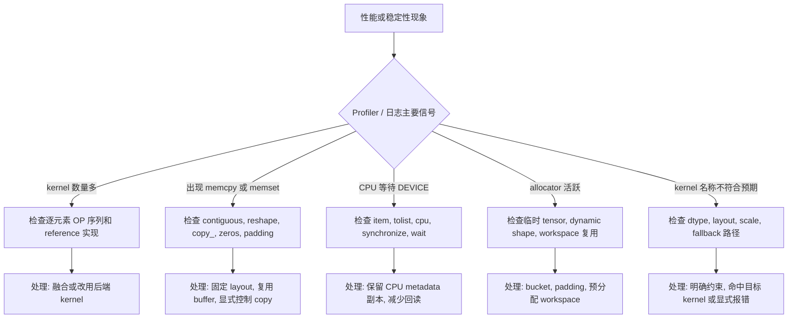

# PyTorch常见OP浅析

如果说自然语言的最小意义单元是词语，那么现代深度学习模型的最小功能单元就是算子（Operator）  
一个OP就是对张量的一次定义明确的操作：可以是简单的加减乘除，也可以是复杂的卷积、注意力计算  
无数这样的“动词”与“名词”组合起来，才写就了千亿参数的模型“文章”

理解算子是理解模型行为、优化性能乃至设计新架构的起点

## 1. PyTorch 常见 OP 如何分类

根据执行的设备类型，PyTorch OP 分为 GPU OP 和 CPU OP。此外还有几类行为特殊的 OP——view op、inplace op、dynamic shape op 和 sync op——它们不按设备分类，但各自有独立的底层行为和工程约束。

### 1.1 view op

`view` / `reshape` / `unsqueeze` / `squeeze` / `transpose` / `permute` / `expand` 等 OP 只改变 tensor 的 shape 和 stride 描述，不移动底层数据。**零拷贝是默认行为，但不是保证**。

`view` 仅在 stride 兼容时成功，否则直接报错。例如 `x.transpose(1, 2).view(...)` 通常失败，因为 transpose 改变了内存排布。`reshape` 更宽容——stride 兼容时返回 view，不兼容时静默复制数据。这正是 `reshape` 可能成为性能陷阱的原因：代码看起来只是一行 shape 调整，实际可能触发一次 D2D copy。

`contiguous()` 专门用于将非连续 tensor 复制为连续内存。如果输入已经是连续的，它不做任何事。检查方式是 `tensor.is_contiguous()` 和 `tensor.stride()`。典型场景：attention 输出 `transpose(1, 2).contiguous().view(B, S, D)` 中，`contiguous()` 是必须的——后续 `view` 和 `F.linear` 都依赖连续布局。

`expand` 通过 zero-stride 创建"伪扩展"的 view，可用于 broadcast 但不适合原地写入，因为多个位置指向同一内存地址。

验证 stride 与 contiguity：

```python
import torch

# 连续 tensor，shape=[2,3,4]，stride=(12,4,1)
x = torch.arange(24).view(2, 3, 4)

# transpose 交换维度，只改 metadata
y = x.transpose(1, 2)

# contiguous 将非连续 view 复制为连续内存
z = y.contiguous()

print("x", tuple(x.shape), x.stride(), x.is_contiguous())
print("y", tuple(y.shape), y.stride(), y.is_contiguous())
print("z", tuple(z.shape), z.stride(), z.is_contiguous())
```

输出：
```text
x (2, 3, 4) (12, 4, 1) True
y (2, 4, 3) (12, 1, 4) False
z (2, 4, 3) (12, 3, 1) True
```

源码中 `linear -> view -> transpose` 是 attention head layout 的常见路径：`LlamaAttention.forward` 和 `DeepseekV4Attention.forward` 都使用 `view(...).transpose(1, 2)`。`transpose` 后的 tensor 通常非连续，后续 kernel 若要求连续输入需要显式处理。

### 1.2 inplace op

`copy_` / `fill_` / `zero_` / `clamp_` / `masked_fill_` / `_foreach_copy_` 等以 `_` 结尾的 OP 直接修改输入 tensor 的内容，不分配新内存。**核心价值是保持 tensor 对象地址不变**——在高频推理路径中，复用固定 buffer 比反复分配更高效。

预分配固定 buffer，后续通过 `copy_` 把本轮真实数据写入这些 buffer。如果创建新 tensor 替换旧对象，之前绑定的地址就会失效。

practical 用法：replay 前 `input_ids.copy_(real_ids)`、`seq_lens.fill_(1)`、`out_cache_loc.zero_()`。padding 槽位必须清理，否则上轮残留值会污染 attention mask 或 logits。`masked_fill_` 常用于 attention mask 和 logits mask 的原地更新。

验证：

```python
import torch

# 预分配固定 buffer，后续只更新内容不替换对象
buf = torch.zeros(2)
out0 = buf * 3 + 2

# copy_ 只改内容，buf 对象地址不变
buf.copy_(torch.tensor([4.0, 5.0]))
out1 = buf * 3 + 2

print("out0 =", out0)
print("out1 =", out1)
```

输出：
```text
out0 = tensor([2., 2.])
out1 = tensor([14., 17.])
```

工程约束：预分配 input、output 和 metadata tensor，后续用 `copy_ / fill_ / zero_` 更新内容，不创建新对象。padding 槽位必须清理。

### 1.3 dynamic shape op

`nonzero` / `unique` / `masked_select` / boolean indexing 的输出长度依赖输入数据的实际值，而不仅仅是 shape。例如 `x[x > 0]` 返回多少个元素，取决于运行时 x 中有多少正数。这一特性在 eager 模式下很自然，但与固定 shape 的推理流水线直接冲突——输出 shape 的动态变化会让预分配的 buffer 和 workspace 失效。

工程上的替代方案：
- `nonzero`：用 fixed mask + padding 保持 shape 不变，mask 标记有效位。
- `unique`：用 `bincount(minlength=N)` 做固定容量的直方图统计。
- `masked_select`：用双参数 `where(condition, x, y)` 保持原 shape，配合 mask 控制有效位。
- boolean indexing：用 padded index + sentinel 值替代。

以 MUSA 为例，`torch.unique(musa_tensor)` 内部会触发 stream 同步来回读输出长度——这意味着它不仅是 dynamic shape 问题，还自带隐式同步。

相关 OP：`gather`、`scatter_`、`index_select`、`index_add_`、`where`、`topk`、`unique`、`nonzero`、`masked_select`、boolean indexing。常见于 MoE routing、KV page 选择、sampling、mask 构造和统计。

MoE top-k 最小例子：

```python
import torch

# 两个 token，三个 expert
scores = torch.tensor([
    [0.1, 0.7, 0.2],
    [0.6, 0.1, 0.3],
])

# 每个 token 选择分数最高的两个 expert
values, indices = torch.topk(scores, 2, dim=-1)

# 对被选 expert 的权重归一化
weights = values / values.sum(-1, keepdim=True)

print("indices =", indices)
print("weights =", weights)
```

输出：
```text
indices = tensor([[1, 2],
                  [0, 2]])
weights = tensor([[0.7778, 0.2222],
                  [0.6667, 0.3333]])
```

动态 shape 风险速查：

| OP | 风险 | 稳定化方式 |
|---|---|---|
| `nonzero` | 输出长度等于满足条件的元素数 | fixed mask + padding |
| `unique` | 输出长度等于唯一值个数 | histogram 或 `bincount(minlength=...)` |
| `masked_select` | 输出长度等于 `True` 个数 | 保持原 shape，用 mask 控制有效位 |
| boolean indexing | 输出长度依赖数据内容 | padded index + sentinel |
| `where(mask)` 单参数 | 返回坐标长度依赖 mask | 双参数形式保持原 shape |

### 1.4 sync op

sync op 控制 CPU 与 DEVICE 之间的时序。分为显式和隐式两类。

**显式同步**：`synchronize()`、`Stream`、`Event.record()`、`wait_event()`。`synchronize()` 阻塞 CPU 直到 DEVICE 上所有已提交操作完成，适用于 benchmark 计时和错误定位，但放入 decode 热点路径会打断 CPU/DEVICE 的异步流水——CPU 原本可以在 GPU 计算时准备下一轮请求，`synchronize()` 让它白白等待。局部依赖应使用 `Event.record()` + `wait_event()` 或 stream 管理，精确控制等待范围。

**隐式同步**：`.item()`、`.tolist()`、`.cpu()`、`.numpy()`。这些 API 看起来只是取值或类型转换，但作用在 DEVICE tensor 上时，CPU 必须先等待 GPU 完成所有前序操作，再发起 D2H 拷贝。`.item()` 取一个标量看似轻量，实际上等于一次全局同步。例如 `bincount(indices).tolist()` 在 MoE dispatch 中先把 GPU 统计结果拉回 CPU，再用 Python 循环分发 token——reference 代码可以这样写，生产环境应把 dispatch 逻辑留在 GPU 侧。

**工程原则**：CPU侧维护一份元数据副本（`seq_lens_cpu`），避免从 DEVICE tensor 读取元数据驱动 Python 分支。最终 token 和少量 logprob 允许回读；完整 logits、hidden states、KV metadata 不应频繁回 CPU。

dtype 和 device 转换相关 OP — `to`、`float`、`half`、`bfloat16`、`int`、`long`。检查项：Norm 内部是否只在局部升精度、输出是否 cast 回模型 dtype；index dtype 是否满足后端 kernel 要求；`to(device)` 是否引入 H2D/D2H copy；量化路径中 activation、weight、scale 的 dtype/shape/stride 是否匹配目标 kernel。

### 1.5 GPU OP

GPU OP 作用于 DEVICE tensor，覆盖张量创建、layout 整理、索引映射、数学计算、线性代数、路由和 dtype/device 转换，是 Transformer forward、KV cache、MoE、sampling 的主体。

**创建与初始化** — `empty`、`new_empty`、`empty_like`、`zeros`、`ones`、`full`。用于创建 input buffer、KV cache、logits、workspace。`empty` 不初始化内容，后续 kernel 必须完整写入。不要替换预分配好的 tensor 对象。

**原地更新** — `copy_`、`_foreach_copy_`、`fill_`、`zero_`、`clamp_`、`masked_fill_`。用于更新 metadata、清理 padding、写固定 buffer、裁剪激活。原地 OP 会覆盖输入内容，padding 槽位必须清理以免残留值污染 mask 或 logits。`copy_` 是更新固定 buffer 内容的核心手段。

**Shape/Layout** — `view`、`reshape`、`flatten`、`unsqueeze`、`squeeze`、`expand`、`permute`、`transpose`、`contiguous`。用于组织 QKV head layout、RoPE 输入、MoE expert 维度和 kernel 输入布局。`view` 要求 stride 兼容，否则报错；`reshape` 在 stride 不兼容时可能触发真实 copy；`contiguous()` 对非连续 tensor 会产生 D2D copy；`expand` 产生 zero-stride view，不适用于原地写入。

**索引映射** — slice、advanced indexing、`gather`、`take_along_dim`、`index_select`、`scatter_`。用于 KV page/slot 写入、MoE dispatch/combine、sampling mask 构造。index dtype 和 device 必须匹配；重复写入、越界和 mask 广播最容易引入隐蔽 bug。

**序列组合** — `arange`、`repeat_interleave`、`cat`、`stack`、`split`、`chunk`、`pad`、`where`。用于 positions 展开、batch 拼接、gate/up 切分、bucket padding。`cat` 和 `stack` 会创建新 tensor；动态输出会影响 allocator 和 compile。

**数学与激活** — `sum`、`mean`、`square`、`rsqrt`、`sigmoid`、`silu`、`gelu`、`relu`、`softmax`、`clamp`。构成 RMSNorm、SwiGLU、attention/sampling 和 reference 实现。多个逐元素/归约 OP 用 reference 方式串联时，每个 OP 独立 launch，导致多次 HBM 读写。热点路径应用 fused kernel。

RMSNorm 最小例子：

```python
import torch

h = torch.tensor([[1.0, 2.0, 3.0, 4.0]])

# 在 hidden 维度计算均方
variance = h.pow(2).mean(-1, keepdim=True)

# rsqrt(x) = 1 / sqrt(x)
out = h * torch.rsqrt(variance + 1e-6)

print("variance =", variance)
print("out =", out)
```

输出：
```text
variance = tensor([[7.5000]])
out = tensor([[0.3651, 0.7303, 1.0954, 1.4606]])
```

Llama RMSNorm 源码结构：`float() → pow(2).mean() → rsqrt(+eps) → mul → to(input_dtype) * weight`。reference 实现包含多个 kernel（`pow → mean → rsqrt → mul`），在线热点路径通常使用 fused RMSNorm kernel。`softmax(dtype=torch.float32)` 有助于数值稳定，但会引入 dtype 转换。

**线性代数与路由** — `F.linear`、`matmul`、`mm`、`bmm`、`einsum`、`topk`、`sort`、`argmax`。覆盖 QKV/O projection、MLP、LM head、MoE top-k、sampling。等价于 `x @ weight.T + bias`。dtype、layout、scale、top-k shape 和排序稳定性直接影响后端 kernel 选择。`F.linear(x, weight)` 等价于 `x @ weight.T + bias`，覆盖 Q/K/V projection、MLP gate/up/down、MoE router、LM head。

Attention 最小例子：

```python
import torch

# query/key/value shape=[B=1, H=1, S=2, D=2]
query = torch.tensor([[[[1.0, 0.0], [0.0, 1.0]]]])
key   = torch.tensor([[[[1.0, 0.0], [1.0, 1.0]]]])
value = torch.tensor([[[[2.0, 0.0], [0.0, 3.0]]]])

# q @ k^T 得到注意力分数
scores = torch.matmul(query, key.transpose(2, 3)) * (2 ** -0.5)

# softmax 将分数转换为概率
probs = torch.softmax(scores, dim=-1)

# 概率加权 value
out = torch.matmul(probs, value)

print("scores =", scores)
print("probs =", probs)
print("out =", out)
```

输出：
```text
scores = tensor([[[[0.7071, 0.7071], [0.0000, 0.7071]]]])
probs  = tensor([[[[0.5000, 0.5000], [0.3302, 0.6698]]]])
out    = tensor([[[[1.0000, 1.5000], [0.6605, 2.0095]]]])
```

`matmul → softmax → matmul` 是 reference attention 结构，score tensor 可能较大。实际推理通常使用 SDPA、FlashAttention 或后端自定义 fused attention。dtype、mask layout、KV cache layout 和 sequence length 决定后端选择。

**dtype/device 转换** — `to`、`float`、`half`、`bfloat16`、`int`、`long`。用于 metadata dtype、BF16/FP8/FP4 路径、CPU/DEVICE 边界。避免 OP 间反复 cast；`to(device)` 可能引入 H2D/D2H copy。

### 1.6 CPU OP

CPU OP 服务调度和状态管理，不直接承担大张量计算。在线推理中，CPU侧负责 request queue、prefix cache、bucket 选择、KV block 管理、metadata 构造和协议输出；DEVICE侧负责 attention、MLP/MoE、logits 和 sampling 的张量计算。

- **Python 容器** — `list`、`dict`、`len`、`range`：用于 scheduler、request state、block table。可以放在推理调度逻辑外，但不要驱动 decode 单步里的 DEVICE tensor 分支。
- **CPU tensor** — `torch.tensor(..., device="cpu")`：保存 `seq_lens_cpu`、batch size 等调度元数据，CPU侧副本需要和 DEVICE侧 metadata 保持同步。
- **CPU-DEVICE 转换** — `.cpu()`、`.numpy()`、`.tolist()`：用于日志、调试、最终 token 和少量统计。对 GPU tensor 调用通常会触发隐式同步和 D2H copy。
- **标量读取** — `.item()`：获取最终 token id 或 loss scalar。对 GPU tensor 高频调用会把异步执行变成 CPU 等待。
- **H2D metadata 上传** — `torch.as_tensor(..., device)`：将 seq_lens、positions、page table 上传到 DEVICE。高频路径应复用固定 buffer，避免零散小 tensor 上传。

---

## 2. OP 常见性能问题与排查

PyTorch OP 的性能问题通常来自五类行为：隐式 copy、临时分配、CPU-DEVICE 同步、动态 shape，以及未命中预期 kernel 或 fallback 路径。排查时先看 profiler 中的可见信号，再回到源码定位对应 OP。



### 2.1 Layout 与隐式 Copy

`view`/`reshape`/`transpose`/`permute`/`contiguous()` 是 Transformer 中最常见的 layout OP。`view` 通常是零拷贝但要求 stride 兼容；`reshape` 在 stride 不兼容时可能分配新 tensor；`contiguous()` 会把非连续 layout 复制成连续内存。

| 现象 | 常见 OP | 根因 | 处理方式 |
|------|---------|------|----------|
| `reshape` 后延迟抖动 | `reshape`、`permute`、`transpose` | stride 不兼容导致隐式 copy | 能用 `view` 时优先 `view`；kernel 前显式检查 `stride`/`is_contiguous` |
| kernel 前多一次 copy | `contiguous()` | 目标 kernel 只支持连续输入 | 把 layout 转换前移、复用转换结果，或融合到 kernel 内 |
| broadcast 写错 | `expand` + inplace OP | expanded tensor 可能是 zero-stride view | 不对 expanded view 原地写，必要时先 `clone`/`contiguous` |

### 2.2 分配、初始化与 Buffer 生命周期

`empty`/`new_empty`/`empty_like` 只分配内存不初始化。预分配固定 buffer 用于高频推理路径时，应使用 `copy_`/`fill_`/`zero_` 更新内容，而不是创建新 tensor。

| 场景 | 推荐方式 | 风险 |
|------|----------|------|
| 固定 buffer 更新 | capture 前预分配，replay 前 `copy_` | 替换 tensor 对象破坏地址稳定性 |
| padding 槽位 | replay 前 `fill_`/`zero_` 清理 | 残留值会影响 attention mask、cache 或 logits |
| 临时 workspace | 按 batch/seq bucket 复用 | 每步分配增加 allocator 开销和地址不稳定 |

### 2.3 由多个独立 kernel 执行的 OP 序列

RMSNorm、SwiGLU、attention softmax 和 MoE combine 常用多个 PyTorch OP 表达 reference 语义。reference 实现便于验证数学逻辑，但每个 OP 往往会单独触发 kernel launch 并读写中间 tensor。在线热点路径通常需要 fused kernel 或后端原生 kernel 承担同一段计算。

| OP 序列 | 语义 | 性能问题 |
|-------|------|----------|
| `square → mean → rsqrt → mul` | RMSNorm / Q norm | 多次读取 hidden states，多次 launch |
| `chunk → silu → clamp → mul` | SwiGLU | 中间 tensor 多，激活、裁剪和乘法分别执行 |
| `softmax → matmul` | attention reference | score tensor 大，占显存和带宽 |
| `where`/`nonzero → index_select → scatter` | MoE dispatch/combine | token 数动态，allocator 和调度复杂 |
| `topk → gather → normalize` | MoE routing / sampling | top-k shape、排序和 dtype 会传导到后续 kernel |

### 2.4 CPU-DEVICE 同步边界

`.item()`、`.tolist()`、`.cpu()`、`.numpy()` 是最容易被忽略的同步来源。对 CPU tensor 调用它们通常没问题；对 GPU/MUSA tensor 调用时，CPU 需要等待前序 DEVICE 计算完成，再做 D2H 拷贝或标量读取。

| API | 合理位置 | 风险位置 |
|-----|----------|----------|
| `.item()` | CPU侧元数据副本、最终标量、benchmark 结束 | GPU seq_lens、GPU logits、热点路径内部分支 |
| `.tolist()` | CPU scheduler 的长度列表、最终 token 列表 | GPU 上 `bincount` 后回读并驱动 Python expert loop |
| `.cpu()` | 最终输出、少量 logprob、离线分析 | 完整 logits、hidden states、KV metadata |
| `synchronize()` | profiling 边界、错误定位 | decode 单步、通信计算重叠区 |

### 2.5 Dynamic Shape 与 Compile

`nonzero`/`unique`/`masked_select`、mask 后变长 `index_select`、数据相关 `cat`/`split` 会让输出 shape 随输入内容变化。它们在 eager 模式表达力强，但会破坏固定 shape 推理流水线的约束。

| 动态来源 | 典型 OP | 更稳定的表达 |
|----------|---------|--------------|
| 有效 token 数变化 | `nonzero`、boolean indexing | fixed mask + padding |
| expert 负载变化 | `where`、`bincount(...).tolist()` | fixed top-k、固定 expert capacity、padded metadata |
| request 长度变化 | data-dependent `cat`/`split` | CPU scheduler bucket + fixed metadata |
| sparse index 数量变化 | 动态 `topk(k)` | 固定 k，超出部分用 sentinel/padding |

### 2.6 dtype、量化与 Fallback

BF16/FP16/FP8/FP4、activation scale、weight scale、block size、packed layout 和输出 dtype 是一组接口约束。`to(dtype)` 不只是精度转换，也可能改变 kernel 路径和数值误差分布。

| 问题 | 表现 | 处理方式 |
|------|------|----------|
| dtype/layout 不匹配 | fallback 到 PyTorch reference 或通用 kernel | 打印/统计执行路径，确认输入满足 kernel 约束 |
| scale layout 不匹配 | FP8/FP4 GEMM 结果错误或性能异常 | 固定 block size，明确 scale shape、stride 和连续性 |
| 反复 cast | 多余 `float`/`half`/`bfloat16`/`to` | 在模块边界集中转换 |
| silent fallback | 语义正确但性能异常 | 对不支持组合显式报错或受控 fallback |

---

## 3. 简单模型中的 OP 执行流程

在真实 Transformer 之前，先用一个最小 decoder block 串起常见 OP。这个例子覆盖 embedding、position、mask、Q/K/V projection、attention、residual、MLP 和 logits projection。它不依赖 Transformers 源码，但执行结构与 decoder-only 模型一致。

### 3.1 最小 Decoder Block

模型输入：

```text
input_ids shape=[B=1, S=3]
embedding table shape=[V=5, D=4]
hidden shape=[B=1, S=3, D=4]
```

执行流程：

```text
input_ids
  -> embedding 查表
  -> Q/K/V linear projection
  -> view/transpose 组织 head layout
  -> causal mask
  -> attention softmax 与 value 加权
  -> residual add
  -> SwiGLU MLP
  -> residual add
  -> lm_head
  -> logits
```

最小可执行代码：

```python
import torch
import torch.nn.functional as F

torch.set_printoptions(precision=4, sci_mode=False)

# 1. token id。真实模型中 input_ids 来自 tokenizer。
input_ids = torch.tensor([[1, 3, 2]])

# 2. embedding table。每个 token id 选择一行向量。
embedding_table = torch.tensor([
    [0.0, 0.0, 0.0, 0.0],
    [1.0, 0.0, 0.0, 1.0],
    [0.0, 1.0, 0.0, 1.0],
    [0.0, 0.0, 1.0, 1.0],
    [1.0, 1.0, 0.0, 0.0],
])
hidden = embedding_table[input_ids]

# 3. Q/K/V projection。这里使用单位矩阵，便于核对数值。
weight = torch.eye(4)
q = F.linear(hidden, weight)
k = F.linear(hidden, weight)
v = F.linear(hidden, weight)

# 4. 组织成多头布局：[B,S,D] -> [B,H,S,Dh]，H=2, Dh=2。
B, S, D = hidden.shape
H, Dh = 2, 2
q = q.view(B, S, H, Dh).transpose(1, 2)
k = k.view(B, S, H, Dh).transpose(1, 2)
v = v.view(B, S, H, Dh).transpose(1, 2)

# 5. attention score 和 causal mask。
scores = torch.matmul(q, k.transpose(2, 3)) * (Dh ** -0.5)
mask = torch.triu(torch.full((S, S), float("-inf")), diagonal=1)
scores = scores + mask.view(1, 1, S, S)
probs = torch.softmax(scores, dim=-1)

# 6. attention 输出回到 [B,S,D]。
attn = torch.matmul(probs, v).transpose(1, 2).contiguous().view(B, S, D)
hidden = hidden + attn

# 7. SwiGLU MLP。为了示例简洁，使用手工权重。
gate_w = torch.eye(4)
up_w = torch.ones(4, 4) * 0.25
down_w = torch.eye(4)
gate = F.linear(hidden, gate_w)
up = F.linear(hidden, up_w)
mlp = F.linear(F.silu(gate) * up, down_w)
hidden = hidden + mlp

# 8. lm_head 将 hidden 投影到 vocab logits。
lm_head = torch.tensor([
    [1.0, 0.0, 0.0, 0.0],
    [0.0, 1.0, 0.0, 0.0],
    [0.0, 0.0, 1.0, 0.0],
    [0.0, 0.0, 0.0, 1.0],
    [0.5, 0.5, 0.0, 0.0],
])
logits = F.linear(hidden, lm_head)

print("hidden shape =", tuple(hidden.shape))
print("attention probs head0 =", probs[0, 0])
print("last token logits =", logits[0, -1])
```

参考输出：

```text
hidden shape = (1, 3, 4)
attention probs head0 = tensor([[1.0000, 0.0000, 0.0000],
                                [0.5000, 0.5000, 0.0000],
                                [0.2483, 0.2483, 0.5035]])
last token logits = tensor([0.3907, 2.7596, 0.5317, 3.7991, 1.5752])
```

### 3.2 该模型中的 OP 分类

| 阶段 | OP | 功能 | 注意事项 |
|---|---|---|---|
| token 输入 | indexing / embedding | 将 token id 转为 hidden states | `input_ids` 必须是整型；embedding 输出进入模型 dtype |
| Q/K/V | `F.linear` | 生成 query、key、value | dtype/layout 决定 GEMM 路径 |
| head layout | `view`、`transpose`、`contiguous` | 将 `[B,S,D]` 转为 `[B,H,S,Dh]` | `transpose` 后通常非连续 |
| causal mask | `full`、`triu`、加法 | 屏蔽未来 token | mask dtype 和 broadcast shape 必须匹配 attention |
| attention | `matmul`、`softmax`、`matmul` | 计算 token 间依赖 | reference 路径可能产生大 score tensor |
| residual | `add` | 保留子层输入 | shape 必须一致 |
| MLP | `linear`、`silu`、`mul`、`linear` | token 内非线性变换 | 多个逐元素 OP 可融合 |
| logits | `linear` | 投影到 vocabulary | decode 常只需要最后 token |

这个最小模型对应真实源码中的主要路径：

```text
LlamaModel.forward
  -> LlamaDecoderLayer.forward
  -> LlamaAttention.forward
  -> LlamaMLP.forward
  -> LlamaForCausalLM.forward
```

DeepSeek V4 在此基础上增加多残差流、压缩注意力和 MoE，但底层仍由这些 OP 组合构成。

## 4. Llama Decoder 源码拆解

Llama 是标准 decoder-only 模型。主执行链路：

```text
input_ids
  -> embedding
  -> position_ids / causal_mask / rotary embedding
  -> N 个 LlamaDecoderLayer
       -> RMSNorm
       -> Self Attention
       -> residual add
       -> RMSNorm
       -> MLP
       -> residual add
  -> final RMSNorm
  -> lm_head
  -> logits
```

prefill 和 decode 的热点不同：

| 阶段 | 输入特点 | Attention 行为 | 性能重点 |
|---|---|---|---|
| prefill | 一次输入多个 prompt token | 当前 token 之间做 causal attention，并写入 KV cache | GEMM、attention 带宽、KV cache 初始化 |
| decode | 每步新增一个 token | 新 query 读取历史 KV cache，追加当前 K/V | kernel launch、KV cache 访问、CPU 同步边界 |

### 4.1 `LlamaModel.forward`

源码位置：

```text
modeling_llama.py::LlamaModel.forward
```

关键路径：

```python
# input_ids 是 token id，embedding 后变成 hidden states。
inputs_embeds = self.embed_tokens(input_ids)

# position_ids 表示 token 在序列中的位置。
position_ids = torch.arange(inputs_embeds.shape[1], device=inputs_embeds.device) + past_seen_tokens
position_ids = position_ids.unsqueeze(0)

# causal_mask 禁止当前位置访问未来 token。
causal_mask = create_causal_mask(...)

# RoPE 的 cos/sin 在模型层统一生成，并传给每一层 attention。
position_embeddings = self.rotary_emb(hidden_states, position_ids=position_ids)

for decoder_layer in self.layers:
    hidden_states = decoder_layer(
        hidden_states,
        attention_mask=causal_mask,
        position_embeddings=position_embeddings,
        past_key_values=past_key_values,
    )

hidden_states = self.norm(hidden_states)
```

对应 OP：

| 源码动作 | 主要 OP | 行为 |
|---|---|---|
| token 查表 | `nn.Embedding` | 按 id 读取 embedding 表 |
| 生成位置 | `arange`、`unsqueeze` | 创建 position tensor |
| 构造 mask | `full`、`triu`、`masked_fill`、加法 | 形成 causal bias |
| RoPE | `cos`、`sin`、slice、cat | 生成旋转位置编码 |
| decoder 循环 | Python loop + module call | 每层重复 attention 和 MLP |

Causal mask 最小例子：

```python
import torch

# scores 表示 3 个 query token 对 3 个 key token 的原始注意力分数。
scores = torch.tensor([
    [0.2, 0.1, 0.4],
    [0.3, 0.5, 0.0],
    [0.2, 0.4, 0.6],
])

# 上三角位置是未来 token，填入 -inf 后 softmax 概率为 0。
mask = torch.triu(torch.full((3, 3), float("-inf")), diagonal=1)
masked_scores = scores + mask
probs = torch.softmax(masked_scores, dim=-1)

print("masked_scores =", masked_scores)
print("probs =", probs)
```

输出：

```text
masked_scores = tensor([[0.2000,   -inf,   -inf],
                        [0.3000, 0.5000,   -inf],
                        [0.2000, 0.4000, 0.6000]])
probs = tensor([[1.0000, 0.0000, 0.0000],
                [0.4502, 0.5498, 0.0000],
                [0.2693, 0.3289, 0.4018]])
```

### 4.2 `LlamaDecoderLayer.forward`

源码位置：

```text
modeling_llama.py::LlamaDecoderLayer.forward
```

Llama decoder layer 是 pre-norm block：

```text
x -> RMSNorm -> Attention -> residual add
  -> RMSNorm -> MLP       -> residual add
```

关键路径：

```python
# 保存 attention 前的输入，用于 residual add。
residual = hidden_states

# 先归一化，再进入 self-attention。
hidden_states = self.input_layernorm(hidden_states)
hidden_states, _ = self.self_attn(...)
hidden_states = residual + hidden_states

# 保存 MLP 前的输入，用于第二条 residual add。
residual = hidden_states

# 先归一化，再进入 MLP。
hidden_states = self.post_attention_layernorm(hidden_states)
hidden_states = self.mlp(hidden_states)
hidden_states = residual + hidden_states
```

对应 OP：

| 阶段 | 主要 OP | 作用 |
|---|---|---|
| RMSNorm | `to(float32)`、`pow`、`mean`、`rsqrt`、`mul` | 对 hidden 维做归一化 |
| Attention | `linear`、`view`、`transpose`、RoPE、attention kernel | 建模 token 间依赖 |
| Residual | `add` | 保留原始信息，稳定深层网络 |
| MLP | `linear`、`silu`、`mul`、`linear` | token 内非线性变换 |

### 4.3 `LlamaAttention.forward`

源码位置：

```text
modeling_llama.py::LlamaAttention.forward
```

关键路径：

```python
input_shape = hidden_states.shape[:-1]
hidden_shape = (*input_shape, -1, self.head_dim)

# Q/K/V projection，并整理成多头布局。
query_states = self.q_proj(hidden_states).view(hidden_shape).transpose(1, 2)
key_states = self.k_proj(hidden_states).view(hidden_shape).transpose(1, 2)
value_states = self.v_proj(hidden_states).view(hidden_shape).transpose(1, 2)

# RoPE 只作用于 Q/K。
query_states, key_states = apply_rotary_pos_emb(query_states, key_states, cos, sin)

# decode 时更新 KV cache。
if past_key_values is not None:
    key_states, value_states = past_key_values.update(key_states, value_states, self.layer_idx)

# 后端可选择 eager、SDPA、FlashAttention 或框架注册实现。
attn_output, attn_weights = attention_interface(...)

# 回到 [batch, seq, hidden]，再做 output projection。
attn_output = attn_output.reshape(*input_shape, -1).contiguous()
attn_output = self.o_proj(attn_output)
```

Q projection 的 shape 例子：

```python
import torch
import torch.nn.functional as F

# hidden shape=[B=1, S=2, D=4]。
hidden = torch.tensor([[
    [1.0, 0.0, 2.0, 1.0],
    [0.0, 1.0, 1.0, 2.0],
]])

# 使用单位矩阵作为 projection weight，便于核对 shape。
q_weight = torch.eye(4)

# projection 后 view 成 [B,S,H,Dh]，再 transpose 成 [B,H,S,Dh]。
q = F.linear(hidden, q_weight).view(1, 2, 2, 2).transpose(1, 2)

print("q shape =", tuple(q.shape))
print(q)
```

输出：

```text
q shape = (1, 2, 2, 2)
tensor([[[[1., 0.],
          [0., 1.]],

         [[2., 1.],
          [1., 2.]]]])
```

shape 转换：

```text
[B,S,D]
  -> linear
  -> [B,S,H*Dh]
  -> view
  -> [B,S,H,Dh]
  -> transpose
  -> [B,H,S,Dh]
```

### 4.4 `LlamaMLP.forward`

源码位置：

```text
modeling_llama.py::LlamaMLP.forward
```

关键路径：

```python
# gate_proj 产生门控分支，up_proj 产生内容分支。
gate = self.gate_proj(x)
up = self.up_proj(x)

# SwiGLU: 对 gate 做 SiLU 后与 up 分支逐元素相乘。
hidden = self.act_fn(gate) * up

# down_proj 投回 hidden size。
out = self.down_proj(hidden)
```

SwiGLU 最小例子：

```python
import torch
import torch.nn.functional as F

gate = torch.tensor([[1.0, -1.0]])
up = torch.tensor([[2.0, 3.0]])

# SiLU(gate) = gate * sigmoid(gate)。
mix = F.silu(gate) * up

print("mix =", mix)
```

输出：

```text
mix = tensor([[ 1.4621, -0.8068]])
```

### 4.5 `LlamaForCausalLM.forward`

源码位置：

```text
modeling_llama.py::LlamaForCausalLM.forward
```

关键路径：

```python
# base decoder 输出每个 token 的 hidden states。
outputs = self.model(...)
hidden_states = outputs[0]

# decode 通常只需要最后一个或最后几个 token 的 logits。
hidden_states = hidden_states[:, slice_indices, :]

# lm_head 将 hidden states 投影到 vocabulary 维度。
logits = self.lm_head(hidden_states)
```

检查重点：

- prefill 通常需要多个 token 的 logits。
- decode 通常只需要最后一个 token 的 logits。
- `logits_to_keep` 可以减少不必要的 vocab projection。

## 5. DeepSeek V4 源码进阶

DeepSeek V4 在经典 decoder 结构上增加三类关键机制：

| 机制 | 代表模块 | 主要 OP | 作用 |
|---|---|---|---|
| 多残差流 | `DeepseekV4HyperConnection`、`DeepseekV4HyperHead` | `flatten`、`linear`、`split`、`sigmoid`、`softmax`、`matmul` | 多条 residual stream 的折叠、混合和写回 |
| 压缩注意力 | `DeepseekV4HCACompressor`、`DeepseekV4CSACompressor`、`DeepseekV4Indexer` | `view`、`softmax`、`sum`、`matmul`、`topk`、`scatter_` | 将历史 token 压缩为 compressed KV，并按 query 选择摘要 |
| MoE | `DeepseekV4SparseMoeBlock`、router、experts | `topk`、`gather`、`one_hot`、`where`、`linear`、`index_add_` | token 选择专家，专家计算后合并回 token 位置 |

### 5.1 `DeepseekV4Model.forward`

主线：

```text
input_ids
  -> embed_tokens
  -> hidden_states.unsqueeze(2).expand(...).contiguous()
  -> rotary_emb 生成 main/compress 两套位置编码
  -> N 个 DeepseekV4DecoderLayer
  -> HyperHead 折叠多残差流
```

关键点：

- Llama 中的 hidden states 是 `[B, S, D]`。
- DeepSeek V4 引入 `hc_mult` 后，layer 内部使用 `[B, S, hc_mult, D]`。
- 进入 attention 或 MoE 前，需要由 mHC 折叠为普通 `[B, S, D]`。
- 输出后再按 mHC 权重写回多条 residual stream。

### 5.2 `DeepseekV4HyperConnection`

mHC 负责两类操作：

1. 子层输入前，把多条 residual stream 折叠成一条 hidden。
2. 子层输出后，把 attention 或 MoE 输出写回多条 residual stream，并混合旧 stream。

最小例子：

```python
import torch

# 一个 token，两条 residual stream，每条 hidden_dim=2。
streams = torch.tensor([
    [1.0, 0.0],
    [0.0, 2.0],
])

# pre 是 mHC 生成的折叠权重。这里手工指定，便于核对计算。
pre = torch.tensor([0.25, 0.75])

# collapsed 是送入 attention 或 MoE 的普通 hidden。
collapsed = (pre[:, None] * streams).sum(dim=0)

print("collapsed =", collapsed)
```

输出：

```text
collapsed = tensor([0.2500, 1.5000])
```

写回例子：

```python
import torch

old_streams = torch.tensor([
    [1.0, 0.0],
    [0.0, 2.0],
])

# 子层输出，例如 attention 输出。
sub_layer_out = torch.tensor([0.5, 1.0])

# post 控制子层输出写入每条 stream 的比例。
post = torch.tensor([1.0, 0.5])

# comb 控制旧 residual stream 之间的混合。
comb = torch.tensor([
    [0.8, 0.2],
    [0.1, 0.9],
])

mixed_old = comb.T @ old_streams
new_streams = mixed_old + post[:, None] * sub_layer_out

print("mixed_old =", mixed_old)
print("new_streams =", new_streams)
```

输出：

```text
mixed_old = tensor([[0.8000, 0.2000],
                    [0.1000, 1.8000]])
new_streams = tensor([[1.3000, 1.2000],
                      [0.3500, 2.3000]])
```

源码映射：

```text
DeepseekV4DecoderLayer.forward:
attn_hc -> input_layernorm -> self_attn -> residual stream writeback
ffn_hc  -> post_attention_layernorm -> mlp -> residual stream writeback
```

### 5.3 `DeepseekV4Attention`

DeepSeek V4 attention 的输入由两部分组成：

```text
局部滑窗 KV + 压缩长程 KV
```

对应 mask 也分为两部分：

```text
滑窗 causal mask + compressed branch block_bias
```

关键路径：

```text
Q: q_a_proj -> q_a_norm -> q_b_proj -> view -> transpose -> q_b_norm -> RoPE
KV: kv_proj -> view -> transpose -> kv_norm -> RoPE
Compressed KV: HCA 或 CSA compressor
Concat: cat([kv, compressed_kv], dim=2)
Mask: cat([attention_mask, block_bias], dim=-1)
Attention: attention_interface(...)
Output: grouped bmm / grouped linear -> output projection
```

检查重点：

- Q/K/V 的 head layout 是否满足 attention backend。
- compressed KV 是否与原 KV 在 sequence 维拼接。
- `block_bias` 是否只允许访问因果合法的 compressed entries。
- `cat` 会创建新 tensor，热点路径中应关注内存带宽和 allocator 行为。

### 5.4 `DeepseekV4HCACompressor`

HCA 将连续 token 按固定窗口压缩成 compressed KV。核心操作是：

```text
window 切分 -> gate softmax -> weighted sum -> compressed entry
```

最小例子：

```python
import torch

# 4 个 token，每个 token 的 KV 维度为 2。
tokens = torch.tensor([
    [1.0, 0.0],
    [0.0, 1.0],
    [1.0, 1.0],
    [2.0, 1.0],
])

# 每个 token 对每个维度都有一个 gate logit。
gate = torch.tensor([
    [2.0, 0.0],
    [0.0, 2.0],
    [1.0, 1.0],
    [0.0, 2.0],
])

# 每 2 个 token 压缩成一个 entry。
windows = tokens.view(2, 2, 2)
gate_windows = gate.view(2, 2, 2)

# 在窗口内部做 softmax，再按维度加权求和。
weights = gate_windows.softmax(dim=1)
compressed = (windows * weights).sum(dim=1)

print("weights =", weights)
print("compressed =", compressed)
```

输出：

```text
weights = tensor([[[0.8808, 0.1192],
                   [0.1192, 0.8808]],

                  [[0.7311, 0.2689],
                   [0.2689, 0.7311]]])
compressed = tensor([[0.8808, 0.8808],
                     [1.2689, 1.0000]])
```

计算含义：

- `tokens 0-1` 被压缩成 `compressed[0]`。
- `tokens 2-3` 被压缩成 `compressed[1]`。
- 后续 attention 不直接访问全部历史 token 时，可以访问这些 compressed entries 作为长程摘要。

HCA causal mask 最小例子：

```python
import torch

seq_len = 4
compressed_len = 2
compress_rate = 2

position_ids = torch.arange(seq_len)
entry_indices = torch.arange(compressed_len)

# causal_threshold 表示每个 query token 可见的 compressed entry 数量。
causal_threshold = (position_ids + 1) // compress_rate

block_bias = torch.zeros(seq_len, compressed_len)
block_bias = block_bias.masked_fill(
    entry_indices.view(1, -1) >= causal_threshold.view(-1, 1),
    float("-inf"),
)

print("causal_threshold =", causal_threshold)
print("block_bias =", block_bias)
```

输出：

```text
causal_threshold = tensor([0, 1, 1, 2])
block_bias = tensor([[-inf, -inf],
                     [0., -inf],
                     [0., -inf],
                     [0., 0.]])
```

作用：

- token0 没有完整历史窗口可访问。
- token1 和 token2 可访问 `tokens 0-1` 压缩得到的 entry0。
- token3 可访问 entry0 和 `tokens 2-3` 压缩得到的 entry1。

### 5.5 `DeepseekV4CSACompressor` 与 `DeepseekV4Indexer`

CSA 在压缩后增加 indexer。indexer 根据当前 query 选择 top-k compressed entries，避免每个 query 访问所有压缩摘要。

最小例子：

```python
import torch

# 两个 query，三个 compressed entries，维度为 2。
q = torch.tensor([
    [1.0, 0.0],
    [0.0, 1.0],
])
compressed_k = torch.tensor([
    [1.0, 0.0],
    [0.5, 0.5],
    [0.0, 1.0],
])

# query 与 compressed key 打分。
scores = torch.matmul(q, compressed_k.T).relu()

# 每个 query 选择两个 compressed entries。
values, indices = torch.topk(scores, k=2, dim=-1)

print("scores =", scores)
print("indices =", indices)
```

输出：

```text
scores = tensor([[1.0000, 0.5000, 0.0000],
                 [0.0000, 0.5000, 1.0000]])
indices = tensor([[0, 1],
                  [2, 1]])
```

源码映射：

```text
DeepseekV4Indexer:
q_b_proj / weights_proj
matmul(q, compressed_kv.T)
relu / sum / topk

DeepseekV4CSACompressor:
scatter_ 构造 compressed branch mask
```

### 5.6 `DeepseekV4SparseMoeBlock`

MoE 主线：

```text
hidden_states
  -> router 打分
  -> topk 选 expert
  -> gather 取被选 expert 权重
  -> expert 计算
  -> index_add_ 合并回 token 位置
  -> shared expert 分支相加
```

最小例子：

```python
import torch

# 三个 token，三个 expert 的 router score。
scores = torch.tensor([
    [0.1, 0.7, 0.2],
    [0.6, 0.1, 0.3],
    [0.2, 0.4, 0.8],
])

topk_values, topk_indices = scores.topk(k=2, dim=-1)
weights = topk_values / topk_values.sum(dim=-1, keepdim=True)

# 示例直接给出 expert 对 token 的输出，便于说明 combine。
expert_outputs = torch.tensor([
    [[0.0, 2.0], [1.0, 0.0]],  # token0 对 expert1/expert2 的输出
    [[2.0, 0.0], [0.0, 1.0]],  # token1 对 expert0/expert2 的输出
    [[1.0, 1.0], [0.0, 2.0]],  # token2 对 expert2/expert1 的输出
])

combined = (expert_outputs * weights.unsqueeze(-1)).sum(dim=1)

print("topk_indices =", topk_indices)
print("weights =", weights)
print("combined =", combined)
```

输出：

```text
topk_indices = tensor([[1, 2],
                       [0, 2],
                       [2, 1]])
weights = tensor([[0.7778, 0.2222],
                  [0.6667, 0.3333],
                  [0.6667, 0.3333]])
combined = tensor([[0.2222, 1.5556],
                   [1.3333, 0.3333],
                   [0.6667, 1.3333]])
```

源码映射：

```text
DeepseekV4TopKRouter:
F.linear -> score_fn -> topk -> gather -> normalize

DeepseekV4HashRouter:
tid2eid[input_ids.reshape(-1)] -> gather

DeepseekV4Experts:
one_hot -> where -> per-expert F.linear -> index_add_
```

性能检查：

- `topk` 固定 k 有利于保持后续 shape 稳定。
- `where` 会产生数据相关 token 列表，reference 实现适合验证，不应直接作为高性能 MoE dispatch。
- per-expert Python loop 会增加 launch 数和调度开销。
- 高性能实现通常使用 fused dispatch、grouped GEMM 和 fused combine。

### 5.7 `DeepseekV4ForCausalLM.forward`

主线：

```text
self.model(...)
  -> hidden states
  -> slice logits_to_keep
  -> lm_head
  -> logits
  -> optional loss / aux loss
```

检查重点：

- 推理通常只需要最后 token 的 logits。
- `logits_to_keep` 能减少不必要的 vocab projection。
- 训练路径需要 labels、loss 和 router aux loss；推理路径应避免无关分支进入热点。

## 6. MUSA 最小用例与验证输出

以下用例在 MUSA 设备上复现典型的 OP 组合与执行边界，每个用例包含完整可运行代码和 MUSA 执行输出。

### 6.1 Paged KV Cache 写入

验证 `slot_mapping` 通过 `div`/`%` 映射到 page/offset，再通过 advanced indexing 写入 KV cache。

```python
import torch

device = torch.device("musa:0")
kv_cache = torch.zeros((3, 2, 1, 2), dtype=torch.float32, device=device)
slot_mapping = torch.tensor([1, 4, 5], dtype=torch.int64, device=device)
page_size = 2

# slot → page/offset
page_idx = torch.div(slot_mapping, page_size, rounding_mode="floor")
page_offset = slot_mapping % page_size

# 写入 KV cache
new_k = torch.tensor([[[1.0, 1.5]], [[2.0, 2.5]], [[3.0, 3.5]]], device=device)
kv_cache[page_idx, page_offset] = new_k

print("page_idx =", page_idx.cpu().tolist())
print("page_offset =", page_offset.cpu().tolist())
```

MUSA 输出：
```text
page_idx = [0, 2, 2]
page_offset = [1, 0, 1]
```

验证：`slot_mapping=[1,4,5]` 拆为 page `[0,2,2]` 和 offset `[1,0,1]`，分页写入正确。

### 6.2 MoE 路由与 Combine

验证 `softmax`→`topk`→按权重合并 expert 输出。

```python
import torch

device = torch.device("musa:0")
hidden = torch.tensor([[1.0, 2.0], [3.0, 4.0], [5.0, 6.0]], device=device)
router_logits = torch.tensor([[1.0, 3.0, 0.0], [2.0, 0.5, 1.5], [0.0, 1.0, 4.0]], device=device)

# router logits → top-k expert 选择
probs = torch.softmax(router_logits, dim=-1)
topk_vals, topk_ids = torch.topk(probs, k=2, dim=-1)

# expert 输出按权重合并
expert_scale = (topk_ids.to(torch.float32) + 1.0).unsqueeze(-1)
expert_out = hidden.unsqueeze(1) * expert_scale
combined = (expert_out * topk_vals.unsqueeze(-1)).sum(dim=1)

print("topk_ids =", topk_ids.cpu().tolist())
print("topk_vals =", topk_vals.cpu().tolist())
```

MUSA 输出：
```text
topk_ids = [[1, 0], [0, 2], [2, 1]]
topk_vals = [[0.8438, 0.1142], [0.5465, 0.3315], [0.9362, 0.0466]]
```

验证：该用例保留 MoE 上层语义——router 产生 expert id 和权重，expert 输出按 `topk_vals` 加权合并。在线推理热点路径应由 fused kernel 执行 expert GEMM、dispatch 和 combine。

### 6.3 Sampling 后处理

验证 temperature、top-k、softmax 保留在 DEVICE侧，只回传最终 token。

```python
import torch

device = torch.device("musa:0")
logits = torch.tensor([[1.0, 3.0, 2.0, -1.0], [0.5, 0.0, 4.0, 1.0]], device=device)
temperature = 0.5

scaled = logits / temperature
topk_vals, topk_ids = torch.topk(scaled, k=2, dim=-1)
probs = torch.softmax(topk_vals, dim=-1)
next_token = topk_ids[:, 0]
next_token_cpu = next_token.cpu().tolist()

print("topk_ids =", topk_ids.cpu().tolist())
print("probs =", probs.cpu().tolist())
print("next_token =", next_token_cpu)
```

MUSA 输出：
```text
topk_ids = [[1, 2], [2, 3]]
probs = [[0.8808, 0.1192], [0.9975, 0.0025]]
next_token = [1, 2]
```

验证：sampling 计算保留在 MUSA tensor 上，CPU-DEVICE 边界仅发生在最终 token 回传处。

## 7. OP 与性能排查

Profiler 现象应回到源码中的具体 OP，而不是停留在模块名。

| 现象 | 源码检查 | 机制 |
|---|---|---|
| 出现额外 memcpy | `reshape / transpose / permute / contiguous / cat / stack / pad / to(device)` | layout 转换或 tensor 拼接触发数据复制 |
| 出现 stream synchronize | `.item() / .tolist() / .cpu() / synchronize / unique / nonzero / masked_select` | CPU 需要等待设备结果或输出长度 |
| allocator 抖动 | `empty / zeros / new_full / cat / dynamic output OPs` | 高频路径分配临时 tensor |
| kernel 数量过多 | reference RMSNorm、SwiGLU、attention、MoE routing | 多个逐元素或归约 OP 分别 launch |
| kernel 名称不符合预期 | `linear / attention / quantized GEMM` 的 dtype、layout、scale、shape | 后端 fallback 到普通路径 |
| 固定 shape 约束被破坏 | dynamic shape、地址变化、allocator 分配、CPU 回读、不支持 backend | 不满足固定 shape 和固定地址约束 |

处理方式：

- 对 layout copy，固定输入 layout 或把 `contiguous()` 前移到低频路径。
- 对 CPU 回读，维护 CPU metadata mirror，避免 DEVICE tensor 驱动 Python 分支。
- 对 allocator 抖动，按 bucket 预分配 workspace，并使用 `copy_ / fill_ / zero_` 更新内容。
- 对 kernel 数量过多，使用 fused norm、fused activation、fused attention、grouped GEMM 或后端专用 MoE kernel。
- 对固定 shape 约束，固定 shape、固定地址、固定 metadata，并把动态整理放在推理流水线之外。

## 8. 源码分析步骤

分析一段 Transformer 源码时，按以下顺序执行：

1. 写出输入和输出 shape。
2. 标注 OP 类型：layout、GEMM、elementwise、reduction、indexing、mask、routing、sync。
3. 检查 `dtype / device / stride / is_contiguous()`。
4. 判断是否分配新 tensor 或触发实际 copy。
5. 判断是否出现 `.item()`、`.tolist()`、`.cpu()`、`synchronize()` 或动态 shape OP。
6. 对应到模型模块：embedding、position、attention、KV cache、MLP、MoE、logits。
7. 对应到 profiler：kernel 名称、memcpy、memset、allocator、stream wait。

单行代码拆解示例：

```python
q = self.q_b_proj(q_residual).view(*hidden_shape).transpose(1, 2)
```

拆解结果：

```text
Linear    : [B,S,q_lora_rank] -> [B,S,num_heads*head_dim]
view      : [B,S,num_heads,head_dim]
transpose : [B,num_heads,S,head_dim]
```

该分析能直接回答三个问题：

- 数学语义：生成 attention query。
- 张量变化：从普通 hidden layout 变成多头 attention layout。
- 性能检查：`transpose` 后是否非连续，后续 attention backend 是否支持该 layout。

## 回顾总结

本文基于 Transformer 和 DeepSeek V4-Pro 的真实结构，分析 PyTorch OP 在计算、layout、metadata 和同步中分别承担什么角色。

1. **先看 OP 类型**：GPU OP 负责张量计算和 layout，CPU OP 负责调度与 metadata，Sync OP 改变执行时序，Dynamic Shape OP 带来 shape 不确定性。
2. **性能问题常来自放置位置不合适**：`contiguous()`、`.item()`、`masked_select`、`bincount(...).tolist()`、动态 `cat`/`split` 单独看都合理，但放入 decode 热点路径或大 tensor 处理路径里，就可能成为瓶颈。
3. **Transformer 按模块组织 OP**：Embedding/Position、Attention/KV cache、RMSNorm/MLP、MoE、Logits/Sampling 都有稳定的 OP 组合方式。先看模块输入输出，再看每个 OP 是否改变 layout、分配内存、触发同步或制造动态 shape。
4. **DeepSeek V4-Pro 放大了 OP 约束**：FP8/FP4 Linear 要同时看 activation scale、weight scale、packed layout 和 GEMM 路径；Compressed Attention 要同时看 Q/KV layout、top-k index 和 sparse kernel；MoE/HC/MHC 要区分 reference 计算序列和热点执行路径。
5. **MUSA 用例用于验证语义和边界**：最小例子展示了 `copy_`、KV indexing、MoE combine、sampling 回传等 OP 的输入输出。验证时除了能否运行，还要检查输出 shape、dtype、device、数值和同步边界是否符合预期。

后续分析任意 PyTorch OP 时，按以下顺序检查：功能语义和输入输出 → layout/dtype → 分配或同步行为 → 所在模块角色（reference 计算、metadata 准备或热点张量计算）。源码分析应先判断 OP 的运行行为，再解释模型语义，最后对照 profiler 信号确认底层执行路径。

## 附录 A. 常见 OP 用例

附录 A 按功能分类列出常见 OP 的功能、典型场景和注意事项。正文用于建立主线，附录用于查阅具体 OP。

### A.1 创建与初始化

| OP | 功能 | 常见场景 | 注意事项 |
|---|---|---|---|
| `torch.empty` | 分配未初始化 tensor | workspace、KV cache page、固定 buffer | 后续必须完整写入 |
| `new_empty` | 继承已有 tensor 的 dtype/device 创建 tensor | 根据输入创建临时 buffer | 只继承属性，不继承内容 |
| `empty_like` | 按已有 tensor 的 shape/dtype/device 分配 | 输出 buffer、临时结果 | 内容未初始化 |
| `zeros / ones / full` | 分配并初始化 | mask、padding、默认 metadata | 可能触发 memset 或 fill kernel |
| `cat / stack` | 拼接或新增维度组合 tensor | 拼接 KV、拼接 logits、batch 组合 | 通常创建新 tensor |

示例：

```python
import torch

base = torch.ones(2, 3)

# empty_like 只复用 shape/dtype/device，不复制 base 的值。
tmp = torch.empty_like(base)

# full 创建并初始化。常用于 mask 或默认值。
mask = torch.full((2, 3), float("-inf"))

# cat 会创建新 tensor，把输入按指定维度拼接。
joined = torch.cat([base, torch.zeros_like(base)], dim=0)

print("tmp shape =", tuple(tmp.shape))
print("mask =", mask)
print("joined shape =", tuple(joined.shape))
```

输出：

```text
tmp shape = (2, 3)
mask = tensor([[-inf, -inf, -inf],
               [-inf, -inf, -inf]])
joined shape = (4, 3)
```

源码映射：

- Llama causal mask 会创建带 `-inf` 的 mask。
- DeepSeek V4 CSA 会使用 `new_zeros / new_full` 构造 compressed branch mask。
- Attention 中 `torch.cat([kv, compressed_kv], dim=2)` 会生成拼接后的 KV。

### A.2 原地更新

| OP | 功能 | 常见场景 | 注意事项 |
|---|---|---|---|
| `copy_` | 将源 tensor 内容写入已有 tensor | 固定 buffer 更新、metadata buffer 更新 | 目标对象地址保持不变 |
| `fill_ / zero_` | 原地填充固定值 | padding 清理、mask 重置 | 会覆盖原内容 |
| `masked_fill_` | 按 mask 原地填充 | attention mask、logits mask | mask broadcast shape 必须正确 |
| `clamp_` | 原地裁剪数值范围 | 激活裁剪、量化前处理 | 使用前确认后续不再需要原值 |

示例：

```python
import torch

buffer = torch.zeros(4)
new_value = torch.tensor([1.0, 2.0, 3.0, 4.0])

# 固定 buffer 场景中，buffer 对象不变，只更新内容。
buffer.copy_(new_value)

mask = torch.tensor([False, True, False, True])
buffer.masked_fill_(mask, -1.0)

print(buffer)
```

输出：

```text
tensor([ 1., -1.,  3., -1.])
```

源码映射：

- 更新固定输入 buffer。
- SGLang/推理框架中更新 `input_ids`、`positions`、`seq_lens`、`slot_mapping` 等固定 metadata。
- DeepSeek V4 MoE 或 attention mask 路径中使用原地填充减少临时 tensor。

### A.3 Shape 与 Layout

| OP | 功能 | 是否复制数据 | 注意事项 |
|---|---|---|---|
| `view` | 按兼容 stride 改 shape | 不复制 | stride 不兼容会报错 |
| `reshape` | 改 shape | 可能复制 | 不应默认按零拷贝处理 |
| `transpose / permute` | 交换维度 | 通常不复制 | 输出常为非连续 tensor |
| `contiguous` | 生成连续布局 | 非连续输入会复制 | 高频路径需关注 D2D copy |
| `expand` | 通过 zero-stride 扩展 view | 不复制 | 不应用作原地写目标 |

示例：

```python
import torch

x = torch.arange(12).view(3, 4)
y = x.t()

print("x stride =", x.stride(), "contiguous =", x.is_contiguous())
print("y stride =", y.stride(), "contiguous =", y.is_contiguous())

# y 非连续，contiguous 会生成连续副本。
z = y.contiguous()
print("z stride =", z.stride(), "contiguous =", z.is_contiguous())
```

输出：

```text
x stride = (4, 1) contiguous = True
y stride = (1, 4) contiguous = False
z stride = (3, 1) contiguous = True
```

源码映射：

- Llama 和 DeepSeek V4 的 Q/K/V 都使用 `view(...).transpose(1, 2)` 组织 head layout。
- `attn_output.reshape(...).contiguous()` 将 attention 输出恢复为 `[B,S,D]` 的连续布局。
- DeepSeek V4 多残差流使用 `unsqueeze(2).expand(...).contiguous()` 创建 `[B,S,hc_mult,D]`。

### A.4 索引、选择与合并

| OP | 功能 | 常见场景 | 注意事项 |
|---|---|---|---|
| advanced indexing | 按 index 取值 | embedding、hash router | index dtype 通常为 int64 |
| `gather` | 按 index 从指定维度取值 | router 权重、top-k logits | index shape 要与输入可广播 |
| `scatter_` | 按 index 写入 | 构造 mask、写 selected block | 重复 index 的语义需明确 |
| `index_select` | 按一维 index 选取 | token dispatch、KV block 选择 | 输出 shape 跟 index 长度相关 |
| `index_add_` | 按 index 累加写回 | MoE expert combine | 重复 index 会累加 |
| `where` | 条件选择或返回坐标 | mask、expert token 查找 | 单参数形式输出动态长度 |

MoE 合并示例：

```python
import torch

# 三个 expert 输出，需要合并回两个 token。
token_index = torch.tensor([0, 1, 0])
expert_out = torch.tensor([
    [1.0, 0.0],
    [0.0, 2.0],
    [3.0, 4.0],
])

final = torch.zeros(2, 2)
final.index_add_(0, token_index, expert_out)

print(final)
```

输出：

```text
tensor([[4., 4.],
        [0., 2.]])
```

源码映射：

- `DeepseekV4TopKRouter` 使用 `topk` 选择 expert，再用 `gather` 取被选 expert 权重。
- `DeepseekV4Experts` 使用 `where` 找 expert 对应 token，最后用 `index_add_` 合并输出。
- CSA mask 使用 `scatter_` 标记被 indexer 选中的 compressed entries。

### A.5 数学、归约与激活

| OP | 功能 | 常见场景 | 注意事项 |
|---|---|---|---|
| `mean / sum` | 归约 | RMSNorm、统计、loss | 归约维度决定输出 shape |
| `rsqrt` | 倒数平方根 | RMSNorm | 常与 epsilon 配合 |
| `silu / gelu / relu` | 激活函数 | MLP、SwiGLU、indexer score | 高频路径常融合 |
| `softmax` | 归一化概率 | attention、router、sampling | dtype 和 mask 影响数值稳定 |
| `clamp` | 数值裁剪 | MoE SwiGLU clamp、量化 | 原地版本会覆盖输入 |

SwiGLU 示例：

```python
import torch
import torch.nn.functional as F

gate = torch.tensor([[1.0, -1.0, 0.0]])
up = torch.tensor([[2.0, 3.0, 4.0]])

# SwiGLU 使用激活后的 gate 分支调制 up 分支。
out = F.silu(gate) * up

print(out)
```

输出：

```text
tensor([[ 1.4621, -0.8068,  0.0000]])
```

源码映射：

- Llama MLP 使用 `act_fn(gate_proj(x)) * up_proj(x)`。
- DeepSeek V4 expert 内部使用 gate/up/down projection，并可在 SwiGLU 路径加入 clamp。
- Indexer 使用 `relu` 保留非负相关性分数。

### A.6 线性代数、排序与路由

| OP | 功能 | 常见场景 | 注意事项 |
|---|---|---|---|
| `F.linear` | 最后一维线性投影 | Q/K/V、MLP、router、lm_head | 等价于 `x @ weight.T + bias` |
| `matmul / bmm` | 矩阵乘 | attention score、value 聚合、grouped projection | batch/head 维度必须对齐 |
| `topk` | 选择最大 k 个值 | MoE routing、sampling、CSA indexer | 固定 k 有利于 shape 稳定 |
| `sort / argsort` | 排序 | sampling、离线分析、dispatch 排序 | 排序成本高于简单 top-k |
| `argmax` | 最大值位置 | greedy decode | 输出 index 可能需要 CPU 回读 |

Grouped `bmm` 示例：

```python
import torch

# 两组矩阵分别相乘，常用于 grouped projection 或 grouped expert。
x = torch.tensor([
    [[1.0, 2.0], [3.0, 4.0]],
    [[1.0, 0.0], [0.0, 1.0]],
])
w = torch.tensor([
    [[1.0], [2.0]],
    [[3.0], [4.0]],
])

out = torch.bmm(x, w)
print(out)
```

输出：

```text
tensor([[[ 5.],
         [11.]],

        [[ 3.],
         [ 4.]]])
```

源码映射：

- Llama 中 `F.linear` 覆盖 Q/K/V、MLP 和 lm_head。
- DeepSeek V4 `GroupedLinear` 可使用 `bmm` 表达 grouped projection。
- DeepSeek V4 Indexer 使用 `matmul(q, compressed_kv.T)` 对 compressed entries 评分。

### A.7 CPU 边界、动态 Shape 与固定 Shape 约束

| 类别 | OP/API | 风险 | 推荐做法 |
|---|---|---|---|
| CPU 回读 | `.item()`、`.tolist()`、`.cpu()` | 等待 DEVICE 计算完成 | 维护 CPU metadata mirror |
| 动态 shape | `nonzero`、`unique`、`masked_select` | 输出长度随数据变化 | fixed capacity、padding、sentinel |
| 显式同步 | `synchronize`、`work.wait()` | 打断异步流水 | 放在 benchmark 或明确边界 |

固定 shape 替代动态选择的示例：

```python
import torch

scores = torch.tensor([0.8, 0.1, 0.5, 0.2])

# 固定 top-k 输出长度为 2，比 nonzero(scores > threshold) 更适合固定 shape 路径。
values, indices = torch.topk(scores, k=2)

print("indices =", indices)
print("values =", values)
```

输出：

```text
indices = tensor([0, 2])
values = tensor([0.8000, 0.5000])
```

## 附录 B. Llama 详细源码解读

### B.1 `LlamaModel.forward`

执行链路：

```text
input_ids / inputs_embeds
  -> embed_tokens
  -> cache_position / position_ids
  -> causal_mask
  -> rotary_emb
  -> decoder layers
  -> final norm
```

关键输入输出：

| 变量 | 典型 shape | 含义 |
|---|---|---|
| `input_ids` | `[B,S]` | token id |
| `inputs_embeds` | `[B,S,D]` | token embedding |
| `position_ids` | `[1,S]` 或 `[B,S]` | RoPE 位置 |
| `causal_mask` | `[B,1,S,K]` 或 backend 所需格式 | attention 可见性 |
| `hidden_states` | `[B,S,D]` | decoder 主状态 |

源码阅读要点：

- 如果用户传入 `inputs_embeds`，模型跳过 embedding 查表。
- `position_ids` 与 cache position 相关，decode 时需要叠加历史长度。
- `causal_mask` 的形状和 dtype 会影响 attention backend。
- RoPE 位置编码在模型层生成后传入每一层，避免每层重复构造。

### B.2 `LlamaDecoderLayer.forward`

执行链路：

```text
hidden_states
  -> input_layernorm
  -> self_attn
  -> residual add
  -> post_attention_layernorm
  -> mlp
  -> residual add
```

关键性质：

- Llama 使用 pre-norm，即子层前做 RMSNorm。
- residual add 要求子层输出 shape 与输入 hidden 一致。
- attention 与 MLP 都只改变 hidden 的值，不改变 `[B,S,D]` 主 shape。

性能检查：

- RMSNorm 是否进入 fused kernel。
- attention 是否命中目标 backend。
- MLP 中 gate/up/down projection 是否使用高性能 GEMM。
- residual add 是否被后端融合到相邻 kernel。

### B.3 `LlamaAttention.forward`

执行链路：

```text
hidden_states [B,S,D]
  -> q_proj/k_proj/v_proj
  -> view [B,S,H,Dh]
  -> transpose [B,H,S,Dh]
  -> apply_rotary_pos_emb(Q,K)
  -> cache update
  -> attention_interface
  -> transpose/reshape/contiguous [B,S,D]
  -> o_proj
```

关键 OP：

| 阶段 | OP | 检查点 |
|---|---|---|
| projection | `F.linear` | weight dtype、输入 layout、是否量化 |
| head layout | `view`、`transpose` | `transpose` 后 stride |
| RoPE | slice、rotate、mul、add | RoPE 维度是否匹配 |
| cache | cache update | prefill 写入与 decode 追加 |
| attention | backend dispatch | eager/SDPA/FlashAttention/fused backend |
| output | `reshape`、`contiguous`、`linear` | 是否产生 D2D copy |

GQA/MQA 中，KV head 少于 query head。`repeat_kv` 会把较少的 KV head 扩展到 query head 数量。该步骤通常通过 `expand` 和 `reshape` 表达，分析时要确认后端是否直接支持 GQA，避免显式扩展造成额外内存压力。

### B.4 `LlamaMLP.forward`

执行链路：

```text
x
  -> gate_proj(x)
  -> up_proj(x)
  -> act_fn(gate) * up
  -> down_proj
```

关键 OP：

- `gate_proj` 和 `up_proj` 是两个独立线性投影。
- `act_fn(gate) * up` 是 SwiGLU。
- `down_proj` 将 intermediate size 投回 hidden size。

性能检查：

- gate/up 两个 GEMM 是否可并行或融合。
- 激活与逐元素乘法是否融合。
- intermediate tensor 是否占用大量显存带宽。

### B.5 `LlamaForCausalLM.forward`

执行链路：

```text
self.model(...)
  -> hidden_states
  -> logits_to_keep slice
  -> lm_head
  -> logits
  -> optional loss
```

关键点：

- 推理 decode 通常只计算最后 token 的 logits。
- `lm_head` 的输出维度是 vocab size，显存带宽和 GEMM 成本都较高。
- 如果只需要最后 token，不应对全部 sequence 计算 logits。
- 训练路径的 loss 计算不应进入推理热点路径。

## 附录 C. DeepSeek V4 详细源码解读

### C.1 `DeepseekV4Model.forward`

执行链路：

```text
input_ids
  -> embed_tokens
  -> hidden_states [B,S,D]
  -> unsqueeze/expand/contiguous
  -> hidden_states [B,S,hc_mult,D]
  -> rotary_emb(main, compress)
  -> decoder layers
  -> HyperHead
  -> hidden_states [B,S,D]
```

关键差异：

- Llama layer 内部处理单条 residual stream。
- DeepSeek V4 layer 内部处理多条 residual stream。
- `HyperConnection` 决定子层前如何折叠多条 stream，子层后如何写回。
- `HyperHead` 在模型末端将多条 stream 折叠为普通 hidden states。

### C.2 `DeepseekV4HyperConnection`

执行链路：

```text
hidden_states [B,S,hc_mult,D]
  -> flatten [B,S,hc_mult*D]
  -> linear 生成 pre/post/comb logits
  -> split
  -> sigmoid / softmax
  -> pre 加权求和得到 collapsed hidden [B,S,D]
  -> 子层输出后使用 post 和 comb 写回多条 stream
```

变量含义：

| 变量 | 作用 |
|---|---|
| `pre` | 子层输入前，多条 stream 折叠到单条 hidden 的权重 |
| `post` | 子层输出写回每条 stream 的权重 |
| `comb` | 旧 residual streams 之间的混合矩阵 |

检查重点：

- `flatten(start_dim=2)` 是否保持 `[B,S]` 前缀维度。
- `linear` 输出是否正确 split 成 pre/post/comb。
- `comb` 是否完成归一化，避免某条 residual stream 长期占优。

### C.3 `DeepseekV4Attention`

执行链路：

```text
collapsed hidden [B,S,D]
  -> q_a_proj -> q_a_norm -> q_b_proj
  -> view/transpose -> q_b_norm -> RoPE
  -> kv_proj -> view/transpose -> kv_norm -> RoPE
  -> local KV cache update
  -> HCA/CSA compressed KV
  -> cat local KV and compressed KV
  -> cat local mask and block_bias
  -> attention
  -> grouped output projection
```

关键结构：

- `q_a_proj / q_b_proj` 表示 query 低秩投影路径。
- `kv_proj` 同时生成 key/value 相关表示。
- compressed attention 将长程历史压缩为额外 KV entries。
- attention 最终消费的是 `local KV + compressed KV`。

性能检查：

- `cat` 是否在 decode 高频路径产生额外分配和复制。
- compressed KV 的数量是否受限，避免 attention 退化为长序列全量访问。
- grouped output projection 是否命中目标 grouped GEMM 或 fused kernel。

### C.4 `DeepseekV4HCACompressor`

执行链路：

```text
hidden_states
  -> kv_proj / gate_proj
  -> view(batch, n_windows, compress_rate, dim)
  -> gate softmax(dim=window)
  -> weighted sum
  -> compressed KV
  -> compressed position / RoPE
  -> block_bias
```

HCA 的核心是窗口内加权聚合：

```text
compressed_entry = sum(token_kv_i * softmax(gate_i))
```

`tokens 0-1` 压缩得到 entry0，`tokens 2-3` 压缩得到 entry1。后续 query 通过 `block_bias` 控制能访问哪些 entry，保证不会访问未来信息。

### C.5 `DeepseekV4CSACompressor` 与 `DeepseekV4Indexer`

CSA 由两部分组成：

```text
CSACompressor:
  构造重叠压缩窗口 -> softmax weighted sum -> compressed KV

Indexer:
  query 与 compressed KV 打分 -> topk -> 生成可访问 compressed entry 列表
```

关键 OP：

| 模块 | OP | 作用 |
|---|---|---|
| CSACompressor | `new_zeros`、`new_full`、slice assign | 构造 overlap 窗口和默认 mask |
| CSACompressor | `softmax`、`sum` | 压缩窗口 |
| Indexer | `matmul` | query 与 compressed key 打分 |
| Indexer | `relu`、`topk` | 选择相关 compressed entries |
| Mask | `scatter_` | 将被选 entry 标记为可见 |

检查重点：

- `topk` 的 k 是否固定。
- invalid entry 是否使用 sentinel 表达。
- mask 是否保持固定 shape，避免动态 entry 数影响。

### C.6 `DeepseekV4SparseMoeBlock`

执行链路：

```text
hidden_states [B,S,D]
  -> flatten [T,D]
  -> router
  -> topk expert ids and weights
  -> expert dispatch
  -> expert FFN
  -> index_add_ combine
  -> shared expert
  -> routed + shared
```

关键模块：

| 模块 | OP | 作用 |
|---|---|---|
| TopKRouter | `F.linear`、`softmax/sigmoid`、`topk`、`gather` | 按 hidden states 选 expert |
| HashRouter | `tid2eid[input_ids]`、`gather` | 按 token id 选 expert |
| Experts | `one_hot`、`where`、`F.linear`、`index_add_` | expert 计算与合并 |
| Shared experts | `linear`、activation、`linear` | 所有 token 共享的 FFN 分支 |

性能检查：

- router 输出是否固定 top-k。
- per-expert token 数是否动态，是否需要 fixed capacity。
- expert dispatch/combine 是否由 Python loop 表达。
- grouped GEMM 是否替代 per-expert 小 GEMM。

### C.7 `DeepseekV4ForCausalLM`

执行链路：

```text
self.model(...)
  -> HyperHead 后的 hidden states
  -> logits_to_keep slice
  -> lm_head
  -> logits
  -> optional loss / aux loss
```

推理路径检查：

- 只保留需要计算 logits 的 token。
- 避免训练 loss、router logits 和 aux loss 分支进入在线 decode。
- 对 MoE 模型，router logits 可能用于训练负载均衡；推理默认不应输出完整 router 细节。

## 附录 D. 发布前检查清单

| 检查项 | 要求 |
|---|---|
| 主线 | 先介绍常见 OP，再用简单模型串联，最后进入 Llama 和 DeepSeek V4 |
| 分类 | 按功能分类说明 OP：layout、创建、原地更新、数学、线性代数、索引、同步 |
| 示例 | 关键 OP 提供最小输入、执行过程和输出 |
| 源码分析 | 每个核心模块说明函数位置、执行链路、shape 变化和关键 OP |
| 性能分析 | 每个风险点说明触发机制：copy、sync、allocator、dynamic shape、fallback 或 kernel 数量 |
| 语言 | 使用专业、直接的技术表述，避免口语化和含混表达 |
