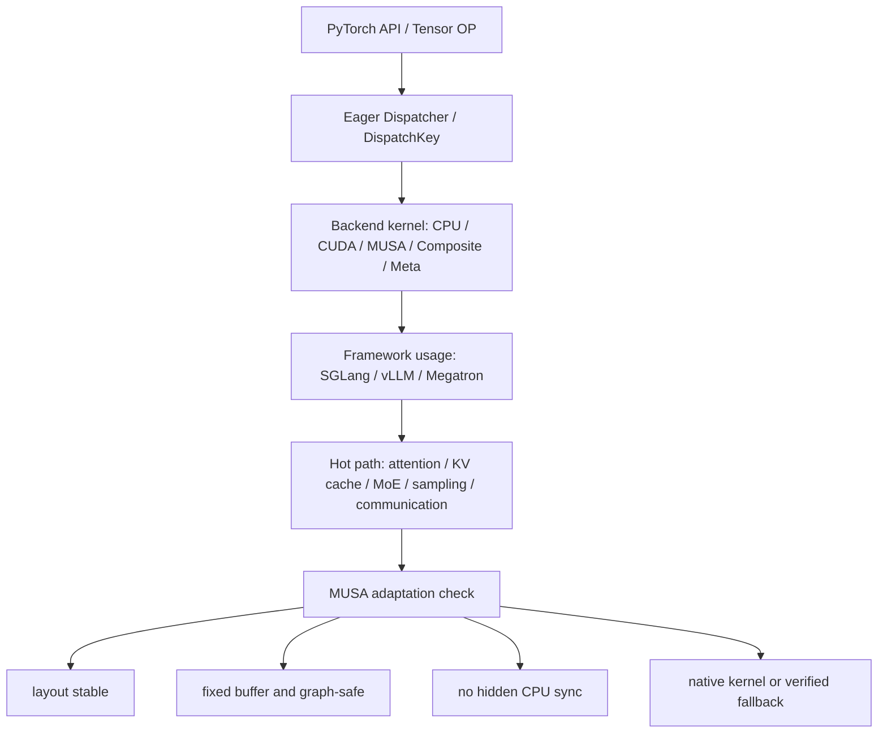
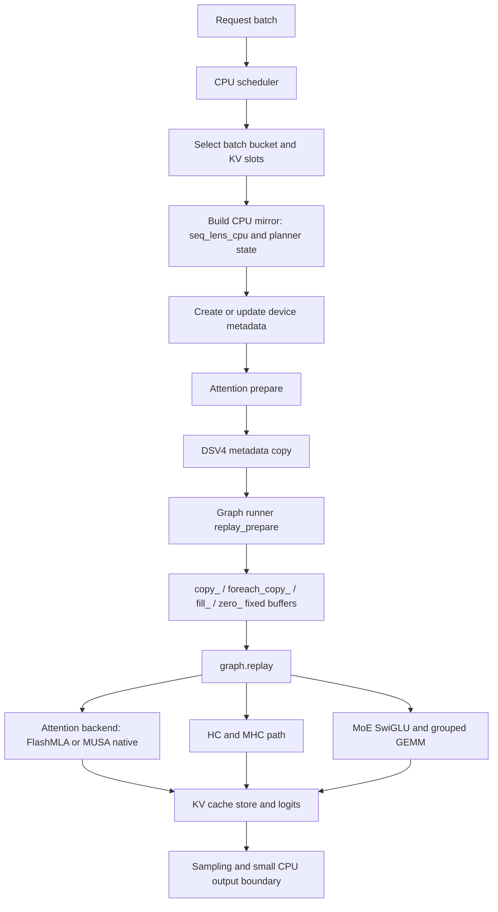
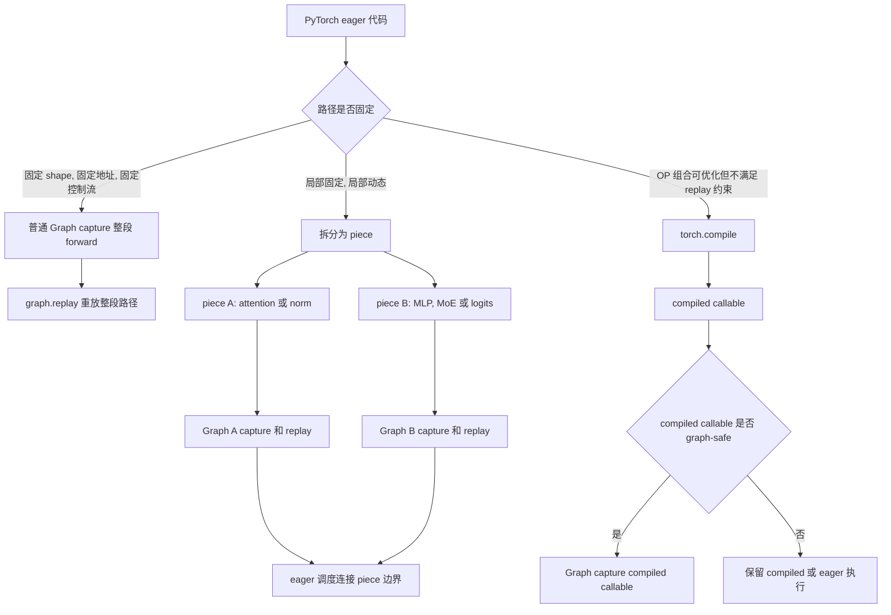
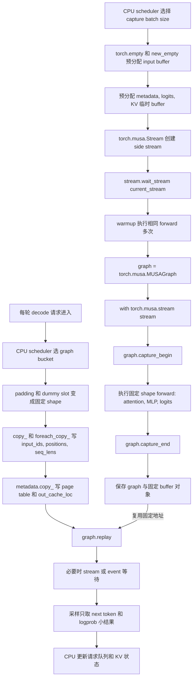

# PyTorch Op、SGLang DeepSeek V4 与 MUSA 适配综合技术洞察

## 目录

- [分享目标与听众收获](#分享目标与听众收获)
- [用例与校验说明](#用例与校验说明)
- [分享版摘要](#分享版摘要)
- [分析主线](#分析主线)
- [术语速查](#术语速查)
- [1. PyTorch 常见 Op：分类、场景、用法与关键风险](#1-pytorch-常见-op分类场景用法与关键风险)
  - [1.1 GPU Op](#11-gpu-op)
  - [1.2 CPU Op](#12-cpu-op)
  - [1.3 Sync Op](#13-sync-op)
  - [1.4 Dynamic Shape Op](#14-dynamic-shape-op)
  - [1.5 Graph Op](#15-graph-op)
- [2. PyTorch Op 在 SGLang 中的应用](#2-pytorch-op-在-sglang-中的应用)
- [3. PyTorch Op 在 vLLM 中的应用](#3-pytorch-op-在-vllm-中的应用)
- [4. PyTorch Op 在 Megatron 中的应用](#4-pytorch-op-在-megatron-中的应用)
- [5. SGLang DeepSeek V4 源码分析](#5-sglang-deepseek-v4-源码分析)
- [6. 推理场景 MUSA 最小用例](#6-推理场景-musa-最小用例)
- [7. 从 OP 视角看 Eager / Compile / Graph](#7-从-op-视角看-eager--compile--graph)
- [8. 跨后端视角下的 OP 使用与排查](#8-跨后端视角下的-op-使用与排查)
- [附录 A. PyTorch 常见 OP 详细用例与 MUSA 输出](#附录-a-pytorch-常见-op-详细用例与-musa-输出)
- [9. 总结](#9-总结)

## 分享目标与听众收获

本文定位为技术分享材料，目标不是完整的生产性能验收报告，而是帮助听众建立两层能力：

1. 掌握 PyTorch 常见 OP 的基本用法、输入输出形态、典型场景和风险边界。
2. 理解这些 OP 在 SGLang DeepSeek V4 推理链路中的真实作用：哪些 OP 负责 layout 组织，哪些 OP 负责 metadata 写回，哪些 OP 进入 Graph replay，哪些 OP 只是 fused/native kernel 的 fallback reference。

分享时可以按下面节奏展开：

| 阶段 | 推荐章节 | 听众应掌握的问题 |
|------|----------|------------------|
| OP 基础 | 术语速查、 第 1 章、附录 A | 常见 Tensor OP 怎么写、输出长什么样、什么时候会有 layout/copy/sync 风险 |
| 框架落点 | 第 2 章 | SGLang 为什么把动态请求压成固定 tensor metadata，CPU 控制面和 device 热路径如何分工 |
| DeepSeek V4 主线 | 第 5 章 | Attention prepare、DSV4 metadata、Graph runner、HC/MHC、MoE SwiGLU 分别用了哪些 OP |
| 可运行理解 | 第 6 章 | 如何把源码里的 OP 链抽成最小 MUSA 用例，并观察固定 buffer、metadata copy 和 graph replay |
| 执行模式提升 | 第 7-8 章 | 同一个 OP 在 eager、compile、Graph 和跨后端场景下为什么风险不同 |

衡量这次分享是否达标，不是要求听众记住所有 OP，而是能在看到 DeepSeek V4/SGLang 源码时判断：这个 OP 是在表达模型语义、组织 layout、维护 metadata、制造同步边界，还是在为后端 fused kernel 提供 fallback。

## 用例与校验说明

保留完整可运行用例、源码摘录和执行结果。附录 A 包含 61 个 GPU OP 用例、5 个 CPU OP 用例、2 个 Sync OP 用例、3 个 Dynamic Shape OP 用例和 1 个 Graph OP 用例；第 7.7 节包含 3 个 Graph/compile 用例（普通 Graph / Piecewise Graph / torch.compile）；第 6.1 节包含 1 个源码链路用例；第 6.2 到 6.6 节包含 5 个推理场景用例。上述 81 个用例主要用于教学演示：展示 OP API 写法、输入输出、MUSA tensor 执行结果，以及它们如何对应到 DeepSeek V4/SGLang 的工程链路。其余源码摘录用于说明真实工程上下文，重点是帮助读者识别 OP 在源码里的角色。

需要特别区分两类材料：可运行用例用于学习 OP 行为，源码摘录用于理解框架上下文。MUSA stdout 可以证明该 OP 链在当前环境下能执行并得到预期输出，但不单独证明生产性能、后端命中或无 fallback；这些内容属于后续适配验收和 benchmark 范畴，不是本文分享的主目标。

覆盖范围按阅读用途划分如下：

| 内容位置 | 覆盖对象 | 证据形式 | 阅读用途 |
|----------|----------|----------|----------|
| 第 1 章 | GPU/CPU/Sync/Dynamic Shape/Graph OP 分类 | 分类表和风险说明 | 快速建立 OP 判断框架 |
| 第 2-4 章 | SGLang、vLLM、Megatron 框架链路 | 源码位置、关键 OP、MUSA 差异 | 判断 OP 在框架中处于控制面还是热路径 |
| 第 5 章 | SGLang DeepSeek V4 关键源码 | 源码摘录、注释和工程解读 | 深入理解 DSV4 metadata、Graph、HC/MHC、MoE |
| 第 6 章 | 推理场景最小用例 | 完整代码和执行输出 | 把源码 OP 链抽成可复现实验 |
| 第 7-8 章 | Eager/Compile/Graph 与跨后端排查 | 流程图、对比表和工程归纳 | 判断同一 OP 在不同执行模式/后端中的风险 |
| 附录 A | 逐 OP 用法 | 完整代码、输入输出和 MUSA stdout | 按 OP 查具体 API 行为和输出 |

按角色选择阅读路径：

| 角色 | 推荐路径 | 先看什么 |
|------|----------|----------|
| MUSA 算子适配 / bring-up | 术语速查 → 第 1 章 → 第 8 章 → 附录 A | 先确认 OP 语义、dtype/layout、fallback 和 graph-safe 风险 |
| SGLang DeepSeek V4 推理优化 | 分析主线 → 第 2 章 → 第 5 章 → 第 6 章 | 先看 DSV4 metadata、Graph runner、HC/MHC 和 MoE SwiGLU |
| vLLM / Megatron 对比 | 第 2.11 节 → 第 3/4 章 → 第 7.7 节 | 先看三框架如何把动态控制压成固定 tensor metadata |
| PyTorch 执行模式学习 | 术语速查 → 第 1 章 → 第 7 章 | 先理解同一个 OP 在 eager、compile、Graph 中的不同风险 |
| 快速查单个 OP | 第 1 章分类表 → 附录 A OP 索引 → 对应小节 | 先定位 OP 类别，再查完整代码和 MUSA stdout |

## 分享版摘要

基于 PyTorch OP 链路、框架源码和 MUSA 用例分析，可以得到一个结论：PyTorch OP 在 AIInfra 中不是孤立 API，而是连接 Python 控制面、ATen Dispatch、后端 kernel、框架 metadata、Graph replay 和通信同步的工程边界。判断一个 OP 是否“适配完成”，不能只看它能否在 MUSA tensor 上执行，还要确认它在目标框架、目标 shape、目标 dtype、目标 layout、目标执行模式下是否走到正确后端。

SGLang、vLLM 和 Megatron 的 OP 使用方式可以用一条主线统一理解：动态决策留在 CPU 控制面，device 热路径消费固定 tensor metadata。SGLang DeepSeek V4 重点是 DSV4 metadata、HC/MHC、MoE、SwiGLU、cache store 和 Graph replay；vLLM 重点是 PagedAttention 的 block table、slot mapping、seq lens 和 sampling 同步边界；Megatron 重点是训练 step、TP/PP/EP 通信、MoE dispatch、optimizer step 和 offload 边界。

MUSA 适配的核心风险有四类。第一是功能正确但后端错误，例如静默走 CPU fallback、Composite fallback 或低效 PyTorch fallback。第二是 shape/layout 正确但性能错误，例如 `contiguous`、padding、copy ladder、碎 element-wise OP 和多次 HBM 读写进入热路径。第三是 eager 能跑但 Graph 不稳定，例如 replay 中替换 tensor 对象、动态 shape、allocator、`.item/.tolist/.cpu` 或不支持 capture 的 kernel。第四是通信功能可用但 overlap 失效，例如 async collective launch 后立即 `wait()`，或者每 token 产生多个小通信。

基于上述分析，学习路径可以按下面顺序展开：先用附录 A 确认单 OP 语义和 MUSA 输出，再用第 2 章理解 SGLang 如何组织 OP 与 metadata，再用第 5-6 章把 SGLang DeepSeek V4 的热点 OP 链抽成可运行用例，最后用第 7-8 章从 OP 视角理解 eager/compile/graph、跨后端迁移、后端选择、同步和 fallback。

## 分析主线

分析从一个问题展开：一个 PyTorch OP 从 Python API 调用开始，最终如何影响 SGLang/vLLM/Megatron 的推理或训练热路径，以及在 MUSA 后端适配中应该检查什么。单个 OP 的 API 只是入口，真正决定正确性和性能的是后端选择、layout 契约、host-device 边界、graph replay 约束和框架层 metadata 组织。



阅读时可以沿着这条链路走：第 1 章回答“OP 如何分类、怎么用、关键风险是什么”，附录 A 回答“单个 OP 的完整代码和 MUSA 输出是什么”；第 2 到 4 章回答“推理/训练框架为什么需要这些 OP”；第 5 到 6 章回答“DeepSeek V4 在 SGLang/MUSA 中具体怎么落地”；第 7 到 8 章回答“同一批 OP 在 eager、compile、graph、MindSpore 和 torch-npu/Ascend NPU 视角下应该如何排查”。

## 术语速查

下面先解释后续内容反复出现的专业术语。可以先粗读一遍，遇到不熟悉的词时再回到这里查。

### PyTorch 与 OP 基础

| 术语 | 小白解释 | 关注点 |
|------|----------|----------------|
| OP / 算子 | 一次张量操作，例如加法、矩阵乘、`copy_`、`softmax`。 | 不是只看 API 能不能调用，还要看它在框架热路径中是否高效。 |
| Tensor / 张量 | 多维数组，模型输入、权重、激活、KV cache 都是 tensor。 | 重点看 shape、dtype、device、stride 和是否连续。 |
| shape | tensor 的尺寸，例如 `[batch, hidden]`。 | shape 变化会影响 buffer、Graph 和通信 bucket。 |
| dtype | tensor 的数据类型，例如 `float16`、`bfloat16`、`int32`。 | dtype 要和后端 kernel、metadata、量化路径匹配。 |
| device | tensor 所在设备，例如 CPU、CUDA GPU、MUSA。 | CPU tensor 和 MUSA tensor 混用时容易产生拷贝或同步。 |
| layout / stride | tensor 在内存中的排布方式；stride 描述每个维度跨多少内存位置。 | shape 正确不代表 layout 适合 kernel，`contiguous()` 可能触发真实拷贝。 |
| contiguous | 内存连续排布。 | 很多 custom kernel 要求输入连续；频繁转连续会增加开销。 |
| view / reshape | 改变 tensor 形状。`view` 通常要求原内存布局兼容，`reshape` 必要时会复制。 | 用于 attention head、MoE buffer、KV cache layout 组织。 |
| in-place OP | 原地修改 tensor 的 OP，名字常以 `_` 结尾，如 `copy_`、`zero_`。 | 推理 Graph 中常用于固定 buffer 更新；训练中要小心 autograd 版本计数。 |

### 执行后端与调度

| 术语 | 小白解释 | 关注点 |
|------|----------|----------------|
| backend / 后端 | 真正执行 OP 的实现，例如 CPU、CUDA、MUSA、MuDNN、MCCL。 | OP 适配要确认最终走到目标后端，而不是错误 fallback。 |
| kernel | 跑在设备上的具体计算程序。 | 大模型性能通常取决于是否命中高性能 kernel。 |
| dispatcher / DispatchKey | PyTorch 根据 tensor 设备、dtype、layout 选择后端实现的机制。 | API 相同，device 不同，走到的 kernel 可能完全不同。 |
| ATen | PyTorch 底层张量算子库。 | 很多 `torch.*` API 最后会落到 ATen 算子。 |
| native kernel | 目标硬件的原生高性能实现。 | MUSA 上通常希望热点 OP 命中 MUSA native、MuDNN、TileLang 或 custom kernel。 |
| fused kernel | 把多个小 OP 合成一个 kernel 执行。 | 减少多次 launch 和 HBM 读写，是推理热路径常见优化。 |
| fallback | 主路径不支持时退到备用实现。 | fallback 可用于正确性验证，但不应长期进入生产热路径。 |
| Composite fallback | PyTorch 用多个基础 OP 拼出一个复合 OP。 | 功能可能正确，但性能、Graph 支持和同步行为可能不符合预期。 |
| fail-closed | 不支持时显式报错，而不是静默走错误或低效路径。 | MUSA 适配中比“悄悄 fallback”更安全。 |

### 执行模式：Eager、Compile 与 Graph

| 术语 | 小白解释 | 关注点 |
|------|----------|----------------|
| eager | PyTorch 默认模式，代码执行到一行就运行一行。 | 灵活，适合调试；但 Python 调度和小 OP launch 开销较高。 |
| `torch.compile` | PyTorch 编译模式，尝试把一段 Python/tensor 代码优化成更高效的执行图。 | 需要关注 dynamic shape、graph break、fallback 和后端模板命中。 |
| Graph / CUDA Graph / MUSA Graph | 把一段固定设备执行流程录制下来，之后反复 replay。 | 适合 decode 等固定路径，要求固定 shape、固定地址、固定执行序列。 |
| capture | Graph 第一次录制执行流程。 | capture 中不能有不支持的同步、动态分配或不稳定 OP。 |
| replay | 按录制好的流程重复执行。 | replay 前只能更新固定 buffer 内容，不能替换 tensor 对象。 |
| graph-safe | 某个 OP 或 kernel 可以安全放进 Graph capture/replay。 | MUSA 上要逐项验证 fused/custom kernel 是否 graph-safe。 |
| fixed buffer | capture 前预分配、replay 时反复复用的 tensor。 | SGLang/vLLM 会把输入、metadata、logits 等写入固定 buffer。 |
| allocator | 负责分配/释放 tensor 内存的组件。 | Graph replay 内频繁分配会破坏固定地址假设。 |

### 同步、流与数据搬运

| 术语 | 小白解释 | 关注点 |
|------|----------|----------------|
| Sync OP / 同步算子 | 会让 CPU、设备或不同 stream/rank 等待的操作。 | `.item()`、`.cpu()`、`synchronize()` 常隐藏性能问题。 |
| stream | 设备上的执行队列。 | 多 stream 可让 copy、compute、通信重叠。 |
| event | stream 之间表达依赖的标记。 | 比全设备同步更细粒度。 |
| overlap | 让计算、通信、拷贝同时进行。 | 过早 `wait()` 会让 overlap 失效。 |
| H2D / D2H | Host-to-Device / Device-to-Host，即 CPU 到设备、设备到 CPU 的数据搬运。 | 小 tensor 高频搬运会放大延迟。 |
| HBM | GPU/MUSA 设备上的高带宽显存。 | 小 OP 链可能反复读写 HBM，降低效率。 |
| CPU mirror | CPU 上保存一份与 device metadata 对应的小状态。 | scheduler 用 CPU mirror 做决策，避免对 MUSA tensor `.item()`。 |
| host-device boundary | CPU 和设备之间的边界。 | 这里最容易出现隐式同步和数据搬运。 |

### 推理框架术语

| 术语 | 小白解释 | 关注点 |
|------|----------|----------------|
| SGLang | 面向大模型服务和推理的框架。 | 主线框架，用 DeepSeek V4 分析 MUSA 适配。 |
| vLLM | 面向高吞吐 LLM 服务的推理框架。 | 重点看 PagedAttention、KV block、sampling 和 graph replay。 |
| Megatron | 大模型训练框架。 | 重点看并行通信、训练 step、optimizer 和 MoE。 |
| prefill | 首次处理用户 prompt 的阶段。 | token 多、序列长，attention 和 KV 写入压力大。 |
| decode | 每次生成新 token 的阶段。 | 每步计算小但频率高，Graph、metadata、sync 很关键。 |
| sampling | 从 logits 中选择下一个 token。 | `topk/argmax/softmax` 后通常只把少量结果返回 CPU。 |
| logits | 模型输出的词表分数。 | 完整 logits 很大，不应频繁 `.cpu()`。 |
| tokenizer / detokenizer | 文本和 token id 之间的转换工具。 | 属于 CPU 控制面，影响服务端延迟。 |
| metadata | 描述计算所需的辅助信息，例如 seq lens、page table、slot mapping。 | 通常小但很关键，必须和 backend kernel 契约一致。 |
| scheduler | 调度器，决定哪些请求组成 batch、使用哪些 KV 位置。 | 动态决策应留在 CPU 控制面。 |
| bucket | 把不同大小的请求归到固定规格，例如 batch bucket。 | Graph replay 常靠 bucket 获得固定 shape。 |

### Metadata 与调度对象

| 术语 | 小白解释 | 关注点 |
|------|----------|----------------|
| metadata | “给计算看的说明书”，不是模型权重本身，而是告诉 kernel 怎么读写数据的辅助信息。 | 例如每个请求多长、KV cache 在哪里、哪些 token 有效。 |
| attention metadata | attention kernel 的输入说明书。 | 通常包含 `seq_lens`、`positions`、page/block 表、cache 写入位置等。 |
| PagedAttention metadata | vLLM PagedAttention 使用的 metadata，描述 token 如何映射到分页 KV cache。 | 核心字段包括 `block_tables`、`slot_mapping`、`seq_lens_tensor`、query/start 位置等。 |
| DSV4 metadata | SGLang DeepSeek V4 attention backend 使用的 metadata。 | 重点是 DSV4/FlashMLA 所需的 page table、不同稀疏分支索引、seq lens 和 out loc。 |
| FlashMLA metadata | FlashMLA kernel 需要的专用 attention metadata。 | 通常由 backend 构造，Graph replay 时要保证引用和 tensor 字段更新方式正确。 |
| sampling metadata | 采样阶段的辅助信息。 | 描述哪些请求要 greedy、top-k/top-p、temperature、stop 条件等。 |
| forward batch | 一次 forward 要处理的请求集合。 | 里面通常带 input ids、positions、seq lens、cache loc、sampling 配置等字段。 |
| request / sequence | request 是用户请求；sequence 是请求内部正在处理或生成的 token 序列。 | scheduler 以它们为单位做 batch、cache 和停止条件管理。 |
| `seq_lens` | 每个请求当前序列长度。 | device 侧用于 attention；CPU mirror 侧用于 scheduler 和 bucket 选择。 |
| `seq_lens_cpu` | CPU 上保存的 `seq_lens` 副本。 | 用它做 `.item()`、`max()` 等 host 决策，避免同步 MUSA tensor。 |
| `positions` | 每个 token 在序列中的位置编号。 | RoPE、attention mask 和 prefill/decode 都依赖它。 |
| `req_pool_indices` | 请求在 request pool 中的索引。 | SGLang 用它把 batch 内 token 映射回请求状态和 KV pool。 |
| `out_cache_loc` | 新 token 的 K/V 要写入 KV cache 的位置。 | Graph replay 前常通过 `copy_` 写入固定 metadata buffer。 |
| `block_tables` | vLLM 中每个 sequence 使用哪些 KV block 的表。 | PagedAttention 根据它找到历史 K/V 所在 block。 |
| `slot_mapping` | token 到 KV cache 具体 slot 的映射。 | 写 KV cache 和读取新 token 位置时都要用。 |
| page / block | KV cache 的分页单位，可以理解为一小块连续 cache 空间。 | 分页让不同长度请求能复用 cache 空间。 |
| page table | 记录 sequence 到 page 的映射表。 | SGLang/vLLM 的 attention backend 都会读这类表。 |
| cache loc / cache slot | KV cache 中的具体写入位置。 | 错位会导致 token 读到错误历史 K/V。 |
| dummy request / padding | 为了凑固定 batch 或固定 shape 加入的占位请求或占位 token。 | Graph replay 需要固定 shape，但 padding 区域不能影响真实输出。 |

不同框架里同类对象的命名经常不同，可以按下面方式对应理解：

| 概念 | SGLang 常见名字 | vLLM 常见名字 | Megatron 常见名字 |
|------|----------------|---------------|-------------------|
| 一轮执行的请求集合 | `forward_batch`、`req_pool_indices` | sequence group、scheduler output | micro-batch |
| 序列长度 | `seq_lens`、`seq_lens_cpu` | `seq_lens_tensor`、query/start loc | sequence length、micro-batch shape |
| KV cache 位置 | `out_cache_loc`、page indices | `slot_mapping`、`block_tables` | training 通常不使用服务式 KV page |
| 固定执行规格 | graph bucket、batch bucket | cudagraph batch size、padded input tokens | micro-batch size、pipeline schedule |
| 动态控制面 | scheduler、request pool | scheduler、block manager | training loop、parallel state |

### Attention、KV Cache 与 MoE

| 术语 | 小白解释 | 关注点 |
|------|----------|----------------|
| attention | LLM 中让 token 互相关联的核心计算。 | 热点路径通常要命中 FlashAttention、FlashMLA 或 PagedAttention。 |
| KV cache | 保存历史 token 的 Key/Value，decode 时避免重复计算。 | cache layout、page table、slot mapping 直接影响性能和正确性。 |
| page table / block table | 记录 token 的 KV cache 放在哪个 page/block。 | vLLM/SGLang 的 attention backend 会读取这些 metadata。 |
| slot mapping | token 到 KV cache 具体位置的映射。 | PagedAttention 写入和读取 KV cache 的关键输入。 |
| PagedAttention | vLLM 用 page/block 管理 KV cache 的 attention 方案。 | MUSA 适配要确认实际命中 PagedAttention custom kernel。 |
| FlashAttention / FlashMLA | 高性能 attention kernel 家族。 | 用于替代 `bmm + softmax + bmm` 这类低效 reference 路径。 |
| RoPE | Rotary Position Embedding，旋转位置编码。 | attention 前处理会调整 Q/K 的位置相关部分。 |
| RMSNorm | 常见归一化层。 | 常被 fused kernel 替代，避免多个小 OP。 |
| MLP / Dense | Transformer 中的全连接前馈层。 | 主要计算通常是 GEMM。 |
| GEMM | 通用矩阵乘。 | `matmul/F.linear` 的核心计算，通常需要高性能后端。 |
| MoE | Mixture of Experts，混合专家模型。 | token 被路由到不同 expert，带来 top-k、dispatch、combine 和通信。 |
| expert | MoE 中的一个子网络。 | expert 分布、padding、负载均衡会影响性能。 |
| routing / top-k | 为每个 token 选择前 k 个 expert。 | `topk/gather/scatter` 输出要和后续 buffer、通信契约一致。 |
| dispatch / combine | dispatch 把 token 发给 expert，combine 把结果合回来。 | MoE 性能常卡在重排、all-to-all 和 combine。 |
| SwiGLU | 一种 MLP 激活结构。 | MUSA 上要确认 `torch.nn.SwishGLU` 或 fused path 数值和 layout 对齐。 |
| HC/MHC | DeepSeek V4 中的 Hyper-Connection / Multi-Head Hyper-Connection 路径。 | PyTorch fallback 能表达语义，但热路径需要 TileLang/MUSA native 替换。 |

### 分布式与后端生态

| 术语 | 小白解释 | 关注点 |
|------|----------|----------------|
| TP / PP / DP / EP | Tensor / Pipeline / Data / Expert Parallel，并行训练或推理方式。 | 决定通信 OP、buffer shape 和 overlap 方式。 |
| collective | 多卡之间的集体通信操作。 | `all_reduce/all_gather/reduce_scatter/all_to_all` 都属于 collective。 |
| `all_reduce` | 多卡把数据求和/聚合后每卡都拿到结果。 | 常用于梯度或张量并行结果同步。 |
| `all_gather` | 每卡收集所有卡的数据。 | 常用于拼接并行切分后的 tensor。 |
| `reduce_scatter` | 聚合后再切分到各卡。 | 常和 tensor parallel、optimizer sharding 相关。 |
| `all_to_all` | 每卡给每卡发送不同数据。 | MoE expert parallel 常用，高度依赖 shape/padding。 |
| NCCL / MCCL | CUDA/MUSA 生态中的多卡通信库。 | MUSA 上关注 MCCL 通信是否与计算 overlap。 |
| MuDNN | MUSA 的深度学习算子库。 | 类似 CUDA 生态中的高性能库，负责部分 dense/attention/activation 路径。 |
| TileLang | 用 tile 方式描述和生成高性能 kernel 的工具。 | SGLang MUSA 适配中用于替换碎 OP fallback。 |
| DeepGEMM | 面向大模型 GEMM 的高性能实现。 | Dense/MLP 热路径应优先命中这类高性能 GEMM。 |
| MindSpore | 另一套 AI 框架，强调图编译和静态分析。 | 用它说明 shape/type、format、副作用推导的重要性。 |
| torch-npu / Ascend NPU | PyTorch 在 Ascend NPU 上的后端生态。 | 用它说明 format cast、AICPU fallback、profiler 排查经验。 |
| MUSA | 摩尔线程 GPU 后端。 | 关注 PyTorch OP 在 MUSA 上的语义、性能、Graph 和框架适配。 |

## 1. PyTorch 常见 Op：分类、场景、用法与关键风险

这里保留主线需要的 OP 分类、典型场景、使用方式和风险判断。逐 OP 的完整代码、输入说明、MUSA stdout 和注意事项已移动到 [附录 A](#附录-a-pytorch-常见-op-详细用例与-musa-输出)，避免主线被大量示例打断。阅读时先用这里的分类建立判断框架，再到附录按 OP 查具体行为。

PyTorch OP 在 AIInfra 中通常服务五类问题：GPU OP 组织 device 侧计算和 layout，CPU OP 承担控制面与 metadata，Sync OP 决定 stream/device/rank 时序，Dynamic Shape OP 暴露 graph/compile 风险，Graph OP 复用固定地址和固定执行序列。判断一个 OP 是否适合热路径，要同时看语义、内存、同步、shape、dispatch 和后端实现。

### 1.1 GPU Op

GPU OP 是模型 forward、attention、MoE、sampling、KV cache 和 fallback reference 的基础表达。常见类别包括创建初始化、原地更新、shape/layout、索引映射、拼接填充、数学激活、线性代数、排序路由、dtype/device 转换。

| 类别 | 常见 OP | 典型场景 | 如何使用 | 关键风险 | 附录位置 |
|------|---------|---------|---------|---------|---------|
| 创建初始化 | `empty/new_empty/empty_like/zeros/ones/full` | input buffer、KV cache、logits、padding、临时 workspace | capture 前预分配固定 shape/device/dtype；`empty` 后必须由后续 kernel 完整写入 | 未初始化读、replay 中替换 tensor 对象、频繁分配破坏性能 | [A.1.1](#a11-tensor-创建与初始化) |
| 原地更新 | `copy_/fill_/zero_/clamp_/mul_` | graph buffer 更新、metadata 写回、padding 清理、激活裁剪 | replay 前修改既有 tensor 内容，保持对象地址不变 | 训练中破坏 autograd version；capture 中写入非固定对象 | [A.1.2](#a12-原地复制与更新) |
| Shape/Layout | `view/reshape/flatten/unsqueeze/expand/permute/contiguous` | attention head layout、RoPE 输入、MoE expert 维度、kernel layout 契约 | 优先使用 view 类零拷贝表达 layout；后端要求连续时显式 `contiguous()` | 隐式 copy、stride 不匹配、zero-stride expand 被写入 | [A.1.3](#a13-形状布局与广播) |
| 索引映射 | `gather/scatter/index_select/masked_fill/where` | token 路由、KV page 写入、mask、sampling 过滤 | 索引 dtype 和 device 要与 kernel 契约一致；写路径确认覆盖范围 | index 越界、重复写冲突、mask shape 广播错误 | [A.1.4](#a14-索引切分与映射) |
| 序列组合 | `cat/stack/split/chunk/pad` | batch 拼接、MoE gate/up 拆分、bucket padding | 热路径尽量固定输出 shape；padding 到 capture bucket | 动态输出导致 allocator 和 graph replay 不稳定 | [A.1.5](#a15-序列拼接填充与条件选择) |
| 数学激活 | `sum/mean/rsqrt/silu/softmax/log_softmax/sigmoid` | RMSNorm、SwiGLU、sampling、fallback reference | 小输入用于验证 fused kernel 语义，大规模热路径优先融合 | 碎 OP 链带来多次 launch 和 HBM 读写 | [A.1.6](#a16-数学归约与激活) |
| 线性代数/路由 | `matmul/F.linear/topk/sort/argmax` | GEMM、LM head、MoE top-k、sampling | 确认 dtype、layout、workspace 和 backend kernel 命中 | fallback、排序稳定性、top-k 输出 shape 与后续 buffer 不一致 | [A.1.7](#a17-线性代数排序与路由) |
| dtype/device | `to/float/half/int/long` | metadata dtype、FP16/BF16/FP8 路径、CPU/MUSA 转换 | dtype 转换放在边界处集中处理；metadata 常用 `int32` | 隐式 H2D/D2H、额外 cast、后端不支持当前 dtype | [A.1.8](#a18-dtype-与-device-转换) |

基于 GPU OP 场景分析，`view/empty/arange` 通常只是组织数据，不能直接等同于瓶颈。真正需要警惕的是隐式 copy、频繁分配、小 OP 链、layout 转换和 fallback。SGLang DeepSeek V4 中 `copy_`、`contiguous`、`pad`、`SwishGLU` 的价值都要结合 graph replay 和后端 kernel 契约理解。

### 1.2 CPU Op

CPU OP 负责控制面，而不是 device 热路径计算。常见类别包括 Python 容器、CPU tensor metadata、host-device 边界转换、标量读取、序列化和 H2D metadata 上传。

| 类别 | 常见 OP | 典型场景 | 如何使用 | 关键风险 |
|------|---------|---------|---------|---------|
| Python 控制面 | `list/dict/len/range/sort` | request 队列、block table、prefix cache、bucket 选择 | 在 CPU 维护调度状态，device 只消费规划后的 tensor metadata | Python 控制流进入每 token 热路径会放大调度开销 |
| CPU metadata | CPU tensor、`torch.tensor(..., device="cpu")` | `seq_lens_cpu`、batch size、max seq len、cache block id | 为需要 host 决策的字段维护 CPU mirror，并与 device tensor 同步更新 | CPU mirror 与 device tensor 不一致会导致 replay metadata 错误 |
| Host 边界转换 | `.cpu()`、`.numpy()`、`.tolist()` | 日志、debug、小规模统计、协议侧输出 | 只在控制面或调试边界使用，避免搬运大 tensor | device tensor 回 CPU 常触发同步和 D2H copy |
| 标量读取 | `.item()`、`int(tensor)` | loss scalar、单个 token id、CPU planner 的小结果 | 优先作用在 CPU mirror；device 标量只在必要边界读取 | 在 MUSA tensor 上每 token `.item()` 会形成隐式 barrier |
| H2D 上传 | `torch.as_tensor(..., device)`、`to(device)`、pinned memory | CPU scheduler 生成 seq_lens、positions、page table 后上传 | 上传固定 shape metadata，尽量集中处理并复用 buffer | 频繁小 tensor 上传会增加 launch/拷贝和同步成本 |

> CPU OP 的完整用例见 [附录 A.2](#a2-cpu-op)。A.2.1 覆盖 `.cpu/.numpy/.item/.tolist` 等边界转换；A.2.2 给出 MUSA 环境综合用例。

基于 CPU OP 场景分析，问题不是“不能用”，而是要限制在控制面。推理热路径的原则是 CPU 负责规划，device 负责计算，graph replay 只消费已准备好的固定 buffer。

### 1.3 Sync Op

Sync OP 管理 CPU、device stream、graph replay 和分布式 rank 的时序。常见类别包括全设备同步、局部 stream/event 同步、graph replay 边界、分布式通信同步和隐式同步 API。

| 类别 | 常见 OP | 典型场景 | 如何使用 | 关键风险 |
|------|---------|---------|---------|---------|
| 全设备同步 | `torch.musa.synchronize()`、`torch.cuda.synchronize()` | benchmark 计时、debug、错误定位 | 只放在测量边界或诊断边界，保证前序 device 任务完成 | 进入 decode 热路径会打断 CPU/device/通信 overlap |
| Stream/Event | `current_stream()`、`Stream`、`Event.record()`、`wait_event()` | 多 stream copy/compute 编排、异步 H2D、cache store overlap | 用 event 表达局部依赖，避免全设备等待 | wait 范围过大等价于串行化，capture 中还要确认 API 支持 |
| Graph 边界 | `graph.replay()` 前后的必要 wait | replay 前更新 fixed buffer，replay 后在消费输出前等待 | replay 内保持固定执行序列，边界处做最小同步 | replay 中出现不支持 capture 的同步或 CPU 依赖会失败 |
| 分布式通信 | `all_reduce`、`reduce_scatter`、`all_gather`、work wait | TP/PP/DP 通信、梯度同步、MoE expert 通信 | 尽量使用异步通信并与计算 overlap，只在数据依赖点等待 | 过早 wait 会破坏 overlap，shape 不稳定会影响通信 bucket |
| 隐式同步 | `.item()`、`.tolist()`、`.cpu()`、异常检查 | 小结果输出、日志、host 分支 | 只在控制面边界使用，热路径用 CPU mirror 或固定 metadata | 表面不是 sync API，但会让 host 等待 device 结果 |

> Sync OP 的完整用例见 [附录 A.3](#a3-sync-op)。A.3.1 覆盖 `synchronize` 等全设备同步；A.3.2 给出 stream/event 与 graph 组合的 MUSA 环境用例。

基于 Sync OP 场景分析，同步边界是性能排查的第一类高风险点。一个 `.item()`、一次全设备 synchronize 或一个错误的 stream wait，都可能把本来可以 overlap 的 CPU 调度、device 计算和通信串起来。

### 1.4 Dynamic Shape Op

Dynamic Shape OP 的输出 shape 依赖输入数据值。常见类别包括位置发现、去重统计、mask 压缩、变长拼接和数据依赖索引。它们在 eager 调试和 CPU 规划中很自然，但对 `torch.compile`、CUDA/MUSA Graph、固定 buffer replay 和分布式通信 shape 都不友好。

| 类别 | 常见 OP | 典型场景 | 如何使用 | 关键风险 |
|------|---------|---------|---------|---------|
| 位置发现 | `nonzero`、`argwhere` | 找有效 token、稀疏 mask 调试、CPU planner | 用于控制面统计或调试；热路径用固定 mask/padding 表达有效位 | 输出行数随数据变化，graph replay 难固定 |
| 去重统计 | `unique`、`unique_consecutive` | 统计 expert id、block id、request id、debug 分布 | 小规模统计可用；生产路由优先固定 expert 数或 histogram | 输出集合大小和顺序不稳定，排序/去重开销高 |
| Mask 压缩 | `masked_select`、boolean indexing | 抽取满足条件的 token/logits/metadata | 适合调试或 CPU 规划；热路径用 `where` 保持固定 shape | 输出一维长度动态，后续 buffer 和通信 shape 难规划 |
| 变长组合 | data-dependent `cat/split` | 不同 request 的变长 token 拼接、动态 batch 构造 | 在 scheduler 侧完成 bucket/padding，再上传固定 shape tensor | allocator 频繁分配，compile/graph 需要 guard 或 graph break |
| 数据依赖索引 | mask 后 `gather/index_select` | MoE 路由、稀疏 token 选择、cache block 选择 | 将动态选择结果转成固定 top-k、固定 page table 或 padded index | index 数量变化会传导到 kernel launch 和通信 bucket |

> Dynamic Shape OP 的完整用例见 [附录 A.4](#a4-dynamic-shape-op)，覆盖 `nonzero`、`unique`、`masked_select` 等。

基于 Dynamic Shape OP 场景分析，动态 shape 不是功能问题，而是图编译和运行时内存问题。生产推理通常把动态性收敛到 CPU planner、bucket、padding、mask、page table 和固定大小 metadata。

### 1.5 Graph Op

Graph OP 用于复用固定 shape、固定地址、固定执行序列，降低 launch 和 Python 调度开销。MUSA/CUDA Graph 的核心不是优化数学计算，而是把已经确定的 device 执行路径录制下来，后续只 replay。

| 阶段 | 常见 API/OP | 如何使用 | 关键风险 |
|------|-------------|---------|---------|
| 预分配 | `empty/new_empty/zeros` | capture 前创建固定 input/output/metadata buffer | replay 中不能替换 tensor 对象 |
| 录制 | `MUSAGraph`、graph context、warmup | 使用稳定 shape 和稳定地址执行一次 | 动态 shape、CPU sync、不支持 capture 的 backend 会失败 |
| 更新输入 | `copy_/fill_/zero_/_foreach_copy_` | replay 前只改固定 buffer 内容 | 新分配或对象替换破坏 capture 假设 |
| 执行 | `graph.replay()` | 在相同 bucket 下复用录制路径 | batch/seq 超出 capture bucket 需要重新选择 graph |

> Graph OP 的完整用例见 [附录 A.5](#a5-graph-op)，包含完整 capture/replay 流程和 mermaid 生命周期图。附录 A.3.2 还给出了 stream/event 与 graph 组合的复合用例。

基于 Graph OP 场景分析，Graph 的收益来自稳定性。SGLang DeepSeek V4 的 decode graph 依赖 `copy_` metadata、padding bucket、CPU mirror 和固定 graph input buffer；vLLM 和 Megatron 中类似问题也会出现在 PagedAttention、通信 bucket 和训练 step replay 中。

## 2. PyTorch Op 在 SGLang 中的应用

**定位**：SGLang 是 DeepSeek V4/MUSA 分析的主线推理框架。下面按照统一源码分析模板展开：先给出源码依据和执行主线，再说明 OP 分层、CPU 算子、Sync 算子，随后贴出开源 SGLang 关键源码链路，最后分析 MUSA 适配差异和检查清单。

基于 SGLang 源码分析，可以先抓住一条线：PyTorch OP 在这里被分成模型语义、metadata、graph replay 和 fused backend 四层。DeepSeek V4 的 attention、MoE、HC/MHC、sampling、CPU 控制面和 Sync OP 都围绕这条线展开，MUSA 适配也主要落在 layout、graph-safe、fallback 和 backend native 这些边界上。

SGLang 中 PyTorch OP 的主要职责是表达模型语义、组织 tensor 生命周期、构造 attention/MoE metadata、驱动 CUDA/MUSA Graph replay，以及为 fused kernel 提供 fallback。生产热路径会把 GEMM、attention、MoE、SwiGLU、HC/MHC 和 cache store 下沉到 DeepGEMM、Flash/MLA、TileLang 或 MUSA native backend。

### 2.1 源码依据与执行主线

源码依据：SGLang 源码。重点对应 `python/sglang/srt/models/deepseek_v4.py`、`python/sglang/srt/layers/attention/deepseek_v4_backend.py`、`python/sglang/srt/model_executor/cuda_graph_runner.py`、`python/sglang/jit_kernel/deepseek_v4.py` 与 `python/sglang/srt/hardware_backend/layers/deepseek_v4_musa/`。

执行主线可以概括为：CPU scheduler 先决定请求 batch、KV 位置、seq lens 和 graph bucket；PyTorch tensor OP 把这些动态状态写入固定 device buffer；attention、MoE、HC/MHC、SwiGLU 和 cache store 尽量下沉到 FlashMLA、DeepGEMM、TileLang 或 MUSA native backend；graph replay 只重复固定 shape、固定地址、固定路径的 device 执行。

### 2.2 OP 分层与热路径

SGLang 中 PyTorch OP 主要承担四类职责：表达模型语义、组织 metadata、维护 graph replay 固定 buffer、提供 fused kernel 的 fallback reference。生产热路径不会长期停留在 PyTorch eager 小 OP 链上，而是下沉到 DeepGEMM、FlashMLA/FlashAttention、MegaMoE、TileLang 或 MUSA native backend。

| 路径 | 典型 OP | SGLang 中的作用 | 热路径判断 |
|------|---------|----------------|------------|
| Dense/MLP | `F.linear/matmul/silu/gelu` | 表达 projection、MLP 和 fallback | 生产路径应命中 DeepGEMM、MuDNN、TileLang 或 fused kernel |
| Attention metadata | `empty/arange/indexing/to(int32)/copy_` | 构造 DSV4/FlashMLA 所需 page table、seq lens、positions | dtype、padding、contiguous 和 graph bucket 必须稳定 |
| HC/MHC fallback | `flatten/square/mean/rsqrt/F.linear/sigmoid/sum` | 表达 hyper-connection 语义，便于对齐验证 | decode 热路径应下沉到 TileLang/MUSA native kernel |
| MoE routing | `topk/gather/scatter/view/float` | expert 选择、dispatch/combine 和 grouped GEMM 输入组织 | top-k、index dtype、expert padding 和通信契约必须一致 |
| Graph replay | `copy_/_foreach_copy_/fill_/zero_/graph.replay` | replay 前更新固定 buffer 内容 | 不能替换 tensor 对象，不能引入动态 shape 和 CPU sync |
| CPU 边界 | `.item/.tolist/.cpu` | 小结果、CPU mirror、debug 和输出边界 | 不应读取完整 logits、hidden states 或大 metadata |

DeepSeek V4 的详细模块结构、attention prepare、DSV4 metadata、graph runner、HC/MHC 和 MoE SwiGLU 源码拆解放在第 5 章；这些 OP 链抽取出的 MUSA 最小用例放在第 6 章。这里仅保留 SGLang 框架层的 OP 使用方式，避免和源码章节重复。

### 2.3 常用 CPU 算子

`dict/list/deque/set` 用于 request queue、KV cache 分配、prefix cache、batch 合并和 speculative 状态管理。它们属于 CPU 控制面，必须在 graph replay 前压成固定 shape 的 tensor metadata。

`len/sum/max/min/sorted/bisect` 用于 token budget、batch bucket、seq lens、cache page 和请求优先级判断。正确边界是只读取 CPU mirror，例如 `seq_lens_cpu`；不要对 MUSA tensor 做 `.item()` 后再参与 scheduler 决策。

`json/msgpack/protobuf/tokenizer` 用于协议输入输出、tokenize/detokenize、stop criteria 和 guided decoding 状态更新。这些工作会影响尾延迟，应与 device 执行流解耦，只传递 token id、logprob 和少量状态。

`torch.load/safetensors/index` 用于权重、量化 scale、KV pool sizing 和启动期初始化。它们影响启动和 reload，不应进入每 token decode 热路径。

### 2.4 常用 Sync 算子

`.item/.tolist/.cpu` 是 SGLang 中最需要警惕的隐式同步。它们只适合最终 token、少量统计、debug dump 或 CPU mirror，不应读取完整 logits、hidden states、KV metadata 或 graph buffer。

`copy_/_foreach_copy_` 是 graph replay 前的关键同步边界：它把真实请求写入 capture 时保留下来的固定 buffer。它不是坏 OP，但数量过多会放大 H2D/D2D 带宽压力，因此需要分组、批量化和 buffer 复用。

`torch.cuda.synchronize()` 或 `torch.musa.synchronize()` 只应出现在 warmup、benchmark、profile 和明确一致性点。在线 decode 热路径应使用 stream/event 局部依赖，而不是全设备等待。

分布式场景中的 `all_gather/all_reduce/all_to_all` 由 CPU 发起 launch，后端通信库执行。SGLang 的优化目标是通信与计算 overlap，避免每 token 大量小 collective 被 Python 控制流切碎。

### 2.5 开源 SGLang 源码链路索引

第 2 章只保留框架层结论，源码级展开统一放到第 5 章，避免同一段逻辑重复分析。SGLang DeepSeek V4 中与 OP 直接相关的关键链路如下：

| 链路 | 源码位置 | 关键 OP | 需要在第 5 章展开的问题 |
|------|----------|---------|--------------------------|
| DSV4 attention metadata copy | `python/sglang/srt/layers/attention/deepseek_v4_backend.py` | `copy_`、metadata tensor、dtype/layout | replay 前如何只更新内容、不替换对象 |
| CUDA/MUSA Graph runner | `python/sglang/srt/model_executor/cuda_graph_runner.py` | `fill_`、`zero_`、`copy_`、`_foreach_copy_`、`graph.replay()` | batch bucket、固定 buffer、padding 和 replay 边界 |
| HC/MHC fallback 与 fused path | `python/sglang/srt/models/deepseek_v4.py` | `flatten`、`float`、`square`、`mean`、`rsqrt`、`F.linear`、`contiguous` | fallback 语义如何被 TileLang/MUSA native kernel 替换 |
| MoE SwiGLU 与 intermediate buffer | `python/sglang/srt/layers/moe/moe_runner/triton_utils/fused_moe.py` | `empty`、`view`、`clamp_`、`torch.nn.SwishGLU` | `empty` 完整写入、contiguous 契约和 CUDA/MUSA fused kernel 差异 |

阅读顺序建议是：先在这里确认 OP 属于 metadata、graph、fallback 还是 fused backend；再到第 5 章看源码摘录和注释；最后用第 6 章的 MUSA 最小用例验证同类 OP 链是否能在目标环境稳定执行。

### 2.6 MUSA 适配差异概览

MUSA 适配版与开源版的核心 metadata、DSV4 backend 和 Graph bucket 思路基本一致，差异主要来自后端算子、工具链和 graph capture 能力。

| 差异点 | 开源 SGLang 路径 | MUSA 适配关注点 | 根因 |
|--------|------------------|----------------|------|
| HC/MHC | PyTorch fallback、CUDA fused kernel、torch.compile | 用 TileLang/MUSA native kernel 替换碎 OP 链 | `flatten → square → mean → rsqrt → F.linear` 会产生多次 launch 和 HBM 读写 |
| SwiGLU/quant | CUDA JIT、CUDA FP8 layout、fused `silu_and_mul` | 使用 MUSA `SwishGLU` 或 MUSA quant path | NVRTC、FP8 layout、MMA 指令和 runtime API 不能直接复用 |
| cache store | CUDA fused store | `fused_store_cache_musa` | KV pack-store 依赖 cache layout、tile 调度和 backend indexer |
| Graph replay | 固定对象、`copy_` 更新、`graph.replay()` | 逐项确认 capture 内 OP 和 fused kernel graph-safe | capture/replay 模型相同，但 MUSA 支持的 backend op 集不同 |
| JIT C++ | NVCC、CUDA API、C++20 | clang 方言、MUSA runtime、内建函数替换 | CUDA PTX/内建函数与 MUSA 不直接兼容 |

基于 MUSA 分支差异分析，更稳妥的做法是保持模型层薄分派，把后端实现集中到 `hardware_backend/layers/deepseek_v4_musa/`；对不支持的 FP8 scale layout、非 contiguous 输入、未验证 graph capture 的路径 fail-closed，避免静默 fallback。


### 2.7 SGLang Graph 边界（精简）

SGLang 的 Graph 用法遵循固定规则：动态决策在 Graph 外完成，Graph 内只消费固定 shape、固定地址、固定执行路径的 tensor。CPU scheduler 先选择 batch bucket、KV 位置和 seq lens；replay 前通过 `copy_/_foreach_copy_/fill_/zero_` 更新 capture 时保留的固定 buffer；replay 中执行 attention、MLP/MoE 和 logits 等稳定路径。

对 DeepSeek V4 来说，DSV4 metadata 也遵循同一模式：普通 tensor 字段原地 `copy_`，特殊 FlashMLA metadata 按源码约定更新引用。风险点是 replay 内出现 `.item/.tolist/.cpu`、动态 shape、allocator、新 tensor 替换或不支持 capture 的 backend kernel。

普通 Graph、Piecewise Graph、`torch.compile` 的详细对比，以及 3 段 MUSA 可执行 Graph/compile 用例，已统一移动到 §7.7，避免第 2 章承担通用执行模式说明。

### 2.8 CPU 同步风险清单

`.item()` 会把 GPU scalar 转成 Python scalar，并阻塞相关 stream。DeepSeek V4 中只应对 CPU mirror tensor 使用该调用。

`.tolist()` 会把 GPU tensor 转成 Python list，形成 D2H 同步。`seq_lens`、`extend_seq_lens` 等 planner 输入应维护 CPU mirror。

`.cpu()` 会触发 D2H copy，并在后续 CPU 读取结果前形成同步边界。它只适合 host planner、debug dump 和必要的后处理路径。

`synchronize()` 是全设备等待，只应放在 warmup、benchmark 和明确一致性点，不应进入 decode 热路径。

`F.pad(value=tensor.item())` 会把 scalar 同步隐藏在 padding value 中。padding value 应使用 CPU scalar，或在 GPU kernel 内生成。


### 2.9 SGLang/MUSA 实践检查清单

1. `empty` 后是否保证完整写入。
2. `reshape` 在 stride 不兼容时会复制，是否应显式 `contiguous().view(...)`。
3. replay 热路径是否只更新 tensor 内容而不替换对象。
4. 是否存在 GPU tensor 的 `.item()`、`.tolist()`、`.cpu()`。
5. custom/MUSA kernel 输入是否满足 dtype、device、contiguous、stride、layout 要求。
6. `topk/gather/scatter` 输出 index dtype 是否符合后续 kernel 要求。
7. FP8 scale layout 是否与 MUSA kernel 契约一致。
8. fallback torch op 是否只用于 debug/correctness，而不是生产热路径。
9. graph capture 是否在 MUSA 支持的 stream/op 集合内完成。
10. 不支持路径是否 fail-closed，而不是静默 fallback 到语义或性能不一致的路径。

### 2.10 SGLang/MUSA 根因归纳

SGLang 的根因不是“PyTorch OP 太慢”，而是在线 decode 把大量小 OP、metadata copy、KV cache 写入和 sampling 边界压缩到每 token 循环里。单个 `copy_`、`view`、`topk` 或 `clamp_` 都不一定慢，但当它们以固定频率出现在 decode hot path 中，kernel launch、HBM 读写和同步边界会被放大。

DeepSeek V4 在 MUSA 上最容易出问题的点有三类。第一，Graph replay 要求固定对象和固定地址，因此 replay 前只能 `copy_` 内容，不能替换 tensor 或让动态 shape 决定分配。第二，HC/MHC、SwiGLU、MoE routing 这类 fallback 链能表达语义，但会拆成多个小 kernel，生产路径需要 TileLang/MUSA native/fused kernel。第三，DSV4 attention metadata 的 dtype、padding、page table、seq lens 与 backend kernel 强绑定，任何隐式 `.item/.tolist/.cpu` 或错误 layout 都会让 graph 和 attention backend 失去稳定性。

适配判断标准应从“能跑”升级为四个问题：是否没有静默 CPU fallback，是否没有碎 OP 链进入热路径，是否满足 graph capture/replay 约束，是否对不支持的 FP8 scale/layout/contiguous 组合 fail-closed。满足这四点，SGLang/MUSA 的 OP 适配才接近生产可用。

### 2.11 三框架共性 OP 边界

SGLang、vLLM 和 Megatron 都遵循同一条边界：CPU 侧负责动态控制，device 侧负责稳定 tensor 计算。重复出现的 CPU OP 和 Sync OP 不再在后续章节展开，后续只说明各框架的特有差异。

共性 CPU OP 包括 `dict/list/deque/heapq/sort/len/sum/max`，它们用于 request queue、KV block、micro-batch、rank/group、checkpoint 和日志管理。正确使用方式是让 CPU 控制面先完成动态决策，再把结果压成固定 shape 的 tensor metadata，例如 `seq_lens`、`block_tables`、`slot_mapping`、`req_pool_indices` 或通信 counts。

共性 Sync OP 包括 `.item/.tolist/.cpu`、`synchronize`、stream/event wait、distributed collective launch 和 `work.wait()`。判断标准不是“是否出现同步 OP”，而是它是否处在热路径：最终 token、小 scalar、logging interval、checkpoint 边界可以同步；每 token decode、每 micro-batch、graph capture/replay 内部不应同步。

共性 Graph/Compile 风险包括三类：动态 shape OP 直接决定 buffer 大小，`copy_/contiguous/pad/cat` 在 replay 内触发分配，fallback PyTorch OP 链被 graph 固定为低效路径。后续 vLLM 和 Megatron 章节只保留与 PagedAttention、sampling、TP/PP/MoE、optimizer offload 直接相关的特有边界。


## 3. PyTorch Op 在 vLLM 中的应用

**定位**：vLLM 是 DeepSeek V4 未直接适配的另一主要推理框架。这里作为与 §2（SGLang）的对比参考，重点突出 vLLM 与 SGLang 在 OP 使用上的关键差异点（PagedAttention metadata 模式、KV block manager 结构、graph 设计侧重），而非重复 §1 中的 OP 分类和 §2.11 的三框架共性 CPU/Sync 边界。

基于 vLLM 源码分析，重点不是普通 attention API，而是 PagedAttention metadata。CPU scheduler 负责 continuous batching、KV block 管理和 sampling 状态，把动态请求整理成 `block_tables`、`slot_mapping`、`seq_lens` 等固定 tensor；GPU 侧只消费这些 metadata。下面重点看这条链路里的 CPU OP、Sync OP 和 MUSA 适配边界。

vLLM 的 PyTorch OP 主要服务于 continuous batching、PagedAttention metadata、KV block 管理、采样后处理和 fallback reference。大计算路径通常下沉到 FlashAttention、FlashInfer、PagedAttention、CUTLASS/TRT-LLM/Marlin 等 backend。

### 3.1 源码依据与执行主线

源码依据：vLLM 开源源码与 vLLM MUSA 适配源码。重点对应 scheduler metadata、PagedAttention backend、sampler、MUSA simple graph patch、MUSA paged attention 和 custom ops。

执行主线可以概括为：CPU scheduler 维护 request/sequence/block 状态；block table、slot mapping、seq lens、position ids 被压成 device metadata；PagedAttention/FlashAttention 读取这些 metadata 访问 KV cache；sampling 尽量在 device 侧完成 top-k/top-p/argmax，只把少量 token id 和 logprob 返回 CPU。

### 3.2 OP 分层与热路径

**Dense GEMM**：PyTorch 中写成 `F.linear/matmul`，生产路径使用量化 GEMM 或 backend fused kernel。

**Attention**：关键不是 Python 层的 `softmax+bmm`，而是 CPU scheduler 生成 block table、slot mapping、seq lens、position ids 后，交给 PagedAttention / FlashAttention 消费。GPU 侧只读固定 shape 的 metadata tensor。

**MoE**：PyTorch 的 `topk/gather/scatter` 表达 routing 语义，生产路径下沉到 Triton fused MoE、FlashInfer 或 TRT-LLM MoE。

**Sampling**：`topk/top-p/softmax/where` 的大张量运算留在 device，CPU 只接收少量 token id、logprob 和状态。

### 3.3 vLLM 特有 CPU 控制面

vLLM 的 CPU OP 重点不在通用 `dict/list/len/sort`，而在 PagedAttention 所需的 block 级 metadata。scheduler 维护 request、sequence group、logical block、physical block、prefix cache 和 chunked prefill 状态，然后把动态 Python 对象压成 `block_tables`、`slot_mapping`、`seq_lens_tensor`、`position_ids` 等 device tensor。

因此 vLLM 的 CPU 控制面检查重点是：block table 是否一次性规划并批量上传，prefix/cache 命中是否只改变 CPU 状态，chunked prefill 是否避免产生大量小 H2D metadata，guided decoding/tokenizer/stop checker 是否只消费最终 token id 和必要 logprob。通用 CPU OP 风险见 §2.11，这里重点强调 PagedAttention metadata 的固定化。

### 3.4 vLLM 特有 Sync 边界

vLLM 最重要的同步边界是 sampling 和 PagedAttention metadata 上传。源码中避免直接使用 `torch.multinomial`，改用 `empty_like/exponential_/clamp_min_/div_/argmax`，本质是把采样留在 device 侧，只把最终 token id、少量 logprob 和状态带回 CPU。

PagedAttention 前的 `block_tables/slot_mapping/seq_lens_tensor` 应由 CPU scheduler 规划后集中写入 device buffer。若 scheduler 反向读取 device tensor 做下一步决策，就会把 continuous batching 的异步队列拉成同步队列。分布式推理中的 TP/PP collective 也只应作为必要通信边界，避免每 token 多个小 collective。通用 `.item/.tolist/.cpu/synchronize` 风险见 §2.11。

### 3.5 开源 vLLM 源码链路：Metadata、PagedAttention 与 Sampling

vLLM 章节只保留与 SGLang 对比所需的源码链路索引。源码细节不再逐段展开，重点放在 PagedAttention metadata、KV cache 写入和 sampling 同步边界。

| 链路 | 源码位置 | 关键 OP / 对象 | 工程结论 |
|------|----------|----------------|----------|
| Scheduler metadata | `vllm/core/scheduler.py` | `dict/list/len/max/sort`、`block_tables`、`seq_data` | CPU 控制面负责动态请求和 block 管理，device 只消费固定 tensor metadata |
| PagedAttention metadata | `vllm/attention/backends/xformers.py` | `seq_lens_tensor`、`block_tables`、`slot_mapping` | Python object 可动态，Graph/attention backend 读取的 tensor 必须固定 dtype/shape/layout |
| KV cache 写入与 decode | `vllm/attention/backends/xformers.py` | `empty_like`、slice、`write_to_paged_cache`、`forward_decode` | PagedAttention 主路径围绕 KV cache page/block 访问，不等价于普通 `softmax+bmm` |
| Sampling | `vllm/model_executor/layers/sampler.py` | `empty_like`、`exponential_`、`clamp_min_`、`div_`、`argmax` | 尽量在 device 侧完成采样，只把 token id、少量 logprob 和状态返回 CPU |

这四条链路说明 vLLM 的 OP 核心不是单个 `matmul` 或 `softmax`，而是 CPU scheduler 如何把动态请求压成 PagedAttention metadata。vLLM 与 SGLang 的共同点是：动态控制留在 CPU，Graph replay 和 attention backend 消费固定 tensor；差异是 vLLM 的固定化中心是 `block_tables/slot_mapping/seq_lens_tensor`，SGLang DeepSeek V4 的固定化中心是 DSV4 metadata 和 graph buffer。

### 3.6 MUSA 适配差异：Simple Graph、MUSA Attention 与 Custom Ops

vLLM/MUSA 的差异可以压缩成三类：

| 差异点 | 源码位置 | 关键 OP / 对象 | 风险分析 |
|--------|----------|----------------|----------|
| Simple Graph | `vllm_musa/patch/v1/patch_gpu_model_runner.py` | `pad_for_cudagraph`、`copy_`、固定 `seq_lens` buffer | 只在满足 batch bucket、decode query length 和 attention graph 条件时进入 graph |
| MUSA PagedAttention | `vllm_musa/v0/paged_attention.py` | `slot_mapping`、`block_tables`、`seq_lens_tensor`、KV cache layout | 必须命中 MUSA PagedAttention kernel，不能长期依赖 padding + SDPA fallback |
| Custom ops 与 sampling patch | `vllm_musa/_musa_custom_ops.py`、`vllm_musa/patch/patch_sampler.py` | RMSNorm、RoPE、reshape/cache、PagedAttention、`exponential_ + argmax` | 热点 OP 应接到 MUSA custom/native backend，采样保持 device-side |

MUSA 适配的根因是 PagedAttention 的 cache layout、`slot_mapping`、`block_tables`、`seq_lens_tensor` 必须与后端 kernel 对齐。padding + SDPA fallback 可以帮助功能对齐，但会引入额外 padding、copy 和动态 shape，不应被误判为高性能终态。

### 3.7 vLLM/MUSA 实践检查清单

1. `block_tables/slot_mapping/seq_lens_tensor` 是否由 CPU scheduler 一次性规划，并以固定 dtype/shape 写入 device metadata。
2. PagedAttention 是否命中 MUSA custom op，而不是长期停留在 padding + SDPA fallback。
3. graph replay 前是否只用 `copy_` 更新固定 buffer，避免新 tensor 对象替换 capture 地址。
4. sampling 是否保留 device-side `exponential_/argmax` 路径，避免 `torch.multinomial` 或完整 logits `.cpu()`。
5. `torch.diff/max/pad_seq/restore_tokens` 是否只在 fallback 或 prefill 边界使用，不进入 decode graph 热路径。
6. custom ops 是否覆盖 RMSNorm、RoPE、KV cache reshape/cache、PagedAttention 和 block copy/swap。
7. 每 token 是否存在 `.item/.tolist/.cpu`、全设备 `synchronize()` 或多个小 H2D copy 串行化。

### 3.8 vLLM/MUSA 根因归纳

vLLM 的根因集中在 PagedAttention metadata。vLLM 通过 CPU scheduler 管理动态请求和 KV block，但 attention backend 需要的是固定 dtype、固定 shape、layout 明确的 `block_tables/slot_mapping/seq_lens_tensor`。因此性能和稳定性不取决于 Python 层是否能构造这些对象，而取决于它们是否被稳定地压成 device metadata，并被 MUSA PagedAttention custom op 直接消费。

MUSA 适配中，padding + SDPA fallback 的价值是功能对齐，不是高性能终态。`torch.diff(seq_lens).max()`、`pad_seq`、`restore_tokens` 可以把变长 prefill 转成规则张量，但会带来动态 shape、额外 copy 和 padding 开销；decode 热路径应优先命中 PagedAttention kernel，而不是长期依赖 fallback。

vLLM sampling 的关键根因是同步边界。源码避免 `torch.multinomial`，改用 `empty_like/exponential_/clamp_min_/div_/argmax`，本质是把随机采样留在 device 侧，避免 GPU 到 CPU 的隐式同步。MUSA 上也应沿用这个原则：只把最终 token id、少量 logprob 和状态交给 CPU，不把完整 logits 或大 metadata 拉回 host。


## 4. PyTorch Op 在 Megatron 中的应用

**定位**：Megatron 是面向训练的主流框架，OP 使用模式与在线推理差异大。这里作为与 §2（SGLang 推理）的对比参考，重点突出训练场景特有的并行编排（TP/PP/DP/EP）、梯度同步、checkpoint 和 optimizer step 中的 OP 角色，而非重复 §1 的 OP 分类和 §2.11 的三框架共性 CPU/Sync 边界。关于训练中的 Graph 用法，见 §7.7 的框架对比段落。

基于 Megatron 源码分析，需要先把它和在线推理解耦：这里的 OP 不只表达 dense、attention、MLP 这些数学计算，还要参与 TP/PP/DP/EP 并行、checkpoint、optimizer step 和通信同步。下面从训练 step 出发，看 PyTorch OP 如何串起计算、通信和 CPU 控制面。

Megatron 中 PyTorch OP 同时服务训练语义、并行策略和通信编排。大计算路径依赖 TransformerEngine、fused attention、fused MLP、sequence parallel、tensor parallel 和 pipeline parallel；PyTorch 原生 OP 更多用于 reference、配置、shape/layout 组织和控制面调度。类比一下：Tensor Parallel 像把一个大矩阵切分成几块、每人算一块再汇总；Pipeline Parallel 像流水线上不同工人做不同阶段的工作，做完传给下一个。

### 4.1 源码依据与执行主线

源码依据：Megatron-LM 开源源码与 Megatron-LM MUSA 适配源码。重点对应 training step、Tensor Parallel linear、Pipeline Parallel schedule、MoE token dispatcher、MUSA CUDA 兼容层、MUSA attention、CE alltoall 和 optimizer offload。

执行主线可以概括为：CPU 侧根据 global step、micro-batch、TP/PP/DP/EP 拓扑调度 forward/backward；device 侧执行 GEMM、attention、MLP、MoE、loss 和 backward；通信 OP 负责 all-gather、all-reduce、reduce-scatter、send/recv、alltoall；optimizer step 汇总梯度、更新参数，并可能引入 CPU offload 和 H2D/D2H 边界。

### 4.2 OP 分层与热路径

Dense projection、MLP 和 attention 在代码上可由 `F.linear/matmul/bmm/softmax` 表达，但生产训练路径会使用 TransformerEngine、FP8 kernel、fused layernorm、fused attention 和通信 overlap。Tensor Parallel 依赖 `all_reduce/reduce_scatter/all_gather`，Pipeline Parallel 依赖 `send/recv` 和 micro-batch 调度，Data Parallel 依赖梯度同步。CPU OP 负责 rank/stage/micro-batch 编排，Sync OP 负责跨 stream 和跨 rank 的正确时序。

### 4.3 Megatron 特有 CPU 控制面

Megatron 的 CPU OP 重点是训练拓扑和 step 编排，而不是在线请求调度。`range/enumerate/len` 用于 micro-batch、pipeline stage 和 gradient accumulation；`dict/list/dataclass/namespace` 用于 model config、parallel group、optimizer state 和 activation checkpoint metadata；`torch.load/safetensors/json/yaml/argparse` 用于 checkpoint shard、参数命名映射和训练参数解析。

这些 OP 可以出现在初始化、恢复、checkpoint 和 logging 边界，但不能侵入每个 micro-batch 的训练热路径。Megatron 与 SGLang/vLLM 的差异是：CPU 控制面围绕 TP/PP/DP/EP 拓扑和 optimizer step，而不是 request queue 和 KV block。通用 CPU OP 风险见 §2.11。

### 4.4 Megatron 特有 Sync 边界

Megatron 的 Sync OP 是训练吞吐主路径的一部分，不能简单“消除”，而是要保持 overlap。Tensor Parallel 依赖 `all_gather/all_reduce/reduce_scatter`，Pipeline Parallel 依赖 `send/recv`，MoE/Expert Parallel 依赖 all-to-all，Data Parallel 依赖梯度同步。关键问题是 collective launch 后何时 `wait()`，以及 wait 是否阻断计算-通信 overlap。

`barrier`、checkpoint save/load、全设备 `synchronize()`、loss/grad norm `.item()` 都应按初始化、恢复、logging 或 checkpoint interval 控制。训练中频繁读取 scalar 或每 micro-batch 全局同步，会直接破坏 pipeline bubble 优化和通信 overlap。通用同步风险见 §2.11，这里重点关注 TP/PP/EP/optimizer 的 wait 时机。

### 4.5 开源 Megatron-LM 源码链路：Train Step、TP Linear、PP Schedule 与 MoE

Megatron 章节只保留训练框架特有的源码链路索引。与 SGLang/vLLM 不同，Megatron 的关键不是每 token decode，而是 micro-batch 训练 step、并行通信和 optimizer 更新。

| 链路 | 源码位置 | 关键 OP / 对象 | 工程结论 |
|------|----------|----------------|----------|
| Training step | `megatron/training/training.py` | `zero_grad`、`forward_backward_func`、`optimizer.step()` | CPU 编排 step，device 执行 forward/backward，日志和 checkpoint 只应在边界同步 |
| TP linear | `megatron/core/tensor_parallel/layers.py` | `matmul`、`empty`、`sum`、`all_gather`、`all_reduce`、`reduce_scatter` | 性能关键是 GEMM 与通信 overlap，不是单个 `matmul` API |
| PP schedule | `megatron/core/pipeline_parallel/schedules.py` | `send/recv`、micro-batch 队列、activation checkpoint | wait 时机决定 pipeline bubble、显存峰值和吞吐 |
| MoE dispatcher | `megatron/core/transformer/moe/token_dispatcher.py` | `topk`、`view`、`float`、`permute`、`alltoall`、combine | expert routing 要同时满足 padding、dtype、layout 和通信契约 |

这些链路说明 Megatron 的 OP 使用模式与在线推理不同：GPU OP 表达 forward/backward 数学语义，Sync OP 是 TP/PP/DP/EP 训练吞吐的一部分，CPU OP 负责拓扑、micro-batch、checkpoint 和 optimizer metadata。`.item()`、barrier、checkpoint I/O 和全设备同步必须按 logging/checkpoint interval 控制，不能进入每个 micro-batch 的细粒度热路径。

### 4.6 MUSA 适配差异：CUDA 兼容、MUSA Attention、MoE 通信与 Offload

Megatron/MUSA 的差异按风险可归纳为五类：

| 差异点 | 源码位置 | 关键 OP / 对象 | 风险分析 |
|--------|----------|----------------|----------|
| CUDA 兼容层 | `musa_patch/__init__.py` | `torch.cuda.* -> torch.musa.*`、`Tensor.cuda -> Tensor.musa` | 只解决入口兼容，不证明 fused kernel、RNG、stream 和通信性能等价 |
| MUSA attention | `musa_patch/dot_product_attention.py` | `permute`、`scaled_dot_product_attention`、`bmm`、`softmax`、`contiguous` | flash SDPA 是生产方向；`bmm/softmax` fallback 只适合对齐验证 |
| SwiGLU/autograd | `musa_patch/fused_bias_swiglu.py` | `empty`、`to(float8)`、custom kernel、`save_for_backward` | 要同时验证 forward、backward、FP8 activation 保存和 recompute 一致性 |
| CE alltoall | `musa_patch/ce_alltoall/token_dispatcher.py` | `tolist()` counts、byte buffer、`view`、alltoall backend | counts/offsets 属于通信控制面，payload 必须保持 device buffer 和 layout 正确 |
| TP linear 与 optimizer offload | `musa_patch/linear_with_grad_accumulation_and_async_allreduce.py`、`musa_patch/optimizer.py` | `_all_gather_base`、`_reduce_scatter_base`、`wait()`、D2H/H2D、pin memory | wait 时机决定通信 overlap；offload 要同时评估 step time、显存和 CPU 吞吐 |

这部分是 MUSA 训练适配的核心：把 `torch.cuda` API 映射到 `torch.musa` 只是第一步，真正要验证的是 attention/MoE/TP/optimizer 这些训练热路径是否命中可用后端、保持通信 overlap，并避免把 fallback OP 链误当成生产路径。

### 4.7 Megatron/MUSA 实践检查清单

1. `torch.cuda.* -> torch.musa.*` 兼容层是否只解决入口问题，关键 fused kernel 和通信 backend 是否另行验证。
2. TP linear 中 `all_gather/matmul/reduce_scatter` 是否保持 overlap，是否存在 launch 后立即 `wait()` 导致通信串行化。
3. PP schedule 中 `send/recv`、activation checkpoint、micro-batch 队列和 p2p wait 时机是否与 MCCL/后端能力匹配。
4. MoE routing 的 `topk/view/float/permute/alltoall/combine` 是否满足 dtype、contiguous、padding 和 expert count 契约。
5. MUSA attention 是否命中 flash SDPA/fused path；fallback `bmm/softmax/dropout` 是否只作为对齐路径。
6. optimizer offload 是否评估 D2H/H2D、pin memory、CPU optimizer 吞吐和 device 参数回写开销。
7. `.item()`、barrier、checkpoint I/O、全设备 synchronize 是否按 logging/checkpoint interval 控制，而不是进入 micro-batch 热路径。

### 4.8 Megatron/MUSA 根因归纳

Megatron 的根因和推理框架不同：训练 step 的大算子本身足够重，瓶颈通常来自并行通信、反向图、activation checkpoint、optimizer step 和 offload 边界。PyTorch OP 在这里不仅表达数学计算，还承担 TP/PP/DP/EP 的通信编排。因此只把 `torch.cuda` API 映射到 `torch.musa` 只能解决入口兼容，不能证明训练路径性能正确。

TP linear 的核心风险是通信 overlap。`all_gather -> matmul -> reduce_scatter/all_reduce` 的语义清晰，但如果 MUSA patch 在 async collective 后立即 `wait()`，功能仍然正确，通信和计算 overlap 却会消失。PP schedule 同理，`send/recv` 的 wait 时机、micro-batch 队列和 activation 生命周期决定 pipeline bubble 和显存峰值。

MUSA attention 和 MoE fallback 的判断也要区分“对齐路径”和“生产路径”。`bmm/softmax/dropout` fallback 可以验证语义，但不应替代 flash/fused attention；MoE 中 `topk/view/permute/alltoall/combine` 要同时满足 expert padding、dtype、contiguous 和通信 backend 契约。optimizer offload 则额外引入 CPU optimizer kernel、D2H/H2D、pin memory 和参数回写，需要用 step time、通信 overlap、显存峰值和 CPU 利用率共同评估。


## 5. SGLang DeepSeek V4 源码分析

DeepSeek V4 源码拆解按真实执行链路展开：先看 attention prepare 如何整理 layout，再看 DSV4 metadata 如何承接动态请求，随后进入 graph runner、HC/MHC 和 MoE SwiGLU。每个小节都先给出关键源码，再解释其中的 PyTorch OP 如何服务 metadata、graph replay、layout 契约或 MUSA backend 替换。

下面直接摘取 SGLang 源码中 DeepSeek V4、DSV4 attention backend、CUDA/MUSA graph runner 和 MoE fused 路径的关键源码，并在源码旁增加注释。第 6 章会把这些源码中的 PyTorch OP 链抽取为可独立运行的 MUSA 最小用例。

### 5.0 调用流程总览

SGLang DeepSeek V4 的源码链路可以先按“CPU 控制面规划，device 固定 buffer 执行”理解。请求进入 scheduler 后，CPU 侧先决定 batch、seq lens、KV cache 位置和 graph bucket；随后把这些动态信息写入固定 tensor buffer；模型 forward 再依次完成 attention prepare、DSV4 metadata 构造、Graph replay、attention/HC/MHC/MoE/cache store 等 device 计算。



这张图对应后续源码分析的阅读顺序：

| 阶段 | 关键源码章节 | 关键 OP | 作用 |
|------|--------------|---------|------|
| Attention prepare | §5.1 | `view`、`unsqueeze`、`contiguous`、`copy_` | 把 projection 输出整理成 attention backend 要求的 layout |
| DSV4 metadata | §5.2 | `copy_`、`to(torch.int32)`、`pad`、CPU mirror | 把动态 seq lens、page table、out loc 写成 graph 可复用 metadata |
| Graph runner | §5.3 | `fill_`、`zero_`、`_foreach_copy_`、`graph.replay()` | replay 前更新固定 buffer，replay 中复用 capture 路径 |
| HC/MHC | §5.4 | `flatten`、`square`、`mean`、`rsqrt`、`F.linear`、`sum` | PyTorch fallback 表达语义，MUSA 热路径需要 fused/native 替换 |
| MoE SwiGLU | §5.5 | `empty`、`view`、`clamp_`、`silu`、`SwishGLU` | 组织 MoE intermediate buffer，并处理 CUDA/MUSA fused kernel 差异 |

从 OP 视角看，整条链路最重要的不是某个单独 API，而是边界是否清楚：动态决策留在 CPU，Graph replay 只消费固定地址 tensor；fallback OP 链用于表达和校验语义，生产热路径要命中 MUSA native、TileLang 或 fused backend；所有 `.item/.tolist/.cpu` 只能出现在 CPU mirror、sampling 输出或调试边界。

### 5.1 Attention Prepare：`view`、`unsqueeze`、`contiguous`、`copy_`

在推理流程里，这一步负责：attention backend 不能直接消费任意 projection 输出，必须先把 Q/KV 整理成 kernel 约定的 head layout，并完成 RoPE 输入对齐、CP 路径连续内存约束和可选 graph buffer 写回。因此这里重点不是数学计算，而是 layout 契约和固定地址写入。

源码位置：`python/sglang/srt/models/deepseek_v4.py:446-507`。

```python
# _forward_prepare: attention 前处理主路径。
# 这里的 PyTorch OP 主要负责 layout 组织、RoPE 输入对齐、CP 路径 contiguous 约束和 graph buffer 写回。
def _forward_prepare(self, x, positions, forward_batch, attn_backend, q_out=None):
    if self.fuse_wqa_wkv:
        qkv_a, _ = self.wqkv_a(x)
        q = qkv_a[..., : self.q_lora_rank]
        kv = qkv_a[..., self.q_lora_rank :]
        del qkv_a
    else:
        kv, _ = self.wkv(x)
        q, _ = self.wq_a(x)

    q = self.q_norm(q)
    q_lora = q
    q, _ = self.wq_b(q)

    # view: 将 projection 输出整理成 [tokens, local_heads, head_dim]。
    # 这是 attention kernel 的输入契约；stride 不兼容时不能直接换成任意 reshape。
    q = q.view(-1, self.n_local_heads, self.head_dim)

    if self.use_jit_norm:
        q = rmsnorm_self(q, self.eps)
    else:
        q = rms_normalize_triton(q, self.eps)

    kv = self.kv_norm(kv)

    # unsqueeze(1): 将 kv 的 RoPE 部分扩成 head 维，和 q 的 RoPE 部分一起进入 fused_rope。
    fused_rope(
        q[..., -self.qk_rope_head_dim :],
        kv[..., -self.qk_rope_head_dim :].unsqueeze(1),
        self.freqs_cis,
        positions=positions,
    )

    if self.nsa_enable_prefill_cp and nsa_use_prefill_cp(forward_batch):
        # contiguous: CP all-gather/rerange 前显式满足后端 kernel 的连续 layout 契约。
        kv = cp_all_gather_rerange_output(
            kv.contiguous(), self.cp_size, forward_batch, torch.cuda.current_stream()
        )

    if self.overlap_store_cache:
        attn_backend.store_cache(layer_id=self.layer_id, swa_k=kv, forward_batch=forward_batch)

    if self.indexer is not None:
        self.indexer(x=x, q_lora=q_lora, forward_batch=forward_batch)
    if self.compressor is not None:
        attn_backend.forward_core_compressor(x, forward_batch, self.layer_id, self.compressor)

    if q_out is not None:
        # copy_: graph/multi-stream 场景中写入预先分配的 q_out，保持外部 tensor 地址不变。
        q_out.copy_(q)
    return q, kv
```

工程解读：

| 维度 | 结论 |
|------|------|
| 关键 OP | `view`、`unsqueeze`、`contiguous`、`copy_` |
| 为什么这样用 | attention kernel 需要固定 layout；RoPE 需要临时扩展 head 维；CP 路径要求连续内存；`q_out.copy_` 保持 graph buffer 地址稳定 |
| MUSA 适配关注点 | 不能只验证 shape 正确，还要验证 stride、contiguous 契约、stream 语义和 `copy_` 是否进入 replay 允许的固定对象 |
| 对应用例 | §6.1 中 replay buffer、metadata copy 和 graph replay 最小用例覆盖这类固定地址写回模式 |

### 5.2 DSV4 Metadata：`copy_`、`to(int32)`、`pad`、CPU Mirror

在推理流程里，这一步负责：CPU scheduler 产生的是动态请求状态，但 DSV4 attention 和 Graph replay 需要固定 shape、固定 dtype、固定对象地址的 metadata。这里展示动态状态如何通过 `copy_`、`to(int32)`、padding 和 CPU mirror 被压成 backend 可消费的 tensor 说明书。

源码位置：`python/sglang/srt/layers/attention/deepseek_v4_backend.py:125-155, 285-302, 653-664, 771-873`。

```python
# DSV4AttnMetadata.copy_: graph replay 时只拷贝 tensor 字段内容。
# copy_fields 内的 tensor 对象在 capture 后保持地址稳定；FlashMLA metadata 用 assign_fields 直接替换引用。
def copy_(self, other: DSV4AttnMetadata) -> None:
    copy_metadata(
        src=other,
        dst=self,
        check_eq_fields=["c4_sparse_topk", "page_size", "cuda_int32_kwargs"],
        copy_fields=[
            "raw_out_loc",
            "seq_lens_casual",
            "positions_casual",
            "c4_out_loc",
            "c128_out_loc",
            "page_table",
            "swa_page_indices",
            "swa_topk_lengths",
            "c128_page_indices",
            "c128_topk_lengths_clamp1",
            "c4_topk_lengths_raw",
            "c4_topk_lengths_clamp1",
            "c4_sparse_topk_lengths",
            "c4_sparse_page_indices",
        ],
        assign_fields=["c1_flashmla_metadata", "c4_flashmla_metadata", "c128_flashmla_metadata"],
    )

# Raw decode/verify metadata 是 graph replay 的轻量输入。
# req_pool_indices、seq_lens、out_cache_loc 都通过 copy_ 写回 capture 时的固定对象。
def copy_(self, other: DSV4RawDecodeMetadata):
    self.req_pool_indices.copy_(other.req_pool_indices)
    self.seq_lens.copy_(other.seq_lens)
    self.out_cache_loc.copy_(other.out_cache_loc)
```

```python
# init_forward_metadata: GPU tensor 转 int32，CPU mirror 负责 max/item 这类 host planner 决策。
req_pool_indices = forward_batch.req_pool_indices
seq_lens = forward_batch.seq_lens.to(torch.int32)
seq_lens_cpu = forward_batch.seq_lens_cpu
assert seq_lens_cpu is not None
max_seq_len = int(seq_lens_cpu.max().item())
```

```python
# init_forward_metadata_replay_cuda_graph: replay 时按 bucket 固定 shape，必要时 pad 到 capture shape。
seq_lens = seq_lens[:bs]
seq_lens_cpu = seq_lens_cpu[:bs]
req_pool_indices = req_pool_indices[:bs]
actual_max_seq_len = seq_lens_cpu.max().item()
chosen_max_seq_len = self.MAX_SEQ_LEN_FOR_CAPTURE
assert actual_max_seq_len <= chosen_max_seq_len

out_cache_loc_padded = torch.nn.functional.pad(
    out_cache_loc,
    pad=(0, bs - len(out_cache_loc)),
    mode="constant",
    value=0,
)

temp_metadata = self.init_forward_metadata_decode(
    max_seq_len=chosen_max_seq_len,
    req_pool_indices=req_pool_indices,
    seq_lens=seq_lens,
    out_cache_loc=out_cache_loc_padded,
)

# chosen_metadata 是 capture 时保存的对象；copy_ 只更新内容。
chosen_metadata = self.cuda_graph_metadata_of_bucket_and_bs[bucket][bs]
chosen_metadata.copy_(temp_metadata)
self.forward_metadata = chosen_metadata
```

工程解读：

| 维度 | 结论 |
|------|------|
| 关键 OP | `copy_`、`to(torch.int32)`、slice、`F.pad`、CPU mirror 上的 `.item()` |
| 为什么这样用 | decode metadata 在 capture 后必须保持对象地址稳定；replay 前只更新内容；bucket replay 需要 padding 到 capture shape |
| MUSA 适配关注点 | `.item()` 必须作用在 CPU mirror，而不是 MUSA tensor；`pad` 后的 shape 要和 capture bucket 一致；metadata tensor dtype 要满足后端 kernel 契约 |
| 对应用例 | §6.1 metadata copy、§6.2 prefill metadata、§6.3 decode graph replay 展示了这条链路的最小形态 |

### 5.3 Graph Runner：`fill_`、`zero_`、`_foreach_copy_`、`graph.replay()`

在推理流程里，这一步负责：decode 阶段每步执行路径相似，Graph runner 的目标是把 Python 调度成本变成一次固定 replay。`fill_/zero_/_foreach_copy_` 负责 replay 前更新固定 buffer 和清理 padding，`graph.replay()` 负责复用 capture 时录下的 device 执行序列。

源码位置：`python/sglang/srt/model_executor/cuda_graph_runner.py:114-132, 291-315, 1227-1301, 1347-1348`。

```python
# _grouped_foreach_copy_: 按 dtype 分组后批量 copy，减少 Python 循环和 launch 管理开销。
def _grouped_foreach_copy_(dsts: List[torch.Tensor], srcs: List[torch.Tensor]) -> None:
    def foreach_copy(dsts: List[torch.Tensor], srcs: List[torch.Tensor]) -> None:
        if _has_foreach_copy:
            torch._foreach_copy_(dsts, srcs)
        else:
            for dst, src in zip(dsts, srcs):
                dst.copy_(src)

    groups: Dict[Tuple[torch.dtype, torch.dtype], Tuple[List, List]] = {}
    for dst, src in zip(dsts, srcs):
        key = (dst.dtype, src.dtype)
        if key not in groups:
            groups[key] = ([], [])
        groups[key][0].append(dst)
        groups[key][1].append(src)
    for group_dsts, group_srcs in groups.values():
        foreach_copy(group_dsts, group_srcs)
```

```python
# populate_from_forward_batch: padding 区域先 fill_/zero_，再批量 copy 真实 batch。
if bs != raw_bs:
    self.seq_lens.fill_(seq_len_fill_value)
    self.out_cache_loc.zero_()
    if self.out_cache_loc_swa is not None:
        self.out_cache_loc_swa.zero_()
    if self.mamba_track_indices is not None:
        self.mamba_track_indices.zero_()
    if self.mamba_track_mask is not None:
        self.mamba_track_mask.fill_(False)

# Build batched copy lists for all GPU tensors.
dsts = [
    self.input_ids[:raw_num_token],
    self.req_pool_indices[:raw_bs],
    self.seq_lens[:raw_bs],
    self.out_cache_loc[:raw_num_token],
    self.positions[:raw_num_token],
]
```

```python
# replay_prepare 选择 capture bucket、更新 buffer 和 metadata；replay 只触发 graph。
bs = self.capture_bs[index]
buffers.populate_from_forward_batch(...)
attn_backend.init_forward_metadata_replay_cuda_graph(
    bs,
    buffers.req_pool_indices[:bs],
    buffers.seq_lens[:bs],
    forward_batch.seq_lens_sum + (bs - raw_bs) * self.seq_len_fill_value,
    buffers.encoder_lens[:bs] if self.is_encoder_decoder else None,
    self.capture_forward_mode,
    forward_batch.spec_info,
    seq_lens_cpu=buffers.seq_lens_cpu[:bs],
)

with ctx:
    self.graphs[graph_key].replay()
```

工程解读：

| 维度 | 结论 |
|------|------|
| 关键 OP | `fill_`、`zero_`、slice、`copy_/_foreach_copy_`、`graph.replay()` |
| 为什么这样用 | capture 时保存的是 tensor 对象和 device 地址；replay 前只能把真实 batch 写入固定 buffer，并清理 padding 区域 |
| MUSA 适配关注点 | `foreach_copy` 是否支持 MUSA、padding 区域是否完整初始化、graph replay 前是否出现 CPU sync 或新 tensor 替换 |
| 对应用例 | §6.1 和 §6.3 直接抽取 fixed buffer update + replay 的最小闭环 |

### 5.4 HC/MHC：`flatten`、`square`、`mean`、`rsqrt`、`F.linear`、`sum`

在推理流程里，这一步负责：HC/MHC 的 PyTorch fallback 用一串常见 OP 清楚表达数学语义，便于校验 fused/native kernel 是否正确；但这条链如果进入 decode 热路径，会产生多次 launch 和 HBM 读写。MUSA 适配的重点是识别 fallback 语义，并用 TileLang/MUSA native path 承担生产性能。

源码位置：`python/sglang/srt/models/deepseek_v4.py:650-769, 908-940`。

```python
# hc_pre_torch_impl: HC pre 的 PyTorch fallback，MUSA TileLang 路径要替换的就是这条碎 OP 链。
def hc_pre_torch_impl(x, hc_fn):
    x_flat = x.flatten(1).float()
    rsqrt = torch.rsqrt(
        x_flat.square().mean(-1, keepdim=True) + self.rms_norm_eps
    )
    mixes = (F.linear(x_flat, hc_fn) * rsqrt).unsqueeze(1)
    return x_flat, mixes
```

```python
# MUSA 优化入口：开启 SGLANG_OPT_USE_TILELANG_MHC_PRE 后走 mhc_pre。
# 注释说明本地 MUSA backend 当前返回 pre-norm layer input，因此 RMSNorm 是否融合由 backend 契约决定。
if envs.SGLANG_OPT_USE_TILELANG_MHC_PRE.get():
    from sglang.srt.layers.mhc import mhc_pre
    mhc_pre_backend = envs.SGLANG_OPT_MHC_PRE_BACKEND.get().strip().lower()
    fuse_norm = norm is not None and mhc_pre_backend not in (
        "sglang_tilelang",
        "tilekernels",
    )
    post, comb, y = mhc_pre(
        residual=x,
        fn=hc_fn,
        hc_scale=hc_scale,
        hc_base=hc_base,
        rms_eps=self.rms_norm_eps,
        hc_pre_eps=self.hc_eps,
        hc_sinkhorn_eps=self.hc_eps,
        hc_post_mult_value=2.0,
        sinkhorn_repeat=self.hc_sinkhorn_iters,
        **norm_kwargs,
    )
    return y, post.squeeze(-1), comb, fuse_norm
```

```python
# hc_post_torch_impl: broadcast 乘法 + sum(dim=1)，生产路径可被 mhc_post 替换。
def hc_post_torch_impl(x, residual, post, comb):
    return (
        post.unsqueeze(-1) * x.unsqueeze(1)
        + (comb.unsqueeze(-1) * residual.unsqueeze(2)).sum(dim=1)
    ).type_as(x)
```

```python
# hc_head: 优先尝试 MUSA TileLang hc_head；未命中时要求 x.contiguous() 后走 fused_hc_head。
if envs.SGLANG_OPT_HC_HEAD_TILELANG.get():
    from sglang.srt.hardware_backend.layers.deepseek_v4_musa.ops import try_hc_head_tilelang
    y = try_hc_head_tilelang(x, hc_fn, hc_scale, hc_base, self.norm_eps, self.hc_eps)
    if y is not None:
        return y.to(dtype)

if x.numel() > 0:
    from sglang.srt.layers.mhc_head import fused_hc_head
    return fused_hc_head(x.contiguous(), hc_fn, hc_scale, hc_base, norm_eps=self.norm_eps, hc_eps=self.hc_eps)
```

工程解读：

| 维度 | 结论 |
|------|------|
| 关键 OP | `flatten`、`float`、`square`、`mean`、`rsqrt`、`F.linear`、`unsqueeze`、`sum`、`contiguous` |
| 为什么这样用 | PyTorch fallback 清晰表达 HC/MHC 数学语义，便于验证 fused kernel 的正确性 |
| MUSA 适配关注点 | 这类碎 OP 链会产生多次 launch 和 HBM 读写，生产路径应优先下沉到 TileLang/MUSA native kernel；fallback 仍要保留用于对齐验证 |
| 对应用例 | §6.1 的 HC pre/post fallback chain 用小输入复现这条 OP 链，便于和 fused 输出对比 |

### 5.5 MoE SwiGLU：`empty`、`view`、`clamp_`、`silu`、`SwishGLU`

在推理流程里，这一步负责：MoE 路径需要组织 expert intermediate buffer，并在 SwiGLU 前后处理 gate/up 分支、数值裁剪和归约。这里的关键不是单独调用 `SwishGLU`，而是确认 `empty` buffer 完整写入、`view` 满足 contiguous 契约、MUSA `SwishGLU` 与 CUDA fused path 数值和 layout 对齐。

源码位置：`python/sglang/srt/layers/moe/moe_runner/triton_utils/fused_moe.py:69-75, 307-329, 458-583`。

```python
# MUSA 分支使用 torch.nn.SwishGLU() 作为 silu_and_mul 的后端实现。
# 源码前置分支已处理 CUDA/HIP/XPU；这里单独摘出 MUSA 命中分支。
if _is_musa:
    from sgl_kernel import moe_sum_reduce
    _silu_and_mul_musa = torch.nn.SwishGLU()
```

```python
# torch.compile fallback：sum/reduce、silu、clamp、sigmoid 都是 MoE 激活/归约中的基础 OP。
@torch.compile
def moe_sum_reduce_torch_compile(x, out, routed_scaling_factor):
    torch.sum(x, dim=1, out=out)
    out.mul_(routed_scaling_factor)

@torch.compile
def _swiglu_silu_clamp_mul(x, gemm1_limit):
    gate, up = x.chunk(2, dim=-1)
    gate = F.silu(gate)
    gate = gate.clamp(min=None, max=gemm1_limit)
    up = up.clamp(min=-gemm1_limit, max=gemm1_limit)
    return gate * up
```

```python
# fused_moe 中间 buffer：empty/empty_like 只分配，不初始化；后续 fused kernel 必须完整写入。
out_hidden_states = torch.empty((num_tokens, topk, w2.shape[1]), device=hidden_states.device, dtype=hidden_states.dtype)
intermediate_cache1 = torch.empty((total_tokens, N), device=hidden_states.device, dtype=hidden_states.dtype)
intermediate_cache2 = torch.empty((total_tokens, N // 2), device=hidden_states.device, dtype=hidden_states.dtype)

# DeepSeek V4 swiglu clamp 路径：未融合时先原地 clamp_，MUSA 下可用 SwishGLU。
half = N // 2
intermediate_cache1[:, :half].clamp_(max=swiglu_limit)
intermediate_cache1[:, half:].clamp_(min=-swiglu_limit, max=swiglu_limit)

if _is_musa:
    intermediate_cache2 = torch.nn.SwishGLU()(intermediate_cache1.view(-1, N))
```

工程解读：

| 维度 | 结论 |
|------|------|
| 关键 OP | `empty`、`empty_like`、`view`、`chunk`、`silu`、`clamp/clamp_`、乘法、`torch.nn.SwishGLU` |
| 为什么这样用 | MoE 需要为 expert dispatch、activation、combine 预分配中间 buffer；DeepSeek V4 的 SwiGLU clamp 路径需要限制 gate/up 数值范围 |
| MUSA 适配关注点 | `empty` buffer 必须被后续 kernel 完整写入；CUDA JIT、FP8 layout 和 triton kernel 不能默认等价迁移；MUSA `SwishGLU` 要和 PyTorch fallback 对齐 |
| 对应用例 | §6.1 的 SwiGLU clamp path 和 §6.5 MoE 路由与 Combine 最小用例覆盖这类适配风险 |

## 6. 推理场景 MUSA 最小用例

这里把源码中出现的 OP 链和推理服务中的典型场景抽成可独立运行的 MUSA 最小用例。每个用例都保留完整输入构造、核心 OP、输出打印和 MUSA 执行结果。按需选择：

| 场景 | 章节 | 关注的核心 OP |
|------|------|--------------|
| 怀疑 graph replay 或 buffer 复用有问题 | §6.1 | `copy_`, `fill_`, `zero_`, `MUSAGraph.replay()` |
| 排查 prefill 正误（positions 展开、cache 起始位置） | §6.2 | `arange`, `tolist()`, `repeat_interleave` |
| 验证 decode graph bucket 固定地址 + padding 正确性 | §6.3 | `MUSAGraph.replay()`, `copy_`, padding |
| 调试 Paged KV cache 写入 / page slot 映射 | §6.4 | advanced indexing, `div`, `%` |
| 确认 MoE routing 权重与 expert combine 路径 | §6.5 | `topk`, `softmax`, `unsqueeze`, `sum` |
| 确认 sampling 后处理不把大 tensor 拉回 CPU | §6.6 | `.cpu()`, `.tolist()`, `softmax` |

### 6.1 源码 OP 链抽取出的 MUSA 最小用例

下面用例不依赖 SGLang 运行时对象，直接复现上面源码中的 OP 模式：graph replay buffer 批量拷贝、RawDecodeMetadata 原地 `copy_`、MUSA graph 固定地址 replay、HC pre/post fallback 链，以及 DeepSeek V4 SwiGLU clamp 路径。

```python
import torch
import torch.nn.functional as F
from dataclasses import dataclass


def fmt(t):
    if isinstance(t, torch.Tensor):
        if t.numel() <= 40:
            return f"shape={tuple(t.shape)}, dtype={str(t.dtype).replace('torch.', '')}, device={t.device}, value={t.detach().cpu().tolist()}"
        return f"shape={tuple(t.shape)}, dtype={str(t.dtype).replace('torch.', '')}, device={t.device}"
    return repr(t)


def grouped_foreach_copy(dsts, srcs):
    groups = {}
    for dst, src in zip(dsts, srcs):
        groups.setdefault((dst.dtype, src.dtype), ([], []))
        groups[(dst.dtype, src.dtype)][0].append(dst)
        groups[(dst.dtype, src.dtype)][1].append(src)
    for group_dsts, group_srcs in groups.values():
        torch._foreach_copy_(group_dsts, group_srcs)


@dataclass
class RawDecodeMetadata:
    req_pool_indices: torch.Tensor
    seq_lens: torch.Tensor
    out_cache_loc: torch.Tensor

    def copy_(self, other):
        self.req_pool_indices.copy_(other.req_pool_indices)
        self.seq_lens.copy_(other.seq_lens)
        self.out_cache_loc.copy_(other.out_cache_loc)


def hc_pre_reference(x, hc_fn, eps=1e-5):
    shape, dtype = x.size(), x.dtype
    x_flat = x.flatten(1).float()
    rstd = torch.rsqrt(x_flat.square().mean(-1, keepdim=True) + eps)
    mixes = (F.linear(x_flat, hc_fn) * rstd).unsqueeze(1)
    pre = torch.sigmoid(mixes[:, :, : shape[1]])
    post = torch.sigmoid(mixes[:, 0, shape[1] : 2 * shape[1]])
    comb_raw = mixes[:, 0, 2 * shape[1] : 2 * shape[1] + shape[1] * shape[1]]
    comb = comb_raw.view(shape[0], shape[1], shape[1]).softmax(dim=1)
    y = (pre.squeeze(1).unsqueeze(-1) * x_flat.view(shape)).sum(dim=1)
    return y.to(dtype), post.to(dtype), comb.to(dtype)


def hc_post_reference(x, residual, post, comb):
    return (
        post.unsqueeze(-1) * x.unsqueeze(1)
        + (comb.unsqueeze(-1) * residual.unsqueeze(2)).sum(dim=1)
    ).type_as(x)


device = torch.device("musa:0")
# 1. replay buffer: mirrors DecodeInputBuffers.populate_from_forward_batch
input_ids = torch.zeros(4, dtype=torch.int64, device=device)
req_pool_indices = torch.zeros(2, dtype=torch.int64, device=device)
seq_lens = torch.empty(2, dtype=torch.int32, device=device)
out_cache_loc = torch.empty(4, dtype=torch.int64, device=device)
seq_lens.fill_(1)
out_cache_loc.zero_()
grouped_foreach_copy(
    [input_ids[:3], req_pool_indices[:2], seq_lens[:2], out_cache_loc[:3]],
    [
        torch.tensor([11, 12, 13], device=device),
        torch.tensor([7, 8], device=device),
        torch.tensor([5, 6], dtype=torch.int32, device=device),
        torch.tensor([100, 101, 102], device=device),
    ],
)

# 2. metadata copy_: mirrors DSV4RawDecodeMetadata.copy_
captured = RawDecodeMetadata(
    req_pool_indices=torch.zeros(2, dtype=torch.int64, device=device),
    seq_lens=torch.zeros(2, dtype=torch.int32, device=device),
    out_cache_loc=torch.zeros(4, dtype=torch.int64, device=device),
)
temp = RawDecodeMetadata(req_pool_indices, seq_lens, out_cache_loc)
captured.copy_(temp)

# 3. graph replay: fixed object, replay after changing input content
inp = torch.ones((2, 2), device=device)
graph_out = torch.empty_like(inp)
stream = torch.musa.Stream()
stream.wait_stream(torch.musa.current_stream())
with torch.musa.stream(stream):
    for _ in range(3):
        graph_out.copy_(inp * 2 + 1)
torch.musa.current_stream().wait_stream(stream)
graph = torch.musa.MUSAGraph()
with torch.musa.stream(stream):
    graph.capture_begin()
    graph_out.copy_(inp * 2 + 1)
    graph.capture_end()
inp.fill_(4)
graph.replay()
torch.musa.synchronize()

# 4. HC pre/post fallback chain: flatten -> square -> mean -> rsqrt -> F.linear -> broadcast/sum
x = torch.arange(12, dtype=torch.float32, device=device).reshape(2, 2, 3)
hc_fn = torch.arange(48, dtype=torch.float32, device=device).reshape(8, 6) / 10.0
hc_y, post, comb = hc_pre_reference(x, hc_fn)
hc_post = hc_post_reference(hc_y, x, post, comb)

# 5. DeepSeek V4 SwiGLU clamp path from fused_moe.py
swiglu_in = torch.tensor([[1.0, -2.0, 20.0, -20.0]], device=device)
gate, up = swiglu_in.chunk(2, dim=-1)
gate = F.silu(gate).clamp(max=10.0)
up = up.clamp(min=-10.0, max=10.0)
swiglu_out = gate * up

print("input_ids", fmt(input_ids))
print("captured.req_pool_indices", fmt(captured.req_pool_indices))
print("captured.seq_lens", fmt(captured.seq_lens))
print("captured.out_cache_loc", fmt(captured.out_cache_loc))
print("graph_out", fmt(graph_out))
print("hc_y", fmt(hc_y))
print("post", fmt(post))
print("comb", fmt(comb))
print("hc_post", fmt(hc_post))
print("swiglu_out", fmt(swiglu_out))
```

MUSA 运行结果（MUSA stdout）：

```text
input_ids shape=(4,), dtype=int64, device=musa:0, value=[11, 12, 13, 0]
captured.req_pool_indices shape=(2,), dtype=int64, device=musa:0, value=[7, 8]
captured.seq_lens shape=(2,), dtype=int32, device=musa:0, value=[5, 6]
captured.out_cache_loc shape=(4,), dtype=int64, device=musa:0, value=[100, 101, 102, 0]
graph_out shape=(2, 2), dtype=float32, device=musa:0, value=[[9.0, 9.0], [9.0, 9.0]]
hc_y shape=(2, 3), dtype=float32, device=musa:0, value=[[2.9752485752105713, 4.827154636383057, 6.679060459136963], [14.002138137817383, 15.838565826416016, 17.674991607666016]]
post shape=(2, 2), dtype=float32, device=musa:0, value=[[0.9995744824409485, 0.9999781847000122], [0.999838650226593, 0.999995231628418]]
comb shape=(2, 2, 2), dtype=float32, device=musa:0, value=[[[0.002611535834148526, 0.0026115409564226866], [0.9973884224891663, 0.9973884224891663]], [[0.0008589610224589705, 0.0008589592762291431], [0.9991409778594971, 0.9991409778594971]]]
hc_post shape=(2, 2, 3), dtype=float32, device=musa:0, value=[[[5.9661478996276855, 8.817265510559082, 11.668384552001953], [5.967349052429199, 8.819214820861816, 11.671079635620117]], [[22.99730110168457, 25.833431243896484, 28.66956329345703], [22.999492645263672, 25.835912704467773, 28.67232894897461]]]
swiglu_out shape=(1, 2), dtype=float32, device=musa:0, value=[[7.310585975646973, 2.3840584754943848]]
```

验证结论：该用例执行通过。输出显示 `captured.*` 字段通过 `copy_` 写入固定 metadata 对象，`graph_out` 在 replay 后从输入 `4` 得到 `9`，HC pre/post 链输出稳定，SwiGLU clamp 路径输出 `[[7.310585975646973, 2.3840584754943848]]`。

### 6.2 Prefill Metadata 构造最小用例

场景：prefill 阶段需要把 CPU scheduler 的 `seq_lens`、`extend_lens`、KV cache 起始位置转换成 GPU 上的 `positions`、`req_pool_indices` 和 `out_cache_loc`。这里的关键 OP 是 CPU mirror、`.tolist()`、`arange`、`cat`、`repeat_interleave`、indexing 和加法。

```python
import torch


def fmt(t):
    if isinstance(t, torch.Tensor):
        return f"shape={tuple(t.shape)}, dtype={str(t.dtype).replace('torch.', '')}, device={t.device}, value={t.detach().cpu().tolist()}"
    return repr(t)


device = torch.device("musa:0")
seq_lens_cpu = torch.tensor([3, 2], dtype=torch.int32, device="cpu")
extend_lens_cpu = torch.tensor([2, 1], dtype=torch.int32, device="cpu")
start_pos_cpu = seq_lens_cpu - extend_lens_cpu
positions = torch.cat([
    torch.arange(int(s), int(s + e), dtype=torch.int64, device=device)
    for s, e in zip(start_pos_cpu.tolist(), extend_lens_cpu.tolist())
])
req_pool_indices = torch.repeat_interleave(
    torch.arange(2, dtype=torch.int64, device=device),
    extend_lens_cpu.to(device=device, dtype=torch.int64),
)
base_cache_loc = torch.tensor([10, 20], dtype=torch.int64, device=device)
local_offsets = torch.cat([
    torch.arange(int(e), dtype=torch.int64, device=device)
    for e in extend_lens_cpu.tolist()
])
out_cache_loc = base_cache_loc[req_pool_indices] + local_offsets

print("positions", fmt(positions))
print("req_pool_indices", fmt(req_pool_indices))
print("out_cache_loc", fmt(out_cache_loc))
```

MUSA 运行结果（MUSA stdout）：

```text
positions shape=(3,), dtype=int64, device=musa:0, value=[1, 2, 1]
req_pool_indices shape=(3,), dtype=int64, device=musa:0, value=[0, 0, 1]
out_cache_loc shape=(3,), dtype=int64, device=musa:0, value=[10, 11, 20]
```

验证结论：该用例把两个请求的增量 token 展开成 3 个 prefill token。第 0 个请求写入 cache 位置 `10,11`，第 1 个请求写入 cache 位置 `20`。

### 6.3 Decode Graph Replay 最小用例

场景：decode 阶段每步只新增少量 token，适合把固定 batch bucket capture 成 graph。replay 前通过 `copy_` 更新 `input_ids` 和 `positions`，graph 内执行固定的 `stack -> matmul -> copy_` 路径。

```python
import torch


def fmt(t):
    if isinstance(t, torch.Tensor):
        return f"shape={tuple(t.shape)}, dtype={str(t.dtype).replace('torch.', '')}, device={t.device}, value={t.detach().cpu().tolist()}"
    return repr(t)


device = torch.device("musa:0")
input_ids = torch.zeros(4, dtype=torch.float32, device=device)
positions = torch.zeros(4, dtype=torch.float32, device=device)
logits = torch.empty((4, 3), dtype=torch.float32, device=device)
weight = torch.tensor([[0.1, 0.2, 0.3], [1.0, 1.5, 2.0]], device=device)

stream = torch.musa.Stream()
stream.wait_stream(torch.musa.current_stream())
with torch.musa.stream(stream):
    for _ in range(3):
        hidden = torch.stack([input_ids, positions], dim=1)
        logits.copy_(hidden @ weight)
torch.musa.current_stream().wait_stream(stream)

graph = torch.musa.MUSAGraph()
with torch.musa.stream(stream):
    graph.capture_begin()
    hidden = torch.stack([input_ids, positions], dim=1)
    logits.copy_(hidden @ weight)
    graph.capture_end()

input_ids.copy_(torch.tensor([5, 6, 0, 0], dtype=torch.float32, device=device))
positions.copy_(torch.tensor([9, 10, 0, 0], dtype=torch.float32, device=device))
graph.replay()
torch.musa.synchronize()

print("input_ids", fmt(input_ids))
print("positions", fmt(positions))
print("logits", fmt(logits))
```

MUSA 运行结果（MUSA stdout）：

```text
input_ids shape=(4,), dtype=float32, device=musa:0, value=[5.0, 6.0, 0.0, 0.0]
positions shape=(4,), dtype=float32, device=musa:0, value=[9.0, 10.0, 0.0, 0.0]
logits shape=(4, 3), dtype=float32, device=musa:0, value=[[9.5, 14.5, 19.5], [10.600000381469727, 16.200000762939453, 21.799999237060547], [0.0, 0.0, 0.0], [0.0, 0.0, 0.0]]
```

验证结论：graph capture 后没有替换 `input_ids`、`positions` 和 `logits` 对象，只更新内容。真实 batch 为 2，bucket 大小为 4，padding 位置输出保持 0。

### 6.4 KV Cache 写入最小用例

场景：Paged KV cache 需要根据 `slot_mapping` 把新 token 的 K/V 写到 page 和 page offset。这里用一个 K cache 展示 `div`、取模、advanced indexing 和原地写入。

```python
import torch


def fmt(t):
    if isinstance(t, torch.Tensor):
        return f"shape={tuple(t.shape)}, dtype={str(t.dtype).replace('torch.', '')}, device={t.device}, value={t.detach().cpu().tolist()}"
    return repr(t)


device = torch.device("musa:0")
kv_cache = torch.zeros((3, 2, 1, 2), dtype=torch.float32, device=device)
slot_mapping = torch.tensor([1, 4, 5], dtype=torch.int64, device=device)
page_size = 2
page_idx = torch.div(slot_mapping, page_size, rounding_mode="floor")
page_offset = slot_mapping % page_size
new_k = torch.tensor([[[1.0, 1.5]], [[2.0, 2.5]], [[3.0, 3.5]]], device=device)
kv_cache[page_idx, page_offset] = new_k
selected = kv_cache[page_idx, page_offset]

print("page_idx", fmt(page_idx))
print("page_offset", fmt(page_offset))
print("selected", fmt(selected))
print("kv_cache", fmt(kv_cache))
```

MUSA 运行结果（MUSA stdout）：

```text
page_idx shape=(3,), dtype=int64, device=musa:0, value=[0, 2, 2]
page_offset shape=(3,), dtype=int64, device=musa:0, value=[1, 0, 1]
selected shape=(3, 1, 2), dtype=float32, device=musa:0, value=[[[1.0, 1.5]], [[2.0, 2.5]], [[3.0, 3.5]]]
kv_cache shape=(3, 2, 1, 2), dtype=float32, device=musa:0, value=[[[[0.0, 0.0]], [[1.0, 1.5]]], [[[0.0, 0.0]], [[0.0, 0.0]]], [[[2.0, 2.5]], [[3.0, 3.5]]]]
```

验证结论：`slot_mapping=[1,4,5]` 被拆成 page `[0,2,2]` 和 offset `[1,0,1]`，新 token 的 cache 写入后可按相同索引读回。

### 6.5 MoE 路由与 Combine 最小用例

场景：MoE 推理先用 router logits 选 top-k expert，再按路由权重合并 expert 输出。这里用 `softmax`、`topk`、`unsqueeze`、broadcast multiply 和 `sum` 表达最小路由链路。

```python
import torch


def fmt(t):
    if isinstance(t, torch.Tensor):
        return f"shape={tuple(t.shape)}, dtype={str(t.dtype).replace('torch.', '')}, device={t.device}, value={t.detach().cpu().tolist()}"
    return repr(t)


device = torch.device("musa:0")
hidden = torch.tensor([[1.0, 2.0], [3.0, 4.0], [5.0, 6.0]], device=device)
router_logits = torch.tensor([[1.0, 3.0, 0.0], [2.0, 0.5, 1.5], [0.0, 1.0, 4.0]], device=device)
probs = torch.softmax(router_logits, dim=-1)
topk_vals, topk_ids = torch.topk(probs, k=2, dim=-1)
expert_scale = (topk_ids.to(torch.float32) + 1.0).unsqueeze(-1)
expert_out = hidden.unsqueeze(1) * expert_scale
combined = (expert_out * topk_vals.unsqueeze(-1)).sum(dim=1)

print("topk_ids", fmt(topk_ids))
print("topk_vals", fmt(topk_vals))
print("combined", fmt(combined))
```

MUSA 运行结果（MUSA stdout）：

```text
topk_ids shape=(3, 2), dtype=int64, device=musa:0, value=[[1, 0], [0, 2], [2, 1]]
topk_vals shape=(3, 2), dtype=float32, device=musa:0, value=[[0.8437947034835815, 0.11419519037008286], [0.546549379825592, 0.3314989507198334], [0.9362395405769348, 0.04661262407898903]]
combined shape=(3, 2), dtype=float32, device=musa:0, value=[[1.801784634590149, 3.603569269180298], [4.623138427734375, 6.1641845703125], [14.509719848632812, 17.411663055419922]]
```

验证结论：该用例保留 MoE 上层语义：router 产生 expert id 和权重，expert 输出按 `topk_vals` 加权合并。真实框架会把 expert GEMM、dispatch 和 combine 下沉到 fused kernel。

### 6.6 Sampling 后处理最小用例

场景：logits 输出后需要做 temperature、top-k、softmax 和 next token 选择。这里保留 GPU 上的 top-k 和概率计算，只把最终小结果 `next_token` 拷回 CPU。

```python
import torch


def fmt(t):
    if isinstance(t, torch.Tensor):
        return f"shape={tuple(t.shape)}, dtype={str(t.dtype).replace('torch.', '')}, device={t.device}, value={t.detach().cpu().tolist()}"
    return repr(t)


device = torch.device("musa:0")
logits = torch.tensor([[1.0, 3.0, 2.0, -1.0], [0.5, 0.0, 4.0, 1.0]], device=device)
temperature = 0.5
scaled = logits / temperature
topk_vals, topk_ids = torch.topk(scaled, k=2, dim=-1)
probs = torch.softmax(topk_vals, dim=-1)
next_token = topk_ids[:, 0]
next_token_cpu = next_token.cpu().tolist()

print("topk_ids", fmt(topk_ids))
print("topk_vals", fmt(topk_vals))
print("probs", fmt(probs))
print("next_token_cpu", next_token_cpu)
```

MUSA 运行结果（MUSA stdout）：

```text
topk_ids shape=(2, 2), dtype=int64, device=musa:0, value=[[1, 2], [2, 3]]
topk_vals shape=(2, 2), dtype=float32, device=musa:0, value=[[6.0, 4.0], [8.0, 2.0]]
probs shape=(2, 2), dtype=float32, device=musa:0, value=[[0.8807970285415649, 0.11920291185379028], [0.9975274205207825, 0.0024726237170398235]]
next_token_cpu [1, 2]
```

验证结论：大部分 sampling 计算留在 MUSA tensor 上，CPU 边界只发生在最终 token 小结果处。在线服务中应避免把完整 logits 或大概率表频繁 `.cpu()`。

## 7. 从 OP 视角看 Eager / Compile / Graph

> 这里不再展开 PyTorch 内部概念定义，而是回答一个更直接的问题：同一个 OP 放在 eager、`torch.compile`、CUDA/MUSA Graph 中，AIInfra 框架会怎么用、风险在哪里、该如何判断是否适合热路径。

前面已经铺开了 OP 分类、MUSA 用例和三套框架的源码链路。接下来从执行模式角度，把同一批 OP 放到 eager、`torch.compile` 和 Graph 里重新审视：eager 适合动态控制和 fallback，compile 适合稳定 OP 组合的图级优化，Graph 适合固定地址、固定 shape、固定执行序列的 replay。判断一个 OP 是否适合某种执行模式，不看概念名词，而看它是否带来新分配、动态 shape、CPU 同步、layout 转换或低效 fallback。

### 7.1 同一个 OP 在三种执行模式下的差异

以 `copy_` 为例，在 eager 中它只是一次原地写入；在 SGLang/vLLM graph replay 中，它是把真实请求写入固定 buffer 的入口；在训练 autograd 路径中，它可能修改 version counter，破坏反向依赖。也就是说，OP 的风险由使用场景决定，而不是由 API 名称单独决定。

以 `view/reshape/contiguous` 为例，在 eager 中它们常用于整理 attention head、MoE token 和 KV cache layout；在 compile 中，编译器需要理解 shape、stride 和 alias 关系；在 Graph 中，`contiguous` 如果触发新分配，就可能破坏固定地址假设。框架源码里看到 `reshape` 或 `contiguous` 时，应同时追问：是否真实拷贝、是否进入热路径、是否影响 capture 地址。

以 `.item/.tolist/.cpu` 为例，在 eager 调试中它们很自然；在 online decode 中，它们会把 device 队列同步到 CPU；在 graph replay 中，它们通常不应出现。SGLang/vLLM 的正确模式是 CPU scheduler 维护 CPU mirror，只把最终 token id、少量 logprob 或统计值带回 host。

| OP 类别 | Eager 中的作用 | `torch.compile` 中的要求 | Graph 中的要求 | 典型框架风险 |
|---------|----------------|--------------------------|----------------|--------------|
| `empty/new_empty/empty_like` | 创建临时 tensor 或 buffer | shape/dtype 可推导 | capture 前预分配，replay 不替换对象 | 热路径频繁分配、未初始化读 |
| `copy_/fill_/zero_` | 原地更新内容 | 副作用顺序可分析 | 固定地址更新入口 | 训练 version counter、replay 写错对象 |
| `view/reshape/contiguous` | layout 组织 | alias/stride 可分析 | 避免 replay 内新分配 | 隐式 copy、layout 不满足 kernel |
| `cat/stack/pad` | 拼接和补齐 | 输出 shape 稳定 | 通常放在 replay 前 | 分配新 tensor、padding 进入热路径 |
| `topk/gather/scatter` | 路由和采样 | index shape/dtype 稳定 | top-k 固定、输出 shape 固定 | MoE routing 动态性、index dtype 错误 |
| `nonzero/unique/masked_select` | 统计和过滤 | 动态 shape guard 或 graph break | 不适合 replay 内变长输出 | 输出长度变化、通信 shape 不一致 |
| `.item/.tolist/.cpu` | debug、日志、小结果 | 触发 graph break 或同步 | replay 外小结果边界 | 每 token 隐式同步 |
| `matmul/F.linear/bmm/softmax` | 数学语义和 fallback | 可融合或替换后端 | capture 时路径必须稳定 | 命中低效 fallback 而非 fused kernel |

### 7.2 Eager：框架用它表达动态控制和 fallback

Eager 的价值是让 OP 立即执行并返回结果，因此最适合写 scheduler、metadata 构造、fallback reference 和 bring-up 验证。SGLang 的请求队列、vLLM 的 block manager、Megatron 的 micro-batch schedule 都依赖 Python 控制流和 eager OP 组合。

Eager 的主要风险是碎 OP 叠加。`flatten -> square -> mean -> rsqrt -> F.linear -> sigmoid -> unsqueeze -> sum` 这种 HC/MHC fallback 能清楚表达语义，但在 decode 小 batch 下会产生多次 kernel launch 和 HBM 读写。`pad -> cat -> index_select -> copy_` 这类 metadata 链路也类似，单个 OP 不重，放进每 token 热路径就会变成性能问题。

因此 eager 路径的检查重点不是“API 是否支持”，而是三件事：实际 ATen OP 数量是否过多，是否有 `.item/.tolist/.cpu` 这类同步边界，是否走了 Composite/CPU fallback。对 MUSA 适配，eager 是语义验证入口，但不是性能终点。

### 7.3 Compile：适合稳定 OP 组合，不适合动态控制面

`torch.compile` 适合处理稳定的 OP 组合，例如 `matmul -> activation -> add`、`reshape -> elementwise -> reduction`、部分 norm/MLP fallback。它的价值是让编译器看见多个 OP 之间的关系，尝试融合、消除临时 tensor 或生成更合适的后端代码。

但 compile 对 OP 有前置要求：shape/dtype 要能推导，Python 分支不能依赖 device tensor 值，动态 shape OP 要能被 guard 或 symbolic shape 表达，后端要有 Meta/FakeTensor 能力。`nonzero/unique/masked_select`、数据相关循环、`.item()` 分支、Python 容器里的 tensor 变长拼接，都会让 compile 发生 graph break 或退回 eager。

在 SGLang/vLLM/Megatron 中，compile 更适合局部稳定片段，而不是整个框架控制面。比如 HC/MHC fallback、局部 MLP、activation 链可以尝试 compile；request queue、KV block 分配、tokenizer、checkpoint I/O、PP schedule 不适合强行 compile。

### 7.4 Graph：适合固定 replay，不负责修复低效 OP

CUDA/MUSA Graph 解决的是重复 kernel launch 和 Python 调度开销，不负责自动优化 OP。capture 前那次执行走了什么 kernel，replay 就稳定重复什么路径。如果 capture 时是低效 Composite fallback，Graph 只会把低效路径固定下来。

Graph 对 OP 的要求最硬：tensor 对象地址固定，shape 固定，执行路径固定，capture 内没有 CPU sync、allocator、新 tensor 替换和不支持 capture 的后端 kernel。`copy_/fill_/zero_` 是 replay 前更新输入的合理方式；`empty/cat/pad/contiguous` 如果在 replay 内触发分配，就需要移到 graph 外或改成预分配 buffer。

SGLang DeepSeek V4 的 decode graph、vLLM simple graph、Megatron 局部训练片段都遵循同一个原则：Graph 外处理动态决策，Graph 内只消费固定 tensor。OP 能不能进 Graph，不看它是否常见，而看它是否会改变地址、改变 shape、同步 CPU、触发 allocator 或落到不支持 capture 的 backend。

### 7.5 从 OP 出发的执行模式选择

选择 eager、compile 还是 Graph，可以按 OP 特征判断。动态控制和 CPU 容器逻辑留在 eager；稳定的小 OP 链优先考虑 compile 或 fused kernel；固定 batch bucket 的 decode/attention/MLP/MoE 片段考虑 Graph；已经有高性能后端的 `matmul/attention/SwishGLU/PagedAttention` 应优先命中 native/fused kernel，而不是依赖 PyTorch fallback。

| 场景 | 推荐模式 | 关键 OP | 判断标准 |
|------|----------|---------|----------|
| Scheduler、KV block、request queue | Eager/CPU | `dict/list/len/sort`、CPU tensor | 不进入 device 热路径 |
| Fallback correctness | Eager | `matmul/bmm/softmax/topk` | 便于对齐，不代表生产性能 |
| HC/MHC、SwiGLU、norm 小 OP 链 | Compile 或 fused kernel | `square/mean/rsqrt/silu/sum` | 能否减少 launch 和临时 tensor |
| Decode graph bucket | Graph | `copy_/fill_/zero_/graph.replay` | 固定 shape、固定地址、无 CPU sync |
| MoE routing | Eager + fused dispatch | `topk/gather/scatter/alltoall` | top-k 固定、index dtype 正确、通信可 overlap |
| Dynamic shape 统计 | Eager/CPU 控制面 | `nonzero/unique/masked_select` | 不让变长输出进入 replay |

### 7.6 AI 框架使用 OP 的统一原则

SGLang、vLLM 和 Megatron 的共同模式是：CPU 侧保留动态性，device 侧追求稳定性。CPU 侧可以有 Python list、dict、scheduler、tokenizer、checkpoint 和日志；device 侧应尽量是固定 tensor、稳定 layout、native kernel、Graph replay 和可 overlap 的通信。

因此，排查一个 OP 的顺序应是：先看语义是否正确，再看 shape/dtype/layout 是否满足后端契约，再看是否产生 CPU 同步或新分配，再看是否适合 compile/graph，最后看框架热路径是否真的命中 MUSA native/fused kernel。这个顺序比单独背 eager、compile、graph 的概念更有工程价值。

### 7.7 Graph 深入用法与 MUSA 示例

这里把 §1.5 中只需了解的 Graph 生命周期展开为框架级用法比较、三类执行方式对比（普通 Graph / Piecewise Graph / torch.compile）以及 MUSA 适配注意事项，最后回到 SGLang 中 DSV4 graph 的三个设计约束。

框架级流程可以概括为“动态决策在 Graph 外，固定 tensor 计算在 Graph 内”。SGLang 和 vLLM 的在线推理路径尤其明显：CPU scheduler 处理变长请求和 KV 管理，GPU graph 只消费已经 padding/bucket 化的固定 buffer。


这张图的含义是：`dict/list/deque/bisect`、prefix cache、KV allocator、tokenizer 和协议处理都属于 Graph 外；`copy_/_foreach_copy_` 是 Graph 外到 Graph 内的入口；attention、MLP/MoE、logits 这类固定路径才适合 capture。若把动态 shape OP、`.item()`、大 tensor `.cpu()` 或 Python 容器放进 Graph 内，就会破坏这条分工。

#### SGLang、vLLM 与 Megatron 中的 Graph 用法

Graph 可以理解成"把一段已经排练过的 GPU 执行流程录下来"。第一次 capture 时，框架把 kernel 顺序、tensor 地址和 stream 依赖固定住；后续 replay 时不再让 Python 每 token 重新调度一遍，而是把新请求的数据灌进旧 buffer，然后重放同一段执行流程。它解决的是 decode 阶段 batch 小、kernel 多、每步调度开销明显的问题。

SGLang 的 graph 用法最典型，主要服务在线推理 decode。一次请求进入 scheduler 后，CPU 侧先决定本轮 batch、seq_len、KV cache 位置和 graph bucket，例如真实 batch 是 3，就选择 capture 过的 `bs=4` bucket。进入 replay 前，SGLang 不会重新创建 `input_ids`、`positions`、`seq_lens`、`out_cache_loc` 等 tensor，而是把真实内容 `copy_` 到 capture 时留下的固定 buffer；batch 不足的位置填 dummy request 或 padding。随后 attention metadata、KV page 信息和 logits buffer 都保持对象地址稳定，最后调用 `graph.replay()`。对 DeepSeek V4 来说，DSV4 attention metadata 也遵循这个模式：普通 tensor 字段原地 `copy_`，FlashMLA 这类特殊 metadata 按源码约定更新引用，核心目标是"动态请求变成固定形状的 tensor 输入"。

用 SGLang 的一轮 decode 串起来看，流程是：CPU scheduler 选请求和 bucket；CPU 计算 padding、page table、seq_lens 等 metadata；GPU 固定 buffer 接收 `copy_`；graph replay 执行 embedding、attention、MLP/MoE、logits 等固定路径；replay 结束后只把必要的小结果交给采样和调度。这里最容易出问题的是把 `.item()`、`.tolist()`、新 tensor 分配或动态 Python 分支放进 graph 热路径，这会破坏 capture 的固定性，或者把异步执行变成 CPU 等 GPU。

vLLM 的 graph 用法与 SGLang 很接近，也是为了加速 decode，但它的关键对象更偏 PagedAttention。vLLM 的 CPU scheduler 会先整理 block table、slot mapping、sequence length、query length、sampling metadata 和 graph batch size；GPU replay 时 attention kernel 只看已经整理好的 tensor。通俗地说，vLLM 先在 CPU 侧把"每个 token 应该读写哪块 KV cache"算清楚，再把这些索引表写进固定 GPU buffer；graph 只负责按固定形状消费这些表。这样可以同时保留 PagedAttention 的动态 KV 管理能力和 CUDA Graph 的低调度开销。

vLLM 中 graph 的主要约束也是固定 shape 与固定地址。真实请求数量、序列长度和 KV block 数每步都会变，所以这些变化不能直接变成 graph 内的 Python 分支；它们要先被 scheduler 映射到 bucket、padding 和 mask。PagedAttention、RMSNorm、MLP、sampling 前的 logits 计算可以被 graph 化；请求队列、prefix cache 命中、block 分配和输出协议处理仍然属于 CPU 控制面。

Megatron 的场景不同。Megatron 主要面向训练，单步计算量大，GEMM、attention、反向传播、梯度通信和 optimizer step 占主导，Python launch 开销不是唯一瓶颈。因此它不像在线推理 decode 那样依赖"整段每 token replay"。Megatron 更常见的是把固定形状训练 step、局部模块或 optimizer 相关路径做 capture，或者使用更细粒度的 stream/event 和通信同步来保证 tensor parallel、pipeline parallel、data parallel 的执行顺序。

从 Megatron 的角度看，Graph 的边界通常受训练动态性限制：micro-batch shape、activation checkpoint、梯度 bucket、pipeline bubble、MoE expert routing 和分布式通信都会影响 capture 稳定性。可以稳定 capture 的部分通常是 shape 固定、通信依赖清晰、allocator 行为可控的计算片段；不能稳定 capture 的部分需要留在 eager、torch.compile 或显式 stream/NCCL 同步路径中。

三者的共同点是：Graph 内只放"已经整理好的 tensor 计算"，Graph 外处理"动态决策"。SGLang 和 vLLM 把动态请求、KV cache 和 batch 变化压缩成固定 bucket；Megatron 把训练中的通信和动态控制留给 stream/event、NCCL work wait、barrier 或编译器调度。判断一个 op 能不能放进 graph，不看它名字是否常见，而看它是否会改变 tensor 地址、产生动态 shape、触发 CPU 同步、走不支持 capture 的 backend，或依赖 Python 分支。

#### 普通 Graph、Piecewise Graph 与 torch.compile

普通 Graph、Piecewise Graph 和 `torch.compile` 解决的是三类不同问题。普通 Graph 解决"同一段 GPU 执行每步都要被 Python 重新调度"的问题；Piecewise Graph 解决"整段 forward 太动态，但其中某些片段是稳定的"的问题；`torch.compile` 解决"PyTorch eager 代码本身可以被编译器融合、重排或生成更高效执行图"的问题。三者可以组合，但不能混为一谈。

三者的配合关系如下：普通 Graph 捕获整段固定路径；Piecewise Graph 捕获多个稳定片段；`torch.compile` 可以先把 eager 片段优化成 callable，再由 Graph 在固定 shape 下 capture 这个 callable 的执行。



判断顺序是：先确认 eager 语义正确；再看是否能 compile 或融合；最后看是否满足 Graph 的固定 shape、固定地址和 graph-safe 后端要求。不要反过来先追求 capture，否则动态请求、allocator、CPU 同步和 backend fallback 会把问题混在一起。

普通 Graph 捕获的是一整段稳定路径。以 decode 为例，capture 前框架先选定 batch bucket，预分配 `input_ids`、`positions`、`seq_lens`、KV metadata、logits buffer 和中间临时 buffer，并用 warmup 让 allocator、kernel cache 和后端状态稳定下来。capture 中，Graph 记录 kernel 顺序、tensor 地址和 stream 依赖。replay 前，框架只用 `copy_/_foreach_copy_` 更新固定 buffer 的内容。replay 时，Graph 按录制好的路径执行，不再重新走 Python 调度。replay 后，采样、请求队列更新、日志和协议输出回到 CPU 控制面。

普通 Graph 的收益最大，但要求也最硬：shape 要固定，tensor 地址要固定，执行路径要固定，capture 内所有 backend op 都要 graph-safe。只要中间出现动态 shape、数据相关 Python 分支、临时 tensor 大量分配、`.item()`/`.tolist()` 这类 CPU 同步，或者某个 fused kernel 不支持 capture，整段 capture 就会失败或 replay 不稳定。

Piecewise Graph 的思路是把"整段 forward 录不下来"改成"能录的片段先录下来"。例如 attention block、MLP/MoE block、RMSNorm、logits projection 或某个已经编译好的 runnable，如果输入 shape、地址和 stream 依赖稳定，就可以单独 capture。piece 之间仍然由普通 eager 或框架调度连接，边界处传递 tensor。这样做的收益低于整图 Graph，但可以绕开局部动态逻辑或不支持 capture 的后端 op。

Piecewise Graph 的代价是边界变多。每个 piece 都要管理自己的输入地址、输出地址、stream 顺序和生命周期；piece 之间如果需要重新分配 tensor、做 CPU 决策或等待通信，收益会被削弱。因此它适合 DeepSeek V4 这类路径复杂的模型：attention、HC/MHC、MoE、fallback 和 backend native kernel 混在一起时，可以先把 graph-safe 的片段固化，不能固化的片段留在 graph 外。

`torch.compile` 和 Graph 的关系可以这样理解：`torch.compile` 负责"优化要执行什么"，Graph 负责"固定怎么重复执行"。`torch.compile` 会把一段 PyTorch eager 代码变成优化后的 callable，可能做 op 融合、图级优化或调用后端生成 kernel；Graph capture 可以再把这个 callable 在某个固定 shape 下的一次执行录下来。也就是说，常见组合是先 compile 出稳定片段，再对这个片段做 Graph capture/replay。

`torch.compile` 本身不保证 Graph 友好。dynamic shape、数据相关分支、Python 容器操作、fallback 到 eager、CPU sync、backend 不支持，都会导致 graph break 或让编译后的片段不能被稳定 capture。在 MUSA 适配里还要额外确认编译后调用的 TileLang、MuDNN、MCCL 或 native op 是否支持 capture；否则 compile 成功不代表 Graph replay 稳定。

落到框架里，SGLang 通常优先用普通 Graph 优化 decode bucket；当 DeepSeek V4 的 attention/MoE/HC 路径过于复杂时，再用 Piecewise Graph 或 `torch.compile` 处理局部稳定片段。vLLM 更关注 PagedAttention decode graph：CPU scheduler 负责动态 KV 管理，Graph 消费固定 block table 和 slot mapping。Megatron 训练路径的动态来源更多，通常把 `torch.compile`、局部 capture、stream/event 和 NCCL 同步结合使用，而不是强行把完整训练 step 都放进 Graph。

判断方式可以落成三条：如果一段路径 shape 固定、地址固定、控制流固定、backend graph-safe，就优先考虑普通 Graph；如果大部分稳定但局部动态，就考虑 Piecewise Graph；如果 PyTorch op 组合明显、适合编译优化，但地址和 replay 约束还不满足，就先考虑 `torch.compile`。请求调度、tokenizer、I/O、日志、Python 容器、`.item()`、`.tolist()`、动态分配和分布式控制流，应保留在 Graph 外。

##### 普通 Graph 使用样例

用法：先创建固定输入 `x`、权重 `w` 和输出 `out`；warmup 后 capture `F.silu(x @ w)`；replay 前只用 `x.copy_()` 更新输入内容。这个样例对应 decode bucket 中"输入内容变，tensor 地址不变"的模式。

```python
import torch
import torch.nn.functional as F


def fmt(t):
    return f"shape={tuple(t.shape)}, dtype={str(t.dtype).replace('torch.', '')}, device={t.device}, value={t.detach().cpu().tolist()}"


device = torch.device("musa:0")
x = torch.zeros((2, 3), dtype=torch.float32, device=device)
w = torch.tensor([[1.0, 0.5], [2.0, 1.0], [3.0, 1.5]], device=device)
out = torch.empty((2, 2), dtype=torch.float32, device=device)
stream = torch.musa.Stream()
stream.wait_stream(torch.musa.current_stream())
with torch.musa.stream(stream):
    for _ in range(3):
        out.copy_(F.silu(x @ w))
torch.musa.current_stream().wait_stream(stream)

graph = torch.musa.MUSAGraph()
with torch.musa.stream(stream):
    graph.capture_begin()
    out.copy_(F.silu(x @ w))
    graph.capture_end()

x.copy_(torch.tensor([[1.0, 2.0, 3.0], [4.0, 5.0, 6.0]], device=device))
graph.replay()
torch.musa.synchronize()

print("x", fmt(x))
print("out", fmt(out))
```

MUSA 运行结果（MUSA stdout）：

```text
x shape=(2, 3), dtype=float32, device=musa:0, value=[[1.0, 2.0, 3.0], [4.0, 5.0, 6.0]]
out shape=(2, 2), dtype=float32, device=musa:0, value=[[13.999988555908203, 6.993622779846191], [32.0, 15.999998092651367]]
```

##### Piecewise Graph 使用样例

用法：把模型拆成两个稳定片段 `PieceA` 和 `PieceB`，分别 capture 两张 graph。replay 时先执行 `graph_a` 写入固定中间 buffer `mid`，再执行 `graph_b` 读取 `mid` 并写入 `out`。这个样例对应 attention、MLP/MoE 等片段分别 graph 化的模式。

```python
import torch
import torch.nn.functional as F


def fmt(t):
    return f"shape={tuple(t.shape)}, dtype={str(t.dtype).replace('torch.', '')}, device={t.device}, value={t.detach().cpu().tolist()}"


class PieceA(torch.nn.Module):
    def __init__(self):
        super().__init__()
        self.weight = torch.nn.Parameter(
            torch.tensor([[1.0, -1.0], [0.5, 2.0]], dtype=torch.float32)
        )

    def forward(self, x):
        return F.relu(x @ self.weight)


class PieceB(torch.nn.Module):
    def forward(self, x):
        return x + 1.0


device = torch.device("musa:0")
piece_a = PieceA().to(device)
piece_b = PieceB().to(device)
x = torch.zeros((2, 2), dtype=torch.float32, device=device)
mid = torch.empty((2, 2), dtype=torch.float32, device=device)
out = torch.empty((2, 2), dtype=torch.float32, device=device)
stream = torch.musa.Stream()
stream.wait_stream(torch.musa.current_stream())
with torch.musa.stream(stream):
    for _ in range(3):
        mid.copy_(piece_a(x))
        out.copy_(piece_b(mid))
torch.musa.current_stream().wait_stream(stream)

graph_a = torch.musa.MUSAGraph()
graph_b = torch.musa.MUSAGraph()
with torch.musa.stream(stream):
    graph_a.capture_begin()
    mid.copy_(piece_a(x))
    graph_a.capture_end()
with torch.musa.stream(stream):
    graph_b.capture_begin()
    out.copy_(piece_b(mid))
    graph_b.capture_end()

x.copy_(torch.tensor([[2.0, 1.0], [3.0, 4.0]], device=device))
graph_a.replay()
graph_b.replay()
torch.musa.synchronize()

print("x", fmt(x))
print("mid", fmt(mid))
print("out", fmt(out))
```

MUSA 运行结果（MUSA stdout）：

```text
x shape=(2, 2), dtype=float32, device=musa:0, value=[[2.0, 1.0], [3.0, 4.0]]
mid shape=(2, 2), dtype=float32, device=musa:0, value=[[2.5, 0.0], [5.0, 5.0]]
out shape=(2, 2), dtype=float32, device=musa:0, value=[[3.5, 1.0], [6.0, 6.0]]
```

##### torch.compile 使用样例

用法：把一段 PyTorch eager 函数交给 `torch.compile`，让编译器处理 `matmul -> gelu -> sigmoid -> add` 这类稳定 OP 组合。这个样例不做 graph capture，只展示 compile 的基本调用方式；工程中可在 compile 后再评估该 callable 是否满足 Graph capture 条件。

```python
import torch
import torch.nn.functional as F


def fmt(t):
    return f"shape={tuple(t.shape)}, dtype={str(t.dtype).replace('torch.', '')}, device={t.device}, value={t.detach().cpu().tolist()}"


device = torch.device("musa:0")


@torch.compile
def compiled_block(x, weight):
    y = x @ weight
    return F.gelu(y) + torch.sigmoid(y)


x = torch.tensor([[1.0, 2.0], [3.0, 4.0]], device=device)
weight = torch.tensor([[1.0, -1.0], [0.5, 2.0]], device=device)
out = compiled_block(x, weight)
torch.musa.synchronize()

print("out", fmt(out))
```

MUSA 运行结果（MUSA stdout）：

```text
out shape=(2, 2), dtype=float32, device=musa:0, value=[[2.835296630859375, 3.9485244750976562], [5.9933061599731445, 5.9933061599731445]]
```

注意：该用例在 MUSA 上执行通过；运行时 Inductor 对 MUSA matmul template 使用 fallback heuristic。结论是 `torch.compile` 调用链可执行，但 compile 成功不等于已经命中特定高性能 fused template，也不等于该片段一定适合 Graph capture。

#### MUSA 适配注意事项

MUSA Graph 与 CUDA Graph 的核心约束一致：固定地址、固定 shape、capture 内 op 集必须 graph-safe。MUSA 适配时不能只替换设备名；需要确认 graph 内涉及的 fused kernel、fallback PyTorch op、TileLang/MuDNN/MCCL 调用都能在 capture/replay 模式下稳定执行。

工程上应把动态 Python 控制流、CPU 容器处理、`.item()` 决策、allocator 行为放在 replay prepare 之前完成。进入 graph replay 前，所有输入都应落到固定 tensor buffer；replay 内只保留确定的 tensor op、custom kernel 和必要的局部 stream 依赖。

#### SGLang DeepSeek V4 Graph 设计要点

回到 SGLang，DSV4 的 graph 设计围绕三个约束：

1. shape 固定：不同 batch/token 场景进入不同 bucket，例如 decode/idle、target verify、draft extend。
2. 地址固定：capture 后 replay 不能替换 tensor，只能 `copy_` 更新内容。
3. 同步最小化：replay 热路径避免 `.item()`、`.tolist()`、`.cpu()`、allocator 和动态 Python 控制流。

典型 replay 模式：

```python
fixed_input[:n].copy_(real_input)
fixed_seq_lens[:bs].copy_(real_seq_lens)
metadata.copy_(new_metadata)
graph.replay()
```

DSV4 metadata 的关键是 `copy_metadata`：tensor 字段用 `dst.copy_(src)` 更新，特殊 FlashMLA metadata 可 assign。这样既表达动态请求，又保持 graph capture 需要的对象地址稳定。


## 8. 跨后端视角下的 OP 使用与排查

> 这里合并原 MindSpore 与 torch-npu/Ascend NPU 视角，只保留与 OP 使用直接相关的内容。目标不是介绍更多后端概念，而是用跨后端经验反推 PyTorch/MUSA 适配中每类 OP 应该怎么检查。

基于跨后端排查经验，不同 AI 框架和硬件后端的术语不同，但 OP 暴露的问题高度一致。排查时可以先看五件事：shape/type 能不能推导，layout/format 是否匹配，副作用是否可控，host-device 边界是否同步，最终是否命中目标高性能 kernel。

三个后端的经验各有所长：MindSpore 的图编译提醒我们关注抽象推导和副作用；torch-npu/Ascend 的排查提醒我们关注 format cast、AICPU/CPU fallback 和 profiler 事件；MUSA 视角则要求确认 PyTorch OP 是否真正进入 MUSA native、MuDNN、MCCL、TileLang 或自定义 kernel，而不是停在 Composite/PyTorch fallback。落到 OP 排查上，仍然按具体类别分析。

证据边界：第 8 章是跨后端工程归纳，不逐条替代源码审计。SGLang、vLLM、Megatron 的源码依据见第 2-6 章；单 OP 的输入输出和 MUSA 执行结果见附录 A；这里把这些事实抽象成可复用的排查清单。

排查项与证据来源可以按下面方式对应：

| 排查项 | 能证明什么 | 已有证据 | 还要用什么验证 |
|--------|------------|----------|----------------|
| 单 OP 语义 | 输入输出是否符合 PyTorch 预期 | 附录 A 完整代码与 MUSA stdout | 边界 dtype、异常输入和大 shape 压测 |
| 框架位置 | OP 在 CPU 控制面、metadata 层、fallback 还是热路径 | 第 2-5 章源码链路与注释 | 真实线上 profile 中的调用频率 |
| Graph 稳定性 | capture/replay 是否满足固定 shape、固定地址和固定路径 | 第 6.1、§6.3、§7.7 最小用例 | 目标模型完整 graph profile |
| 后端命中 | 是否进入 MUSA native/custom/MuDNN/MCCL/TileLang，而不是 fallback | 第 2-8 章源码分支和排查清单 | profiler、后端日志、kernel timeline |
| 同步与 overlap | `.item/.cpu/wait/synchronize` 是否破坏异步执行 | 第 1.3、§2.8、§4.4、§8.5 | stream/通信 timeline 和 step/decode latency |
| 性能结论 | 是否真正适合生产热路径 | 这里给出排查框架和风险项 | 需用 benchmark、吞吐、延迟、显存和带宽数据验证 |

### 8.1 为什么跨后端最终都要回到 OP

一个框架能否高效运行大模型，最终会落到一批 OP 是否在正确位置执行。`view/contiguous` 决定 layout，`copy_` 决定 buffer 生命周期，`nonzero/unique` 决定动态 shape，`.item/.cpu` 决定同步边界，`matmul/topk/softmax` 决定是否命中高性能 kernel。MindSpore、torch-npu 和 MUSA 的差异，只是这些问题在不同运行时中的表现形式不同。

因此跨后端迁移不应从“API 名字是否相同”开始，而应从 OP 的工程语义开始：这个 OP 是否改变 storage，是否产生新 tensor，是否依赖数据值决定 shape，是否要求特定 dtype/layout，是否可能退到 fallback，是否会把 device 执行同步回 CPU。

### 8.2 Layout OP：`view/reshape/contiguous/transpose`

MindSpore 图模式会较早关注 shape/type 和 format；torch-npu/Ascend 还会显式暴露 ND、NZ、FRACTAL_NZ、TransData、Cast 等 format 问题。PyTorch/MUSA 虽然表现为 `shape/stride/contiguous`，但风险相同：输出 shape 正确，不代表后端 layout 友好。

在 SGLang DeepSeek V4 中，attention head layout、HC/MHC flatten、KV cache page 和 MoE intermediate 都依赖这类 OP。MUSA 适配时，如果 kernel 假设 contiguous，源码中应显式 `contiguous()` 或在后端 fail-closed；如果 `contiguous()` 频繁进入热路径，则说明 layout 契约可能需要重设计或融合。

检查方式：先看 Python shape，再看 stride/storage_offset，再看是否真实 copy，最后看后端 kernel 是否接受当前 layout。KV cache、MoE token buffer、attention QKV、TP communication buffer 是高风险区域。

### 8.3 副作用 OP：`copy_/fill_/zero_/masked_fill_`

MindSpore 对 Assign、Parameter 更新和副作用顺序敏感；PyTorch/MUSA 中同样要认真看 in-place OP。`copy_/fill_/zero_` 在 SGLang/vLLM graph replay 中是正确工具，因为它们更新固定 buffer 内容，不替换 tensor 对象；但在 Megatron 训练中，它们可能影响 autograd version、checkpoint 和通信依赖。

同一个 `copy_` 在推理和训练中的语义不同。推理 replay 中它是固定地址复用；训练中它可能是梯度、参数、optimizer state 或 communication buffer 写入。适配时要确认 in-place/out variant 是否注册，Graph capture 中地址是否稳定，训练中 version counter 是否安全。

检查方式：确认写入对象是否是预期固定 buffer，写入前后 tensor 对象是否被替换，是否影响 autograd，是否在 capture 内引入不允许的副作用。

### 8.4 Dynamic Shape OP：`nonzero/unique/masked_select`

MindSpore 图编译要求 abstract infer 能表达输出 shape；torch-npu/Ascend 上动态 shape OP 可能退到 AICPU 或引入 host 参与；PyTorch compile/Graph 同样不喜欢数据依赖的变长输出。`nonzero/unique/masked_select` 在 eager 中自然，但在 graph replay、分布式通信和内存规划中都会制造不稳定。

AIInfra 的通用策略是把动态性收敛到控制面：scheduler 选择 bucket，padding 到固定 shape，mask 标记有效 token，top-k 固定候选数量，KV page table 固定最大长度。动态 shape OP 可以用于调试、统计和 CPU 规划，但不应直接决定 decode replay 或 all-to-all payload 的 shape。

检查方式：确认输出长度是否依赖数据值，是否进入 graph/compile/device 热路径，是否影响通信 shape，是否可以改成固定 mask、padding 或 top-k。

### 8.5 Host-Device OP：`.item/.tolist/.cpu/synchronize`

MindSpore 图模式会避免 Python 控制流依赖 device tensor；torch-npu profiling 中常见 host wait、device synchronize、D2H/H2D copy；PyTorch/MUSA 中 `.item/.tolist/.cpu` 和 `synchronize()` 是同类问题。它们不是不能用，而是必须作为明确边界使用。

SGLang/vLLM 的正确模式是维护 CPU mirror：`seq_lens_cpu`、request state、block table、sampling state 由 CPU 控制面保存，device tensor 只负责热路径计算。Megatron 的正确模式是控制读取频率：loss、grad norm、overflow flag、logging scalar 可以按 interval 读取，不能每 micro-step 都同步。

检查方式：确认同步 OP 是否只搬运最终 token、小 logprob、小 scalar 或必要状态；是否出现在每 token、每 micro-batch 或 graph capture 内；是否破坏 stream overlap、communication overlap 或 graph replay 收益。

### 8.6 计算与路由 OP：`matmul/linear/bmm/softmax/topk/gather/scatter`

跨后端经验最重要的一点是：功能 OP 要追到后端 kernel。`F.linear` 是 GEMM 语义，但生产路径可能是 DeepGEMM、TransformerEngine、量化 GEMM、MuDNN 或普通 ATen；`bmm + softmax + bmm` 可以表达 attention reference，但生产路径应是 FlashAttention、FlashMLA 或 PagedAttention；`topk/gather/scatter` 可以表达 MoE routing，但高性能路径通常要融合 routing、dispatch、alltoall 和 combine。

torch-npu/Ascend 经验会特别关注是否命中 AICORE、是否退到 AICPU、是否插入 format cast。MUSA 适配中对应地要确认是否命中 MUSA native、TileLang、MuDNN、MCCL、DeepGEMM 或自定义 kernel，而不是静默停留在 Composite fallback 或 PyTorch reference。

检查方式：用 profiler 或后端日志确认真实 kernel；检查 dtype、layout、shape 是否命中高性能路径；确认 fallback 只用于 correctness/debug，而不是生产热路径。

### 8.7 数据搬运 OP：`to/copy_/pin_memory`

跨后端迁移中，H2D/D2H 边界经常被低估。`to(device)`、`copy_`、pinned memory、CPU tensor 上传 metadata，本身都合理；问题在于是否频繁创建小 tensor、是否在热路径同步、CPU buffer 生命周期是否覆盖异步 copy、是否替换了 graph capture 后的固定 device buffer。

SGLang/vLLM 的模式是 CPU scheduler 一次性规划 metadata，再 `copy_` 到持久 device buffer；Megatron optimizer offload 则要额外评估 D2H/H2D、pin memory、CPU optimizer kernel 和参数回写。数据搬运 OP 不应只看带宽，还要看它是否打断 overlap。

检查方式：确认数据方向、buffer 生命周期、是否 non_blocking、是否使用 pinned memory、是否复用固定 device buffer，以及是否产生多个小 H2D/D2H 串行化。

### 8.8 MUSA 视角下的 OP 使用与排查

从 MUSA 适配角度看，一个 PyTorch OP 的排查链路应该从 Python API 一直追到实际 backend：`torch.*` 或 `Tensor.*` 只是入口，后面还要经过 dispatcher、MUSA backend 注册、MuDNN/MCCL/TileLang/custom extension 或 Composite fallback。功能跑通只说明语义上有一条路径可执行，不说明它已经满足推理/训练框架的热路径要求。

MUSA 上最常见的误判是“输出正确，所以 OP 适配完成”。对 AIInfra 来说，还要继续确认五件事：

| 排查点 | 典型 OP | MUSA 视角的问题 | 判断方式 |
|--------|---------|----------------|----------|
| 后端命中 | `matmul/linear/bmm/softmax/SwishGLU` | 是否命中 MuDNN、TileLang、DeepGEMM、MUSA custom kernel，而不是 PyTorch reference | 用 profiler、后端日志、源码分支和 benchmark 共同确认 |
| layout 契约 | `view/reshape/contiguous/transpose` | shape 正确但 stride 不符合 MUSA kernel，导致隐式 copy 或 fallback | 打印 stride/contiguous，检查 custom op 输入约束 |
| dtype 支持 | `to(float16/bfloat16/float8)`、quant OP | dtype 能创建不代表 fused kernel 支持该 scale/layout | 检查 kernel 支持矩阵，unsupported 路径应 fail-closed |
| 同步边界 | `.item/.tolist/.cpu/synchronize` | 小 scalar 同步被放进每 token 或每 micro-batch 热路径 | 用 profiler 看 host wait、D2H copy 和 stream 空洞 |
| Graph 安全 | `copy_/fill_/zero_/graph.replay` | eager 能跑，但 capture 中 kernel、allocator 或动态 shape 不稳定 | 单独验证 capture/replay，并确认 replay 内不替换 tensor 对象 |

对 SGLang DeepSeek V4，MUSA 排查应优先看 DSV4 metadata、Graph buffer、HC/MHC、SwiGLU、cache store 和 MoE routing。`copy_/_foreach_copy_` 是正确的 replay prepare 工具，但要确认 copy 数量、dtype 分组和 buffer 复用；`contiguous()` 是满足 kernel layout 的工具，但频繁出现在 decode 热路径时可能说明 layout 设计不合理；`SwishGLU` 和 cache store 必须追到 MUSA native/custom 实现，不能只用 PyTorch fallback 证明语义。

对 vLLM，MUSA 排查重点是 PagedAttention。`block_tables`、`slot_mapping`、`seq_lens_tensor`、KV cache layout 和 sampling metadata 必须与 MUSA PagedAttention kernel 对齐；如果走 padding + SDPA fallback，功能可以对齐，但额外 padding、copy 和动态 shape 会改变性能模型。判断标准不是“PagedAttention API 被调用”，而是实际 kernel 是否覆盖 prefill/decode 主场景。

对 Megatron，MUSA 排查重点是通信与训练状态。`all_reduce/reduce_scatter/all_gather/all_to_all/send/recv` 要看 MCCL launch 后是否保留 overlap，`work.wait()` 是否过早；attention、MoE、optimizer OP 要看 fallback 是否只用于对齐验证。训练路径中 `copy_`、`zero_`、`detach`、`to(cpu)` 还会影响 autograd、checkpoint、offload 和 optimizer state，不能套用推理 graph replay 的判断。

MUSA OP 排查建议按以下顺序执行：

1. 先确认 OP 语义：输入 shape、dtype、device、stride、广播和 in-place 行为是否与 PyTorch 预期一致。
2. 再确认后端路径：是否走 MUSA native/custom/MuDNN/MCCL/TileLang，是否存在 Composite、CPU 或低效 fallback。
3. 再确认框架位置：该 OP 是启动期、CPU 控制面、debug、fallback reference，还是每 token/每 micro-batch 热路径。
4. 再确认执行模式：eager、compile、Graph replay、distributed overlap 下是否都满足同一组 dtype/layout/shape 约束。
5. 最后确认失败策略：不支持的 dtype/layout/shape 应显式报错或受控 fallback，不能静默进入性能或数值不一致的路径。

这个顺序比单独跑一个 OP 用例更可靠。单 OP 用例验证的是基本语义；框架源码验证的是它处在什么位置；profiler 和 MUSA 最小场景验证的是它是否真的以目标后端、目标执行模式、目标频率运行。

### 8.9 SGLang/vLLM/Megatron 的跨后端检查清单

SGLang 重点看 `copy_` graph buffer、DSV4 metadata、HC/MHC fallback、SwiGLU、MoE routing 和 sampling 同步。关键问题是：metadata 是否固定 shape/dtype/layout，Graph replay 是否只更新固定 buffer，HC/MHC 和 SwiGLU 是否下沉到 MUSA native/TileLang，sampling 是否只同步小结果。

vLLM 重点看 `block_tables/slot_mapping/seq_lens_tensor`、PagedAttention custom op、padding + SDPA fallback 和 device-side sampling。关键问题是：PagedAttention 是否命中后端 custom op，fallback 是否只用于边界场景，block metadata 是否避免每步小 H2D 和动态 shape。

Megatron 重点看 `all_gather/reduce_scatter/all_reduce/send/recv` 的 wait 时机、attention fallback、MoE alltoall 和 optimizer offload。关键问题是：通信是否保持 overlap，fallback attention 是否只用于对齐，MoE token dispatch 是否满足 dtype/layout/padding 契约，offload 是否真的降低显存而不是拖慢 step time。

统一检查清单：

1. OP 语义是否与目标框架一致，包括广播、dtype promotion、in-place/out 行为。
2. shape/type 是否可推导，是否支持 compile、graph capture 前分析和导出。
3. layout/format 是否满足后端 kernel，是否引入隐式 `contiguous`、cast 或 format transform。
4. 动态 shape OP 是否被限制在 graph 外、CPU planner 或 debug 路径。
5. host-device OP 是否只作为小结果边界，而不是热路径控制条件。
6. 计算与路由 OP 是否命中高性能后端，而不是 reference、AICPU、Composite 或 CPU fallback。
7. 数据搬运 OP 是否复用固定 buffer，并避免小 H2D/D2H 串行化。
8. 后端不支持某个 dtype/layout/shape 时，是否 fail-closed 或走受控 fallback。

跨后端经验最终回到同一句话：AI 框架使用 OP 的目标不是把 API 调通，而是让 OP 在目标执行模式下走到正确后端、保持稳定 layout/shape、避免隐藏同步、支持 compile/graph 需要的推导，并能和通信、Graph、fused kernel 协同工作。

## 附录 A. PyTorch 常见 OP 详细用例与 MUSA 输出

附录 A 保留逐 OP 说明、完整可运行代码、输入描述、MUSA stdout 和注意事项。第 1 章负责建立分类和风险判断；需要确认某个 OP 的具体输入输出时，直接查阅对应小节。

附录 OP 索引：

| OP 类别 | 代表 OP | 附录位置 | 主要场景 |
|---------|---------|----------|----------|
| 创建初始化 | `empty/new_empty/empty_like/zeros/ones/full` | A.1.1 | graph buffer、KV cache、logits、padding、临时 workspace |
| 原地更新 | `copy_/_foreach_copy_/fill_/zero_/masked_fill_` | A.1.2 | metadata 写回、replay prepare、padding 清理、mask 更新 |
| Shape/Layout | `view/reshape/flatten/unsqueeze/squeeze/expand/permute/transpose/contiguous` | A.1.3 | attention head layout、MoE buffer、KV cache layout、custom kernel 输入 |
| 索引映射 | slice、advanced indexing、`gather/take_along_dim/index_select/scatter_/tensor_split` | A.1.4 | PagedAttention page/slot、MoE dispatch/combine、TP/CP 切分 |
| 序列组合 | `arange/repeat_interleave/cat/stack/pad/where` | A.1.5 | positions 展开、bucket padding、batch 拼接、logits mask |
| 数学激活 | `sum/mean/max/min/clamp/square/rsqrt/sigmoid/gelu/silu/relu/softmax/log_softmax` | A.1.6 | RMSNorm、SwiGLU、sampling、fallback reference |
| 线性代数/路由 | `linear/matmul/mm/bmm/einsum/topk/sort/argsort/argmax` | A.1.7 | GEMM、attention reference、MoE routing、sampling top-k |
| dtype/device | `to/float/long/bfloat16` | A.1.8 | metadata dtype、FP16/BF16/FP8、CPU/MUSA 边界 |
| CPU OP | Python 容器、CPU tensor、`.cpu/.tolist/.item`、tokenizer/I/O | A.2 | scheduler、metadata mirror、日志、协议边界 |
| Sync OP | `synchronize`、stream/event、隐式 sync、collective wait | A.3 | benchmark、graph 边界、通信 overlap、host-device 等待 |
| Dynamic Shape | `nonzero/unique/masked_select` | A.4 | 调试、统计、CPU planner；热路径通常用固定 mask/padding 替代 |
| Graph OP | `MUSAGraph`、capture/replay、fixed buffer update | A.5 | decode graph、piecewise graph、固定地址 replay |

### A.1 GPU Op

这里覆盖 device/GPU/MUSA tensor OP，包括创建初始化、原地更新、shape/layout、索引映射、序列拼接、数学激活、线性代数、排序路由和 dtype/device 转换。它们是模型 forward、attention、MoE、sampling、KV cache 和 fallback reference 的基础表达。

#### A.1.1 Tensor 创建与初始化

这里涉及 `torch.empty`、`Tensor.new_empty`、`torch.empty_like`、`torch.zeros`、`torch.ones`、`torch.full`。这些 OP 主要用于预分配 input buffer、KV cache page、logits buffer、padding tensor 和 dummy metadata，是 graph replay 和推理热路径固定地址管理的基础。

常见使用场景：推理框架启动或 capture 前会用 `empty/new_empty/empty_like` 预分配 decode buffer、attention 临时区、MoE intermediate cache 和 logits 输出；prefill/decode 切换时会用 `zeros/ones/full` 构造 padding、mask、dummy seq_lens 和默认 cache index。训练框架中，这类 OP 常用于初始化激活缓存、梯度 bucket、optimizer 临时张量和分布式通信接收 buffer。

##### `torch.empty`

功能：分配指定 shape/dtype/device 的 tensor，不初始化内容。  
用例：预分配 CUDA/MUSA Graph input buffer、KV cache page、temporary partial buffer、logits buffer。

```python
import torch
import torch.nn.functional as F
device = torch.device("musa:0")
x = torch.empty((2, 3), dtype=torch.float32, device="musa:0")
```

输入：shape `(2, 3)`，dtype `float32`。  
MUSA 运行结果（MUSA stdout）：

```text
x = Tensor(shape=(2, 3), dtype=float32, device=musa:0)
```

注意：只有后续 kernel 会完整写入时才安全；graph capture 后不要替换该 tensor 对象。

##### `Tensor.new_empty`

功能：继承已有 tensor 的 dtype/device，创建未初始化 tensor。  
用例：MQA、HC/MHC、MoE 中按输入设备生成输出或临时 buffer。

```python
import torch
import torch.nn.functional as F
device = torch.device("musa:0")
x = torch.empty((2, 3), dtype=torch.float32, device="musa:0")
y = x.new_empty((3, 2))
```

输入：`x.shape=(2,3)`，`x.dtype=float32`，`x.device=musa:0`。  
MUSA 运行结果（MUSA stdout）：

```text
x = Tensor(shape=(2, 3), dtype=float32, device=musa:0)
y = Tensor(shape=(3, 2), dtype=float32, device=musa:0)
```

##### `torch.empty_like`

功能：创建与输入 shape/dtype/device 相同的未初始化 tensor。  
用例：复用已有激活或 metadata 的结构生成临时输出。

```python
import torch
import torch.nn.functional as F
device = torch.device("musa:0")
x = torch.tensor([[1, 2], [3, 4]], device="musa:0")
y = torch.empty_like(x)
```

输入：`x=[[1,2],[3,4]]`。  
MUSA 运行结果（MUSA stdout）：

```text
x = Tensor(shape=(2, 2), dtype=int64, device=musa:0)
y = Tensor(shape=(2, 2), dtype=int64, device=musa:0)
```

##### `torch.zeros`

功能：分配并初始化为 0。  
用例：清零 out_cache_loc、mask、padding metadata 或 dummy buffer。

```python
import torch
import torch.nn.functional as F
device = torch.device("musa:0")
x = torch.zeros((2, 3), dtype=torch.int64, device="musa:0")
```

输入：shape `(2,3)`。  
MUSA 运行结果（MUSA stdout）：

```text
x = Tensor(shape=(2, 3), dtype=int64, device=musa:0, value=[[0, 0, 0], [0, 0, 0]])
```

##### `torch.ones`

功能：分配并初始化为 1。  
用例：idle batch 的 dummy seq_lens、mask 或默认权重。

```python
import torch
import torch.nn.functional as F
device = torch.device("musa:0")
x = torch.ones((2, 3), dtype=torch.int64, device="musa:0")
```

输入：shape `(2,3)`。  
MUSA 运行结果（MUSA stdout）：

```text
x = Tensor(shape=(2, 3), dtype=int64, device=musa:0, value=[[1, 1, 1], [1, 1, 1]])
```

##### `torch.full`

功能：分配并初始化为指定标量。  
用例：构造固定 padding value、默认 seq_lens、非法 expert id sentinel。

```python
import torch
import torch.nn.functional as F
device = torch.device("musa:0")
x = torch.full((2, 3), 7, device="musa:0")
```

输入：shape `(2,3)`，value `7`。  
MUSA 运行结果（MUSA stdout）：

```text
x = Tensor(shape=(2, 3), dtype=int64, device=musa:0, value=[[7, 7, 7], [7, 7, 7]])
```

注意：`fill_value` 不要来自 GPU tensor 的 `.item()`，否则会引入同步。

#### A.1.2 原地复制与更新

这里涉及 `Tensor.copy_`、`torch._foreach_copy_`、`Tensor.fill_`、`Tensor.zero_`、`Tensor.masked_fill_`。这些 OP 的共同特点是修改已有 tensor 内容而不替换对象，常用于 graph replay 前写入真实 batch、清理 padding 区、更新 metadata 和 mask。

常见使用场景：在线推理中，`copy_/_foreach_copy_` 用于把本轮 `input_ids`、`positions`、`seq_lens`、`out_cache_loc` 写进 graph 固定 buffer；`fill_/zero_` 用于清理 padding 槽位、dummy request 和上一轮残留；`masked_fill_` 常用于 attention mask、invalid expert、top-k/top-p 过滤和 logits 屏蔽。训练中原地更新多见于 optimizer state、gradient bucket 和 mask 处理，但需要注意 autograd version counter。

##### `Tensor.copy_`

功能：把源 tensor 内容复制到目标 tensor，目标对象地址不变。  
用例：graph replay 前更新静态 input buffer；DSV4 metadata replay 中原地更新 tensor 字段。

```python
import torch
import torch.nn.functional as F
device = torch.device("musa:0")
dst = torch.tensor([0, 0, 0], device="musa:0")
src = torch.tensor([1, 2, 3], device="musa:0")
dst.copy_(src)
```

输入：`dst=[0,0,0]`，`src=[1,2,3]`。  
MUSA 运行结果（MUSA stdout）：

```text
dst = Tensor(shape=(3,), dtype=int64, device=musa:0, value=[1, 2, 3])
src = Tensor(shape=(3,), dtype=int64, device=musa:0, value=[1, 2, 3])
```

##### `torch._foreach_copy_`

功能：批量执行多个 `copy_`，减少 Python 循环和调度开销。  
用例：`DecodeInputBuffers.populate_from_forward_batch` 批量更新 input_ids、seq_lens、positions、out_cache_loc。

```python
import torch
import torch.nn.functional as F
device = torch.device("musa:0")
dst0 = torch.tensor([0, 0], device="musa:0")
dst1 = torch.tensor([0, 0], device="musa:0")
src0 = torch.tensor([1, 1], device="musa:0")
src1 = torch.tensor([2, 2], device="musa:0")
torch._foreach_copy_([dst0, dst1], [src0, src1])
```

输入：`dst0=[0,0]`，`dst1=[0,0]`，`src0=[1,1]`，`src1=[2,2]`。  
MUSA 运行结果（MUSA stdout）：

```text
dst0 = Tensor(shape=(2,), dtype=int64, device=musa:0, value=[1, 1])
dst1 = Tensor(shape=(2,), dtype=int64, device=musa:0, value=[2, 2])
src0 = Tensor(shape=(2,), dtype=int64, device=musa:0, value=[1, 1])
src1 = Tensor(shape=(2,), dtype=int64, device=musa:0, value=[2, 2])
```

##### `Tensor.fill_`

功能：原地填充指定标量。  
用例：复用 graph buffer 前写默认值、填 padding 槽位。

```python
import torch
import torch.nn.functional as F
device = torch.device("musa:0")
x = torch.tensor([0, 0, 0], device="musa:0")
x.fill_(3)
```

输入：`x=[0,0,0]`。  
MUSA 运行结果（MUSA stdout）：

```text
x = Tensor(shape=(3,), dtype=int64, device=musa:0, value=[3, 3, 3])
```

##### `Tensor.zero_`

功能：原地填 0。  
用例：清空临时 metadata 或输出 buffer。

```python
import torch
import torch.nn.functional as F
device = torch.device("musa:0")
x = torch.tensor([3, 3, 3], device="musa:0")
x.zero_()
```

输入：`x=[3,3,3]`。  
MUSA 运行结果（MUSA stdout）：

```text
x = Tensor(shape=(3,), dtype=int64, device=musa:0, value=[0, 0, 0])
```

##### `Tensor.masked_fill_`

功能：按 bool mask 原地填充值。  
用例：SWA window 非法 offset 置零、topk padding id 置 `-1`、attention mask 处理。

```python
import torch
import torch.nn.functional as F
device = torch.device("musa:0")
x = torch.tensor([1, 2, 3, 4], device="musa:0")
mask = torch.tensor([True, False, True, False], device="musa:0")
x.masked_fill_(mask, -1)
```

输入：`x=[1,2,3,4]`，`mask=[True,False,True,False]`。  
MUSA 运行结果（MUSA stdout）：

```text
x = Tensor(shape=(4,), dtype=int64, device=musa:0, value=[-1, 2, -1, 4])
mask = Tensor(shape=(4,), dtype=bool, device=musa:0, value=[True, False, True, False])
```

注意：训练中原地 op 会改变 autograd version counter；推理 `no_grad` 路径更适合使用。

#### A.1.3 形状、布局与广播

这里涉及 `view`、`reshape`、`flatten`、`unsqueeze`、`squeeze`、`expand`、`contiguous`、`stride`、`is_contiguous`、`storage_offset`。这些 OP 不一定执行大计算，但决定 tensor 的逻辑形状、stride、连续性和 backend kernel 能否按预期读取数据。

常见使用场景：Transformer 中 QKV 会通过 `view/reshape/unsqueeze` 整理成 `[token, head, dim]` 或 `[batch, seq, head, dim]`；RMSNorm、HC/MHC 和 MoE fallback 会用 `flatten`、`expand` 和 broadcast 对齐维度；MUSA/TileLang/custom kernel 前会用 `contiguous/is_contiguous/stride/storage_offset` 检查 layout 契约。性能排查时，这类 OP 重点看是否产生隐式 copy、是否破坏 graph 固定地址、是否让 backend 读到非预期 stride。

##### `Tensor.view`

功能：在 stride 兼容时返回新 shape 的 view，不复制底层数据。  
用例：QKV head 维度整理、MQA grouped layout、mHC `hc_mult` 维度展开。

```python
import torch
import torch.nn.functional as F
device = torch.device("musa:0")
x = torch.arange(6, device="musa:0")
y = x.view(2, 3)
```

输入：`x=[0,1,2,3,4,5]`。  
MUSA 运行结果（MUSA stdout）：

```text
x = Tensor(shape=(6,), dtype=int64, device=musa:0, value=[0, 1, 2, 3, 4, 5])
y = Tensor(shape=(2, 3), dtype=int64, device=musa:0, value=[[0, 1, 2], [3, 4, 5]])
```

##### `Tensor.reshape`

功能：改变 shape，必要时复制。  
用例：量化分组、fallback reference 中规整 `[T,G,D]` 等逻辑维度。

```python
import torch
import torch.nn.functional as F
device = torch.device("musa:0")
x = torch.arange(6, device="musa:0")
y = x.reshape(3, 2)
```

输入：`x=[0,1,2,3,4,5]`。  
MUSA 运行结果（MUSA stdout）：

```text
x = Tensor(shape=(6,), dtype=int64, device=musa:0, value=[0, 1, 2, 3, 4, 5])
y = Tensor(shape=(3, 2), dtype=int64, device=musa:0, value=[[0, 1], [2, 3], [4, 5]])
```

注意：热路径不要用 `reshape` 掩盖隐式 copy；需要稳定地址时显式处理 layout。

##### `Tensor.flatten`

功能：合并指定范围内的连续维度。  
用例：HC fallback norm 前把多维 hidden 展平成 `[batch, features]`。

```python
import torch
import torch.nn.functional as F
device = torch.device("musa:0")
x = torch.arange(24, dtype=torch.float32, device="musa:0").reshape(2, 3, 4)
y = x.flatten(1)
```

输入：`x.shape=(2,3,4)`，值为 `0..23`。  
MUSA 运行结果（MUSA stdout）：

```text
x = Tensor(shape=(2, 3, 4), dtype=float32, device=musa:0, value=[[[0.0, 1.0, 2.0, 3.0], [4.0, 5.0, 6.0, 7.0], [8.0, 9.0, 10.0, 11.0]], [[12.0, 13.0, 14.0, 15.0], [16.0, 17.0, 18.0, 19.0], [20.0, 21.0, 22.0, 23.0]]])
y = Tensor(shape=(2, 12), dtype=float32, device=musa:0, value=[[0.0, 1.0, 2.0, 3.0, 4.0, 5.0, 6.0, 7.0, 8.0, 9.0, 10.0, 11.0], [12.0, 13.0, 14.0, 15.0, 16.0, 17.0, 18.0, 19.0, 20.0, 21.0, 22.0, 23.0]])
```

##### `Tensor.unsqueeze`

功能：插入 size=1 的维度。  
用例：broadcast scale、mask、position 或 expert 权重。

```python
import torch
import torch.nn.functional as F
device = torch.device("musa:0")
x = torch.tensor([1.0, 2.0, 3.0], device="musa:0")
y = x.unsqueeze(0)
```

输入：`x=[1.0,2.0,3.0]`。  
MUSA 运行结果（MUSA stdout）：

```text
x = Tensor(shape=(3,), dtype=float32, device=musa:0, value=[1.0, 2.0, 3.0])
y = Tensor(shape=(1, 3), dtype=float32, device=musa:0, value=[[1.0, 2.0, 3.0]])
```

##### `Tensor.squeeze`

功能：删除 size=1 的维度。  
用例：去掉临时 broadcast 维度。

```python
import torch
import torch.nn.functional as F
device = torch.device("musa:0")
x = torch.tensor([[[1.0], [2.0], [3.0]]], device="musa:0")
y = x.squeeze(-1)
```

输入：`x=[[[1.0],[2.0],[3.0]]]`。  
MUSA 运行结果（MUSA stdout）：

```text
x = Tensor(shape=(1, 3, 1), dtype=float32, device=musa:0, value=[[[1.0], [2.0], [3.0]]])
y = Tensor(shape=(1, 3), dtype=float32, device=musa:0, value=[[1.0, 2.0, 3.0]])
```

注意：不建议无参 `squeeze()`，容易误删 batch 维。

##### `Tensor.expand`

功能：通过 stride=0 view 扩展维度，不复制数据。  
用例：构造 `[bs, topk]` request index，广播 norm scale。

```python
import torch
import torch.nn.functional as F
device = torch.device("musa:0")
x = torch.tensor([[0], [1], [2]], device="musa:0")
y = x.expand(-1, 4)
```

输入：`x=[[0],[1],[2]]`。  
MUSA 运行结果（MUSA stdout）：

```text
x = Tensor(shape=(3, 1), dtype=int64, device=musa:0, value=[[0], [1], [2]])
y = Tensor(shape=(3, 4), dtype=int64, device=musa:0, value=[[0, 0, 0, 0], [1, 1, 1, 1], [2, 2, 2, 2]])
```

注意：`expand` 返回 view，不适合原地写；后续要求 contiguous 时会触发复制。

##### `Tensor.contiguous`

功能：返回内存连续 tensor；已连续则返回自身，否则复制。  
用例：MUSA/TileLang/fused kernel 前满足 layout 契约。

```python
import torch
import torch.nn.functional as F
device = torch.device("musa:0")
x = torch.arange(6, device="musa:0").view(2, 3).t()
y = x.contiguous()
```

输入：`x` 为非 contiguous 转置 view，数值 `[[0,3],[1,4],[2,5]]`。  
MUSA 运行结果（MUSA stdout）：

```text
x = Tensor(shape=(3, 2), dtype=int64, device=musa:0, value=[[0, 3], [1, 4], [2, 5]])
y = Tensor(shape=(3, 2), dtype=int64, device=musa:0, value=[[0, 3], [1, 4], [2, 5]])
```

##### `Tensor.stride`

功能：返回每个维度的步长。  
用例：检查 custom kernel 输入 layout。

```python
import torch
import torch.nn.functional as F
device = torch.device("musa:0")
x = torch.arange(6, device="musa:0").view(2, 3)
stride = x.stride()
```

输入：`x.shape=(2,3)`。  
MUSA 运行结果（MUSA stdout）：

```text
x = Tensor(shape=(2, 3), dtype=int64, device=musa:0, value=[[0, 1, 2], [3, 4, 5]])
stride = (3, 1)
```

##### `Tensor.is_contiguous`

功能：判断 tensor 是否连续。  
用例：MUSA backend fail-closed 前检查输入。

```python
import torch
import torch.nn.functional as F
device = torch.device("musa:0")
x = torch.arange(6, device="musa:0").view(2, 3).t()
is_contiguous = x.is_contiguous()
```

输入：转置 view。  
MUSA 运行结果（MUSA stdout）：

```text
x = Tensor(shape=(3, 2), dtype=int64, device=musa:0, value=[[0, 3], [1, 4], [2, 5]])
is_contiguous = False
```

##### `Tensor.storage_offset`

功能：返回 view 相对底层 storage 的起始偏移。  
用例：调试切片/view 是否从非零偏移开始。

```python
import torch
import torch.nn.functional as F
device = torch.device("musa:0")
x = torch.arange(6, device="musa:0")[2:]
offset = x.storage_offset()
```

输入：`x` 是从原 tensor 第 2 个元素开始的 view。  
MUSA 运行结果（MUSA stdout）：

```text
x = Tensor(shape=(4,), dtype=int64, device=musa:0, value=[2, 3, 4, 5])
offset = 2
```

#### A.1.4 索引、切分与映射

这里涉及 Slice、Advanced indexing、`torch.gather`、`torch.take_along_dim`、`torch.index_select`、`Tensor.scatter_`、`Tensor.tensor_split`。这些 OP 常用于 request/token 映射、page table 读取、MoE token dispatch/combine、TP/CP 切分和 cache slot 定位。

常见使用场景：PagedAttention 用 indexing 和 gather 读取 block table、slot mapping 和 KV cache page；MoE routing 用 `gather/index_select/scatter_` 完成 token 到 expert 的 dispatch 和 combine；tensor parallel、context parallel 和 chunked prefill 会用 `tensor_split`、slice 拆分 token 或 hidden 维度。风险集中在 index dtype、越界、非 contiguous 结果和动态 shape 对 graph replay 的影响。

##### Slice

功能：按范围取子 tensor，多数情况下是 view。  
用例：token/window 分片、TP/CP 范围切分。

```python
import torch
import torch.nn.functional as F
device = torch.device("musa:0")
x = torch.tensor([[0,1,2],[3,4,5],[6,7,8]], device="musa:0")
y = x[1:, :2]
```

输入：`x=[[0,1,2],[3,4,5],[6,7,8]]`。  
MUSA 运行结果（MUSA stdout）：

```text
x = Tensor(shape=(3, 3), dtype=int64, device=musa:0, value=[[0, 1, 2], [3, 4, 5], [6, 7, 8]])
y = Tensor(shape=(2, 2), dtype=int64, device=musa:0, value=[[3, 4], [6, 7]])
```

##### Advanced indexing

功能：按 index tensor 取元素；该用例生成新 tensor。  
用例：request-to-token、page table、MoE token dispatch。

```python
import torch
import torch.nn.functional as F
device = torch.device("musa:0")
x = torch.tensor([[0,1,2],[3,4,5],[6,7,8]], device="musa:0")
rows = torch.tensor([0, 2], device="musa:0")
cols = torch.tensor([1, 2], device="musa:0")
y = x[rows, cols]
```

输入：`x=[[0,1,2],[3,4,5],[6,7,8]]`，`rows=[0,2]`，`cols=[1,2]`。  
MUSA 运行结果（MUSA stdout）：

```text
x = Tensor(shape=(3, 3), dtype=int64, device=musa:0, value=[[0, 1, 2], [3, 4, 5], [6, 7, 8]])
rows = Tensor(shape=(2,), dtype=int64, device=musa:0, value=[0, 2])
cols = Tensor(shape=(2,), dtype=int64, device=musa:0, value=[1, 2])
y = Tensor(shape=(2,), dtype=int64, device=musa:0, value=[1, 8])
```

##### `torch.gather`

功能：按 index 从指定维度收集，输出 shape 与 index 一致。  
用例：按 routing/page index 收集 expert、token 或 KV block。

```python
import torch
import torch.nn.functional as F
device = torch.device("musa:0")
x = torch.tensor([[10,11,12],[20,21,22]], device="musa:0")
idx = torch.tensor([[2,0],[1,1]], device="musa:0")
y = torch.gather(x, 1, idx)
```

输入：`x=[[10,11,12],[20,21,22]]`，`idx=[[2,0],[1,1]]`。  
MUSA 运行结果（MUSA stdout）：

```text
x = Tensor(shape=(2, 3), dtype=int64, device=musa:0, value=[[10, 11, 12], [20, 21, 22]])
idx = Tensor(shape=(2, 2), dtype=int64, device=musa:0, value=[[2, 0], [1, 1]])
y = Tensor(shape=(2, 2), dtype=int64, device=musa:0, value=[[12, 10], [21, 21]])
```

##### `torch.take_along_dim`

功能：沿指定维度按 index 取值，语义接近 `gather`。  
用例：reference 路径中替代 gather 表达排序后取值。

```python
import torch
import torch.nn.functional as F
device = torch.device("musa:0")
x = torch.tensor([[10,11,12],[20,21,22]], device="musa:0")
idx = torch.tensor([[2,0],[1,1]], device="musa:0")
y = torch.take_along_dim(x, idx, dim=1)
```

输入：`x=[[10,11,12],[20,21,22]]`，`idx=[[2,0],[1,1]]`。  
MUSA 运行结果（MUSA stdout）：

```text
x = Tensor(shape=(2, 3), dtype=int64, device=musa:0, value=[[10, 11, 12], [20, 21, 22]])
idx = Tensor(shape=(2, 2), dtype=int64, device=musa:0, value=[[2, 0], [1, 1]])
y = Tensor(shape=(2, 2), dtype=int64, device=musa:0, value=[[12, 10], [21, 21]])
```

##### `torch.index_select`

功能：沿单一维度用一维 index 选择。  
用例：按 request id、page id 或 token id 选行。

```python
import torch
import torch.nn.functional as F
device = torch.device("musa:0")
x = torch.tensor([[0,1],[2,3],[4,5]], device="musa:0")
idx = torch.tensor([2, 0], device="musa:0")
y = torch.index_select(x, 0, idx)
```

输入：`x=[[0,1],[2,3],[4,5]]`，`idx=[2,0]`。  
MUSA 运行结果（MUSA stdout）：

```text
x = Tensor(shape=(3, 2), dtype=int64, device=musa:0, value=[[0, 1], [2, 3], [4, 5]])
idx = Tensor(shape=(2,), dtype=int64, device=musa:0, value=[2, 0])
y = Tensor(shape=(2, 2), dtype=int64, device=musa:0, value=[[4, 5], [0, 1]])
```

##### `Tensor.scatter_`

功能：按 index 把 src 写入目标 tensor。  
用例：MoE combine、routing mask 回填、token 重新排序。

```python
import torch
import torch.nn.functional as F
device = torch.device("musa:0")
out = torch.zeros((2, 3), dtype=torch.int64, device="musa:0")
idx = torch.tensor([[0,2],[0,1]], device="musa:0")
src = torch.tensor([[5,6],[7,8]], device="musa:0")
out.scatter_(1, idx, src)
```

输入：`out=zeros(2,3)`，`idx=[[0,2],[0,1]]`，`src=[[5,6],[7,8]]`。  
MUSA 运行结果（MUSA stdout）：

```text
out = Tensor(shape=(2, 3), dtype=int64, device=musa:0, value=[[5, 0, 6], [7, 8, 0]])
idx = Tensor(shape=(2, 2), dtype=int64, device=musa:0, value=[[0, 2], [0, 1]])
src = Tensor(shape=(2, 2), dtype=int64, device=musa:0, value=[[5, 6], [7, 8]])
```

##### `Tensor.tensor_split`

功能：按维度切分 tensor。  
用例：TP/CP/expert 分片。

```python
import torch
import torch.nn.functional as F
device = torch.device("musa:0")
chunks = torch.arange(6, device="musa:0").tensor_split(3)
```

输入：`[0,1,2,3,4,5]`。  
MUSA 运行结果（MUSA stdout）：

```text
chunks = [Tensor(shape=(2,), dtype=int64, device=musa:0, value=[0, 1]), Tensor(shape=(2,), dtype=int64, device=musa:0, value=[2, 3]), Tensor(shape=(2,), dtype=int64, device=musa:0, value=[4, 5])]
```

#### A.1.5 序列、拼接、填充与条件选择

这里涉及 `torch.arange`、`torch.arange(..., out=out)`、`repeat_interleave`、`torch.cat`、`torch.stack`、`torch.nn.functional.pad`、`torch.where`。它们负责构造 position ids、展开 request id、拼接 all-gather 结果、补齐 graph bucket 和按 mask 选择结果。

常见使用场景：prefill 阶段用 `arange/repeat_interleave` 展开 positions、request ids 和 token offsets；decode graph bucket 用 `pad/full/where` 补齐固定 batch；all-gather 或多路 expert 输出后用 `cat/stack` 合并结果；sampling 和 logits 过滤中用 `where` 按 mask 保留或屏蔽候选。热路径中应避免频繁创建可变长度 tensor，优先复用固定输出或在 CPU scheduler 侧先确定长度。

##### `torch.arange`

功能：生成等差序列。  
用例：position ids、page offsets、prefill causal seq_lens、request index。

```python
import torch
import torch.nn.functional as F
device = torch.device("musa:0")
y = torch.arange(3, 7, device="musa:0")
```

输入：start `3`，end `7`。  
MUSA 运行结果（MUSA stdout）：

```text
y = Tensor(shape=(4,), dtype=int64, device=musa:0, value=[3, 4, 5, 6])
```

##### `torch.arange(..., out=out)`

功能：复用预分配 buffer 写入等差序列。  
用例：graph metadata buffer 内原地生成固定 shape index。

```python
import torch
import torch.nn.functional as F
device = torch.device("musa:0")
out = torch.empty((4,), dtype=torch.int64, device="musa:0")
torch.arange(3, 7, out=out)
```

输入：`out.shape=(4,)`，start `3`，end `7`。  
MUSA 运行结果（MUSA stdout）：

```text
out = Tensor(shape=(4,), dtype=int64, device=musa:0, value=[3, 4, 5, 6])
```

##### `repeat_interleave`

功能：按固定次数或每元素动态次数重复。  
用例：prefill request id 展开到 token 级、MoE token/expert 映射。

```python
import torch
import torch.nn.functional as F
device = torch.device("musa:0")
x = torch.tensor([0, 1, 2], device="musa:0")
y1 = x.repeat_interleave(2)
repeats = torch.tensor([1, 2, 1], device="musa:0")
y2 = torch.repeat_interleave(x, repeats)
```

输入：`x=[0,1,2]`；动态 repeats 为 `[1,2,1]`。  
MUSA 运行结果（MUSA stdout）：

```text
x = Tensor(shape=(3,), dtype=int64, device=musa:0, value=[0, 1, 2])
y1 = Tensor(shape=(6,), dtype=int64, device=musa:0, value=[0, 0, 1, 1, 2, 2])
repeats = Tensor(shape=(3,), dtype=int64, device=musa:0, value=[1, 2, 1])
y2 = Tensor(shape=(4,), dtype=int64, device=musa:0, value=[0, 1, 1, 2])
```

##### `torch.cat`

功能：沿已有维度拼接。  
用例：all-gather 后拼接 hidden、CSA compressor state 追加。

```python
import torch
import torch.nn.functional as F
device = torch.device("musa:0")
a = torch.tensor([1, 2], device="musa:0")
b = torch.tensor([3, 4], device="musa:0")
y = torch.cat([a, b], dim=0)
```

输入：`a=[1,2]`，`b=[3,4]`。  
MUSA 运行结果（MUSA stdout）：

```text
a = Tensor(shape=(2,), dtype=int64, device=musa:0, value=[1, 2])
b = Tensor(shape=(2,), dtype=int64, device=musa:0, value=[3, 4])
y = Tensor(shape=(4,), dtype=int64, device=musa:0, value=[1, 2, 3, 4])
```

##### `torch.stack`

功能：新增维度后拼接。  
用例：构造小型 batch/rank metadata。

```python
import torch
import torch.nn.functional as F
device = torch.device("musa:0")
a = torch.tensor([1, 2], device="musa:0")
b = torch.tensor([3, 4], device="musa:0")
y = torch.stack([a, b], dim=0)
```

输入：`a=[1,2]`，`b=[3,4]`。  
MUSA 运行结果（MUSA stdout）：

```text
a = Tensor(shape=(2,), dtype=int64, device=musa:0, value=[1, 2])
b = Tensor(shape=(2,), dtype=int64, device=musa:0, value=[3, 4])
y = Tensor(shape=(2, 2), dtype=int64, device=musa:0, value=[[1, 2], [3, 4]])
```

##### `torch.nn.functional.pad`

功能：边界填充。  
用例：CUDA/MUSA Graph bucket padding、sequence padding。

```python
import torch
import torch.nn.functional as F
device = torch.device("musa:0")
x = torch.tensor([[1, 2, 3]], device="musa:0")
y = F.pad(x, (1, 2), value=0)
```

输入：`x=[[1,2,3]]`，左侧填 1 个 0，右侧填 2 个 0。  
MUSA 运行结果（MUSA stdout）：

```text
x = Tensor(shape=(1, 3), dtype=int64, device=musa:0, value=[[1, 2, 3]])
y = Tensor(shape=(1, 6), dtype=int64, device=musa:0, value=[[0, 1, 2, 3, 0, 0]])
```

注意：`value=tensor.item()` 会把 GPU scalar 同步到 CPU，应避免。

##### `torch.where`

功能：按条件在两个 tensor/scalar 间选择。  
用例：topk padding 修正、mask-based index 修正、routing fallback。

```python
import torch
import torch.nn.functional as F
device = torch.device("musa:0")
cond = torch.tensor([True, False, True], device="musa:0")
y = torch.where(cond, torch.tensor([1,1,1], device="musa:0"), torch.tensor([2,2,2], device="musa:0"))
```

输入：`cond=[True,False,True]`，`a=[1,1,1]`，`b=[2,2,2]`。  
MUSA 运行结果（MUSA stdout）：

```text
cond = Tensor(shape=(3,), dtype=bool, device=musa:0, value=[True, False, True])
y = Tensor(shape=(3,), dtype=int64, device=musa:0, value=[1, 2, 1])
```

#### A.1.6 数学、归约与激活

这里涉及 `sum`、`mean`、`amax`、`min/max`、`abs`、`square`、`rsqrt`、`sigmoid`、`silu`、`gelu`、`relu`、`softmax`、`clamp`。这些 OP 覆盖 norm、activation、routing score、attention probability、MoE gate 和数值边界裁剪。

常见使用场景：RMSNorm 使用 `square/mean/rsqrt` 表达参考实现；attention fallback 使用 `softmax`；MoE router 使用 `softmax/topk` 前后的归一化和裁剪；SwiGLU/GELU/SiLU/ReLU 出现在 MLP 和 expert 激活；`clamp` 常用于 FP8/量化范围、logits 过滤和 DeepSeek V4 SwiGLU 限幅。生产路径通常把这些碎 OP 融合到 norm、activation、attention 或 MoE kernel 中。

##### `sum`

功能：沿维度求和。  
用例：HC post residual 混合、router weight renorm、debug checksum。

```python
import torch
import torch.nn.functional as F
device = torch.device("musa:0")
x = torch.tensor([[1,2,3],[4,5,6]], dtype=torch.float32, device="musa:0")
y = x.sum(dim=1)
```

输入：`x=[[1,2,3],[4,5,6]]`。  
MUSA 运行结果（MUSA stdout）：

```text
x = Tensor(shape=(2, 3), dtype=float32, device=musa:0, value=[[1.0, 2.0, 3.0], [4.0, 5.0, 6.0]])
y = Tensor(shape=(2,), dtype=float32, device=musa:0, value=[6.0, 15.0])
```

##### `mean`

功能：沿维度求均值。  
用例：RMSNorm/HC pre norm 中统计均方。

```python
import torch
import torch.nn.functional as F
device = torch.device("musa:0")
x = torch.tensor([[1,2,3],[4,5,6]], dtype=torch.float32, device="musa:0")
y = x.mean(dim=0)
```

输入：`x=[[1,2,3],[4,5,6]]`。  
MUSA 运行结果（MUSA stdout）：

```text
x = Tensor(shape=(2, 3), dtype=float32, device=musa:0, value=[[1.0, 2.0, 3.0], [4.0, 5.0, 6.0]])
y = Tensor(shape=(3,), dtype=float32, device=musa:0, value=[2.5, 3.5, 4.5])
```

##### `amax`

功能：沿维度求最大值。  
用例：FP8/int8 quant scale 的绝对值最大统计。

```python
import torch
import torch.nn.functional as F
device = torch.device("musa:0")
x = torch.tensor([[-1, 3], [5, 2]], dtype=torch.float32, device="musa:0")
y = x.amax(dim=1)
```

输入：`x=[[-1,3],[5,2]]`。  
MUSA 运行结果（MUSA stdout）：

```text
x = Tensor(shape=(2, 2), dtype=float32, device=musa:0, value=[[-1.0, 3.0], [5.0, 2.0]])
y = Tensor(shape=(2,), dtype=float32, device=musa:0, value=[3.0, 5.0])
```

##### `min` / `max`

功能：返回最小/最大值和索引。  
用例：debug/range 统计、校验量化范围。

```python
import torch
import torch.nn.functional as F
device = torch.device("musa:0")
x = torch.tensor([[3, 1], [2, 5]], dtype=torch.float32, device="musa:0")
mn = x.min(dim=1).values
mx = x.max(dim=1).values
```

输入：`x=[[3,1],[2,5]]`。  
MUSA 运行结果（MUSA stdout）：

```text
x = Tensor(shape=(2, 2), dtype=float32, device=musa:0, value=[[3.0, 1.0], [2.0, 5.0]])
mn = Tensor(shape=(2,), dtype=float32, device=musa:0, value=[1.0, 2.0])
mx = Tensor(shape=(2,), dtype=float32, device=musa:0, value=[3.0, 5.0])
```

##### `abs`

功能：逐元素绝对值。  
用例：quant scale 统计前取绝对值。

```python
import torch
import torch.nn.functional as F
device = torch.device("musa:0")
y = torch.tensor([-2, 0, 3], dtype=torch.float32, device="musa:0").abs()
```

输入：`[-2,0,3]`。  
MUSA 运行结果（MUSA stdout）：

```text
y = Tensor(shape=(3,), dtype=float32, device=musa:0, value=[2.0, 0.0, 3.0])
```

##### `square`

功能：逐元素平方。  
用例：RMSNorm/HC norm 的均方统计。

```python
import torch
import torch.nn.functional as F
device = torch.device("musa:0")
y = torch.tensor([-2, 3], dtype=torch.float32, device="musa:0").square()
```

输入：`[-2,3]`。  
MUSA 运行结果（MUSA stdout）：

```text
y = Tensor(shape=(2,), dtype=float32, device=musa:0, value=[4.0, 9.0])
```

##### `rsqrt`

功能：计算 `1 / sqrt(x)`。  
用例：RMSNorm reciprocal std。

```python
import torch
import torch.nn.functional as F
device = torch.device("musa:0")
y = torch.rsqrt(torch.tensor([4, 16], dtype=torch.float32, device="musa:0"))
```

输入：`[4,16]`。  
MUSA 运行结果（MUSA stdout）：

```text
y = Tensor(shape=(2,), dtype=float32, device=musa:0, value=[0.5, 0.25])
```

##### `sigmoid`

功能：`1 / (1 + exp(-x))`。  
用例：gating、HC mixture fallback。

```python
import torch
import torch.nn.functional as F
device = torch.device("musa:0")
y = torch.sigmoid(torch.tensor([0.0], device="musa:0"))
```

输入：`[0]`。  
MUSA 运行结果（MUSA stdout）：

```text
y = Tensor(shape=(1,), dtype=float32, device=musa:0, value=[0.5])
```

##### `silu`

功能：`x * sigmoid(x)`。  
用例：SwiGLU gate activation。

```python
import torch
import torch.nn.functional as F
device = torch.device("musa:0")
y = F.silu(torch.tensor([0.0, 1.0], device="musa:0"))
```

输入：`[0,1]`。  
MUSA 运行结果（MUSA stdout）：

```text
y = Tensor(shape=(2,), dtype=float32, device=musa:0, value=[0.0, 0.7310585975646973])
```

##### `gelu`

功能：Gaussian Error Linear Unit。  
用例：非 DeepSeek V4 主路径的 fallback activation。

```python
import torch
import torch.nn.functional as F
device = torch.device("musa:0")
y = F.gelu(torch.tensor([0.0, 1.0], device="musa:0"))
```

输入：`[0,1]`。  
MUSA 运行结果（MUSA stdout）：

```text
y = Tensor(shape=(2,), dtype=float32, device=musa:0, value=[0.0, 0.841344952583313])
```

##### `relu`

功能：负数置零。  
用例：score/filter fallback、reference path。

```python
import torch
import torch.nn.functional as F
device = torch.device("musa:0")
y = F.relu(torch.tensor([-1.0, 0.0, 2.0], device="musa:0"))
```

输入：`[-1,0,2]`。  
MUSA 运行结果（MUSA stdout）：

```text
y = Tensor(shape=(3,), dtype=float32, device=musa:0, value=[0.0, 0.0, 2.0])
```

##### `softmax`

功能：沿维度归一化为概率分布。  
用例：attention/sampling reference；生产 attention 中由 FlashAttention/FlashMLA 内嵌实现替代。

```python
import torch
import torch.nn.functional as F
device = torch.device("musa:0")
y = F.softmax(torch.tensor([1.0, 2.0, 3.0], device="musa:0"), dim=0)
```

输入：`[1,2,3]`。  
MUSA 运行结果（MUSA stdout）：

```text
y = Tensor(shape=(3,), dtype=float32, device=musa:0, value=[0.09003057330846786, 0.2447284460067749, 0.6652409434318542])
```

##### `clamp`

功能：限制数值上下界。  
用例：DeepSeek V4 clamped SwiGLU、attention/topk length 裁剪、quant scale 下限。

```python
import torch
import torch.nn.functional as F
device = torch.device("musa:0")
y = torch.clamp(torch.tensor([-2.0, 0.0, 3.0], device="musa:0"), min=-1, max=1)
```

输入：`[-2,0,3]`。  
MUSA 运行结果（MUSA stdout）：

```text
y = Tensor(shape=(3,), dtype=float32, device=musa:0, value=[-1.0, 0.0, 1.0])
```

#### A.1.7 线性代数、排序与路由

这里涉及 `torch.nn.functional.linear`、`matmul`、`mm`、`bmm`、`einsum`、`topk`、`sort`、`argsort`、`argmax`。它们表达 GEMM、batched GEMM、attention score、expert routing、sampling top-k 和 token 排序语义；生产路径通常由 fused kernel 或 backend native kernel 承接。

常见使用场景：`linear/mm/matmul` 表达 QKV projection、MLP up/down projection、lm_head 和小型 fallback GEMM；`bmm/einsum` 表达 batched attention、路由合并或 reference 计算；`topk/argmax/sort/argsort` 用于 MoE expert 选择、beam search、sampling 候选筛选和统计调试。大模型热路径中这些 OP 的性能主要取决于后端 GEMM、量化 kernel、排序规模和是否触发 CPU 边界同步。

##### `torch.nn.functional.linear`

功能：执行 `y = x @ weight.T + bias`。  
用例：QKV/O projection、router projection、HC head/combine fallback；生产路径替换为 DeepGEMM、TileLang、MUSA GEMM 或 quantized linear。

```python
import torch
import torch.nn.functional as F
device = torch.device("musa:0")
x = torch.tensor([[1.0, 2.0]], device="musa:0")
weight = torch.tensor([[1.0,0.0],[0.0,1.0],[1.0,1.0]], device="musa:0")
bias = torch.tensor([0.0,0.0,1.0], device="musa:0")
y = F.linear(x, weight, bias)
```

输入：`x=[[1,2]]`，`weight=[[1,0],[0,1],[1,1]]`，`bias=[0,0,1]`。  
MUSA 运行结果（MUSA stdout）：

```text
x = Tensor(shape=(1, 2), dtype=float32, device=musa:0, value=[[1.0, 2.0]])
weight = Tensor(shape=(3, 2), dtype=float32, device=musa:0, value=[[1.0, 0.0], [0.0, 1.0], [1.0, 1.0]])
bias = Tensor(shape=(3,), dtype=float32, device=musa:0, value=[0.0, 0.0, 1.0])
y = Tensor(shape=(1, 3), dtype=float32, device=musa:0, value=[[1.0, 2.0, 4.0]])
```

##### `matmul`

功能：通用矩阵乘，支持 broadcasting。  
用例：attention score reference、fallback GEMM。

```python
import torch
import torch.nn.functional as F
device = torch.device("musa:0")
a = torch.tensor([[1.0, 2.0, 3.0], [4.0, 5.0, 6.0]], device="musa:0")
b = torch.tensor([[1.0, 0.0], [0.0, 1.0], [1.0, 1.0]], device="musa:0")
y = torch.matmul(a, b)
```

输入：`a=[[1,2,3],[4,5,6]]`，`b=[[1,0],[0,1],[1,1]]`。  
MUSA 运行结果（MUSA stdout）：

```text
a = Tensor(shape=(2, 3), dtype=float32, device=musa:0, value=[[1.0, 2.0, 3.0], [4.0, 5.0, 6.0]])
b = Tensor(shape=(3, 2), dtype=float32, device=musa:0, value=[[1.0, 0.0], [0.0, 1.0], [1.0, 1.0]])
y = Tensor(shape=(2, 2), dtype=float32, device=musa:0, value=[[4.0, 5.0], [10.0, 11.0]])
```

##### `mm`

功能：二维矩阵乘。  
用例：小型 reference GEMM。

```python
import torch
import torch.nn.functional as F
device = torch.device("musa:0")
a = torch.tensor([[1.0, 2.0]], device="musa:0")
b = torch.tensor([[3.0], [4.0]], device="musa:0")
y = torch.mm(a, b)
```

输入：`a=[[1,2]]`，`b=[[3],[4]]`。  
MUSA 运行结果（MUSA stdout）：

```text
a = Tensor(shape=(1, 2), dtype=float32, device=musa:0, value=[[1.0, 2.0]])
b = Tensor(shape=(2, 1), dtype=float32, device=musa:0, value=[[3.0], [4.0]])
y = Tensor(shape=(1, 1), dtype=float32, device=musa:0, value=[[11.0]])
```

##### `bmm`

功能：batched 3D 矩阵乘。  
用例：batch attention score reference。

```python
import torch
import torch.nn.functional as F
device = torch.device("musa:0")
a = torch.arange(24, dtype=torch.float32, device="musa:0").reshape(2, 3, 4)
b = torch.ones((2, 4, 5), device="musa:0")
y = torch.bmm(a, b)
```

输入：`a.shape=(2,3,4)`，值为 `0..23`；`b` 为全 1，shape `(2,4,5)`。  
MUSA 运行结果（MUSA stdout）：

```text
a = Tensor(shape=(2, 3, 4), dtype=float32, device=musa:0, value=[[[0.0, 1.0, 2.0, 3.0], [4.0, 5.0, 6.0, 7.0], [8.0, 9.0, 10.0, 11.0]], [[12.0, 13.0, 14.0, 15.0], [16.0, 17.0, 18.0, 19.0], [20.0, 21.0, 22.0, 23.0]]])
b = Tensor(shape=(2, 4, 5), dtype=float32, device=musa:0, value=[[[1.0, 1.0, 1.0, 1.0, 1.0], [1.0, 1.0, 1.0, 1.0, 1.0], [1.0, 1.0, 1.0, 1.0, 1.0], [1.0, 1.0, 1.0, 1.0, 1.0]], [[1.0, 1.0, 1.0, 1.0, 1.0], [1.0, 1.0, 1.0, 1.0, 1.0], [1.0, 1.0, 1.0, 1.0, 1.0], [1.0, 1.0, 1.0, 1.0, 1.0]]])
y = Tensor(shape=(2, 3, 5), dtype=float32, device=musa:0, value=[[[6.0, 6.0, 6.0, 6.0, 6.0], [22.0, 22.0, 22.0, 22.0, 22.0], [38.0, 38.0, 38.0, 38.0, 38.0]], [[54.0, 54.0, 54.0, 54.0, 54.0], [70.0, 70.0, 70.0, 70.0, 70.0], [86.0, 86.0, 86.0, 86.0, 86.0]]])
```

##### `einsum`

功能：用 Einstein notation 表达张量乘法/归约。  
用例：MQA grouped projection reference、复杂维度收缩 fallback。

```python
import torch
import torch.nn.functional as F
device = torch.device("musa:0")
a = torch.arange(24, dtype=torch.float32, device="musa:0").reshape(2, 3, 4)
b = torch.ones((2, 4, 5), device="musa:0")
y = torch.einsum("bik,bkj->bij", a, b)
```

输入：`a.shape=(2,3,4)`，值为 `0..23`；`b` 为全 1，shape `(2,4,5)`。  
MUSA 运行结果（MUSA stdout）：

```text
a = Tensor(shape=(2, 3, 4), dtype=float32, device=musa:0, value=[[[0.0, 1.0, 2.0, 3.0], [4.0, 5.0, 6.0, 7.0], [8.0, 9.0, 10.0, 11.0]], [[12.0, 13.0, 14.0, 15.0], [16.0, 17.0, 18.0, 19.0], [20.0, 21.0, 22.0, 23.0]]])
b = Tensor(shape=(2, 4, 5), dtype=float32, device=musa:0, value=[[[1.0, 1.0, 1.0, 1.0, 1.0], [1.0, 1.0, 1.0, 1.0, 1.0], [1.0, 1.0, 1.0, 1.0, 1.0], [1.0, 1.0, 1.0, 1.0, 1.0]], [[1.0, 1.0, 1.0, 1.0, 1.0], [1.0, 1.0, 1.0, 1.0, 1.0], [1.0, 1.0, 1.0, 1.0, 1.0], [1.0, 1.0, 1.0, 1.0, 1.0]]])
y = Tensor(shape=(2, 3, 5), dtype=float32, device=musa:0, value=[[[6.0, 6.0, 6.0, 6.0, 6.0], [22.0, 22.0, 22.0, 22.0, 22.0], [38.0, 38.0, 38.0, 38.0, 38.0]], [[54.0, 54.0, 54.0, 54.0, 54.0], [70.0, 70.0, 70.0, 70.0, 70.0], [86.0, 86.0, 86.0, 86.0, 86.0]]])
```

##### `topk`

功能：返回前 k 大/小的值和索引。  
用例：MoE expert routing、Lightning Indexer 压缩块选择、sampling candidate。

```python
import torch
import torch.nn.functional as F
device = torch.device("musa:0")
x = torch.tensor([0.1, 3.0, 2.0, -1.0], device="musa:0")
values, indices = torch.topk(x, k=2)
```

输入：`x=[0.1,3.0,2.0,-1.0]`。  
MUSA 运行结果（MUSA stdout）：

```text
x = Tensor(shape=(4,), dtype=float32, device=musa:0, value=[0.10000000149011612, 3.0, 2.0, -1.0])
values = Tensor(shape=(2,), dtype=float32, device=musa:0, value=[3.0, 2.0])
indices = Tensor(shape=(2,), dtype=int64, device=musa:0, value=[1, 2])
```

##### `sort`

功能：排序并返回排序值和原始索引。  
用例：reference/debug 排序。

```python
import torch
import torch.nn.functional as F
device = torch.device("musa:0")
values, indices = torch.sort(torch.tensor([3, 1, 2], device="musa:0"))
```

输入：`[3,1,2]`。  
MUSA 运行结果（MUSA stdout）：

```text
values = Tensor(shape=(3,), dtype=int64, device=musa:0, value=[1, 2, 3])
indices = Tensor(shape=(3,), dtype=int64, device=musa:0, value=[1, 2, 0])
```

##### `argsort`

功能：返回排序索引。  
用例：生成 reorder index。

```python
import torch
import torch.nn.functional as F
device = torch.device("musa:0")
idx = torch.argsort(torch.tensor([3, 1, 2], device="musa:0"))
```

输入：`[3,1,2]`。  
MUSA 运行结果（MUSA stdout）：

```text
idx = Tensor(shape=(3,), dtype=int64, device=musa:0, value=[1, 2, 0])
```

##### `argmax`

功能：返回最大值索引。  
用例：debug、sampling fallback、路由 reference。

```python
import torch
import torch.nn.functional as F
device = torch.device("musa:0")
idx = torch.argmax(torch.tensor([3, 1, 5, 2], device="musa:0"))
```

输入：`[3,1,5,2]`。  
MUSA 运行结果（MUSA stdout）：

```text
idx = Tensor(shape=(), dtype=int64, device=musa:0, value=2)
```

#### A.1.8 dtype 与 device 转换

这里涉及 `Tensor.to(dtype)`、`Tensor.to(device)`、`float()`、`bfloat16()`。这些 OP 负责 dtype/device 转换，常用于权重加载、量化前后处理、metadata dtype 对齐和 CPU pinned metadata 上传到 MUSA。

常见使用场景：模型加载和量化路径会用 `to(dtype)`、`float/bfloat16` 做权重和激活 dtype 转换；attention metadata 常需要 `int64 -> int32` 对齐后端 kernel 契约；CPU pinned tensor 上传到 MUSA 时使用 `to(device, non_blocking=True)`。需要注意的是，device 转换和 dtype 转换可能产生新 tensor，不适合替换 graph capture 后的固定 buffer 对象。

##### `Tensor.to(dtype)`

功能：转换 dtype。  
用例：metadata `int64 -> int32`、scale/hidden dtype 对齐。

```python
import torch
import torch.nn.functional as F
device = torch.device("musa:0")
x = torch.tensor([1.2, 2.8], device="musa:0")
y = x.to(torch.int32)
```

输入：`x=[1.2,2.8] float32`。  
MUSA 运行结果（MUSA stdout）：

```text
x = Tensor(shape=(2,), dtype=float32, device=musa:0, value=[1.2000000476837158, 2.799999952316284])
y = Tensor(shape=(2,), dtype=int32, device=musa:0, value=[1, 2])
```

##### `Tensor.to(device)`

功能：转换 device。  
用例：CPU pinned metadata 上传到 MUSA。

```python
import torch
import torch.nn.functional as F
device = torch.device("musa:0")
x = torch.tensor([1, 2])
y = x.to("musa:0")
```

输入：CPU tensor `[1,2]`。  
MUSA 运行结果（MUSA stdout）：

```text
x = Tensor(shape=(2,), dtype=int64, device=cpu, value=[1, 2])
y = Tensor(shape=(2,), dtype=int64, device=musa:0, value=[1, 2])
```

##### `Tensor.float`

功能：转换为 FP32。  
用例：norm/scale 统计升精度。

```python
import torch
import torch.nn.functional as F
device = torch.device("musa:0")
x = torch.tensor([1, 2], dtype=torch.int32, device="musa:0")
y = x.float()
```

输入：`x=[1,2] int32`。  
MUSA 运行结果（MUSA stdout）：

```text
x = Tensor(shape=(2,), dtype=int32, device=musa:0, value=[1, 2])
y = Tensor(shape=(2,), dtype=float32, device=musa:0, value=[1.0, 2.0])
```

##### `Tensor.bfloat16`

功能：转换为 BF16。  
用例：hidden/output 回到 BF16。

```python
import torch
import torch.nn.functional as F
device = torch.device("musa:0")
x = torch.tensor([1.0, 2.0], device="musa:0")
y = x.bfloat16()
```

输入：`x=[1.0,2.0] float32`。  
MUSA 运行结果（MUSA stdout）：

```text
x = Tensor(shape=(2,), dtype=float32, device=musa:0, value=[1.0, 2.0])
y = Tensor(shape=(2,), dtype=bfloat16, device=musa:0, value=[1.0, 2.0])
```

### A.2 CPU Op

这里涉及 `.cpu()`、`.numpy()`、`.item()`、`.tolist()`、Python 标量转换、`len/max/sum/bisect`、`list/tuple/dict/set/deque/heapq/Counter/defaultdict`、CPU tensor 构造、`pin_memory`、JSON/协议序列化、checkpoint metadata 和日志 I/O。它们不承担大规模张量计算，而是负责 scheduler、KV block 管理、prefix cache、请求队列和 host-device metadata 边界。

常见使用场景：SGLang/vLLM scheduler 用 Python 容器管理 waiting/running 请求、prefix cache、KV block allocator 和 graph bucket 选择；Megatron 用 CPU 对象管理 rank、parallel group、micro-batch、checkpoint shard 和 optimizer metadata；服务端用 JSON/protobuf、tokenizer、detokenizer 和日志处理协议边界。这些操作应在 GPU graph replay 和训练 step 热路径之外完成。

CPU OP 不承担大规模矩阵计算，主要负责请求编排、metadata 规划、token 后处理、host-device 边界管理和调试观测。它们的性能问题不来自 FLOPs，而来自 Python 控制流、内存拷贝、锁竞争、D2H 同步和动态 shape 对 graph replay 的破坏。

`.item()`、`int()`、`bool()` 和 `float()` 用于把 CPU mirror tensor 或 Python 标量转成调度参数。典型场景是 `seq_lens_cpu.max().item()` 得到 `max_seq_len`、根据 batch size 选择 graph bucket、构造 padding 长度。它们只应作用在 CPU tensor 或已知 Python scalar 上；对 MUSA/GPU tensor 调用会同步设备队列。

`.tolist()`、`list()`、`tuple()`、`dict/set/defaultdict/Counter`、`deque/heapq/bisect` 用于 host planner 和 scheduler。典型场景是 request queue、KV block/page 管理、prefix cache、LoRA adapter 状态、expert 负载统计和 graph bucket 选择。它们必须在进入 graph replay 前落成固定 shape 的 tensor buffer。

`torch.tensor(..., device="cpu")`、CPU `empty/zeros/ones/full`、`pin_memory()` 和 `.to(device, non_blocking=True)` 用于构造 host-side metadata 和异步上传。核心约束是 CPU buffer 生命周期要覆盖异步 copy，replay 热路径使用固定 GPU buffer 承接内容。

字符串、tokenizer、JSON/protobuf/msgpack、checkpoint metadata、I/O 和日志属于 CPU 控制面 OP。它们支撑 prompt 预处理、detokenization、stop 判断、协议输出、模型加载和 profiling，但不应阻塞每 token decode 热路径。

#### A.2.1 CPU 边界转换 OP

下面这些 OP 会把 tensor 或 tensor 内容带到 CPU/Python/NumPy 边界。它们适合调度、日志、协议输出和小结果后处理，不适合处理完整 logits、hidden states 或大块 KV metadata。

##### `Tensor.cpu`

功能：把 device tensor 拷贝到 CPU。  
用例：host planner、debug dump、token 后处理。

```python
import torch
import torch.nn.functional as F
device = torch.device("musa:0")
x = torch.tensor([1, 2], device="musa:0")
y = x.cpu()
```

输入：MUSA tensor `[1,2]`。  
MUSA 运行结果（MUSA stdout）：

```text
x = Tensor(shape=(2,), dtype=int64, device=musa:0, value=[1, 2])
y = Tensor(shape=(2,), dtype=int64, device=cpu, value=[1, 2])
```

注意：这是 D2H 同步边界，decode 热路径应避免。

##### `Tensor.numpy`

功能：CPU tensor 转 NumPy array。  
用例：debug/分析，不应在 GPU 热路径使用。

```python
import torch
import torch.nn.functional as F
device = torch.device("musa:0")
x = torch.tensor([1, 2])
y = x.numpy()
```

输入：CPU tensor `[1,2]`。  
MUSA 运行结果（MUSA stdout）：

```text
x = Tensor(shape=(2,), dtype=int64, device=cpu, value=[1, 2])
y = ndarray(shape=(2,), dtype=int64, value=[1, 2])
```

##### `Tensor.item`

功能：单元素 tensor 转 Python scalar。  
用例：bucket 选择、日志、host planner。

```python
import torch
import torch.nn.functional as F
device = torch.device("musa:0")
x = torch.tensor([7], device="musa:0")
v = x.item()
```

输入：MUSA tensor `[7]`。  
MUSA 运行结果（MUSA stdout）：

```text
x = Tensor(shape=(1,), dtype=int64, device=musa:0, value=[7])
v = 7
```

注意：对 MUSA tensor 调用会同步，应优先对 CPU mirror tensor 使用。

##### `Tensor.tolist`

功能：tensor 转 Python list。  
用例：CPU planner、输出 token 后处理。

```python
import torch
import torch.nn.functional as F
device = torch.device("musa:0")
x = torch.tensor([1, 2, 3], device="musa:0")
v = x.tolist()
```

输入：MUSA tensor `[1,2,3]`。  
MUSA 运行结果（MUSA stdout）：

```text
x = Tensor(shape=(3,), dtype=int64, device=musa:0, value=[1, 2, 3])
v = [1, 2, 3]
```

注意：对 MUSA tensor 调用会 D2H 同步；`seq_lens` 等应维护 CPU mirror。

#### A.2.2 CPU Op MUSA 环境用例

下面用例把 SGLang/vLLM/Megatron 控制面中常见的 CPU 算子抽成一个最小流程：CPU mirror metadata、bucket 选择、Python 容器调度、KV block 分配、pinned memory 上传和协议序列化。device 侧只接收整理后的 metadata tensor。

```python
import torch
from collections import deque, defaultdict, Counter
import heapq
import bisect
import json

# CPU mirror metadata: scheduler uses CPU values without querying device tensors.
seq_lens_cpu = torch.tensor([5, 12, 7], dtype=torch.int64)
extend_seq_lens_cpu = [2, 3, 1]
capture_bs = [1, 2, 4, 8]
raw_bs = len(seq_lens_cpu)
bucket_idx = bisect.bisect_left(capture_bs, raw_bs)
chosen_bs = capture_bs[bucket_idx]
max_seq_len = int(seq_lens_cpu.max().item())
total_extend_tokens = sum(extend_seq_lens_cpu)
seq_lens_list = seq_lens_cpu.tolist()

# Python containers: request queue, KV block bookkeeping, prefix hit statistics.
waiting = deque(["req0", "req1", "req2"])
active = {waiting.popleft(): {"slot": 0, "seq_len": seq_lens_list[0]}}
free_blocks = [3, 1, 2]
heapq.heapify(free_blocks)
allocated_block = heapq.heappop(free_blocks)
prefix_hits = Counter(["sys", "sys", "chat"])
slots_by_adapter = defaultdict(list)
slots_by_adapter["base"].append(active["req0"]["slot"])

# Host metadata upload: CPU tensor -> pinned memory when available -> MUSA tensor.
req_pool_cpu = torch.tensor([7, 8, 9, 0], dtype=torch.int64)
try:
    req_pool_host = req_pool_cpu.pin_memory()
    pinned = req_pool_host.is_pinned()
except RuntimeError:
    req_pool_host = req_pool_cpu
    pinned = False
req_pool_dev = req_pool_host.to("musa:0", non_blocking=True)
torch.musa.synchronize()

# Serialization / protocol-side formatting.
response = json.dumps({"chosen_bs": chosen_bs, "max_seq_len": max_seq_len, "token": 42}, sort_keys=True)

print("chosen_bs", chosen_bs)
print("max_seq_len", max_seq_len)
print("total_extend_tokens", total_extend_tokens)
print("seq_lens_list", seq_lens_list)
print("active", active)
print("allocated_block", allocated_block)
print("remaining_blocks", sorted(free_blocks))
print("prefix_hits", dict(prefix_hits))
print("slots_by_adapter", dict(slots_by_adapter))
print("pinned", pinned)
print("req_pool_dev", req_pool_dev.cpu().tolist())
print("response", response)
```

MUSA 运行结果（MUSA stdout）：

```text
chosen_bs 4
max_seq_len 12
total_extend_tokens 6
seq_lens_list [5, 12, 7]
active {'req0': {'slot': 0, 'seq_len': 5}}
allocated_block 1
remaining_blocks [2, 3]
prefix_hits {'sys': 2, 'chat': 1}
slots_by_adapter {'base': [0]}
pinned True
req_pool_dev [7, 8, 9, 0]
response {"chosen_bs": 4, "max_seq_len": 12, "token": 42}
```

验证结论：CPU 侧 `len/max/sum/bisect/list/dict/deque/heapq/Counter/json` 完成控制面规划，`req_pool_dev` 通过 pinned CPU tensor 上传到 `musa:0`，最终只同步小规模 metadata。

### A.3 Sync Op

这里涉及 `torch.musa.synchronize()`、`stream.wait_stream()`、`record_event/wait_event`、Graph capture/replay 边界、`.item/.tolist/.cpu` 隐式同步、distributed `barrier/all_reduce/all_gather/reduce_scatter` 和 async collective `work.wait()`。它们用于建立 CPU、stream、graph 和 rank 之间的执行顺序。

常见使用场景：推理 graph replay 前后用 stream/event 保证输入 copy、compute 和输出读取顺序；多卡推理用 collective 同步 tensor parallel 或 expert parallel 结果；训练中用 all-reduce、reduce-scatter、all-gather、barrier 和 work wait 保证 DP/TP/PP 依赖。性能优化时应优先使用局部 stream/event 或 async collective，避免在每 token 或每 micro-step 上做全设备同步。

Sync OP 会让 CPU、device stream、通信流或分布式 rank 之间建立等待关系。它们的目标是保证正确性、复用 graph、协调通信计算 overlap；风险是打断异步流水线、放大 tail latency、让 graph replay 退化为串行执行。

显式同步包括 `torch.musa.synchronize()`、`torch.cuda.synchronize()`、`device_module.synchronize()` 和 `torch.distributed.barrier()`。它们适合初始化、warmup、benchmark、checkpoint 和错误恢复，不应进入 decode 每 token 或训练 micro-step 热路径。

局部同步包括 `stream.wait_stream()`、`stream.wait_event()`、`record_event()`、async collective `work.wait()` 和 graph capture/replay 边界。局部同步比全设备同步更可控，应优先用于多 stream overlap、通信计算 overlap 和 fixed-buffer replay。

隐式同步包括 GPU tensor 上的 `.item()`、`.tolist()`、`.cpu()`，以及需要 host 读取 device 结果的 debug/profile 路径。高性能路径应维护 CPU mirror，只同步 token id、长度、flag、loss scalar 等小状态，避免大 tensor 回到 CPU。

#### A.3.1 全设备同步 OP

##### `torch.musa.synchronize`

功能：CPU 等待 MUSA 队列完成。  
用例：warmup、benchmark、明确一致性点；不应放在 decode 热路径。

```python
import torch
import torch.nn.functional as F
device = torch.device("musa:0")
y = torch.arange(8, dtype=torch.float32, device="musa:0").square()
torch.musa.synchronize()
```

输入：device 队列中已有 `square` kernel。  
MUSA 运行结果（MUSA stdout）：

```text
y = Tensor(shape=(8,), dtype=float32, device=musa:0, value=[0.0, 1.0, 4.0, 9.0, 16.0, 25.0, 36.0, 49.0])
```

#### A.3.2 Sync Op MUSA 环境用例

下面用例抽取 SGLang/vLLM/Megatron 中常见的同步模式：stream/event 局部同步、MUSA Graph capture/replay、以及 `.item/.tolist/.cpu` 这类 CPU 边界同步。示例刻意只同步小 tensor，避免把大 tensor 拉回 CPU。

```python
import torch

# 1. Stream/event synchronization: local stream wait instead of full-device synchronize.
a = torch.arange(4, dtype=torch.float32, device="musa:0")
b = torch.empty_like(a)
producer = torch.musa.Stream()
consumer = torch.musa.Stream()
event = torch.musa.Event()

with torch.musa.stream(producer):
    b.copy_(a * 2)
    event.record()
with torch.musa.stream(consumer):
    consumer.wait_event(event)
    c = b + 1
torch.musa.current_stream().wait_stream(consumer)
torch.musa.synchronize()

# 2. Graph replay synchronization boundary: capture on side stream, replay after mutating input.
inp = torch.ones((2, 2), device="musa:0")
out = torch.empty_like(inp)
graph_stream = torch.musa.Stream()
graph_stream.wait_stream(torch.musa.current_stream())
with torch.musa.stream(graph_stream):
    for _ in range(3):
        out.copy_(inp * 3 + 2)
torch.musa.current_stream().wait_stream(graph_stream)

graph = torch.musa.MUSAGraph()
with torch.musa.stream(graph_stream):
    graph.capture_begin()
    out.copy_(inp * 3 + 2)
    graph.capture_end()

inp.fill_(4)
graph.replay()
torch.musa.synchronize()

# 3. Implicit sync APIs on small results: only use for CPU boundary/state reporting.
scalar = out[0, 0].item()
small_list = out.flatten().tolist()
cpu_copy = out.cpu()

print("stream_event_c", c.cpu().tolist())
print("graph_out", out.cpu().tolist())
print("scalar_item", scalar)
print("small_list", small_list)
print("cpu_copy_device", cpu_copy.device.type)
```

MUSA 运行结果（MUSA stdout）：

```text
stream_event_c [1.0, 3.0, 5.0, 7.0]
graph_out [[14.0, 14.0], [14.0, 14.0]]
scalar_item 14.0
small_list [14.0, 14.0, 14.0, 14.0]
cpu_copy_device cpu
```

验证结论：`stream_event_c` 证明 event wait 保证 producer/consumer stream 顺序；`graph_out` 证明 graph replay 在输入改为 4 后得到 `4 * 3 + 2 = 14`；`.item/.tolist/.cpu` 只作用于小结果，属于明确的 CPU 边界。

### A.4 Dynamic Shape Op

这里涉及 `torch.nonzero`、`torch.unique`、`torch.masked_select` 和 boolean indexing。它们的共同点是输出 shape 依赖输入数据内容，而不是只由输入 tensor 的静态 shape 决定。这类 OP 在 eager 模式下很自然，但在 CUDA/MUSA Graph、`torch.compile`、批量推理调度和固定 buffer replay 中风险较高。

常见使用场景：调试和离线分析中，`nonzero/unique/masked_select` 可快速找出有效 token、活跃 expert、命中 block 或异常值；scheduler 和 CPU 控制面也会用类似逻辑统计有效请求、prefix cache 命中或 expert 分布。推理热路径中应优先把动态结果转换成固定 shape 的 mask、padding、top-k、bucket 或 CPU mirror，避免让 graph replay 直接消费可变长度输出。

动态 shape OP 的核心风险是：输出长度随数据变化，会破坏 graph capture 的固定 shape；某些实现需要先统计数量再分配输出，可能引入同步或 allocator 行为；在 `torch.compile` 中容易触发 graph break 或 dynamic shape guard；在 distributed/MoE 场景中会让不同 rank 的 token 数不一致，增加 all-to-all 和 combine 的复杂度。

#### `torch.nonzero`

功能：返回非零或 `True` 元素的位置，输出第一维等于命中元素个数。  
用例：调试有效 token、mask 命中位置、稀疏更新位置；热路径中通常用固定 shape mask 或 `where` 替代。

```python
import torch


def fmt(t):
    return f"shape={tuple(t.shape)}, dtype={str(t.dtype).replace('torch.', '')}, device={t.device}, value={t.detach().cpu().tolist()}"


device = torch.device("musa:0")
mask = torch.tensor([[True, False, True], [False, False, True]], device=device)
idx = torch.nonzero(mask, as_tuple=False)
rows, cols = torch.nonzero(mask, as_tuple=True)

print("mask", fmt(mask))
print("idx", fmt(idx))
print("rows", fmt(rows))
print("cols", fmt(cols))
```

输入：`mask` 中共有 3 个 `True`。  
MUSA 运行结果（MUSA stdout）：

```text
mask shape=(2, 3), dtype=bool, device=musa:0, value=[[True, False, True], [False, False, True]]
idx shape=(3, 2), dtype=int64, device=musa:0, value=[[0, 0], [0, 2], [1, 2]]
rows shape=(3,), dtype=int64, device=musa:0, value=[0, 0, 1]
cols shape=(3,), dtype=int64, device=musa:0, value=[0, 2, 2]
```

注意：`idx.shape[0]` 由数据决定，decode graph 内不要依赖它创建新 tensor；需要固定输出时优先保留原始 mask，再用 `where/masked_fill_/topk` 处理。

#### `torch.unique`

功能：返回输入中的唯一值，可同时返回 inverse index 和 counts。  
用例：统计 expert id、block id、adapter id、请求分组；热路径中通常改成固定范围的 `bincount`、直方图或 CPU scheduler 统计。

```python
import torch


def fmt(t):
    return f"shape={tuple(t.shape)}, dtype={str(t.dtype).replace('torch.', '')}, device={t.device}, value={t.detach().cpu().tolist()}"


device = torch.device("musa:0")
x = torch.tensor([3, 1, 3, 2, 1, 4], device=device)
values, inverse, counts = torch.unique(x, sorted=True, return_inverse=True, return_counts=True)

print("x", fmt(x))
print("values", fmt(values))
print("inverse", fmt(inverse))
print("counts", fmt(counts))
```

输入：`x=[3,1,3,2,1,4]`。  
MUSA 运行结果（MUSA stdout）：

```text
x shape=(6,), dtype=int64, device=musa:0, value=[3, 1, 3, 2, 1, 4]
values shape=(4,), dtype=int64, device=musa:0, value=[1, 2, 3, 4]
inverse shape=(6,), dtype=int64, device=musa:0, value=[2, 0, 2, 1, 0, 3]
counts shape=(4,), dtype=int64, device=musa:0, value=[2, 1, 2, 1]
```

注意：`values/counts` 长度由唯一值个数决定，不适合直接放入固定 shape graph；MoE expert 统计更适合使用固定 expert 数的计数 buffer。

#### `torch.masked_select`

功能：按 bool mask 取出元素，输出是一维 tensor，长度等于 `True` 个数。  
用例：调试筛选有效 logits、异常值、活跃 token；生产热路径中常用 `torch.where` 保持原 shape。

```python
import torch


def fmt(t):
    return f"shape={tuple(t.shape)}, dtype={str(t.dtype).replace('torch.', '')}, device={t.device}, value={t.detach().cpu().tolist()}"


device = torch.device("musa:0")
x = torch.tensor([[0.1, 2.0, -1.0], [3.0, -0.5, 4.0]], device=device)
mask = x > 1.0
selected = torch.masked_select(x, mask)
fixed = torch.where(mask, x, torch.zeros_like(x))

print("mask", fmt(mask))
print("selected", fmt(selected))
print("fixed", fmt(fixed))
```

输入：`x` 中大于 `1.0` 的元素有 3 个。  
MUSA 运行结果（MUSA stdout）：

```text
mask shape=(2, 3), dtype=bool, device=musa:0, value=[[False, True, False], [True, False, True]]
selected shape=(3,), dtype=float32, device=musa:0, value=[2.0, 3.0, 4.0]
fixed shape=(2, 3), dtype=float32, device=musa:0, value=[[0.0, 2.0, 0.0], [3.0, 0.0, 4.0]]
```

注意：`selected` 是动态长度结果；`fixed` 保持 `(2,3)` 固定 shape，更适合 graph replay、batched sampling 和 fused kernel 输入。

### A.5 Graph Op

这里涉及 `torch.musa.MUSAGraph`、`capture_begin/capture_end`、`graph.replay()`、`torch.musa.Stream`、`stream.wait_stream`，以及 graph 前后配套使用的 `copy_`、`_foreach_copy_`、`fill_`、`zero_`、`pad`、`cat`、`stack`、`arange`、`gather/scatter_`。这些 API 和 OP 共同完成固定地址 replay、bucket padding、metadata 更新和局部 stream 同步。

常见使用场景：SGLang 和 vLLM 的 decode 阶段会按 batch bucket capture graph，replay 前用 `copy_` 更新固定输入，replay 内执行 attention、MLP/MoE 和 logits 路径；piecewise graph 常用于只 capture attention block、MLP/MoE block 或 compiled callable；stream/event 用于保证 capture stream、compute stream 和通信 stream 的顺序。MUSA 适配时，这一组 OP 的重点是确认 capture 内所有 backend 调用 graph-safe。

CUDA/MUSA Graph 的目标是把固定 shape、固定地址、固定执行路径的 decode 热路径捕获下来，replay 时减少 Python 调度和 kernel launch 开销。它不是单个数学算子，而是一组 PyTorch tensor op、stream/event 同步和 graph API 共同形成的执行模式。

#### Graph 生命周期

典型流程是预分配 input buffer 和 metadata buffer，warmup 一次目标 batch size，在 side stream 上 capture，之后每轮请求只把真实输入 `copy_` 到固定 buffer，再调用 `graph.replay()`。capture 记录的是 tensor 地址、kernel 序列和 stream 依赖；replay 阶段不能替换 capture 时使用的 tensor 对象。

SGLang 的 decode 路径会按 batch bucket 捕获多张 graph，例如 `bs=1/2/4/8/...`。真实 batch 小于 capture batch 时，通过 padding、dummy slot 和 metadata mask 保持 replay shape 不变。

API 配合关系如下。左侧是一次性初始化和 capture，右侧是每轮 decode replay；核心原则是 capture 之后不再替换 tensor 对象，只更新固定 buffer 的内容。



这张图里最关键的 API 分工是：`empty/new_empty` 负责固定对象，`Stream/wait_stream` 负责 capture 前 stream 顺序，`capture_begin/capture_end` 负责录制固定执行路径，`copy_/_foreach_copy_` 负责 replay 前更新内容，`graph.replay()` 负责重放，`.cpu/.item/.tolist` 只允许出现在 replay 后的小结果边界。

#### Graph 中最关键的 PyTorch Op

`empty/new_empty/empty_like` 用于创建固定地址的输入、输出和临时 buffer。capture 后这些 tensor 的对象身份不能变，只能复用。

`copy_/_foreach_copy_` 是 replay 前更新输入的核心 op。它把真实 `input_ids`、`positions`、`seq_lens`、`req_pool_indices`、`out_cache_loc` 写入 capture 时的静态 buffer，满足“内容动态、地址固定”的约束。

`fill_/zero_/masked_fill_` 用于清理 padding 区、dummy request、mask 和输出缓存。它们通常出现在 replay prepare 阶段，避免旧 batch 的残留数据影响新 batch。

`pad/cat/stack/arange/repeat_interleave/expand/gather/scatter_/index_select` 用于把动态请求整理成固定 shape 的 page table、position id、MoE dispatch/combine index 和 token mapping。此类 op 必须控制输出 shape、dtype 和 contiguous 约束。

`view/reshape/flatten/unsqueeze/squeeze/contiguous` 用于 graph 内外的 layout 组织。graph 热路径中要避免由 `reshape/contiguous` 隐式引入不可控分配；custom kernel 前应显式保证 layout。

`.item()/.tolist()/.cpu()/.numpy()` 属于 CPU 边界 op，会触发 host-device 同步。它们只能用于小结果的状态上报或 scheduler 决策，不能放入 capture/replay 热路径。

Graph 在框架中的用法（SGLang/vLLM/Megatron 三框架对比）、普通 Graph / Piecewise Graph / torch.compile 的深入比较（含 3 段 MUSA 可执行代码）以及 MUSA 适配注意事项，详见 §7.7。这里只保留 `MUSAGraph.replay` 最小用例。

#### `MUSAGraph.replay`

功能：重放固定地址、固定 shape 的 graph。  
用例：SGLang decode graph bucket replay。

```python
import torch
import torch.nn.functional as F
device = torch.device("musa:0")
inp = torch.ones((2, 2), device="musa:0")
out = torch.empty_like(inp)
stream = torch.musa.Stream()
stream.wait_stream(torch.musa.current_stream())
with torch.musa.stream(stream):
    for _ in range(3):
        out.copy_(inp * 2 + 1)
torch.musa.current_stream().wait_stream(stream)

graph = torch.musa.MUSAGraph()
with torch.musa.stream(stream):
    graph.capture_begin()
    out.copy_(inp * 2 + 1)
    graph.capture_end()

inp.fill_(3)
graph.replay()
torch.musa.synchronize()
```

输入：capture 中记录 `out = inp * 2 + 1`，replay 前 `inp` 改为全 `3`。  
MUSA 运行结果（MUSA stdout）：

```text
inp = Tensor(shape=(2, 2), dtype=float32, device=musa:0, value=[[3.0, 3.0], [3.0, 3.0]])
out = Tensor(shape=(2, 2), dtype=float32, device=musa:0, value=[[7.0, 7.0], [7.0, 7.0]])
```

注意：MUSA graph capture 需要在非默认 stream 上进行，capture 后可在默认 stream replay。

#### 已验证的 Graph 用例位置

这里的 `MUSAGraph.replay` 给出最小 capture/replay 用例；附录 A.3.2 Sync Op MUSA 环境用例给出 stream/event 与 graph replay 组合用例；§7.7 给出三框架 Graph 用法对比和普通 Graph / Piecewise / torch.compile 的深入比较（含 3 段 MUSA 用例）；第 6.1 节把 SGLang DeepSeek V4 的 buffer copy、metadata copy、graph replay、HC fallback 和 SwiGLU clamp 链路抽成 MUSA 最小用例。上述用例均已完成执行校验。

## 9. 总结

基于前面的 OP 分类、源码链路和 MUSA 用例，可以收束到一个结论：PyTorch OP 在 AIInfra 中不是孤立 API，而是连接模型语义、框架调度、后端 kernel、图捕获和硬件运行时的最小工程单元。一个 OP 是否“能用”，只说明功能路径打通；它是否“适合热路径”，还要看 dispatch 是否命中目标后端、layout 是否稳定、是否引入 CPU 同步、是否产生动态 shape、是否能进入 graph replay。

第一，GPU OP 负责表达和组织张量计算，但它们不天然等于高性能实现。`view/reshape/contiguous/copy_/empty/topk/matmul` 等 OP 在源码中经常承担 layout 变换、buffer 复用、路由排序和 fallback reference 的职责。真正的性能来自把稳定 OP 链下沉到 fused GEMM、Flash/MLA/PagedAttention、MUSA native kernel 或 TileLang kernel。

第二，CPU OP 和 Sync OP 决定推理服务的时序上限。`.item/.tolist/.cpu/.numpy` 可以用于 scheduler、日志和少量 metadata 决策，但不能进入 decode 每 token 热路径。`synchronize/event/stream wait/all_reduce` 的问题不只是“慢”，而是会改变 CPU、device、通信和 graph replay 之间的 overlap 关系。

第三，Dynamic Shape OP 和 Graph OP 是高性能推理最容易冲突的两端。`nonzero/unique/masked_select` 适合表达数据依赖输出，但会破坏固定 shape、固定地址和固定执行序列；CUDA/MUSA Graph 则要求 replay 前只更新既有 buffer 内容。工程上通常把动态性收敛到 CPU planner、bucket、padding、mask、page table 和固定大小 metadata。

第四，SGLang、vLLM 和 Megatron 的共同模式是“PyTorch 保留语义，热路径交给后端”。SGLang DeepSeek V4 中的 `copy_` metadata、graph runner、HC/MHC fallback 和 MoE SwiGLU 都体现了这一点：PyTorch OP 用来定义正确语义和调试路径，MUSA 适配要验证 graph-safe、layout-stable、backend-native。

第五，跨框架视角可以帮助发现隐藏风险。无论是 PyTorch/MUSA、MindSpore 还是 torch-npu/Ascend NPU，最终都要回到同一批 OP：`view/contiguous` 是否引入 layout copy，`copy_` 是否作为可控副作用，`nonzero/unique` 是否制造动态 shape，`.item/.cpu` 是否同步 CPU，`matmul/topk/softmax` 是否命中目标高性能 kernel。

最终可以压缩成一句话：**一个 PyTorch OP 的工程质量，不由 API 名字决定，而由它在真实框架链路中的 dispatch 路径、内存语义、同步行为、图捕获能力和后端实现质量共同决定。**

### 排查口诀

1. **能不能进 Graph**：不看名字，看是否改变 tensor 地址、产生动态 shape、触发 CPU 同步、走不支持 capture 的 backend。
2. **性能瓶颈第一刀**：不看大 GEMM，先看 copy ladder 和小 element-wise 链——每一条都是 kernel launch + HBM 读写。
3. **CPU/GPU 边界**：device tensor 上的 `.item/.tolist/.cpu` 是隐式 barrier；planner 用 CPU mirror，replay 只碰固定 buffer。
4. **MUSA 适配核心**：不是 `cuda` → `musa` 字符串替换，而是 JIT 机制、FP8 layout、capture 兼容性和 clang/NVCC 方言差异的全链路验证。
