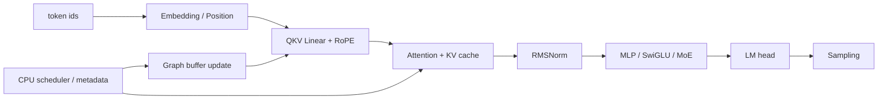
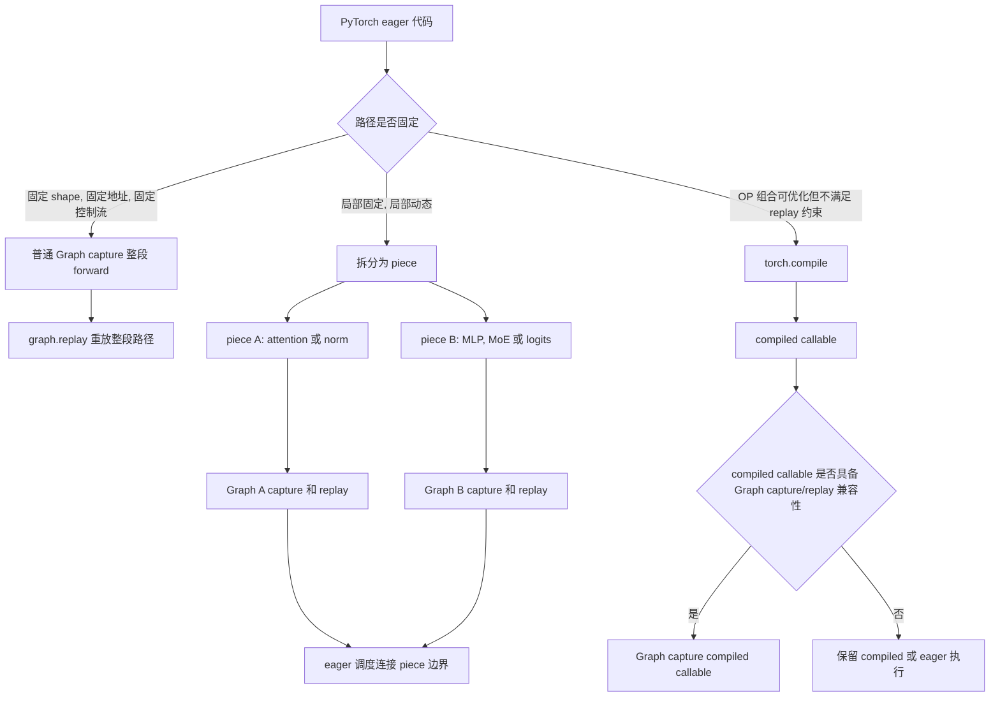
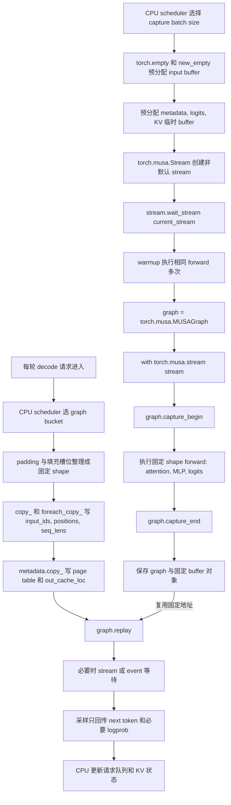

# PyTorch 常见 OP 分享：分类、性能与 DeepSeek V4 实践

## 文章提纲

分享内容围绕 PyTorch 常见 OP 展开，主线是“OP 是什么、在 Transformer 里怎么组织、放到 DeepSeek V4-Pro 源码里如何出现、在 MUSA 上如何用最小例子验证”。阅读顺序如下：

1. **PyTorch 常见 OP 分类**：先把 OP 分成 GPU OP、CPU OP、Sync OP、Dynamic Shape OP 和 Graph OP，说明每类包含哪些常见 API。
2. **注意事项和性能问题**：围绕 layout、分配、未融合 OP 链、CPU-DEVICE 同步、dynamic shape、dtype/量化和 Graph 约束说明常见风险。
3. **Transformer 架构中的 OP 组织**：从 token embedding 到 attention、KV cache、RMSNorm/MLP、logits/sampling，看 OP 如何串成完整 forward。
4. **DeepSeek V4-Pro 源码分析**：按 Linear、Attention、MoE、HC/MHC 和权重转换模块分析源码中用到的 OP，以及这些 OP 的组织方式。
5. **MUSA 最小用例与结果**：把前面出现的模块抽成可运行用例，展示输入、代码和 MUSA 执行输出。
6. **回顾总结**：沉淀一套看 PyTorch OP 的方法：功能语义、输入输出、内存行为、同步边界、Graph 约束和执行路径一起看。

附录 A 保留 PyTorch 常见 OP 的详细用例和 MUSA 输出；附录 B 保留 DeepSeek V4-Pro 源码分析；附录 C 保留 DeepSeek V4 在 SGLang 中的源码分析。

## 1. PyTorch 常见 OP 如何分类

PyTorch OP 可以按执行位置和工程作用分类。这样分类比单纯背 API 名字更有价值，因为同一个 API 在不同位置的代价完全不同：`view` 可能只是零拷贝改 shape，`reshape` 可能触发真实 copy；`.item()` 可能只是读取 CPU 标量，也可能让 CPU 等待 DEVICE侧计算完成；`copy_` 可能是普通赋值，也可能是 Graph replay 前保持固定地址的关键动作。

### 1.1 GPU OP

GPU OP 作用于 DEVICE tensor，覆盖张量创建、layout 整理、索引映射、数学计算、线性代数、路由和 dtype/device 转换。它们是 Transformer forward、KV cache、MoE、sampling 和 Graph replay 的主体。

| 类别 | 常见 OP | 主要用途 | 关键注意事项 |
|------|---------|----------|--------------|
| 创建初始化 | `empty`、`new_empty`、`empty_like`、`zeros`、`ones`、`full` | 创建 input buffer、KV cache、logits、workspace | `empty` 不初始化；Graph replay 中不要替换 capture 过的 tensor 对象 |
| 原地更新 | `copy_`、`_foreach_copy_`、`fill_`、`zero_`、`clamp_`、`masked_fill_` | 更新 metadata、清理 padding、写 graph buffer、裁剪激活 | 原地 OP 会覆盖输入；padding 槽位必须清理 |
| Shape/Layout | `view`、`reshape`、`flatten`、`unsqueeze`、`squeeze`、`expand`、`permute`、`transpose`、`contiguous` | QKV head layout、RoPE 输入、MoE expert 维度、kernel 输入布局 | `view` 要求 stride 兼容；`contiguous` 可能真实 copy；`expand` 不适合原地写 |
| 索引映射 | slice、advanced indexing、`gather`、`take_along_dim`、`index_select`、`scatter_` | KV page/slot、MoE dispatch/combine、sampling mask | index dtype/device 要匹配；重复写、越界和 mask 广播最容易出错 |
| 序列组合 | `arange`、`repeat_interleave`、`cat`、`stack`、`split`、`chunk`、`pad`、`where` | positions 展开、batch 拼接、gate/up 切分、bucket padding | 动态输出会影响 allocator、compile 和 Graph replay |
| 数学与激活 | `sum`、`mean`、`square`、`rsqrt`、`sigmoid`、`silu`、`gelu`、`relu`、`softmax`、`clamp` | RMSNorm、SwiGLU、attention/sampling、reference 实现 | 多个逐元素/归约 OP 串联会带来多次 launch 和 HBM 读写 |
| 线性代数与路由 | `F.linear`、`matmul`、`mm`、`bmm`、`einsum`、`topk`、`sort`、`argmax` | QKV/O projection、MLP、LM head、MoE top-k、sampling | dtype、layout、scale、top-k shape 和排序稳定性要明确 |
| dtype/device | `to`、`float`、`half`、`bfloat16`、`int`、`long` | metadata dtype、BF16/FP8/FP4 路径、CPU/DEVICE 边界 | 避免 OP 间反复 cast；`to(device)` 可能引入 H2D/D2H copy |

### 1.2 CPU OP

CPU OP 主要服务调度和状态管理，不直接承担大张量计算。在线推理里，CPU侧负责 request queue、prefix cache、bucket 选择、KV block 管理、metadata 构造和协议输出；DEVICE侧负责 attention、MLP/MoE、logits 和 sampling 的张量计算。

| 类别 | 常见 OP | 典型场景 | 注意事项 |
|------|---------|----------|----------|
| Python 容器 | `list`、`dict`、`len`、`range`、`sort` | scheduler、request state、block table、prefix cache | 可以放在 Graph 外；不要驱动 decode 单步里的 DEVICE tensor 分支 |
| CPU tensor | `torch.tensor(..., device="cpu")`、CPU-side `max/sum` | `seq_lens_cpu`、batch size、bucket 选择 | CPU侧元数据副本要和 DEVICE侧 metadata 同步 |
| CPU-DEVICE 转换 | `.cpu()`、`.numpy()`、`.tolist()` | 日志、调试、最终 token、少量统计 | GPU tensor 回 CPU 通常会触发同步和 D2H copy |
| 标量读取 | `.item()`、`int(tensor)` | loss scalar、最终 token id、CPU侧决策标量 | 对 GPU tensor 高频调用会把异步执行变成 CPU 等待 |
| H2D metadata | `torch.as_tensor(..., device)`、`to(device)` | seq_lens、positions、page table 上传 | 高频路径要复用固定 buffer，避免零散小 tensor 上传 |

### 1.3 Sync OP

Sync OP 管理 CPU、DEVICE stream、Graph replay 和分布式 rank 的时序。它们本身不一定做数学计算，但会改变执行并行度。

| 类别 | 常见 API/OP | 合理用法 | 风险 |
|------|-------------|----------|------|
| 全设备同步 | `torch.cuda.synchronize()`、`torch.musa.synchronize()` | benchmark、错误定位、程序结束前等待 | 放进 decode 热点路径会打断 CPU/DEVICE 并行 |
| Stream/Event | `Stream`、`current_stream()`、`Event.record()`、`wait_event()` | copy/compute 编排、异步 H2D、局部依赖 | wait 范围过大等价于串行化 |
| Graph 边界 | `graph.replay()` 前后必要 wait | replay 前更新固定 buffer，读取输出前等待 | capture 内出现不支持的同步会失败 |
| 分布式同步 | `all_reduce`、`reduce_scatter`、`all_gather`、work wait | TP/EP/DP 通信、MoE expert 交换 | 过早 wait 会破坏通信与计算重叠 |
| 隐式同步 | `.item()`、`.tolist()`、`.cpu()` | 最终结果回传、低频统计 | 看起来不是同步 API，但会让 CPU 等 DEVICE |

### 1.4 Dynamic Shape OP

Dynamic Shape OP 的输出 shape 依赖输入数据内容。它们非常适合 eager 调试和 CPU 规划，但会增加 compile guard、Graph replay 固定 shape、通信 bucket 和 workspace 复用的复杂度。

| 类型 | 常见 OP | 使用场景 | 稳定化方式 |
|------|---------|----------|------------|
| 位置发现 | `nonzero`、`argwhere` | 找有效 token、稀疏 mask 调试 | 用 fixed mask + padding 保持 shape |
| 去重统计 | `unique`、`unique_consecutive` | expert/block/request 分布统计 | 在线路径优先 fixed capacity 或 histogram |
| Mask 压缩 | `masked_select`、boolean indexing | 抽取有效 token/logits | 延迟敏感路径用 `where` 保持原 shape |
| 动态切分拼接 | data-dependent `cat/split` | 动态 batch、变长 request | scheduler 侧 bucket + padding |
| 数据依赖索引 | mask 后 `gather/index_select` | MoE token 选择、KV block 选择 | 固定 top-k、padded index、sentinel |

### 1.5 Graph OP

Graph OP 用于固定 shape、固定地址、固定执行序列的 replay。Graph 不会让单个数学 OP 自动变快，它减少的是 Python 调度和 kernel launch 开销，适合 decode 这种小 batch、多 kernel、重复执行的路径。

| 阶段 | 常见 API/OP | 用法 | 注意事项 |
|------|-------------|------|----------|
| 预分配 | `empty`、`new_empty`、`zeros` | capture 前创建固定 input/output/metadata buffer | replay 中不能替换 tensor 对象 |
| warmup/capture | `Stream`、`MUSAGraph`、`capture_begin/capture_end` | 用固定 shape 和固定地址执行一次 | allocator、kernel cache、backend 状态需要提前稳定 |
| 更新输入 | `copy_`、`_foreach_copy_`、`fill_`、`zero_` | replay 前只改 buffer 内容 | 新分配和对象替换会破坏 capture 假设 |
| 执行 | `graph.replay()` | 相同 bucket 下复用录制路径 | dynamic shape、CPU sync、不支持 capture 的调用会导致失败 |

## 2. OP 常见注意事项和性能问题

看 PyTorch OP 的性能，不能只看 API 名字。更可靠的方式是把 OP 放回具体执行链路，确认它是否产生真实 copy、是否分配新 tensor、是否触发 CPU-DEVICE 同步、是否制造动态 shape，以及是否落到预期执行路径。

### 2.1 Layout 与隐式 Copy

`view/reshape/transpose/permute/contiguous` 是 Transformer 中最常见的 layout OP。`view` 通常是零拷贝，但要求 stride 兼容；`reshape` 在 stride 不兼容时可能分配新 tensor；`contiguous()` 会把非连续 layout 复制成连续内存。QKV head layout、RoPE 输入、KV cache layout 和 custom kernel 输入都依赖这类 OP。

| 现象 | 常见 OP | 根因 | 处理方式 |
|------|---------|------|----------|
| `reshape` 后延迟抖动 | `reshape`、`permute`、`transpose` | stride 不兼容导致隐式 copy | 能用 `view` 时优先 `view`；kernel 前显式检查 `stride/is_contiguous` |
| kernel 前多一次 copy | `contiguous()` | 目标 kernel 只支持连续输入 | 把 layout 转换前移、复用转换结果，或融合到 kernel 内 |
| broadcast 写错 | `expand` + inplace OP | expanded tensor 可能是 zero-stride view | 不对 expanded view 原地写，必要时先 `clone/contiguous` |

### 2.2 分配、初始化与 Buffer 生命周期

`empty/new_empty/empty_like` 只分配内存，不初始化。高频推理路径经常用它们预分配 workspace，但后续 kernel 必须完整写入。Graph replay 更进一步要求 input/output/metadata tensor 的对象地址保持不变，所以 replay 前应使用 `copy_/fill_/zero_` 更新内容，而不是创建新 tensor。

| 场景 | 推荐方式 | 风险 |
|------|----------|------|
| graph input/output | capture 前预分配，replay 前 `copy_` 更新内容 | replay 中替换 tensor 对象会破坏固定地址 |
| padding 槽位 | replay 前 `fill_/zero_` 清理 | 残留值会影响 attention mask、cache 或 logits |
| 临时 workspace | 按 batch/seq bucket 复用 | 每步分配增加 allocator 开销和地址不稳定 |

### 2.3 未融合 OP 链

RMSNorm、SwiGLU、attention softmax、MoE combine 常用多个 PyTorch OP 表达 reference 语义。reference 写法清晰，但在线热点路径会多次读写 HBM，并产生多次 kernel launch。

| OP 链 | 语义 | 性能问题 |
|-------|------|----------|
| `square -> mean -> rsqrt -> mul` | RMSNorm / Q norm | 多次读取 hidden states，多次 launch |
| `chunk -> silu -> clamp -> mul` | SwiGLU | 中间 tensor 多，激活和乘法未融合 |
| `softmax -> matmul` | attention reference | score tensor 大，占显存和带宽 |
| `where/nonzero -> index_select -> scatter` | MoE dispatch/combine | token 数动态，allocator 和调度复杂 |
| `topk -> gather -> normalize` | MoE routing / sampling | top-k shape、排序和 dtype 会传导到后续 kernel |

### 2.4 CPU-DEVICE 同步边界

`.item()`、`.tolist()`、`.cpu()`、`.numpy()` 是最容易被忽略的同步来源。对 CPU tensor 调用它们通常没问题；对 GPU/MUSA tensor 调用时，CPU 需要等待前序 DEVICE 计算完成，再做 D2H 拷贝或标量读取。

| API | 合理位置 | 风险位置 |
|-----|----------|----------|
| `.item()` | CPU侧元数据副本、最终标量、benchmark 结束 | GPU seq_lens、GPU logits、Graph 内部分支 |
| `.tolist()` | CPU scheduler 的长度列表、最终 token 列表 | GPU 上 `bincount` 后回读并驱动 Python expert loop |
| `.cpu()` | 最终输出、少量 logprob、离线分析 | 完整 logits、hidden states、KV metadata |
| `synchronize()` | profiling 边界、错误定位 | decode 单步、通信计算重叠区 |

### 2.5 Dynamic Shape、Compile 与 Graph

`nonzero/unique/masked_select`、mask 后变长 `index_select`、数据相关 `cat/split` 会让输出 shape 随输入内容变化。它们在 eager 模式表达力强，但会让 `torch.compile` 产生 guard 或 graph break，也会破坏 Graph replay 的固定 shape/固定地址约束。

| 动态来源 | 典型 OP | 更稳定的表达 |
|----------|---------|--------------|
| 有效 token 数变化 | `nonzero`、boolean indexing | fixed mask + padding |
| expert 负载变化 | `where`、`bincount(...).tolist()` | fixed top-k、固定 expert capacity、padded metadata |
| request 长度变化 | data-dependent `cat/split` | CPU scheduler bucket + fixed metadata |
| sparse index 数量变化 | 动态 `topk(k)` | 固定 k，超出部分用 sentinel/padding |

### 2.6 dtype、量化与 Fallback

BF16/FP16/FP8/FP4、activation scale、weight scale、block size、packed layout 和输出 dtype 是一组接口约束。`to(dtype)` 不只是精度转换，也可能改变 kernel 路径、Graph capture 能力和数值误差分布。

| 问题 | 表现 | 处理方式 |
|------|------|----------|
| dtype/layout 不匹配 | fallback 到 PyTorch reference 或通用 kernel | 打印/统计执行路径，确认输入满足 kernel 约束 |
| scale layout 不匹配 | FP8/FP4 GEMM 结果错误或性能异常 | 固定 block size，明确 scale shape、stride 和连续性 |
| 反复 cast | 多余 `float/half/bfloat16/to` | 在模块边界集中转换 |
| silent fallback | 语义正确但性能异常 | 对不支持组合显式报错或受控 fallback |

## 3. Transformer 架构中的 OP 组织

Transformer 可以看成一组 OP 模板反复堆叠：token id 先进入 embedding 和 position/RoPE，hidden states 经过 attention 与 KV cache，再经过 RMSNorm、MLP/SwiGLU 或 MoE，最后进入 logits 和 sampling。训练还会加入 loss、backward、optimizer 和分布式通信；推理更关注 KV cache、Graph replay、CPU scheduler 和 sampling 边界。



一层典型 Transformer block 的源码结构可以简化成下面这样。后面的 3.1 到 3.5 会按这条链路拆开分析每段源码中的 OP：

```python
def transformer_forward(input_ids, positions, attn_mask, kv_cache):
    hidden = embed_tokens(input_ids)
    for layer in layers:
        residual = hidden
        hidden = layer.input_norm(hidden)
        attn_out, kv_cache = layer.attention(hidden, positions, attn_mask, kv_cache)
        hidden = residual + attn_out

        residual = hidden
        hidden = layer.post_attention_norm(hidden)
        hidden = residual + layer.mlp(hidden)

    hidden = final_norm(hidden)
    logits = lm_head(hidden[:, -1])
    next_token = sample(logits)
    return next_token, kv_cache
```

源码里的 OP 组织有三个层次：第一层是数学语义，例如 `linear`、`softmax`、`silu`、`sum`；第二层是 layout 和 metadata，例如 `view`、`transpose`、`arange`、`copy_`；第三层是服务化边界，例如 `.cpu()`、Graph replay、KV cache page 写入。性能问题通常不是某个 OP 单独出现，而是它出现在了高频路径、动态 shape 路径或 CPU-DEVICE 边界上。

### 3.1 Embedding、Position 与 RoPE

Embedding 阶段把离散 token id 变成 hidden states，position 阶段生成每个 token 的位置信息，RoPE 把 position 注入 Q/K 的部分维度。常见 OP 是 `embedding`、`arange`、`repeat_interleave`、`to(int32/int64)`、`view/unsqueeze`、`sin/cos`、`mul/add`。

典型源码：

```python
def embedding_and_rope(input_ids, q, k, start_pos, freqs_cis):
    hidden = F.embedding(input_ids, embed_weight)
    positions = torch.arange(
        start_pos,
        start_pos + input_ids.numel(),
        device=input_ids.device,
        dtype=torch.long,
    )

    q = q.view(-1, num_heads, head_dim)
    k = k.view(-1, num_kv_heads, head_dim)
    q_rope, q_pass = q[..., :rope_dim], q[..., rope_dim:]
    k_rope, k_pass = k[..., :rope_dim], k[..., rope_dim:]

    freqs = freqs_cis[positions].unsqueeze(1)
    q_rope = apply_rotary(q_rope, freqs)
    k_rope = apply_rotary(k_rope, freqs)
    q = torch.cat([q_rope, q_pass], dim=-1)
    k = torch.cat([k_rope, k_pass], dim=-1)
    return hidden, positions, q, k
```

源码解析：

- `F.embedding` 的输入是 token id，输出是 `[tokens, hidden]`；token id dtype 和 device 不匹配会直接影响查表。
- `torch.arange` 生成 position id，prefill 常生成一段连续位置，decode 常只生成新增 token 的位置。
- `view` 把 Q/K 从扁平 hidden 维整理成 head layout；如果上游 projection 输出 layout 不兼容，后面需要显式处理 `contiguous()`。
- `unsqueeze(1)` 给 RoPE 频率补 head 维，依赖 broadcast；它通常不复制数据。
- `cat` 把 RoPE 维和 pass-through 维拼回完整 head_dim；拼接会产生新 tensor，热点路径常由 fused RoPE 或 attention prepare kernel 处理。

| 子模块 | 常见 OP | 组织方式 | 注意事项 |
|--------|---------|----------|----------|
| Token embedding | `F.embedding`、indexing | token id -> `[tokens, hidden]` | token id dtype 通常是 int64/int32，device 要一致 |
| Position | `arange`、`repeat_interleave`、`cat` | 生成 prefill/decode positions | 变长请求通常在 CPU scheduler 侧整理成固定 metadata |
| RoPE | `view/reshape`、`unsqueeze`、`mul/add` | Q/K 按 head_dim 拆分后旋转 | layout 要匹配 attention kernel；避免不必要 `contiguous()` |

### 3.2 Attention 与 KV Cache

Attention 是 OP 组织最密集的模块：`F.linear/matmul` 生成 Q/K/V，`view/transpose/unflatten` 整理 head layout，RoPE 更新 Q/K，attention kernel 读取 Q/K/V 和 metadata，KV cache 通过 indexing 或 custom kernel 写入 page/slot。

典型源码：

```python
def attention_forward(hidden, attn_mask, kv_cache, slot_mapping):
    qkv = F.linear(hidden, qkv_weight, qkv_bias)
    q, k, v = qkv.chunk(3, dim=-1)

    q = q.view(batch, seq, num_heads, head_dim).transpose(1, 2)
    k = k.view(batch, seq, num_kv_heads, head_dim).transpose(1, 2)
    v = v.view(batch, seq, num_kv_heads, head_dim).transpose(1, 2)

    page_idx = torch.div(slot_mapping, page_size, rounding_mode="floor")
    page_offset = slot_mapping % page_size
    k_for_cache = k.transpose(1, 2).reshape(-1, num_kv_heads, head_dim)
    v_for_cache = v.transpose(1, 2).reshape(-1, num_kv_heads, head_dim)
    kv_cache[page_idx, page_offset, 0] = k_for_cache
    kv_cache[page_idx, page_offset, 1] = v_for_cache

    scores = torch.matmul(q, k.transpose(-2, -1)) * scale
    scores = scores.masked_fill(attn_mask, float("-inf"))
    probs = torch.softmax(scores, dim=-1)
    out = torch.matmul(probs, v)
    out = out.transpose(1, 2).contiguous().view(batch, seq, hidden_size)
    return F.linear(out, o_weight), kv_cache
```

源码解析：

- `F.linear` 生成 QKV，是 attention 的主要 GEMM 入口；量化模型还要看 activation scale、weight scale 和 packed layout。
- `chunk(3, dim=-1)` 按 hidden 最后一维切分 Q/K/V，要求 qkv projection 输出维度严格匹配。
- `view + transpose` 把 `[batch, seq, hidden]` 变成 `[batch, heads, seq, head_dim]`；`transpose` 后通常是非连续 layout。
- `slot_mapping -> div/% -> advanced indexing` 表达 Paged KV cache 写入，page index、offset 和 token 顺序必须一致。
- `matmul -> masked_fill -> softmax -> matmul` 是 attention reference 链路；大模型在线推理通常用 fused attention kernel 避免显式 materialize 大 score tensor。
- `transpose(...).contiguous().view(...)` 是 attention 输出回到 hidden layout 的常见写法，`contiguous()` 可能成为额外 copy。

| 子模块 | 常见 OP | 组织方式 | 注意事项 |
|--------|---------|----------|----------|
| QKV projection | `F.linear`、`matmul` | hidden -> Q/K/V | dtype、weight layout、activation scale 决定执行路径 |
| Head layout | `view`、`unflatten`、`transpose`、`contiguous` | `[tokens, hidden]` -> `[tokens, heads, head_dim]` | stride 不匹配会触发 copy 或 kernel 输入错误 |
| Mask/score | `where`、`masked_fill`、`softmax`、`matmul/einsum` | reference attention 或小规模验证 | 大规模在线推理通常由 fused attention kernel 执行 |
| KV cache | advanced indexing、`copy_`、`scatter_`、`div/%` | token slot -> page/offset | page index、offset、dtype 和越界检查要明确 |

### 3.3 RMSNorm、MLP 与 SwiGLU

RMSNorm reference 通常是 `square -> mean -> rsqrt -> mul`；MLP/SwiGLU 通常是 `linear -> chunk/split -> silu/sigmoid/gelu -> mul -> linear`。这些 OP 链很好解释数学语义，但在线热点路径通常需要融合。

典型源码：

```python
def rmsnorm_mlp(hidden, residual):
    x = hidden.float()
    rstd = torch.rsqrt(x.square().mean(dim=-1, keepdim=True) + eps)
    normed = (x * rstd).to(hidden.dtype) * norm_weight

    gate_up = F.linear(normed, gate_up_weight)
    gate, up = gate_up.chunk(2, dim=-1)
    gate = F.silu(gate)
    intermediate = gate * up
    out = F.linear(intermediate, down_weight)
    return residual + out
```

源码解析：

- `float()` 常用于提升 norm 计算精度，但会引入 dtype 转换；输出通常再 cast 回模型 dtype。
- `square -> mean -> rsqrt -> mul` 清晰表达 RMSNorm，但会产生多个逐元素/归约 OP。
- `F.linear` 生成 gate/up 两路，再用 `chunk` 切开；`chunk` 返回 view，后续 OP 共享上游 storage 视图。
- `silu(gate) * up` 是 SwiGLU 的核心语义；如果有 `clamp_`，它会原地覆盖 gate/up 分支。
- `residual + out` 是残差加法，训练中还会影响 autograd 保存 tensor；推理中通常关注是否能与 norm 或 projection 融合。

| 子模块 | 常见 OP | 组织方式 | 注意事项 |
|--------|---------|----------|----------|
| RMSNorm | `square`、`mean`、`rsqrt`、`mul` | hidden 归一化 | reduction 维度和 eps 要固定；多个小 OP 容易 launch 多 |
| Gate/Up | `F.linear`、`chunk`、`split` | hidden -> gate/up | split 后 view 的 layout 要满足后续激活 |
| SwiGLU | `silu`、`sigmoid`、`clamp`、`mul` | activation(gate) * up | `clamp_` 是原地写，会覆盖输入 |
| Down projection | `F.linear`、`matmul` | intermediate -> hidden | 量化路径要关注 scale 和 packed weight |

### 3.4 MoE Routing、Expert 与 Combine

MoE 在 Transformer 中把 MLP 替换为多个 expert。Router 先用 `linear/softmax/topk/gather` 选 expert，dispatch 把 token 发到 expert，expert MLP 计算后再 combine。reference 代码常用 `where/index_select/scatter/sum` 表达语义；高性能实现会把 dispatch、grouped GEMM 和 combine 融合或批处理。

典型源码：

```python
def moe_forward(hidden):
    router_logits = F.linear(hidden, router_weight)
    router_probs = torch.softmax(router_logits, dim=-1)
    topk_weight, topk_id = torch.topk(router_probs, k=num_experts_per_token, dim=-1)
    topk_weight = topk_weight / topk_weight.sum(dim=-1, keepdim=True)

    output = torch.zeros_like(hidden)
    for expert_id in range(num_experts):
        token_idx, choice_idx = torch.where(topk_id == expert_id)
        if token_idx.numel() == 0:
            continue
        expert_in = hidden[token_idx]
        expert_out = experts[expert_id](expert_in)
        output[token_idx] += expert_out * topk_weight[token_idx, choice_idx].unsqueeze(-1)
    return output
```

源码解析：

- `F.linear -> softmax -> topk` 把 dense expert score 变成固定 top-k expert id 和权重。
- `topk_weight / sum(...)` 做权重归一化，`keepdim=True` 保证 broadcast shape 稳定。
- `zeros_like` 创建输出 buffer；如果后续路径没有完整覆盖，初值会影响 combine 结果。
- `where(topk_id == expert_id)` 产生动态长度索引，reference 代码可读，但不适合 Graph replay 内部。
- `hidden[token_idx]` 和 `output[token_idx] += ...` 是 advanced indexing；重复 index、累加顺序和 dtype 都会影响数值。
- 在线推理常把 token dispatch、grouped GEMM 和 combine 放进融合或批处理实现，避免 Python expert loop 和动态小 GEMM。

| 阶段 | 常见 OP | 组织方式 | 注意事项 |
|------|---------|----------|----------|
| Router score | `linear`、`softmax/sigmoid` | hidden -> expert score | score dtype 和归一化方式要与模型配置一致 |
| Expert 选择 | `topk`、`gather` | score -> top-k id/weight | top-k 输出 shape 建议固定 |
| Dispatch | `where`、`index_select`、`scatter_`、`bincount` | token -> expert bucket | 动态 token 数会影响 Graph 和通信 bucket |
| Expert MLP | grouped GEMM、`silu`、`mul` | expert hidden -> expert output | 多 expert 小 GEMM 容易低利用率 |
| Combine | `unsqueeze`、broadcast、`sum`、all-reduce | expert output -> token output | 权重 shape、重复 expert 和通信 wait 点要明确 |

### 3.5 Logits、Sampling 与 Graph Replay

LM head 用 `F.linear/matmul` 把 hidden 映射到 vocab logits；sampling 用 `softmax/topk/argmax/where` 选择 token。在线服务中，完整 logits 不应该频繁回 CPU，CPU侧只需要最终 token、少量 logprob 和统计信息。decode 阶段还会把 input、positions、seq_lens、page table 等写入固定 buffer，再通过 Graph replay 执行固定路径。

典型源码：

```python
def decode_step(input_ids, positions, fixed_buffers, graph=None):
    fixed_buffers.input_ids[: input_ids.numel()].copy_(input_ids)
    fixed_buffers.positions[: positions.numel()].copy_(positions)
    fixed_buffers.seq_lens.fill_(1)

    if graph is not None:
        graph.replay()
        logits = fixed_buffers.logits
    else:
        hidden = model_forward(fixed_buffers.input_ids, fixed_buffers.positions)
        logits = F.linear(hidden[:, -1], lm_head_weight)

    topk_vals, topk_ids = torch.topk(logits, k=top_k, dim=-1)
    probs = torch.softmax(topk_vals / temperature, dim=-1)
    next_token = topk_ids[:, 0]
    return next_token.cpu().tolist(), probs
```

源码解析：

- `copy_` 把真实请求写入固定 input buffer，服务 Graph replay 的固定地址约束。
- `fill_` 用于清理或初始化固定 metadata；如果 padding 槽位残留旧值，attention 和 logits 都可能被污染。
- `graph.replay()` 复用固定 shape 和固定执行序列，减少 Python 调度和 launch 开销。
- `F.linear(hidden[:, -1], lm_head_weight)` 表示只对最后一个 token 做 LM head，是 decode 常见优化。
- `topk -> softmax` 保留在 DEVICE侧；`.cpu().tolist()` 只回传最终 token，避免把完整 logits 拉回 CPU。

| 场景 | 常见 OP | 组织方式 | 注意事项 |
|------|---------|----------|----------|
| LM head | `F.linear`、`matmul` | hidden -> vocab logits | vocab 大，显存和带宽压力高 |
| Sampling | `topk`、`softmax`、`argmax`、`where` | logits -> next token | 候选数量动态会影响 graph/compile |
| CPU 边界 | `.cpu()`、`.tolist()`、`.item()` | 只回传最终 token/少量统计 | 避免完整 logits 回 CPU |
| Graph replay | `copy_`、`fill_`、`zero_`、`graph.replay()` | replay 前更新固定 buffer | shape、地址和执行序列必须固定 |

## 4. DeepSeek V4-Pro 源码中的 OP 组织

DeepSeek V4-Pro 源码把 Transformer 常见 OP 放进更复杂的结构里：量化 Linear 引入 FP8/FP4、activation scale 和 packed weight；Compressed Attention 引入 sparse index、compressed KV 和 `topk/where/cat`；MoE 引入 router、top-k expert、dispatch/combine；HC/MHC 用 reference OP 链表达可验证语义。正文只保留核心片段，完整源码摘录放在附录 B。

### 4.1 量化 Linear：dtype 分派、activation scale 与 packed weight

DeepSeek V4-Pro 的 `linear` 不是简单的 `F.linear` 包装。权重 dtype 决定执行路径：FP4/FP8 权重先对 activation 做 `act_quant`，再进入量化 GEMM；普通权重才走 PyTorch reference。

```python
def linear(x: torch.Tensor, weight: torch.Tensor, bias: Optional[torch.Tensor] = None) -> torch.Tensor:
    assert bias is None

    if weight.dtype == torch.float4_e2m1fn_x2:
        x, s = act_quant(x, block_size, scale_fmt, scale_dtype)
        return fp4_gemm(x, s, weight, weight.scale, scale_dtype)
    elif weight.dtype == torch.float8_e4m3fn:
        x, s = act_quant(x, block_size, scale_fmt, scale_dtype)
        return fp8_gemm(x, s, weight, weight.scale, scale_dtype)
    else:
        return F.linear(x, weight)
```

| 位置 | 关键 OP | 组织方式 | 注意事项 |
|------|---------|----------|----------|
| 参数创建 | `torch.empty` | 创建 packed FP4/FP8 weight 和 scale tensor | `empty` 后必须由权重加载完整写入 |
| activation 量化 | `act_quant`、`to(dtype)` | BF16/FP32 activation -> quant activation + scale | block size、scale dtype 和 layout 是接口约束 |
| GEMM | `fp4_gemm/fp8_gemm` | quant activation + quant weight + scale -> output | packed layout、scale shape 和输出 dtype 要一致 |
| reference | `F.linear` | 普通 dtype 或 fallback 路径 | 可以验证语义，但热点路径要确认是否进入预期执行路径 |

### 4.2 Compressed Attention：layout、RoPE、top-k index 与 sparse kernel

Attention 模块先生成 Q/KV，再做 head layout、RoPE、Q norm、KV quant 和 sparse/compressed index，最后调用 sparse attention kernel。这里的 PyTorch OP 主要用于组织输入，而不是单独完成完整 attention 计算。

```python
q = self.wq_b(qr)
q = q.unflatten(-1, (self.n_local_heads, self.head_dim))
apply_rotary_emb(q[..., -rd:], freqs_cis)
q *= torch.rsqrt(q.square().mean(-1, keepdim=True) + self.eps)

kv = self.wkv(x)
kv = self.kv_norm(kv)
apply_rotary_emb(kv[..., -rd:], freqs_cis)
act_quant(kv[..., :-rd], 64, scale_fmt, scale_dtype, True)

topk_idxs = get_window_topk_idxs(win, bsz, seqlen, start_pos)
if self.compress_ratio:
    compress_topk_idxs = self.indexer(x, qr, start_pos, offset)
    topk_idxs = torch.cat([topk_idxs, compress_topk_idxs], dim=-1)
topk_idxs = topk_idxs.int()
o = sparse_attn(q, kv, self.attn_sink, topk_idxs, self.softmax_scale)
```

| 模块 | 关键 OP | 组织方式 | 注意事项 |
|------|---------|----------|----------|
| Q layout | `unflatten/view` | projection 输出 -> `[batch, seq, heads, head_dim]` | stride 不兼容会影响后续 kernel |
| Q norm | `square`、`mean`、`rsqrt`、`mul_` | 对 Q 做 RMS-like normalization | 多个小 OP 可用于 reference，热点路径关注融合 |
| KV path | `kv_norm`、`act_quant(..., inplace=True)` | KV norm 后对非 RoPE 维量化 | 原地量化要确认后续不需要原 BF16 值 |
| sparse index | `topk`、`where`、`cat`、`int` | window index + compressed index -> sparse index | `k`、sentinel `-1`、index dtype 要与 kernel 一致 |
| attention kernel | `sparse_attn` | 读取 Q/KV/topk index 输出 attention | layout、padding head、index 越界和 graph capture 都会影响稳定性 |

### 4.3 MoE：Router、Expert Dispatch 与 Combine

MoE 模块先用 gate 产生 `weights` 和 `indices`，再按 expert id 分发 token。源码里的 reference 写法很适合观察 OP 语义：`topk/gather` 生成固定 top-k expert，`where/indexing` 找到属于某个 expert 的 token，`sum/+=` 完成 combine。

```python
weights, indices = self.gate(x, input_ids.flatten())
y = torch.zeros_like(x, dtype=torch.float32)
counts = torch.bincount(indices.flatten(), minlength=self.n_routed_experts).tolist()
for i in range(self.experts_start_idx, self.experts_end_idx):
    if counts[i] == 0:
        continue
    idx, top = torch.where(indices == i)
    y[idx] += self.experts[i](x[idx], weights[idx, top, None])
y += self.shared_experts(x)
```

| 阶段 | 关键 OP | 组织方式 | 注意事项 |
|------|---------|----------|----------|
| Router | `linear`、`softmax/sigmoid/softplus` | hidden -> expert score | score 函数和归一化要匹配模型配置 |
| Top-k | `topk`、`gather` | expert score -> top-k id/weight | top-k shape 固定，便于后续 kernel 和 metadata |
| 统计 | `bincount(...).tolist()` | 统计每个 expert token 数 | GPU tensor 回 CPU 会同步；适合 reference，不适合热点路径 |
| Dispatch | `where`、advanced indexing | 按 expert id 选 token | 输出 token 数动态，会影响 Graph 和 workspace |
| Combine | `+=`、broadcast、`sum` | expert output 按权重回写 token | 重复 index、dtype 和累加顺序会影响数值 |

### 4.4 HC/MHC：Reference OP 链如何表达数学语义

HC/MHC 模块使用 PyTorch 基础 OP 表达 reference 语义：先 flatten hidden，转成 float，做 RMS-like normalization，再用 `F.linear` 生成 mixing 参数，最后通过 broadcast 和 `sum` 合成输出。这条链路适合语义验证，也暴露出逐元素/归约 OP 串联的性能代价。

```python
x = x.flatten(2).float()
rsqrt = torch.rsqrt(x.square().mean(-1, keepdim=True) + self.norm_eps)
mixes = F.linear(x, hc_fn) * rsqrt
pre, post, comb = hc_split_sinkhorn(
    mixes, hc_scale, hc_base, self.hc_mult, self.hc_sinkhorn_iters, self.hc_eps
)
y = torch.sum(pre.unsqueeze(-1) * x.view(shape), dim=2)
```

| 阶段 | 关键 OP | 组织方式 | 注意事项 |
|------|---------|----------|----------|
| 展平 | `flatten`、`view` | 多维 hidden -> 线性输入 | `view` 需要 layout 兼容 |
| 归一化 | `float`、`square`、`mean`、`rsqrt` | 计算 per-token scale | cast 和 reduction 维度要明确 |
| mixing | `F.linear`、`mul` | hidden -> pre/post/comb 参数 | weight shape 和输出切分要匹配 |
| 合成 | `unsqueeze`、broadcast、`sum` | mixing 参数和 hidden 合成输出 | 多个 broadcast/归约 OP 会产生中间读写 |

### 4.5 权重转换与 Packed Layout

量化模型的运行时性能不只取决于 forward 里的 OP，也取决于加载阶段如何把 checkpoint 权重转换成运行时 layout。DeepSeek V4-Pro 的转换逻辑使用 `view(uint8)`、bit op、`stack`、`flatten`、`transpose` 等 OP 把 packed FP4 数据展开并重排。

```python
x = x.view(torch.uint8)
low = x & 0x0F
high = (x >> 4) & 0x0F
x = torch.stack([FP4_TABLE[low.long()], FP4_TABLE[high.long()]], dim=-1).flatten(2)
x = x.view(bOut, fp8_block_size, bIn, fp8_block_size).transpose(1, 2)
```

| 关键 OP | 组织方式 | 注意事项 |
|---------|----------|----------|
| `view(torch.uint8)` | 按字节解释 packed 数据 | 只改变解释方式，不等于数值转换 |
| bit op | 拆 low/high nibble | 要明确 endian、pack 顺序和 table 映射 |
| `stack/flatten` | 把两个半字节恢复成连续元素 | shape 变化必须和 block size 对齐 |
| `transpose/view` | 转成运行时 GEMM 需要的 tile layout | stride 和 contiguous 影响加载后 kernel 输入 |

## 5. MUSA 上的模块最小用例与验证输出

| 场景 | 章节 | 关注的核心 OP |
|------|------|--------------|
| 验证 graph replay 或 buffer 复用行为 | §5.1 | `copy_`, `fill_`, `zero_`, `MUSAGraph.replay()` |
| 验证 prefill metadata（positions 展开、cache 起始位置） | §5.2 | `arange`, `tolist()`, `repeat_interleave` |
| 验证 decode graph bucket 固定地址 + padding 正确性 | §5.3 | `MUSAGraph.replay()`, `copy_`, padding |
| 调试 Paged KV cache 写入 / page slot 映射 | §5.4 | advanced indexing, `div`, `%` |
| 验证 MoE routing 权重与 expert combine 路径 | §5.5 | `topk`, `softmax`, `unsqueeze`, `sum` |
| 验证 sampling 后处理不把完整 logits 或大概率表拉回 CPU | §5.6 | `.cpu()`, `.tolist()`, `softmax` |

### 5.1 核心 OP 链的 MUSA 最小用例

下面用例不依赖 SGLang 运行时对象，直接复现典型 OP 组合与执行边界：graph replay buffer 批量拷贝、metadata 原地 `copy_`、MUSA graph 固定地址 replay、HC pre/post reference 链，以及 SwiGLU clamp 路径。

```python
import torch
import torch.nn.functional as F
from dataclasses import dataclass


def fmt(t):
    if isinstance(t, torch.Tensor):
        if t.numel() <= 40:
            return f"shape={tuple(t.shape)}, dtype={str(t.dtype).replace('torch.', '')}, device={t.device}, value={t.detach().cpu().tolist()}"
        return f"shape={tuple(t.shape)}, dtype={str(t.dtype).replace('torch.', '')}, device={t.device}"
    return repr(t)


def grouped_foreach_copy(dsts, srcs):
    groups = {}
    for dst, src in zip(dsts, srcs):
        groups.setdefault((dst.dtype, src.dtype), ([], []))
        groups[(dst.dtype, src.dtype)][0].append(dst)
        groups[(dst.dtype, src.dtype)][1].append(src)
    for group_dsts, group_srcs in groups.values():
        torch._foreach_copy_(group_dsts, group_srcs)


@dataclass
class RawDecodeMetadata:
    req_pool_indices: torch.Tensor
    seq_lens: torch.Tensor
    out_cache_loc: torch.Tensor

    def copy_(self, other):
        self.req_pool_indices.copy_(other.req_pool_indices)
        self.seq_lens.copy_(other.seq_lens)
        self.out_cache_loc.copy_(other.out_cache_loc)


def hc_pre_reference(x, hc_fn, eps=1e-5):
    shape, dtype = x.size(), x.dtype
    x_flat = x.flatten(1).float()
    rstd = torch.rsqrt(x_flat.square().mean(-1, keepdim=True) + eps)
    mixes = (F.linear(x_flat, hc_fn) * rstd).unsqueeze(1)
    pre = torch.sigmoid(mixes[:, :, : shape[1]])
    post = torch.sigmoid(mixes[:, 0, shape[1] : 2 * shape[1]])
    comb_raw = mixes[:, 0, 2 * shape[1] : 2 * shape[1] + shape[1] * shape[1]]
    comb = comb_raw.view(shape[0], shape[1], shape[1]).softmax(dim=1)
    y = (pre.squeeze(1).unsqueeze(-1) * x_flat.view(shape)).sum(dim=1)
    return y.to(dtype), post.to(dtype), comb.to(dtype)


def hc_post_reference(x, residual, post, comb):
    return (
        post.unsqueeze(-1) * x.unsqueeze(1)
        + (comb.unsqueeze(-1) * residual.unsqueeze(2)).sum(dim=1)
    ).type_as(x)


device = torch.device("musa:0")
# 1. replay buffer: mirrors DecodeInputBuffers.populate_from_forward_batch
input_ids = torch.zeros(4, dtype=torch.int64, device=device)
req_pool_indices = torch.zeros(2, dtype=torch.int64, device=device)
seq_lens = torch.empty(2, dtype=torch.int32, device=device)
out_cache_loc = torch.empty(4, dtype=torch.int64, device=device)
seq_lens.fill_(1)
out_cache_loc.zero_()
grouped_foreach_copy(
    [input_ids[:3], req_pool_indices[:2], seq_lens[:2], out_cache_loc[:3]],
    [
        torch.tensor([11, 12, 13], device=device),
        torch.tensor([7, 8], device=device),
        torch.tensor([5, 6], dtype=torch.int32, device=device),
        torch.tensor([100, 101, 102], device=device),
    ],
)

# 2. metadata copy_: mirrors DSV4RawDecodeMetadata.copy_
captured = RawDecodeMetadata(
    req_pool_indices=torch.zeros(2, dtype=torch.int64, device=device),
    seq_lens=torch.zeros(2, dtype=torch.int32, device=device),
    out_cache_loc=torch.zeros(4, dtype=torch.int64, device=device),
)
temp = RawDecodeMetadata(req_pool_indices, seq_lens, out_cache_loc)
captured.copy_(temp)

# 3. graph replay: fixed object, replay after changing input content
inp = torch.ones((2, 2), device=device)
graph_out = torch.empty_like(inp)
stream = torch.musa.Stream()
stream.wait_stream(torch.musa.current_stream())
with torch.musa.stream(stream):
    for _ in range(3):
        graph_out.copy_(inp * 2 + 1)
torch.musa.current_stream().wait_stream(stream)
graph = torch.musa.MUSAGraph()
with torch.musa.stream(stream):
    graph.capture_begin()
    graph_out.copy_(inp * 2 + 1)
    graph.capture_end()
inp.fill_(4)
graph.replay()
torch.musa.synchronize()

# 4. HC pre/post fallback chain: flatten -> square -> mean -> rsqrt -> F.linear -> broadcast/sum
x = torch.arange(12, dtype=torch.float32, device=device).reshape(2, 2, 3)
hc_fn = torch.arange(48, dtype=torch.float32, device=device).reshape(8, 6) / 10.0
hc_y, post, comb = hc_pre_reference(x, hc_fn)
hc_post = hc_post_reference(hc_y, x, post, comb)

# 5. DeepSeek V4 SwiGLU clamp path from fused_moe.py
swiglu_in = torch.tensor([[1.0, -2.0, 20.0, -20.0]], device=device)
gate, up = swiglu_in.chunk(2, dim=-1)
gate = F.silu(gate).clamp(max=10.0)
up = up.clamp(min=-10.0, max=10.0)
swiglu_out = gate * up

print("input_ids", fmt(input_ids))
print("captured.req_pool_indices", fmt(captured.req_pool_indices))
print("captured.seq_lens", fmt(captured.seq_lens))
print("captured.out_cache_loc", fmt(captured.out_cache_loc))
print("graph_out", fmt(graph_out))
print("hc_y", fmt(hc_y))
print("post", fmt(post))
print("comb", fmt(comb))
print("hc_post", fmt(hc_post))
print("swiglu_out", fmt(swiglu_out))
```

MUSA 运行结果（MUSA stdout）：

```text
input_ids shape=(4,), dtype=int64, device=musa:0, value=[11, 12, 13, 0]
captured.req_pool_indices shape=(2,), dtype=int64, device=musa:0, value=[7, 8]
captured.seq_lens shape=(2,), dtype=int32, device=musa:0, value=[5, 6]
captured.out_cache_loc shape=(4,), dtype=int64, device=musa:0, value=[100, 101, 102, 0]
graph_out shape=(2, 2), dtype=float32, device=musa:0, value=[[9.0, 9.0], [9.0, 9.0]]
hc_y shape=(2, 3), dtype=float32, device=musa:0, value=[[2.9752485752105713, 4.827154636383057, 6.679060459136963], [14.002138137817383, 15.838565826416016, 17.674991607666016]]
post shape=(2, 2), dtype=float32, device=musa:0, value=[[0.9995744824409485, 0.9999781847000122], [0.999838650226593, 0.999995231628418]]
comb shape=(2, 2, 2), dtype=float32, device=musa:0, value=[[[0.002611535834148526, 0.0026115409564226866], [0.9973884224891663, 0.9973884224891663]], [[0.0008589610224589705, 0.0008589610224589705], [0.9991409778594971, 0.9991409778594971]]]
hc_post shape=(2, 2, 3), dtype=float32, device=musa:0, value=[[[5.9661478996276855, 8.817265510559082, 11.668384552001953], [5.967349052429199, 8.819214820861816, 11.671079635620117]], [[22.99730110168457, 25.833431243896484, 28.66956329345703], [22.999492645263672, 25.835912704467773, 28.67232894897461]]]
swiglu_out shape=(1, 2), dtype=float32, device=musa:0, value=[[7.310585975646973, 2.3840584754943848]]
```

验证结论：该用例执行通过。输出显示 `captured.*` 字段通过 `copy_` 写入固定 metadata 对象，`graph_out` 在 replay 后从输入 `4` 得到 `9`，HC pre/post 链输出符合预期，SwiGLU clamp 路径输出 `[[7.310585975646973, 2.3840584754943848]]`。

### 5.2 Prefill Metadata 构造最小用例

场景：prefill 阶段需要把 CPU scheduler 的 `seq_lens`、`extend_lens`、KV cache 起始位置转换成 DEVICE侧的 `positions`、`req_pool_indices` 和 `out_cache_loc`。关键 OP 是 CPU侧元数据副本、`.tolist()`、`arange`、`cat`、`repeat_interleave`、indexing 和加法。

```python
import torch


def fmt(t):
    if isinstance(t, torch.Tensor):
        return f"shape={tuple(t.shape)}, dtype={str(t.dtype).replace('torch.', '')}, device={t.device}, value={t.detach().cpu().tolist()}"
    return repr(t)


device = torch.device("musa:0")
seq_lens_cpu = torch.tensor([3, 2], dtype=torch.int32, device="cpu")
extend_lens_cpu = torch.tensor([2, 1], dtype=torch.int32, device="cpu")
start_pos_cpu = seq_lens_cpu - extend_lens_cpu
positions = torch.cat([
    torch.arange(int(s), int(s + e), dtype=torch.int64, device=device)
    for s, e in zip(start_pos_cpu.tolist(), extend_lens_cpu.tolist())
])
req_pool_indices = torch.repeat_interleave(
    torch.arange(2, dtype=torch.int64, device=device),
    extend_lens_cpu.to(device=device, dtype=torch.int64),
)
base_cache_loc = torch.tensor([10, 20], dtype=torch.int64, device=device)
local_offsets = torch.cat([
    torch.arange(int(e), dtype=torch.int64, device=device)
    for e in extend_lens_cpu.tolist()
])
out_cache_loc = base_cache_loc[req_pool_indices] + local_offsets

print("positions", fmt(positions))
print("req_pool_indices", fmt(req_pool_indices))
print("out_cache_loc", fmt(out_cache_loc))
```

MUSA 运行结果（MUSA stdout）：

```text
positions shape=(3,), dtype=int64, device=musa:0, value=[1, 2, 1]
req_pool_indices shape=(3,), dtype=int64, device=musa:0, value=[0, 0, 1]
out_cache_loc shape=(3,), dtype=int64, device=musa:0, value=[10, 11, 20]
```

验证结论：该用例把两个请求的增量 token 展开成 3 个 prefill token。第 0 个请求写入 cache 位置 `10,11`，第 1 个请求写入 cache 位置 `20`。

### 5.3 Decode Graph Replay 最小用例

场景：decode 阶段每步只新增少量 token，适合把固定 batch bucket capture 成 graph。replay 前通过 `copy_` 更新 `input_ids` 和 `positions`，graph 内执行固定的 `stack -> matmul -> copy_` 路径。

```python
import torch


def fmt(t):
    if isinstance(t, torch.Tensor):
        return f"shape={tuple(t.shape)}, dtype={str(t.dtype).replace('torch.', '')}, device={t.device}, value={t.detach().cpu().tolist()}"
    return repr(t)


device = torch.device("musa:0")
input_ids = torch.zeros(4, dtype=torch.float32, device=device)
positions = torch.zeros(4, dtype=torch.float32, device=device)
logits = torch.empty((4, 3), dtype=torch.float32, device=device)
weight = torch.tensor([[0.1, 0.2, 0.3], [1.0, 1.5, 2.0]], device=device)

stream = torch.musa.Stream()
stream.wait_stream(torch.musa.current_stream())
with torch.musa.stream(stream):
    for _ in range(3):
        hidden = torch.stack([input_ids, positions], dim=1)
        logits.copy_(hidden @ weight)
torch.musa.current_stream().wait_stream(stream)

graph = torch.musa.MUSAGraph()
with torch.musa.stream(stream):
    graph.capture_begin()
    hidden = torch.stack([input_ids, positions], dim=1)
    logits.copy_(hidden @ weight)
    graph.capture_end()

input_ids.copy_(torch.tensor([5, 6, 0, 0], dtype=torch.float32, device=device))
positions.copy_(torch.tensor([9, 10, 0, 0], dtype=torch.float32, device=device))
graph.replay()
torch.musa.synchronize()

print("input_ids", fmt(input_ids))
print("positions", fmt(positions))
print("logits", fmt(logits))
```

MUSA 运行结果（MUSA stdout）：

```text
input_ids shape=(4,), dtype=float32, device=musa:0, value=[5.0, 6.0, 0.0, 0.0]
positions shape=(4,), dtype=float32, device=musa:0, value=[9.0, 10.0, 0.0, 0.0]
logits shape=(4, 3), dtype=float32, device=musa:0, value=[[9.5, 14.5, 19.5], [10.600000381469727, 16.200000762939453, 21.799999237060547], [0.0, 0.0, 0.0], [0.0, 0.0, 0.0]]
```

验证结论：graph capture 后没有替换 `input_ids`、`positions` 和 `logits` 对象，只更新内容。真实 batch 为 2，bucket 大小为 4，padding 位置输出保持 0。

### 5.4 KV Cache 写入最小用例

场景：Paged KV cache 需要根据 `slot_mapping` 把新 token 的 K/V 写到 page 和 page offset。该用例用一个 K cache 展示 `div`、取模、advanced indexing 和原地写入。

```python
import torch


def fmt(t):
    if isinstance(t, torch.Tensor):
        return f"shape={tuple(t.shape)}, dtype={str(t.dtype).replace('torch.', '')}, device={t.device}, value={t.detach().cpu().tolist()}"
    return repr(t)


device = torch.device("musa:0")
kv_cache = torch.zeros((3, 2, 1, 2), dtype=torch.float32, device=device)
slot_mapping = torch.tensor([1, 4, 5], dtype=torch.int64, device=device)
page_size = 2
page_idx = torch.div(slot_mapping, page_size, rounding_mode="floor")
page_offset = slot_mapping % page_size
new_k = torch.tensor([[[1.0, 1.5]], [[2.0, 2.5]], [[3.0, 3.5]]], device=device)
kv_cache[page_idx, page_offset] = new_k
selected = kv_cache[page_idx, page_offset]

print("page_idx", fmt(page_idx))
print("page_offset", fmt(page_offset))
print("selected", fmt(selected))
print("kv_cache", fmt(kv_cache))
```

MUSA 运行结果（MUSA stdout）：

```text
page_idx shape=(3,), dtype=int64, device=musa:0, value=[0, 2, 2]
page_offset shape=(3,), dtype=int64, device=musa:0, value=[1, 0, 1]
selected shape=(3, 1, 2), dtype=float32, device=musa:0, value=[[[1.0, 1.5]], [[2.0, 2.5]], [[3.0, 3.5]]]
kv_cache shape=(3, 2, 1, 2), dtype=float32, device=musa:0, value=[[[[0.0, 0.0]], [[1.0, 1.5]]], [[[0.0, 0.0]], [[0.0, 0.0]]], [[[2.0, 2.5]], [[3.0, 3.5]]]]
```

验证结论：`slot_mapping=[1,4,5]` 被拆成 page `[0,2,2]` 和 offset `[1,0,1]`，新 token 的 cache 写入后可按相同索引读回。

### 5.5 MoE 路由与 Combine 最小用例

场景：MoE 推理先用 router logits 选 top-k expert，再按路由权重合并 expert 输出。该用例用 `softmax`、`topk`、`unsqueeze`、broadcast multiply 和 `sum` 表达最小路由链路。

```python
import torch


def fmt(t):
    if isinstance(t, torch.Tensor):
        return f"shape={tuple(t.shape)}, dtype={str(t.dtype).replace('torch.', '')}, device={t.device}, value={t.detach().cpu().tolist()}"
    return repr(t)


device = torch.device("musa:0")
hidden = torch.tensor([[1.0, 2.0], [3.0, 4.0], [5.0, 6.0]], device=device)
router_logits = torch.tensor([[1.0, 3.0, 0.0], [2.0, 0.5, 1.5], [0.0, 1.0, 4.0]], device=device)
probs = torch.softmax(router_logits, dim=-1)
topk_vals, topk_ids = torch.topk(probs, k=2, dim=-1)
expert_scale = (topk_ids.to(torch.float32) + 1.0).unsqueeze(-1)
expert_out = hidden.unsqueeze(1) * expert_scale
combined = (expert_out * topk_vals.unsqueeze(-1)).sum(dim=1)

print("topk_ids", fmt(topk_ids))
print("topk_vals", fmt(topk_vals))
print("combined", fmt(combined))
```

MUSA 运行结果（MUSA stdout）：

```text
topk_ids shape=(3, 2), dtype=int64, device=musa:0, value=[[1, 0], [0, 2], [2, 1]]
topk_vals shape=(3, 2), dtype=float32, device=musa:0, value=[[0.8437947034835815, 0.11419519037008286], [0.546549379825592, 0.3314989507198334], [0.9362395405769348, 0.04661262407898903]]
combined shape=(3, 2), dtype=float32, device=musa:0, value=[[1.801784634590149, 3.603569269180298], [4.623138427734375, 6.1641845703125], [14.509719848632812, 17.411663055419922]]
```

验证结论：该用例保留 MoE 上层语义：router 产生 expert id 和权重，expert 输出按 `topk_vals` 加权合并。SGLang DeepSeek V4 的在线推理关键执行链路应由 fused kernel 执行 expert GEMM、dispatch 和 combine。

### 5.6 Sampling 后处理最小用例

场景：logits 输出后需要做 temperature、top-k、softmax 和 next token 选择。该用例保留 DEVICE侧的 top-k 和概率计算，只把最终 `next_token` 作为必要结果拷回 CPU。

```python
import torch


def fmt(t):
    if isinstance(t, torch.Tensor):
        return f"shape={tuple(t.shape)}, dtype={str(t.dtype).replace('torch.', '')}, device={t.device}, value={t.detach().cpu().tolist()}"
    return repr(t)


device = torch.device("musa:0")
logits = torch.tensor([[1.0, 3.0, 2.0, -1.0], [0.5, 0.0, 4.0, 1.0]], device=device)
temperature = 0.5
scaled = logits / temperature
topk_vals, topk_ids = torch.topk(scaled, k=2, dim=-1)
probs = torch.softmax(topk_vals, dim=-1)
next_token = topk_ids[:, 0]
next_token_cpu = next_token.cpu().tolist()

print("topk_ids", fmt(topk_ids))
print("topk_vals", fmt(topk_vals))
print("probs", fmt(probs))
print("next_token_cpu", next_token_cpu)
```

MUSA 运行结果（MUSA stdout）：

```text
topk_ids shape=(2, 2), dtype=int64, device=musa:0, value=[[1, 2], [2, 3]]
topk_vals shape=(2, 2), dtype=float32, device=musa:0, value=[[6.0, 4.0], [8.0, 2.0]]
probs shape=(2, 2), dtype=float32, device=musa:0, value=[[0.8807970285415649, 0.11920291185379028], [0.9975274205207825, 0.0024726237170398235]]
next_token_cpu [1, 2]
```

验证结论：大部分 sampling 计算留在 MUSA tensor 上，CPU-DEVICE 边界只发生在最终 token 回传处。在线服务中建议避免频繁将完整 logits 或大概率表 `.cpu()`。

### 5.7 Graph 深入用法与 MUSA 示例

这里把 §1.5 中的 Graph 生命周期展开为 SGLang DeepSeek V4 的 graph 用法、三类执行方式对比（普通 Graph / Piecewise Graph / torch.compile）以及 Graph 相关 OP 的使用约束，最后回到 DSV4 graph 的三个设计约束。

SGLang DeepSeek V4 的 graph 流程可以概括为“动态决策在 Graph 外，固定 tensor 计算在 Graph 内”：CPU scheduler 处理变长请求和 KV 管理，DEVICE侧 graph 只读取已经 padding/bucket 化的固定 buffer。


上图强调三类边界：`dict/list/deque/bisect`、prefix cache、KV allocator、tokenizer 和协议处理都属于 Graph 外；`copy_/_foreach_copy_` 是 Graph 外到 Graph 内的入口；attention、MLP/MoE、logits 这类固定执行路径适合 capture。若把动态 shape OP、`.item()`、完整 tensor `.cpu()` 或 Python 容器放进 Graph 内，就会破坏这条分工。

#### SGLang DeepSeek V4 中的 Graph 用法

Graph 会录制一段固定的 DEVICE侧执行流程。第一次 capture 时，SGLang 把 kernel 顺序、tensor 地址和 stream 依赖固定住；后续 replay 时不再让 Python 在 decode 单步中重复完成调度，而是把新请求的数据写入既有 buffer，然后重放同一段执行流程。这样可以降低 decode 阶段 batch 较小、多 kernel 场景中的单步调度开销。

SGLang 的 graph 用法主要用于在线推理 decode。一次请求进入 scheduler 后，CPU侧先确定本轮 batch、seq_len、KV cache 位置和 graph bucket，例如真实 batch 是 3，就选择 capture 过的 `bs=4` bucket。进入 replay 前，SGLang 不会重新创建 `input_ids`、`positions`、`seq_lens`、`out_cache_loc` 等 tensor，而是把真实内容 `copy_` 到 capture 时留下的固定 buffer；batch 不足的槽位用 padding 或填充请求补齐。随后 attention metadata、KV page 信息和 logits buffer 都保持对象地址不变，最后调用 `graph.replay()`。对 DeepSeek V4 来说，DSV4 attention metadata 也遵循这个模式：普通 tensor 字段原地 `copy_`，FlashMLA 这类特殊 metadata 按实现约定更新引用，把动态请求转换成固定形状的 tensor 输入。

用 SGLang 的一轮 decode 串起来看，流程是：CPU scheduler 选请求和 bucket；CPU侧计算 padding、page table、seq_lens 等 metadata；DEVICE侧固定 buffer 接收 `copy_`；graph replay 执行 embedding、attention、MLP/MoE、logits 等固定路径；replay 结束后只回传最终 token、必要 logprob 或统计值给采样和调度。需要避免把 `.item()`、`.tolist()`、新 tensor 分配或动态 Python 分支放进 graph 延迟敏感路径，因为这会破坏 capture 的固定性，或者把异步执行变成 CPU侧等待 DEVICE侧。

判断一个 OP 是否适合放进 graph，主要看它是否会改变 tensor 地址、产生动态 shape、触发 CPU 同步、走不支持 capture 的 backend，或依赖 Python 分支。

#### 普通 Graph、Piecewise Graph 与 torch.compile

普通 Graph、Piecewise Graph 和 `torch.compile` 对应三类不同需求。普通 Graph 用于避免同一段 DEVICE侧执行每步都被 Python 重新调度；Piecewise Graph 用于处理整段 forward 较动态、但局部片段的 shape、地址和控制流固定的场景；`torch.compile` 用于让编译器融合、重排或生成更高效的执行图。三者可以组合使用，但需要区分各自约束。

三者通常按下面方式配合：普通 Graph 捕获整段固定执行路径；Piecewise Graph 捕获多个局部固定片段；`torch.compile` 将 eager 片段优化成 callable 后，Graph 可以在固定 shape 下 capture 这个 callable 的执行。



使用顺序可以是：先保证 eager 语义正确；再看是否能 compile 或融合；最后看是否满足 Graph 的固定 shape、固定地址和后端 Graph capture/replay 兼容性要求。如果过早追求 capture，动态请求、allocator、CPU 同步和 backend fallback 会同时进入问题定位范围，反而不利于分析具体 OP。

普通 Graph 捕获的是一整段 shape、地址和控制流固定的执行路径。以 decode 为例，capture 前 SGLang 先选定 batch bucket，预分配 `input_ids`、`positions`、`seq_lens`、KV metadata、logits buffer 和中间临时 buffer，并用 warmup 让 allocator、kernel cache 和后端状态完成初始化。capture 中，Graph 记录 kernel 顺序、tensor 地址和 stream 依赖。replay 前，SGLang 只用 `copy_/_foreach_copy_` 更新固定 buffer 的内容。replay 时，Graph 按录制好的路径执行，不再重新走 Python 调度。replay 后，采样、请求队列更新、日志和协议输出回到 CPU侧。

普通 Graph 能覆盖整段 decode 路径，因此减少 Python 调度和 launch 开销的空间最大；对应约束也最严格：shape 要固定，tensor 地址要固定，执行路径要固定，capture 内所有后端 OP 都要支持 Graph capture/replay。只要中间出现动态 shape、数据相关 Python 分支、临时 tensor 大量分配、`.item()`/`.tolist()` 这类 CPU 同步，或者某个 fused kernel 不支持 capture，整段 capture 就会失败或 replay 结果不可预期。

Piecewise Graph 的思路是把整段 forward 拆成多个可 capture 片段。例如 attention block、MLP/MoE block、RMSNorm、logits projection 或某个已经编译好的 runnable，如果输入 shape、地址和 stream 依赖固定，就可以单独 capture。piece 之间仍然由普通 eager 或 SGLang 调度连接，边界处传递 tensor。它减少的是局部固定片段的调度开销，适合绕开局部动态逻辑或不支持 capture 的后端 OP。

Piecewise Graph 的代价是边界变多。每个 piece 都要管理自己的输入地址、输出地址、stream 顺序和生命周期；piece 之间如果需要重新分配 tensor、做 CPU 决策或等待通信，减少调度开销的效果会被削弱。对于 DeepSeek V4 这类路径复杂的模型，attention、HC/MHC、MoE、fallback 和融合 kernel 混在一起时，可以把支持 Graph capture/replay 的片段单独 capture，不能 capture 的片段留在 graph 外。

`torch.compile` 和 Graph 的分工是：`torch.compile` 优化要执行的 OP 图，Graph 固定这段图在某个 shape 和地址下的重复执行。`torch.compile` 会把一段 PyTorch eager 代码变成优化后的 callable，可能做 OP 融合、图级优化或调用后端生成 kernel；Graph capture 可以再把这个 callable 在某个固定 shape 下的一次执行录下来。常见组合是先 compile 出局部计算片段，再对这个片段做 Graph capture/replay。

`torch.compile` 本身不保证适合 Graph capture/replay。dynamic shape、数据相关分支、Python 容器操作、fallback 到 eager、CPU sync、backend 不支持，都会导致 graph break 或让编译后的片段不能被 capture。compile 成功只说明这段 PyTorch OP 可以被编译执行；是否能进一步进入 Graph replay，还要看编译后调用的 kernel、通信和同步 API 是否支持 capture。

在 SGLang DeepSeek V4 实现中，通常优先用普通 Graph 优化 decode bucket；当 attention/MoE/HC 路径过于复杂时，再用 Piecewise Graph 或 `torch.compile` 处理局部 shape/dtype 固定的片段。CPU scheduler 处理动态请求和 KV 管理，Graph 读取固定 input buffer、metadata buffer 和 logits buffer。

可以按三条规则判断：如果一段路径 shape 固定、地址固定、控制流固定、后端具备 Graph capture/replay 兼容性，就优先考虑普通 Graph；如果大部分路径可 capture、少量局部逻辑动态，就考虑 Piecewise Graph；如果 PyTorch OP 组合明显、适合编译优化，但地址和 replay 约束还不满足，就先考虑 `torch.compile`。请求调度、tokenizer、I/O、日志、Python 容器、`.item()`、`.tolist()`、动态分配和分布式控制流，应保留在 Graph 外。

##### 普通 Graph 使用样例

用法：先创建固定输入 `x`、权重 `w` 和输出 `out`；warmup 后 capture `F.silu(x @ w)`；replay 前只用 `x.copy_()` 更新输入内容。这个样例对应 decode bucket 中"输入内容变，tensor 地址不变"的模式。

```python
import torch
import torch.nn.functional as F


def fmt(t):
    return f"shape={tuple(t.shape)}, dtype={str(t.dtype).replace('torch.', '')}, device={t.device}, value={t.detach().cpu().tolist()}"


device = torch.device("musa:0")
x = torch.zeros((2, 3), dtype=torch.float32, device=device)
w = torch.tensor([[1.0, 0.5], [2.0, 1.0], [3.0, 1.5]], device=device)
out = torch.empty((2, 2), dtype=torch.float32, device=device)
stream = torch.musa.Stream()
stream.wait_stream(torch.musa.current_stream())
with torch.musa.stream(stream):
    for _ in range(3):
        out.copy_(F.silu(x @ w))
torch.musa.current_stream().wait_stream(stream)

graph = torch.musa.MUSAGraph()
with torch.musa.stream(stream):
    graph.capture_begin()
    out.copy_(F.silu(x @ w))
    graph.capture_end()

x.copy_(torch.tensor([[1.0, 2.0, 3.0], [4.0, 5.0, 6.0]], device=device))
graph.replay()
torch.musa.synchronize()

print("x", fmt(x))
print("out", fmt(out))
```

MUSA 运行结果（MUSA stdout）：

```text
x shape=(2, 3), dtype=float32, device=musa:0, value=[[1.0, 2.0, 3.0], [4.0, 5.0, 6.0]]
out shape=(2, 2), dtype=float32, device=musa:0, value=[[13.999988555908203, 6.993622779846191], [32.0, 15.999998092651367]]
```

##### Piecewise Graph 使用样例

用法：把模型拆成两个 shape 和地址固定的片段 `PieceA` 和 `PieceB`，分别 capture 两张 graph。replay 时先执行 `graph_a` 写入固定中间 buffer `mid`，再执行 `graph_b` 读取 `mid` 并写入 `out`。这个样例对应 attention、MLP/MoE 等片段分别 graph 化的模式。

```python
import torch
import torch.nn.functional as F


def fmt(t):
    return f"shape={tuple(t.shape)}, dtype={str(t.dtype).replace('torch.', '')}, device={t.device}, value={t.detach().cpu().tolist()}"


class PieceA(torch.nn.Module):
    def __init__(self):
        super().__init__()
        self.weight = torch.nn.Parameter(
            torch.tensor([[1.0, -1.0], [0.5, 2.0]], dtype=torch.float32)
        )

    def forward(self, x):
        return F.relu(x @ self.weight)


class PieceB(torch.nn.Module):
    def forward(self, x):
        return x + 1.0


device = torch.device("musa:0")
piece_a = PieceA().to(device)
piece_b = PieceB().to(device)
x = torch.zeros((2, 2), dtype=torch.float32, device=device)
mid = torch.empty((2, 2), dtype=torch.float32, device=device)
out = torch.empty((2, 2), dtype=torch.float32, device=device)
stream = torch.musa.Stream()
stream.wait_stream(torch.musa.current_stream())
with torch.musa.stream(stream):
    for _ in range(3):
        mid.copy_(piece_a(x))
        out.copy_(piece_b(mid))
torch.musa.current_stream().wait_stream(stream)

graph_a = torch.musa.MUSAGraph()
graph_b = torch.musa.MUSAGraph()
with torch.musa.stream(stream):
    graph_a.capture_begin()
    mid.copy_(piece_a(x))
    graph_a.capture_end()
with torch.musa.stream(stream):
    graph_b.capture_begin()
    out.copy_(piece_b(mid))
    graph_b.capture_end()

x.copy_(torch.tensor([[2.0, 1.0], [3.0, 4.0]], device=device))
graph_a.replay()
graph_b.replay()
torch.musa.synchronize()

print("x", fmt(x))
print("mid", fmt(mid))
print("out", fmt(out))
```

MUSA 运行结果（MUSA stdout）：

```text
x shape=(2, 2), dtype=float32, device=musa:0, value=[[2.0, 1.0], [3.0, 4.0]]
mid shape=(2, 2), dtype=float32, device=musa:0, value=[[2.5, 0.0], [5.0, 5.0]]
out shape=(2, 2), dtype=float32, device=musa:0, value=[[3.5, 1.0], [6.0, 6.0]]
```

##### torch.compile 使用样例

用法：把一段 PyTorch eager 函数交给 `torch.compile`，让编译器处理 `matmul -> gelu -> sigmoid -> add` 这类结构固定的 OP 组合。这个样例不做 graph capture，只展示 compile 的基本调用方式；工程中可在 compile 后再评估该 callable 是否满足 Graph capture 条件。

```python
import torch
import torch.nn.functional as F


def fmt(t):
    return f"shape={tuple(t.shape)}, dtype={str(t.dtype).replace('torch.', '')}, device={t.device}, value={t.detach().cpu().tolist()}"


device = torch.device("musa:0")


@torch.compile
def compiled_block(x, weight):
    y = x @ weight
    return F.gelu(y) + torch.sigmoid(y)


x = torch.tensor([[1.0, 2.0], [3.0, 4.0]], device=device)
weight = torch.tensor([[1.0, -1.0], [0.5, 2.0]], device=device)
out = compiled_block(x, weight)
torch.musa.synchronize()

print("out", fmt(out))
```

MUSA 运行结果（MUSA stdout）：

```text
out shape=(2, 2), dtype=float32, device=musa:0, value=[[2.835296630859375, 3.9485244750976562], [5.9933061599731445, 5.9933061599731445]]
```

注意：该用例在 MUSA 上执行通过；运行时 Inductor 对 MUSA matmul template 使用 fallback heuristic。结论是 `torch.compile` 调用链可执行，但 compile 成功不等于已经命中特定高性能 fused template，也不等于该片段适合 Graph capture。

#### Graph OP 使用注意事项

CUDA/MUSA Graph 的核心约束一致：固定地址、固定 shape、capture 内 OP 集需要具备 Graph capture/replay 兼容性。分析 Graph OP 时，重点看 replay 前是否只更新固定 buffer 内容，capture 内是否出现 dynamic shape、CPU-DEVICE 同步、allocator、新 tensor 替换，或者不支持 capture 的 kernel/通信 API。

工程上应在进入 replay 前完成动态 Python 控制流、CPU 容器处理、`.item()` 决策和 allocator 相关操作。进入 graph replay 前，所有输入都应写入固定 tensor buffer；replay 内只保留确定的 tensor OP、custom kernel 和必要的局部 stream 依赖。

#### SGLang DeepSeek V4 Graph 设计要点

回到 SGLang，DSV4 的 graph 设计围绕三个约束：

1. shape 固定：不同 batch/token 场景进入不同 bucket，例如 decode/idle、target verify、draft extend。
2. 地址固定：capture 后 replay 避免替换 tensor，通过 `copy_` 更新内容。
3. 同步最小化：replay 关键路径避免 `.item()`、`.tolist()`、`.cpu()`、allocator 和动态 Python 控制流。

典型 replay 模式：

```python
fixed_input[:n].copy_(real_input)
fixed_seq_lens[:bs].copy_(real_seq_lens)
metadata.copy_(new_metadata)
graph.replay()
```

DSV4 metadata 的关键是 `copy_metadata`：tensor 字段用 `dst.copy_(src)` 更新，特殊 FlashMLA metadata 可 assign。这样既能表达动态请求，又不会替换 graph capture 绑定过的 tensor 对象地址。

## 6. 回顾总结

PyTorch 常见 OP 的分享重点不在 API 罗列，而在于把 OP 放回 Transformer 和 DeepSeek V4-Pro 的真实结构里看清楚它们的角色。

1. **先看 OP 类型**：GPU OP 负责张量计算和 layout，CPU OP 负责调度与 metadata，Sync OP 改变执行时序，Dynamic Shape OP 带来 shape 不确定性，Graph OP 依赖固定地址和固定执行序列。
2. **性能问题通常来自位置错误**：`contiguous()`、`.item()`、`masked_select`、`bincount(...).tolist()`、动态 `cat/split` 单独看都合理，但放进 decode 热点路径、Graph replay 内部或大 tensor 链路里，就可能成为瓶颈。
3. **Transformer 是 OP 组合模板**：Embedding/Position、Attention/KV cache、RMSNorm/MLP、MoE、Logits/Sampling 都有稳定的 OP 组合方式。先看模块输入输出，再看每个 OP 是否改变 layout、分配内存、触发同步或制造动态 shape。
4. **DeepSeek V4-Pro 放大了 OP 约束**：FP8/FP4 Linear 要同时看 activation scale、weight scale、packed layout 和 GEMM 路径；Compressed Attention 要同时看 Q/KV layout、top-k index 和 sparse kernel；MoE/HC/MHC 要区分 reference OP 链和热点执行路径。
5. **MUSA 用例用于验证语义和边界**：最小例子展示了 `copy_`、Graph replay、KV indexing、MoE combine、sampling 回传等 OP 的输入输出。验证时不要只看能否运行，还要看输出 shape、dtype、device、数值和同步边界是否符合预期。

后续分析任意 PyTorch OP，可以按这条顺序走：先确认功能语义和输入输出，再确认 layout/dtype，再确认是否分配或同步，最后确认它在 Transformer/DeepSeek 模块里承担的是 reference、metadata 准备、Graph replay 前更新，还是热点张量计算。

## 附录 A. PyTorch 常见 OP 详细用例与 MUSA 输出

附录 A 保留逐 OP 说明、完整可运行代码、输入描述、MUSA 执行输出和注意事项。第 1 章用于说明 OP 分类和常见风险；需要查看某个 OP 的具体输入输出时，直接查阅对应小节。

附录 OP 索引：

| OP 类别 | 代表 OP | 附录位置 | 主要场景 |
|---------|---------|----------|----------|
| 创建初始化 | `empty/new_empty/empty_like/zeros/ones/full` | A.1.1 | graph buffer、KV cache、logits、padding、临时 workspace |
| 原地更新 | `copy_/_foreach_copy_/fill_/zero_/masked_fill_` | A.1.2 | metadata 写回、replay 前准备、padding 清理、mask 更新 |
| Shape/Layout | `view/reshape/flatten/unsqueeze/squeeze/expand/permute/transpose/contiguous` | A.1.3 | attention head layout、MoE buffer、KV cache layout、custom kernel 输入 |
| 索引映射 | slice、advanced indexing、`gather/take_along_dim/index_select/scatter_/tensor_split` | A.1.4 | KV page/slot、MoE dispatch/combine、chunked prefill 切分 |
| 序列组合 | `arange/repeat_interleave/cat/stack/pad/where` | A.1.5 | positions 展开、bucket padding、batch 拼接、logits mask |
| 数学激活 | `sum/mean/max/min/clamp/square/rsqrt/sigmoid/gelu/silu/relu/softmax/log_softmax` | A.1.6 | RMSNorm、SwiGLU、sampling、fallback reference |
| 线性代数/路由 | `linear/matmul/mm/bmm/einsum/topk/sort/argsort/argmax` | A.1.7 | GEMM、attention reference、MoE routing、sampling top-k |
| dtype/device | `to/float/long/bfloat16` | A.1.8 | metadata dtype、FP16/BF16/FP8、CPU/MUSA 边界 |
| CPU OP | Python 容器、CPU tensor、`.cpu/.tolist/.item`、tokenizer/I/O | A.2 | scheduler、metadata 副本、日志、协议边界 |
| Sync OP | `synchronize`、stream/event、隐式 sync、collective wait | A.3 | benchmark、graph 边界、通信并行执行、CPU-DEVICE 等待 |
| Dynamic Shape | `nonzero/unique/masked_select` | A.4 | 调试、统计、CPU侧规划逻辑；延迟敏感路径通常用固定 mask/padding 替代 |
| Graph OP | `MUSAGraph`、capture/replay、fixed buffer update | A.5 | decode graph、piecewise graph、固定地址 replay |

### A.1 GPU OP

这一部分覆盖 GPU OP，包括创建初始化、原地更新、shape/layout、索引映射、序列拼接、数学激活、线性代数、排序路由和 dtype/device 转换。它们是模型 forward、attention、MoE、sampling、KV cache 和 fallback reference 的基础表达。

#### A.1.1 Tensor 创建与初始化

这一组 OP 包括 `torch.empty`、`Tensor.new_empty`、`torch.empty_like`、`torch.zeros`、`torch.ones`、`torch.full`。它们主要用于预分配 input buffer、KV cache page、logits buffer、padding tensor 和占位 metadata，是 graph replay 和推理延迟敏感路径固定地址管理的基础。

常见使用场景：SGLang DeepSeek V4 启动或 capture 前会用 `empty/new_empty/empty_like` 预分配 decode buffer、attention 临时区、MoE intermediate cache 和 logits 输出；prefill/decode 切换时会用 `zeros/ones/full` 构造 padding、mask、占位 seq_lens 和默认 cache index。在 SGLang DeepSeek V4 推理中，这类 OP 也会用于 logits buffer、attention 临时区、MoE intermediate cache 和 graph capture 前的固定输入。

##### `torch.empty`

功能：分配指定 shape/dtype/device 的 tensor，不初始化内容。  
用例：预分配 CUDA/MUSA Graph input buffer、KV cache page、temporary partial buffer、logits buffer。

```python
import torch
import torch.nn.functional as F
device = torch.device("musa:0")
x = torch.empty((2, 3), dtype=torch.float32, device="musa:0")

def _fmt_tensor(t, with_value=True):
    s = f"Tensor(shape={tuple(t.shape)}, dtype={str(t.dtype).replace('torch.', '')}, device={t.device}"
    if with_value:
        s += f", value={t.detach().cpu().tolist()}"
    return s + ")"

def _fmt_value(v, with_value=True):
    if isinstance(v, torch.Tensor):
        return _fmt_tensor(v, with_value)
    if isinstance(v, (list, tuple)):
        return "[" + ", ".join(_fmt_value(x, with_value) for x in v) + "]"
    if hasattr(v, "shape") and hasattr(v, "dtype") and hasattr(v, "tolist"):
        return f"ndarray(shape={v.shape}, dtype={v.dtype}, value={v.tolist()})"
    return v

print("x =", _fmt_value(x, False))
```

输入：shape `(2, 3)`，dtype `float32`。  
MUSA 运行结果（MUSA stdout）：

```text
x = Tensor(shape=(2, 3), dtype=float32, device=musa:0)
```

注意：只有后续 kernel 会完整写入时才安全；graph capture 后应保持该 tensor 对象不变。

##### `Tensor.new_empty`

功能：继承已有 tensor 的 dtype/device，创建未初始化 tensor。  
用例：MQA、HC/MHC、MoE 中按输入设备生成输出或临时 buffer。

```python
import torch
import torch.nn.functional as F
device = torch.device("musa:0")
x = torch.empty((2, 3), dtype=torch.float32, device="musa:0")
y = x.new_empty((3, 2))

def _fmt_tensor(t, with_value=True):
    s = f"Tensor(shape={tuple(t.shape)}, dtype={str(t.dtype).replace('torch.', '')}, device={t.device}"
    if with_value:
        s += f", value={t.detach().cpu().tolist()}"
    return s + ")"

def _fmt_value(v, with_value=True):
    if isinstance(v, torch.Tensor):
        return _fmt_tensor(v, with_value)
    if hasattr(v, "shape") and hasattr(v, "dtype") and hasattr(v, "tolist"):
        return f"ndarray(shape={v.shape}, dtype={v.dtype}, value={v.tolist()})"
    return v

print("x =", _fmt_value(x, False))
print("y =", _fmt_value(y, False))
```

输入：`x.shape=(2,3)`，`x.dtype=float32`，`x.device=musa:0`。  
MUSA 运行结果（MUSA stdout）：

```text
x = Tensor(shape=(2, 3), dtype=float32, device=musa:0)
y = Tensor(shape=(3, 2), dtype=float32, device=musa:0)
```

##### `torch.empty_like`

功能：创建与输入 shape/dtype/device 相同的未初始化 tensor。  
用例：复用已有激活或 metadata 的结构生成临时输出。

```python
import torch
import torch.nn.functional as F
device = torch.device("musa:0")
x = torch.tensor([[1, 2], [3, 4]], device="musa:0")
y = torch.empty_like(x)

def _fmt_tensor(t, with_value=True):
    s = f"Tensor(shape={tuple(t.shape)}, dtype={str(t.dtype).replace('torch.', '')}, device={t.device}"
    if with_value:
        s += f", value={t.detach().cpu().tolist()}"
    return s + ")"

def _fmt_value(v, with_value=True):
    if isinstance(v, torch.Tensor):
        return _fmt_tensor(v, with_value)
    if hasattr(v, "shape") and hasattr(v, "dtype") and hasattr(v, "tolist"):
        return f"ndarray(shape={v.shape}, dtype={v.dtype}, value={v.tolist()})"
    return v

print("x =", _fmt_value(x, False))
print("y =", _fmt_value(y, False))
```

输入：`x=[[1,2],[3,4]]`。  
MUSA 运行结果（MUSA stdout）：

```text
x = Tensor(shape=(2, 2), dtype=int64, device=musa:0)
y = Tensor(shape=(2, 2), dtype=int64, device=musa:0)
```

##### `torch.zeros`

功能：分配并初始化为 0。  
用例：清零 out_cache_loc、mask、padding metadata 或占位 buffer。

```python
import torch
import torch.nn.functional as F
device = torch.device("musa:0")
x = torch.zeros((2, 3), dtype=torch.int64, device="musa:0")

def _fmt_tensor(t, with_value=True):
    s = f"Tensor(shape={tuple(t.shape)}, dtype={str(t.dtype).replace('torch.', '')}, device={t.device}"
    if with_value:
        s += f", value={t.detach().cpu().tolist()}"
    return s + ")"

def _fmt_value(v, with_value=True):
    if isinstance(v, torch.Tensor):
        return _fmt_tensor(v, with_value)
    if hasattr(v, "shape") and hasattr(v, "dtype") and hasattr(v, "tolist"):
        return f"ndarray(shape={v.shape}, dtype={v.dtype}, value={v.tolist()})"
    return v

print("x =", _fmt_value(x, True))
```

输入：shape `(2,3)`。  
MUSA 运行结果（MUSA stdout）：

```text
x = Tensor(shape=(2, 3), dtype=int64, device=musa:0, value=[[0, 0, 0], [0, 0, 0]])
```

##### `torch.ones`

功能：分配并初始化为 1。  
用例：idle batch 的 占位 seq_lens、mask 或默认权重。

```python
import torch
import torch.nn.functional as F
device = torch.device("musa:0")
x = torch.ones((2, 3), dtype=torch.int64, device="musa:0")

def _fmt_tensor(t, with_value=True):
    s = f"Tensor(shape={tuple(t.shape)}, dtype={str(t.dtype).replace('torch.', '')}, device={t.device}"
    if with_value:
        s += f", value={t.detach().cpu().tolist()}"
    return s + ")"

def _fmt_value(v, with_value=True):
    if isinstance(v, torch.Tensor):
        return _fmt_tensor(v, with_value)
    if hasattr(v, "shape") and hasattr(v, "dtype") and hasattr(v, "tolist"):
        return f"ndarray(shape={v.shape}, dtype={v.dtype}, value={v.tolist()})"
    return v

print("x =", _fmt_value(x, True))
```

输入：shape `(2,3)`。  
MUSA 运行结果（MUSA stdout）：

```text
x = Tensor(shape=(2, 3), dtype=int64, device=musa:0, value=[[1, 1, 1], [1, 1, 1]])
```

##### `torch.full`

功能：分配并初始化为指定标量。  
用例：构造固定 padding value、默认 seq_lens、非法 expert id sentinel。

```python
import torch
import torch.nn.functional as F
device = torch.device("musa:0")
x = torch.full((2, 3), 7, device="musa:0")

def _fmt_tensor(t, with_value=True):
    s = f"Tensor(shape={tuple(t.shape)}, dtype={str(t.dtype).replace('torch.', '')}, device={t.device}"
    if with_value:
        s += f", value={t.detach().cpu().tolist()}"
    return s + ")"

def _fmt_value(v, with_value=True):
    if isinstance(v, torch.Tensor):
        return _fmt_tensor(v, with_value)
    if hasattr(v, "shape") and hasattr(v, "dtype") and hasattr(v, "tolist"):
        return f"ndarray(shape={v.shape}, dtype={v.dtype}, value={v.tolist()})"
    return v

print("x =", _fmt_value(x, True))
```

输入：shape `(2,3)`，value `7`。  
MUSA 运行结果（MUSA stdout）：

```text
x = Tensor(shape=(2, 3), dtype=int64, device=musa:0, value=[[7, 7, 7], [7, 7, 7]])
```

注意：`fill_value` 避免来自 GPU tensor 的 `.item()`，否则会引入同步。

#### A.1.2 原地复制与更新

这一组 OP 包括 `Tensor.copy_`、`torch._foreach_copy_`、`Tensor.fill_`、`Tensor.zero_`、`Tensor.masked_fill_`。共同特点是修改已有 tensor 内容而不替换对象，常用于 graph replay 前写入真实 batch、清理 padding 区、更新 metadata 和 mask。

常见使用场景：SGLang DeepSeek V4 在线推理中，`copy_/_foreach_copy_` 用于把本轮 `input_ids`、`positions`、`seq_lens`、`out_cache_loc` 写进 graph 固定 buffer；`fill_/zero_` 用于清理 padding 槽位、填充请求 和上一轮残留；`masked_fill_` 常用于 attention mask、invalid expert、top-k/top-p 过滤和 logits 屏蔽。

##### `Tensor.copy_`

功能：把源 tensor 内容复制到目标 tensor，目标对象地址不变。  
用例：graph replay 前更新静态 input buffer；DSV4 metadata replay 中原地更新 tensor 字段。

```python
import torch
import torch.nn.functional as F
device = torch.device("musa:0")
dst = torch.tensor([0, 0, 0], device="musa:0")
src = torch.tensor([1, 2, 3], device="musa:0")
dst.copy_(src)

def _fmt_tensor(t, with_value=True):
    s = f"Tensor(shape={tuple(t.shape)}, dtype={str(t.dtype).replace('torch.', '')}, device={t.device}"
    if with_value:
        s += f", value={t.detach().cpu().tolist()}"
    return s + ")"

def _fmt_value(v, with_value=True):
    if isinstance(v, torch.Tensor):
        return _fmt_tensor(v, with_value)
    if hasattr(v, "shape") and hasattr(v, "dtype") and hasattr(v, "tolist"):
        return f"ndarray(shape={v.shape}, dtype={v.dtype}, value={v.tolist()})"
    return v

print("dst =", _fmt_value(dst, True))
print("src =", _fmt_value(src, True))
```

输入：`dst=[0,0,0]`，`src=[1,2,3]`。  
MUSA 运行结果（MUSA stdout）：

```text
dst = Tensor(shape=(3,), dtype=int64, device=musa:0, value=[1, 2, 3])
src = Tensor(shape=(3,), dtype=int64, device=musa:0, value=[1, 2, 3])
```

##### `torch._foreach_copy_`

功能：批量执行多个 `copy_`，减少 Python 循环和调度开销。  
用例：`DecodeInputBuffers.populate_from_forward_batch` 批量更新 input_ids、seq_lens、positions、out_cache_loc。

```python
import torch
import torch.nn.functional as F
device = torch.device("musa:0")
dst0 = torch.tensor([0, 0], device="musa:0")
dst1 = torch.tensor([0, 0], device="musa:0")
src0 = torch.tensor([1, 1], device="musa:0")
src1 = torch.tensor([2, 2], device="musa:0")
torch._foreach_copy_([dst0, dst1], [src0, src1])

def _fmt_tensor(t, with_value=True):
    s = f"Tensor(shape={tuple(t.shape)}, dtype={str(t.dtype).replace('torch.', '')}, device={t.device}"
    if with_value:
        s += f", value={t.detach().cpu().tolist()}"
    return s + ")"

def _fmt_value(v, with_value=True):
    if isinstance(v, torch.Tensor):
        return _fmt_tensor(v, with_value)
    if hasattr(v, "shape") and hasattr(v, "dtype") and hasattr(v, "tolist"):
        return f"ndarray(shape={v.shape}, dtype={v.dtype}, value={v.tolist()})"
    return v

print("dst0 =", _fmt_value(dst0, True))
print("dst1 =", _fmt_value(dst1, True))
print("src0 =", _fmt_value(src0, True))
print("src1 =", _fmt_value(src1, True))
```

输入：`dst0=[0,0]`，`dst1=[0,0]`，`src0=[1,1]`，`src1=[2,2]`。  
MUSA 运行结果（MUSA stdout）：

```text
dst0 = Tensor(shape=(2,), dtype=int64, device=musa:0, value=[1, 1])
dst1 = Tensor(shape=(2,), dtype=int64, device=musa:0, value=[2, 2])
src0 = Tensor(shape=(2,), dtype=int64, device=musa:0, value=[1, 1])
src1 = Tensor(shape=(2,), dtype=int64, device=musa:0, value=[2, 2])
```

##### `Tensor.fill_`

功能：原地填充指定标量。  
用例：复用 graph buffer 前写默认值、填 padding 槽位。

```python
import torch
import torch.nn.functional as F
device = torch.device("musa:0")
x = torch.tensor([0, 0, 0], device="musa:0")
x.fill_(3)

def _fmt_tensor(t, with_value=True):
    s = f"Tensor(shape={tuple(t.shape)}, dtype={str(t.dtype).replace('torch.', '')}, device={t.device}"
    if with_value:
        s += f", value={t.detach().cpu().tolist()}"
    return s + ")"

def _fmt_value(v, with_value=True):
    if isinstance(v, torch.Tensor):
        return _fmt_tensor(v, with_value)
    if hasattr(v, "shape") and hasattr(v, "dtype") and hasattr(v, "tolist"):
        return f"ndarray(shape={v.shape}, dtype={v.dtype}, value={v.tolist()})"
    return v

print("x =", _fmt_value(x, True))
```

输入：`x=[0,0,0]`。  
MUSA 运行结果（MUSA stdout）：

```text
x = Tensor(shape=(3,), dtype=int64, device=musa:0, value=[3, 3, 3])
```

##### `Tensor.zero_`

功能：原地填 0。  
用例：清空临时 metadata 或输出 buffer。

```python
import torch
import torch.nn.functional as F
device = torch.device("musa:0")
x = torch.tensor([3, 3, 3], device="musa:0")
x.zero_()

def _fmt_tensor(t, with_value=True):
    s = f"Tensor(shape={tuple(t.shape)}, dtype={str(t.dtype).replace('torch.', '')}, device={t.device}"
    if with_value:
        s += f", value={t.detach().cpu().tolist()}"
    return s + ")"

def _fmt_value(v, with_value=True):
    if isinstance(v, torch.Tensor):
        return _fmt_tensor(v, with_value)
    if hasattr(v, "shape") and hasattr(v, "dtype") and hasattr(v, "tolist"):
        return f"ndarray(shape={v.shape}, dtype={v.dtype}, value={v.tolist()})"
    return v

print("x =", _fmt_value(x, True))
```

输入：`x=[3,3,3]`。  
MUSA 运行结果（MUSA stdout）：

```text
x = Tensor(shape=(3,), dtype=int64, device=musa:0, value=[0, 0, 0])
```

##### `Tensor.masked_fill_`

功能：按 bool mask 原地填充值。  
用例：SWA window 非法 offset 置零、topk padding id 置 `-1`、attention mask 处理。

```python
import torch
import torch.nn.functional as F
device = torch.device("musa:0")
x = torch.tensor([1, 2, 3, 4], device="musa:0")
mask = torch.tensor([True, False, True, False], device="musa:0")
x.masked_fill_(mask, -1)

def _fmt_tensor(t, with_value=True):
    s = f"Tensor(shape={tuple(t.shape)}, dtype={str(t.dtype).replace('torch.', '')}, device={t.device}"
    if with_value:
        s += f", value={t.detach().cpu().tolist()}"
    return s + ")"

def _fmt_value(v, with_value=True):
    if isinstance(v, torch.Tensor):
        return _fmt_tensor(v, with_value)
    if hasattr(v, "shape") and hasattr(v, "dtype") and hasattr(v, "tolist"):
        return f"ndarray(shape={v.shape}, dtype={v.dtype}, value={v.tolist()})"
    return v

print("x =", _fmt_value(x, True))
print("mask =", _fmt_value(mask, True))
```

输入：`x=[1,2,3,4]`，`mask=[True,False,True,False]`。  
MUSA 运行结果（MUSA stdout）：

```text
x = Tensor(shape=(4,), dtype=int64, device=musa:0, value=[-1, 2, -1, 4])
mask = Tensor(shape=(4,), dtype=bool, device=musa:0, value=[True, False, True, False])
```

注意：推理 `no_grad` 路径更适合使用原地更新；仍要保证写入对象是预期的固定 buffer。

#### A.1.3 形状、布局与广播

这一组 OP 包括 `view`、`reshape`、`flatten`、`unsqueeze`、`squeeze`、`expand`、`contiguous`、`stride`、`is_contiguous`、`storage_offset`。它们通常不执行大规模计算，但会定义 tensor 的逻辑形状、stride、连续性，并影响 backend kernel 能否按预期读取数据。

常见使用场景：Transformer 中 QKV 会通过 `view/reshape/unsqueeze` 整理成 `[token, head, dim]` 或 `[batch, seq, head, dim]`；RMSNorm、HC/MHC 和 MoE fallback 会用 `flatten`、`expand` 和 broadcast 对齐维度；MUSA/TileLang/custom kernel 前会用 `contiguous/is_contiguous/stride/storage_offset` 检查内存布局要求。性能排查时，这类 OP 重点看是否产生隐式 copy、是否破坏 graph 固定地址、是否让 backend 读到非预期 stride。

##### `Tensor.view`

功能：在 stride 兼容时返回新 shape 的 view，不复制底层数据。  
用例：QKV head 维度整理、MQA grouped layout、mHC `hc_mult` 维度展开。

```python
import torch
import torch.nn.functional as F
device = torch.device("musa:0")
x = torch.arange(6, device="musa:0")
y = x.view(2, 3)

def _fmt_tensor(t, with_value=True):
    s = f"Tensor(shape={tuple(t.shape)}, dtype={str(t.dtype).replace('torch.', '')}, device={t.device}"
    if with_value:
        s += f", value={t.detach().cpu().tolist()}"
    return s + ")"

def _fmt_value(v, with_value=True):
    if isinstance(v, torch.Tensor):
        return _fmt_tensor(v, with_value)
    if hasattr(v, "shape") and hasattr(v, "dtype") and hasattr(v, "tolist"):
        return f"ndarray(shape={v.shape}, dtype={v.dtype}, value={v.tolist()})"
    return v

print("x =", _fmt_value(x, True))
print("y =", _fmt_value(y, True))
```

输入：`x=[0,1,2,3,4,5]`。  
MUSA 运行结果（MUSA stdout）：

```text
x = Tensor(shape=(6,), dtype=int64, device=musa:0, value=[0, 1, 2, 3, 4, 5])
y = Tensor(shape=(2, 3), dtype=int64, device=musa:0, value=[[0, 1, 2], [3, 4, 5]])
```

##### `Tensor.reshape`

功能：改变 shape，必要时复制。  
用例：量化分组、fallback reference 中规整 `[T,G,D]` 等逻辑维度。

```python
import torch
import torch.nn.functional as F
device = torch.device("musa:0")
x = torch.arange(6, device="musa:0")
y = x.reshape(3, 2)

def _fmt_tensor(t, with_value=True):
    s = f"Tensor(shape={tuple(t.shape)}, dtype={str(t.dtype).replace('torch.', '')}, device={t.device}"
    if with_value:
        s += f", value={t.detach().cpu().tolist()}"
    return s + ")"

def _fmt_value(v, with_value=True):
    if isinstance(v, torch.Tensor):
        return _fmt_tensor(v, with_value)
    if hasattr(v, "shape") and hasattr(v, "dtype") and hasattr(v, "tolist"):
        return f"ndarray(shape={v.shape}, dtype={v.dtype}, value={v.tolist()})"
    return v

print("x =", _fmt_value(x, True))
print("y =", _fmt_value(y, True))
```

输入：`x=[0,1,2,3,4,5]`。  
MUSA 运行结果（MUSA stdout）：

```text
x = Tensor(shape=(6,), dtype=int64, device=musa:0, value=[0, 1, 2, 3, 4, 5])
y = Tensor(shape=(3, 2), dtype=int64, device=musa:0, value=[[0, 1], [2, 3], [4, 5]])
```

注意：延迟敏感路径避免用 `reshape` 掩盖隐式 copy；需要固定地址时显式处理 layout。

##### `Tensor.flatten`

功能：合并指定范围内的连续维度。  
用例：HC fallback norm 前把多维 hidden 展平成 `[batch, features]`。

```python
import torch
import torch.nn.functional as F
device = torch.device("musa:0")
x = torch.arange(24, dtype=torch.float32, device="musa:0").reshape(2, 3, 4)
y = x.flatten(1)

def _fmt_tensor(t, with_value=True):
    s = f"Tensor(shape={tuple(t.shape)}, dtype={str(t.dtype).replace('torch.', '')}, device={t.device}"
    if with_value:
        s += f", value={t.detach().cpu().tolist()}"
    return s + ")"

def _fmt_value(v, with_value=True):
    if isinstance(v, torch.Tensor):
        return _fmt_tensor(v, with_value)
    if hasattr(v, "shape") and hasattr(v, "dtype") and hasattr(v, "tolist"):
        return f"ndarray(shape={v.shape}, dtype={v.dtype}, value={v.tolist()})"
    return v

print("x =", _fmt_value(x, True))
print("y =", _fmt_value(y, True))
```

输入：`x.shape=(2,3,4)`，值为 `0..23`。  
MUSA 运行结果（MUSA stdout）：

```text
x = Tensor(shape=(2, 3, 4), dtype=float32, device=musa:0, value=[[[0.0, 1.0, 2.0, 3.0], [4.0, 5.0, 6.0, 7.0], [8.0, 9.0, 10.0, 11.0]], [[12.0, 13.0, 14.0, 15.0], [16.0, 17.0, 18.0, 19.0], [20.0, 21.0, 22.0, 23.0]]])
y = Tensor(shape=(2, 12), dtype=float32, device=musa:0, value=[[0.0, 1.0, 2.0, 3.0, 4.0, 5.0, 6.0, 7.0, 8.0, 9.0, 10.0, 11.0], [12.0, 13.0, 14.0, 15.0, 16.0, 17.0, 18.0, 19.0, 20.0, 21.0, 22.0, 23.0]])
```

##### `Tensor.unsqueeze`

功能：插入 size=1 的维度。  
用例：broadcast scale、mask、position 或 expert 权重。

```python
import torch
import torch.nn.functional as F
device = torch.device("musa:0")
x = torch.tensor([1.0, 2.0, 3.0], device="musa:0")
y = x.unsqueeze(0)

def _fmt_tensor(t, with_value=True):
    s = f"Tensor(shape={tuple(t.shape)}, dtype={str(t.dtype).replace('torch.', '')}, device={t.device}"
    if with_value:
        s += f", value={t.detach().cpu().tolist()}"
    return s + ")"

def _fmt_value(v, with_value=True):
    if isinstance(v, torch.Tensor):
        return _fmt_tensor(v, with_value)
    if hasattr(v, "shape") and hasattr(v, "dtype") and hasattr(v, "tolist"):
        return f"ndarray(shape={v.shape}, dtype={v.dtype}, value={v.tolist()})"
    return v

print("x =", _fmt_value(x, True))
print("y =", _fmt_value(y, True))
```

输入：`x=[1.0,2.0,3.0]`。  
MUSA 运行结果（MUSA stdout）：

```text
x = Tensor(shape=(3,), dtype=float32, device=musa:0, value=[1.0, 2.0, 3.0])
y = Tensor(shape=(1, 3), dtype=float32, device=musa:0, value=[[1.0, 2.0, 3.0]])
```

##### `Tensor.squeeze`

功能：删除 size=1 的维度。  
用例：去掉临时 broadcast 维度。

```python
import torch
import torch.nn.functional as F
device = torch.device("musa:0")
x = torch.tensor([[[1.0], [2.0], [3.0]]], device="musa:0")
y = x.squeeze(-1)

def _fmt_tensor(t, with_value=True):
    s = f"Tensor(shape={tuple(t.shape)}, dtype={str(t.dtype).replace('torch.', '')}, device={t.device}"
    if with_value:
        s += f", value={t.detach().cpu().tolist()}"
    return s + ")"

def _fmt_value(v, with_value=True):
    if isinstance(v, torch.Tensor):
        return _fmt_tensor(v, with_value)
    if hasattr(v, "shape") and hasattr(v, "dtype") and hasattr(v, "tolist"):
        return f"ndarray(shape={v.shape}, dtype={v.dtype}, value={v.tolist()})"
    return v

print("x =", _fmt_value(x, True))
print("y =", _fmt_value(y, True))
```

输入：`x=[[[1.0],[2.0],[3.0]]]`。  
MUSA 运行结果（MUSA stdout）：

```text
x = Tensor(shape=(1, 3, 1), dtype=float32, device=musa:0, value=[[[1.0], [2.0], [3.0]]])
y = Tensor(shape=(1, 3), dtype=float32, device=musa:0, value=[[1.0, 2.0, 3.0]])
```

注意：不建议无参 `squeeze()`，容易误删 batch 维。

##### `Tensor.expand`

功能：通过 stride=0 view 扩展维度，不复制数据。  
用例：构造 `[bs, topk]` request index，广播 norm scale。

```python
import torch
import torch.nn.functional as F
device = torch.device("musa:0")
x = torch.tensor([[0], [1], [2]], device="musa:0")
y = x.expand(-1, 4)

def _fmt_tensor(t, with_value=True):
    s = f"Tensor(shape={tuple(t.shape)}, dtype={str(t.dtype).replace('torch.', '')}, device={t.device}"
    if with_value:
        s += f", value={t.detach().cpu().tolist()}"
    return s + ")"

def _fmt_value(v, with_value=True):
    if isinstance(v, torch.Tensor):
        return _fmt_tensor(v, with_value)
    if hasattr(v, "shape") and hasattr(v, "dtype") and hasattr(v, "tolist"):
        return f"ndarray(shape={v.shape}, dtype={v.dtype}, value={v.tolist()})"
    return v

print("x =", _fmt_value(x, True))
print("y =", _fmt_value(y, True))
```

输入：`x=[[0],[1],[2]]`。  
MUSA 运行结果（MUSA stdout）：

```text
x = Tensor(shape=(3, 1), dtype=int64, device=musa:0, value=[[0], [1], [2]])
y = Tensor(shape=(3, 4), dtype=int64, device=musa:0, value=[[0, 0, 0, 0], [1, 1, 1, 1], [2, 2, 2, 2]])
```

注意：`expand` 返回 view，不适合原地写；后续要求 contiguous 时会触发复制。

##### `Tensor.contiguous`

功能：返回内存连续 tensor；已连续则返回自身，否则复制。  
用例：MUSA/TileLang/fused kernel 前满足内存布局要求。

```python
import torch
import torch.nn.functional as F
device = torch.device("musa:0")
x = torch.arange(6, device="musa:0").view(2, 3).t()
y = x.contiguous()

def _fmt_tensor(t, with_value=True):
    s = f"Tensor(shape={tuple(t.shape)}, dtype={str(t.dtype).replace('torch.', '')}, device={t.device}"
    if with_value:
        s += f", value={t.detach().cpu().tolist()}"
    return s + ")"

def _fmt_value(v, with_value=True):
    if isinstance(v, torch.Tensor):
        return _fmt_tensor(v, with_value)
    if hasattr(v, "shape") and hasattr(v, "dtype") and hasattr(v, "tolist"):
        return f"ndarray(shape={v.shape}, dtype={v.dtype}, value={v.tolist()})"
    return v

print("x =", _fmt_value(x, True))
print("y =", _fmt_value(y, True))
```

输入：`x` 为非 contiguous 转置 view，数值 `[[0,3],[1,4],[2,5]]`。  
MUSA 运行结果（MUSA stdout）：

```text
x = Tensor(shape=(3, 2), dtype=int64, device=musa:0, value=[[0, 3], [1, 4], [2, 5]])
y = Tensor(shape=(3, 2), dtype=int64, device=musa:0, value=[[0, 3], [1, 4], [2, 5]])
```

##### `Tensor.stride`

功能：返回每个维度的步长。  
用例：检查 custom kernel 输入 layout。

```python
import torch
import torch.nn.functional as F
device = torch.device("musa:0")
x = torch.arange(6, device="musa:0").view(2, 3)
stride = x.stride()

def _fmt_tensor(t, with_value=True):
    s = f"Tensor(shape={tuple(t.shape)}, dtype={str(t.dtype).replace('torch.', '')}, device={t.device}"
    if with_value:
        s += f", value={t.detach().cpu().tolist()}"
    return s + ")"

def _fmt_value(v, with_value=True):
    if isinstance(v, torch.Tensor):
        return _fmt_tensor(v, with_value)
    if hasattr(v, "shape") and hasattr(v, "dtype") and hasattr(v, "tolist"):
        return f"ndarray(shape={v.shape}, dtype={v.dtype}, value={v.tolist()})"
    return v

print("x =", _fmt_value(x, True))
print("stride =", _fmt_value(stride, True))
```

输入：`x.shape=(2,3)`。  
MUSA 运行结果（MUSA stdout）：

```text
x = Tensor(shape=(2, 3), dtype=int64, device=musa:0, value=[[0, 1, 2], [3, 4, 5]])
stride = (3, 1)
```

##### `Tensor.is_contiguous`

功能：判断 tensor 是否连续。  
用例：kernel 输入检查前确认 layout。

```python
import torch
import torch.nn.functional as F
device = torch.device("musa:0")
x = torch.arange(6, device="musa:0").view(2, 3).t()
is_contiguous = x.is_contiguous()

def _fmt_tensor(t, with_value=True):
    s = f"Tensor(shape={tuple(t.shape)}, dtype={str(t.dtype).replace('torch.', '')}, device={t.device}"
    if with_value:
        s += f", value={t.detach().cpu().tolist()}"
    return s + ")"

def _fmt_value(v, with_value=True):
    if isinstance(v, torch.Tensor):
        return _fmt_tensor(v, with_value)
    if hasattr(v, "shape") and hasattr(v, "dtype") and hasattr(v, "tolist"):
        return f"ndarray(shape={v.shape}, dtype={v.dtype}, value={v.tolist()})"
    return v

print("x =", _fmt_value(x, True))
print("is_contiguous =", _fmt_value(is_contiguous, True))
```

输入：转置 view。  
MUSA 运行结果（MUSA stdout）：

```text
x = Tensor(shape=(3, 2), dtype=int64, device=musa:0, value=[[0, 3], [1, 4], [2, 5]])
is_contiguous = False
```

##### `Tensor.storage_offset`

功能：返回 view 相对底层 storage 的起始偏移。  
用例：调试切片/view 是否从非零偏移开始。

```python
import torch
import torch.nn.functional as F
device = torch.device("musa:0")
x = torch.arange(6, device="musa:0")[2:]
offset = x.storage_offset()

def _fmt_tensor(t, with_value=True):
    s = f"Tensor(shape={tuple(t.shape)}, dtype={str(t.dtype).replace('torch.', '')}, device={t.device}"
    if with_value:
        s += f", value={t.detach().cpu().tolist()}"
    return s + ")"

def _fmt_value(v, with_value=True):
    if isinstance(v, torch.Tensor):
        return _fmt_tensor(v, with_value)
    if hasattr(v, "shape") and hasattr(v, "dtype") and hasattr(v, "tolist"):
        return f"ndarray(shape={v.shape}, dtype={v.dtype}, value={v.tolist()})"
    return v

print("x =", _fmt_value(x, True))
print("offset =", _fmt_value(offset, True))
```

输入：`x` 是从原 tensor 第 2 个元素开始的 view。  
MUSA 运行结果（MUSA stdout）：

```text
x = Tensor(shape=(4,), dtype=int64, device=musa:0, value=[2, 3, 4, 5])
offset = 2
```

#### A.1.4 索引、切分与映射

这一组 OP 包括 Slice、Advanced indexing、`torch.gather`、`torch.take_along_dim`、`torch.index_select`、`Tensor.scatter_`、`Tensor.tensor_split`。它们常用于 request/token 映射、page table 读取、MoE token dispatch/combine、chunked prefill 切分和 cache slot 定位。

常见使用场景：SGLang DeepSeek V4 用 indexing 和 gather 读取或组织 KV cache page、slot mapping 和请求位置；MoE routing 用 `gather/index_select/scatter_` 完成 token 到 expert 的 dispatch 和 combine；chunked prefill 会用 `tensor_split`、slice 拆分 token 或 hidden 维度。注意事项集中在 index dtype、越界、非 contiguous 结果，以及动态 shape 对 graph replay 的影响。

##### Slice

功能：按范围取子 tensor，多数情况下是 view。  
用例：token/window 分片、chunked prefill 范围切分。

```python
import torch
import torch.nn.functional as F
device = torch.device("musa:0")
x = torch.tensor([[0,1,2],[3,4,5],[6,7,8]], device="musa:0")
y = x[1:, :2]

def _fmt_tensor(t, with_value=True):
    s = f"Tensor(shape={tuple(t.shape)}, dtype={str(t.dtype).replace('torch.', '')}, device={t.device}"
    if with_value:
        s += f", value={t.detach().cpu().tolist()}"
    return s + ")"

def _fmt_value(v, with_value=True):
    if isinstance(v, torch.Tensor):
        return _fmt_tensor(v, with_value)
    if hasattr(v, "shape") and hasattr(v, "dtype") and hasattr(v, "tolist"):
        return f"ndarray(shape={v.shape}, dtype={v.dtype}, value={v.tolist()})"
    return v

print("x =", _fmt_value(x, True))
print("y =", _fmt_value(y, True))
```

输入：`x=[[0,1,2],[3,4,5],[6,7,8]]`。  
MUSA 运行结果（MUSA stdout）：

```text
x = Tensor(shape=(3, 3), dtype=int64, device=musa:0, value=[[0, 1, 2], [3, 4, 5], [6, 7, 8]])
y = Tensor(shape=(2, 2), dtype=int64, device=musa:0, value=[[3, 4], [6, 7]])
```

##### Advanced indexing

功能：按 index tensor 取元素；该用例生成新 tensor。  
用例：request-to-token、page table、MoE token dispatch。

```python
import torch
import torch.nn.functional as F
device = torch.device("musa:0")
x = torch.tensor([[0,1,2],[3,4,5],[6,7,8]], device="musa:0")
rows = torch.tensor([0, 2], device="musa:0")
cols = torch.tensor([1, 2], device="musa:0")
y = x[rows, cols]

def _fmt_tensor(t, with_value=True):
    s = f"Tensor(shape={tuple(t.shape)}, dtype={str(t.dtype).replace('torch.', '')}, device={t.device}"
    if with_value:
        s += f", value={t.detach().cpu().tolist()}"
    return s + ")"

def _fmt_value(v, with_value=True):
    if isinstance(v, torch.Tensor):
        return _fmt_tensor(v, with_value)
    if hasattr(v, "shape") and hasattr(v, "dtype") and hasattr(v, "tolist"):
        return f"ndarray(shape={v.shape}, dtype={v.dtype}, value={v.tolist()})"
    return v

print("x =", _fmt_value(x, True))
print("rows =", _fmt_value(rows, True))
print("cols =", _fmt_value(cols, True))
print("y =", _fmt_value(y, True))
```

输入：`x=[[0,1,2],[3,4,5],[6,7,8]]`，`rows=[0,2]`，`cols=[1,2]`。  
MUSA 运行结果（MUSA stdout）：

```text
x = Tensor(shape=(3, 3), dtype=int64, device=musa:0, value=[[0, 1, 2], [3, 4, 5], [6, 7, 8]])
rows = Tensor(shape=(2,), dtype=int64, device=musa:0, value=[0, 2])
cols = Tensor(shape=(2,), dtype=int64, device=musa:0, value=[1, 2])
y = Tensor(shape=(2,), dtype=int64, device=musa:0, value=[1, 8])
```

##### `torch.gather`

功能：按 index 从指定维度收集，输出 shape 与 index 一致。  
用例：按 routing/page index 收集 expert、token 或 KV block。

```python
import torch
import torch.nn.functional as F
device = torch.device("musa:0")
x = torch.tensor([[10,11,12],[20,21,22]], device="musa:0")
idx = torch.tensor([[2,0],[1,1]], device="musa:0")
y = torch.gather(x, 1, idx)

def _fmt_tensor(t, with_value=True):
    s = f"Tensor(shape={tuple(t.shape)}, dtype={str(t.dtype).replace('torch.', '')}, device={t.device}"
    if with_value:
        s += f", value={t.detach().cpu().tolist()}"
    return s + ")"

def _fmt_value(v, with_value=True):
    if isinstance(v, torch.Tensor):
        return _fmt_tensor(v, with_value)
    if hasattr(v, "shape") and hasattr(v, "dtype") and hasattr(v, "tolist"):
        return f"ndarray(shape={v.shape}, dtype={v.dtype}, value={v.tolist()})"
    return v

print("x =", _fmt_value(x, True))
print("idx =", _fmt_value(idx, True))
print("y =", _fmt_value(y, True))
```

输入：`x=[[10,11,12],[20,21,22]]`，`idx=[[2,0],[1,1]]`。  
MUSA 运行结果（MUSA stdout）：

```text
x = Tensor(shape=(2, 3), dtype=int64, device=musa:0, value=[[10, 11, 12], [20, 21, 22]])
idx = Tensor(shape=(2, 2), dtype=int64, device=musa:0, value=[[2, 0], [1, 1]])
y = Tensor(shape=(2, 2), dtype=int64, device=musa:0, value=[[12, 10], [21, 21]])
```

##### `torch.take_along_dim`

功能：沿指定维度按 index 取值，语义接近 `gather`。  
用例：reference 路径中替代 gather 表达排序后取值。

```python
import torch
import torch.nn.functional as F
device = torch.device("musa:0")
x = torch.tensor([[10,11,12],[20,21,22]], device="musa:0")
idx = torch.tensor([[2,0],[1,1]], device="musa:0")
y = torch.take_along_dim(x, idx, dim=1)

def _fmt_tensor(t, with_value=True):
    s = f"Tensor(shape={tuple(t.shape)}, dtype={str(t.dtype).replace('torch.', '')}, device={t.device}"
    if with_value:
        s += f", value={t.detach().cpu().tolist()}"
    return s + ")"

def _fmt_value(v, with_value=True):
    if isinstance(v, torch.Tensor):
        return _fmt_tensor(v, with_value)
    if hasattr(v, "shape") and hasattr(v, "dtype") and hasattr(v, "tolist"):
        return f"ndarray(shape={v.shape}, dtype={v.dtype}, value={v.tolist()})"
    return v

print("x =", _fmt_value(x, True))
print("idx =", _fmt_value(idx, True))
print("y =", _fmt_value(y, True))
```

输入：`x=[[10,11,12],[20,21,22]]`，`idx=[[2,0],[1,1]]`。  
MUSA 运行结果（MUSA stdout）：

```text
x = Tensor(shape=(2, 3), dtype=int64, device=musa:0, value=[[10, 11, 12], [20, 21, 22]])
idx = Tensor(shape=(2, 2), dtype=int64, device=musa:0, value=[[2, 0], [1, 1]])
y = Tensor(shape=(2, 2), dtype=int64, device=musa:0, value=[[12, 10], [21, 21]])
```

##### `torch.index_select`

功能：沿单一维度用一维 index 选择。  
用例：按 request id、page id 或 token id 选行。

```python
import torch
import torch.nn.functional as F
device = torch.device("musa:0")
x = torch.tensor([[0,1],[2,3],[4,5]], device="musa:0")
idx = torch.tensor([2, 0], device="musa:0")
y = torch.index_select(x, 0, idx)

def _fmt_tensor(t, with_value=True):
    s = f"Tensor(shape={tuple(t.shape)}, dtype={str(t.dtype).replace('torch.', '')}, device={t.device}"
    if with_value:
        s += f", value={t.detach().cpu().tolist()}"
    return s + ")"

def _fmt_value(v, with_value=True):
    if isinstance(v, torch.Tensor):
        return _fmt_tensor(v, with_value)
    if hasattr(v, "shape") and hasattr(v, "dtype") and hasattr(v, "tolist"):
        return f"ndarray(shape={v.shape}, dtype={v.dtype}, value={v.tolist()})"
    return v

print("x =", _fmt_value(x, True))
print("idx =", _fmt_value(idx, True))
print("y =", _fmt_value(y, True))
```

输入：`x=[[0,1],[2,3],[4,5]]`，`idx=[2,0]`。  
MUSA 运行结果（MUSA stdout）：

```text
x = Tensor(shape=(3, 2), dtype=int64, device=musa:0, value=[[0, 1], [2, 3], [4, 5]])
idx = Tensor(shape=(2,), dtype=int64, device=musa:0, value=[2, 0])
y = Tensor(shape=(2, 2), dtype=int64, device=musa:0, value=[[4, 5], [0, 1]])
```

##### `Tensor.scatter_`

功能：按 index 把 src 写入目标 tensor。  
用例：MoE combine、routing mask 回填、token 重新排序。

```python
import torch
import torch.nn.functional as F
device = torch.device("musa:0")
out = torch.zeros((2, 3), dtype=torch.int64, device="musa:0")
idx = torch.tensor([[0,2],[0,1]], device="musa:0")
src = torch.tensor([[5,6],[7,8]], device="musa:0")
out.scatter_(1, idx, src)

def _fmt_tensor(t, with_value=True):
    s = f"Tensor(shape={tuple(t.shape)}, dtype={str(t.dtype).replace('torch.', '')}, device={t.device}"
    if with_value:
        s += f", value={t.detach().cpu().tolist()}"
    return s + ")"

def _fmt_value(v, with_value=True):
    if isinstance(v, torch.Tensor):
        return _fmt_tensor(v, with_value)
    if hasattr(v, "shape") and hasattr(v, "dtype") and hasattr(v, "tolist"):
        return f"ndarray(shape={v.shape}, dtype={v.dtype}, value={v.tolist()})"
    return v

print("out =", _fmt_value(out, True))
print("idx =", _fmt_value(idx, True))
print("src =", _fmt_value(src, True))
```

输入：`out=zeros(2,3)`，`idx=[[0,2],[0,1]]`，`src=[[5,6],[7,8]]`。  
MUSA 运行结果（MUSA stdout）：

```text
out = Tensor(shape=(2, 3), dtype=int64, device=musa:0, value=[[5, 0, 6], [7, 8, 0]])
idx = Tensor(shape=(2, 2), dtype=int64, device=musa:0, value=[[0, 2], [0, 1]])
src = Tensor(shape=(2, 2), dtype=int64, device=musa:0, value=[[5, 6], [7, 8]])
```

##### `Tensor.tensor_split`

功能：按维度切分 tensor。  
用例：token/expert 分片。

```python
import torch
import torch.nn.functional as F
device = torch.device("musa:0")
chunks = torch.arange(6, device="musa:0").tensor_split(3)

def _fmt_tensor(t, with_value=True):
    s = f"Tensor(shape={tuple(t.shape)}, dtype={str(t.dtype).replace('torch.', '')}, device={t.device}"
    if with_value:
        s += f", value={t.detach().cpu().tolist()}"
    return s + ")"

def _fmt_value(v, with_value=True):
    if isinstance(v, torch.Tensor):
        return _fmt_tensor(v, with_value)
    if isinstance(v, (list, tuple)):
        return "[" + ", ".join(_fmt_value(x, with_value) for x in v) + "]"
    if hasattr(v, "shape") and hasattr(v, "dtype") and hasattr(v, "tolist"):
        return f"ndarray(shape={v.shape}, dtype={v.dtype}, value={v.tolist()})"
    return v

print("chunks =", _fmt_value(chunks, True))
```

输入：`[0,1,2,3,4,5]`。  
MUSA 运行结果（MUSA stdout）：

```text
chunks = [Tensor(shape=(2,), dtype=int64, device=musa:0, value=[0, 1]), Tensor(shape=(2,), dtype=int64, device=musa:0, value=[2, 3]), Tensor(shape=(2,), dtype=int64, device=musa:0, value=[4, 5])]
```

#### A.1.5 序列、拼接、填充与条件选择

这一组 OP 包括 `torch.arange`、`torch.arange(..., out=out)`、`repeat_interleave`、`torch.cat`、`torch.stack`、`torch.nn.functional.pad`、`torch.where`。它们用于构造 position ids、展开 request id、拼接 all-gather 结果、补齐 graph bucket 和按 mask 选择结果。

常见使用场景：prefill 阶段用 `arange/repeat_interleave` 展开 positions、request ids 和 token offsets；decode graph bucket 用 `pad/full/where` 补齐固定 batch；all-gather 或多路 expert 输出后用 `cat/stack` 合并结果；sampling 和 logits 过滤中用 `where` 按 mask 保留或屏蔽候选。延迟敏感路径中建议避免频繁创建可变长度 tensor，优先复用固定输出或在 CPU scheduler 侧先确定长度。

##### `torch.arange`

功能：生成等差序列。  
用例：position ids、page offsets、prefill causal seq_lens、request index。

```python
import torch
import torch.nn.functional as F
device = torch.device("musa:0")
y = torch.arange(3, 7, device="musa:0")

def _fmt_tensor(t, with_value=True):
    s = f"Tensor(shape={tuple(t.shape)}, dtype={str(t.dtype).replace('torch.', '')}, device={t.device}"
    if with_value:
        s += f", value={t.detach().cpu().tolist()}"
    return s + ")"

def _fmt_value(v, with_value=True):
    if isinstance(v, torch.Tensor):
        return _fmt_tensor(v, with_value)
    if hasattr(v, "shape") and hasattr(v, "dtype") and hasattr(v, "tolist"):
        return f"ndarray(shape={v.shape}, dtype={v.dtype}, value={v.tolist()})"
    return v

print("y =", _fmt_value(y, True))
```

输入：start `3`，end `7`。  
MUSA 运行结果（MUSA stdout）：

```text
y = Tensor(shape=(4,), dtype=int64, device=musa:0, value=[3, 4, 5, 6])
```

##### `torch.arange(..., out=out)`

功能：复用预分配 buffer 写入等差序列。  
用例：graph metadata buffer 内原地生成固定 shape index。

```python
import torch
import torch.nn.functional as F
device = torch.device("musa:0")
out = torch.empty((4,), dtype=torch.int64, device="musa:0")
torch.arange(3, 7, out=out)

def _fmt_tensor(t, with_value=True):
    s = f"Tensor(shape={tuple(t.shape)}, dtype={str(t.dtype).replace('torch.', '')}, device={t.device}"
    if with_value:
        s += f", value={t.detach().cpu().tolist()}"
    return s + ")"

def _fmt_value(v, with_value=True):
    if isinstance(v, torch.Tensor):
        return _fmt_tensor(v, with_value)
    if hasattr(v, "shape") and hasattr(v, "dtype") and hasattr(v, "tolist"):
        return f"ndarray(shape={v.shape}, dtype={v.dtype}, value={v.tolist()})"
    return v

print("out =", _fmt_value(out, True))
```

输入：`out.shape=(4,)`，start `3`，end `7`。  
MUSA 运行结果（MUSA stdout）：

```text
out = Tensor(shape=(4,), dtype=int64, device=musa:0, value=[3, 4, 5, 6])
```

##### `repeat_interleave`

功能：按固定次数或每元素动态次数重复。  
用例：prefill request id 展开到 token 级、MoE token/expert 映射。

```python
import torch
import torch.nn.functional as F
device = torch.device("musa:0")
x = torch.tensor([0, 1, 2], device="musa:0")
y1 = x.repeat_interleave(2)
repeats = torch.tensor([1, 2, 1], device="musa:0")
y2 = torch.repeat_interleave(x, repeats)

def _fmt_tensor(t, with_value=True):
    s = f"Tensor(shape={tuple(t.shape)}, dtype={str(t.dtype).replace('torch.', '')}, device={t.device}"
    if with_value:
        s += f", value={t.detach().cpu().tolist()}"
    return s + ")"

def _fmt_value(v, with_value=True):
    if isinstance(v, torch.Tensor):
        return _fmt_tensor(v, with_value)
    if hasattr(v, "shape") and hasattr(v, "dtype") and hasattr(v, "tolist"):
        return f"ndarray(shape={v.shape}, dtype={v.dtype}, value={v.tolist()})"
    return v

print("x =", _fmt_value(x, True))
print("y1 =", _fmt_value(y1, True))
print("repeats =", _fmt_value(repeats, True))
print("y2 =", _fmt_value(y2, True))
```

输入：`x=[0,1,2]`；动态 repeats 为 `[1,2,1]`。  
MUSA 运行结果（MUSA stdout）：

```text
x = Tensor(shape=(3,), dtype=int64, device=musa:0, value=[0, 1, 2])
y1 = Tensor(shape=(6,), dtype=int64, device=musa:0, value=[0, 0, 1, 1, 2, 2])
repeats = Tensor(shape=(3,), dtype=int64, device=musa:0, value=[1, 2, 1])
y2 = Tensor(shape=(4,), dtype=int64, device=musa:0, value=[0, 1, 1, 2])
```

##### `torch.cat`

功能：沿已有维度拼接。  
用例：all-gather 后拼接 hidden、CSA compressor state 追加。

```python
import torch
import torch.nn.functional as F
device = torch.device("musa:0")
a = torch.tensor([1, 2], device="musa:0")
b = torch.tensor([3, 4], device="musa:0")
y = torch.cat([a, b], dim=0)

def _fmt_tensor(t, with_value=True):
    s = f"Tensor(shape={tuple(t.shape)}, dtype={str(t.dtype).replace('torch.', '')}, device={t.device}"
    if with_value:
        s += f", value={t.detach().cpu().tolist()}"
    return s + ")"

def _fmt_value(v, with_value=True):
    if isinstance(v, torch.Tensor):
        return _fmt_tensor(v, with_value)
    if hasattr(v, "shape") and hasattr(v, "dtype") and hasattr(v, "tolist"):
        return f"ndarray(shape={v.shape}, dtype={v.dtype}, value={v.tolist()})"
    return v

print("a =", _fmt_value(a, True))
print("b =", _fmt_value(b, True))
print("y =", _fmt_value(y, True))
```

输入：`a=[1,2]`，`b=[3,4]`。  
MUSA 运行结果（MUSA stdout）：

```text
a = Tensor(shape=(2,), dtype=int64, device=musa:0, value=[1, 2])
b = Tensor(shape=(2,), dtype=int64, device=musa:0, value=[3, 4])
y = Tensor(shape=(4,), dtype=int64, device=musa:0, value=[1, 2, 3, 4])
```

##### `torch.stack`

功能：新增维度后拼接。  
用例：构造简化的 batch/rank metadata。

```python
import torch
import torch.nn.functional as F
device = torch.device("musa:0")
a = torch.tensor([1, 2], device="musa:0")
b = torch.tensor([3, 4], device="musa:0")
y = torch.stack([a, b], dim=0)

def _fmt_tensor(t, with_value=True):
    s = f"Tensor(shape={tuple(t.shape)}, dtype={str(t.dtype).replace('torch.', '')}, device={t.device}"
    if with_value:
        s += f", value={t.detach().cpu().tolist()}"
    return s + ")"

def _fmt_value(v, with_value=True):
    if isinstance(v, torch.Tensor):
        return _fmt_tensor(v, with_value)
    if hasattr(v, "shape") and hasattr(v, "dtype") and hasattr(v, "tolist"):
        return f"ndarray(shape={v.shape}, dtype={v.dtype}, value={v.tolist()})"
    return v

print("a =", _fmt_value(a, True))
print("b =", _fmt_value(b, True))
print("y =", _fmt_value(y, True))
```

输入：`a=[1,2]`，`b=[3,4]`。  
MUSA 运行结果（MUSA stdout）：

```text
a = Tensor(shape=(2,), dtype=int64, device=musa:0, value=[1, 2])
b = Tensor(shape=(2,), dtype=int64, device=musa:0, value=[3, 4])
y = Tensor(shape=(2, 2), dtype=int64, device=musa:0, value=[[1, 2], [3, 4]])
```

##### `torch.nn.functional.pad`

功能：边界填充。  
用例：CUDA/MUSA Graph bucket padding、sequence padding。

```python
import torch
import torch.nn.functional as F
device = torch.device("musa:0")
x = torch.tensor([[1, 2, 3]], device="musa:0")
y = F.pad(x, (1, 2), value=0)

def _fmt_tensor(t, with_value=True):
    s = f"Tensor(shape={tuple(t.shape)}, dtype={str(t.dtype).replace('torch.', '')}, device={t.device}"
    if with_value:
        s += f", value={t.detach().cpu().tolist()}"
    return s + ")"

def _fmt_value(v, with_value=True):
    if isinstance(v, torch.Tensor):
        return _fmt_tensor(v, with_value)
    if hasattr(v, "shape") and hasattr(v, "dtype") and hasattr(v, "tolist"):
        return f"ndarray(shape={v.shape}, dtype={v.dtype}, value={v.tolist()})"
    return v

print("x =", _fmt_value(x, True))
print("y =", _fmt_value(y, True))
```

输入：`x=[[1,2,3]]`，左侧填 1 个 0，右侧填 2 个 0。  
MUSA 运行结果（MUSA stdout）：

```text
x = Tensor(shape=(1, 3), dtype=int64, device=musa:0, value=[[1, 2, 3]])
y = Tensor(shape=(1, 6), dtype=int64, device=musa:0, value=[[0, 1, 2, 3, 0, 0]])
```

注意：`value=tensor.item()` 会把 GPU scalar tensor 同步到 CPU，建议避免。

##### `torch.where`

功能：按条件在两个 tensor/scalar 间选择。  
用例：topk padding 修正、mask-based index 修正、routing fallback。

```python
import torch
import torch.nn.functional as F
device = torch.device("musa:0")
cond = torch.tensor([True, False, True], device="musa:0")
y = torch.where(cond, torch.tensor([1,1,1], device="musa:0"), torch.tensor([2,2,2], device="musa:0"))

def _fmt_tensor(t, with_value=True):
    s = f"Tensor(shape={tuple(t.shape)}, dtype={str(t.dtype).replace('torch.', '')}, device={t.device}"
    if with_value:
        s += f", value={t.detach().cpu().tolist()}"
    return s + ")"

def _fmt_value(v, with_value=True):
    if isinstance(v, torch.Tensor):
        return _fmt_tensor(v, with_value)
    if hasattr(v, "shape") and hasattr(v, "dtype") and hasattr(v, "tolist"):
        return f"ndarray(shape={v.shape}, dtype={v.dtype}, value={v.tolist()})"
    return v

print("cond =", _fmt_value(cond, True))
print("y =", _fmt_value(y, True))
```

输入：`cond=[True,False,True]`，`a=[1,1,1]`，`b=[2,2,2]`。  
MUSA 运行结果（MUSA stdout）：

```text
cond = Tensor(shape=(3,), dtype=bool, device=musa:0, value=[True, False, True])
y = Tensor(shape=(3,), dtype=int64, device=musa:0, value=[1, 2, 1])
```

#### A.1.6 数学、归约与激活

这一组 OP 包括 `sum`、`mean`、`amax`、`min/max`、`abs`、`square`、`rsqrt`、`sigmoid`、`silu`、`gelu`、`relu`、`softmax`、`clamp`。它们覆盖 norm、activation、routing score、attention probability、MoE gate 和数值边界裁剪。

常见使用场景：RMSNorm 使用 `square/mean/rsqrt` 表达参考实现；attention fallback 使用 `softmax`；MoE router 使用 `softmax/topk` 前后的归一化和裁剪；SwiGLU/GELU/SiLU/ReLU 出现在 MLP 和 expert 激活；`clamp` 常用于 FP8/量化范围、logits 过滤和 DeepSeek V4 SwiGLU 限幅。在线推理关键执行链路通常由 norm、activation、attention 或 MoE fused kernel 执行这些逐元素/归约计算。

##### `sum`

功能：沿维度求和。  
用例：HC post residual 混合、router weight renorm、调试 checksum。

```python
import torch
import torch.nn.functional as F
device = torch.device("musa:0")
x = torch.tensor([[1,2,3],[4,5,6]], dtype=torch.float32, device="musa:0")
y = x.sum(dim=1)

def _fmt_tensor(t, with_value=True):
    s = f"Tensor(shape={tuple(t.shape)}, dtype={str(t.dtype).replace('torch.', '')}, device={t.device}"
    if with_value:
        s += f", value={t.detach().cpu().tolist()}"
    return s + ")"

def _fmt_value(v, with_value=True):
    if isinstance(v, torch.Tensor):
        return _fmt_tensor(v, with_value)
    if hasattr(v, "shape") and hasattr(v, "dtype") and hasattr(v, "tolist"):
        return f"ndarray(shape={v.shape}, dtype={v.dtype}, value={v.tolist()})"
    return v

print("x =", _fmt_value(x, True))
print("y =", _fmt_value(y, True))
```

输入：`x=[[1,2,3],[4,5,6]]`。  
MUSA 运行结果（MUSA stdout）：

```text
x = Tensor(shape=(2, 3), dtype=float32, device=musa:0, value=[[1.0, 2.0, 3.0], [4.0, 5.0, 6.0]])
y = Tensor(shape=(2,), dtype=float32, device=musa:0, value=[6.0, 15.0])
```

##### `mean`

功能：沿维度求均值。  
用例：RMSNorm/HC pre norm 中统计均方。

```python
import torch
import torch.nn.functional as F
device = torch.device("musa:0")
x = torch.tensor([[1,2,3],[4,5,6]], dtype=torch.float32, device="musa:0")
y = x.mean(dim=0)

def _fmt_tensor(t, with_value=True):
    s = f"Tensor(shape={tuple(t.shape)}, dtype={str(t.dtype).replace('torch.', '')}, device={t.device}"
    if with_value:
        s += f", value={t.detach().cpu().tolist()}"
    return s + ")"

def _fmt_value(v, with_value=True):
    if isinstance(v, torch.Tensor):
        return _fmt_tensor(v, with_value)
    if hasattr(v, "shape") and hasattr(v, "dtype") and hasattr(v, "tolist"):
        return f"ndarray(shape={v.shape}, dtype={v.dtype}, value={v.tolist()})"
    return v

print("x =", _fmt_value(x, True))
print("y =", _fmt_value(y, True))
```

输入：`x=[[1,2,3],[4,5,6]]`。  
MUSA 运行结果（MUSA stdout）：

```text
x = Tensor(shape=(2, 3), dtype=float32, device=musa:0, value=[[1.0, 2.0, 3.0], [4.0, 5.0, 6.0]])
y = Tensor(shape=(3,), dtype=float32, device=musa:0, value=[2.5, 3.5, 4.5])
```

##### `amax`

功能：沿维度求最大值。  
用例：FP8/int8 quant scale 的绝对值最大统计。

```python
import torch
import torch.nn.functional as F
device = torch.device("musa:0")
x = torch.tensor([[-1, 3], [5, 2]], dtype=torch.float32, device="musa:0")
y = x.amax(dim=1)

def _fmt_tensor(t, with_value=True):
    s = f"Tensor(shape={tuple(t.shape)}, dtype={str(t.dtype).replace('torch.', '')}, device={t.device}"
    if with_value:
        s += f", value={t.detach().cpu().tolist()}"
    return s + ")"

def _fmt_value(v, with_value=True):
    if isinstance(v, torch.Tensor):
        return _fmt_tensor(v, with_value)
    if hasattr(v, "shape") and hasattr(v, "dtype") and hasattr(v, "tolist"):
        return f"ndarray(shape={v.shape}, dtype={v.dtype}, value={v.tolist()})"
    return v

print("x =", _fmt_value(x, True))
print("y =", _fmt_value(y, True))
```

输入：`x=[[-1,3],[5,2]]`。  
MUSA 运行结果（MUSA stdout）：

```text
x = Tensor(shape=(2, 2), dtype=float32, device=musa:0, value=[[-1.0, 3.0], [5.0, 2.0]])
y = Tensor(shape=(2,), dtype=float32, device=musa:0, value=[3.0, 5.0])
```

##### `min` / `max`

功能：返回最小/最大值和索引。  
用例：调试/range 统计、校验量化范围。

```python
import torch
import torch.nn.functional as F
device = torch.device("musa:0")
x = torch.tensor([[3, 1], [2, 5]], dtype=torch.float32, device="musa:0")
mn = x.min(dim=1).values
mx = x.max(dim=1).values

def _fmt_tensor(t, with_value=True):
    s = f"Tensor(shape={tuple(t.shape)}, dtype={str(t.dtype).replace('torch.', '')}, device={t.device}"
    if with_value:
        s += f", value={t.detach().cpu().tolist()}"
    return s + ")"

def _fmt_value(v, with_value=True):
    if isinstance(v, torch.Tensor):
        return _fmt_tensor(v, with_value)
    if hasattr(v, "shape") and hasattr(v, "dtype") and hasattr(v, "tolist"):
        return f"ndarray(shape={v.shape}, dtype={v.dtype}, value={v.tolist()})"
    return v

print("x =", _fmt_value(x, True))
print("mn =", _fmt_value(mn, True))
print("mx =", _fmt_value(mx, True))
```

输入：`x=[[3,1],[2,5]]`。  
MUSA 运行结果（MUSA stdout）：

```text
x = Tensor(shape=(2, 2), dtype=float32, device=musa:0, value=[[3.0, 1.0], [2.0, 5.0]])
mn = Tensor(shape=(2,), dtype=float32, device=musa:0, value=[1.0, 2.0])
mx = Tensor(shape=(2,), dtype=float32, device=musa:0, value=[3.0, 5.0])
```

##### `abs`

功能：逐元素绝对值。  
用例：quant scale 统计前取绝对值。

```python
import torch
import torch.nn.functional as F
device = torch.device("musa:0")
y = torch.tensor([-2, 0, 3], dtype=torch.float32, device="musa:0").abs()

def _fmt_tensor(t, with_value=True):
    s = f"Tensor(shape={tuple(t.shape)}, dtype={str(t.dtype).replace('torch.', '')}, device={t.device}"
    if with_value:
        s += f", value={t.detach().cpu().tolist()}"
    return s + ")"

def _fmt_value(v, with_value=True):
    if isinstance(v, torch.Tensor):
        return _fmt_tensor(v, with_value)
    if hasattr(v, "shape") and hasattr(v, "dtype") and hasattr(v, "tolist"):
        return f"ndarray(shape={v.shape}, dtype={v.dtype}, value={v.tolist()})"
    return v

print("y =", _fmt_value(y, True))
```

输入：`[-2,0,3]`。  
MUSA 运行结果（MUSA stdout）：

```text
y = Tensor(shape=(3,), dtype=float32, device=musa:0, value=[2.0, 0.0, 3.0])
```

##### `square`

功能：逐元素平方。  
用例：RMSNorm/HC norm 的均方统计。

```python
import torch
import torch.nn.functional as F
device = torch.device("musa:0")
y = torch.tensor([-2, 3], dtype=torch.float32, device="musa:0").square()

def _fmt_tensor(t, with_value=True):
    s = f"Tensor(shape={tuple(t.shape)}, dtype={str(t.dtype).replace('torch.', '')}, device={t.device}"
    if with_value:
        s += f", value={t.detach().cpu().tolist()}"
    return s + ")"

def _fmt_value(v, with_value=True):
    if isinstance(v, torch.Tensor):
        return _fmt_tensor(v, with_value)
    if hasattr(v, "shape") and hasattr(v, "dtype") and hasattr(v, "tolist"):
        return f"ndarray(shape={v.shape}, dtype={v.dtype}, value={v.tolist()})"
    return v

print("y =", _fmt_value(y, True))
```

输入：`[-2,3]`。  
MUSA 运行结果（MUSA stdout）：

```text
y = Tensor(shape=(2,), dtype=float32, device=musa:0, value=[4.0, 9.0])
```

##### `rsqrt`

功能：计算 `1 / sqrt(x)`。  
用例：RMSNorm reciprocal std。

```python
import torch
import torch.nn.functional as F
device = torch.device("musa:0")
y = torch.rsqrt(torch.tensor([4, 16], dtype=torch.float32, device="musa:0"))

def _fmt_tensor(t, with_value=True):
    s = f"Tensor(shape={tuple(t.shape)}, dtype={str(t.dtype).replace('torch.', '')}, device={t.device}"
    if with_value:
        s += f", value={t.detach().cpu().tolist()}"
    return s + ")"

def _fmt_value(v, with_value=True):
    if isinstance(v, torch.Tensor):
        return _fmt_tensor(v, with_value)
    if hasattr(v, "shape") and hasattr(v, "dtype") and hasattr(v, "tolist"):
        return f"ndarray(shape={v.shape}, dtype={v.dtype}, value={v.tolist()})"
    return v

print("y =", _fmt_value(y, True))
```

输入：`[4,16]`。  
MUSA 运行结果（MUSA stdout）：

```text
y = Tensor(shape=(2,), dtype=float32, device=musa:0, value=[0.5, 0.25])
```

##### `sigmoid`

功能：`1 / (1 + exp(-x))`。  
用例：gating、HC mixture fallback。

```python
import torch
import torch.nn.functional as F
device = torch.device("musa:0")
y = torch.sigmoid(torch.tensor([0.0], device="musa:0"))

def _fmt_tensor(t, with_value=True):
    s = f"Tensor(shape={tuple(t.shape)}, dtype={str(t.dtype).replace('torch.', '')}, device={t.device}"
    if with_value:
        s += f", value={t.detach().cpu().tolist()}"
    return s + ")"

def _fmt_value(v, with_value=True):
    if isinstance(v, torch.Tensor):
        return _fmt_tensor(v, with_value)
    if hasattr(v, "shape") and hasattr(v, "dtype") and hasattr(v, "tolist"):
        return f"ndarray(shape={v.shape}, dtype={v.dtype}, value={v.tolist()})"
    return v

print("y =", _fmt_value(y, True))
```

输入：`[0]`。  
MUSA 运行结果（MUSA stdout）：

```text
y = Tensor(shape=(1,), dtype=float32, device=musa:0, value=[0.5])
```

##### `silu`

功能：`x * sigmoid(x)`。  
用例：SwiGLU gate activation。

```python
import torch
import torch.nn.functional as F
device = torch.device("musa:0")
y = F.silu(torch.tensor([0.0, 1.0], device="musa:0"))

def _fmt_tensor(t, with_value=True):
    s = f"Tensor(shape={tuple(t.shape)}, dtype={str(t.dtype).replace('torch.', '')}, device={t.device}"
    if with_value:
        s += f", value={t.detach().cpu().tolist()}"
    return s + ")"

def _fmt_value(v, with_value=True):
    if isinstance(v, torch.Tensor):
        return _fmt_tensor(v, with_value)
    if hasattr(v, "shape") and hasattr(v, "dtype") and hasattr(v, "tolist"):
        return f"ndarray(shape={v.shape}, dtype={v.dtype}, value={v.tolist()})"
    return v

print("y =", _fmt_value(y, True))
```

输入：`[0,1]`。  
MUSA 运行结果（MUSA stdout）：

```text
y = Tensor(shape=(2,), dtype=float32, device=musa:0, value=[0.0, 0.7310585975646973])
```

##### `gelu`

功能：Gaussian Error Linear Unit。  
用例：DeepSeek V4 非关键执行链路的 fallback activation。

```python
import torch
import torch.nn.functional as F
device = torch.device("musa:0")
y = F.gelu(torch.tensor([0.0, 1.0], device="musa:0"))

def _fmt_tensor(t, with_value=True):
    s = f"Tensor(shape={tuple(t.shape)}, dtype={str(t.dtype).replace('torch.', '')}, device={t.device}"
    if with_value:
        s += f", value={t.detach().cpu().tolist()}"
    return s + ")"

def _fmt_value(v, with_value=True):
    if isinstance(v, torch.Tensor):
        return _fmt_tensor(v, with_value)
    if hasattr(v, "shape") and hasattr(v, "dtype") and hasattr(v, "tolist"):
        return f"ndarray(shape={v.shape}, dtype={v.dtype}, value={v.tolist()})"
    return v

print("y =", _fmt_value(y, True))
```

输入：`[0,1]`。  
MUSA 运行结果（MUSA stdout）：

```text
y = Tensor(shape=(2,), dtype=float32, device=musa:0, value=[0.0, 0.841344952583313])
```

##### `relu`

功能：负数置零。  
用例：score/filter fallback、reference path。

```python
import torch
import torch.nn.functional as F
device = torch.device("musa:0")
y = F.relu(torch.tensor([-1.0, 0.0, 2.0], device="musa:0"))

def _fmt_tensor(t, with_value=True):
    s = f"Tensor(shape={tuple(t.shape)}, dtype={str(t.dtype).replace('torch.', '')}, device={t.device}"
    if with_value:
        s += f", value={t.detach().cpu().tolist()}"
    return s + ")"

def _fmt_value(v, with_value=True):
    if isinstance(v, torch.Tensor):
        return _fmt_tensor(v, with_value)
    if hasattr(v, "shape") and hasattr(v, "dtype") and hasattr(v, "tolist"):
        return f"ndarray(shape={v.shape}, dtype={v.dtype}, value={v.tolist()})"
    return v

print("y =", _fmt_value(y, True))
```

输入：`[-1,0,2]`。  
MUSA 运行结果（MUSA stdout）：

```text
y = Tensor(shape=(3,), dtype=float32, device=musa:0, value=[0.0, 0.0, 2.0])
```

##### `softmax`

功能：沿维度归一化为概率分布。  
用例：attention/sampling reference；在线推理的 attention 关键执行链路中由 FlashAttention/FlashMLA 内嵌实现替代。

```python
import torch
import torch.nn.functional as F
device = torch.device("musa:0")
y = F.softmax(torch.tensor([1.0, 2.0, 3.0], device="musa:0"), dim=0)

def _fmt_tensor(t, with_value=True):
    s = f"Tensor(shape={tuple(t.shape)}, dtype={str(t.dtype).replace('torch.', '')}, device={t.device}"
    if with_value:
        s += f", value={t.detach().cpu().tolist()}"
    return s + ")"

def _fmt_value(v, with_value=True):
    if isinstance(v, torch.Tensor):
        return _fmt_tensor(v, with_value)
    if hasattr(v, "shape") and hasattr(v, "dtype") and hasattr(v, "tolist"):
        return f"ndarray(shape={v.shape}, dtype={v.dtype}, value={v.tolist()})"
    return v

print("y =", _fmt_value(y, True))
```

输入：`[1,2,3]`。  
MUSA 运行结果（MUSA stdout）：

```text
y = Tensor(shape=(3,), dtype=float32, device=musa:0, value=[0.09003057330846786, 0.2447284460067749, 0.6652409434318542])
```

##### `clamp`

功能：限制数值上下界。  
用例：DeepSeek V4 clamped SwiGLU、attention/topk length 裁剪、quant scale 下限。

```python
import torch
import torch.nn.functional as F
device = torch.device("musa:0")
y = torch.clamp(torch.tensor([-2.0, 0.0, 3.0], device="musa:0"), min=-1, max=1)

def _fmt_tensor(t, with_value=True):
    s = f"Tensor(shape={tuple(t.shape)}, dtype={str(t.dtype).replace('torch.', '')}, device={t.device}"
    if with_value:
        s += f", value={t.detach().cpu().tolist()}"
    return s + ")"

def _fmt_value(v, with_value=True):
    if isinstance(v, torch.Tensor):
        return _fmt_tensor(v, with_value)
    if hasattr(v, "shape") and hasattr(v, "dtype") and hasattr(v, "tolist"):
        return f"ndarray(shape={v.shape}, dtype={v.dtype}, value={v.tolist()})"
    return v

print("y =", _fmt_value(y, True))
```

输入：`[-2,0,3]`。  
MUSA 运行结果（MUSA stdout）：

```text
y = Tensor(shape=(3,), dtype=float32, device=musa:0, value=[-1.0, 0.0, 1.0])
```

#### A.1.7 线性代数、排序与路由

这一组 OP 包括 `torch.nn.functional.linear`、`matmul`、`mm`、`bmm`、`einsum`、`topk`、`sort`、`argsort`、`argmax`。它们表达 GEMM、batched GEMM、attention score、expert routing、sampling top-k 和 token 排序语义；在线推理关键执行链路通常命中 fused kernel 或后端原生 kernel。

常见使用场景：`linear/mm/matmul` 表达 QKV projection、MLP up/down projection、lm_head 和局部 fallback GEMM；`bmm/einsum` 表达 batched attention、路由合并或 reference 计算；`topk/argmax/sort/argsort` 用于 MoE expert 选择、beam search、sampling 候选筛选和统计调试。大模型推理关键路径中这些 OP 的性能主要取决于后端 GEMM、量化 kernel、排序规模和是否触发 CPU-DEVICE 边界同步。

##### `torch.nn.functional.linear`

功能：执行 `y = x @ weight.T + bias`。  
用例：QKV/O projection、router projection、HC head/combine fallback；在线推理关键执行链路通常使用 DeepGEMM、TileLang、MUSA GEMM 或 quantized linear。

```python
import torch
import torch.nn.functional as F
device = torch.device("musa:0")
x = torch.tensor([[1.0, 2.0]], device="musa:0")
weight = torch.tensor([[1.0,0.0],[0.0,1.0],[1.0,1.0]], device="musa:0")
bias = torch.tensor([0.0,0.0,1.0], device="musa:0")
y = F.linear(x, weight, bias)

def _fmt_tensor(t, with_value=True):
    s = f"Tensor(shape={tuple(t.shape)}, dtype={str(t.dtype).replace('torch.', '')}, device={t.device}"
    if with_value:
        s += f", value={t.detach().cpu().tolist()}"
    return s + ")"

def _fmt_value(v, with_value=True):
    if isinstance(v, torch.Tensor):
        return _fmt_tensor(v, with_value)
    if hasattr(v, "shape") and hasattr(v, "dtype") and hasattr(v, "tolist"):
        return f"ndarray(shape={v.shape}, dtype={v.dtype}, value={v.tolist()})"
    return v

print("x =", _fmt_value(x, True))
print("weight =", _fmt_value(weight, True))
print("bias =", _fmt_value(bias, True))
print("y =", _fmt_value(y, True))
```

输入：`x=[[1,2]]`，`weight=[[1,0],[0,1],[1,1]]`，`bias=[0,0,1]`。  
MUSA 运行结果（MUSA stdout）：

```text
x = Tensor(shape=(1, 2), dtype=float32, device=musa:0, value=[[1.0, 2.0]])
weight = Tensor(shape=(3, 2), dtype=float32, device=musa:0, value=[[1.0, 0.0], [0.0, 1.0], [1.0, 1.0]])
bias = Tensor(shape=(3,), dtype=float32, device=musa:0, value=[0.0, 0.0, 1.0])
y = Tensor(shape=(1, 3), dtype=float32, device=musa:0, value=[[1.0, 2.0, 4.0]])
```

##### `matmul`

功能：通用矩阵乘，支持 broadcasting。  
用例：attention score reference、fallback GEMM。

```python
import torch
import torch.nn.functional as F
device = torch.device("musa:0")
a = torch.tensor([[1.0, 2.0, 3.0], [4.0, 5.0, 6.0]], device="musa:0")
b = torch.tensor([[1.0, 0.0], [0.0, 1.0], [1.0, 1.0]], device="musa:0")
y = torch.matmul(a, b)

def _fmt_tensor(t, with_value=True):
    s = f"Tensor(shape={tuple(t.shape)}, dtype={str(t.dtype).replace('torch.', '')}, device={t.device}"
    if with_value:
        s += f", value={t.detach().cpu().tolist()}"
    return s + ")"

def _fmt_value(v, with_value=True):
    if isinstance(v, torch.Tensor):
        return _fmt_tensor(v, with_value)
    if hasattr(v, "shape") and hasattr(v, "dtype") and hasattr(v, "tolist"):
        return f"ndarray(shape={v.shape}, dtype={v.dtype}, value={v.tolist()})"
    return v

print("a =", _fmt_value(a, True))
print("b =", _fmt_value(b, True))
print("y =", _fmt_value(y, True))
```

输入：`a=[[1,2,3],[4,5,6]]`，`b=[[1,0],[0,1],[1,1]]`。  
MUSA 运行结果（MUSA stdout）：

```text
a = Tensor(shape=(2, 3), dtype=float32, device=musa:0, value=[[1.0, 2.0, 3.0], [4.0, 5.0, 6.0]])
b = Tensor(shape=(3, 2), dtype=float32, device=musa:0, value=[[1.0, 0.0], [0.0, 1.0], [1.0, 1.0]])
y = Tensor(shape=(2, 2), dtype=float32, device=musa:0, value=[[4.0, 5.0], [10.0, 11.0]])
```

##### `mm`

功能：二维矩阵乘。  
用例：局部 reference GEMM。

```python
import torch
import torch.nn.functional as F
device = torch.device("musa:0")
a = torch.tensor([[1.0, 2.0]], device="musa:0")
b = torch.tensor([[3.0], [4.0]], device="musa:0")
y = torch.mm(a, b)

def _fmt_tensor(t, with_value=True):
    s = f"Tensor(shape={tuple(t.shape)}, dtype={str(t.dtype).replace('torch.', '')}, device={t.device}"
    if with_value:
        s += f", value={t.detach().cpu().tolist()}"
    return s + ")"

def _fmt_value(v, with_value=True):
    if isinstance(v, torch.Tensor):
        return _fmt_tensor(v, with_value)
    if hasattr(v, "shape") and hasattr(v, "dtype") and hasattr(v, "tolist"):
        return f"ndarray(shape={v.shape}, dtype={v.dtype}, value={v.tolist()})"
    return v

print("a =", _fmt_value(a, True))
print("b =", _fmt_value(b, True))
print("y =", _fmt_value(y, True))
```

输入：`a=[[1,2]]`，`b=[[3],[4]]`。  
MUSA 运行结果（MUSA stdout）：

```text
a = Tensor(shape=(1, 2), dtype=float32, device=musa:0, value=[[1.0, 2.0]])
b = Tensor(shape=(2, 1), dtype=float32, device=musa:0, value=[[3.0], [4.0]])
y = Tensor(shape=(1, 1), dtype=float32, device=musa:0, value=[[11.0]])
```

##### `bmm`

功能：batched 3D 矩阵乘。  
用例：batch attention score reference。

```python
import torch
import torch.nn.functional as F
device = torch.device("musa:0")
a = torch.arange(24, dtype=torch.float32, device="musa:0").reshape(2, 3, 4)
b = torch.ones((2, 4, 5), device="musa:0")
y = torch.bmm(a, b)

def _fmt_tensor(t, with_value=True):
    s = f"Tensor(shape={tuple(t.shape)}, dtype={str(t.dtype).replace('torch.', '')}, device={t.device}"
    if with_value:
        s += f", value={t.detach().cpu().tolist()}"
    return s + ")"

def _fmt_value(v, with_value=True):
    if isinstance(v, torch.Tensor):
        return _fmt_tensor(v, with_value)
    if hasattr(v, "shape") and hasattr(v, "dtype") and hasattr(v, "tolist"):
        return f"ndarray(shape={v.shape}, dtype={v.dtype}, value={v.tolist()})"
    return v

print("a =", _fmt_value(a, True))
print("b =", _fmt_value(b, True))
print("y =", _fmt_value(y, True))
```

输入：`a.shape=(2,3,4)`，值为 `0..23`；`b` 为全 1，shape `(2,4,5)`。  
MUSA 运行结果（MUSA stdout）：

```text
a = Tensor(shape=(2, 3, 4), dtype=float32, device=musa:0, value=[[[0.0, 1.0, 2.0, 3.0], [4.0, 5.0, 6.0, 7.0], [8.0, 9.0, 10.0, 11.0]], [[12.0, 13.0, 14.0, 15.0], [16.0, 17.0, 18.0, 19.0], [20.0, 21.0, 22.0, 23.0]]])
b = Tensor(shape=(2, 4, 5), dtype=float32, device=musa:0, value=[[[1.0, 1.0, 1.0, 1.0, 1.0], [1.0, 1.0, 1.0, 1.0, 1.0], [1.0, 1.0, 1.0, 1.0, 1.0], [1.0, 1.0, 1.0, 1.0, 1.0]], [[1.0, 1.0, 1.0, 1.0, 1.0], [1.0, 1.0, 1.0, 1.0, 1.0], [1.0, 1.0, 1.0, 1.0, 1.0], [1.0, 1.0, 1.0, 1.0, 1.0]]])
y = Tensor(shape=(2, 3, 5), dtype=float32, device=musa:0, value=[[[6.0, 6.0, 6.0, 6.0, 6.0], [22.0, 22.0, 22.0, 22.0, 22.0], [38.0, 38.0, 38.0, 38.0, 38.0]], [[54.0, 54.0, 54.0, 54.0, 54.0], [70.0, 70.0, 70.0, 70.0, 70.0], [86.0, 86.0, 86.0, 86.0, 86.0]]])
```

##### `einsum`

功能：用 Einstein notation 表达张量乘法/归约。  
用例：MQA grouped projection reference、复杂维度收缩 fallback。

```python
import torch
import torch.nn.functional as F
device = torch.device("musa:0")
a = torch.arange(24, dtype=torch.float32, device="musa:0").reshape(2, 3, 4)
b = torch.ones((2, 4, 5), device="musa:0")
y = torch.einsum("bik,bkj->bij", a, b)

def _fmt_tensor(t, with_value=True):
    s = f"Tensor(shape={tuple(t.shape)}, dtype={str(t.dtype).replace('torch.', '')}, device={t.device}"
    if with_value:
        s += f", value={t.detach().cpu().tolist()}"
    return s + ")"

def _fmt_value(v, with_value=True):
    if isinstance(v, torch.Tensor):
        return _fmt_tensor(v, with_value)
    if hasattr(v, "shape") and hasattr(v, "dtype") and hasattr(v, "tolist"):
        return f"ndarray(shape={v.shape}, dtype={v.dtype}, value={v.tolist()})"
    return v

print("a =", _fmt_value(a, True))
print("b =", _fmt_value(b, True))
print("y =", _fmt_value(y, True))
```

输入：`a.shape=(2,3,4)`，值为 `0..23`；`b` 为全 1，shape `(2,4,5)`。  
MUSA 运行结果（MUSA stdout）：

```text
a = Tensor(shape=(2, 3, 4), dtype=float32, device=musa:0, value=[[[0.0, 1.0, 2.0, 3.0], [4.0, 5.0, 6.0, 7.0], [8.0, 9.0, 10.0, 11.0]], [[12.0, 13.0, 14.0, 15.0], [16.0, 17.0, 18.0, 19.0], [20.0, 21.0, 22.0, 23.0]]])
b = Tensor(shape=(2, 4, 5), dtype=float32, device=musa:0, value=[[[1.0, 1.0, 1.0, 1.0, 1.0], [1.0, 1.0, 1.0, 1.0, 1.0], [1.0, 1.0, 1.0, 1.0, 1.0], [1.0, 1.0, 1.0, 1.0, 1.0]], [[1.0, 1.0, 1.0, 1.0, 1.0], [1.0, 1.0, 1.0, 1.0, 1.0], [1.0, 1.0, 1.0, 1.0, 1.0], [1.0, 1.0, 1.0, 1.0, 1.0]]])
y = Tensor(shape=(2, 3, 5), dtype=float32, device=musa:0, value=[[[6.0, 6.0, 6.0, 6.0, 6.0], [22.0, 22.0, 22.0, 22.0, 22.0], [38.0, 38.0, 38.0, 38.0, 38.0]], [[54.0, 54.0, 54.0, 54.0, 54.0], [70.0, 70.0, 70.0, 70.0, 70.0], [86.0, 86.0, 86.0, 86.0, 86.0]]])
```

##### `topk`

功能：返回前 k 大/小的值和索引。  
用例：MoE expert routing、Lightning Indexer 压缩块选择、sampling candidate。

```python
import torch
import torch.nn.functional as F
device = torch.device("musa:0")
x = torch.tensor([0.1, 3.0, 2.0, -1.0], device="musa:0")
values, indices = torch.topk(x, k=2)

def _fmt_tensor(t, with_value=True):
    s = f"Tensor(shape={tuple(t.shape)}, dtype={str(t.dtype).replace('torch.', '')}, device={t.device}"
    if with_value:
        s += f", value={t.detach().cpu().tolist()}"
    return s + ")"

def _fmt_value(v, with_value=True):
    if isinstance(v, torch.Tensor):
        return _fmt_tensor(v, with_value)
    if hasattr(v, "shape") and hasattr(v, "dtype") and hasattr(v, "tolist"):
        return f"ndarray(shape={v.shape}, dtype={v.dtype}, value={v.tolist()})"
    return v

print("x =", _fmt_value(x, True))
print("values =", _fmt_value(values, True))
print("indices =", _fmt_value(indices, True))
```

输入：`x=[0.1,3.0,2.0,-1.0]`。  
MUSA 运行结果（MUSA stdout）：

```text
x = Tensor(shape=(4,), dtype=float32, device=musa:0, value=[0.10000000149011612, 3.0, 2.0, -1.0])
values = Tensor(shape=(2,), dtype=float32, device=musa:0, value=[3.0, 2.0])
indices = Tensor(shape=(2,), dtype=int64, device=musa:0, value=[1, 2])
```

##### `sort`

功能：排序并返回排序值和原始索引。  
用例：reference/调试 排序。

```python
import torch
import torch.nn.functional as F
device = torch.device("musa:0")
values, indices = torch.sort(torch.tensor([3, 1, 2], device="musa:0"))

def _fmt_tensor(t, with_value=True):
    s = f"Tensor(shape={tuple(t.shape)}, dtype={str(t.dtype).replace('torch.', '')}, device={t.device}"
    if with_value:
        s += f", value={t.detach().cpu().tolist()}"
    return s + ")"

def _fmt_value(v, with_value=True):
    if isinstance(v, torch.Tensor):
        return _fmt_tensor(v, with_value)
    if hasattr(v, "shape") and hasattr(v, "dtype") and hasattr(v, "tolist"):
        return f"ndarray(shape={v.shape}, dtype={v.dtype}, value={v.tolist()})"
    return v

print("values =", _fmt_value(values, True))
print("indices =", _fmt_value(indices, True))
```

输入：`[3,1,2]`。  
MUSA 运行结果（MUSA stdout）：

```text
values = Tensor(shape=(3,), dtype=int64, device=musa:0, value=[1, 2, 3])
indices = Tensor(shape=(3,), dtype=int64, device=musa:0, value=[1, 2, 0])
```

##### `argsort`

功能：返回排序索引。  
用例：生成 reorder index。

```python
import torch
import torch.nn.functional as F
device = torch.device("musa:0")
idx = torch.argsort(torch.tensor([3, 1, 2], device="musa:0"))

def _fmt_tensor(t, with_value=True):
    s = f"Tensor(shape={tuple(t.shape)}, dtype={str(t.dtype).replace('torch.', '')}, device={t.device}"
    if with_value:
        s += f", value={t.detach().cpu().tolist()}"
    return s + ")"

def _fmt_value(v, with_value=True):
    if isinstance(v, torch.Tensor):
        return _fmt_tensor(v, with_value)
    if hasattr(v, "shape") and hasattr(v, "dtype") and hasattr(v, "tolist"):
        return f"ndarray(shape={v.shape}, dtype={v.dtype}, value={v.tolist()})"
    return v

print("idx =", _fmt_value(idx, True))
```

输入：`[3,1,2]`。  
MUSA 运行结果（MUSA stdout）：

```text
idx = Tensor(shape=(3,), dtype=int64, device=musa:0, value=[1, 2, 0])
```

##### `argmax`

功能：返回最大值索引。  
用例：调试、sampling fallback、路由 reference。

```python
import torch
import torch.nn.functional as F
device = torch.device("musa:0")
idx = torch.argmax(torch.tensor([3, 1, 5, 2], device="musa:0"))

def _fmt_tensor(t, with_value=True):
    s = f"Tensor(shape={tuple(t.shape)}, dtype={str(t.dtype).replace('torch.', '')}, device={t.device}"
    if with_value:
        s += f", value={t.detach().cpu().tolist()}"
    return s + ")"

def _fmt_value(v, with_value=True):
    if isinstance(v, torch.Tensor):
        return _fmt_tensor(v, with_value)
    if hasattr(v, "shape") and hasattr(v, "dtype") and hasattr(v, "tolist"):
        return f"ndarray(shape={v.shape}, dtype={v.dtype}, value={v.tolist()})"
    return v

print("idx =", _fmt_value(idx, True))
```

输入：`[3,1,5,2]`。  
MUSA 运行结果（MUSA stdout）：

```text
idx = Tensor(shape=(), dtype=int64, device=musa:0, value=2)
```

#### A.1.8 dtype 与 device 转换

这一组 OP 包括 `Tensor.to(dtype)`、`Tensor.to(device)`、`float()`、`bfloat16()`。它们用于 dtype/device 转换，常见于权重加载、量化前后处理、metadata dtype 对齐和 CPU pinned metadata 上传到 MUSA。

常见使用场景：模型加载和量化路径会用 `to(dtype)`、`float/bfloat16` 做权重和激活 dtype 转换；attention metadata 常需要 `int64 -> int32` 对齐后端 kernel 输入要求；CPU pinned tensor 上传到 MUSA 时使用 `to(device, non_blocking=True)`。需要注意的是，device 转换和 dtype 转换可能产生新 tensor，不适合替换 graph capture 后的固定 buffer 对象。

##### `Tensor.to(dtype)`

功能：转换 dtype。  
用例：metadata `int64 -> int32`、scale/hidden dtype 对齐。

```python
import torch
import torch.nn.functional as F
device = torch.device("musa:0")
x = torch.tensor([1.2, 2.8], device="musa:0")
y = x.to(torch.int32)

def _fmt_tensor(t, with_value=True):
    s = f"Tensor(shape={tuple(t.shape)}, dtype={str(t.dtype).replace('torch.', '')}, device={t.device}"
    if with_value:
        s += f", value={t.detach().cpu().tolist()}"
    return s + ")"

def _fmt_value(v, with_value=True):
    if isinstance(v, torch.Tensor):
        return _fmt_tensor(v, with_value)
    if hasattr(v, "shape") and hasattr(v, "dtype") and hasattr(v, "tolist"):
        return f"ndarray(shape={v.shape}, dtype={v.dtype}, value={v.tolist()})"
    return v

print("x =", _fmt_value(x, True))
print("y =", _fmt_value(y, True))
```

输入：`x=[1.2,2.8] float32`。  
MUSA 运行结果（MUSA stdout）：

```text
x = Tensor(shape=(2,), dtype=float32, device=musa:0, value=[1.2000000476837158, 2.799999952316284])
y = Tensor(shape=(2,), dtype=int32, device=musa:0, value=[1, 2])
```

##### `Tensor.to(device)`

功能：转换 device。  
用例：CPU pinned metadata 上传到 MUSA。

```python
import torch
import torch.nn.functional as F
device = torch.device("musa:0")
x = torch.tensor([1, 2])
y = x.to("musa:0")

def _fmt_tensor(t, with_value=True):
    s = f"Tensor(shape={tuple(t.shape)}, dtype={str(t.dtype).replace('torch.', '')}, device={t.device}"
    if with_value:
        s += f", value={t.detach().cpu().tolist()}"
    return s + ")"

def _fmt_value(v, with_value=True):
    if isinstance(v, torch.Tensor):
        return _fmt_tensor(v, with_value)
    if hasattr(v, "shape") and hasattr(v, "dtype") and hasattr(v, "tolist"):
        return f"ndarray(shape={v.shape}, dtype={v.dtype}, value={v.tolist()})"
    return v

print("x =", _fmt_value(x, True))
print("y =", _fmt_value(y, True))
```

输入：CPU tensor `[1,2]`。  
MUSA 运行结果（MUSA stdout）：

```text
x = Tensor(shape=(2,), dtype=int64, device=cpu, value=[1, 2])
y = Tensor(shape=(2,), dtype=int64, device=musa:0, value=[1, 2])
```

##### `Tensor.float`

功能：转换为 FP32。  
用例：norm/scale 统计升精度。

```python
import torch
import torch.nn.functional as F
device = torch.device("musa:0")
x = torch.tensor([1, 2], dtype=torch.int32, device="musa:0")
y = x.float()

def _fmt_tensor(t, with_value=True):
    s = f"Tensor(shape={tuple(t.shape)}, dtype={str(t.dtype).replace('torch.', '')}, device={t.device}"
    if with_value:
        s += f", value={t.detach().cpu().tolist()}"
    return s + ")"

def _fmt_value(v, with_value=True):
    if isinstance(v, torch.Tensor):
        return _fmt_tensor(v, with_value)
    if hasattr(v, "shape") and hasattr(v, "dtype") and hasattr(v, "tolist"):
        return f"ndarray(shape={v.shape}, dtype={v.dtype}, value={v.tolist()})"
    return v

print("x =", _fmt_value(x, True))
print("y =", _fmt_value(y, True))
```

输入：`x=[1,2] int32`。  
MUSA 运行结果（MUSA stdout）：

```text
x = Tensor(shape=(2,), dtype=int32, device=musa:0, value=[1, 2])
y = Tensor(shape=(2,), dtype=float32, device=musa:0, value=[1.0, 2.0])
```

##### `Tensor.bfloat16`

功能：转换为 BF16。  
用例：hidden/output 回到 BF16。

```python
import torch
import torch.nn.functional as F
device = torch.device("musa:0")
x = torch.tensor([1.0, 2.0], device="musa:0")
y = x.bfloat16()

def _fmt_tensor(t, with_value=True):
    s = f"Tensor(shape={tuple(t.shape)}, dtype={str(t.dtype).replace('torch.', '')}, device={t.device}"
    if with_value:
        s += f", value={t.detach().cpu().tolist()}"
    return s + ")"

def _fmt_value(v, with_value=True):
    if isinstance(v, torch.Tensor):
        return _fmt_tensor(v, with_value)
    if hasattr(v, "shape") and hasattr(v, "dtype") and hasattr(v, "tolist"):
        return f"ndarray(shape={v.shape}, dtype={v.dtype}, value={v.tolist()})"
    return v

print("x =", _fmt_value(x, True))
print("y =", _fmt_value(y, True))
```

输入：`x=[1.0,2.0] float32`。  
MUSA 运行结果（MUSA stdout）：

```text
x = Tensor(shape=(2,), dtype=float32, device=musa:0, value=[1.0, 2.0])
y = Tensor(shape=(2,), dtype=bfloat16, device=musa:0, value=[1.0, 2.0])
```

### A.2 CPU OP

这一组 OP 和 Python 操作包括 `.cpu()`、`.numpy()`、`.item()`、`.tolist()`、Python 标量转换、`len/max/sum/bisect`、`list/tuple/dict/set/deque/heapq/Counter/defaultdict`、CPU tensor 构造、`pin_memory`、JSON/协议序列化和日志 I/O。它们主要服务于 scheduler、KV block 管理、prefix cache、请求队列和 CPU-DEVICE metadata 边界，不直接执行大规模张量计算。

常见使用场景：SGLang scheduler 用 Python 容器管理 waiting/running 请求、prefix cache、KV block allocator 和 graph bucket 选择；服务端用 JSON/protobuf、tokenizer、detokenizer 和日志处理协议边界。这些操作应在 DEVICE侧 graph replay 关键路径之外完成。

CPU OP 不直接执行大规模矩阵计算，主要用于请求编排、metadata 规划、token 后处理、CPU-DEVICE 边界管理和调试观测。相关开销通常不来自 FLOPs，而来自 Python 控制流、内存拷贝、锁竞争、D2H 同步，以及动态 shape 对 graph replay 固定性的破坏。

`.item()`、`int()`、`bool()` 和 `float()` 用于把 CPU侧元数据副本或 Python 标量转成调度参数。典型场景是 `seq_lens_cpu.max().item()` 得到 `max_seq_len`、根据 batch size 选择 graph bucket、构造 padding 长度。它们建议作用在 CPU tensor 或已知 Python scalar 上；对 GPU tensor 调用会让 CPU 等待设备侧计算完成。

`.tolist()`、`list()`、`tuple()`、`dict/set/defaultdict/Counter`、`deque/heapq/bisect` 用于 CPU侧规划逻辑和 scheduler。典型场景是 request queue、KV block/page 管理、prefix cache、LoRA adapter 状态、expert 负载统计和 graph bucket 选择。进入 graph replay 前需要把这些动态状态整理成固定 shape 的 tensor buffer。

`torch.tensor(..., device="cpu")`、CPU `empty/zeros/ones/full`、`pin_memory()` 和 `.to(device, non_blocking=True)` 用于构造 CPU侧 metadata 并异步上传。核心约束是 CPU buffer 生命周期要覆盖异步 copy，replay 关键路径使用固定 DEVICE侧 buffer 保存上传结果。

字符串、tokenizer、JSON/protobuf/msgpack、I/O 和日志属于 CPU侧 OP。它们支撑 prompt 预处理、detokenization、stop 判断、协议输出、模型加载和 profiling，但建议避免阻塞 decode 单步执行路径。

#### A.2.1 CPU-DEVICE 边界转换 OP

下面这些 OP 会把 tensor 或 tensor 内容带到 CPU/Python/NumPy 边界。它们适合调度、日志、协议输出和必要结果后处理，避免用于处理完整 logits、hidden states 或大块 KV metadata。

##### `Tensor.cpu`

功能：把 GPU tensor 拷贝到 CPU。  
用例：CPU侧规划逻辑、调试数据导出、token 后处理。

```python
import torch
import torch.nn.functional as F
device = torch.device("musa:0")
x = torch.tensor([1, 2], device="musa:0")
y = x.cpu()

def _fmt_tensor(t, with_value=True):
    s = f"Tensor(shape={tuple(t.shape)}, dtype={str(t.dtype).replace('torch.', '')}, device={t.device}"
    if with_value:
        s += f", value={t.detach().cpu().tolist()}"
    return s + ")"

def _fmt_value(v, with_value=True):
    if isinstance(v, torch.Tensor):
        return _fmt_tensor(v, with_value)
    if hasattr(v, "shape") and hasattr(v, "dtype") and hasattr(v, "tolist"):
        return f"ndarray(shape={v.shape}, dtype={v.dtype}, value={v.tolist()})"
    return v

print("x =", _fmt_value(x, True))
print("y =", _fmt_value(y, True))
```

输入：MUSA tensor `[1,2]`。  
MUSA 运行结果（MUSA stdout）：

```text
x = Tensor(shape=(2,), dtype=int64, device=musa:0, value=[1, 2])
y = Tensor(shape=(2,), dtype=int64, device=cpu, value=[1, 2])
```

注意：这是 D2H 同步边界，decode 关键执行路径建议避免。

##### `Tensor.numpy`

功能：CPU tensor 转 NumPy array。  
用例：调试/离线分析，避免在 DEVICE侧延迟敏感路径使用。

```python
import torch
import torch.nn.functional as F
device = torch.device("musa:0")
x = torch.tensor([1, 2])
y = x.numpy()

def _fmt_tensor(t, with_value=True):
    s = f"Tensor(shape={tuple(t.shape)}, dtype={str(t.dtype).replace('torch.', '')}, device={t.device}"
    if with_value:
        s += f", value={t.detach().cpu().tolist()}"
    return s + ")"

def _fmt_value(v, with_value=True):
    if isinstance(v, torch.Tensor):
        return _fmt_tensor(v, with_value)
    if hasattr(v, "shape") and hasattr(v, "dtype") and hasattr(v, "tolist"):
        return f"ndarray(shape={v.shape}, dtype={v.dtype}, value={v.tolist()})"
    return v

print("x =", _fmt_value(x, True))
print("y =", _fmt_value(y, True))
```

输入：CPU tensor `[1,2]`。  
MUSA 运行结果（MUSA stdout）：

```text
x = Tensor(shape=(2,), dtype=int64, device=cpu, value=[1, 2])
y = ndarray(shape=(2,), dtype=int64, value=[1, 2])
```

##### `Tensor.item`

功能：单元素 tensor 转 Python scalar。  
用例：bucket 选择、日志、CPU侧规划逻辑。

```python
import torch
import torch.nn.functional as F
device = torch.device("musa:0")
x = torch.tensor([7], device="musa:0")
v = x.item()

def _fmt_tensor(t, with_value=True):
    s = f"Tensor(shape={tuple(t.shape)}, dtype={str(t.dtype).replace('torch.', '')}, device={t.device}"
    if with_value:
        s += f", value={t.detach().cpu().tolist()}"
    return s + ")"

def _fmt_value(v, with_value=True):
    if isinstance(v, torch.Tensor):
        return _fmt_tensor(v, with_value)
    if hasattr(v, "shape") and hasattr(v, "dtype") and hasattr(v, "tolist"):
        return f"ndarray(shape={v.shape}, dtype={v.dtype}, value={v.tolist()})"
    return v

print("x =", _fmt_value(x, True))
print("v =", _fmt_value(v, True))
```

输入：MUSA tensor `[7]`。  
MUSA 运行结果（MUSA stdout）：

```text
x = Tensor(shape=(1,), dtype=int64, device=musa:0, value=[7])
v = 7
```

注意：对 GPU tensor 调用会同步，应优先对 CPU侧元数据副本使用。

##### `Tensor.tolist`

功能：tensor 转 Python list。  
用例：CPU侧规划逻辑、输出 token 后处理。

```python
import torch
import torch.nn.functional as F
device = torch.device("musa:0")
x = torch.tensor([1, 2, 3], device="musa:0")
v = x.tolist()

def _fmt_tensor(t, with_value=True):
    s = f"Tensor(shape={tuple(t.shape)}, dtype={str(t.dtype).replace('torch.', '')}, device={t.device}"
    if with_value:
        s += f", value={t.detach().cpu().tolist()}"
    return s + ")"

def _fmt_value(v, with_value=True):
    if isinstance(v, torch.Tensor):
        return _fmt_tensor(v, with_value)
    if hasattr(v, "shape") and hasattr(v, "dtype") and hasattr(v, "tolist"):
        return f"ndarray(shape={v.shape}, dtype={v.dtype}, value={v.tolist()})"
    return v

print("x =", _fmt_value(x, True))
print("v =", _fmt_value(v, True))
```

输入：MUSA tensor `[1,2,3]`。  
MUSA 运行结果（MUSA stdout）：

```text
x = Tensor(shape=(3,), dtype=int64, device=musa:0, value=[1, 2, 3])
v = [1, 2, 3]
```

注意：对 GPU tensor 调用会 D2H 同步；`seq_lens` 等应维护 CPU侧元数据副本。

#### A.2.2 CPU OP MUSA 环境用例

下面用例把 SGLang DeepSeek V4 在 CPU侧常见的 CPU 算子抽成一个最小流程：CPU侧元数据副本、bucket 选择、Python 容器调度、KV block 分配、pinned memory 上传和协议序列化。DEVICE侧只接收整理后的 metadata tensor。

```python
import torch
from collections import deque, defaultdict, Counter
import heapq
import bisect
import json

# CPU metadata copy: scheduler uses CPU values without querying GPU tensors.
seq_lens_cpu = torch.tensor([5, 12, 7], dtype=torch.int64)
extend_seq_lens_cpu = [2, 3, 1]
capture_bs = [1, 2, 4, 8]
raw_bs = len(seq_lens_cpu)
bucket_idx = bisect.bisect_left(capture_bs, raw_bs)
chosen_bs = capture_bs[bucket_idx]
max_seq_len = int(seq_lens_cpu.max().item())
total_extend_tokens = sum(extend_seq_lens_cpu)
seq_lens_list = seq_lens_cpu.tolist()

# Python containers: request queue, KV block bookkeeping, prefix hit statistics.
waiting = deque(["req0", "req1", "req2"])
active = {waiting.popleft(): {"slot": 0, "seq_len": seq_lens_list[0]}}
free_blocks = [3, 1, 2]
heapq.heapify(free_blocks)
allocated_block = heapq.heappop(free_blocks)
prefix_hits = Counter(["sys", "sys", "chat"])
slots_by_adapter = defaultdict(list)
slots_by_adapter["base"].append(active["req0"]["slot"])

# CPU-side metadata upload: CPU tensor -> pinned memory when available -> MUSA tensor.
req_pool_cpu = torch.tensor([7, 8, 9, 0], dtype=torch.int64)
try:
    req_pool_host = req_pool_cpu.pin_memory()
    pinned = req_pool_host.is_pinned()
except RuntimeError:
    req_pool_host = req_pool_cpu
    pinned = False
req_pool_dev = req_pool_host.to("musa:0", non_blocking=True)
torch.musa.synchronize()

# Serialization / protocol-side formatting.
response = json.dumps({"chosen_bs": chosen_bs, "max_seq_len": max_seq_len, "token": 42}, sort_keys=True)

print("chosen_bs", chosen_bs)
print("max_seq_len", max_seq_len)
print("total_extend_tokens", total_extend_tokens)
print("seq_lens_list", seq_lens_list)
print("active", active)
print("allocated_block", allocated_block)
print("remaining_blocks", sorted(free_blocks))
print("prefix_hits", dict(prefix_hits))
print("slots_by_adapter", dict(slots_by_adapter))
print("pinned", pinned)
print("req_pool_dev", req_pool_dev.cpu().tolist())
print("response", response)
```

MUSA 运行结果（MUSA stdout）：

```text
chosen_bs 4
max_seq_len 12
total_extend_tokens 6
seq_lens_list [5, 12, 7]
active {'req0': {'slot': 0, 'seq_len': 5}}
allocated_block 1
remaining_blocks [2, 3]
prefix_hits {'sys': 2, 'chat': 1}
slots_by_adapter {'base': [0]}
pinned True
req_pool_dev [7, 8, 9, 0]
response {"chosen_bs": 4, "max_seq_len": 12, "token": 42}
```

验证结论：CPU侧 `len/max/sum/bisect/list/dict/deque/heapq/Counter/json` 完成 CPU侧规划，`req_pool_dev` 通过 pinned CPU tensor 上传到 `musa:0`，验证输出阶段只读取必要 metadata。

### A.3 Sync OP

这一组同步操作包括 `torch.musa.synchronize()`、`stream.wait_stream()`、`record_event/wait_event`、Graph capture/replay 边界、`.item/.tolist/.cpu` 隐式同步、distributed `barrier/all_reduce/all_gather/reduce_scatter` 和 async collective `work.wait()`。它们用于建立 CPU、stream、graph 和 rank 之间的执行顺序。

常见使用场景：SGLang DeepSeek V4 推理 graph replay 前后用 stream/event 保证输入 copy、compute 和输出读取顺序；多卡推理用 collective 同步并行 attention、MLP 或 expert 结果。性能优化时应优先使用局部 stream/event 或 async collective，避免在 decode 单步上做全设备同步。

Sync OP 会让 CPU侧、DEVICE侧 stream、通信流或分布式 rank 之间建立等待关系。它们用于保证正确性、复用 graph、协调通信与计算并行执行；主要影响是可能打断异步流水线、放大尾延迟、让 graph replay 退化为串行执行。

显式同步包括 `torch.musa.synchronize()`、`torch.cuda.synchronize()`、`device_module.synchronize()` 和 `torch.distributed.barrier()`。它们适合初始化、warmup、benchmark 和错误恢复，避免进入 decode 单步执行路径。

局部同步包括 `stream.wait_stream()`、`stream.wait_event()`、`record_event()`、async collective `work.wait()` 和 graph capture/replay 边界。局部同步比全设备同步更可控，应优先用于多 stream 并行执行、通信与计算并行执行，以及固定 buffer replay。

隐式同步包括 GPU tensor 上的 `.item()`、`.tolist()`、`.cpu()`，以及需要 CPU侧读取 DEVICE侧结果的调试或性能分析路径。高性能路径应维护 CPU侧元数据副本，只同步 token id、长度、flag、loss scalar 等必要状态，避免完整 tensor 回到 CPU。

#### A.3.1 全设备同步 OP

##### `torch.musa.synchronize`

功能：在 CPU侧等待 MUSA 队列完成。  
用例：warmup、benchmark、明确一致性点；避免放在 decode 关键执行路径。

```python
import torch
import torch.nn.functional as F
device = torch.device("musa:0")
y = torch.arange(8, dtype=torch.float32, device="musa:0").square()
torch.musa.synchronize()

def _fmt_tensor(t, with_value=True):
    s = f"Tensor(shape={tuple(t.shape)}, dtype={str(t.dtype).replace('torch.', '')}, device={t.device}"
    if with_value:
        s += f", value={t.detach().cpu().tolist()}"
    return s + ")"

def _fmt_value(v, with_value=True):
    if isinstance(v, torch.Tensor):
        return _fmt_tensor(v, with_value)
    if hasattr(v, "shape") and hasattr(v, "dtype") and hasattr(v, "tolist"):
        return f"ndarray(shape={v.shape}, dtype={v.dtype}, value={v.tolist()})"
    return v

print("y =", _fmt_value(y, True))
```

输入：DEVICE侧 stream 中已有 `square` kernel。  
MUSA 运行结果（MUSA stdout）：

```text
y = Tensor(shape=(8,), dtype=float32, device=musa:0, value=[0.0, 1.0, 4.0, 9.0, 16.0, 25.0, 36.0, 49.0])
```

#### A.3.2 Sync OP MUSA 环境用例

下面用例抽取 SGLang DeepSeek V4 中常见的同步模式：stream/event 局部同步、MUSA Graph capture/replay、以及 `.item/.tolist/.cpu` 这类 CPU-DEVICE 边界同步。示例只回读用于验证的有限结果，避免把完整 tensor 拉回 CPU。

```python
import torch

# 1. Stream/event synchronization: local stream wait instead of full-device synchronize.
a = torch.arange(4, dtype=torch.float32, device="musa:0")
b = torch.empty_like(a)
producer = torch.musa.Stream()
consumer = torch.musa.Stream()
event = torch.musa.Event()

with torch.musa.stream(producer):
    b.copy_(a * 2)
    event.record()
with torch.musa.stream(consumer):
    consumer.wait_event(event)
    c = b + 1
torch.musa.current_stream().wait_stream(consumer)
torch.musa.synchronize()

# 2. Graph replay synchronization boundary: capture on a non-default stream, replay after mutating input.
inp = torch.ones((2, 2), device="musa:0")
out = torch.empty_like(inp)
graph_stream = torch.musa.Stream()
graph_stream.wait_stream(torch.musa.current_stream())
with torch.musa.stream(graph_stream):
    for _ in range(3):
        out.copy_(inp * 3 + 2)
torch.musa.current_stream().wait_stream(graph_stream)

graph = torch.musa.MUSAGraph()
with torch.musa.stream(graph_stream):
    graph.capture_begin()
    out.copy_(inp * 3 + 2)
    graph.capture_end()

inp.fill_(4)
graph.replay()
torch.musa.synchronize()

# 3. Implicit sync APIs for necessary results: only use for CPU-DEVICE boundary/state reporting.
scalar = out[0, 0].item()
small_list = out.flatten().tolist()
cpu_copy = out.cpu()

print("stream_event_c", c.cpu().tolist())
print("graph_out", out.cpu().tolist())
print("scalar_item", scalar)
print("small_list", small_list)
print("cpu_copy_device", cpu_copy.device.type)
```

MUSA 运行结果（MUSA stdout）：

```text
stream_event_c [1.0, 3.0, 5.0, 7.0]
graph_out [[14.0, 14.0], [14.0, 14.0]]
scalar_item 14.0
small_list [14.0, 14.0, 14.0, 14.0]
cpu_copy_device cpu
```

验证结论：`stream_event_c` 证明 event wait 保证 producer/consumer stream 顺序；`graph_out` 证明 graph replay 在输入改为 4 后得到 `4 * 3 + 2 = 14`；`.item/.tolist/.cpu` 只作用于用于验证的有限结果，属于明确的 CPU-DEVICE 边界。

### A.4 Dynamic Shape OP

这一组 OP 包括 `torch.nonzero`、`torch.unique`、`torch.masked_select` 和 boolean indexing。共同点是输出 shape 依赖输入数据内容，而不是只由输入 tensor 的静态 shape 决定。这类 OP 在 eager 模式下很自然，但在 CUDA/MUSA Graph、`torch.compile`、批量推理调度和固定 buffer replay 中需要额外约束。

常见使用场景：调试和离线分析中，`nonzero/unique/masked_select` 可快速找出有效 token、活跃 expert、命中 block 或异常值；scheduler 和 CPU侧也会用类似逻辑统计有效请求、prefix cache 命中或 expert 分布。推理延迟敏感路径中应优先把动态结果转换成固定 shape 的 mask、padding、top-k、bucket 或 CPU侧元数据副本，避免让 graph replay 直接依赖可变长度输出。

动态 shape OP 的核心约束是：输出长度随数据变化，会破坏 graph capture 的固定 shape；某些实现需要先统计数量再分配输出，可能引入同步或 allocator 行为；在 `torch.compile` 中容易触发 graph break 或 dynamic shape guard；在 distributed/MoE 场景中会让不同 rank 的 token 数不一致，增加 all-to-all 和 combine 的复杂度。

#### `torch.nonzero`

功能：返回非零或 `True` 元素的位置，输出第一维等于命中元素个数。  
用例：调试有效 token、mask 命中位置、稀疏更新位置；延迟敏感路径中通常用固定 shape mask 或 `where` 替代。

```python
import torch


def fmt(t):
    return f"shape={tuple(t.shape)}, dtype={str(t.dtype).replace('torch.', '')}, device={t.device}, value={t.detach().cpu().tolist()}"


device = torch.device("musa:0")
mask = torch.tensor([[True, False, True], [False, False, True]], device=device)
idx = torch.nonzero(mask, as_tuple=False)
rows, cols = torch.nonzero(mask, as_tuple=True)

print("mask", fmt(mask))
print("idx", fmt(idx))
print("rows", fmt(rows))
print("cols", fmt(cols))
```

输入：`mask` 中共有 3 个 `True`。  
MUSA 运行结果（MUSA stdout）：

```text
mask shape=(2, 3), dtype=bool, device=musa:0, value=[[True, False, True], [False, False, True]]
idx shape=(3, 2), dtype=int64, device=musa:0, value=[[0, 0], [0, 2], [1, 2]]
rows shape=(3,), dtype=int64, device=musa:0, value=[0, 0, 1]
cols shape=(3,), dtype=int64, device=musa:0, value=[0, 2, 2]
```

注意：`idx.shape[0]` 由数据决定，decode graph 内避免依赖它创建新 tensor；需要固定输出时优先保留原始 mask，再用 `where/masked_fill_/topk` 处理。

#### `torch.unique`

功能：返回输入中的唯一值，可同时返回 inverse index 和 counts。  
用例：统计 expert id、block id、adapter id、请求分组；延迟敏感路径中通常改成固定范围的 `bincount`、直方图或 CPU scheduler 统计。

```python
import torch


def fmt(t):
    return f"shape={tuple(t.shape)}, dtype={str(t.dtype).replace('torch.', '')}, device={t.device}, value={t.detach().cpu().tolist()}"


device = torch.device("musa:0")
x = torch.tensor([3, 1, 3, 2, 1, 4], device=device)
values, inverse, counts = torch.unique(x, sorted=True, return_inverse=True, return_counts=True)

print("x", fmt(x))
print("values", fmt(values))
print("inverse", fmt(inverse))
print("counts", fmt(counts))
```

输入：`x=[3,1,3,2,1,4]`。  
MUSA 运行结果（MUSA stdout）：

```text
x shape=(6,), dtype=int64, device=musa:0, value=[3, 1, 3, 2, 1, 4]
values shape=(4,), dtype=int64, device=musa:0, value=[1, 2, 3, 4]
inverse shape=(6,), dtype=int64, device=musa:0, value=[2, 0, 2, 1, 0, 3]
counts shape=(4,), dtype=int64, device=musa:0, value=[2, 1, 2, 1]
```

注意：`values/counts` 长度由唯一值个数决定，不适合直接放入固定 shape graph；MoE expert 统计更适合使用固定 expert 数的计数 buffer。

#### `torch.masked_select`

功能：按 bool mask 取出元素，输出是一维 tensor，长度等于 `True` 个数。  
用例：调试筛选有效 logits、异常值、活跃 token；在线推理关键执行链路中常用 `torch.where` 保持原 shape。

```python
import torch


def fmt(t):
    return f"shape={tuple(t.shape)}, dtype={str(t.dtype).replace('torch.', '')}, device={t.device}, value={t.detach().cpu().tolist()}"


device = torch.device("musa:0")
x = torch.tensor([[0.1, 2.0, -1.0], [3.0, -0.5, 4.0]], device=device)
mask = x > 1.0
selected = torch.masked_select(x, mask)
fixed = torch.where(mask, x, torch.zeros_like(x))

print("mask", fmt(mask))
print("selected", fmt(selected))
print("fixed", fmt(fixed))
```

输入：`x` 中大于 `1.0` 的元素有 3 个。  
MUSA 运行结果（MUSA stdout）：

```text
mask shape=(2, 3), dtype=bool, device=musa:0, value=[[False, True, False], [True, False, True]]
selected shape=(3,), dtype=float32, device=musa:0, value=[2.0, 3.0, 4.0]
fixed shape=(2, 3), dtype=float32, device=musa:0, value=[[0.0, 2.0, 0.0], [3.0, 0.0, 4.0]]
```

注意：`selected` 是动态长度结果；`fixed` 保持 `(2,3)` 固定 shape，更适合 graph replay、batched sampling 和 fused kernel 输入。

### A.5 Graph OP

这一组 Graph API 和配套 OP 包括 `torch.musa.MUSAGraph`、`capture_begin/capture_end`、`graph.replay()`、`torch.musa.Stream`、`stream.wait_stream`，以及 graph 前后配套使用的 `copy_`、`_foreach_copy_`、`fill_`、`zero_`、`pad`、`cat`、`stack`、`arange`、`gather/scatter_`。这些 API 和 OP 共同完成固定地址 replay、bucket padding、metadata 更新和局部 stream 同步。

常见使用场景：SGLang DeepSeek V4 的 decode 阶段会按 batch bucket capture graph，replay 前用 `copy_` 更新固定输入，replay 内执行 attention、MLP/MoE 和 logits 路径；piecewise graph 可用于只 capture attention block、MLP/MoE block 或 compiled callable；stream/event 用于保证 capture stream、compute stream 和通信 stream 的顺序。使用 Graph 时，需要关注 capture 内所有 kernel、通信和同步 API 是否具备 Graph capture/replay 兼容性。

CUDA/MUSA Graph 会把固定 shape、固定地址、固定执行路径的 decode 关键执行路径捕获下来，replay 时减少 Python 调度和 kernel launch 开销。它表示由 PyTorch tensor OP、stream/event 同步和 graph API 共同组成的执行模式，而非单个数学算子。

#### Graph 生命周期

典型流程是预分配 input buffer 和 metadata buffer，warmup 一次目标 batch size，在非默认 stream 上 capture，之后每轮请求只把真实输入 `copy_` 到固定 buffer，再调用 `graph.replay()`。capture 记录的是 tensor 地址、kernel 序列和 stream 依赖；replay 阶段不能替换 capture 时使用的 tensor 对象。

SGLang 的 decode 路径会按 batch bucket 捕获多张 graph，例如 `bs=1/2/4/8/...`。真实 batch 小于 capture batch 时，通过 padding、填充槽位和 metadata mask 保持 replay shape 不变。

API 配合关系如下。左侧是一次性初始化和 capture，右侧是每轮 decode replay；核心原则是 capture 之后不再替换 tensor 对象，只更新固定 buffer 的内容。



上图中最关键的 API 分工是：`empty/new_empty` 创建固定对象，`Stream/wait_stream` 建立 capture 前 stream 顺序，`capture_begin/capture_end` 录制固定执行路径，`copy_/_foreach_copy_` 在 replay 前更新内容，`graph.replay()` 触发重放，`.cpu/.item/.tolist` 建议收敛到 replay 后的必要结果回传。

#### Graph 中最关键的 PyTorch OP

`empty/new_empty/empty_like` 用于创建固定地址的输入、输出和临时 buffer。capture 后这些 tensor 的对象身份需要保持不变，通过复用来满足 replay 约束。

`copy_/_foreach_copy_` 是 replay 前更新输入的核心 OP。它把真实 `input_ids`、`positions`、`seq_lens`、`req_pool_indices`、`out_cache_loc` 写入 capture 时的静态 buffer，满足“内容动态、地址固定”的约束。

`fill_/zero_/masked_fill_` 用于清理 padding 区、填充请求、mask 和输出缓存。它们通常出现在 replay 前准备阶段，避免旧 batch 的残留数据影响新 batch。

`pad/cat/stack/arange/repeat_interleave/expand/gather/scatter_/index_select` 用于把动态请求整理成固定 shape 的 page table、position id、MoE dispatch/combine index 和 token mapping。此类 OP 需要控制输出 shape、dtype 和 contiguous 约束。

`view/reshape/flatten/unsqueeze/squeeze/contiguous` 用于 graph 内外的 layout 组织。graph 延迟敏感路径中要避免由 `reshape/contiguous` 隐式引入不可控分配；custom kernel 前应显式保证 layout。

`.item()/.tolist()/.cpu()/.numpy()` 属于 CPU-DEVICE 边界 OP，会触发 CPU-DEVICE 同步。它们建议仅用于最终 token、少量 logprob/statistics 的状态上报或 scheduler 决策，避免放入 capture/replay 关键路径。

SGLang DeepSeek V4 中 Graph 的用法、普通 Graph / Piecewise Graph / torch.compile 的深入比较（含 3 段 MUSA 可执行代码）以及 Graph 相关 OP 注意事项，见 §5.7。这里仅保留 `MUSAGraph.replay` 最小用例。

#### `MUSAGraph.replay`

功能：重放固定地址、固定 shape 的 graph。  
用例：SGLang decode graph bucket replay。

```python
import torch
import torch.nn.functional as F
device = torch.device("musa:0")
inp = torch.ones((2, 2), device="musa:0")
out = torch.empty_like(inp)
stream = torch.musa.Stream()
stream.wait_stream(torch.musa.current_stream())
with torch.musa.stream(stream):
    for _ in range(3):
        out.copy_(inp * 2 + 1)
torch.musa.current_stream().wait_stream(stream)

graph = torch.musa.MUSAGraph()
with torch.musa.stream(stream):
    graph.capture_begin()
    out.copy_(inp * 2 + 1)
    graph.capture_end()

inp.fill_(3)
graph.replay()
torch.musa.synchronize()

def _fmt_tensor(t, with_value=True):
    s = f"Tensor(shape={tuple(t.shape)}, dtype={str(t.dtype).replace('torch.', '')}, device={t.device}"
    if with_value:
        s += f", value={t.detach().cpu().tolist()}"
    return s + ")"

def _fmt_value(v, with_value=True):
    if isinstance(v, torch.Tensor):
        return _fmt_tensor(v, with_value)
    if hasattr(v, "shape") and hasattr(v, "dtype") and hasattr(v, "tolist"):
        return f"ndarray(shape={v.shape}, dtype={v.dtype}, value={v.tolist()})"
    return v

print("inp =", _fmt_value(inp, True))
print("out =", _fmt_value(out, True))
```

输入：capture 中记录 `out = inp * 2 + 1`，replay 前 `inp` 改为全 `3`。  
MUSA 运行结果（MUSA stdout）：

```text
inp = Tensor(shape=(2, 2), dtype=float32, device=musa:0, value=[[3.0, 3.0], [3.0, 3.0]])
out = Tensor(shape=(2, 2), dtype=float32, device=musa:0, value=[[7.0, 7.0], [7.0, 7.0]])
```

注意：MUSA graph capture 需要在非默认 stream 上进行，capture 后可在默认 stream replay。

#### 已验证的 Graph 用例位置

该 `MUSAGraph.replay` 示例给出最小 capture/replay 用例；附录 A.3.2 Sync OP MUSA 环境用例给出 stream/event 与 graph replay 组合用例；§5.7 给出 SGLang DeepSeek V4 Graph 用法和普通 Graph / Piecewise / torch.compile 的深入比较（含 3 段 MUSA 用例）；§5.1 把 SGLang DeepSeek V4 的 buffer copy、metadata copy、graph replay、HC fallback 和 SwiGLU clamp 链路抽成 MUSA 最小用例。这些用例用于说明固定地址 replay 的基本模式。

## 附录 B. DeepSeek V4-Pro 源码逐行分析

附录 B 使用 DeepSeek V4-Pro `inference/` 下的核心函数。每段源码都保留必要上下文，并用编号行说明 PyTorch OP 如何组织输入、layout、dtype、metadata 和热点计算。

### B.1 Embedding、Linear 分派与量化权重布局

源码位置：`inference/model.py`。

```python
# [B1-01]
def forward(self, x: torch.Tensor) -> torch.Tensor:
    if world_size > 1:
        mask = (x < self.vocab_start_idx) | (x >= self.vocab_end_idx)
        x = x - self.vocab_start_idx
        x[mask] = 0
    y = F.embedding(x, self.weight)
    if world_size > 1:
        y[mask] = 0
        dist.all_reduce(y)
    return y

# [B1-02]
def linear(x: torch.Tensor, weight: torch.Tensor, bias: Optional[torch.Tensor] = None) -> torch.Tensor:
    assert bias is None
    if weight.dtype == torch.float4_e2m1fn_x2:
        x, s = act_quant(x, block_size, scale_fmt, scale_dtype)
        return fp4_gemm(x, s, weight, weight.scale, scale_dtype)
    elif weight.dtype == torch.float8_e4m3fn:
        x, s = act_quant(x, block_size, scale_fmt, scale_dtype)
        return fp8_gemm(x, s, weight, weight.scale, scale_dtype)
    else:
        return F.linear(x, weight)

# [B1-03]
if dtype == torch.float4_e2m1fn_x2:
    self.weight = nn.Parameter(torch.empty(out_features, in_features // 2, dtype=torch.float4_e2m1fn_x2))
    scale_out_features = out_features
    scale_in_features = in_features // fp4_block_size
    self.weight.scale = self.scale = nn.Parameter(torch.empty(scale_out_features, scale_in_features, dtype=torch.float8_e8m0fnu))
elif dtype == torch.float8_e4m3fn:
    self.weight = nn.Parameter(torch.empty(out_features, in_features, dtype=dtype))
    scale_out_features = (out_features + block_size - 1) // block_size
    scale_in_features = (in_features + block_size - 1) // block_size
    self.weight.scale = self.scale = nn.Parameter(torch.empty(scale_out_features, scale_in_features, dtype=torch.float8_e8m0fnu))
else:
    self.weight = nn.Parameter(torch.empty(out_features, in_features, dtype=dtype))
    self.register_parameter("scale", None)
```

逐行分析：

| 编号 | 源码动作 | 涉及 OP | 说明与注意事项 |
|------|----------|---------|----------------|
| B1-01.1 | `mask = ...` | 比较、逻辑或 | TP 场景下判断 token 是否属于当前 vocab shard，输出 bool mask。 |
| B1-01.2 | `x = x - vocab_start_idx` | 减法 | 把全局 token id 转为本 shard 内局部 id。 |
| B1-01.3 | `x[mask] = 0` | boolean indexing 原地写 | 非本 shard token 临时置 0，避免 embedding 越界。 |
| B1-01.4 | `F.embedding` | embedding lookup | 输入 token id，输出 `[tokens, dim]`；id dtype/device 必须与查表路径匹配。 |
| B1-01.5 | `y[mask] = 0` | boolean indexing 原地写 | 把非本 shard 的 embedding 结果清零，准备跨 rank 汇总。 |
| B1-01.6 | `dist.all_reduce(y)` | 分布式同步 OP | 各 rank embedding 结果相加，通信等待点会影响并行时序。 |
| B1-02.1 | `assert bias is None` | Python 断言 | 当前 Linear 路径不处理 bias，避免量化 GEMM 接口混入额外分支。 |
| B1-02.2 | `weight.dtype == torch.float4_e2m1fn_x2` | dtype 分支 | dtype 决定后续 OP 路径，FP4 不走普通 `F.linear`。 |
| B1-02.3 | `act_quant(...)` | activation quant | 输入 activation 被分块量化，并生成 scale tensor。 |
| B1-02.4 | `fp4_gemm/fp8_gemm` | 量化 GEMM | 输入包括量化 activation、activation scale、weight、weight scale。 |
| B1-02.5 | `F.linear` | dense linear | 普通 dtype 的 reference 路径，语义清晰但不表达 FP4/FP8 scale 约束。 |
| B1-03.1 | `torch.empty(out, in // 2, dtype=FP4)` | 创建未初始化 tensor | FP4 两个值打包到一个存储单元，逻辑 K 维是 `in_features`。 |
| B1-03.2 | `scale_in_features = in_features // fp4_block_size` | Python shape 计算 | FP4 scale 沿 K 维按 block 管理，shape 必须和 GEMM kernel 一致。 |
| B1-03.3 | `torch.empty(..., dtype=torch.float8_e8m0fnu)` | 创建 scale 参数 | scale 本身也是低精度格式，后续计算要按该 dtype 解释。 |
| B1-03.4 | FP8 分支 scale shape | 创建 weight/scale | FP8 weight 不打包 K/2，但 scale 使用 block 上取整。 |
| B1-03.5 | 普通 dtype 分支 | `torch.empty`、`register_parameter` | 普通 Linear 没有 scale 参数，forward 会落到 `F.linear`。 |

### B.2 `act_quant`、`fp8_gemm` 与 `fp4_gemm`

源码位置：`inference/kernel.py`。

```python
# [B2-01]
def act_quant(x, block_size=128, scale_fmt=None, scale_dtype=torch.float32, inplace=False):
    N = x.size(-1)
    assert N % block_size == 0
    tl_dtype = FE8M0 if scale_dtype == torch.float8_e8m0fnu else FP32
    z = x.contiguous()
    y = torch.empty_like(z) if inplace else torch.empty_like(z, dtype=torch.float8_e4m3fn)
    s = z.new_empty(*z.size()[:-1], N // block_size, dtype=scale_dtype)
    kernel = act_quant_kernel(N, block_size, scale_dtype=tl_dtype, round_scale=scale_fmt is not None, inplace=inplace)
    kernel(z.view(-1, N), y.view(-1, N), s.view(-1, N // block_size))
    if inplace:
        x.copy_(y)
        return x
    return y, s

# [B2-02]
def fp8_gemm(a, a_s, b, b_s, scale_dtype=torch.float32):
    assert a.is_contiguous() and b.is_contiguous()
    assert a_s.is_contiguous() and b_s.is_contiguous()
    tl_dtype = FE8M0 if scale_dtype == torch.float8_e8m0fnu else FP32
    K = a.size(-1)
    M = a.numel() // K
    N = b.size(0)
    c = a.new_empty(*a.size()[:-1], N, dtype=torch.get_default_dtype())
    kernel = fp8_gemm_kernel(N, K, scale_dtype=tl_dtype)
    kernel(a.view(M, K), b, c.view(M, N), a_s.view(M, -1), b_s)
    return c

# [B2-03]
def fp4_gemm(a, a_s, b, b_s, scale_dtype=torch.float32):
    assert a.is_contiguous() and b.is_contiguous()
    assert a_s.is_contiguous() and b_s.is_contiguous()
    tl_dtype = FE8M0 if scale_dtype == torch.float8_e8m0fnu else FP32
    K = a.size(-1)
    M = a.numel() // K
    N = b.size(0)
    c = a.new_empty(*a.size()[:-1], N, dtype=torch.get_default_dtype())
    kernel = fp4_gemm_kernel(N, K, scale_dtype=tl_dtype)
    kernel(a.view(M, K), b, c.view(M, N), a_s.view(M, -1), b_s)
    return c
```

逐行分析：

| 编号 | 源码动作 | 涉及 OP | 说明与注意事项 |
|------|----------|---------|----------------|
| B2-01.1 | `N = x.size(-1)` | shape 读取 | 量化沿最后一维分块，最后一维通常是 hidden 或 GEMM K。 |
| B2-01.2 | `assert N % block_size == 0` | Python 断言 | block quant 要求 K 维可整除，否则 scale shape 无法对齐。 |
| B2-01.3 | `x.contiguous()` | layout copy 可能发生 | kernel 需要连续输入；如果上游非连续，会产生真实 copy。 |
| B2-01.4 | `torch.empty_like` | 创建输出 | `inplace=False` 创建 FP8 输出；`inplace=True` 创建同 dtype 临时输出。 |
| B2-01.5 | `z.new_empty(..., dtype=scale_dtype)` | 创建 scale | scale shape 是 `原 shape 去掉最后一维 + N/block_size`。 |
| B2-01.6 | `kernel(...)` | custom kernel 调用 | `view(-1, N)` 把任意前缀维折叠成 GEMM-like M 维。 |
| B2-01.7 | `x.copy_(y)` | 原地写回 | inplace 模式把量化/反量化结果写回原 tensor，后续不能再依赖原值。 |
| B2-02.1 | `is_contiguous()` | layout 检查 | GEMM wrapper 明确拒绝非连续输入和 scale。 |
| B2-02.2 | `K/M/N` | shape 推导 | `a` 逻辑 shape 折叠成 `[M,K]`，`b` 逻辑 shape 是 `[N,K]`。 |
| B2-02.3 | `a.new_empty(..., N)` | 创建输出 | 输出前缀维继承 activation 前缀维，最后一维变成 out features。 |
| B2-02.4 | `a.view(M,K)` / `c.view(M,N)` | view | kernel 接口使用二维矩阵，要求上游连续性已满足。 |
| B2-03.1 | FP4 GEMM 与 FP8 GEMM 同形 | view/new_empty/custom kernel | activation 仍按 FP8 输入；weight 是 packed FP4，scale 是 per-32 weight scale。 |
| B2-03.2 | `b.size(0)` | shape 读取 | packed FP4 的 K 维存储为 `K//2`，但 N 维仍是 out features。 |

### B.3 RoPE、Window Top-k 与 Compressed Top-k

源码位置：`inference/model.py`。

```python
# [B3-01]
def apply_rotary_emb(x: torch.Tensor, freqs_cis: torch.Tensor, inverse: bool = False) -> torch.Tensor:
    y = x
    x = torch.view_as_complex(x.float().unflatten(-1, (-1, 2)))
    if inverse:
        freqs_cis = freqs_cis.conj()
    if x.ndim == 3:
        freqs_cis = freqs_cis.view(1, x.size(1), x.size(-1))
    else:
        freqs_cis = freqs_cis.view(1, x.size(1), 1, x.size(-1))
    x = torch.view_as_real(x * freqs_cis).flatten(-2)
    y.copy_(x)
    return y

# [B3-02]
def get_window_topk_idxs(window_size: int, bsz: int, seqlen: int, start_pos: int):
    if start_pos >= window_size - 1:
        start_pos %= window_size
        matrix = torch.cat([torch.arange(start_pos + 1, window_size), torch.arange(0, start_pos + 1)], dim=0)
    elif start_pos > 0:
        matrix = F.pad(torch.arange(start_pos + 1), (0, window_size - start_pos - 1), value=-1)
    else:
        base = torch.arange(seqlen).unsqueeze(1)
        matrix = (base - window_size + 1).clamp(0) + torch.arange(min(seqlen, window_size))
        matrix = torch.where(matrix > base, -1, matrix)
    return matrix.unsqueeze(0).expand(bsz, -1, -1)
```

逐行分析：

| 编号 | 源码动作 | 涉及 OP | 说明与注意事项 |
|------|----------|---------|----------------|
| B3-01.1 | `y = x` | 引用保存 | RoPE 最终通过 `copy_` 写回原 slice，属于原地更新。 |
| B3-01.2 | `x.float()` | dtype 转换 | RoPE 计算转 float，提升复数乘法精度。 |
| B3-01.3 | `unflatten(-1, (-1, 2))` | shape 变换 | 把最后一维两两配对，为 complex view 做准备。 |
| B3-01.4 | `view_as_complex` | view/解释 dtype | 要求最后一维长度为 2 且 stride 合法。 |
| B3-01.5 | `freqs_cis.conj()` | 复数共轭 | inverse RoPE 用共轭实现反向旋转。 |
| B3-01.6 | `freqs_cis.view(...)` | shape 对齐 | 根据 Q/K 的维度补 batch/head 维，服务 broadcast。 |
| B3-01.7 | `x * freqs_cis` | broadcast 乘法 | 对 RoPE 维做复数旋转。 |
| B3-01.8 | `view_as_real(...).flatten(-2)` | complex -> real | 把复数结果还原成普通 real tensor。 |
| B3-01.9 | `y.copy_(x)` | 原地写回 | 保持外部 tensor 对象不变，只更新 RoPE 维内容。 |
| B3-02.1 | `torch.arange` | 序列生成 | 构造 sliding window 可见 token index。 |
| B3-02.2 | `torch.cat` | 拼接 | decode 环形窗口时把尾部和头部拼接成窗口 index。 |
| B3-02.3 | `F.pad(..., value=-1)` | padding | 用 `-1` 表达无效 index，后续 sparse attention 需要识别 sentinel。 |
| B3-02.4 | `unsqueeze(1)` | 增加维度 | prefill 时生成 `[seqlen, window]` 的 base 矩阵。 |
| B3-02.5 | `clamp`、`where` | 边界修正 | 防止 index 超过当前 token 位置，把未来位置置为 `-1`。 |
| B3-02.6 | `unsqueeze(0).expand(...)` | broadcast view | 生成 batch 维，不复制每个 batch 的 index 内容；不应对 expanded view 原地写。 |

### B.4 Attention Forward：Q/KV、Sparse Index、Cache 与 Output Projection

源码位置：`inference/model.py`。

```python
# [B4-01]
def forward(self, x: torch.Tensor, start_pos: int):
    bsz, seqlen, _ = x.size()
    freqs_cis = self.freqs_cis[start_pos:start_pos+seqlen]
    win = self.window_size
    ratio = self.compress_ratio
    rd = self.rope_head_dim

    qr = q = self.q_norm(self.wq_a(x))
    q = self.wq_b(q).unflatten(-1, (self.n_local_heads, self.head_dim))
    q *= torch.rsqrt(q.square().mean(-1, keepdim=True) + self.eps)
    apply_rotary_emb(q[..., -rd:], freqs_cis)

    kv = self.wkv(x)
    kv = self.kv_norm(kv)
    apply_rotary_emb(kv[..., -rd:], freqs_cis)
    act_quant(kv[..., :-rd], 64, scale_fmt, scale_dtype, True)
    topk_idxs = get_window_topk_idxs(win, bsz, seqlen, start_pos)
    if self.compress_ratio:
        offset = kv.size(1) if start_pos == 0 else win
        if self.indexer is not None:
            compress_topk_idxs = self.indexer(x, qr, start_pos, offset)
        else:
            compress_topk_idxs = get_compress_topk_idxs(ratio, bsz, seqlen, start_pos, offset)
        topk_idxs = torch.cat([topk_idxs, compress_topk_idxs], dim=-1)
    topk_idxs = topk_idxs.int()

    if start_pos == 0:
        if seqlen <= win:
            self.kv_cache[:bsz, :seqlen] = kv
        else:
            cutoff = seqlen % win
            self.kv_cache[:bsz, cutoff: win], self.kv_cache[:bsz, :cutoff] = kv[:, -win:].split([win - cutoff, cutoff], dim=1)
        if self.compress_ratio:
            if (kv_compress := self.compressor(x, start_pos)) is not None:
                kv = torch.cat([kv, kv_compress], dim=1)
        o = sparse_attn(q, kv, self.attn_sink, topk_idxs, self.softmax_scale)
    else:
        self.kv_cache[:bsz, start_pos % win] = kv.squeeze(1)
        if self.compress_ratio:
            self.compressor(x, start_pos)
        o = sparse_attn(q, self.kv_cache[:bsz], self.attn_sink, topk_idxs, self.softmax_scale)
    apply_rotary_emb(o[..., -rd:], freqs_cis, True)

    o = o.view(bsz, seqlen, self.n_local_groups, -1)
    wo_a = self.wo_a.weight.view(self.n_local_groups, self.o_lora_rank, -1)
    o = torch.einsum("bsgd,grd->bsgr", o, wo_a)
    x = self.wo_b(o.flatten(2))
    return x
```

逐行分析：

| 编号 | 源码动作 | 涉及 OP | 说明与注意事项 |
|------|----------|---------|----------------|
| B4-01.1 | `x.size()` | shape 读取 | `bsz/seqlen` 决定后续 cache、topk index 和 output shape。 |
| B4-01.2 | `freqs_cis[start_pos:start_pos+seqlen]` | slice | 取本次 token 对应 RoPE 频率。 |
| B4-01.3 | `self.wq_a(x)`、`q_norm` | Linear + norm | 先低秩 Q 投影，再归一化。 |
| B4-01.4 | `self.wq_b(q).unflatten(...)` | Linear + layout | Q 投影输出整理成 `[bsz,seqlen,heads,head_dim]`。 |
| B4-01.5 | `square().mean().rsqrt()` | 归一化 OP 链 | 对 Q 做 RMS-like 缩放，多个小 OP 可表达 reference。 |
| B4-01.6 | `apply_rotary_emb(q[..., -rd:])` | slice + 原地 RoPE | 只对 RoPE 维旋转，并通过 `copy_` 写回 slice。 |
| B4-01.7 | `self.wkv(x)`、`kv_norm` | Linear + norm | KV 走单独低维路径，输出 `head_dim`。 |
| B4-01.8 | `act_quant(kv[..., :-rd], ..., True)` | slice + inplace quant | 非 RoPE 维原地量化模拟，RoPE 维保持较高精度。 |
| B4-01.9 | `get_window_topk_idxs` | arange/pad/where/expand | 构造 sliding window index。 |
| B4-01.10 | `self.indexer(...)` 或 `get_compress_topk_idxs` | top-k/index 生成 | compressed attention 的额外 sparse index。 |
| B4-01.11 | `torch.cat` | 拼接 | window index 和 compressed index 合并到最后一维。 |
| B4-01.12 | `topk_idxs.int()` | dtype 转换 | attention kernel 使用 int32 index，避免隐式 cast。 |
| B4-01.13 | `self.kv_cache[:bsz, :seqlen] = kv` | slice 原地写 | prefill 短序列直接写入窗口 cache。 |
| B4-01.14 | `split([...], dim=1)` | 切分 | 长序列进入环形窗口，需要按 cutoff 拆分写入。 |
| B4-01.15 | `torch.cat([kv, kv_compress])` | 拼接 | prefill 时把原始 KV 和压缩 KV 合并给 sparse attention。 |
| B4-01.16 | `kv.squeeze(1)` | shape 变换 | decode 单 token 写 cache，去掉 seq 维。 |
| B4-01.17 | `sparse_attn(...)` | custom attention | 读取 Q、KV、attn sink、topk index，输出 attention 结果。 |
| B4-01.18 | `apply_rotary_emb(o[..., -rd:], ..., True)` | inverse RoPE | 对输出 RoPE 维做反旋转。 |
| B4-01.19 | `o.view(...)` | layout | 按 group 整理输出，准备低秩 O projection。 |
| B4-01.20 | `wo_a.weight.view(...)` | weight layout | 把 O projection weight 整理成 group/rank 维。 |
| B4-01.21 | `torch.einsum` | batched contraction | 做 group-wise low-rank projection。 |
| B4-01.22 | `o.flatten(2)`、`self.wo_b` | flatten + Linear | 合并 group/rank 维后投回 hidden dim。 |

### B.5 Gate、Expert 与 MoE Forward

源码位置：`inference/model.py`。

```python
# [B5-01]
def forward(self, x: torch.Tensor, input_ids: Optional[torch.Tensor] = None):
    scores = linear(x.float(), self.weight.float())
    if self.score_func == "softmax":
        scores = scores.softmax(dim=-1)
    elif self.score_func == "sigmoid":
        scores = scores.sigmoid()
    else:
        scores = F.softplus(scores).sqrt()
    original_scores = scores
    if self.bias is not None:
        scores = scores + self.bias
    if self.hash:
        indices = self.tid2eid[input_ids]
    else:
        indices = scores.topk(self.topk, dim=-1)[1]
    weights = original_scores.gather(1, indices)
    if self.score_func != "softmax":
        weights /= weights.sum(dim=-1, keepdim=True)
    weights *= self.route_scale
    return weights, indices

# [B5-02]
def forward(self, x: torch.Tensor, weights: Optional[torch.Tensor] = None):
    dtype = x.dtype
    gate = self.w1(x).float()
    up = self.w3(x).float()
    if self.swiglu_limit > 0:
        up = torch.clamp(up, min=-self.swiglu_limit, max=self.swiglu_limit)
        gate = torch.clamp(gate, max=self.swiglu_limit)
    x = F.silu(gate) * up
    if weights is not None:
        x = weights * x
    return self.w2(x.to(dtype))

# [B5-03]
def forward(self, x: torch.Tensor, input_ids: torch.Tensor) -> torch.Tensor:
    shape = x.size()
    x = x.view(-1, self.dim)
    weights, indices = self.gate(x, input_ids.flatten())
    y = torch.zeros_like(x, dtype=torch.float32)
    counts = torch.bincount(indices.flatten(), minlength=self.n_routed_experts).tolist()
    for i in range(self.experts_start_idx, self.experts_end_idx):
        if counts[i] == 0:
            continue
        expert = self.experts[i]
        idx, top = torch.where(indices == i)
        y[idx] += expert(x[idx], weights[idx, top, None])
    if world_size > 1:
        dist.all_reduce(y)
    y += self.shared_experts(x)
    return y.type_as(x).view(shape)
```

逐行分析：

| 编号 | 源码动作 | 涉及 OP | 说明与注意事项 |
|------|----------|---------|----------------|
| B5-01.1 | `x.float()`、`weight.float()` | dtype 转换 | Router score 用 float 计算，增加精度同时引入 cast。 |
| B5-01.2 | `linear(...)` | Linear/量化分派 | Gate weight dtype 仍会决定 `linear` 的内部路径。 |
| B5-01.3 | `softmax/sigmoid/softplus/sqrt` | 激活/归一化 | 不同 score 函数对应不同路由权重语义。 |
| B5-01.4 | `scores + bias` | broadcast add | bias 只影响 top-k 选择，不改变 `original_scores`。 |
| B5-01.5 | `self.tid2eid[input_ids]` | embedding-like indexing | hash routing 根据 token id 直接查 expert id。 |
| B5-01.6 | `scores.topk(...)[1]` | top-k | 选 expert id，输出 shape `[tokens, topk]`。 |
| B5-01.7 | `original_scores.gather(1, indices)` | gather | 按 top-k expert id 取原始权重。 |
| B5-01.8 | `weights.sum(..., keepdim=True)` | reduction + broadcast | 非 softmax 路径需要显式归一化。 |
| B5-02.1 | `self.w1(x)`、`self.w3(x)` | Linear | expert 内 gate/up 两路投影。 |
| B5-02.2 | `torch.clamp` | 裁剪 | DeepSeek V4 SwiGLU 限幅，控制 gate/up 数值范围。 |
| B5-02.3 | `F.silu(gate) * up` | 激活 + 逐元素乘 | SwiGLU 核心语义。 |
| B5-02.4 | `weights * x` | broadcast multiply | 把 router 权重应用到 expert 输出前的 intermediate。 |
| B5-02.5 | `x.to(dtype)` | dtype 转换 | w2 输入转回原 dtype，避免下游 dtype 扩散。 |
| B5-03.1 | `x.view(-1, self.dim)` | layout | 合并 batch/seq，把 token 维展平。 |
| B5-03.2 | `input_ids.flatten()` | shape 变换 | 与展平后的 token 对齐。 |
| B5-03.3 | `zeros_like(..., dtype=float32)` | 创建输出 buffer | combine 累加使用 float32。 |
| B5-03.4 | `bincount(...).tolist()` | 统计 + CPU 回读 | 统计 expert token 数后转 Python list，会形成 CPU-DEVICE 边界。 |
| B5-03.5 | `torch.where(indices == i)` | dynamic shape index | 输出 token 数随数据变化，适合 reference，不适合 Graph 内部。 |
| B5-03.6 | `x[idx]`、`weights[idx, top, None]` | advanced indexing | 取当前 expert 的 token 和对应权重。 |
| B5-03.7 | `y[idx] += ...` | indexed accumulate | 按 token index 累加 expert 结果，重复 index 会影响累加顺序。 |
| B5-03.8 | `dist.all_reduce(y)` | 分布式同步 | TP rank 间合并本地 expert 输出。 |
| B5-03.9 | `shared_experts(x)`、`type_as(x).view(shape)` | expert + dtype/layout | shared expert 结果加入 routed expert，再恢复原 shape。 |

### B.6 HC/MHC：Pre、Post 与 Block Forward

源码位置：`inference/model.py`。

```python
# [B6-01]
def hc_pre(self, x, hc_fn, hc_scale, hc_base):
    shape, dtype = x.size(), x.dtype
    x = x.flatten(2).float()
    rsqrt = torch.rsqrt(x.square().mean(-1, keepdim=True) + self.norm_eps)
    mixes = F.linear(x, hc_fn) * rsqrt
    pre, post, comb = hc_split_sinkhorn(mixes, hc_scale, hc_base, self.hc_mult, self.hc_sinkhorn_iters, self.hc_eps)
    y = torch.sum(pre.unsqueeze(-1) * x.view(shape), dim=2)
    return y.to(dtype), post, comb

# [B6-02]
def hc_post(self, x, residual, post, comb):
    y = post.unsqueeze(-1) * x.unsqueeze(-2) + torch.sum(comb.unsqueeze(-1) * residual.unsqueeze(-2), dim=2)
    return y.type_as(x)

# [B6-03]
def forward(self, x, start_pos, input_ids):
    residual = x
    x, post, comb = self.hc_pre(x, self.hc_attn_fn, self.hc_attn_scale, self.hc_attn_base)
    x = self.attn_norm(x)
    x = self.attn(x, start_pos)
    x = self.hc_post(x, residual, post, comb)

    residual = x
    x, post, comb = self.hc_pre(x, self.hc_ffn_fn, self.hc_ffn_scale, self.hc_ffn_base)
    x = self.ffn_norm(x)
    x = self.ffn(x, input_ids)
    x = self.hc_post(x, residual, post, comb)
    return x
```

逐行分析：

| 编号 | 源码动作 | 涉及 OP | 说明与注意事项 |
|------|----------|---------|----------------|
| B6-01.1 | `shape, dtype = x.size(), x.dtype` | metadata 读取 | 保存原 shape/dtype，后面恢复输出。 |
| B6-01.2 | `x.flatten(2).float()` | flatten + cast | 把 HC copy 维和 hidden 维合并，计算使用 float。 |
| B6-01.3 | `square().mean().rsqrt()` | RMS-like norm | 生成每个 token 的归一化 scale。 |
| B6-01.4 | `F.linear(x, hc_fn) * rsqrt` | Linear + broadcast | 生成 HC mixing 参数并归一化。 |
| B6-01.5 | `hc_split_sinkhorn(...)` | 自定义混合拆分 | 把 mixes 拆成 `pre/post/comb`。 |
| B6-01.6 | `pre.unsqueeze(-1) * x.view(shape)` | broadcast + view | `pre` 权重作用到每个 HC copy。 |
| B6-01.7 | `torch.sum(..., dim=2)` | reduction | 沿 HC copy 维压缩成普通 hidden。 |
| B6-01.8 | `y.to(dtype)` | dtype 转换 | 输出恢复到输入 dtype。 |
| B6-02.1 | `post.unsqueeze(-1) * x.unsqueeze(-2)` | broadcast | 把 attention/FFN 输出扩展回 HC copy 维。 |
| B6-02.2 | `comb.unsqueeze(-1) * residual.unsqueeze(-2)` | broadcast multiply | residual 的 HC copy 间做组合。 |
| B6-02.3 | `torch.sum(..., dim=2)` | reduction | 合并 residual copy 维。 |
| B6-02.4 | `type_as(x)` | dtype 对齐 | 输出 dtype 与当前 hidden 对齐。 |
| B6-03.1 | `residual = x` | 引用保存 | 保存 HC residual，供 post 阶段组合。 |
| B6-03.2 | `hc_pre -> attn_norm -> attn -> hc_post` | OP 链 | attention 子层不再是简单 residual add，而是 HC pre/post 包裹。 |
| B6-03.3 | `hc_pre -> ffn_norm -> ffn -> hc_post` | OP 链 | FFN/MoE 子层同样通过 HC 混合回多 copy 状态。 |

### B.7 权重转换：FP8 反量化与 FP4 视图转换

源码位置：`inference/convert.py`。

```python
# [B7-01]
weight = state_dicts[i][name]
scale = state_dicts[i].pop(name.replace("weight", "scale"))
weight = weight.unflatten(0, (-1, 128)).unflatten(-1, (-1, 128)).float() * scale[:, None, :, None].float()
state_dicts[i][name] = weight.flatten(2, 3).flatten(0, 1).bfloat16()

# [B7-02]
if expert_dtype == "fp8":
    scale_name = name.replace("weight", "scale")
    weight = state_dicts[i].pop(name)
    scale = state_dicts[i].pop(scale_name)
    state_dicts[i][name], state_dicts[i][scale_name] = cast_e2m1fn_to_e4m3fn(weight, scale)
else:
    state_dicts[i][name] = state_dicts[i][name].view(torch.float4_e2m1fn_x2)
```

逐行分析：

| 编号 | 源码动作 | 涉及 OP | 说明与注意事项 |
|------|----------|---------|----------------|
| B7-01.1 | `pop(scale)` | dict 操作 | scale 从 state_dict 中取出并移除，避免重复保存。 |
| B7-01.2 | `unflatten(0, (-1,128))` | shape 变换 | 把 out 维按 block 还原。 |
| B7-01.3 | `unflatten(-1, (-1,128))` | shape 变换 | 把 in/K 维按 block 还原。 |
| B7-01.4 | `.float() * scale[:, None, :, None].float()` | cast + broadcast multiply | 用 scale 反量化每个 block。 |
| B7-01.5 | `flatten(2,3).flatten(0,1).bfloat16()` | flatten + cast | 恢复普通矩阵 layout，并保存为 BF16。 |
| B7-02.1 | `cast_e2m1fn_to_e4m3fn` | 格式转换 | FP4/FP8 格式转换同时更新 weight 和 scale。 |
| B7-02.2 | `view(torch.float4_e2m1fn_x2)` | dtype view | 对底层 packed 数据重新解释为 FP4 dtype，不是数值计算转换。 |

## 附录 C. DeepSeek V4 在 SGLang 中的源码逐行分析

附录 C 聚焦 SGLang DeepSeek V4 的运行时源码。和附录 B 的 reference 模型不同，SGLang 代码更强调在线推理：多 stream prepare、metadata 原地更新、Graph replay、HC/MHC 可替换路径，以及 MoE SwiGLU 的执行路径选择。

### C.1 Attention Prepare：多 Stream、Q/KV 计算、RoPE 与 Cache Store

源码位置：`python/sglang/srt/models/deepseek_v4.py`。

```python
# [C1-01]
current_stream = torch.cuda.current_stream()
stream_kv = self.alt_streams[0]
stream_compressor = self.alt_streams[1]
stream_indexer = self.alt_streams[2]

stream_kv.wait_stream(current_stream)
stream_compressor.wait_stream(current_stream)
stream_indexer.wait_stream(current_stream)

q_lora = self._compute_q_a(x, qkv_a=qkv_a)
q_lora_ready = current_stream.record_event()

if self.indexer is not None:
    with torch.cuda.stream(stream_indexer):
        self.indexer(x=x, q_lora=q_lora, forward_batch=forward_batch, enable_multi_stream=True, q_lora_ready=q_lora_ready)

with torch.cuda.stream(stream_kv):
    if qkv_a_ready is not None:
        stream_kv.wait_event(qkv_a_ready)
    kv = self._compute_kv(x, positions, qkv_a=qkv_a)
    if self.overlap_store_cache:
        attn_backend.store_cache(layer_id=self.layer_id, swa_k=kv, forward_batch=forward_batch)

if self.compressor is not None:
    with torch.cuda.stream(stream_compressor):
        attn_backend.forward_core_compressor(x, forward_batch, self.layer_id, self.compressor)

q = self._compute_q_b(q_lora, positions)
if q_out is not None:
    q_out.copy_(q)

current_stream.wait_stream(stream_kv)
current_stream.wait_stream(stream_compressor)
current_stream.wait_stream(stream_indexer)
return q, kv
```

逐行分析：

| 编号 | 源码动作 | 涉及 OP/API | 说明与注意事项 |
|------|----------|-------------|----------------|
| C1-01.1 | `current_stream()` | stream 查询 | 读取当前 compute stream，后续建立多 stream 依赖。 |
| C1-01.2 | `self.alt_streams[...]` | Python list 访问 | 分出 KV、compressor、indexer 三条辅助 stream。 |
| C1-01.3 | `wait_stream(current_stream)` | stream 同步 | 辅助 stream 等待当前 stream 上的输入准备完成。 |
| C1-01.4 | `_compute_q_a` | Linear/norm 子图 | 生成 Q LoRA 中间态。 |
| C1-01.5 | `record_event()` | event 同步 | 记录 Q LoRA ready 事件，给 indexer 使用。 |
| C1-01.6 | `with torch.cuda.stream(stream_indexer)` | stream context | indexer 在独立 stream 生成 sparse/compressed index。 |
| C1-01.7 | `stream_kv.wait_event(qkv_a_ready)` | event wait | KV 计算依赖融合 QKV-A 输出时才等待。 |
| C1-01.8 | `_compute_kv` | Linear/RoPE/norm 子图 | 生成 KV tensor。 |
| C1-01.9 | `store_cache(...)` | cache 写入 | 把 KV 写入 paged/sliding cache，依赖 `forward_batch` metadata。 |
| C1-01.10 | `forward_core_compressor(...)` | compressor 子图 | 压缩 KV 路径并行执行。 |
| C1-01.11 | `_compute_q_b` | Linear/RoPE 子图 | Q 的第二段投影在主 stream 完成。 |
| C1-01.12 | `q_out.copy_(q)` | 原地 copy | 写入预分配输出，Graph 或多 stream 场景中保持对象地址不变。 |
| C1-01.13 | `current_stream.wait_stream(...)` | stream join | 主 stream 等待 KV、compressor、indexer 完成，保证返回前数据可用。 |

### C.2 Attention Prepare：普通路径中的 Q/KV Layout 与 RoPE

源码位置：`python/sglang/srt/models/deepseek_v4.py`。

```python
# [C2-01]
if self.fuse_wqa_wkv:
    qkv_a, _ = self.wqkv_a(x)
    q = qkv_a[..., : self.q_lora_rank]
    kv = qkv_a[..., self.q_lora_rank :]
    del qkv_a
else:
    kv, _ = self.wkv(x)
    q, _ = self.wq_a(x)
q = self.q_norm(q)
q_lora = q
q, _ = self.wq_b(q)
q = q.view(-1, self.n_local_heads, self.head_dim)
if self.use_jit_norm:
    q = rmsnorm_self(q, self.eps)
else:
    q = rms_normalize_triton(q, self.eps)

kv = self.kv_norm(kv)
fused_rope(
    q[..., -self.qk_rope_head_dim :],
    kv[..., -self.qk_rope_head_dim :].unsqueeze(1),
    self.freqs_cis,
    positions=positions,
)

if self.nsa_enable_prefill_cp and nsa_use_prefill_cp(forward_batch):
    kv = cp_all_gather_rerange_output(kv.contiguous(), self.cp_size, forward_batch, torch.cuda.current_stream())

if self.overlap_store_cache:
    attn_backend.store_cache(layer_id=self.layer_id, swa_k=kv, forward_batch=forward_batch)

if self.indexer is not None:
    self.indexer(x=x, q_lora=q_lora, forward_batch=forward_batch)
if self.compressor is not None:
    attn_backend.forward_core_compressor(x, forward_batch, self.layer_id, self.compressor)

if q_out is not None:
    q_out.copy_(q)
return q, kv
```

逐行分析：

| 编号 | 源码动作 | 涉及 OP/API | 说明与注意事项 |
|------|----------|-------------|----------------|
| C2-01.1 | `self.wqkv_a(x)` | Linear | fused QKV-A 路径一次 projection 得到 Q LoRA 和 KV。 |
| C2-01.2 | `qkv_a[..., :rank]` / `[..., rank:]` | slice | 按最后一维切分 Q 和 KV，不复制数据。 |
| C2-01.3 | `del qkv_a` | 生命周期管理 | 释放中间引用，降低峰值显存压力。 |
| C2-01.4 | `self.wkv(x)`、`self.wq_a(x)` | Linear | 非融合路径分别计算 KV 和 Q-A。 |
| C2-01.5 | `self.q_norm(q)` | norm | Q-A 后归一化。 |
| C2-01.6 | `q_lora = q` | 引用保存 | indexer 需要使用 Q LoRA 表示。 |
| C2-01.7 | `self.wq_b(q)` | Linear | Q-B 投影到完整 heads。 |
| C2-01.8 | `q.view(-1, heads, head_dim)` | view | 整理 attention head layout，要求输入 stride 兼容。 |
| C2-01.9 | `rmsnorm_self` / `rms_normalize_triton` | norm kernel | Q 归一化路径按配置选择实现。 |
| C2-01.10 | `self.kv_norm(kv)` | norm | KV path 归一化。 |
| C2-01.11 | `q[..., -rope_dim:]` | slice | 只对 RoPE 维操作。 |
| C2-01.12 | `kv[..., -rope_dim:].unsqueeze(1)` | slice + unsqueeze | 给 KV RoPE 维补 head 维，适配 fused_rope 输入。 |
| C2-01.13 | `fused_rope(...)` | fused RoPE | 同时更新 Q/KV RoPE 维。 |
| C2-01.14 | `kv.contiguous()` | layout copy 可能发生 | CP all-gather 需要连续输入，可能引入真实 copy。 |
| C2-01.15 | `store_cache` | cache 写入 | 把 KV 和 metadata 交给 attention backend 写 cache。 |
| C2-01.16 | `indexer(...)`、`forward_core_compressor(...)` | index/compress 子图 | 准备 sparse/compressed attention metadata。 |
| C2-01.17 | `q_out.copy_(q)` | 原地 copy | replay 或外部 buffer 需要固定对象时使用。 |

### C.3 Metadata Copy 与 Graph Metadata Replay

源码位置：`python/sglang/srt/layers/attention/deepseek_v4_backend.py`。

```python
# [C3-01]
def copy_(self, other: DSV4AttnMetadata) -> None:
    copy_metadata(
        src=other,
        dst=self,
        check_eq_fields=["c4_sparse_topk", "page_size", "cuda_int32_kwargs"],
        copy_fields=[
            "raw_out_loc", "seq_lens_casual", "positions_casual", "c4_out_loc",
            "c128_out_loc", "page_table", "swa_page_indices", "swa_topk_lengths",
            "c128_page_indices", "c128_topk_lengths_clamp1", "c4_topk_lengths_raw",
            "c4_topk_lengths_clamp1", "c4_sparse_topk_lengths", "c4_sparse_page_indices",
        ],
        assign_fields=["c1_flashmla_metadata", "c4_flashmla_metadata", "c128_flashmla_metadata"],
    )

# [C3-02]
def copy_(self, other: DSV4RawDecodeMetadata):
    self.req_pool_indices.copy_(other.req_pool_indices)
    self.seq_lens.copy_(other.seq_lens)
    self.out_cache_loc.copy_(other.out_cache_loc)

# [C3-03]
def replay_cuda_graph_metadata_from(self, bs, temp_metadata, bucket):
    chosen_metadata = self.cuda_graph_metadata_of_bucket_and_bs[bucket][bs]
    chosen_metadata.copy_(temp_metadata)
    self.forward_metadata = chosen_metadata
```

逐行分析：

| 编号 | 源码动作 | 涉及 OP/API | 说明与注意事项 |
|------|----------|-------------|----------------|
| C3-01.1 | `check_eq_fields=[...]` | metadata 校验 | 这些字段必须和 capture 时一致，不能 replay 时改变结构约束。 |
| C3-01.2 | `copy_fields=[...]` | tensor 字段 copy | 普通 tensor metadata 用原地复制，保持目标对象地址不变。 |
| C3-01.3 | `assign_fields=[...]` | Python 引用赋值 | FlashMLA metadata 是特殊对象，按实现约定替换引用。 |
| C3-02.1 | `req_pool_indices.copy_` | 原地 copy | replay 前更新 request pool index 内容。 |
| C3-02.2 | `seq_lens.copy_` | 原地 copy | 更新 DEVICE侧 seq lens。 |
| C3-02.3 | `out_cache_loc.copy_` | 原地 copy | 更新输出 cache 位置。 |
| C3-03.1 | `chosen_metadata = ...[bucket][bs]` | dict lookup | 按 graph bucket 和 batch size 找到 capture 时的 metadata 对象。 |
| C3-03.2 | `chosen_metadata.copy_(temp_metadata)` | 原地 metadata 更新 | 把动态请求 metadata 写入固定对象。 |
| C3-03.3 | `self.forward_metadata = chosen_metadata` | 引用切换 | forward 使用固定 metadata 对象，服务 graph replay。 |

### C.4 Forward Metadata 初始化与 Replay 准备

源码位置：`python/sglang/srt/layers/attention/deepseek_v4_backend.py`。

```python
# [C4-01]
req_pool_indices = forward_batch.req_pool_indices
seq_lens = forward_batch.seq_lens.to(torch.int32)
seq_lens_cpu = forward_batch.seq_lens_cpu
max_seq_len = int(seq_lens_cpu.max().item())

if forward_batch.forward_mode.is_decode_or_idle():
    metadata = self.init_forward_metadata_decode(
        max_seq_len=max_seq_len,
        req_pool_indices=req_pool_indices,
        seq_lens=seq_lens,
        out_cache_loc=forward_batch.out_cache_loc,
    )
elif forward_batch.forward_mode.is_prefill(include_draft_extend_v2=True):
    extend_seq_lens_cpu = forward_batch.extend_seq_lens_cpu
    extend_seq_lens = forward_batch.extend_seq_lens
    metadata = self.init_forward_metadata_prefill(
        max_seq_len=max_seq_len,
        req_pool_indices=req_pool_indices,
        seq_lens=seq_lens,
        seq_lens_cpu=seq_lens_cpu.tolist(),
        out_cache_loc=forward_batch.out_cache_loc,
        num_tokens=sum(extend_seq_lens_cpu),
        extend_seq_lens=extend_seq_lens,
        extend_seq_lens_cpu=extend_seq_lens_cpu,
        need_compress=not is_draft,
    )
self.forward_metadata = metadata

# [C4-02]
seq_lens = seq_lens[:bs]
seq_lens_cpu = seq_lens_cpu[:bs]
req_pool_indices = req_pool_indices[:bs]
actual_max_seq_len = seq_lens_cpu.max().item()
chosen_max_seq_len = self.MAX_SEQ_LEN_FOR_CAPTURE
assert actual_max_seq_len <= chosen_max_seq_len
out_cache_loc_padded = torch.nn.functional.pad(out_cache_loc, pad=(0, bs - len(out_cache_loc)), mode="constant", value=0)
temp_metadata = self.init_forward_metadata_decode(
    max_seq_len=chosen_max_seq_len,
    req_pool_indices=req_pool_indices,
    seq_lens=seq_lens,
    out_cache_loc=out_cache_loc_padded,
)
self.replay_cuda_graph_metadata_from(bs=bs, temp_metadata=temp_metadata, bucket=bucket)
```

逐行分析：

| 编号 | 源码动作 | 涉及 OP/API | 说明与注意事项 |
|------|----------|-------------|----------------|
| C4-01.1 | `seq_lens.to(torch.int32)` | dtype 转换 | attention metadata 统一 int32，避免 kernel 内隐式 cast。 |
| C4-01.2 | `seq_lens_cpu = ...` | CPU metadata | CPU 侧保存长度，供 max、bucket 等调度判断。 |
| C4-01.3 | `seq_lens_cpu.max().item()` | CPU tensor 标量读取 | 这里读取 CPU metadata，不需要等待 DEVICE tensor。 |
| C4-01.4 | decode 分支 | Python 控制流 | 根据 forward mode 选择 metadata 构造路径，位于 Graph 外。 |
| C4-01.5 | prefill 分支 `tolist()` | CPU list 转换 | `seq_lens_cpu` 本来是 CPU metadata，转换为 list 供 Python 构造逻辑使用。 |
| C4-01.6 | `sum(extend_seq_lens_cpu)` | Python/CPU 统计 | 统计 prefill token 数。 |
| C4-01.7 | `self.forward_metadata = metadata` | 引用赋值 | 当前 forward 使用构造好的 metadata。 |
| C4-02.1 | `seq_lens[:bs]` | slice | replay bucket 只取真实 batch 前缀。 |
| C4-02.2 | `actual_max_seq_len <= chosen_max_seq_len` | 约束检查 | 真实长度不能超过 capture bucket 的上限。 |
| C4-02.3 | `F.pad(out_cache_loc, ...)` | padding | 把真实 out cache 位置补到 graph bucket 需要的固定长度。 |
| C4-02.4 | `init_forward_metadata_decode(...)` | metadata 构造 | 使用固定 `chosen_max_seq_len` 重新生成 replay metadata。 |
| C4-02.5 | `replay_cuda_graph_metadata_from(...)` | metadata copy | temp metadata 写入 capture 时的固定 metadata 对象。 |

### C.5 Decode Graph Buffer：CPU/GPU Buffer 的分开更新

源码位置：`python/sglang/srt/model_executor/cuda_graph_runner.py`。

```python
# [C5-01]
seq_lens_cpu = torch.full(
    (max_bs,),
    seq_len_fill_value,
    dtype=torch.int32,
    device="cpu",
)

# [C5-02]
_grouped_foreach_copy_(dsts, srcs)

if forward_batch.seq_lens_cpu is not None:
    if bs != raw_bs:
        self.seq_lens_cpu.fill_(seq_len_fill_value)
    self.seq_lens_cpu[:raw_bs].copy_(forward_batch.seq_lens_cpu)
```

逐行分析：

| 编号 | 源码动作 | 涉及 OP/API | 说明与注意事项 |
|------|----------|-------------|----------------|
| C5-01.1 | `torch.full(..., device="cpu")` | CPU tensor 创建 | `seq_lens_cpu` 明确保持在 CPU，避免为了调度标量从 DEVICE 回读。 |
| C5-01.2 | `seq_len_fill_value` | padding 默认值 | capture bucket 中未使用槽位需要稳定填充值。 |
| C5-02.1 | `_grouped_foreach_copy_(dsts, srcs)` | batched GPU copy | 多个 GPU tensor copy 按 dtype 分组批量执行，减少 Python 循环开销。 |
| C5-02.2 | `if forward_batch.seq_lens_cpu is not None` | CPU metadata 分支 | CPU tensor 不能和 GPU tensor 一起 foreach copy。 |
| C5-02.3 | `self.seq_lens_cpu.fill_` | CPU 原地填充 | raw batch 小于 bucket 时清理 CPU padding 槽位。 |
| C5-02.4 | `self.seq_lens_cpu[:raw_bs].copy_` | CPU copy | 更新真实 batch 的 CPU seq lens。 |

### C.6 HC/MHC：Torch Reference、TileLang/DeepGEMM 路径与 Post Combine

源码位置：`python/sglang/srt/models/deepseek_v4.py`。

```python
# [C6-01]
def hc_pre_torch_impl(x, hc_fn):
    x_flat = x.flatten(1).float()
    rsqrt = torch.rsqrt(x_flat.square().mean(-1, keepdim=True) + self.rms_norm_eps)
    mixes = (F.linear(x_flat, hc_fn) * rsqrt).unsqueeze(1)
    return x_flat, mixes

shape, dtype = x.size(), x.dtype
if x.shape[0] == 0:
    y = torch.empty((0, shape[-1]), dtype=dtype, device=x.device)
    post = torch.empty((0, self.hc_mult), dtype=dtype, device=x.device)
    comb = torch.empty((0, self.hc_mult, self.hc_mult), dtype=dtype, device=x.device)
    return y, post, comb, False

if envs.SGLANG_OPT_USE_TILELANG_MHC_PRE.get():
    post, comb, y = mhc_pre(
        residual=x,
        fn=hc_fn,
        hc_scale=hc_scale,
        hc_base=hc_base,
        rms_eps=self.rms_norm_eps,
        hc_pre_eps=self.hc_eps,
        hc_sinkhorn_eps=self.hc_eps,
        hc_post_mult_value=2.0,
        sinkhorn_repeat=self.hc_sinkhorn_iters,
        **norm_kwargs,
    )
    return y, post.squeeze(-1), comb, fuse_norm

if envs.SGLANG_OPT_DEEPGEMM_HC_PRENORM.get():
    x_flat = x.flatten(1).bfloat16()
    m, k = x_flat.shape
    mix_hc = hc_fn.size(0)
    d_out = torch.empty((m, mix_hc), dtype=torch.float, device=x.device)
    s_out = torch.empty((m,), dtype=torch.float, device=x.device)
    deep_gemm.tf32_hc_prenorm_gemm(x_flat, hc_fn.float().contiguous(), d_out, s_out, num_splits=None)
    rsqrt = torch.rsqrt(s_out / k + self.rms_norm_eps)
    mixes = (d_out * rsqrt.unsqueeze(1)).unsqueeze(1)
else:
    x_flat, mixes = hc_pre_torch_impl(x, hc_fn)

pre, post, comb = hc_split_sinkhorn(mixes, hc_scale, hc_base, self.hc_mult, self.hc_sinkhorn_iters, self.hc_eps)
y = (pre.squeeze(1).unsqueeze(-1) * x_flat.view(shape)).sum(dim=1)
return y.to(dtype), post.squeeze(1), comb.squeeze(1), False

# [C6-02]
def hc_post_torch_impl(x, residual, post, comb):
    return (
        post.unsqueeze(-1) * x.unsqueeze(1)
        + (comb.unsqueeze(-1) * residual.unsqueeze(2)).sum(dim=1)
    ).type_as(x)
```

逐行分析：

| 编号 | 源码动作 | 涉及 OP/API | 说明与注意事项 |
|------|----------|-------------|----------------|
| C6-01.1 | `x.flatten(1).float()` | flatten + cast | 把 HC copy 和 hidden 维展平成 `[tokens, features]`，用 float 算 reference。 |
| C6-01.2 | `square().mean().rsqrt()` | norm OP 链 | 生成 RMS-like scale。 |
| C6-01.3 | `F.linear(x_flat, hc_fn)` | Linear | 生成 HC mixing 参数。 |
| C6-01.4 | `unsqueeze(1)` | shape 变换 | 增加 piece 维，匹配 `hc_split_sinkhorn` 输入。 |
| C6-01.5 | `torch.empty((0, shape[-1]))`、`torch.empty((0, self.hc_mult))` | 空 tensor 创建 | 空 batch 特判，避免后续 kernel 处理 0 维异常。 |
| C6-01.6 | `mhc_pre` 调用 | custom kernel 路径 | 可替代 torch reference，返回 y/post/comb。 |
| C6-01.7 | `x.flatten(1).bfloat16()` | flatten + cast | DeepGEMM 路径使用 BF16 输入。 |
| C6-01.8 | `torch.empty` for `d_out/s_out` | workspace 创建 | custom GEMM 输出 mixing 和平方和。 |
| C6-01.9 | `hc_fn.float().contiguous()` | cast + layout copy | kernel 要求 FP32 且连续 weight。 |
| C6-01.10 | `rsqrt(s_out / k + eps)` | reduction 后归一化 | 使用 custom kernel 产生的 `s_out` 计算 scale。 |
| C6-01.11 | `hc_split_sinkhorn` | split/normalize | 把 mixing 参数拆为 pre/post/comb。 |
| C6-01.12 | `pre.squeeze(1).unsqueeze(-1)` | shape 调整 | 对齐 `x_flat.view(shape)` 的 HC copy 维。 |
| C6-01.13 | `sum(dim=1)` | reduction | HC pre 把多 copy 压成一个 hidden。 |
| C6-02.1 | `post.unsqueeze(-1) * x.unsqueeze(1)` | broadcast multiply | 当前子层输出扩展到 HC copy 维。 |
| C6-02.2 | `comb.unsqueeze(-1) * residual.unsqueeze(2)` | broadcast multiply | residual 的 HC copy 间组合。 |
| C6-02.3 | `.sum(dim=1)` | reduction | 合成 post 输出。 |
| C6-02.4 | `.type_as(x)` | dtype 对齐 | 输出 dtype 与当前 hidden 一致。 |

### C.7 MoE SwiGLU Clamp：Reference、原地裁剪与 SwishGLU 路径

源码位置：`python/sglang/srt/layers/moe/moe_runner/triton_utils/fused_moe.py`。

```python
# [C7-01]
def _swiglu_silu_clamp_mul(x, gemm1_limit):
    gate, up = x.chunk(2, dim=-1)
    gate = F.silu(gate)
    gate = gate.clamp(min=None, max=gemm1_limit)
    up = up.clamp(min=-gemm1_limit, max=gemm1_limit)
    return gate * up

# [C7-02]
elif swiglu_limit is not None:
    assert swiglu_limit == 10
    assert intermediate_cache1.shape == (total_tokens, N)
    swiglu_limit_for_triton = None
    swiglu_limit_for_silu_and_mul_clamp = None

    if envs.SGLANG_OPT_SWIGLU_CLAMP_FUSION.get():
        if filter_expert:
            swiglu_limit_for_triton = swiglu_limit
        else:
            swiglu_limit_for_silu_and_mul_clamp = swiglu_limit
    else:
        half = N // 2
        intermediate_cache1[:, :half].clamp_(max=swiglu_limit)
        intermediate_cache1[:, half:].clamp_(min=-swiglu_limit, max=swiglu_limit)

    if not filter_expert:
        if swiglu_limit_for_silu_and_mul_clamp is not None:
            silu_and_mul_clamp(intermediate_cache1.view(-1, N), intermediate_cache2, swiglu_limit_for_silu_and_mul_clamp)
        else:
            if _is_musa:
                intermediate_cache2 = torch.nn.SwishGLU()(intermediate_cache1.view(-1, N))
            else:
                silu_and_mul(intermediate_cache1.view(-1, N), intermediate_cache2)
```

逐行分析：

| 编号 | 源码动作 | 涉及 OP/API | 说明与注意事项 |
|------|----------|-------------|----------------|
| C7-01.1 | `x.chunk(2, dim=-1)` | chunk | 把 GEMM1 输出拆成 gate/up 两半，返回 view。 |
| C7-01.2 | `F.silu(gate)` | activation | gate 分支先做 SiLU。 |
| C7-01.3 | `gate.clamp(...)` | clamp | 限制 gate 上界。 |
| C7-01.4 | `up.clamp(...)` | clamp | 限制 up 分支上下界。 |
| C7-01.5 | `gate * up` | elementwise multiply | SwiGLU 输出。 |
| C7-02.1 | `assert intermediate_cache1.shape == ...` | shape 检查 | 确认 GEMM1 输出是 `[tokens, 2*intermediate]`。 |
| C7-02.2 | fusion 环境分支 | Python 控制流 | 选择 fused clamp 路径或显式 PyTorch clamp 路径。 |
| C7-02.3 | `half = N // 2` | shape 计算 | 分出 gate/up 分界。 |
| C7-02.4 | `intermediate_cache1[:, :half].clamp_` | 原地 clamp | gate 分支被原地覆盖，后续不能再读取裁剪前值。 |
| C7-02.5 | `intermediate_cache1[:, half:].clamp_` | 原地 clamp | up 分支同样被原地覆盖。 |
| C7-02.6 | `intermediate_cache1.view(-1, N)` | view | activation kernel/SwishGLU 输入需要二维 `[tokens,N]`。 |
| C7-02.7 | `silu_and_mul_clamp` | fused kernel | clamp、silu、mul 在一个路径完成。 |
| C7-02.8 | `torch.nn.SwishGLU()` | module OP | MUSA 路径调用 PyTorch module 表达 SwiGLU 语义。 |
| C7-02.9 | `silu_and_mul(...)` | fused activation | 非 MUSA 分支使用已有 fused activation 输出到 `intermediate_cache2`。 |
