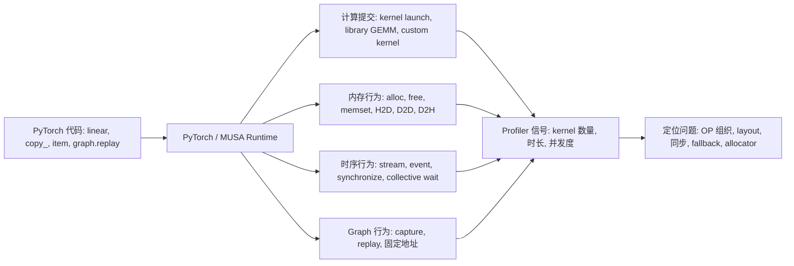
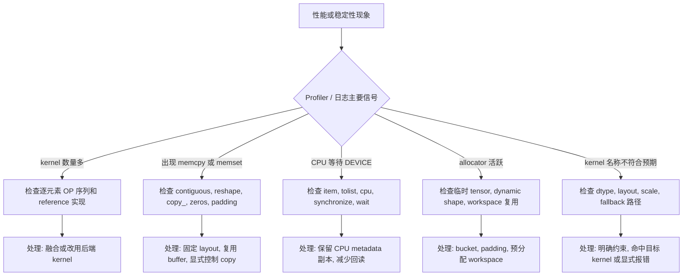

# PyTorch OP 基础：分类、性能问题与基础张量组织

> 本篇来自原始长文，保留 OP 分类、性能排查方法，以及创建、原地更新、layout、索引和序列组织类 OP 的完整 MUSA 用例。Transformer 主线和计算类 OP 见第 2 篇，DeepSeek/SGLang 与 MUSA 验证见第 3 篇。

## 系列结构

1. **第 1 篇：OP 基础与基础张量组织**。说明 PyTorch OP 的执行位置、工程边界、性能排查方法，并给出创建、原地更新、layout、索引、序列组织类 OP 的完整用例。
2. **第 2 篇：Transformer 执行主线与核心 OP 用例**。说明 Transformer 中的 OP 组织方式，并给出数学激活、线性代数、dtype/device、CPU、同步和动态形状类 OP 用例。
3. **第 3 篇：DeepSeek V4-Pro、SGLang 与 MUSA 验证**。说明 DeepSeek V4-Pro 与 SGLang 源码中的 OP 组织，保留 Graph 用例、MUSA 模块验证输出和源码注释。

## 阅读主线

阅读时建议先建立“上层 OP 到底层执行行为”的映射，再进入源码。重点不是记住每个 PyTorch API 的完整语义，而是识别这些 API 最终会表现成哪类计算、内存、同步或 Graph 行为。



后续章节可以按这条线阅读：先判断 OP 属于计算、layout、内存、同步还是 Graph 行为，再看它是否处在 decode 热点路径、CPU-DEVICE 边界或固定地址 replay 路径中。

## 1. PyTorch 常见 OP 如何分类

按执行位置和工程作用，PyTorch OP 分为 GPU OP、CPU OP、Sync OP、Dynamic Shape OP 和 Graph OP。不同类别对应不同的执行位置、输入输出约束、内存行为和同步行为。

`view` 通常只是零拷贝改 shape，`reshape` 在 stride 不兼容时会触发真实 copy。

`.item()` 读取 CPU 标量时只涉及 CPU侧访问，但作用在 DEVICE tensor 上会让 CPU 等待 DEVICE侧计算完成。

`copy_` 可用于普通赋值，也可用于 Graph replay 前更新固定地址 buffer。

### 1.1 GPU OP

GPU OP 作用于 DEVICE tensor，覆盖张量创建、layout 整理、索引映射、数学计算、线性代数、路由和 dtype/device 转换。它们是 Transformer forward、KV cache、MoE、sampling 和 Graph replay 的主体。

| 类别 | 常见 OP | 主要用途 | 注意事项 |
|------|---------|----------|--------------|
| 创建初始化 | `empty`、`new_empty`、`empty_like`、`zeros`、`ones`、`full` | 创建 input buffer、KV cache、logits、workspace | `empty` 不初始化；Graph replay 中不要替换 capture 过的 tensor 对象 |
| 原地更新 | `copy_`、`_foreach_copy_`、`fill_`、`zero_`、`clamp_`、`masked_fill_` | 更新 metadata、清理 padding、写 graph buffer、裁剪激活 | 原地 OP 会覆盖输入；padding 槽位必须清理 |
| Shape/Layout | `view`、`reshape`、`flatten`、`unsqueeze`、`squeeze`、`expand`、`permute`、`transpose`、`contiguous` | QKV head layout、RoPE 输入、MoE expert 维度、kernel 输入布局 | `view` 要求 stride 兼容；`contiguous` 可能真实 copy；`expand` 不适合原地写 |
| 索引映射 | slice、advanced indexing、`gather`、`take_along_dim`、`index_select`、`scatter_` | KV page/slot、MoE dispatch/combine、sampling mask | index dtype/device 要匹配；重复写、越界和 mask 广播最容易出错 |
| 序列组合 | `arange`、`repeat_interleave`、`cat`、`stack`、`split`、`chunk`、`pad`、`where` | positions 展开、batch 拼接、gate/up 切分、bucket padding | 动态输出会影响 allocator、compile 和 Graph replay |
| 数学与激活 | `sum`、`mean`、`square`、`rsqrt`、`sigmoid`、`silu`、`gelu`、`relu`、`softmax`、`clamp` | RMSNorm、SwiGLU、attention/sampling、reference 实现 | 多个逐元素/归约 OP 分别调度时会带来多次 launch 和 HBM 读写 |
| 线性代数与路由 | `F.linear`、`matmul`、`mm`、`bmm`、`einsum`、`topk`、`sort`、`argmax` | QKV/O projection、MLP、LM head、MoE top-k、sampling | dtype、layout、scale、top-k shape 和排序稳定性要明确 |
| dtype/device | `to`、`float`、`half`、`bfloat16`、`int`、`long` | metadata dtype、BF16/FP8/FP4 路径、CPU/DEVICE 边界 | 避免 OP 间反复 cast；`to(device)` 可能引入 H2D/D2H copy |

### 1.2 CPU OP

CPU OP 服务调度和状态管理，不直接承担大张量计算。在线推理里，CPU侧负责 request queue、prefix cache、bucket 选择、KV block 管理、metadata 构造和协议输出；DEVICE侧负责 attention、MLP/MoE、logits 和 sampling 的张量计算。

| 类别 | 常见 OP | 典型场景 | 注意事项 |
|------|---------|----------|----------|
| Python 容器 | `list`、`dict`、`len`、`range`、`sort` | scheduler、request state、block table、prefix cache | 可以放在 Graph 外；不要驱动 decode 单步里的 DEVICE tensor 分支 |
| CPU tensor | `torch.tensor(..., device="cpu")`、CPU-side `max/sum` | `seq_lens_cpu`、batch size、bucket 选择 | CPU侧元数据副本要和 DEVICE侧 metadata 同步 |
| CPU-DEVICE 转换 | `.cpu()`、`.numpy()`、`.tolist()` | 日志、调试、最终 token、少量统计 | GPU tensor 回 CPU 通常会触发同步和 D2H copy |
| 标量读取 | `.item()`、`int(tensor)` | loss scalar、最终 token id、CPU侧决策标量 | 对 GPU tensor 高频调用会把异步执行变成 CPU 等待 |
| H2D metadata | `torch.as_tensor(..., device)`、`to(device)` | seq_lens、positions、page table 上传 | 高频路径要复用固定 buffer，避免零散小 tensor 上传 |

### 1.3 Sync OP

Sync OP 管理 CPU、DEVICE stream、Graph replay 和分布式 rank 的时序。它们本身不一定做数学计算，但会改变执行并行度。

| 类别 | 常见 API/OP | 合理用法 | 风险 |
|------|-------------|----------|------|
| 全设备同步 | `torch.cuda.synchronize()`、`torch.musa.synchronize()` | benchmark、错误定位、程序结束前等待 | 放进 decode 热点路径会打断 CPU/DEVICE 并行 |
| Stream/Event | `Stream`、`current_stream()`、`Event.record()`、`wait_event()` | copy/compute 编排、异步 H2D、局部依赖 | wait 范围过大等价于串行化 |
| Graph 边界 | `graph.replay()` 前后必要 wait | replay 前更新固定 buffer，读取输出前等待 | capture 内出现不支持的同步会失败 |
| 分布式同步 | `all_reduce`、`reduce_scatter`、`all_gather`、work wait | TP/EP/DP 通信、MoE expert 交换 | 过早 wait 会破坏通信与计算重叠 |
| 隐式同步 | `.item()`、`.tolist()`、`.cpu()` | 最终结果回传、低频统计 | 看起来不是同步 API，但会让 CPU 等 DEVICE |

### 1.4 Dynamic Shape OP

Dynamic Shape OP 的输出 shape 依赖输入数据内容。它们适合 eager 调试和 CPU 规划，但会增加 compile guard、Graph replay 固定 shape、通信 bucket 和 workspace 复用的复杂度。

| 类型 | 常见 OP | 使用场景 | 稳定化方式 |
|------|---------|----------|------------|
| 位置发现 | `nonzero`、`argwhere` | 找有效 token、稀疏 mask 调试 | 用 fixed mask + padding 保持 shape |
| 去重统计 | `unique`、`unique_consecutive` | expert/block/request 分布统计 | 在线路径优先 fixed capacity 或 histogram |
| Mask 压缩 | `masked_select`、boolean indexing | 抽取有效 token/logits | 延迟敏感路径用 `where` 保持原 shape |
| 动态切分拼接 | data-dependent `cat/split` | 动态 batch、变长 request | scheduler 侧 bucket + padding |
| 数据依赖索引 | mask 后 `gather/index_select` | MoE token 选择、KV block 选择 | 固定 top-k、padded index、sentinel |

### 1.5 Graph OP

Graph OP 用于固定 shape、固定地址、固定执行序列的 replay。Graph 不会让单个数学 OP 自动变快，它减少的是 Python 调度和 kernel launch 开销，适合小 batch、多 kernel、重复执行的 decode 路径。

| 阶段 | 常见 API/OP | 用法 | 注意事项 |
|------|-------------|------|----------|
| 预分配 | `empty`、`new_empty`、`zeros` | capture 前创建固定 input/output/metadata buffer | replay 中不能替换 tensor 对象 |
| warmup/capture | `Stream`、`MUSAGraph`、`capture_begin/capture_end` | 用固定 shape 和固定地址执行一次 | allocator、kernel cache、backend 状态需要提前稳定 |
| 更新输入 | `copy_`、`_foreach_copy_`、`fill_`、`zero_` | replay 前只改 buffer 内容 | 新分配和对象替换会破坏 capture 假设 |
| 执行 | `graph.replay()` | 相同 bucket 下复用录制路径 | dynamic shape、CPU sync、不支持 capture 的调用会导致失败 |

## 2. OP 常见注意事项和性能问题

PyTorch OP 的性能问题通常来自五类行为：隐式 copy、临时分配、CPU-DEVICE 同步、动态 shape，以及未命中预期 kernel 或 fallback 路径。

排查时先看 profiler 中的可见信号，再回到源码定位对应 OP。不要只看 Python 代码是否简洁，要判断它是否引入了额外 kernel、copy、同步、分配或 fallback。



### 2.1 Layout 与隐式 Copy

`view/reshape/transpose/permute/contiguous` 是 Transformer 中最常见的 layout OP。`view` 通常是零拷贝，但要求 stride 兼容；`reshape` 在 stride 不兼容时可能分配新 tensor；`contiguous()` 会把非连续 layout 复制成连续内存。

QKV head layout、RoPE 输入、KV cache layout 和 custom kernel 输入都依赖这些 layout 结果。

| 现象 | 常见 OP | 根因 | 处理方式 |
|------|---------|------|----------|
| `reshape` 后延迟抖动 | `reshape`、`permute`、`transpose` | stride 不兼容导致隐式 copy | 能用 `view` 时优先 `view`；kernel 前显式检查 `stride/is_contiguous` |
| kernel 前多一次 copy | `contiguous()` | 目标 kernel 只支持连续输入 | 把 layout 转换前移、复用转换结果，或融合到 kernel 内 |
| broadcast 写错 | `expand` + inplace OP | expanded tensor 可能是 zero-stride view | 不对 expanded view 原地写，必要时先 `clone/contiguous` |

### 2.2 分配、初始化与 Buffer 生命周期

`empty/new_empty/empty_like` 只分配内存，不初始化。高频推理路径经常用它们预分配 workspace，后续 kernel 必须完整写入。

Graph replay 还要求 input/output/metadata tensor 的对象地址保持不变。replay 前应使用 `copy_/fill_/zero_` 更新内容，而不是创建新 tensor。

| 场景 | 推荐方式 | 风险 |
|------|----------|------|
| graph input/output | capture 前预分配，replay 前 `copy_` 更新内容 | replay 中替换 tensor 对象会破坏固定地址 |
| padding 槽位 | replay 前 `fill_/zero_` 清理 | 残留值会影响 attention mask、cache 或 logits |
| 临时 workspace | 按 batch/seq bucket 复用 | 每步分配增加 allocator 开销和地址不稳定 |

### 2.3 由多个独立 kernel 执行的 OP 序列

RMSNorm、SwiGLU、attention softmax 和 MoE combine 常用多个 PyTorch OP 表达 reference 语义。reference 实现便于验证数学逻辑，但每个 OP 往往会单独触发 kernel launch，并读写中间 tensor。

在线热点路径通常需要 fused kernel 或后端原生 kernel 承担同一段计算。

| OP 序列 | 语义 | 性能问题 |
|-------|------|----------|
| `square -> mean -> rsqrt -> mul` | RMSNorm / Q norm | 多次读取 hidden states，多次 launch |
| `chunk -> silu -> clamp -> mul` | SwiGLU | 中间 tensor 多，激活、裁剪和乘法分别执行 |
| `softmax -> matmul` | attention reference | score tensor 大，占显存和带宽 |
| `where/nonzero -> index_select -> scatter` | MoE dispatch/combine | token 数动态，allocator 和调度复杂 |
| `topk -> gather -> normalize` | MoE routing / sampling | top-k shape、排序和 dtype 会传导到后续 kernel |

### 2.4 CPU-DEVICE 同步边界

`.item()`、`.tolist()`、`.cpu()`、`.numpy()` 是最容易被忽略的同步来源。对 CPU tensor 调用它们通常没问题；对 GPU/MUSA tensor 调用时，CPU 需要等待前序 DEVICE 计算完成，再做 D2H 拷贝或标量读取。

| API | 合理位置 | 风险位置 |
|-----|----------|----------|
| `.item()` | CPU侧元数据副本、最终标量、benchmark 结束 | GPU seq_lens、GPU logits、Graph 内部分支 |
| `.tolist()` | CPU scheduler 的长度列表、最终 token 列表 | GPU 上 `bincount` 后回读并驱动 Python expert loop |
| `.cpu()` | 最终输出、少量 logprob、离线分析 | 完整 logits、hidden states、KV metadata |
| `synchronize()` | profiling 边界、错误定位 | decode 单步、通信计算重叠区 |

### 2.5 Dynamic Shape、Compile 与 Graph

`nonzero/unique/masked_select`、mask 后变长 `index_select`、数据相关 `cat/split` 会让输出 shape 随输入内容变化。它们在 eager 模式表达力强，但会让 `torch.compile` 产生 guard 或 graph break，也会破坏 Graph replay 的固定 shape/固定地址约束。

| 动态来源 | 典型 OP | 更稳定的表达 |
|----------|---------|--------------|
| 有效 token 数变化 | `nonzero`、boolean indexing | fixed mask + padding |
| expert 负载变化 | `where`、`bincount(...).tolist()` | fixed top-k、固定 expert capacity、padded metadata |
| request 长度变化 | data-dependent `cat/split` | CPU scheduler bucket + fixed metadata |
| sparse index 数量变化 | 动态 `topk(k)` | 固定 k，超出部分用 sentinel/padding |

### 2.6 dtype、量化与 Fallback

BF16/FP16/FP8/FP4、activation scale、weight scale、block size、packed layout 和输出 dtype 是一组接口约束。`to(dtype)` 不只是精度转换，也可能改变 kernel 路径、Graph capture 能力和数值误差分布。

| 问题 | 表现 | 处理方式 |
|------|------|----------|
| dtype/layout 不匹配 | fallback 到 PyTorch reference 或通用 kernel | 打印/统计执行路径，确认输入满足 kernel 约束 |
| scale layout 不匹配 | FP8/FP4 GEMM 结果错误或性能异常 | 固定 block size，明确 scale shape、stride 和连续性 |
| 反复 cast | 多余 `float/half/bfloat16/to` | 在模块边界集中转换 |
| silent fallback | 语义正确但性能异常 | 对不支持组合显式报错或受控 fallback |

## 附录 A. PyTorch 常见 OP 详细用例与 MUSA 输出

附录 A 提供逐 OP 说明、完整可运行代码、输入描述、MUSA 执行输出和注意事项。第 1 章负责分类和风险概览；本篇展开 A.1.1-A.1.5，A.1.6-A.4 见第 2 篇，A.5 见第 3 篇。

为减少阅读干扰，样例代码只保留输入构造、目标 OP 和必要输出，不再在每个代码块内重复放置统一格式化函数。运行结果保留为整理后的 `shape/dtype/device/value` 格式，便于核对。

附录 OP 索引：

| OP 类别 | 代表 OP | 附录位置 | 主要场景 |
|---------|---------|----------|----------|
| 创建初始化 | `empty/new_empty/empty_like/zeros/ones/full` | A.1.1 | graph buffer、KV cache、logits、padding、临时 workspace |
| 原地更新 | `copy_/_foreach_copy_/fill_/zero_/masked_fill_` | A.1.2 | metadata 写回、replay 前准备、padding 清理、mask 更新 |
| Shape/Layout | `view/reshape/flatten/unsqueeze/squeeze/expand/permute/transpose/contiguous` | A.1.3 | attention head layout、MoE buffer、KV cache layout、custom kernel 输入 |
| 索引映射 | slice、advanced indexing、`gather/take_along_dim/index_select/scatter_/tensor_split` | A.1.4 | KV page/slot、MoE dispatch/combine、chunked prefill 切分 |
| 序列组合 | `arange/repeat_interleave/cat/stack/pad/where` | A.1.5 | positions 展开、bucket padding、batch 拼接、logits mask |
| 数学激活 | `sum/mean/max/min/clamp/square/rsqrt/sigmoid/gelu/silu/relu/softmax/log_softmax` | A.1.6 | RMSNorm、SwiGLU、sampling、fallback reference |
| 线性代数/路由 | `linear/matmul/mm/bmm/einsum/topk/sort/argsort/argmax` | A.1.7 | GEMM、attention reference、MoE routing、sampling top-k |
| dtype/device | `to/float/long/bfloat16` | A.1.8 | metadata dtype、FP16/BF16/FP8、CPU/MUSA 边界 |
| CPU OP | Python 容器、CPU tensor、`.cpu/.tolist/.item`、tokenizer/I/O | A.2 | scheduler、metadata 副本、日志、协议边界 |
| Sync OP | `synchronize`、stream/event、隐式 sync、collective wait | A.3 | benchmark、graph 边界、通信并行执行、CPU-DEVICE 等待 |
| Dynamic Shape | `nonzero/unique/masked_select` | A.4 | 调试、统计、CPU侧规划逻辑；延迟敏感路径通常用固定 mask/padding 替代 |
| Graph OP | `MUSAGraph`、capture/replay、fixed buffer update | A.5 | decode graph、piecewise graph、固定地址 replay |

### A.1 GPU OP

GPU OP 覆盖创建初始化、原地更新、shape/layout、索引映射、序列拼接、数学激活、线性代数、排序路由和 dtype/device 转换，是模型 forward、attention、MoE、sampling、KV cache 和 fallback reference 的基础表达。

#### A.1.1 Tensor 创建与初始化

创建与初始化 OP 包括 `torch.empty`、`Tensor.new_empty`、`torch.empty_like`、`torch.zeros`、`torch.ones`、`torch.full`。它们用于预分配 input buffer、KV cache page、logits buffer、padding tensor 和占位 metadata，也是 graph replay 固定地址管理的基础。

SGLang DeepSeek V4 在启动或 capture 前用 `empty/new_empty/empty_like` 预分配 decode buffer、attention 临时区、MoE intermediate cache 和 logits 输出；prefill/decode 切换时用 `zeros/ones/full` 构造 padding、mask、占位 seq_lens 和默认 cache index。

##### `torch.empty`

功能：分配指定 shape/dtype/device 的 tensor，不初始化内容。  
用例：预分配 CUDA/MUSA Graph input buffer、KV cache page、temporary partial buffer、logits buffer。

```python
import torch
x = torch.empty((2, 3), dtype=torch.float32, device="musa:0")

print("x:", tuple(x.shape), x.dtype, x.device)
```

输入：shape `(2, 3)`，dtype `float32`。  
MUSA 运行结果（整理后）：

```text
x = Tensor(shape=(2, 3), dtype=float32, device=musa:0)
```

注意：只有后续 kernel 会完整写入时才安全；graph capture 后应保持该 tensor 对象不变。

##### `Tensor.new_empty`

功能：继承已有 tensor 的 dtype/device，创建未初始化 tensor。  
用例：MQA、HC/MHC、MoE 中按输入设备生成输出或临时 buffer。

```python
import torch
x = torch.empty((2, 3), dtype=torch.float32, device="musa:0")
y = x.new_empty((3, 2))

print("x:", tuple(x.shape), x.dtype, x.device)
print("y:", tuple(y.shape), y.dtype, y.device)
```

输入：`x.shape=(2,3)`，`x.dtype=float32`，`x.device=musa:0`。  
MUSA 运行结果（整理后）：

```text
x = Tensor(shape=(2, 3), dtype=float32, device=musa:0)
y = Tensor(shape=(3, 2), dtype=float32, device=musa:0)
```

##### `torch.empty_like`

功能：创建与输入 shape/dtype/device 相同的未初始化 tensor。  
用例：复用已有激活或 metadata 的结构生成临时输出。

```python
import torch
x = torch.tensor([[1, 2], [3, 4]], device="musa:0")
y = torch.empty_like(x)

print("x:", tuple(x.shape), x.dtype, x.device)
print("y:", tuple(y.shape), y.dtype, y.device)
```

输入：`x=[[1,2],[3,4]]`。  
MUSA 运行结果（整理后）：

```text
x = Tensor(shape=(2, 2), dtype=int64, device=musa:0)
y = Tensor(shape=(2, 2), dtype=int64, device=musa:0)
```

##### `torch.zeros`

功能：分配并初始化为 0。  
用例：清零 out_cache_loc、mask、padding metadata 或占位 buffer。

```python
import torch
x = torch.zeros((2, 3), dtype=torch.int64, device="musa:0")

print("x =", x)
```

输入：shape `(2,3)`。  
MUSA 运行结果（整理后）：

```text
x = Tensor(shape=(2, 3), dtype=int64, device=musa:0, value=[[0, 0, 0], [0, 0, 0]])
```

##### `torch.ones`

功能：分配并初始化为 1。  
用例：idle batch 的 占位 seq_lens、mask 或默认权重。

```python
import torch
x = torch.ones((2, 3), dtype=torch.int64, device="musa:0")

print("x =", x)
```

输入：shape `(2,3)`。  
MUSA 运行结果（整理后）：

```text
x = Tensor(shape=(2, 3), dtype=int64, device=musa:0, value=[[1, 1, 1], [1, 1, 1]])
```

##### `torch.full`

功能：分配并初始化为指定标量。  
用例：构造固定 padding value、默认 seq_lens、非法 expert id sentinel。

```python
import torch
x = torch.full((2, 3), 7, device="musa:0")

print("x =", x)
```

输入：shape `(2,3)`，value `7`。  
MUSA 运行结果（整理后）：

```text
x = Tensor(shape=(2, 3), dtype=int64, device=musa:0, value=[[7, 7, 7], [7, 7, 7]])
```

注意：`fill_value` 避免来自 GPU tensor 的 `.item()`，否则会引入同步。

#### A.1.2 原地复制与更新

原地更新 OP 包括 `Tensor.copy_`、`torch._foreach_copy_`、`Tensor.fill_`、`Tensor.zero_`、`Tensor.masked_fill_`。它们修改已有 tensor 内容而不替换对象，常用于 graph replay 前写入真实 batch、清理 padding 区、更新 metadata 和 mask。

SGLang DeepSeek V4 在线推理中，`copy_/_foreach_copy_` 将本轮 `input_ids`、`positions`、`seq_lens`、`out_cache_loc` 写进 graph 固定 buffer。`fill_/zero_` 清理 padding 槽位、填充请求和上一轮残留。

`masked_fill_` 处理 attention mask、invalid expert、top-k/top-p 过滤和 logits 屏蔽。

##### `Tensor.copy_`

功能：把源 tensor 内容复制到目标 tensor，目标对象地址不变。  
用例：graph replay 前更新静态 input buffer；DSV4 metadata replay 中原地更新 tensor 字段。

```python
import torch
dst = torch.tensor([0, 0, 0], device="musa:0")
src = torch.tensor([1, 2, 3], device="musa:0")
dst.copy_(src)

print("dst =", dst)
print("src =", src)
```

输入：`dst=[0,0,0]`，`src=[1,2,3]`。  
MUSA 运行结果（整理后）：

```text
dst = Tensor(shape=(3,), dtype=int64, device=musa:0, value=[1, 2, 3])
src = Tensor(shape=(3,), dtype=int64, device=musa:0, value=[1, 2, 3])
```

##### `torch._foreach_copy_`

功能：批量执行多个 `copy_`，减少 Python 循环和调度开销。  
用例：`DecodeInputBuffers.populate_from_forward_batch` 批量更新 input_ids、seq_lens、positions、out_cache_loc。

```python
import torch
dst0 = torch.tensor([0, 0], device="musa:0")
dst1 = torch.tensor([0, 0], device="musa:0")
src0 = torch.tensor([1, 1], device="musa:0")
src1 = torch.tensor([2, 2], device="musa:0")
torch._foreach_copy_([dst0, dst1], [src0, src1])

print("dst0 =", dst0)
print("dst1 =", dst1)
print("src0 =", src0)
print("src1 =", src1)
```

输入：`dst0=[0,0]`，`dst1=[0,0]`，`src0=[1,1]`，`src1=[2,2]`。  
MUSA 运行结果（整理后）：

```text
dst0 = Tensor(shape=(2,), dtype=int64, device=musa:0, value=[1, 1])
dst1 = Tensor(shape=(2,), dtype=int64, device=musa:0, value=[2, 2])
src0 = Tensor(shape=(2,), dtype=int64, device=musa:0, value=[1, 1])
src1 = Tensor(shape=(2,), dtype=int64, device=musa:0, value=[2, 2])
```

##### `Tensor.fill_`

功能：原地填充指定标量。  
用例：复用 graph buffer 前写默认值、填 padding 槽位。

```python
import torch
x = torch.tensor([0, 0, 0], device="musa:0")
x.fill_(3)

print("x =", x)
```

输入：`x=[0,0,0]`。  
MUSA 运行结果（整理后）：

```text
x = Tensor(shape=(3,), dtype=int64, device=musa:0, value=[3, 3, 3])
```

##### `Tensor.zero_`

功能：原地填 0。  
用例：清空临时 metadata 或输出 buffer。

```python
import torch
x = torch.tensor([3, 3, 3], device="musa:0")
x.zero_()

print("x =", x)
```

输入：`x=[3,3,3]`。  
MUSA 运行结果（整理后）：

```text
x = Tensor(shape=(3,), dtype=int64, device=musa:0, value=[0, 0, 0])
```

##### `Tensor.masked_fill_`

功能：按 bool mask 原地填充值。  
用例：SWA window 非法 offset 置零、topk padding id 置 `-1`、attention mask 处理。

```python
import torch
x = torch.tensor([1, 2, 3, 4], device="musa:0")
mask = torch.tensor([True, False, True, False], device="musa:0")
x.masked_fill_(mask, -1)

print("x =", x)
print("mask =", mask)
```

输入：`x=[1,2,3,4]`，`mask=[True,False,True,False]`。  
MUSA 运行结果（整理后）：

```text
x = Tensor(shape=(4,), dtype=int64, device=musa:0, value=[-1, 2, -1, 4])
mask = Tensor(shape=(4,), dtype=bool, device=musa:0, value=[True, False, True, False])
```

注意：推理 `no_grad` 路径更适合使用原地更新；仍要保证写入对象是预期的固定 buffer。

#### A.1.3 形状、布局与广播

形状、布局与广播 OP 包括 `view`、`reshape`、`flatten`、`unsqueeze`、`squeeze`、`expand`、`contiguous`、`stride`、`is_contiguous`、`storage_offset`。它们通常不执行大规模计算，但会定义 tensor 的逻辑形状、stride 和连续性。

这些属性会影响 backend kernel 的读取方式。

Transformer 中 QKV 通过 `view/reshape/unsqueeze` 整理成 `[token, head, dim]` 或 `[batch, seq, head, dim]`。RMSNorm、HC/MHC 和 MoE fallback 用 `flatten`、`expand` 和 broadcast 对齐维度。

MUSA/TileLang/custom kernel 前用 `contiguous/is_contiguous/stride/storage_offset` 检查内存布局。

排查时检查隐式 copy、graph 固定地址和非预期 stride。

##### `Tensor.view`

功能：在 stride 兼容时返回新 shape 的 view，不复制底层数据。  
用例：QKV head 维度整理、MQA grouped layout、mHC `hc_mult` 维度展开。

```python
import torch
x = torch.arange(6, device="musa:0")
y = x.view(2, 3)

print("x =", x)
print("y =", y)
```

输入：`x=[0,1,2,3,4,5]`。  
MUSA 运行结果（整理后）：

```text
x = Tensor(shape=(6,), dtype=int64, device=musa:0, value=[0, 1, 2, 3, 4, 5])
y = Tensor(shape=(2, 3), dtype=int64, device=musa:0, value=[[0, 1, 2], [3, 4, 5]])
```

##### `Tensor.reshape`

功能：改变 shape，必要时复制。  
用例：量化分组、fallback reference 中规整 `[T,G,D]` 等逻辑维度。

```python
import torch
x = torch.arange(6, device="musa:0")
y = x.reshape(3, 2)

print("x =", x)
print("y =", y)
```

输入：`x=[0,1,2,3,4,5]`。  
MUSA 运行结果（整理后）：

```text
x = Tensor(shape=(6,), dtype=int64, device=musa:0, value=[0, 1, 2, 3, 4, 5])
y = Tensor(shape=(3, 2), dtype=int64, device=musa:0, value=[[0, 1], [2, 3], [4, 5]])
```

注意：延迟敏感路径避免用 `reshape` 掩盖隐式 copy；需要固定地址时显式处理 layout。

##### `Tensor.flatten`

功能：合并指定范围内的连续维度。  
用例：HC fallback norm 前把多维 hidden 展平成 `[batch, features]`。

```python
import torch
x = torch.arange(24, dtype=torch.float32, device="musa:0").reshape(2, 3, 4)
y = x.flatten(1)

print("x =", x)
print("y =", y)
```

输入：`x.shape=(2,3,4)`，值为 `0..23`。  
MUSA 运行结果（整理后）：

```text
x = Tensor(shape=(2, 3, 4), dtype=float32, device=musa:0, value=[[[0.0, 1.0, 2.0, 3.0], [4.0, 5.0, 6.0, 7.0], [8.0, 9.0, 10.0, 11.0]], [[12.0, 13.0, 14.0, 15.0], [16.0, 17.0, 18.0, 19.0], [20.0, 21.0, 22.0, 23.0]]])
y = Tensor(shape=(2, 12), dtype=float32, device=musa:0, value=[[0.0, 1.0, 2.0, 3.0, 4.0, 5.0, 6.0, 7.0, 8.0, 9.0, 10.0, 11.0], [12.0, 13.0, 14.0, 15.0, 16.0, 17.0, 18.0, 19.0, 20.0, 21.0, 22.0, 23.0]])
```

##### `Tensor.unsqueeze`

功能：插入 size=1 的维度。  
用例：broadcast scale、mask、position 或 expert 权重。

```python
import torch
x = torch.tensor([1.0, 2.0, 3.0], device="musa:0")
y = x.unsqueeze(0)

print("x =", x)
print("y =", y)
```

输入：`x=[1.0,2.0,3.0]`。  
MUSA 运行结果（整理后）：

```text
x = Tensor(shape=(3,), dtype=float32, device=musa:0, value=[1.0, 2.0, 3.0])
y = Tensor(shape=(1, 3), dtype=float32, device=musa:0, value=[[1.0, 2.0, 3.0]])
```

##### `Tensor.squeeze`

功能：删除 size=1 的维度。  
用例：去掉临时 broadcast 维度。

```python
import torch
x = torch.tensor([[[1.0], [2.0], [3.0]]], device="musa:0")
y = x.squeeze(-1)

print("x =", x)
print("y =", y)
```

输入：`x=[[[1.0],[2.0],[3.0]]]`。  
MUSA 运行结果（整理后）：

```text
x = Tensor(shape=(1, 3, 1), dtype=float32, device=musa:0, value=[[[1.0], [2.0], [3.0]]])
y = Tensor(shape=(1, 3), dtype=float32, device=musa:0, value=[[1.0, 2.0, 3.0]])
```

注意：不建议无参 `squeeze()`，容易误删 batch 维。

##### `Tensor.expand`

功能：通过 stride=0 view 扩展维度，不复制数据。  
用例：构造 `[bs, topk]` request index，广播 norm scale。

```python
import torch
x = torch.tensor([[0], [1], [2]], device="musa:0")
y = x.expand(-1, 4)

print("x =", x)
print("y =", y)
```

输入：`x=[[0],[1],[2]]`。  
MUSA 运行结果（整理后）：

```text
x = Tensor(shape=(3, 1), dtype=int64, device=musa:0, value=[[0], [1], [2]])
y = Tensor(shape=(3, 4), dtype=int64, device=musa:0, value=[[0, 0, 0, 0], [1, 1, 1, 1], [2, 2, 2, 2]])
```

注意：`expand` 返回 view，不适合原地写；后续要求 contiguous 时会触发复制。

##### `Tensor.contiguous`

功能：返回内存连续 tensor；已连续则返回自身，否则复制。  
用例：MUSA/TileLang/fused kernel 前满足内存布局要求。

```python
import torch
x = torch.arange(6, device="musa:0").view(2, 3).t()
y = x.contiguous()

print("x =", x)
print("y =", y)
```

输入：`x` 为非 contiguous 转置 view，数值 `[[0,3],[1,4],[2,5]]`。  
MUSA 运行结果（整理后）：

```text
x = Tensor(shape=(3, 2), dtype=int64, device=musa:0, value=[[0, 3], [1, 4], [2, 5]])
y = Tensor(shape=(3, 2), dtype=int64, device=musa:0, value=[[0, 3], [1, 4], [2, 5]])
```

##### `Tensor.stride`

功能：返回每个维度的步长。  
用例：检查 custom kernel 输入 layout。

```python
import torch
x = torch.arange(6, device="musa:0").view(2, 3)
stride = x.stride()

print("x =", x)
print("stride =", stride)
```

输入：`x.shape=(2,3)`。  
MUSA 运行结果（整理后）：

```text
x = Tensor(shape=(2, 3), dtype=int64, device=musa:0, value=[[0, 1, 2], [3, 4, 5]])
stride = (3, 1)
```

##### `Tensor.is_contiguous`

功能：判断 tensor 是否连续。  
用例：kernel 输入检查前确认 layout。

```python
import torch
x = torch.arange(6, device="musa:0").view(2, 3).t()
is_contiguous = x.is_contiguous()

print("x =", x)
print("is_contiguous =", is_contiguous)
```

输入：转置 view。  
MUSA 运行结果（整理后）：

```text
x = Tensor(shape=(3, 2), dtype=int64, device=musa:0, value=[[0, 3], [1, 4], [2, 5]])
is_contiguous = False
```

##### `Tensor.storage_offset`

功能：返回 view 相对底层 storage 的起始偏移。  
用例：调试切片/view 是否从非零偏移开始。

```python
import torch
x = torch.arange(6, device="musa:0")[2:]
offset = x.storage_offset()

print("x =", x)
print("offset =", offset)
```

输入：`x` 是从原 tensor 第 2 个元素开始的 view。  
MUSA 运行结果（整理后）：

```text
x = Tensor(shape=(4,), dtype=int64, device=musa:0, value=[2, 3, 4, 5])
offset = 2
```

#### A.1.4 索引、切分与映射

索引、切分与映射 OP 包括 Slice、Advanced indexing、`torch.gather`、`torch.take_along_dim`、`torch.index_select`、`Tensor.scatter_`、`Tensor.tensor_split`。

它们常用于 request/token 映射、page table 读取、MoE token dispatch/combine、chunked prefill 切分和 cache slot 定位。

SGLang DeepSeek V4 用 indexing 和 gather 读取或组织 KV cache page、slot mapping 和请求位置。MoE routing 用 `gather/index_select/scatter_` 完成 token 到 expert 的 dispatch 和 combine；chunked prefill 用 `tensor_split`、slice 拆分 token 或 hidden 维度。

排查时注意 index dtype、越界、非 contiguous 结果，以及动态 shape 对 graph replay 的影响。

##### Slice

功能：按范围取子 tensor，多数情况下是 view。  
用例：token/window 分片、chunked prefill 范围切分。

```python
import torch
x = torch.tensor([[0,1,2],[3,4,5],[6,7,8]], device="musa:0")
y = x[1:, :2]

print("x =", x)
print("y =", y)
```

输入：`x=[[0,1,2],[3,4,5],[6,7,8]]`。  
MUSA 运行结果（整理后）：

```text
x = Tensor(shape=(3, 3), dtype=int64, device=musa:0, value=[[0, 1, 2], [3, 4, 5], [6, 7, 8]])
y = Tensor(shape=(2, 2), dtype=int64, device=musa:0, value=[[3, 4], [6, 7]])
```

##### Advanced indexing

功能：按 index tensor 取元素；该用例生成新 tensor。  
用例：request-to-token、page table、MoE token dispatch。

```python
import torch
x = torch.tensor([[0,1,2],[3,4,5],[6,7,8]], device="musa:0")
rows = torch.tensor([0, 2], device="musa:0")
cols = torch.tensor([1, 2], device="musa:0")
y = x[rows, cols]

print("x =", x)
print("rows =", rows)
print("cols =", cols)
print("y =", y)
```

输入：`x=[[0,1,2],[3,4,5],[6,7,8]]`，`rows=[0,2]`，`cols=[1,2]`。  
MUSA 运行结果（整理后）：

```text
x = Tensor(shape=(3, 3), dtype=int64, device=musa:0, value=[[0, 1, 2], [3, 4, 5], [6, 7, 8]])
rows = Tensor(shape=(2,), dtype=int64, device=musa:0, value=[0, 2])
cols = Tensor(shape=(2,), dtype=int64, device=musa:0, value=[1, 2])
y = Tensor(shape=(2,), dtype=int64, device=musa:0, value=[1, 8])
```

##### `torch.gather`

功能：按 index 从指定维度收集，输出 shape 与 index 一致。  
用例：按 routing/page index 收集 expert、token 或 KV block。

```python
import torch
x = torch.tensor([[10,11,12],[20,21,22]], device="musa:0")
idx = torch.tensor([[2,0],[1,1]], device="musa:0")
y = torch.gather(x, 1, idx)

print("x =", x)
print("idx =", idx)
print("y =", y)
```

输入：`x=[[10,11,12],[20,21,22]]`，`idx=[[2,0],[1,1]]`。  
MUSA 运行结果（整理后）：

```text
x = Tensor(shape=(2, 3), dtype=int64, device=musa:0, value=[[10, 11, 12], [20, 21, 22]])
idx = Tensor(shape=(2, 2), dtype=int64, device=musa:0, value=[[2, 0], [1, 1]])
y = Tensor(shape=(2, 2), dtype=int64, device=musa:0, value=[[12, 10], [21, 21]])
```

##### `torch.take_along_dim`

功能：沿指定维度按 index 取值，语义接近 `gather`。  
用例：reference 路径中替代 gather 表达排序后取值。

```python
import torch
x = torch.tensor([[10,11,12],[20,21,22]], device="musa:0")
idx = torch.tensor([[2,0],[1,1]], device="musa:0")
y = torch.take_along_dim(x, idx, dim=1)

print("x =", x)
print("idx =", idx)
print("y =", y)
```

输入：`x=[[10,11,12],[20,21,22]]`，`idx=[[2,0],[1,1]]`。  
MUSA 运行结果（整理后）：

```text
x = Tensor(shape=(2, 3), dtype=int64, device=musa:0, value=[[10, 11, 12], [20, 21, 22]])
idx = Tensor(shape=(2, 2), dtype=int64, device=musa:0, value=[[2, 0], [1, 1]])
y = Tensor(shape=(2, 2), dtype=int64, device=musa:0, value=[[12, 10], [21, 21]])
```

##### `torch.index_select`

功能：沿单一维度用一维 index 选择。  
用例：按 request id、page id 或 token id 选行。

```python
import torch
x = torch.tensor([[0,1],[2,3],[4,5]], device="musa:0")
idx = torch.tensor([2, 0], device="musa:0")
y = torch.index_select(x, 0, idx)

print("x =", x)
print("idx =", idx)
print("y =", y)
```

输入：`x=[[0,1],[2,3],[4,5]]`，`idx=[2,0]`。  
MUSA 运行结果（整理后）：

```text
x = Tensor(shape=(3, 2), dtype=int64, device=musa:0, value=[[0, 1], [2, 3], [4, 5]])
idx = Tensor(shape=(2,), dtype=int64, device=musa:0, value=[2, 0])
y = Tensor(shape=(2, 2), dtype=int64, device=musa:0, value=[[4, 5], [0, 1]])
```

##### `Tensor.scatter_`

功能：按 index 把 src 写入目标 tensor。  
用例：MoE combine、routing mask 回填、token 重新排序。

```python
import torch
out = torch.zeros((2, 3), dtype=torch.int64, device="musa:0")
idx = torch.tensor([[0,2],[0,1]], device="musa:0")
src = torch.tensor([[5,6],[7,8]], device="musa:0")
out.scatter_(1, idx, src)

print("out =", out)
print("idx =", idx)
print("src =", src)
```

输入：`out=zeros(2,3)`，`idx=[[0,2],[0,1]]`，`src=[[5,6],[7,8]]`。  
MUSA 运行结果（整理后）：

```text
out = Tensor(shape=(2, 3), dtype=int64, device=musa:0, value=[[5, 0, 6], [7, 8, 0]])
idx = Tensor(shape=(2, 2), dtype=int64, device=musa:0, value=[[0, 2], [0, 1]])
src = Tensor(shape=(2, 2), dtype=int64, device=musa:0, value=[[5, 6], [7, 8]])
```

##### `Tensor.tensor_split`

功能：按维度切分 tensor。  
用例：token/expert 分片。

```python
import torch
chunks = torch.arange(6, device="musa:0").tensor_split(3)

print("chunks =", chunks)
```

输入：`[0,1,2,3,4,5]`。  
MUSA 运行结果（整理后）：

```text
chunks = [Tensor(shape=(2,), dtype=int64, device=musa:0, value=[0, 1]), Tensor(shape=(2,), dtype=int64, device=musa:0, value=[2, 3]), Tensor(shape=(2,), dtype=int64, device=musa:0, value=[4, 5])]
```

#### A.1.5 序列、拼接、填充与条件选择

序列、拼接、填充与条件选择 OP 包括 `torch.arange`、`torch.arange(..., out=out)`、`repeat_interleave`、`torch.cat`、`torch.stack`、`torch.nn.functional.pad`、`torch.where`。

它们用于构造 position ids、展开 request id、拼接 all-gather 结果、补齐 graph bucket 和按 mask 选择结果。

Prefill 阶段用 `arange/repeat_interleave` 展开 positions、request ids 和 token offsets。decode graph bucket 用 `pad/full/where` 补齐固定 batch；all-gather 或多路 expert 输出后用 `cat/stack` 合并结果；sampling 和 logits 过滤中用 `where` 按 mask 保留或屏蔽候选。

延迟敏感路径应减少可变长度 tensor 创建，优先复用固定输出或在 CPU scheduler 侧先确定长度。

##### `torch.arange`

功能：生成等差序列。  
用例：position ids、page offsets、prefill causal seq_lens、request index。

```python
import torch
y = torch.arange(3, 7, device="musa:0")

print("y =", y)
```

输入：start `3`，end `7`。  
MUSA 运行结果（整理后）：

```text
y = Tensor(shape=(4,), dtype=int64, device=musa:0, value=[3, 4, 5, 6])
```

##### `torch.arange(..., out=out)`

功能：复用预分配 buffer 写入等差序列。  
用例：graph metadata buffer 内原地生成固定 shape index。

```python
import torch
out = torch.empty((4,), dtype=torch.int64, device="musa:0")
torch.arange(3, 7, out=out)

print("out =", out)
```

输入：`out.shape=(4,)`，start `3`，end `7`。  
MUSA 运行结果（整理后）：

```text
out = Tensor(shape=(4,), dtype=int64, device=musa:0, value=[3, 4, 5, 6])
```

##### `repeat_interleave`

功能：按固定次数或每元素动态次数重复。  
用例：prefill request id 展开到 token 级、MoE token/expert 映射。

```python
import torch
x = torch.tensor([0, 1, 2], device="musa:0")
y1 = x.repeat_interleave(2)
repeats = torch.tensor([1, 2, 1], device="musa:0")
y2 = torch.repeat_interleave(x, repeats)

print("x =", x)
print("y1 =", y1)
print("repeats =", repeats)
print("y2 =", y2)
```

输入：`x=[0,1,2]`；动态 repeats 为 `[1,2,1]`。  
MUSA 运行结果（整理后）：

```text
x = Tensor(shape=(3,), dtype=int64, device=musa:0, value=[0, 1, 2])
y1 = Tensor(shape=(6,), dtype=int64, device=musa:0, value=[0, 0, 1, 1, 2, 2])
repeats = Tensor(shape=(3,), dtype=int64, device=musa:0, value=[1, 2, 1])
y2 = Tensor(shape=(4,), dtype=int64, device=musa:0, value=[0, 1, 1, 2])
```

##### `torch.cat`

功能：沿已有维度拼接。  
用例：all-gather 后拼接 hidden、CSA compressor state 追加。

```python
import torch
a = torch.tensor([1, 2], device="musa:0")
b = torch.tensor([3, 4], device="musa:0")
y = torch.cat([a, b], dim=0)

print("a =", a)
print("b =", b)
print("y =", y)
```

输入：`a=[1,2]`，`b=[3,4]`。  
MUSA 运行结果（整理后）：

```text
a = Tensor(shape=(2,), dtype=int64, device=musa:0, value=[1, 2])
b = Tensor(shape=(2,), dtype=int64, device=musa:0, value=[3, 4])
y = Tensor(shape=(4,), dtype=int64, device=musa:0, value=[1, 2, 3, 4])
```

##### `torch.stack`

功能：新增维度后拼接。  
用例：构造简化的 batch/rank metadata。

```python
import torch
a = torch.tensor([1, 2], device="musa:0")
b = torch.tensor([3, 4], device="musa:0")
y = torch.stack([a, b], dim=0)

print("a =", a)
print("b =", b)
print("y =", y)
```

输入：`a=[1,2]`，`b=[3,4]`。  
MUSA 运行结果（整理后）：

```text
a = Tensor(shape=(2,), dtype=int64, device=musa:0, value=[1, 2])
b = Tensor(shape=(2,), dtype=int64, device=musa:0, value=[3, 4])
y = Tensor(shape=(2, 2), dtype=int64, device=musa:0, value=[[1, 2], [3, 4]])
```

##### `torch.nn.functional.pad`

功能：边界填充。  
用例：CUDA/MUSA Graph bucket padding、sequence padding。

```python
import torch
import torch.nn.functional as F
x = torch.tensor([[1, 2, 3]], device="musa:0")
y = F.pad(x, (1, 2), value=0)

print("x =", x)
print("y =", y)
```

输入：`x=[[1,2,3]]`，左侧填 1 个 0，右侧填 2 个 0。  
MUSA 运行结果（整理后）：

```text
x = Tensor(shape=(1, 3), dtype=int64, device=musa:0, value=[[1, 2, 3]])
y = Tensor(shape=(1, 6), dtype=int64, device=musa:0, value=[[0, 1, 2, 3, 0, 0]])
```

注意：`value=tensor.item()` 会把 GPU scalar tensor 同步到 CPU，建议避免。

##### `torch.where`

功能：按条件在两个 tensor/scalar 间选择。  
用例：topk padding 修正、mask-based index 修正、routing fallback。

```python
import torch
cond = torch.tensor([True, False, True], device="musa:0")
y = torch.where(cond, torch.tensor([1,1,1], device="musa:0"), torch.tensor([2,2,2], device="musa:0"))

print("cond =", cond)
print("y =", y)
```

输入：`cond=[True,False,True]`，`a=[1,1,1]`，`b=[2,2,2]`。  
MUSA 运行结果（整理后）：

```text
cond = Tensor(shape=(3,), dtype=bool, device=musa:0, value=[True, False, True])
y = Tensor(shape=(3,), dtype=int64, device=musa:0, value=[1, 2, 1])
```
