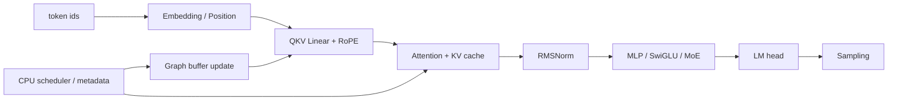
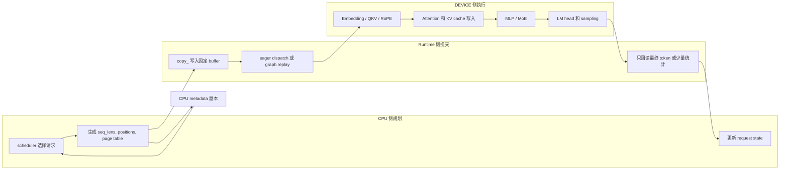

# Transformer 执行主线：核心计算 OP 与运行边界

> 本篇来自原始长文，保留 Transformer 模块中的 OP 组织，并承接第 1 篇的 OP 用例，覆盖数学激活、线性代数、dtype/device、CPU、同步和动态形状类 OP。基础分类和基础张量组织见第 1 篇，DeepSeek/SGLang 与 MUSA 验证见第 3 篇。

## 1. Transformer 架构中的 OP 组织

从 OP 角度看，Transformer 的主干计算按层重复展开：token id 先进入 embedding 和 position/RoPE，hidden states 经过 attention 与 KV cache，再进入 RMSNorm、MLP/SwiGLU 或 MoE，最后生成 logits 并完成 sampling。

训练路径还包括 loss、backward、optimizer 和分布式通信；推理路径更关注 KV cache、Graph replay、CPU scheduler 和 sampling 边界。



可以先把 decode 单步拆成 CPU 规划、Runtime 提交和 DEVICE 执行三段。这样读后面的 attention、MoE 和 Graph 代码时，能先判断某段逻辑位于哪个边界。



一层典型 Transformer block 的源码结构可以简化为以下形式。3.1 到 3.5 按同一顺序拆解各段源码中的 OP：

```python
def transformer_forward(input_ids, positions, attn_mask, kv_cache):
    # token id 先查表得到 hidden states，后续所有 block 都围绕 hidden 更新。
    hidden = embed_tokens(input_ids)
    for layer in layers:
        # attention 子层：norm -> attention -> residual add。
        residual = hidden
        hidden = layer.input_norm(hidden)
        attn_out, kv_cache = layer.attention(hidden, positions, attn_mask, kv_cache)
        hidden = residual + attn_out

        # MLP/MoE 子层：再次 norm 后更新 hidden。
        residual = hidden
        hidden = layer.post_attention_norm(hidden)
        hidden = residual + layer.mlp(hidden)

    # decode 常只取最后一个 token 做 LM head 和 sampling。
    hidden = final_norm(hidden)
    logits = lm_head(hidden[:, -1])
    next_token = sample(logits)
    return next_token, kv_cache
```

源码中的 OP 组织分为三个层次：数学语义，例如 `linear`、`softmax`、`silu`、`sum`；layout 和 metadata，例如 `view`、`transpose`、`arange`、`copy_`；服务边界，例如 `.cpu()`、Graph replay、KV cache page 写入。

分析性能问题时，要同时看 OP 本身和它所在的位置。同一个 OP 出现在高频路径、动态 shape 路径或 CPU-DEVICE 边界时，对 kernel launch、内存分配、同步等待和数据拷贝的影响会明显不同。

### 1.1 Embedding、Position 与 RoPE

Embedding 阶段把离散 token id 变成 hidden states，position 阶段生成每个 token 的位置信息，RoPE 把 position 注入 Q/K 的部分维度。常见 OP 是 `embedding`、`arange`、`repeat_interleave`、`to(int32/int64)`、`view/unsqueeze`、`sin/cos`、`mul/add`。

典型源码：

```python
def embedding_and_rope(input_ids, q, k, start_pos, freqs_cis):
    # 把离散 token id 映射成连续 hidden states。
    hidden = F.embedding(input_ids, embed_weight)

    # 为本轮 token 生成连续 position id，prefill 与 decode 都依赖该范围。
    positions = torch.arange(
        start_pos,
        start_pos + input_ids.numel(),
        device=input_ids.device,
        dtype=torch.long,
    )

    # Q/K projection 输出整理成 attention head layout。
    q = q.view(-1, num_heads, head_dim)
    k = k.view(-1, num_kv_heads, head_dim)

    # 只拆出需要 RoPE 的维度，其余维度保持 pass-through。
    q_rope, q_pass = q[..., :rope_dim], q[..., rope_dim:]
    k_rope, k_pass = k[..., :rope_dim], k[..., rope_dim:]

    # positions 查表得到旋转频率，unsqueeze 补 head 维用于 broadcast。
    freqs = freqs_cis[positions].unsqueeze(1)
    q_rope = apply_rotary(q_rope, freqs)
    k_rope = apply_rotary(k_rope, freqs)

    # 拼回完整 head_dim，供 attention kernel 消费。
    q = torch.cat([q_rope, q_pass], dim=-1)
    k = torch.cat([k_rope, k_pass], dim=-1)
    return hidden, positions, q, k
```

源码解析：

- `F.embedding` 的输入是 token id，输出是 `[tokens, hidden]`；token id dtype 和 device 不匹配会直接影响查表。
- `torch.arange` 生成 position id，prefill 常生成一段连续位置，decode 常只生成新增 token 的位置。
- `view` 把 Q/K 从扁平 hidden 维整理成 head layout；如果上游 projection 输出 layout 不兼容，后面需要显式处理 `contiguous()`。
- `unsqueeze(1)` 给 RoPE 频率补 head 维，依赖 broadcast；它通常不复制数据。
- `cat` 把 RoPE 维和 pass-through 维拼回完整 head_dim；拼接会产生新 tensor，热点路径常由 fused RoPE 或 attention prepare kernel 处理。

| 子模块 | 常见 OP | 组织方式 | 注意事项 |
|--------|---------|----------|----------|
| Token embedding | `F.embedding`、indexing | token id -> `[tokens, hidden]` | token id dtype 通常是 int64/int32，device 要一致 |
| Position | `arange`、`repeat_interleave`、`cat` | 生成 prefill/decode positions | 变长请求通常在 CPU scheduler 侧整理成固定 metadata |
| RoPE | `view/reshape`、`unsqueeze`、`mul/add` | Q/K 按 head_dim 拆分后旋转 | layout 要匹配 attention kernel；避免不必要 `contiguous()` |

### 1.2 Attention 与 KV Cache

Attention 是 OP 组织最密集的模块：`F.linear/matmul` 生成 Q/K/V，`view/transpose/unflatten` 整理 head layout，RoPE 更新 Q/K，attention kernel 读取 Q/K/V 和 metadata，KV cache 通过 indexing 或 custom kernel 写入 page/slot。

典型源码：

```python
def attention_forward(hidden, attn_mask, kv_cache, slot_mapping):
    # 一次 linear 生成 Q/K/V，再沿 hidden 维切分。
    qkv = F.linear(hidden, qkv_weight, qkv_bias)
    q, k, v = qkv.chunk(3, dim=-1)

    # 转成 [batch, heads, seq, head_dim]，匹配 attention 计算布局。
    q = q.view(batch, seq, num_heads, head_dim).transpose(1, 2)
    k = k.view(batch, seq, num_kv_heads, head_dim).transpose(1, 2)
    v = v.view(batch, seq, num_kv_heads, head_dim).transpose(1, 2)

    # slot_mapping 映射到 paged KV cache 的 page 与 page 内 offset。
    page_idx = torch.div(slot_mapping, page_size, rounding_mode="floor")
    page_offset = slot_mapping % page_size

    # 写 cache 前恢复 token-major layout，保证 token 与 slot 一一对应。
    k_for_cache = k.transpose(1, 2).reshape(-1, num_kv_heads, head_dim)
    v_for_cache = v.transpose(1, 2).reshape(-1, num_kv_heads, head_dim)
    kv_cache[page_idx, page_offset, 0] = k_for_cache
    kv_cache[page_idx, page_offset, 1] = v_for_cache

    # reference attention：显式生成 score/prob，便于校验语义。
    scores = torch.matmul(q, k.transpose(-2, -1)) * scale
    scores = scores.masked_fill(attn_mask, float("-inf"))
    probs = torch.softmax(scores, dim=-1)
    out = torch.matmul(probs, v)

    # 输出恢复到 hidden layout，再进入 output projection。
    out = out.transpose(1, 2).contiguous().view(batch, seq, hidden_size)
    return F.linear(out, o_weight), kv_cache
```

源码解析：

- `F.linear` 生成 QKV，是 attention 的主要 GEMM 入口；量化模型还要看 activation scale、weight scale 和 packed layout。
- `chunk(3, dim=-1)` 按 hidden 最后一维切分 Q/K/V，要求 qkv projection 输出维度严格匹配。
- `view + transpose` 把 `[batch, seq, hidden]` 变成 `[batch, heads, seq, head_dim]`；`transpose` 后通常是非连续 layout。
- `slot_mapping -> div/% -> advanced indexing` 表达 Paged KV cache 写入，page index、offset 和 token 顺序必须一致。
- `matmul -> masked_fill -> softmax -> matmul` 是 attention reference 实现；大模型在线推理通常用 fused attention kernel 避免显式 materialize 大 score tensor。
- `transpose(...).contiguous().view(...)` 是 attention 输出回到 hidden layout 的常见写法，`contiguous()` 可能成为额外 copy。

| 子模块 | 常见 OP | 组织方式 | 注意事项 |
|--------|---------|----------|----------|
| QKV projection | `F.linear`、`matmul` | hidden -> Q/K/V | dtype、weight layout、activation scale 决定执行路径 |
| Head layout | `view`、`unflatten`、`transpose`、`contiguous` | `[tokens, hidden]` -> `[tokens, heads, head_dim]` | stride 不匹配会触发 copy 或 kernel 输入错误 |
| Mask/score | `where`、`masked_fill`、`softmax`、`matmul/einsum` | reference attention 或小规模验证 | 大规模在线推理通常由 fused attention kernel 执行 |
| KV cache | advanced indexing、`copy_`、`scatter_`、`div/%` | token slot -> page/offset | page index、offset、dtype 和越界检查要明确 |

### 1.3 RMSNorm、MLP 与 SwiGLU

RMSNorm reference 通常是 `square -> mean -> rsqrt -> mul`；MLP/SwiGLU 通常是 `linear -> chunk/split -> silu/sigmoid/gelu -> mul -> linear`。这些 reference 计算序列能清楚表达数学语义，但在线热点路径通常需要 fused kernel 或后端原生 kernel。

典型源码：

```python
def rmsnorm_mlp(hidden, residual):
    # norm 计算使用 FP32，降低 reduction 的数值误差。
    x = hidden.float()
    rstd = torch.rsqrt(x.square().mean(dim=-1, keepdim=True) + eps)
    normed = (x * rstd).to(hidden.dtype) * norm_weight

    # gate/up 共用一次 projection，再按最后一维拆分。
    gate_up = F.linear(normed, gate_up_weight)
    gate, up = gate_up.chunk(2, dim=-1)

    # SwiGLU：SiLU(gate) 与 up 逐元素相乘。
    gate = F.silu(gate)
    intermediate = gate * up

    # down projection 后与 residual 相加。
    out = F.linear(intermediate, down_weight)
    return residual + out
```

源码解析：

- `float()` 常用于提升 norm 计算精度，但会引入 dtype 转换；输出通常再 cast 回模型 dtype。
- `square -> mean -> rsqrt -> mul` 直接表达 RMSNorm，但会产生多个逐元素/归约 OP。
- `F.linear` 生成 gate/up 两路，再用 `chunk` 切开；`chunk` 返回 view，后续 OP 共享上游 storage 视图。
- `silu(gate) * up` 是 SwiGLU 的计算语义；如果有 `clamp_`，它会原地覆盖 gate/up 分支。
- `residual + out` 是残差加法，训练中还会影响 autograd 保存 tensor；推理中通常关注是否能与 norm 或 projection 融合。

| 子模块 | 常见 OP | 组织方式 | 注意事项 |
|--------|---------|----------|----------|
| RMSNorm | `square`、`mean`、`rsqrt`、`mul` | hidden 归一化 | reduction 维度和 eps 要固定；多个小 OP 容易 launch 多 |
| Gate/Up | `F.linear`、`chunk`、`split` | hidden -> gate/up | split 后 view 的 layout 要满足后续激活 |
| SwiGLU | `silu`、`sigmoid`、`clamp`、`mul` | activation(gate) * up | `clamp_` 是原地写，会覆盖输入 |
| Down projection | `F.linear`、`matmul` | intermediate -> hidden | 量化路径要关注 scale 和 packed weight |

### 1.4 MoE Routing、Expert 与 Combine

MoE 在 Transformer 中把 MLP 替换为多个 expert。Router 先用 `linear/softmax/topk/gather` 选 expert，dispatch 把 token 发到 expert，expert MLP 计算后再 combine。

reference 代码常用 `where/index_select/scatter/sum` 表达语义；高性能实现会把 dispatch、grouped GEMM 和 combine 融合或批处理。

典型源码：

```python
def moe_forward(hidden):
    # router 把每个 token 映射到 expert 分数。
    router_logits = F.linear(hidden, router_weight)
    router_probs = torch.softmax(router_logits, dim=-1)

    # 选择每个 token 的 top-k expert，并归一化路由权重。
    topk_weight, topk_id = torch.topk(router_probs, k=num_experts_per_token, dim=-1)
    topk_weight = topk_weight / topk_weight.sum(dim=-1, keepdim=True)

    # output 用于按 token 累加各 expert 的加权结果。
    output = torch.zeros_like(hidden)
    for expert_id in range(num_experts):
        # 找到路由到当前 expert 的 token；输出长度由数据决定。
        token_idx, choice_idx = torch.where(topk_id == expert_id)
        if token_idx.numel() == 0:
            continue
        # reference 写法使用 advanced indexing 做 dispatch 和 combine。
        expert_in = hidden[token_idx]
        expert_out = experts[expert_id](expert_in)
        output[token_idx] += expert_out * topk_weight[token_idx, choice_idx].unsqueeze(-1)
    return output
```

源码解析：

- `F.linear -> softmax -> topk` 把 dense expert score 变成固定 top-k expert id 和权重。
- `topk_weight / sum(...)` 做权重归一化，`keepdim=True` 保证 broadcast shape 稳定。
- `zeros_like` 创建输出 buffer；如果后续路径没有完整覆盖，初值会影响 combine 结果。
- `where(topk_id == expert_id)` 产生动态长度索引，reference 代码可读，但不适合 Graph replay 内部。
- `hidden[token_idx]` 和 `output[token_idx] += ...` 是 advanced indexing；重复 index、累加顺序和 dtype 都会影响数值。
- 在线推理常把 token dispatch、grouped GEMM 和 combine 放进融合或批处理实现，避免 Python expert loop 和动态小 GEMM。

| 阶段 | 常见 OP | 组织方式 | 注意事项 |
|------|---------|----------|----------|
| Router score | `linear`、`softmax/sigmoid` | hidden -> expert score | score dtype 和归一化方式要与模型配置一致 |
| Expert 选择 | `topk`、`gather` | score -> top-k id/weight | top-k 输出 shape 建议固定 |
| Dispatch | `where`、`index_select`、`scatter_`、`bincount` | token -> expert bucket | 动态 token 数会影响 Graph 和通信 bucket |
| Expert MLP | grouped GEMM、`silu`、`mul` | expert hidden -> expert output | 多 expert 小 GEMM 容易低利用率 |
| Combine | `unsqueeze`、broadcast、`sum`、all-reduce | expert output -> token output | 权重 shape、重复 expert 和通信 wait 点要明确 |

### 1.5 Logits、Sampling 与 Graph Replay

LM head 用 `F.linear/matmul` 把 hidden 映射到 vocab logits；sampling 用 `softmax/topk/argmax/where` 选择 token。在线服务应避免频繁将完整 logits 拉回 CPU，CPU侧只保留最终 token、少量 logprob 和统计信息。

decode 阶段还会把 input、positions、seq_lens、page table 等写入固定 buffer，再通过 Graph replay 执行固定路径。

典型源码：

```python
def decode_step(input_ids, positions, fixed_buffers, graph=None):
    # replay 前只更新固定 buffer 内容，不替换 tensor 对象。
    fixed_buffers.input_ids[: input_ids.numel()].copy_(input_ids)
    fixed_buffers.positions[: positions.numel()].copy_(positions)
    fixed_buffers.seq_lens.fill_(1)

    if graph is not None:
        # graph 内复用 capture 时记录的 kernel 顺序和 tensor 地址。
        graph.replay()
        logits = fixed_buffers.logits
    else:
        # eager 路径用于对照验证或未 capture 的场景。
        hidden = model_forward(fixed_buffers.input_ids, fixed_buffers.positions)
        logits = F.linear(hidden[:, -1], lm_head_weight)

    # sampling 留在 DEVICE侧，仅最终 token 回传 CPU。
    topk_vals, topk_ids = torch.topk(logits, k=top_k, dim=-1)
    probs = torch.softmax(topk_vals / temperature, dim=-1)
    next_token = topk_ids[:, 0]
    return next_token.cpu().tolist(), probs
```

源码解析：

- `copy_` 把真实请求写入固定 input buffer，服务 Graph replay 的固定地址约束。
- `fill_` 用于清理或初始化固定 metadata；如果 padding 槽位残留旧值，attention 和 logits 都可能被污染。
- `graph.replay()` 复用固定 shape 和固定执行序列，减少 Python 调度和 launch 开销。
- `F.linear(hidden[:, -1], lm_head_weight)` 表示只对最后一个 token 做 LM head，是 decode 常见优化。
- `topk -> softmax` 保留在 DEVICE侧；`.cpu().tolist()` 只回传最终 token，避免把完整 logits 拉回 CPU。

| 场景 | 常见 OP | 组织方式 | 注意事项 |
|------|---------|----------|----------|
| LM head | `F.linear`、`matmul` | hidden -> vocab logits | vocab 大，显存和带宽压力高 |
| Sampling | `topk`、`softmax`、`argmax`、`where` | logits -> next token | 候选数量动态会影响 graph/compile |
| CPU 边界 | `.cpu()`、`.tolist()`、`.item()` | 只回传最终 token/少量统计 | 避免完整 logits 回 CPU |
| Graph replay | `copy_`、`fill_`、`zero_`、`graph.replay()` | replay 前更新固定 buffer | shape、地址和执行序列必须固定 |


## 2. PyTorch 常见 OP 详细用例与 MUSA 输出（计算、边界与动态形状）

本节延续第 1 篇中的 OP 用例，保留数学激活、线性代数、dtype/device、CPU、同步和动态形状类 OP 的完整代码、输入说明、MUSA 输出和注意事项。

为减少阅读干扰，样例代码只保留输入构造、目标 OP 和必要输出，不再在每个代码块内重复放置统一格式化函数。运行结果保留为整理后的 `shape/dtype/device/value` 格式，便于核对。

### A.1 GPU OP（续）

#### A.1.6 数学、归约与激活

数学与激活 OP 包括 `sum`、`mean`、`amax`、`min/max`、`abs`、`square`、`rsqrt`、`sigmoid`、`silu`、`gelu`、`relu`、`softmax`、`clamp`。它们覆盖 norm、activation、routing score、attention probability、MoE gate 和数值边界裁剪。

RMSNorm 使用 `square/mean/rsqrt` 表达参考实现。attention fallback 使用 `softmax`；MoE router 使用 `softmax/topk` 前后的归一化和裁剪；SwiGLU/GELU/SiLU/ReLU 出现在 MLP 和 expert 激活；`clamp` 用于 FP8/量化范围、logits 过滤和 DeepSeek V4 SwiGLU 限幅。

在线推理热点路径通常由 norm、activation、attention 或 MoE fused kernel 执行这些逐元素/归约计算。

##### `sum`

功能：沿维度求和。  
用例：HC post residual 混合、router weight renorm、调试 checksum。

```python
import torch
x = torch.tensor([[1,2,3],[4,5,6]], dtype=torch.float32, device="musa:0")
y = x.sum(dim=1)

print("x =", x)
print("y =", y)
```

输入：`x=[[1,2,3],[4,5,6]]`。  
MUSA 运行结果（整理后）：

```text
x = Tensor(shape=(2, 3), dtype=float32, device=musa:0, value=[[1.0, 2.0, 3.0], [4.0, 5.0, 6.0]])
y = Tensor(shape=(2,), dtype=float32, device=musa:0, value=[6.0, 15.0])
```

##### `mean`

功能：沿维度求均值。  
用例：RMSNorm/HC pre norm 中统计均方。

```python
import torch
x = torch.tensor([[1,2,3],[4,5,6]], dtype=torch.float32, device="musa:0")
y = x.mean(dim=0)

print("x =", x)
print("y =", y)
```

输入：`x=[[1,2,3],[4,5,6]]`。  
MUSA 运行结果（整理后）：

```text
x = Tensor(shape=(2, 3), dtype=float32, device=musa:0, value=[[1.0, 2.0, 3.0], [4.0, 5.0, 6.0]])
y = Tensor(shape=(3,), dtype=float32, device=musa:0, value=[2.5, 3.5, 4.5])
```

##### `amax`

功能：沿维度求最大值。  
用例：FP8/int8 quant scale 的绝对值最大统计。

```python
import torch
x = torch.tensor([[-1, 3], [5, 2]], dtype=torch.float32, device="musa:0")
y = x.amax(dim=1)

print("x =", x)
print("y =", y)
```

输入：`x=[[-1,3],[5,2]]`。  
MUSA 运行结果（整理后）：

```text
x = Tensor(shape=(2, 2), dtype=float32, device=musa:0, value=[[-1.0, 3.0], [5.0, 2.0]])
y = Tensor(shape=(2,), dtype=float32, device=musa:0, value=[3.0, 5.0])
```

##### `min` / `max`

功能：返回最小/最大值和索引。  
用例：调试/range 统计、校验量化范围。

```python
import torch
x = torch.tensor([[3, 1], [2, 5]], dtype=torch.float32, device="musa:0")
mn = x.min(dim=1).values
mx = x.max(dim=1).values

print("x =", x)
print("mn =", mn)
print("mx =", mx)
```

输入：`x=[[3,1],[2,5]]`。  
MUSA 运行结果（整理后）：

```text
x = Tensor(shape=(2, 2), dtype=float32, device=musa:0, value=[[3.0, 1.0], [2.0, 5.0]])
mn = Tensor(shape=(2,), dtype=float32, device=musa:0, value=[1.0, 2.0])
mx = Tensor(shape=(2,), dtype=float32, device=musa:0, value=[3.0, 5.0])
```

##### `abs`

功能：逐元素绝对值。  
用例：quant scale 统计前取绝对值。

```python
import torch
y = torch.tensor([-2, 0, 3], dtype=torch.float32, device="musa:0").abs()

print("y =", y)
```

输入：`[-2,0,3]`。  
MUSA 运行结果（整理后）：

```text
y = Tensor(shape=(3,), dtype=float32, device=musa:0, value=[2.0, 0.0, 3.0])
```

##### `square`

功能：逐元素平方。  
用例：RMSNorm/HC norm 的均方统计。

```python
import torch
y = torch.tensor([-2, 3], dtype=torch.float32, device="musa:0").square()

print("y =", y)
```

输入：`[-2,3]`。  
MUSA 运行结果（整理后）：

```text
y = Tensor(shape=(2,), dtype=float32, device=musa:0, value=[4.0, 9.0])
```

##### `rsqrt`

功能：计算 `1 / sqrt(x)`。  
用例：RMSNorm reciprocal std。

```python
import torch
y = torch.rsqrt(torch.tensor([4, 16], dtype=torch.float32, device="musa:0"))

print("y =", y)
```

输入：`[4,16]`。  
MUSA 运行结果（整理后）：

```text
y = Tensor(shape=(2,), dtype=float32, device=musa:0, value=[0.5, 0.25])
```

##### `sigmoid`

功能：`1 / (1 + exp(-x))`。  
用例：gating、HC mixture fallback。

```python
import torch
y = torch.sigmoid(torch.tensor([0.0], device="musa:0"))

print("y =", y)
```

输入：`[0]`。  
MUSA 运行结果（整理后）：

```text
y = Tensor(shape=(1,), dtype=float32, device=musa:0, value=[0.5])
```

##### `silu`

功能：`x * sigmoid(x)`。  
用例：SwiGLU gate activation。

```python
import torch
import torch.nn.functional as F
y = F.silu(torch.tensor([0.0, 1.0], device="musa:0"))

print("y =", y)
```

输入：`[0,1]`。  
MUSA 运行结果（整理后）：

```text
y = Tensor(shape=(2,), dtype=float32, device=musa:0, value=[0.0, 0.7310585975646973])
```

##### `gelu`

功能：Gaussian Error Linear Unit。  
用例：DeepSeek V4 非热点路径的 fallback activation。

```python
import torch
import torch.nn.functional as F
y = F.gelu(torch.tensor([0.0, 1.0], device="musa:0"))

print("y =", y)
```

输入：`[0,1]`。  
MUSA 运行结果（整理后）：

```text
y = Tensor(shape=(2,), dtype=float32, device=musa:0, value=[0.0, 0.841344952583313])
```

##### `relu`

功能：负数置零。  
用例：score/filter fallback、reference 路径。

```python
import torch
import torch.nn.functional as F
y = F.relu(torch.tensor([-1.0, 0.0, 2.0], device="musa:0"))

print("y =", y)
```

输入：`[-1,0,2]`。  
MUSA 运行结果（整理后）：

```text
y = Tensor(shape=(3,), dtype=float32, device=musa:0, value=[0.0, 0.0, 2.0])
```

##### `softmax`

功能：沿维度归一化为概率分布。  
用例：attention/sampling reference；在线推理的 attention 热点路径中由 FlashAttention/FlashMLA 内嵌实现替代。

```python
import torch
import torch.nn.functional as F
y = F.softmax(torch.tensor([1.0, 2.0, 3.0], device="musa:0"), dim=0)

print("y =", y)
```

输入：`[1,2,3]`。  
MUSA 运行结果（整理后）：

```text
y = Tensor(shape=(3,), dtype=float32, device=musa:0, value=[0.09003057330846786, 0.2447284460067749, 0.6652409434318542])
```

##### `clamp`

功能：限制数值上下界。  
用例：DeepSeek V4 clamped SwiGLU、attention/topk length 裁剪、quant scale 下限。

```python
import torch
y = torch.clamp(torch.tensor([-2.0, 0.0, 3.0], device="musa:0"), min=-1, max=1)

print("y =", y)
```

输入：`[-2,0,3]`。  
MUSA 运行结果（整理后）：

```text
y = Tensor(shape=(3,), dtype=float32, device=musa:0, value=[-1.0, 0.0, 1.0])
```

#### A.1.7 线性代数、排序与路由

线性代数、排序与路由 OP 包括 `torch.nn.functional.linear`、`matmul`、`mm`、`bmm`、`einsum`、`topk`、`sort`、`argsort`、`argmax`。它们表达 GEMM、batched GEMM、attention score、expert routing、sampling top-k 和 token 排序语义。

在线推理热点路径通常命中 fused kernel 或后端原生 kernel。

`linear/mm/matmul` 表达 QKV projection、MLP up/down projection、lm_head 和局部 fallback GEMM。`bmm/einsum` 表达 batched attention、路由合并或 reference 计算；`topk/argmax/sort/argsort` 用于 MoE expert 选择、beam search、sampling 候选筛选和统计调试。

大模型推理热点路径中的性能取决于后端 GEMM、量化 kernel、排序规模和 CPU-DEVICE 边界同步。

##### `torch.nn.functional.linear`

功能：执行 `y = x @ weight.T + bias`。  
用例：QKV/O projection、router projection、HC head/combine fallback；在线推理热点路径通常使用 DeepGEMM、TileLang、MUSA GEMM 或 quantized linear。

```python
import torch
import torch.nn.functional as F
x = torch.tensor([[1.0, 2.0]], device="musa:0")
weight = torch.tensor([[1.0,0.0],[0.0,1.0],[1.0,1.0]], device="musa:0")
bias = torch.tensor([0.0,0.0,1.0], device="musa:0")
y = F.linear(x, weight, bias)

print("x =", x)
print("weight =", weight)
print("bias =", bias)
print("y =", y)
```

输入：`x=[[1,2]]`，`weight=[[1,0],[0,1],[1,1]]`，`bias=[0,0,1]`。  
MUSA 运行结果（整理后）：

```text
x = Tensor(shape=(1, 2), dtype=float32, device=musa:0, value=[[1.0, 2.0]])
weight = Tensor(shape=(3, 2), dtype=float32, device=musa:0, value=[[1.0, 0.0], [0.0, 1.0], [1.0, 1.0]])
bias = Tensor(shape=(3,), dtype=float32, device=musa:0, value=[0.0, 0.0, 1.0])
y = Tensor(shape=(1, 3), dtype=float32, device=musa:0, value=[[1.0, 2.0, 4.0]])
```

##### `matmul`

功能：通用矩阵乘，支持 broadcasting。  
用例：attention score reference、fallback GEMM。

```python
import torch
a = torch.tensor([[1.0, 2.0, 3.0], [4.0, 5.0, 6.0]], device="musa:0")
b = torch.tensor([[1.0, 0.0], [0.0, 1.0], [1.0, 1.0]], device="musa:0")
y = torch.matmul(a, b)

print("a =", a)
print("b =", b)
print("y =", y)
```

输入：`a=[[1,2,3],[4,5,6]]`，`b=[[1,0],[0,1],[1,1]]`。  
MUSA 运行结果（整理后）：

```text
a = Tensor(shape=(2, 3), dtype=float32, device=musa:0, value=[[1.0, 2.0, 3.0], [4.0, 5.0, 6.0]])
b = Tensor(shape=(3, 2), dtype=float32, device=musa:0, value=[[1.0, 0.0], [0.0, 1.0], [1.0, 1.0]])
y = Tensor(shape=(2, 2), dtype=float32, device=musa:0, value=[[4.0, 5.0], [10.0, 11.0]])
```

##### `mm`

功能：二维矩阵乘。  
用例：局部 reference GEMM。

```python
import torch
a = torch.tensor([[1.0, 2.0]], device="musa:0")
b = torch.tensor([[3.0], [4.0]], device="musa:0")
y = torch.mm(a, b)

print("a =", a)
print("b =", b)
print("y =", y)
```

输入：`a=[[1,2]]`，`b=[[3],[4]]`。  
MUSA 运行结果（整理后）：

```text
a = Tensor(shape=(1, 2), dtype=float32, device=musa:0, value=[[1.0, 2.0]])
b = Tensor(shape=(2, 1), dtype=float32, device=musa:0, value=[[3.0], [4.0]])
y = Tensor(shape=(1, 1), dtype=float32, device=musa:0, value=[[11.0]])
```

##### `bmm`

功能：batched 3D 矩阵乘。  
用例：batch attention score reference。

```python
import torch
a = torch.arange(24, dtype=torch.float32, device="musa:0").reshape(2, 3, 4)
b = torch.ones((2, 4, 5), device="musa:0")
y = torch.bmm(a, b)

print("a =", a)
print("b =", b)
print("y =", y)
```

输入：`a.shape=(2,3,4)`，值为 `0..23`；`b` 为全 1，shape `(2,4,5)`。  
MUSA 运行结果（整理后）：

```text
a = Tensor(shape=(2, 3, 4), dtype=float32, device=musa:0, value=[[[0.0, 1.0, 2.0, 3.0], [4.0, 5.0, 6.0, 7.0], [8.0, 9.0, 10.0, 11.0]], [[12.0, 13.0, 14.0, 15.0], [16.0, 17.0, 18.0, 19.0], [20.0, 21.0, 22.0, 23.0]]])
b = Tensor(shape=(2, 4, 5), dtype=float32, device=musa:0, value=[[[1.0, 1.0, 1.0, 1.0, 1.0], [1.0, 1.0, 1.0, 1.0, 1.0], [1.0, 1.0, 1.0, 1.0, 1.0], [1.0, 1.0, 1.0, 1.0, 1.0]], [[1.0, 1.0, 1.0, 1.0, 1.0], [1.0, 1.0, 1.0, 1.0, 1.0], [1.0, 1.0, 1.0, 1.0, 1.0], [1.0, 1.0, 1.0, 1.0, 1.0]]])
y = Tensor(shape=(2, 3, 5), dtype=float32, device=musa:0, value=[[[6.0, 6.0, 6.0, 6.0, 6.0], [22.0, 22.0, 22.0, 22.0, 22.0], [38.0, 38.0, 38.0, 38.0, 38.0]], [[54.0, 54.0, 54.0, 54.0, 54.0], [70.0, 70.0, 70.0, 70.0, 70.0], [86.0, 86.0, 86.0, 86.0, 86.0]]])
```

##### `einsum`

功能：用 Einstein notation 表达张量乘法/归约。  
用例：MQA grouped projection reference、复杂维度收缩 fallback。

```python
import torch
a = torch.arange(24, dtype=torch.float32, device="musa:0").reshape(2, 3, 4)
b = torch.ones((2, 4, 5), device="musa:0")
y = torch.einsum("bik,bkj->bij", a, b)

print("a =", a)
print("b =", b)
print("y =", y)
```

输入：`a.shape=(2,3,4)`，值为 `0..23`；`b` 为全 1，shape `(2,4,5)`。  
MUSA 运行结果（整理后）：

```text
a = Tensor(shape=(2, 3, 4), dtype=float32, device=musa:0, value=[[[0.0, 1.0, 2.0, 3.0], [4.0, 5.0, 6.0, 7.0], [8.0, 9.0, 10.0, 11.0]], [[12.0, 13.0, 14.0, 15.0], [16.0, 17.0, 18.0, 19.0], [20.0, 21.0, 22.0, 23.0]]])
b = Tensor(shape=(2, 4, 5), dtype=float32, device=musa:0, value=[[[1.0, 1.0, 1.0, 1.0, 1.0], [1.0, 1.0, 1.0, 1.0, 1.0], [1.0, 1.0, 1.0, 1.0, 1.0], [1.0, 1.0, 1.0, 1.0, 1.0]], [[1.0, 1.0, 1.0, 1.0, 1.0], [1.0, 1.0, 1.0, 1.0, 1.0], [1.0, 1.0, 1.0, 1.0, 1.0], [1.0, 1.0, 1.0, 1.0, 1.0]]])
y = Tensor(shape=(2, 3, 5), dtype=float32, device=musa:0, value=[[[6.0, 6.0, 6.0, 6.0, 6.0], [22.0, 22.0, 22.0, 22.0, 22.0], [38.0, 38.0, 38.0, 38.0, 38.0]], [[54.0, 54.0, 54.0, 54.0, 54.0], [70.0, 70.0, 70.0, 70.0, 70.0], [86.0, 86.0, 86.0, 86.0, 86.0]]])
```

##### `topk`

功能：返回前 k 大/小的值和索引。  
用例：MoE expert routing、Lightning Indexer 压缩块选择、sampling candidate。

```python
import torch
x = torch.tensor([0.1, 3.0, 2.0, -1.0], device="musa:0")
values, indices = torch.topk(x, k=2)

print("x =", x)
print("values =", values)
print("indices =", indices)
```

输入：`x=[0.1,3.0,2.0,-1.0]`。  
MUSA 运行结果（整理后）：

```text
x = Tensor(shape=(4,), dtype=float32, device=musa:0, value=[0.10000000149011612, 3.0, 2.0, -1.0])
values = Tensor(shape=(2,), dtype=float32, device=musa:0, value=[3.0, 2.0])
indices = Tensor(shape=(2,), dtype=int64, device=musa:0, value=[1, 2])
```

##### `sort`

功能：排序并返回排序值和原始索引。  
用例：reference/调试 排序。

```python
import torch
values, indices = torch.sort(torch.tensor([3, 1, 2], device="musa:0"))

print("values =", values)
print("indices =", indices)
```

输入：`[3,1,2]`。  
MUSA 运行结果（整理后）：

```text
values = Tensor(shape=(3,), dtype=int64, device=musa:0, value=[1, 2, 3])
indices = Tensor(shape=(3,), dtype=int64, device=musa:0, value=[1, 2, 0])
```

##### `argsort`

功能：返回排序索引。  
用例：生成 reorder index。

```python
import torch
idx = torch.argsort(torch.tensor([3, 1, 2], device="musa:0"))

print("idx =", idx)
```

输入：`[3,1,2]`。  
MUSA 运行结果（整理后）：

```text
idx = Tensor(shape=(3,), dtype=int64, device=musa:0, value=[1, 2, 0])
```

##### `argmax`

功能：返回最大值索引。  
用例：调试、sampling fallback、路由 reference。

```python
import torch
idx = torch.argmax(torch.tensor([3, 1, 5, 2], device="musa:0"))

print("idx =", idx)
```

输入：`[3,1,5,2]`。  
MUSA 运行结果（整理后）：

```text
idx = Tensor(shape=(), dtype=int64, device=musa:0, value=2)
```

#### A.1.8 dtype 与 device 转换

dtype 与 device 转换 OP 包括 `Tensor.to(dtype)`、`Tensor.to(device)`、`float()`、`bfloat16()`，用于权重加载、量化前后处理、metadata dtype 对齐和 CPU pinned metadata 上传到 MUSA。

模型加载和量化路径用 `to(dtype)`、`float/bfloat16` 做权重和激活 dtype 转换。attention metadata 常用 `int64 -> int32` 对齐后端 kernel 输入要求；CPU pinned tensor 上传到 MUSA 时使用 `to(device, non_blocking=True)`。

device 转换和 dtype 转换可能产生新 tensor，不适合替换 graph capture 后的固定 buffer 对象。

##### `Tensor.to(dtype)`

功能：转换 dtype。  
用例：metadata `int64 -> int32`、scale/hidden dtype 对齐。

```python
import torch
x = torch.tensor([1.2, 2.8], device="musa:0")
y = x.to(torch.int32)

print("x =", x)
print("y =", y)
```

输入：`x=[1.2,2.8] float32`。  
MUSA 运行结果（整理后）：

```text
x = Tensor(shape=(2,), dtype=float32, device=musa:0, value=[1.2000000476837158, 2.799999952316284])
y = Tensor(shape=(2,), dtype=int32, device=musa:0, value=[1, 2])
```

##### `Tensor.to(device)`

功能：转换 device。  
用例：CPU pinned metadata 上传到 MUSA。

```python
import torch
x = torch.tensor([1, 2])
y = x.to("musa:0")

print("x =", x)
print("y =", y)
```

输入：CPU tensor `[1,2]`。  
MUSA 运行结果（整理后）：

```text
x = Tensor(shape=(2,), dtype=int64, device=cpu, value=[1, 2])
y = Tensor(shape=(2,), dtype=int64, device=musa:0, value=[1, 2])
```

##### `Tensor.float`

功能：转换为 FP32。  
用例：norm/scale 统计升精度。

```python
import torch
x = torch.tensor([1, 2], dtype=torch.int32, device="musa:0")
y = x.float()

print("x =", x)
print("y =", y)
```

输入：`x=[1,2] int32`。  
MUSA 运行结果（整理后）：

```text
x = Tensor(shape=(2,), dtype=int32, device=musa:0, value=[1, 2])
y = Tensor(shape=(2,), dtype=float32, device=musa:0, value=[1.0, 2.0])
```

##### `Tensor.bfloat16`

功能：转换为 BF16。  
用例：hidden/output 回到 BF16。

```python
import torch
x = torch.tensor([1.0, 2.0], device="musa:0")
y = x.bfloat16()

print("x =", x)
print("y =", y)
```

输入：`x=[1.0,2.0] float32`。  
MUSA 运行结果（整理后）：

```text
x = Tensor(shape=(2,), dtype=float32, device=musa:0, value=[1.0, 2.0])
y = Tensor(shape=(2,), dtype=bfloat16, device=musa:0, value=[1.0, 2.0])
```

### A.2 CPU OP

CPU OP 和 Python 操作包括 `.cpu()`、`.numpy()`、`.item()`、`.tolist()`、Python 标量转换、`len/max/sum/bisect`、`list/tuple/dict/set/deque/heapq/Counter/defaultdict`、CPU tensor 构造、`pin_memory`、JSON/协议序列化和日志 I/O。

它们服务于 scheduler、KV block 管理、prefix cache、请求队列和 CPU-DEVICE metadata 边界，不直接执行大规模张量计算。

SGLang scheduler 用 Python 容器管理 waiting/running 请求、prefix cache、KV block allocator 和 graph bucket 选择；服务端用 JSON/protobuf、tokenizer、detokenizer 和日志处理协议边界。这些操作应在 DEVICE侧 graph replay 路径之外完成。

CPU OP 不直接执行大规模矩阵计算，主要用于请求编排、metadata 规划、token 后处理、CPU-DEVICE 边界管理和调试观测。相关开销通常来自 Python 控制流、内存拷贝、锁竞争、D2H 同步。

动态 shape 对 graph replay 固定性的破坏也属于这类问题，而不是 FLOPs 问题。

`.item()`、`int()`、`bool()` 和 `float()` 用于把 CPU侧元数据副本或 Python 标量转成调度参数。典型场景包括通过 `seq_lens_cpu.max().item()` 得到 `max_seq_len`、根据 batch size 选择 graph bucket、构造 padding 长度。

这些 API 应作用在 CPU tensor 或已知 Python scalar 上；对 GPU tensor 调用会让 CPU 等待设备侧计算完成。

`.tolist()`、`list()`、`tuple()`、`dict/set/defaultdict/Counter`、`deque/heapq/bisect` 用于 CPU侧规划逻辑和 scheduler。典型场景是 request queue、KV block/page 管理、prefix cache、LoRA adapter 状态、expert 负载统计和 graph bucket 选择。

进入 graph replay 前，需要把这些动态状态整理成固定 shape 的 tensor buffer。

`torch.tensor(..., device="cpu")`、CPU `empty/zeros/ones/full`、`pin_memory()` 和 `.to(device, non_blocking=True)` 用于构造 CPU侧 metadata 并异步上传。CPU buffer 生命周期必须覆盖异步 copy，replay 路径使用固定 DEVICE侧 buffer 保存上传结果。

字符串、tokenizer、JSON/protobuf/msgpack、I/O 和日志属于 CPU侧 OP。它们支撑 prompt 预处理、detokenization、stop 判断、协议输出、模型加载和 profiling，但应避免阻塞 decode 单步执行路径。

#### A.2.1 CPU-DEVICE 边界转换 OP

以下 OP 会把 tensor 或 tensor 内容带到 CPU/Python/NumPy 边界，适合调度、日志、协议输出和必要结果后处理，不适合处理完整 logits、hidden states 或大块 KV metadata。

##### `Tensor.cpu`

功能：把 GPU tensor 拷贝到 CPU。  
用例：CPU侧规划逻辑、调试数据导出、token 后处理。

```python
import torch
x = torch.tensor([1, 2], device="musa:0")
y = x.cpu()

print("x =", x)
print("y =", y)
```

输入：MUSA tensor `[1,2]`。  
MUSA 运行结果（整理后）：

```text
x = Tensor(shape=(2,), dtype=int64, device=musa:0, value=[1, 2])
y = Tensor(shape=(2,), dtype=int64, device=cpu, value=[1, 2])
```

注意：这是 D2H 同步边界，decode 热点路径应避免。

##### `Tensor.numpy`

功能：CPU tensor 转 NumPy array。  
用例：调试/离线分析，避免在 DEVICE侧延迟敏感路径使用。

```python
import torch
x = torch.tensor([1, 2])
y = x.numpy()

print("x =", x)
print("y =", y)
```

输入：CPU tensor `[1,2]`。  
MUSA 运行结果（整理后）：

```text
x = Tensor(shape=(2,), dtype=int64, device=cpu, value=[1, 2])
y = ndarray(shape=(2,), dtype=int64, value=[1, 2])
```

##### `Tensor.item`

功能：单元素 tensor 转 Python scalar。  
用例：bucket 选择、日志、CPU侧规划逻辑。

```python
import torch
x = torch.tensor([7], device="musa:0")
v = x.item()

print("x =", x)
print("v =", v)
```

输入：MUSA tensor `[7]`。  
MUSA 运行结果（整理后）：

```text
x = Tensor(shape=(1,), dtype=int64, device=musa:0, value=[7])
v = 7
```

注意：对 GPU tensor 调用会同步，应优先对 CPU侧元数据副本使用。

##### `Tensor.tolist`

功能：tensor 转 Python list。  
用例：CPU侧规划逻辑、输出 token 后处理。

```python
import torch
x = torch.tensor([1, 2, 3], device="musa:0")
v = x.tolist()

print("x =", x)
print("v =", v)
```

输入：MUSA tensor `[1,2,3]`。  
MUSA 运行结果（整理后）：

```text
x = Tensor(shape=(3,), dtype=int64, device=musa:0, value=[1, 2, 3])
v = [1, 2, 3]
```

注意：对 GPU tensor 调用会 D2H 同步；`seq_lens` 等应维护 CPU侧元数据副本。

#### A.2.2 CPU OP MUSA 环境用例

该用例把 SGLang DeepSeek V4 在 CPU侧常见的 CPU 算子抽成一个最小流程：CPU侧元数据副本、bucket 选择、Python 容器调度、KV block 分配、pinned memory 上传和协议序列化。DEVICE侧只接收整理后的 metadata tensor。

```python
import torch
from collections import deque, defaultdict, Counter
import heapq
import bisect
import json

# CPU metadata 副本：scheduler 直接读取 CPU 值，不查询 GPU tensor。
seq_lens_cpu = torch.tensor([5, 12, 7], dtype=torch.int64)
extend_seq_lens_cpu = [2, 3, 1]
capture_bs = [1, 2, 4, 8]
raw_bs = len(seq_lens_cpu)
bucket_idx = bisect.bisect_left(capture_bs, raw_bs)
chosen_bs = capture_bs[bucket_idx]
max_seq_len = int(seq_lens_cpu.max().item())
total_extend_tokens = sum(extend_seq_lens_cpu)
seq_lens_list = seq_lens_cpu.tolist()

# Python 容器：模拟请求队列、KV block 分配和 prefix 命中统计。
waiting = deque(["req0", "req1", "req2"])
active = {waiting.popleft(): {"slot": 0, "seq_len": seq_lens_list[0]}}
free_blocks = [3, 1, 2]
heapq.heapify(free_blocks)
allocated_block = heapq.heappop(free_blocks)
prefix_hits = Counter(["sys", "sys", "chat"])
slots_by_adapter = defaultdict(list)
slots_by_adapter["base"].append(active["req0"]["slot"])

# CPU metadata 上传：优先使用 pinned memory，再异步拷到 MUSA tensor。
req_pool_cpu = torch.tensor([7, 8, 9, 0], dtype=torch.int64)
try:
    req_pool_host = req_pool_cpu.pin_memory()
    pinned = req_pool_host.is_pinned()
except RuntimeError:
    req_pool_host = req_pool_cpu
    pinned = False
req_pool_dev = req_pool_host.to("musa:0", non_blocking=True)
torch.musa.synchronize()

# 协议侧序列化：只处理 CPU 上的必要状态。
response = json.dumps({"chosen_bs": chosen_bs, "max_seq_len": max_seq_len, "token": 42}, sort_keys=True)

print("chosen_bs", chosen_bs)
print("max_seq_len", max_seq_len)
print("total_extend_tokens", total_extend_tokens)
print("seq_lens_list", seq_lens_list)
print("active", active)
print("allocated_block", allocated_block)
print("remaining_blocks", sorted(free_blocks))
print("prefix_hits", dict(prefix_hits))
print("slots_by_adapter", dict(slots_by_adapter))
print("pinned", pinned)
print("req_pool_dev", req_pool_dev.cpu().tolist())
print("response", response)
```

MUSA 运行结果（整理后）：

```text
chosen_bs 4
max_seq_len 12
total_extend_tokens 6
seq_lens_list [5, 12, 7]
active {'req0': {'slot': 0, 'seq_len': 5}}
allocated_block 1
remaining_blocks [2, 3]
prefix_hits {'sys': 2, 'chat': 1}
slots_by_adapter {'base': [0]}
pinned True
req_pool_dev [7, 8, 9, 0]
response {"chosen_bs": 4, "max_seq_len": 12, "token": 42}
```

验证结论：CPU侧 `len/max/sum/bisect/list/dict/deque/heapq/Counter/json` 完成 CPU侧规划，`req_pool_dev` 通过 pinned CPU tensor 上传到 `musa:0`，验证输出阶段只读取必要 metadata。

### A.3 Sync OP

同步操作包括 `torch.musa.synchronize()`、`stream.wait_stream()`、`record_event/wait_event`、Graph capture/replay 边界、`.item/.tolist/.cpu` 隐式同步、distributed `barrier/all_reduce/all_gather/reduce_scatter` 和 async collective `work.wait()`。

它们用于建立 CPU、stream、graph 和 rank 之间的执行顺序。

SGLang DeepSeek V4 推理在 graph replay 前后用 stream/event 保证输入 copy、compute 和输出读取顺序。多卡推理用 collective 同步并行 attention、MLP 或 expert 结果。

性能优化时应优先使用局部 stream/event 或 async collective，避免在 decode 单步上做全设备同步。

Sync OP 会让 CPU侧、DEVICE侧 stream、通信流或分布式 rank 之间建立等待关系。它们用于保证正确性、复用 graph、协调通信与计算并行执行；主要影响是可能打断异步流水线、放大尾延迟、让 graph replay 退化为串行执行。

显式同步包括 `torch.musa.synchronize()`、`torch.cuda.synchronize()`、`device_module.synchronize()` 和 `torch.distributed.barrier()`。它们适合初始化、warmup、benchmark 和错误恢复，避免进入 decode 单步执行路径。

局部同步包括 `stream.wait_stream()`、`stream.wait_event()`、`record_event()`、async collective `work.wait()` 和 graph capture/replay 边界。局部同步比全设备同步更可控，应优先用于多 stream 并行执行、通信与计算并行执行，以及固定 buffer replay。

隐式同步包括 GPU tensor 上的 `.item()`、`.tolist()`、`.cpu()`，以及需要 CPU侧读取 DEVICE侧结果的调试或性能分析路径。高性能路径应维护 CPU侧元数据副本，只同步 token id、长度、flag、loss scalar 等必要状态，避免完整 tensor 回到 CPU。

#### A.3.1 全设备同步 OP

##### `torch.musa.synchronize`

功能：在 CPU侧等待 MUSA 队列完成。  
用例：warmup、benchmark、明确一致性点；避免放在 decode 热点路径。

```python
import torch
y = torch.arange(8, dtype=torch.float32, device="musa:0").square()
torch.musa.synchronize()

print("y =", y)
```

输入：DEVICE侧 stream 中已有 `square` kernel。  
MUSA 运行结果（整理后）：

```text
y = Tensor(shape=(8,), dtype=float32, device=musa:0, value=[0.0, 1.0, 4.0, 9.0, 16.0, 25.0, 36.0, 49.0])
```

#### A.3.2 Sync OP MUSA 环境用例

该用例抽取 SGLang DeepSeek V4 中常见的同步模式：stream/event 局部同步、MUSA Graph capture/replay、以及 `.item/.tolist/.cpu` 这类 CPU-DEVICE 边界同步。示例只回读用于验证的有限结果，避免把完整 tensor 拉回 CPU。

```python
import torch

# 1. stream/event 局部同步：producer 写 b，consumer 等 event 后读取 b。
a = torch.arange(4, dtype=torch.float32, device="musa:0")
b = torch.empty_like(a)
producer = torch.musa.Stream()
consumer = torch.musa.Stream()
event = torch.musa.Event()

with torch.musa.stream(producer):
    b.copy_(a * 2)
    event.record()
with torch.musa.stream(consumer):
    consumer.wait_event(event)
    c = b + 1
torch.musa.current_stream().wait_stream(consumer)
torch.musa.synchronize()

# 2. Graph replay 同步边界：非默认 stream capture，修改输入内容后 replay。
inp = torch.ones((2, 2), device="musa:0")
out = torch.empty_like(inp)
graph_stream = torch.musa.Stream()
graph_stream.wait_stream(torch.musa.current_stream())
with torch.musa.stream(graph_stream):
    for _ in range(3):
        out.copy_(inp * 3 + 2)
torch.musa.current_stream().wait_stream(graph_stream)

graph = torch.musa.MUSAGraph()
with torch.musa.stream(graph_stream):
    graph.capture_begin()
    out.copy_(inp * 3 + 2)
    graph.capture_end()

inp.fill_(4)
graph.replay()
torch.musa.synchronize()

# 3. 隐式同步 API：仅回读必要标量或小结果，用于状态上报。
scalar = out[0, 0].item()
small_list = out.flatten().tolist()
cpu_copy = out.cpu()

print("stream_event_c", c.cpu().tolist())
print("graph_out", out.cpu().tolist())
print("scalar_item", scalar)
print("small_list", small_list)
print("cpu_copy_device", cpu_copy.device.type)
```

MUSA 运行结果（整理后）：

```text
stream_event_c [1.0, 3.0, 5.0, 7.0]
graph_out [[14.0, 14.0], [14.0, 14.0]]
scalar_item 14.0
small_list [14.0, 14.0, 14.0, 14.0]
cpu_copy_device cpu
```

验证结论：`stream_event_c` 证明 event wait 保证 producer/consumer stream 顺序；`graph_out` 证明 graph replay 在输入改为 4 后得到 `4 * 3 + 2 = 14`；`.item/.tolist/.cpu` 只作用于用于验证的有限结果，属于明确的 CPU-DEVICE 边界。

### A.4 Dynamic Shape OP

Dynamic Shape OP 包括 `torch.nonzero`、`torch.unique`、`torch.masked_select` 和 boolean indexing。它们的输出 shape 依赖输入数据内容，而不是只由输入 tensor 的静态 shape 决定。

这些 OP 适合 eager 模式下的调试和分析；进入 CUDA/MUSA Graph、`torch.compile`、批量推理调度或固定 buffer replay 前，需要先约束输出 shape。

调试和离线分析中，`nonzero/unique/masked_select` 可快速找出有效 token、活跃 expert、命中 block 或异常值。scheduler 和 CPU侧也会用同类逻辑统计有效请求、prefix cache 命中或 expert 分布。

推理延迟敏感路径应优先将动态结果转换成固定 shape 的 mask、padding、top-k、bucket 或 CPU侧元数据副本，避免让 graph replay 直接依赖可变长度输出。

动态 shape OP 的主要约束包括：输出长度随数据变化，会破坏 graph capture 的固定 shape；某些实现需要先统计数量再分配输出，可能引入同步或 allocator 行为；在 `torch.compile` 中容易触发 graph break 或 dynamic shape guard。

在 distributed/MoE 场景中，不同 rank 的 token 数可能不一致，all-to-all 和 combine 的复杂度也会增加。

#### `torch.nonzero`

功能：返回非零或 `True` 元素的位置，输出第一维等于命中元素个数。  
用例：调试有效 token、mask 命中位置、稀疏更新位置；延迟敏感路径中通常用固定 shape mask 或 `where` 替代。

```python
import torch
mask = torch.tensor([[True, False, True], [False, False, True]], device="musa:0")
# as_tuple=False 返回二维 index；as_tuple=True 返回按维度拆开的 index。
idx = torch.nonzero(mask, as_tuple=False)
rows, cols = torch.nonzero(mask, as_tuple=True)

print("mask =", mask)
print("idx =", idx)
print("rows =", rows)
print("cols =", cols)
```

输入：`mask` 中共有 3 个 `True`。  
MUSA 运行结果（整理后）：

```text
mask shape=(2, 3), dtype=bool, device=musa:0, value=[[True, False, True], [False, False, True]]
idx shape=(3, 2), dtype=int64, device=musa:0, value=[[0, 0], [0, 2], [1, 2]]
rows shape=(3,), dtype=int64, device=musa:0, value=[0, 0, 1]
cols shape=(3,), dtype=int64, device=musa:0, value=[0, 2, 2]
```

注意：`idx.shape[0]` 由数据决定，decode graph 内避免依赖它创建新 tensor；需要固定输出时优先保留原始 mask，再用 `where/masked_fill_/topk` 处理。

#### `torch.unique`

功能：返回输入中的唯一值，可同时返回 inverse index 和 counts。  
用例：统计 expert id、block id、adapter id、请求分组；延迟敏感路径中通常改成固定范围的 `bincount`、直方图或 CPU scheduler 统计。

```python
import torch
x = torch.tensor([3, 1, 3, 2, 1, 4], device="musa:0")
# unique 输出长度由唯一值个数决定，同时可返回 inverse 和 counts。
values, inverse, counts = torch.unique(x, sorted=True, return_inverse=True, return_counts=True)

print("x =", x)
print("values =", values)
print("inverse =", inverse)
print("counts =", counts)
```

输入：`x=[3,1,3,2,1,4]`。  
MUSA 运行结果（整理后）：

```text
x shape=(6,), dtype=int64, device=musa:0, value=[3, 1, 3, 2, 1, 4]
values shape=(4,), dtype=int64, device=musa:0, value=[1, 2, 3, 4]
inverse shape=(6,), dtype=int64, device=musa:0, value=[2, 0, 2, 1, 0, 3]
counts shape=(4,), dtype=int64, device=musa:0, value=[2, 1, 2, 1]
```

注意：`values/counts` 长度由唯一值个数决定，不适合直接放入固定 shape graph；MoE expert 统计更适合使用固定 expert 数的计数 buffer。

#### `torch.masked_select`

功能：按 bool mask 取出元素，输出是一维 tensor，长度等于 `True` 个数。  
用例：调试筛选有效 logits、异常值、活跃 token；在线推理热点路径中常用 `torch.where` 保持原 shape。

```python
import torch
x = torch.tensor([[0.1, 2.0, -1.0], [3.0, -0.5, 4.0]], device="musa:0")
# masked_select 会压缩成一维动态长度结果；where 保持原 shape。
mask = x > 1.0
selected = torch.masked_select(x, mask)
fixed = torch.where(mask, x, torch.zeros_like(x))

print("mask =", mask)
print("selected =", selected)
print("fixed =", fixed)
```

输入：`x` 中大于 `1.0` 的元素有 3 个。  
MUSA 运行结果（整理后）：

```text
mask shape=(2, 3), dtype=bool, device=musa:0, value=[[False, True, False], [True, False, True]]
selected shape=(3,), dtype=float32, device=musa:0, value=[2.0, 3.0, 4.0]
fixed shape=(2, 3), dtype=float32, device=musa:0, value=[[0.0, 2.0, 0.0], [3.0, 0.0, 4.0]]
```

注意：`selected` 是动态长度结果；`fixed` 保持 `(2,3)` 固定 shape，更适合 graph replay、batched sampling 和 fused kernel 输入。
