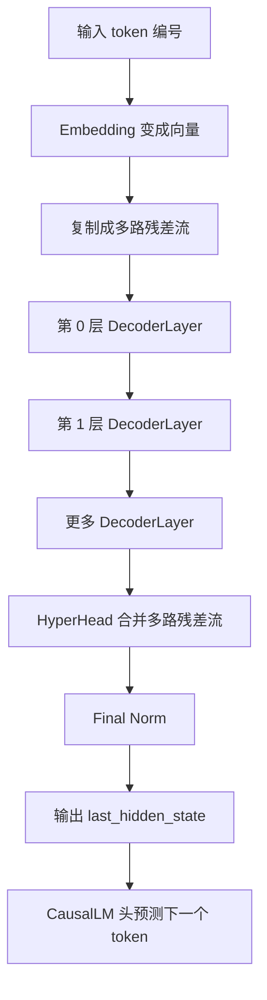
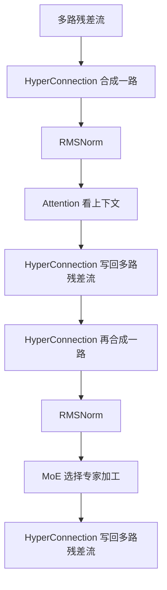
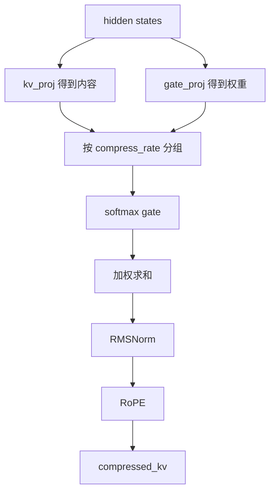
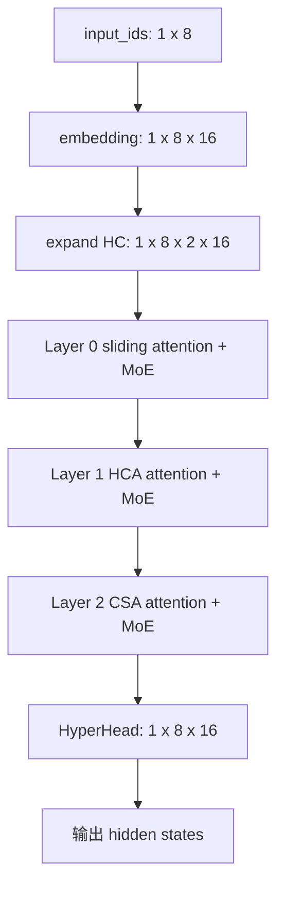

# DeepSeek V4 源码小白详解：`modular_deepseek_v4.py`

本文解读的是 [`modular_deepseek_v4.py`](../../repos/transformers/src/transformers/models/deepseek_v4/modular_deepseek_v4.py)。

它是 HuggingFace Transformers 中 DeepSeek V4 的模型结构定义文件。本文用“小白视角”解释：输入一句话之后，DeepSeek V4 如何一步步把 token 加工成用于预测下一个 token 的 hidden states。

---

## 1. 这份文件到底是什么

[`modular_deepseek_v4.py`](../../repos/transformers/src/transformers/models/deepseek_v4/modular_deepseek_v4.py) 不是训练脚本，也不是推理服务脚本，而是定义 DeepSeek V4 的核心网络结构。

它主要定义这些东西：

| 模块 | 作用 |
|---|---|
| [`DeepseekV4Model`](../../repos/transformers/src/transformers/models/deepseek_v4/modular_deepseek_v4.py) | 整个模型主体 |
| [`DeepseekV4DecoderLayer`](../../repos/transformers/src/transformers/models/deepseek_v4/modular_deepseek_v4.py) | 每一层 Transformer block |
| [`DeepseekV4Attention`](../../repos/transformers/src/transformers/models/deepseek_v4/modular_deepseek_v4.py) | 注意力模块，负责看上下文 |
| [`DeepseekV4HCACompressor`](../../repos/transformers/src/transformers/models/deepseek_v4/modular_deepseek_v4.py) | 高压缩注意力，把很多 token 压成摘要 |
| [`DeepseekV4CSACompressor`](../../repos/transformers/src/transformers/models/deepseek_v4/modular_deepseek_v4.py) | 压缩稀疏注意力，先压缩再挑重点摘要 |
| [`DeepseekV4Indexer`](../../repos/transformers/src/transformers/models/deepseek_v4/modular_deepseek_v4.py) | 为 CSA 选择 top-k 压缩摘要 |
| [`DeepseekV4SparseMoeBlock`](../../repos/transformers/src/transformers/models/deepseek_v4/modular_deepseek_v4.py) | MoE 专家模块 |
| [`DeepseekV4HyperConnection`](../../repos/transformers/src/transformers/models/deepseek_v4/modular_deepseek_v4.py) | 多路残差流的合并和写回 |
| [`apply_rotary_pos_emb()`](../../repos/transformers/src/transformers/models/deepseek_v4/modular_deepseek_v4.py) | RoPE 位置编码 |

一句话概括：

```text
这份文件描述了 DeepSeek V4 如何从 token 编号开始，经过 embedding、attention、压缩注意力、MoE、多层 decoder，最后输出 hidden states。
```

---

## 2. 先用生活比喻理解 DeepSeek V4

你可以把 DeepSeek V4 想成一个“文本加工工厂”。

输入一句话：

```text
我 喜欢 深度 学习
```

模型不会直接理解汉字。它会先把文字切成 token，再把 token 变成数字编号：

```text
[10, 25, 87, 66]
```

然后每个编号会变成一串小数，也就是向量：

```text
10 -> [0.1, -0.3, 0.8, ...]
25 -> [0.4,  0.2, 0.5, ...]
```

源码中的入口大致是：

```text
input_ids -> embed_tokens -> hidden_states
```

对应到源码：

- token 编号入口是 [`input_ids`](../../repos/transformers/src/transformers/models/deepseek_v4/modular_deepseek_v4.py)。
- 如果传入的是 token 编号，就通过 [`self.embed_tokens(input_ids)`](../../repos/transformers/src/transformers/models/deepseek_v4/modular_deepseek_v4.py) 变成向量。

---

## 3. 整体执行路线

DeepSeek V4 的整体路线可以简化为：



源码主入口是 [`DeepseekV4Model.forward()`](../../repos/transformers/src/transformers/models/deepseek_v4/modular_deepseek_v4.py)。它完成：

1. 检查输入。
2. 准备 cache。
3. token embedding。
4. 生成位置编号。
5. 生成 causal mask。
6. 把 hidden states 扩成多路残差流。
7. 预计算 RoPE。
8. 循环执行每一层 decoder。
9. 最后合并多路残差流并返回。

---

## 4. 用一个玩具例子贯穿全文

假设输入 8 个 token：

```text
[1, 2, 3, 4, 5, 6, 7, 8]
```

为了方便理解，假设参数很小：

| 参数 | 玩具值 | 含义 |
|---|---:|---|
| `batch` | 1 | 一次处理 1 句话 |
| `seq_len` | 8 | 这句话有 8 个 token |
| `hidden_size` | 16 | 每个 token 用 16 个数字表示 |
| `hc_mult` | 2 | 每个 token 保留 2 份残差草稿 |
| `num_experts` | 4 | 有 4 个专家 |
| `experts_per_token` | 2 | 每个 token 选 2 个专家 |

工作区里已有一个无依赖演示脚本 [`toy_flow_no_torch.py`](toy_flow_no_torch.py)，它不会真正跑大模型，只打印这个小例子的执行流程。

---

## 5. 第一步：token 编号变成向量

输入形状：

```text
input_ids.shape = [1, 8]
```

含义：1 句话，8 个 token。

经过 embedding 后：

```text
hidden_states.shape = [1, 8, 16]
```

含义：1 句话，8 个 token，每个 token 变成 16 个数字。

这一步可以理解成查表：

| token 编号 | 查表后向量 |
|---:|---|
| 1 | 一串 16 维数字 |
| 2 | 一串 16 维数字 |
| 3 | 一串 16 维数字 |
| ... | ... |

对应源码在 [`DeepseekV4Model.forward()`](../../repos/transformers/src/transformers/models/deepseek_v4/modular_deepseek_v4.py) 中调用 [`self.embed_tokens(input_ids)`](../../repos/transformers/src/transformers/models/deepseek_v4/modular_deepseek_v4.py)。

---

## 6. 第二步：变成多份“草稿”——Hyper-Connection

普通 Transformer 每个 token 通常只有一份 hidden state：

```text
[B, S, D]
```

DeepSeek V4 会把每个 token 的 hidden state 扩成多路 residual stream：

```text
[B, S, hc_mult, D]
```

玩具例子里：

```text
[1, 8, 16] -> [1, 8, 2, 16]
```

可以把它理解成：每个 token 同时带着 2 份草稿纸。

```text
token 1: 草稿 A + 草稿 B
token 2: 草稿 A + 草稿 B
...
```

源码里这一行完成扩展：

```text
inputs_embeds.unsqueeze(2).expand(-1, -1, self.config.hc_mult, -1).contiguous()
```

负责多路草稿如何合并、如何写回的是 [`DeepseekV4HyperConnection`](../../repos/transformers/src/transformers/models/deepseek_v4/modular_deepseek_v4.py)。最后把多路草稿合成一份的是 [`DeepseekV4HyperHead`](../../repos/transformers/src/transformers/models/deepseek_v4/modular_deepseek_v4.py)。

---

## 7. 每一层主要做两件事

每个 [`DeepseekV4DecoderLayer`](../../repos/transformers/src/transformers/models/deepseek_v4/modular_deepseek_v4.py) 大致做两件事：

```text
Attention：看上下文
MoE：找专家加工
```

一层内部可以理解为：



也就是说，一层的节奏是：

```text
多份草稿 -> 合成一份 -> Attention 修改 -> 写回多份草稿
多份草稿 -> 合成一份 -> MoE 修改       -> 写回多份草稿
```

---

## 8. Attention 在干什么

Attention 可以理解成：

```text
当前 token 应该参考前面哪些 token？参考多少？
```

比如句子：

```text
我 喜欢 深度 学习 因为 它 很 有趣
```

当模型处理“有趣”时，它可能要参考前面的“学习”“因为”“它”。Attention 就是在计算这种参考关系。

DeepSeek V4 的 attention 在 [`DeepseekV4Attention.forward()`](../../repos/transformers/src/transformers/models/deepseek_v4/modular_deepseek_v4.py)。

它内部主要做：

1. 生成 Query。
2. 生成 Key/Value。
3. 加 RoPE 位置信息。
4. 更新 KV cache。
5. 如果是压缩注意力层，拼接 compressed KV。
6. 做 attention 计算。
7. 对输出做反向 RoPE。
8. 做 grouped output projection。

---

## 9. Query、Key、Value 用小白话解释

Attention 里常见三个词：Query、Key、Value。

可以用“图书馆查资料”理解：

| 名字 | 比喻 | 含义 |
|---|---|---|
| Query | 我现在要查什么 | 当前 token 的需求 |
| Key | 每本书的标签 | 历史 token 的匹配标签 |
| Value | 书的正文内容 | 历史 token 真正提供的信息 |

源码中 Query 大致来自：

```text
q_a_proj -> q_a_norm -> q_b_proj -> q_b_norm -> RoPE
```

Key/Value 大致来自：

```text
kv_proj -> kv_norm -> RoPE
```

DeepSeek V4 的特殊点是：K 和 V 使用同一个 [`kv`](../../repos/transformers/src/transformers/models/deepseek_v4/modular_deepseek_v4.py)，所以 attention 调用时传入的是：

```text
q, kv, kv
```

也就是 Key 和 Value 是同一份 tensor。

---

## 10. RoPE 是什么

RoPE 是一种位置编码。

如果没有位置信息，模型只知道一句话里有哪些 token，但不知道顺序。

比如：

```text
狗 咬 人
人 咬 狗
```

两个句子 token 很像，但顺序不同，意思完全不同。

RoPE 的作用就是把“位置”注入到向量里。

源码中的 [`apply_rotary_pos_emb()`](../../repos/transformers/src/transformers/models/deepseek_v4/modular_deepseek_v4.py) 做的事可以理解为：

```text
把向量的一部分按照当前位置旋转一下。
位置不同，旋转角度不同。
```

它的关键步骤：

1. 把 [`cos`](../../repos/transformers/src/transformers/models/deepseek_v4/modular_deepseek_v4.py) 和 [`sin`](../../repos/transformers/src/transformers/models/deepseek_v4/modular_deepseek_v4.py) 扩到完整维度。
2. 把向量分成不旋转部分 [`nope`](../../repos/transformers/src/transformers/models/deepseek_v4/modular_deepseek_v4.py) 和旋转部分 [`rope`](../../repos/transformers/src/transformers/models/deepseek_v4/modular_deepseek_v4.py)。
3. 只旋转最后的 rope 部分。
4. 再拼回完整向量。

小白只需要记住：

```text
RoPE = 给 token 向量打上位置标记。
```

---

## 11. 为什么需要 KV cache

生成文本时，模型通常一个 token 一个 token 往后生成。

比如：

```text
输入：我 喜欢
生成：深度
再生成：学习
```

如果每生成一个新 token，都重新计算“我”“喜欢”的 Key/Value，会非常浪费。

所以模型会把过去算好的 KV 存起来，下次直接复用。这就是 KV cache。

DeepSeek V4 的普通 KV cache 在 attention 中更新：

```text
past_key_values.update(kv, kv, self.layer_idx)
```

DeepSeek V4 还有压缩注意力，所以除了普通 KV cache，还会缓存 compressed KV，也就是历史摘要。

---

## 12. 为什么需要压缩注意力

普通 attention 如果历史很长，会很贵。

可以把长上下文想成一本很厚的书。每次回答问题都逐字翻完整本书，非常慢。

更聪明的方式是：

```text
最近几页：逐字看
很久以前：看摘要
```

DeepSeek V4 的长上下文思路就是：

```text
近处 token：保留原文看
远处 token：先压缩成摘要再看
```

它有三类 attention layer：

| layer type | 小白理解 |
|---|---|
| `sliding_attention` | 只看最近窗口里的 token |
| `heavily_compressed_attention` | 看最近 token + 高压缩摘要 |
| `compressed_sparse_attention` | 看最近 token + 从压缩摘要中挑重点 |

源码中通过 [`COMPRESSOR_CLASSES`](../../repos/transformers/src/transformers/models/deepseek_v4/modular_deepseek_v4.py) 选择不同 compressor。

---

## 13. HCA：高压缩注意力

HCA 对应 [`DeepseekV4HCACompressor`](../../repos/transformers/src/transformers/models/deepseek_v4/modular_deepseek_v4.py)。

玩具例子：8 个 token，每 4 个 token 压成 1 个摘要。

```text
[1, 2, 3, 4] -> 摘要 A
[5, 6, 7, 8] -> 摘要 B
```

这样远处历史就不用看全部 token，而是看摘要。

HCA 的核心流程：



小白理解：

```text
每一组 token 中，模型自己判断谁更重要，然后按权重混合成一个摘要。
```

---

## 14. CSA：压缩稀疏注意力

CSA 对应 [`DeepseekV4CSACompressor`](../../repos/transformers/src/transformers/models/deepseek_v4/modular_deepseek_v4.py)。

它比 HCA 更细：

1. 先把历史 token 压缩成摘要。
2. 再让 indexer 给每个 query 挑最相关的 top-k 个摘要。

例子：8 个 token，每 2 个 token 压成一个摘要：

```text
[1, 2] -> 摘要 A
[3, 4] -> 摘要 B
[5, 6] -> 摘要 C
[7, 8] -> 摘要 D
```

当前 token 不一定需要看所有摘要，可能只需要看摘要 B 和 D。

[`DeepseekV4Indexer`](../../repos/transformers/src/transformers/models/deepseek_v4/modular_deepseek_v4.py) 会为每个 query 选择 top-k 摘要。

小白总结：

```text
HCA：压缩后基本都能看。
CSA：压缩后还要挑重点看。
```

---

## 15. MoE：每个 token 找专家加工

MoE 是 Mixture of Experts，也就是“混合专家”。

普通 MLP 是所有 token 都经过同一个网络。MoE 是有很多专家，每个 token 只选择其中几个专家。

可以想成有 4 个专家：

| 专家 | 擅长方向 |
|---|---|
| 专家 0 | 语法 |
| 专家 1 | 数学 |
| 专家 2 | 代码 |
| 专家 3 | 常识 |

某个 token 可能选择专家 1 和专家 2。

源码中 MoE block 是 [`DeepseekV4SparseMoeBlock`](../../repos/transformers/src/transformers/models/deepseek_v4/modular_deepseek_v4.py)。

它的输出是：

```text
被选中的 routed experts 输出 + shared expert 输出
```

也就是说，除了选中的专家，每个 token 还会经过一个共享专家。

DeepSeek V4 有两种 router：

| Router | 小白理解 |
|---|---|
| [`DeepseekV4TopKRouter`](../../repos/transformers/src/transformers/models/deepseek_v4/modular_deepseek_v4.py) | 根据模型分数动态选专家 |
| [`DeepseekV4HashRouter`](../../repos/transformers/src/transformers/models/deepseek_v4/modular_deepseek_v4.py) | 根据 token id 查表固定选专家 |

---

## 16. 一层完整执行例子

假设当前 hidden streams 形状是：

```text
[1, 8, 2, 16]
```

含义：

```text
1 句话，8 个 token，2 份草稿，每份 16 维
```

进入一层 decoder 后：

### 16.1 Attention 前：两份草稿合成一份

```text
[1, 8, 2, 16] -> [1, 8, 16]
```

小白理解：先把草稿 A 和草稿 B 综合成一份正式输入，交给 Attention。

### 16.2 Attention：看上下文

输入 `[1, 8, 16]`，输出还是 `[1, 8, 16]`。

内部会做：

```text
生成 Q
生成 KV
加 RoPE 位置
更新 KV cache
如果是 HCA/CSA 层，额外拼 compressed KV
做 attention
输出再反向 RoPE
做 grouped output projection
```

### 16.3 Attention 后：写回两份草稿

```text
[1, 8, 16] -> [1, 8, 2, 16]
```

小白理解：Attention 产生了一份修改建议，然后把这份建议按不同权重写回草稿 A 和草稿 B。

### 16.4 MoE 前：再次合成一份

```text
[1, 8, 2, 16] -> [1, 8, 16]
```

### 16.5 MoE：找专家加工

假设 8 个 token，每个 token 选 2 个专家：

```text
token 1 -> 专家 0 + 专家 2
token 2 -> 专家 1 + 专家 3
token 3 -> 专家 2 + 专家 3
...
```

MoE 输出 `[1, 8, 16]`。

### 16.6 MoE 后：再写回两份草稿

```text
[1, 8, 16] -> [1, 8, 2, 16]
```

这一层结束。

---

## 17. 三种 layer type 的区别

DeepSeek V4 每层不一定相同。每层的 attention 类型来自配置中的 layer types。

| 类型 | 做什么 |
|---|---|
| `sliding_attention` | 只看最近窗口内的 token |
| `heavily_compressed_attention` | 看最近 token 原文 + 远处高压缩摘要 |
| `compressed_sparse_attention` | 看最近 token 原文 + 远处 top-k 压缩摘要 |

源码里每层会读取自己的类型：

```text
self.layer_type = config.layer_types[layer_idx]
```

然后决定是否创建 compressor。

---

## 18. 完整玩具执行过程

用 8 个 token、3 层举例：

| 层 | 类型 | 会发生什么 |
|---:|---|---|
| 第 0 层 | `sliding_attention` | 只看近处 token，再做 MoE |
| 第 1 层 | `heavily_compressed_attention` | 看近处 token + 高压缩摘要，再做 MoE |
| 第 2 层 | `compressed_sparse_attention` | 看近处 token + top-k 摘要，再做 MoE |

全过程：



对应的无依赖演示脚本是 [`toy_flow_no_torch.py`](toy_flow_no_torch.py)。其中：

| 玩具函数 | 对应真实概念 |
|---|---|
| [`embedding()`](toy_flow_no_torch.py) | token embedding |
| [`expand_hc_streams()`](toy_flow_no_torch.py) | 扩成多路残差流 |
| [`mhc_collapse()`](toy_flow_no_torch.py) | HyperConnection 合并多路流 |
| [`attention()`](toy_flow_no_torch.py) | attention / HCA / CSA |
| [`moe()`](toy_flow_no_torch.py) | MoE 专家加工 |
| [`lm_head()`](toy_flow_no_torch.py) | 预测词表分数 |

---

## 19. 读源码建议顺序

如果你是初学者，不建议从第一行硬读到最后一行。建议按这个顺序：

| 顺序 | 先看什么 | 为什么 |
|---:|---|---|
| 1 | [`DeepseekV4Model.forward()`](../../repos/transformers/src/transformers/models/deepseek_v4/modular_deepseek_v4.py) | 整体入口 |
| 2 | [`DeepseekV4DecoderLayer.forward()`](../../repos/transformers/src/transformers/models/deepseek_v4/modular_deepseek_v4.py) | 看懂每层怎么执行 |
| 3 | [`DeepseekV4Attention.forward()`](../../repos/transformers/src/transformers/models/deepseek_v4/modular_deepseek_v4.py) | 看懂上下文怎么被读取 |
| 4 | [`DeepseekV4HCACompressor`](../../repos/transformers/src/transformers/models/deepseek_v4/modular_deepseek_v4.py) | 看懂高压缩摘要 |
| 5 | [`DeepseekV4CSACompressor`](../../repos/transformers/src/transformers/models/deepseek_v4/modular_deepseek_v4.py) | 看懂压缩稀疏注意力 |
| 6 | [`DeepseekV4Indexer`](../../repos/transformers/src/transformers/models/deepseek_v4/modular_deepseek_v4.py) | 看懂 CSA 怎么选 top-k 摘要 |
| 7 | [`DeepseekV4SparseMoeBlock`](../../repos/transformers/src/transformers/models/deepseek_v4/modular_deepseek_v4.py) | 看懂专家层 |
| 8 | [`DeepseekV4HyperConnection`](../../repos/transformers/src/transformers/models/deepseek_v4/modular_deepseek_v4.py) | 看懂多路残差流 |

---

## 20. 从执行和性能角度看热点

如果你后续关心 PyTorch/MUSA 适配或推理性能，重点关注这些操作：

| 热点 | 为什么重要 |
|---|---|
| Attention matmul / softmax | 模型最核心计算之一 |
| [`apply_rotary_pos_emb()`](../../repos/transformers/src/transformers/models/deepseek_v4/modular_deepseek_v4.py) | Q、KV、compressed KV、输出都会频繁调用 |
| compressor 的 softmax + 加权求和 | HCA/CSA 压缩摘要的核心 |
| CSA indexer 的 top-k | 长上下文下挑摘要的重要开销 |
| MoE expert dispatch | 涉及 gather、scatter、index_add、专家矩阵乘 |
| HyperConnection | 有 sigmoid、softmax、Sinkhorn、小矩阵乘等特殊操作 |

DeepSeek V4 在源码里显式禁用了部分高性能 attention 后端，例如 FlashAttention、SDPA、FlexAttention，原因包括 head dim 太大、per-head sink、compressed KV 动态拼接等限制。

---

## 21. 最终大白话总结

DeepSeek V4 的执行过程可以记成：

```text
输入 token 编号
  -> 查 embedding 表，变成向量
  -> 每个 token 复制成多份残差草稿
  -> 每层先把多份草稿合成一份
  -> Attention 看上下文
       近处看原文
       远处看压缩摘要
       CSA 层还会挑最相关的摘要
  -> Attention 结果写回多份草稿
  -> 再把多份草稿合成一份
  -> MoE 选择专家加工 token
  -> MoE 结果写回多份草稿
  -> 重复很多层
  -> 最后 HyperHead 把多份草稿合成一份
  -> 输出 hidden states
  -> CausalLM 头把 hidden states 变成下一个 token 的概率
```

最重要的四个关键词：

| 关键词 | 一句话解释 |
|---|---|
| Hyper-Connection | 每个 token 有多份残差草稿，层内动态合并和写回 |
| Compressed Attention | 近处看原文，远处看摘要 |
| CSA Indexer | 从压缩摘要中挑 top-k 个重点看 |
| MoE | 每个 token 只找少数专家处理，再加 shared expert |

所以，DeepSeek V4 不是普通 Transformer 的简单变体。它的核心特色是：

```text
多路残差流 + 压缩长上下文注意力 + MoE 专家路由 + 共享 KV attention
```
