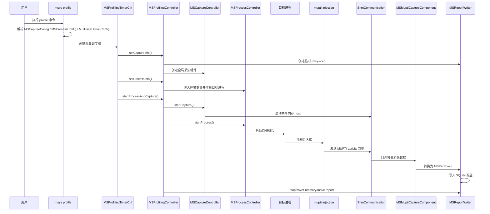
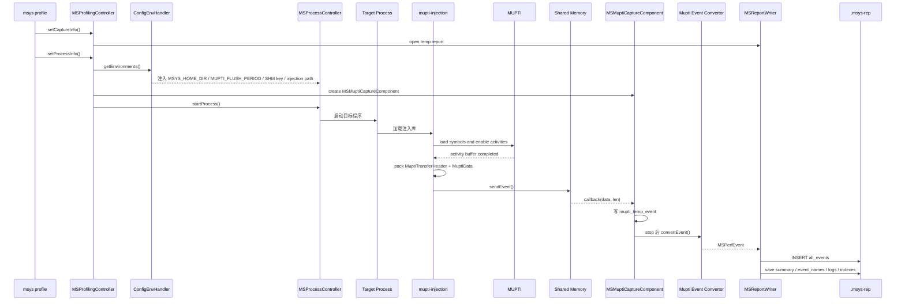

# MSight System 技术洞察

分析对象：`/home/shanfeng/workspace/msight-system`

代码版本：`develop`，提交 `1e5e47a1`

分析方式：基于远程仓库源码静态阅读；本次未修改远程仓库，未执行完整构建。

## 核心结论

MSight System 是 Moore Threads 的系统级性能分析工具。仓库不是单一 profiler，而是一套完整工具链，包含命令行、GUI、采集控制、目标进程注入、共享内存传输、报告写入、报告回放、统计报表和专家规则。

主链路如下：

```text
msys profile / GUI
  -> controller 创建采集任务和目标进程
  -> capture_components 启动全局采集和进程级采集
  -> 目标进程通过注入库采集 MUPTI、OSRT、MTTX、OpenGL、Vulkan 等事件
  -> 注入库通过共享内存把事件发送给 msys
  -> capture component 转换为 MSPerfEvent
  -> MSReportWriter 写入 .msys-rep
  -> msys stats / msys analyze / GUI 读取 .msys-rep 做二次分析
```

对 MUSA 性能分析来说，关键路径是 `mupti-injection`。它进入目标进程，动态加载 MUPTI，打开 kernel、memcpy、memset、driver API、runtime API、synchronization、memory transfer 等 activity，再把采集结果通过共享内存发回主进程。报告中保留了 API 名称、kernel 名称、时间戳、PID/TID、device/context/stream、correlation id、graph id、DDK job ref/submission id 等字段。

这套实现适合做 profiling 数据采集和热点分析。如果要做 MUSA driver/API 白盒性能建模，MSight System 可以复用采集框架、MUPTI 数据协议和 `.msys-rep` 分析能力，但仍需要在 `musa` 和 `MUSA-Runtime` 内部增加阶段级埋点。MSight 当前主要看到 MUPTI activity 层，不等价于 driver 内部每一层软件路径的白盒模型。

## 仓库模块

| 路径 | 职责 |
| --- | --- |
| `README.md` | 仓库说明。说明该项目是 Moore Threads profiling tool suite，默认通过 `python build.py` 构建。 |
| `build.py` | 跨平台构建入口。负责寻找 Qt，生成 CMake 参数，支持 Linux/Windows、本地/CI、coverage、asan、install、vdi-only、external/internal。 |
| `CMakeLists.txt` | 顶层构建入口。定义 `MSIGHT_ENABLE_GUI`、`MSIGHT_INTERNAL`、`MSIGHT_ENABLE_INSTALL`、`MSIGHT_ENABLE_TEST` 等开关，配置输出目录和依赖。 |
| `msys_cli/` | 命令行工具 `msys`。包含 `profile`、`launch`、`start`、`stop`、`cancel`、`sessions list`、`export`、`stats`、`analyze` 等命令。 |
| `msys_gui/` | Qt GUI 工具 `msys-ui`。依赖 `controller_replay`、`statistics`、`expert`，用于打开和分析 `.msys-rep`。 |
| `sub_module/controller/` | 核心控制层。负责采集任务生命周期、目标进程启动、环境变量注入、报告写入、报告读取和时间范围回放。 |
| `sub_module/capture_components/` | 采集组件层。按采集来源拆分为 MUPTI、MTML、KMD、UMD、firmware/hardware、OSRT、OpenGL、Vulkan、MTTX、VAAPI、callstack、static info 等组件。 |
| `sub_module/injection/` | MUPTI 注入库。构建 `mupti-injection`，内部动态加载 MUPTI 并把 activity 数据发送给主进程。 |
| `sub_module/osrt_injection/` | OS runtime 注入库。用于采集系统调用、同步、阻塞等 OS runtime 信息。 |
| `sub_module/mttx_injection/` | MTTX 注入库。内部版本启用，用于采集用户标注和 M3D 相关 trace。 |
| `sub_module/va_injection/` | VAAPI 注入库。内部版本启用。 |
| `sub_module/mpi_injection/` | MPI 注入库。内部版本启用，支持 OpenMPI/MPICH。 |
| `sub_module/statistics/` | 统计报表。实现 MUSA API 摘要、kernel 摘要、显存拷贝统计、GPU 汇总等报表。 |
| `sub_module/expert/` | 专家规则。实现同步 API、同步 memcpy/memset、异步 memcpy、GPU gaps、GPU time utilization 等规则。 |
| `sub_module/cmd_tcp/` | daemon/manual capture 场景的 TCP 控制通道。 |
| `sub_module/hotkey/` | 热键控制 capture range。 |
| `sub_module/capture_range/` | capture range 的共享状态和控制逻辑。 |
| `protos/` | protobuf 定义，主要有 `event_type.proto` 和 `target_profile.proto`。 |
| `installer/` | 安装包生成。 |
| `benchmark/` | benchmark 构建入口。 |
| `test/` | 单元测试和集成测试入口。 |
| `utils/` | 平台工具、配置结构、通用定义、进程环境、文件锁、指标集等公共代码。 |

## 构建架构

顶层 `CMakeLists.txt` 默认配置：

| 开关 | 默认值 | 作用 |
| --- | --- | --- |
| `MSIGHT_ENABLE_GUI` | `ON` | 构建 Qt GUI。 |
| `MSIGHT_ENABLE_VDI_ONLY` | `OFF` | Linux 下可裁剪为 VDI-only。 |
| `MSIGHT_INTERNAL` | `ON` | 启用内部功能，如 MTTX、MPI、callstack、数据回传等。 |
| `MSIGHT_ENABLE_INSTALL` | `OFF` | 生成安装包。 |
| `MSIGHT_ENABLE_TEST` | `OFF` | 构建测试。 |
| `MSIGHT_ENABLE_COV` | `OFF` | coverage 构建。 |
| `MSIGHT_ENABLE_ASAN_CHECK` | `OFF` | ASAN 检查构建。 |
| `MSIGHT_BUILD_BENCHMARK` | `OFF` | 构建 benchmark。 |

输出目录统一设置为：

```text
target/<CMAKE_BUILD_TYPE>/
```

`build.py` 的本地 Linux 构建流程：

```text
python build.py
  -> 查找 Qt 目录
  -> cmake -S . -B build
       -DCMAKE_PREFIX_PATH=<qt>
       -DCMAKE_BUILD_TYPE=<Release|Debug>
       -DMSIGHT_INTERNAL=<ON|OFF>
       -DMSIGHT_ENABLE_GUI=<ON|OFF>
       -DMSIGHT_ENABLE_TEST=<ON|OFF>
       -DMSIGHT_ENABLE_INSTALL=<ON|OFF>
  -> cmake --build build -j10
```

主要构建产物：

| 产物 | 类型 | 来源 |
| --- | --- | --- |
| `msys` | CLI 可执行文件 | `msys_cli/CMakeLists.txt` |
| `msys-ui` | GUI 可执行文件 | `msys_gui/CMakeLists.txt` |
| `msys-ui_static` | GUI 静态库 | `msys_gui/CMakeLists.txt` |
| `controller` | 静态库 | `sub_module/controller/CMakeLists.txt` |
| `controller_replay` | 静态库 | `sub_module/controller/CMakeLists.txt` |
| `capture_components` | 静态库 | `sub_module/capture_components/CMakeLists.txt` |
| `mupti-injection` | 共享库 | `sub_module/injection/CMakeLists.txt` |
| `mupti-kuae-injection` | 共享库，内部 x86_64 构建 | `sub_module/injection/CMakeLists.txt` |
| `osrt-injection` | 共享库 | `sub_module/osrt_injection/` |
| `mttxInjection` | 共享库，内部构建 | `sub_module/mttx_injection/` |
| `va-injection` | 共享库，内部构建 | `sub_module/va_injection/` |
| `openmpi-injection` / `mpich-injection` | 共享库，内部构建 | `sub_module/mpi_injection/` |
| `statistics` | 静态库 | `sub_module/statistics/` |
| `expert` | 静态库 | `sub_module/expert/` |
| `protos_event_type` / `protos_target_profile` | protobuf object library | `protos/CMakeLists.txt` |

## 命令行入口

入口文件：`msys_cli/main.cpp`

`main.cpp` 初始化 crash handler 和日志后注册命令处理器：

```text
MSCmdStatsHandler
MSCmdExpertHandler
MSCmdProfileHandler
MSCmdVersionHandler
MSCmdExportHandler
MSCmdDaemonHandler
MSCmdLaunchHandler
MSCmdStartHandler
MSCmdStopHandler
MSCmdCancelHandler
MSCmdSessionsListHandler
```

命令分发由 `MSCmdManager::dealCmd` 完成。它把命令行拆成 option 和 positional argument，然后按 `cmdName()` 查找具体 handler。

### `profile`

核心文件：`msys_cli/ms_cmd_profile_handler.cpp`

`profile` 是完整采集入口，负责解析用户参数并构造三类配置：

| 配置 | 作用 |
| --- | --- |
| `MSCaptureConfig` | 控制全局采集项，如 device、GPU metrics、KMD/UMD/firmware/ftrace/callstack/static info。 |
| `MSProcessConfig` | 目标进程路径、参数、工作目录、环境变量。 |
| `MSTraceOptionConfig` | 进程级 trace 选项，如 MUSA、OSRT、OpenGL、Vulkan、MTTX、MPI、capture range。 |

常见参数包括：

```text
duration
output
device
delay
env-var
hotkey-capture
gpu-metrics-set
musa-graph-trace
capture-range
capture-range-end
trace
```

Linux 内部版本还包含：

```text
ftrace
config
mttx-domain-include
mttx-domain-exclude
mpi-impl
mttx-capture
backtrace
```

### `launch/start/stop/cancel`

这些命令用于 manual capture 或 daemon 场景。代码分布在：

```text
msys_cli/ms_cmd_launch_handler.cpp
msys_cli/ms_cmd_start_handler.cpp
msys_cli/ms_cmd_stop_handler.cpp
msys_cli/ms_cmd_cancel_handler.cpp
msys_cli/ms_cmd_daemon_handler.cpp
msys_cli/ms_cmd_manual_ctrl_handler.cpp
```

它们与 `cmd_tcp`、`MSProfilingTimerCtrl` 和 `MSProfilingController` 配合，实现进程启动后再手动开始、停止或取消采集。

## Profile 执行流程

核心文件：

```text
msys_cli/ms_profiling_timer_ctrl.cpp
sub_module/controller/ms_profiling_controller.cpp
sub_module/controller/ms_capture_controller.cpp
sub_module/controller/ms_process_controller.cpp
sub_module/controller/ms_report_writer.cpp
```

整体时序：



### 采集调度

`MSProfilingTimerCtrl` 支持几种启动方式：

| 模式 | 执行方式 |
| --- | --- |
| 立即采集 | `startProcessAndCapture()`，先启动采集再启动目标进程。 |
| 延迟采集 | 先启动进程，再用 timer 到点启动采集。 |
| 限时采集 | 用 timer 到点停止采集。 |
| 手动采集 | 先启动进程，后续通过 start/stop 控制采集。 |
| hotkey capture | 目标进程运行后，通过热键开始或停止。 |
| capture range | 通过共享内存或 MTTX/MUSA profiler API 控制采集区间。 |

### Controller 生命周期

`MSProfilingController::Impl` 维护四个核心对象：

| 成员 | 作用 |
| --- | --- |
| `MSCaptureController capture_ctrl` | 管理采集组件。 |
| `MSProcessController process_ctrl` | 管理目标进程。 |
| `MSReportWriter report_writer` | 写 `.msys-rep`。 |
| `MSProfilingContext context` | 共享采集上下文，包含配置、共享内存 host、临时目录、PID、trace 配置。 |

关键函数：

| 函数 | 行为 |
| --- | --- |
| `setCaptureInfo()` | 检查报告路径和 device，创建临时目录，初始化 report writer，创建 capture controller。 |
| `setProcessInfo()` | 检查目标程序和工作目录，检查 MUSA 环境，注入环境变量，创建 process controller。 |
| `startCapture()` | 启动 capture controller，再启动 report writer 线程。 |
| `startProcess()` | 追加进程级 trace component，然后启动目标进程。 |
| `startProcessAndCapture()` | 先 `startCapture()`，再 `startProcess()`；进程启动失败时取消采集。 |
| `captureStateChanged()` | 采集结束后停止 writer，并补充 PID/进程名信息。 |
| `fileHandleFinished()` | 写 summary，生成 heat map，移动临时报告到最终路径。 |

## 目标进程环境注入

核心代码：`ConfigEnvHandler::getEnvironments()`，位于 `sub_module/controller/ms_profiling_controller.cpp`。

Linux 下会根据 trace 配置修改目标进程环境变量：

| trace 配置 | 注入行为 |
| --- | --- |
| `cfg.musa` | 选择 `mupti-injection` 或 `mupti-kuae-injection`，设置 MUPTI 和 MSight 相关环境变量，并通过 `MusaVersionHelper::addMusaLibToEnv()` 调整 MUSA 库路径。 |
| `cfg.osrt` | 把 `osrt-injection` 加入 `LD_PRELOAD`，设置 OSRT threshold。 |
| `cfg.ogl` | 把 OpenGL apitrace 相关库加入 `LD_PRELOAD`，生成临时 trace 文件。 |
| `cfg.vk` | 设置 Vulkan layer 环境变量。 |
| `cfg.mttx` | 设置 MTTX 注入库路径、MTTX enable、domain filter、M3D profiler 配置。 |
| `cfg.vaapi` | 把 `va-injection` 加入 `LD_PRELOAD`。 |
| `cfg.mpi` | 根据 OpenMPI/MPICH 选择 MPI 注入库。 |
| `capture_range` | 设置 capture range 的共享内存 key 或 MTTX capture 条件。 |

MUSA/MUPTI 相关环境变量：

```text
MSYS_HOME_DIR
INJECTION_LOG_DIR
MUPTI_FLUSH_PERIOD
MUPTI_GRAPH_MODE
<msight shm config key env>
```

这一步是 MUPTI 采集能够进入目标进程的关键。`msys` 主进程负责准备共享内存 key 和注入库路径，目标进程启动后注入库再连接共享内存。

## Capture Components

核心接口：`sub_module/capture_components/ms_capture_component.h`

每个采集组件都实现统一接口：

```text
type()
description()
start()
triggerStop()
quit()
initialize(context)
```

组件通过三类回调把数据交给 controller：

| 回调 | 数据类型 |
| --- | --- |
| `connectMultiCapture()` | 一批 `MSCaptureData`。 |
| `connectSingleCapture()` | 单个 `MSCaptureData`。 |
| `connectPerfEventsCapture()` | 一批已经转换好的 `MSPerfEvent`。 |

Linux 组件创建逻辑位于 `sub_module/capture_components/linux/ms_capture_component_factory.cpp`。

### 全局采集组件

全局组件来自 `MSCaptureConfig`：

| 组件 | 触发条件 | 作用 |
| --- | --- | --- |
| `MSMtmlCaptureComponent` | 始终按 device 分组创建 | 采集 MTML 指标或静态设备信息。 |
| `MSUmdCaptureComponent` | `config.umd` | 采集 UMD 事件。 |
| `MSHardwareCaptureComponent` | `config.firmware` | 采集 firmware/hardware 事件。 |
| `MSKmdCaptureComponent` | `config.kmd` | 采集 KMD 事件。 |
| `MSFtraceCaptureComponent` | 内部版本 `config.ftrace` | 采集 ftrace。 |
| `MSCallStackCaptureComponent` | `MSIGHT_ENABLE_LINUX_CALL_STACK` 且启用 callstack | 采集 callstack。 |
| `MSStaticCaptureComponent` | `config.cap_static` | 采集 CPU/GPU 静态信息。 |

### 进程级采集组件

进程级组件来自 `MSTraceOptionConfig`：

| 组件 | 触发条件 | 作用 |
| --- | --- | --- |
| `MSMuptiCaptureComponent` | `config.musa` | 接收 MUPTI 注入库发来的 MUSA 活动数据。 |
| `MSMttxCaptureComponent` | 内部版本 `config.mttx` | 接收 MTTX trace。 |
| `MSVaApiCaptureComponent` | 内部版本 `config.vaapi` | 接收 VAAPI trace。 |
| `MSOglCaptureComponent` | `config.ogl` | 接收 OpenGL trace。 |
| `MSOsrtCaptureComponent` | `config.osrt` | 接收 OS runtime trace。 |
| `MSVkCaptureComponent` | `config.vk` | 接收 Vulkan trace。 |

`MSCaptureController::appendTrace()` 会在目标进程启动前或采集开始后创建进程级组件，并启动共享内存 host。

## MUPTI 注入链路

MUPTI 链路由两部分组成：

```text
目标进程内：mupti-injection.so
主进程内：MSMuptiCaptureComponent
```

### 注入库构建

核心文件：`sub_module/injection/CMakeLists.txt`

构建目标：

```text
mupti-injection
mupti-kuae-injection    # x86_64 + internal
```

`mupti-injection` 链接：

```text
mupti-injector
capture_range
dl
pthread
rt
shm
log
```

### 注入库初始化

入口文件：`sub_module/injection/mupti_injection.cpp`

```text
INJECT_MUPTI(mupti_injection::MsysInjectionHandler)
```

生命周期：

| 函数 | 行为 |
| --- | --- |
| `MsysInjectionHandler::onLogInit()` | 从 `INJECTION_LOG_DIR` 读取日志目录，为目标进程创建注入日志。 |
| `MsysInjectionHandler::onInit()` | 创建 `GlobalData`，执行 `injectMUpti(version)`。 |
| `MsysInjectionHandler::onDeinit()` | 停止周期 flush。 |

### 动态加载 MUPTI

核心文件：`sub_module/injection/mupti_api.cpp`

`MUptiApi::init()` 从 `MSYS_HOME_DIR` 定位 MUPTI 库并加载符号。主要符号包括：

```text
muptiGetResultString
muptiGetTimestamp
muptiActivityRegisterCallbacks
muptiActivityEnable
muptiActivityDisable
muptiActivityFlushAll
muptiActivityGetNextRecord
muptiActivityGetNumDroppedRecords
muptiSubscribe
muptiUnsubscribe
muptiEnableCallback
muptiEnableDomain
muptiGetCallbackName
muptiGetKickFromCorrelationId
muptiGetSubmissionIdsFromCorrelationId
muptiGraphGetKickFromCorrelationId
muptiGraphGetSubmissionIdsFromCorrelationId
```

代码根据 MUPTI 版本区分 `0.7.3` 前后的 relation API。

### 打开 MUPTI Activity

核心文件：`sub_module/injection/mupti_injection_global_data.cpp`

`GlobalData::injectMUpti()` 的关键步骤：

```text
1. mupti_.init(version)
2. 读取 MUPTI_FLUSH_PERIOD
3. 注册 activity buffer callback
4. 读取 MUPTI_GRAPH_MODE
5. 读取 visible devices
6. 如果启用 capture range，注册 profiler start/stop callback
7. enableActivities()
8. startPeriodFlush()
```

`enableActivities()` 打开的 activity：

| Activity | 采集内容 |
| --- | --- |
| `MUPTI_ACTIVITY_KIND_MEMCPY` | MUSA memcpy。 |
| `MUPTI_ACTIVITY_KIND_MEMSET` | MUSA memset。 |
| `MUPTI_ACTIVITY_KIND_KERNEL` | kernel 执行。 |
| `MUPTI_ACTIVITY_KIND_CONCURRENT_KERNEL` | 并发 kernel 执行。 |
| `MUPTI_ACTIVITY_KIND_GRAPH_TRACE` | graph trace。 |
| `MUPTI_ACTIVITY_KIND_DRIVER` | driver API。 |
| `MUPTI_ACTIVITY_KIND_RUNTIME` | runtime API。 |
| `MUPTI_ACTIVITY_KIND_SYNCHRONIZATION` | stream/context/event synchronization。 |
| `MUPTI_ACTIVITY_KIND_MEMORY_ATOMIC` | CE atomic。 |
| `MUPTI_ACTIVITY_KIND_MEMORY_ATOMIC_VALUE` | CE atomic value。 |
| `MUPTI_ACTIVITY_KIND_MEMORY_TRANSFER` | memory transfer，Kuae 构建除外。 |

同时打开：

```text
muptiActivityEnableLatencyTimestamps(true)
```

### Activity buffer 回调

MUPTI 回调链路：

```text
MUPTI runtime
  -> bufferRequested()
  -> MUPTI 写 activity record
  -> bufferCompleted()
  -> muptiActivityGetNextRecord()
  -> printActivity()
  -> GlobalData::sendEvent()
  -> 共享内存
```

`bufferRequested()` 分配 32KB 对齐 buffer。

`bufferCompleted()` 遍历 MUPTI record：

```text
while muptiActivityGetNextRecord(...) == MUPTI_SUCCESS:
    printActivity(record)

muptiActivityGetNumDroppedRecords(...)
free(buffer)
```

`printActivity()` 根据 `record->kind` 把 MUPTI 原始结构转换为 MSight 自定义结构，再通过共享内存发送。

### MUPTI 数据协议

协议定义：`sub_module/injection/mupti_data_def.h`

每条数据由两部分组成：

```text
MuptiTransferHeader
MuptiXXXData
```

`MuptiTransferHeader`：

```text
magic = 0xfaf345b
type
len
```

支持的数据类型：

| `MuptiDataType` | 数据结构 | 典型字段 |
| --- | --- | --- |
| `KERNEL` | `MuptiKernelData` | kernel name、start/end、pid、correlation id、grid/block、device/context/stream、grid id、queued、submitted、graph id、shared memory、local memory、DDK job ref。 |
| `MEMCPY` | `MuptiMemcpyData` | name、start/end、bytes、src/dst memory kind、device/context/stream、graph id、DDK submission ids。 |
| `MEMSET` | `MuptiMemsetData` | value、bytes、memory kind、device/context/stream、DDK submission ids。 |
| `GRAPH` | `MuptiGraphData` | graph id、device/context/stream。 |
| `DRIVER` | `MuptiApiData` | API name、start/end、process id、thread id、return value、correlation id。 |
| `RUNTIME` | `MuptiApiData` | API name、start/end、process id、thread id、return value、correlation id。 |
| `SYNCHRONIZE` | `MuptiSyncData` | sync type、context id、stream id、event id。 |
| `MEM_ATOMIC` | `MuptiMemoryAtomicData` | atomic kind、src/dst memory kind、element count、DDK submission ids。 |
| `MEM_ATOMIC_VALUE` | `MuptiMemoryAtomicValueData` | value、atomic value kind、dst memory kind、DDK submission ids。 |
| `MEM_TRANSFER` | `MuptiMemoryTransferData` | bytes、device/context/stream、graph id、DDK job ref/submission ids。 |

这组字段对后续性能建模有价值，因为它同时覆盖：

```text
CPU API 时间
GPU kernel/memcpy/memset 时间
stream/context/device 归属
API 与 GPU activity 的 correlation id
Graph node 信息
DDK job/submission 关联信息
```

### 主进程接收 MUPTI 数据

核心文件：`sub_module/capture_components/linux/ms_mupti_capture_component.cpp`

`MSMuptiCaptureComponent` 继承 `MSShmCaptureComponent`，通过共享内存接收注入库数据。

执行流程：

```text
initialize(context)
  -> 设置 SHM dispatch strategy
  -> 创建临时文件 mupti_temp_event

start()
  -> 注册 SHM callback

processMuptiData(data, len)
  -> 原始字节写入 mupti_temp_event

triggerStop()
  -> 注销 SHM callback
  -> 启动 convertEvent 线程

convertEvent()
  -> 读取 MuptiTransferHeader
  -> 按 type 读取 MuptiXXXData
  -> 调用 convertor_ 转换为 MSPerfEvent
  -> capture_perf_events_ 发送给 MSReportWriter
  -> 删除临时文件
  -> 发出 finish 信号
```

这里采用临时文件中转，而不是收到共享内存消息后立即转换。好处是采集阶段减少转换开销；代价是停止采集后需要额外的转换阶段。

## 报告写入

核心文件：`sub_module/controller/ms_report_writer.cpp`

`.msys-rep` 本质是 SQLite 数据库。`MSReportWriter::open()` 创建的主要表：

| 表 | 内容 |
| --- | --- |
| `all_events` | 所有 timeline event。 |
| `cpu_info` | CPU 静态信息。 |
| `gpu_info` | GPU 静态信息。 |
| `callstack` | callstack 数据。 |
| `pid_map` | host pid 到 container pid 映射。 |
| `proc_name` | pid 到进程名映射。 |
| `mttx_setup` | MTTX setup 数据。 |
| `total_statistics` | 全局统计信息。 |
| `process_info` | 目标进程信息。 |
| `target_info` | 机器、OS、driver、MUSA 版本等信息。 |
| `event_names` | event name 到 name id 的映射。 |
| `event_version` | event category 的版本信息。 |
| `msys_log_*` | msys 日志内容。 |
| `stdout_log_*` | 目标进程 stdout。 |
| `stderr_log_*` | 目标进程 stderr。 |

写入线程模型：

```text
capture component
  -> addData() / addPerfEvents()
  -> cap_data_queue / event_queue
  -> convertDataThread()
  -> writeEventThread()
  -> SQLite transaction
```

关键实现点：

| 实现 | 说明 |
| --- | --- |
| `cap_data_queue` | 保存还需要转换的 `MSCaptureData`。 |
| `event_queue` | 保存已经是 `MSPerfEvent` 的事件。 |
| `kCommitLimit = 100000` | 每写入 100000 条 event 提交一次事务，并释放临时 event data。 |
| `event_names` | event name 不直接重复写入 `all_events`，而是写 name id，降低重复字符串开销。 |
| `createSearchIndex()` | 对 start、end、gpu_id/type 创建索引，提升 GUI 和 stats 查询性能。 |
| `saveSummary()` | 采集结束后写入版本、平台、进程、机器、event 起止时间、event 数量、日志等信息。 |

`all_events` 的核心字段来自 `MSEventField`，写入时包含：

```text
name_id
gpu_id
type
sub_type
start
end
pid
tid
start_data
end_data
render_id
```

## 报告读取和回放

核心文件：`sub_module/controller/ms_report.cpp`

`MSReport` 打开 `.msys-rep` 后，读取 summary、event version、event name、PID 映射、CPU/GPU 信息等元数据。

`MSTimeRangeReport` 用于按时间范围回放事件：

```text
MSReport::createTimeRangeReport(time_range)
  -> MSTimeRangeReport::open()
  -> 查询 all_events 中 start 落在时间范围内的记录
  -> 加载 start_data/end_data
  -> 构建 MSEventCache
  -> stats / expert / GUI 从 cache 中读取事件
```

`stats`、`analyze` 和 GUI 都复用这条报告读取路径。

## Statistics

核心目录：`sub_module/statistics/`

入口工厂：`sub_module/statistics/ms_stats_factory.cpp`

支持的报表：

```text
musa_api_sum
musa_api_trace
musa_gpu_kern_sum
musa_gpu_kern_gb_sum
musa_gpu_mem_size_sum
musa_gpu_mem_time_sum
musa_gpu_sum
musa_kern_exec_sum
musa_api_gpu_sum
gpu_engine_time_sum      # internal
opengl_umd_sum           # internal
opengl_api_sum
```

命令行入口：`msys_cli/ms_cmd_stats_handler.cpp`

执行流程：

```text
msys stats <report.msys-rep>
  -> 打开 MSReport
  -> 创建 MSTimeRangeReport
  -> 按 -r/--report 选择 MSStatsInterface 实现
  -> addEventByTimeRangeReport()
  -> table/csv/json 格式化输出
```

以 `musa_api_sum` 为例：

```text
读取 ComputeRuntimeApi 事件
合并 ComputeDriverApi 事件
按 API name 分组
计算 num_calls、total_time、avg、median、min、max、stddev、time percent
按 total_time 降序输出
```

这类统计适合回答：

```text
哪些 MUSA runtime API 最耗 CPU 时间
哪些 driver API 累计耗时最高
API 调用次数是否异常
API 延迟是否存在长尾
```

## Expert Rules

核心目录：`sub_module/expert/`

入口工厂：`sub_module/expert/ms_expert_factory.cpp`

支持规则：

```text
musa_memcpy_async
musa_memcpy_sync
musa_memset_sync
musa_api_sync
musa_gpu_gaps
musa_gpu_time_util
```

命令行入口：`msys_cli/ms_cmd_expert_handler.cpp`

执行流程：

```text
msys analyze <report.msys-rep>
  -> 打开 MSReport
  -> 创建 MSTimeRangeReport
  -> 按 -r/--rule 选择 MSExpertInterface 实现
  -> 解析 rows/start/end/process/thread/gap 等参数
  -> addEventByTimeRangeReport()
  -> table/csv/json 格式化输出
```

两个典型规则：

### `musa_api_sync`

源码：`sub_module/expert/ms_expert_musa_api_sync.cpp`

逻辑：

```text
读取 ComputeRuntimeApi 事件
筛选 musaDeviceSynchronize 和 musaStreamSynchronize
按 start/end/process/thread 参数过滤
输出 duration、start、pid、tid、API name
```

用途：

```text
发现主机端同步阻塞
定位频繁 stream/device synchronize
辅助解释 GPU 空洞或 CPU 等待
```

### `musa_gpu_gaps`

源码：`sub_module/expert/ms_expert_musa_gpu_gaps.cpp`

逻辑：

```text
读取 ComputeHW 事件
按 device_id + pid 分组
记录上一条 GPU 事件结束时间
如果下一条事件 start - 上一条 end 大于 gap 阈值，则输出 GPU gap
默认 gap 阈值为 500ms
```

用途：

```text
发现 GPU 空闲窗口
结合 CPU API、OSRT、MTTX 分析空闲原因
```

## GUI

核心目录：`msys_gui/`

`msys_gui/CMakeLists.txt` 构建两个目标：

```text
msys-ui_static
msys-ui
```

GUI 依赖：

```text
Qt Widgets / Concurrent / Network / OpenGLWidgets
controller_replay
statistics
expert
cmd_tcp_client
ssh-client
qt_imgui_widgets
implot
```

GUI 的关键点是复用 `controller_replay` 打开 `.msys-rep`，再通过 timeline、event listing、stats view、expert view 展示数据。它不重新定义采集数据格式，而是消费 `MSReportWriter` 写入的 SQLite 报告。

## 完整 MUSA Profiling 数据流



## 对性能建模的价值

MSight System 对 MUSA driver/API 性能建模的价值主要在三处：

### 1. 提供真实 workload 的事件采集能力

它能在真实模型运行时采集：

```text
runtime API 时间
driver API 时间
kernel 时间
memcpy/memset 时间
synchronization 时间
stream/context/device 归属
graph node 归属
correlation id
DDK job/submission 关联
```

这些字段可以作为模型校验数据，回答：

```text
真实模型中哪些 API 累计耗时最高
API 与 kernel/memcpy 是否能按 correlation id 对齐
GPU 空洞前后发生了哪些 CPU API 或同步 API
同一个 stream 上的提交和执行是否连续
```

### 2. 提供报告格式和二次分析框架

`.msys-rep` 已经解决了：

```text
事件持久化
事件索引
事件名去重
时间范围查询
统计报表
专家规则
GUI 展示
```

如果后续增加白盒埋点，可以考虑把白盒阶段事件转换成新的 `MSPerfEvent` category，或作为扩展表写入 `.msys-rep`。这样可以继续复用 stats、analyze 和 GUI。

### 3. 提供 MUPTI 和 driver 关联字段

`MuptiKernelData`、`MuptiMemcpyData`、`MuptiMemsetData`、`MuptiMemoryTransferData` 中保留了 DDK job ref 或 submission id。这是连接 MUPTI 事件与 driver 内部调度事件的关键字段。

建模时可以按以下关系组织数据：

```text
Runtime API
  -> Driver API
  -> correlation id
  -> DDK job ref / submission id
  -> Command submission
  -> GPU HW execution
```

如果 `musa`/`MUSA-Runtime` 内部埋点也记录 correlation id、stream id、job id、submission id，就能把 MSight 的外部 profiling 数据和 driver 白盒阶段数据对齐。

## 当前局限

| 局限 | 影响 |
| --- | --- |
| MUPTI activity 是 profiling 视角，不是 driver 内部每层函数的白盒路径。 | 不能仅靠 MSight System 建出完整 driver 软件性能模型。 |
| `MSMuptiCaptureComponent` 停止后再转换临时文件。 | 适合离线报告，不适合低延迟在线分析。 |
| MUPTI record 可能出现时间戳异常或 dropped record。 | 代码用 `CHECK_TIME_RANGE` 过滤异常，并记录 dropped records；建模时必须统计丢失率。 |
| stats/expert 基于 `.msys-rep` 二次计算。 | 默认不是实时分析，需要采集完成后打开报告。 |
| report schema 面向 timeline 和统计。 | 如果要保存白盒阶段耗时，需要增加 category、event data 或扩展表。 |

## 建议的白盒建模接入方式

如果后续基于 `musa`、`MUSA-Runtime` 和 MUPTI 做 driver/API 白盒性能建模，建议分三层接入。

### 第一层：保留 MSight/MUPTI 作为外部对齐基准

继续用 MSight 采集：

```text
API 调用时间
kernel/memcpy/memset 执行时间
synchronization 时间
stream/context/device
correlation id
DDK job/submission
```

这些数据作为 profiling ground truth。

### 第二层：在 Runtime/Driver 增加阶段级埋点

白盒埋点至少覆盖：

```text
Runtime API enter/exit
参数解析
context/device 获取
stream 获取
memory handle 查询
command 构建
command enqueue
doorbell/submit
wait/sync
callback/event 处理
错误路径
```

每条埋点需要带：

```text
timestamp
thread id
process id
API name
stream id
context id
device id
correlation id
job id
submission id
stage name
stage begin/end
return code
```

### 第三层：把白盒事件写入报告或独立模型数据集

有两种选择：

| 方案 | 优点 | 代价 |
| --- | --- | --- |
| 扩展 `.msys-rep` | 可以复用 GUI、stats、expert、time range query。 | 需要修改 schema、event category、convertor、GUI 展示。 |
| 独立模型数据集 | 对建模更自由，不影响 MSight 主报告。 | 需要单独开发查询、分析和可视化。 |

如果目标是 OKR 中的性能建模，建议优先生成独立模型数据集，同时保留与 `.msys-rep` 的关联键。等数据结构稳定后，再考虑接入 MSight GUI。

## 推荐埋点位置

MSight System 仓库内适合加日志或验证调用链的位置：

| 位置 | 用途 |
| --- | --- |
| `msys_cli/ms_cmd_profile_handler.cpp` | 验证 CLI 参数如何变成 capture/process/trace 配置。 |
| `msys_cli/ms_profiling_timer_ctrl.cpp` | 验证立即、延迟、限时、manual、capture range 的调度路径。 |
| `sub_module/controller/ms_profiling_controller.cpp::setCaptureInfo` | 验证报告路径、device 检查和 report writer 创建。 |
| `sub_module/controller/ms_profiling_controller.cpp::setProcessInfo` | 验证目标进程检查和 trace 配置保存。 |
| `sub_module/controller/ms_profiling_controller.cpp::ConfigEnvHandler::getEnvironments` | 验证注入库路径、MUPTI 环境变量、共享内存 key。 |
| `sub_module/controller/ms_capture_controller.cpp::appendTrace` | 验证进程级 component 创建和 SHM 启动。 |
| `sub_module/controller/ms_process_controller.cpp::startProcess` | 验证目标进程启动前的最终环境变量。 |
| `sub_module/injection/mupti_injection.cpp::onInit` | 验证注入库是否进入目标进程。 |
| `sub_module/injection/mupti_injection_global_data.cpp::injectMUpti` | 验证 MUPTI 初始化、activity enable、flush thread。 |
| `sub_module/injection/mupti_injection_global_data.cpp::bufferCompleted` | 验证 MUPTI record 是否回调。 |
| `sub_module/injection/mupti_injection_global_data.cpp::printActivity` | 验证每种 activity 如何转换为 `MuptiXXXData`。 |
| `sub_module/capture_components/linux/ms_mupti_capture_component.cpp::processMuptiData` | 验证共享内存数据是否到达主进程。 |
| `sub_module/capture_components/linux/ms_mupti_capture_component.cpp::convertEvent` | 验证 `MuptiXXXData` 到 `MSPerfEvent` 的转换。 |
| `sub_module/controller/ms_report_writer.cpp::saveEvent` | 验证最终写入 `.msys-rep` 的字段。 |
| `sub_module/statistics/ms_stats_musa_api_sum.cpp` | 验证 API summary 的计算口径。 |
| `sub_module/expert/ms_expert_musa_api_sync.cpp` | 验证同步 API 规则。 |
| `sub_module/expert/ms_expert_musa_gpu_gaps.cpp` | 验证 GPU 空洞规则。 |

## 源码阅读索引

| 主题 | 文件 |
| --- | --- |
| 顶层构建 | `CMakeLists.txt` |
| Python 构建入口 | `build.py` |
| 子模块构建 | `sub_module/CMakeLists.txt` |
| CLI 构建 | `msys_cli/CMakeLists.txt` |
| GUI 构建 | `msys_gui/CMakeLists.txt` |
| CLI 入口 | `msys_cli/main.cpp` |
| profile 命令 | `msys_cli/ms_cmd_profile_handler.cpp` |
| stats 命令 | `msys_cli/ms_cmd_stats_handler.cpp` |
| analyze 命令 | `msys_cli/ms_cmd_expert_handler.cpp` |
| profile 调度 | `msys_cli/ms_profiling_timer_ctrl.cpp` |
| 采集总控 | `sub_module/controller/ms_profiling_controller.cpp` |
| 采集组件控制 | `sub_module/controller/ms_capture_controller.cpp` |
| 目标进程控制 | `sub_module/controller/ms_process_controller.cpp` |
| 报告写入 | `sub_module/controller/ms_report_writer.cpp` |
| 报告读取 | `sub_module/controller/ms_report.cpp` |
| 采集组件接口 | `sub_module/capture_components/ms_capture_component.h` |
| SHM 采集组件 | `sub_module/capture_components/ms_shm_capture_component.h` |
| Linux 采集组件工厂 | `sub_module/capture_components/linux/ms_capture_component_factory.cpp` |
| MUPTI 主进程接收 | `sub_module/capture_components/linux/ms_mupti_capture_component.cpp` |
| MUPTI 注入库构建 | `sub_module/injection/CMakeLists.txt` |
| MUPTI 注入入口 | `sub_module/injection/mupti_injection.cpp` |
| MUPTI 动态加载 | `sub_module/injection/mupti_api.cpp` |
| MUPTI 数据定义 | `sub_module/injection/mupti_data_def.h` |
| MUPTI 采集实现 | `sub_module/injection/mupti_injection_global_data.cpp` |
| statistics 工厂 | `sub_module/statistics/ms_stats_factory.cpp` |
| MUSA API summary | `sub_module/statistics/ms_stats_musa_api_sum.cpp` |
| expert 工厂 | `sub_module/expert/ms_expert_factory.cpp` |
| 同步 API 规则 | `sub_module/expert/ms_expert_musa_api_sync.cpp` |
| GPU gaps 规则 | `sub_module/expert/ms_expert_musa_gpu_gaps.cpp` |

