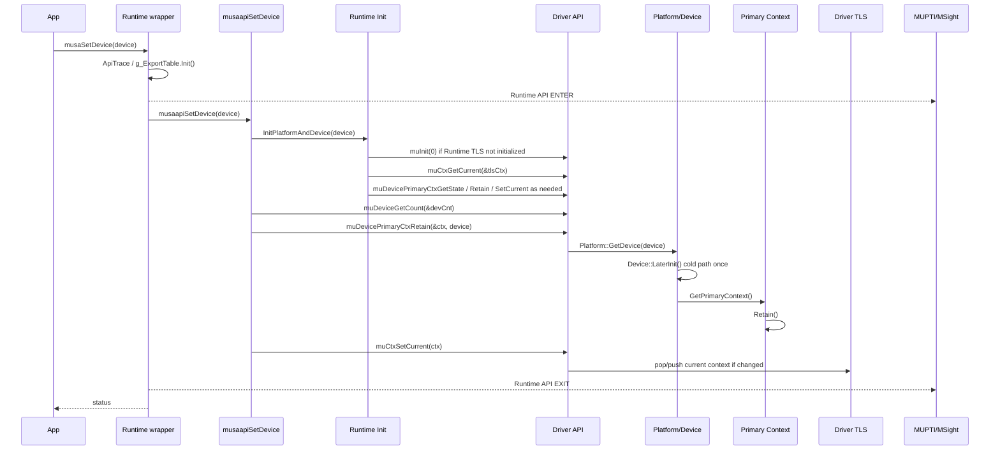

# `musaSetDevice` 端到端调用流程与性能点

分析范围：

```text
MUSA-Runtime
linux-ddk/musa
MUPTI / MSight profiling 关联
```

核心源码：

| 层级 | 文件 |
| --- | --- |
| Runtime API wrapper | `MUSA-Runtime/src/musa_wrappers_generated.cpp` |
| Runtime 实现 | `MUSA-Runtime/src/musa_device.cpp` |
| Runtime 初始化和 TLS | `MUSA-Runtime/src/internal.h`、`MUSA-Runtime/src/internal.cpp` |
| Driver API wrapper | `linux-ddk/musa/src/driver/mu_wrappers_generated.cpp` |
| Driver device API | `linux-ddk/musa/src/driver/mu_device.cpp` |
| Driver context API | `linux-ddk/musa/src/driver/mu_context.cpp` |
| Driver TLS / API trace | `linux-ddk/musa/src/driver/internal.h`、`linux-ddk/musa/src/driver/internal.cpp` |
| Core platform | `linux-ddk/musa/src/musa/core/platform.cpp` |
| Core device | `linux-ddk/musa/src/musa/core/device.cpp` |
| Core context | `linux-ddk/musa/src/musa/core/context.cpp` |

## 总体结论

`musaSetDevice(device)` 的核心行为是设置当前线程的 current context。它会确保目标 device 的 primary context 可用，并把该 primary context 设为当前线程后续 Runtime/Driver API 使用的 context。

源码中的主路径：

```text
musaSetDevice
  -> ApiTrace / Runtime MUPTI callback
  -> musaapiSetDevice
  -> InitPlatformAndDevice
  -> muCtxGetCurrent
  -> muDevicePrimaryCtxGetState / muDevicePrimaryCtxRetain / muCtxSetCurrent
  -> muDeviceGetCount
  -> muDevicePrimaryCtxRetain
  -> muCtxSetCurrent
```

其中 `InitPlatformAndDevice()` 是初始化保护逻辑，`musaapiSetDevice()` 后半段是 `musaSetDevice` 的显式设置逻辑。第一次调用和稳态调用的性能差异很大，必须分开分析。

## 最小调用示例

```cpp
#include <musa_runtime.h>

int main() {
    musaSetDevice(0);
    return 0;
}
```

如果使用 MSight/MUPTI 采集，能看到一条 Runtime API：

```text
Runtime API: musaSetDevice_v3020
```

同时还能看到它内部触发的 Driver API，例如：

```text
muInit
muCtxGetCurrent
muDevicePrimaryCtxGetState
muDeviceGetCount
muDevicePrimaryCtxRetain
muCtxSetCurrent
```

首次调用通常还会包含 `muInit` 和 device/context 初始化成本；后续同线程重复调用一般不会再包含完整初始化成本。

## Runtime API wrapper

入口：`MUSA-Runtime/src/musa_wrappers_generated.cpp`

`musaSetDevice` wrapper 做三件事：

```text
1. 创建 ApiTrace。
2. 如果 Tools callback 启用，发送 Runtime API ENTER callback。
3. 调用 musaapiSetDevice(device)。
4. 如果 Tools callback 启用，发送 Runtime API EXIT callback。
```

关键逻辑：

```cpp
__host__ musaError_t MUSARTAPI musaSetDevice(int device) {
    musaError_t status = musaSuccess;
    ApiTrace trace(status, "musaSetDevice_v3020", MUPTI_CBID_GET(musaSetDevice_v3020), device);

    if (status == musaSuccess &&
        g_ExportTable.SupportToolsCallback() &&
        g_ExportTable.GetToolsTable().callback->CallbackEnabled(...)) {
        // Runtime API ENTER callback
        status = musaapiSetDevice(params.device);
        // Runtime API EXIT callback
    } else {
        status = musaapiSetDevice(device);
    }

    return status;
}
```

### wrapper 性能点

| 成本点 | 说明 |
| --- | --- |
| `ApiTrace` | 每个 Runtime API 都会创建。首次调用会触发 `g_ExportTable.Init()`。 |
| `g_ExportTable.Init()` | 首次调用会 `dlopen libmusa.so`、查 `muGetExportTable`、填 Runtime/Driver/Tools/Injection export table。 |
| Tools callback 判断 | MUPTI/MSight 开启后会检查 `CallbackEnabled()`。 |
| Runtime ENTER/EXIT callback | MUPTI/MSight 开启后，`musaSetDevice` 会多两次 callback 分发。 |
| 日志 | 开启 `LOG_API` 或错误回栈时，会有时间戳、格式化、stderr 输出和 backtrace 成本。 |

## Runtime 核心实现

入口：`MUSA-Runtime/src/musa_device.cpp`

```cpp
musaError_t musaapiSetDevice(int device) {
    musaError_t status = InitPlatformAndDevice(device);
    if (status == musaSuccess) {
        int devCnt = 0;
        g_ExportTable.GetDriverTable().device->muDeviceGetCount(&devCnt);
        if (device < 0 || device >= devCnt) {
            status = musaErrorInvalidDevice;
        } else {
            MUcontext ctx;
            status = ToMusaError(g_ExportTable.GetDriverTable().device->muDevicePrimaryCtxRetain(&ctx, device));
            if (status == musaSuccess) {
                status = ToMusaError(g_ExportTable.GetDriverTable().context->muCtxSetCurrent(ctx));
            }
        }
    }

    return status;
}
```

Runtime 层的明确语义：

```text
1. 确保平台和目标 device 已初始化。
2. 检查 device 是否在合法范围内。
3. 获取目标 device 的 primary context。
4. 把 primary context 设置为当前线程的当前 context。
```

### Runtime TLS

`MUSA-Runtime/src/internal.h` 中的 `TlsData` 保存当前线程 Runtime 状态：

```text
m_Initialized
m_LastError
m_CurrentCtx
m_ExecStack
```

`GetTlsDefaultCtx()` 返回当前线程缓存的 `m_CurrentCtx`。

## `InitPlatformAndDevice`

位置：`MUSA-Runtime/src/internal.h`

```text
InitPlatformAndDevice(device)
  -> InitPlatform()
  -> InitDevice(device)
```

### `InitPlatform`

Runtime 的 `InitPlatform()` 按线程检查是否已经初始化：

```cpp
if (!GetTlsData().Initialized()) {
    status = muInit(0);
    if (status == success) {
        GetTlsData().Initialized() = true;
    }
}
```

注意：这是 Runtime TLS 维度的初始化标记。不同线程第一次调用 Runtime API 时，仍会进入这段逻辑，但 Driver 平台初始化本身通过 `std::call_once` 保护。

### `InitDevice`

`InitDevice(deviceId)` 的主要逻辑：

```text
1. muCtxGetCurrent(&Runtime TLS current ctx)
2. 如果当前 ctx 为空：
     muDevicePrimaryCtxRetain(deviceId)
     muCtxSetCurrent(primary ctx)
3. 如果当前 ctx 非空：
     muDevicePrimaryCtxGetState(deviceId)
     如果目标 primary context 不 active：
         muDevicePrimaryCtxRetain(deviceId)
         根据返回 ctx 与当前 TLS ctx 是否一致决定 release 或 set current
```

这一步会让 `musaSetDevice` 在真正执行设置前，先触发一批 Driver API。

## Driver API wrapper

Driver API wrapper 位于：

```text
linux-ddk/musa/src/driver/mu_wrappers_generated.cpp
```

`muDevicePrimaryCtxRetain` 和 `muCtxSetCurrent` 的 wrapper 模式一致：

```text
1. 创建 Driver ApiTrace。
2. 如果 Tools callback 启用，发送 Driver API ENTER callback。
3. 调用 muapi* 真正实现。
4. 如果 Tools callback 启用，发送 Driver API EXIT callback。
```

以 `muDevicePrimaryCtxRetain` 为例：

```cpp
MUresult MUSAAPI muDevicePrimaryCtxRetain(MUcontext* pctx, MUdevice dev) {
    MUresult status = MUSA_SUCCESS;
    ApiTrace trace(status, "muDevicePrimaryCtxRetain", ...);

    if (toolsCallbackEnabled(...)) {
        // Driver API ENTER callback
        status = muapiDevicePrimaryCtxRetain(params.pctx, params.dev);
        // Driver API EXIT callback
    } else {
        status = muapiDevicePrimaryCtxRetain(pctx, dev);
    }

    return status;
}
```

## Driver `muDevicePrimaryCtxRetain`

实现位置：`linux-ddk/musa/src/driver/mu_context.cpp`

```cpp
MUresult muapiDevicePrimaryCtxRetain(MUcontext *pctx, MUdevice dev) {
    MUresult status = InitPlatform();

    if (status == MUSA_SUCCESS) {
        Musa::IDevice* pDevice = Musa::Platform::Get().GetDevice(dev);
        if (nullptr == pDevice) {
            status = MUSA_ERROR_INVALID_DEVICE;
        } else if (nullptr == pctx) {
            status = MUSA_ERROR_INVALID_VALUE;
        } else {
            Musa::IContext* pContext = pDevice->GetPrimaryContext();
            *pctx = pContext;
            status = pContext->Retain();
        }
    }

    return status;
}
```

内部流程：

```text
muapiDevicePrimaryCtxRetain
  -> Driver InitPlatform()
  -> Platform::Get().GetDevice(dev)
  -> Device::LaterInit()
  -> Device::GetPrimaryContext()
  -> Context::Retain()
```

`Context::Retain()`：

```cpp
++m_RefCount;
m_IsActivate = true;
```

### `muDevicePrimaryCtxRetain` 性能点

| 成本点 | 说明 |
| --- | --- |
| `InitPlatform()` | 稳态通常是快速检查；未初始化时会失败或依赖 `muInit` 先完成。 |
| `Platform::GetDevice(dev)` | 每次会调用 `Device::LaterInit()`；初始化完成后是 `std::call_once` 快速路径。 |
| `Device::LaterInit()` 冷路径 | 设备首次初始化时很重：HAL device finalize、queue family 扫描、primary context 初始化、copy manager 初始化、universal manager 初始化。 |
| `Context::Retain()` | 稳态只是增加 refcount 并设置 active；高频调用仍有写共享 context 状态的成本。 |
| 多线程 | primary context 是 device 级共享对象，多线程频繁 `Retain()` 会写同一 context 状态。源码片段中未看到这一步有显式锁，需要结合更外层并发约束确认。 |

## Driver `muCtxSetCurrent`

实现位置：`linux-ddk/musa/src/driver/mu_context.cpp`

```cpp
MUresult muapiCtxSetCurrent(MUcontext ctx) {
    MUresult status = InitPlatform();

    if (status == MUSA_SUCCESS) {
        if (nullptr == ctx) {
            TlsCtxPop();
        } else {
            Musa::Context* musaContext = Musa::IntrusiveCast<Musa::Context>(ctx);
            if (musaContext != TlsCtxTop()) {
                TlsCtxPop();
                TlsCtxPush(musaContext);
            }
        }
    }

    return status;
}
```

Driver TLS 保存一个 context stack：

```text
TlsData::m_CtxStack
```

`TlsCtxTop()` 返回当前线程的栈顶 context。`muCtxSetCurrent(ctx)` 的行为：

```text
ctx == nullptr:
  pop 当前 context

ctx != nullptr && ctx == 当前栈顶:
  不改变 TLS

ctx != nullptr && ctx != 当前栈顶:
  pop 当前栈顶
  push 新 context
```

### `muCtxSetCurrent` 性能点

| 成本点 | 说明 |
| --- | --- |
| Driver wrapper | MUPTI 开启时会产生 Driver API ENTER/EXIT callback。 |
| TLS 栈操作 | 同 device 重复设置时，`ctx == TlsCtxTop()`，不会 push/pop。跨 device 切换时会 pop/push。 |
| context 校验 | 当前实现没有在 `muapiCtxSetCurrent()` 中显式调用 `ValidateContext()`，主要是指针转换和 TLS 栈更新。 |
| GPU 同步 | `muCtxSetCurrent()` 不做 GPU 同步，不应把它和 stream/device synchronize 混淆。 |

## Core device 冷启动路径

`Platform::GetDevice(dev)` 会调用：

```text
Device::LaterInit()
```

冷路径位于 `linux-ddk/musa/src/musa/core/device.cpp`：

```text
Device::LaterInit()
  -> HAL Device Finalize
  -> 扫描 queue family
  -> 初始化 primary context
  -> 设置 LLC persisting
  -> 初始化 CopyManagers
  -> 初始化 UniversalManager
```

primary context 初始化位于 `Context::Init()`：

```text
Context::Init()
  -> CriticalBase::Init()
  -> 创建 default stream
  -> 自动加载已注册 libraries
  -> 创建 barrier stream
  -> 如果 MUPTI 启用，调用 MUpti::CreateContext()
```

这就是首次 `musaSetDevice` 明显慢于稳态路径的主要原因。慢点不在 context 指针切换本身，而在它触发了 platform、device、context 的初始化链路。

## 完整时序图



## 冷路径、暖路径、重复同设备路径

### 冷路径：进程首次调用

典型调用：

```text
musaSetDevice(0)
```

主要成本：

```text
Runtime export table 初始化
dlopen libmusa
muGetExportTable
Injection table 加载
muInit
Musa::CreatePlatform
HAL platform 创建
device 枚举
Device::LaterInit
primary context 初始化
default stream / barrier stream 创建
copy manager 初始化
```

性能特征：

```text
冷路径耗时由 HAL 初始化、设备数量、驱动状态、profiler/injection 状态决定，必须用 cold benchmark 单独统计。
```

### 暖路径：线程首次设置一个已初始化 device

典型场景：

```text
线程 A 已经初始化过平台和 device
线程 B 第一次调用 musaSetDevice(0)
```

主要成本：

```text
Runtime TLS 初始化检查
muCtxGetCurrent
muDevicePrimaryCtxRetain
muCtxSetCurrent
muDeviceGetCount
再次 muDevicePrimaryCtxRetain
再次 muCtxSetCurrent
```

性能特征：

```text
不再有完整 HAL 初始化，但仍会有多次 Driver API 调用。
```

### 稳态重复同设备调用

典型场景：

```cpp
for (...) {
    musaSetDevice(0);
    // small work
}
```

源码行为：

```text
1. Runtime wrapper 仍会进入。
2. InitPlatformAndDevice 仍会检查当前 ctx。
3. musaapiSetDevice 仍会调用 muDeviceGetCount。
4. musaapiSetDevice 仍会调用 muDevicePrimaryCtxRetain。
5. musaapiSetDevice 仍会调用 muCtxSetCurrent。
6. 如果 ctx 已经是 TLS 栈顶，muCtxSetCurrent 内部不 push/pop。
```

性能特征：

```text
比冷路径轻很多，但不是零成本。
在小 kernel、小 memcpy 或 Python 框架调度频繁的场景中，高频 setDevice 会放大 CPU API 开销。
```

## MSight/MUPTI 中看到的事件

如果用 MSight System 采集：

```bash
msys profile --trace=musa --output set_device.msys-rep ./set_device
```

通常能看到的事件层次：

```text
Runtime API:
  musaSetDevice_v3020

Driver API:
  muInit
  muCtxGetCurrent
  muDevicePrimaryCtxGetState
  muDeviceGetCount
  muDevicePrimaryCtxRetain
  muCtxSetCurrent
```

注意：

```text
musaSetDevice 本身不会产生 GPU kernel activity。
如果 report 中看到 GPU activity，通常来自前后其他 API，不是 setDevice 直接提交的 GPU work。
```

## 日志验证

### 本次新增日志

本次在源码中补充了 `musaSetDevice` 相关阶段日志。日志复用现有 `MUSA_LOG` / `tprintf` 体系，默认关闭，不新增独立日志框架。

| 层级 | 文件 | 新增信息 |
| --- | --- | --- |
| Runtime set device | `MUSA-Runtime/src/musa_device.cpp` | `musaapiSetDevice` 入口、`InitPlatformAndDevice` 结果、`muDeviceGetCount` 结果、primary context retain 结果、`muCtxSetCurrent` 结果。 |
| Runtime 初始化 | `MUSA-Runtime/src/internal.h` | `InitPlatform` 是否调用 `muInit`，`InitDevice` 当前 TLS context、primary context active 状态、retain/set current 分支。 |
| Driver device | `linux-ddk/musa/src/driver/mu_device.cpp` | `muapiDeviceGetCount` 入参、返回值、device count。 |
| Driver context | `linux-ddk/musa/src/driver/mu_context.cpp` | `muapiCtxGetCurrent`、`muapiCtxSetCurrent`、`muapiDevicePrimaryCtxGetState`、`muapiDevicePrimaryCtxRetain` 的 ctx 指针、TLS 栈顶、refcount、active 状态。 |
| Core device | `linux-ddk/musa/src/musa/core/device.cpp` | `Device::LaterInit` 中 HAL finalize、queue family scan、primary context init、LLC 设置、copy manager init、universal manager init 的耗时。 |
| Core context | `linux-ddk/musa/src/musa/core/context.cpp` | `Context::Init` 中 critical data、default stream、library load、barrier stream、MUPTI context 创建的耗时。 |

日志打开方式：

```bash
# 只看初始化和 setDevice 阶段日志
MUSA_LOG=0x80 ./set_device

# 同时看 Runtime API、Driver API、Runtime 内部调用的 Driver API、初始化阶段日志
MUSA_LOG=0x882 ./set_device
```

`0x80` 对应 `LOG_INIT`，`0x2` 对应 `LOG_API`，`0x800` 对应 `LOG_INVOC`。

最小验证程序：

```cpp
#include <musa_runtime.h>
#include <cstdio>

int main() {
    musaError_t s = musaSetDevice(0);
    std::printf("set0=%d\n", static_cast<int>(s));

    s = musaSetDevice(0);
    std::printf("set0_again=%d\n", static_cast<int>(s));
    return 0;
}
```

### 远程环境验证结果

验证环境：

```text
host: shanfeng@10.18.32.25
container: mochi-sglang
runtime: /usr/local/musa-4.3.5
command: LD_LIBRARY_PATH=/usr/local/musa-4.3.5/lib MUSA_LOG=0x882 /tmp/set_device
```

关键日志：

```text
muInit ret=0(MUSA_SUCCESS) +78528 us
muDevicePrimaryCtxRetain ret=0(MUSA_SUCCESS) +51238 us

rt-api musaSetDevice(0)
  muDeviceGetCount ret=0(MUSA_SUCCESS) +4 us
  muDevicePrimaryCtxRetain ret=0(MUSA_SUCCESS) +4 us
  muCtxSetCurrent ret=0(MUSA_SUCCESS) +2 us
rt-api musaSetDevice ret=0 +30 us

rt-api musaSetDevice(0)
  muDeviceGetCount ret=0(MUSA_SUCCESS) +3 us
  muDevicePrimaryCtxRetain ret=0(MUSA_SUCCESS) +3 us
  muCtxSetCurrent ret=0(MUSA_SUCCESS) +2 us
rt-api musaSetDevice ret=0 +17 us
```

验证结论：

```text
1. 冷启动成本集中在 muInit 和第一次 muDevicePrimaryCtxRetain。
2. 第一次 primary context retain 触发 device 和 primary context 初始化，耗时远高于稳态 retain。
3. 稳态重复 musaSetDevice(0) 仍会执行 muDeviceGetCount、muDevicePrimaryCtxRetain、muCtxSetCurrent。
4. 稳态 muCtxSetCurrent 的耗时很小，但仍会产生 Driver API wrapper、callback 和日志采集成本。
5. Runtime API 视角下的 musaSetDevice 耗时不一定覆盖所有前置初始化成本；分析冷启动时必须同时看 Runtime API 和 Driver API。
```

补充说明：

```text
远程验证使用的是容器中已安装的 MUSA 4.3.5 库，用于确认外层 Runtime/Driver API 序列。
本次新增的细粒度阶段日志需要使用修改后的 MUSA-Runtime 和 linux-ddk/musa 重新构建后采集。
```

## 潜在性能点

### 1. 首次初始化成本

首次 `musaSetDevice` 容易把以下成本全部算到自己名下：

```text
Runtime export table 初始化
Driver platform 初始化
HAL platform/device 初始化
primary context 初始化
default stream / barrier stream 创建
copy manager 初始化
MUPTI injection 初始化
```

分析报告时必须把首次调用单独标注。不能用首次 `musaSetDevice` 的耗时代表稳态成本。

### 2. 高频重复调用成本

稳态重复调用仍包含：

```text
Runtime API wrapper
InitPlatformAndDevice 检查
muCtxGetCurrent
muDevicePrimaryCtxGetState
muDeviceGetCount
muDevicePrimaryCtxRetain
muCtxSetCurrent
MUPTI callback
```

如果框架在每个 op 前都调用 `musaSetDevice`，小 op 场景下 CPU overhead 会明显增加。

建议：

```text
框架层维护 current device guard。
同线程同 device 时避免重复调用 musaSetDevice。
跨 device 切换时只在切换点调用。
```

### 3. `muDeviceGetCount` 每次执行

`musaapiSetDevice` 每次都会调用 `muDeviceGetCount(&devCnt)` 检查范围。Driver 内部只是读取 `Platform::Get().GetDeviceCount()`，但仍有一次 wrapper、callback 和函数调用成本。

优化方向：

```text
Runtime 可考虑在平台初始化后缓存 device count。
如果 device 可见性在进程生命周期内固定，缓存可以减少稳态 API 调用。
```

是否能改需要确认：

```text
visible device 配置是否允许运行期变化。
设备热插拔或错误状态是否需要每次查询。
```

### 4. `muDevicePrimaryCtxRetain` 每次执行

`musaapiSetDevice` 每次都会调用 `muDevicePrimaryCtxRetain`。稳态下它会：

```text
Platform::GetDevice(device)
Device::LaterInit() call_once fast path
GetPrimaryContext()
Context::Retain()
```

潜在问题：

```text
重复调用会反复写 primary context refcount 和 active 状态。
多线程高频调用同一 device 时，会写同一个 primary context 对象。
```

需要进一步确认：

```text
primary context refcount 的生命周期设计是否要求每次 musaSetDevice 都 retain。
是否存在重复 setDevice 导致 refcount 持续增长的问题。
```

### 5. MUPTI/MSight 采集开销

MSight/MUPTI 开启后，一次 `musaSetDevice` 会产生：

```text
1 条 Runtime API enter/exit
多条 Driver API enter/exit
activity buffer 写入
共享内存传输
report 转换和落盘
```

因此 profiling 下看到的 `musaSetDevice` 成本比裸跑更高。分析时要分清：

```text
真实 API 成本
MUPTI callback 成本
MSight collector 成本
```

### 6. 多线程初始化竞争

首次初始化使用原子状态和 `std::call_once`：

```text
ExportTableManager::Init()
Platform::Init()
Device::LaterInit()
```

多个线程同时首次调用 `musaSetDevice` 时：

```text
一个线程执行初始化。
其他线程会在初始化完成前等待、yield 或进入 call_once 等待路径。
```

在模型服务启动阶段，这会表现为偶发长尾。

建议：

```text
服务启动阶段显式预热 musaSetDevice。
每个需要使用 MUSA 的 worker 线程在接请求前完成 setDevice。
```

### 7. invalid device 的错误路径

`musaapiSetDevice` 先调用 `InitPlatformAndDevice(device)`，再调用 `muDeviceGetCount` 做范围检查。

因此非法 device id 在当前实现中会先进入初始化检查，再返回错误。具体返回点取决于当前线程是否已经有 current context。

建议：

```text
上层在解析配置时提前校验 device id。
避免在线请求路径中反复触发 invalid device 错误。
```

### 8. 重复 `Retain` 成本

当前源码中 `musaapiSetDevice` 每次都会执行：

```text
muDevicePrimaryCtxRetain(&ctx, device)
```

`Context::Retain()` 的实现是：

```cpp
++m_RefCount;
m_IsActivate = true;
```

因此重复 `musaSetDevice(0)` 会持续写 primary context 的 refcount 和 active 状态。远程日志已经确认稳态重复调用仍然进入 `muDevicePrimaryCtxRetain`。本次新增的 Driver 内部日志会进一步输出：

```text
driver muapiDevicePrimaryCtxRetain retained dev:0 ctx:... ref:N->N+1 active:1->1
```

优化前必须确认 primary context refcount 的语义：

```text
如果 musaSetDevice 被定义为每次都必须 retain，则不能直接删除 retain。
如果同线程同 device 的重复 setDevice 不需要增加引用，则可以设计 same-device fast path。
```

### 9. 重复 `muCtxSetCurrent` 成本

Driver 实现中已经有轻量判断：

```text
ctx == TlsCtxTop(): 不 pop/push
ctx != TlsCtxTop(): pop 后 push
```

因此稳态重复同 device 时，`muCtxSetCurrent` 内部不会修改 TLS 栈。但 Runtime 仍然会发起一次 Driver API 调用，MUPTI/MSight 开启时还会产生 callback 成本。

可评估的优化：

```text
Runtime 在拿到 retained primary ctx 后，如果 ctx == Runtime TLS current ctx，可跳过 muCtxSetCurrent。
该优化只减少 Driver API wrapper/callback/TLS 判断成本，不改变 retain 语义。
```

### 10. `muDeviceGetCount` 返回值处理

当前 `musaapiSetDevice` 调用 `muDeviceGetCount(&devCnt)` 后只使用 `devCnt`，没有把 Driver 返回值写回 `status`。

```cpp
int devCnt = 0;
g_ExportTable.GetDriverTable().device->muDeviceGetCount(&devCnt);
```

建议改为显式处理返回值：

```text
如果 muDeviceGetCount 失败，应直接返回对应 Runtime error。
成功后再检查 device 范围。
```

这属于正确性优化，同时也能让错误路径更清晰。

## 优化空间评估

| 优化点 | 收益 | 风险 | 建议 |
| --- | --- | --- | --- |
| Runtime 缓存 device count | 减少稳态一次 Driver API 调用 | 需要确认可见设备数量在进程生命周期内是否固定 | 可作为低风险优化候选。 |
| 跳过 same-device `muCtxSetCurrent` | 减少稳态 Driver wrapper、callback、TLS 判断 | 需要确保 Runtime TLS 与 Driver TLS 一致 | 可先通过日志确认 `ctx == tls_ctx` 的比例。 |
| same-device fast path 跳过 retain | 收益最大，可减少 refcount 写入 | 需要明确 primary context 引用计数语义，风险最高 | 不建议直接改，先用新增 refcount 日志确认行为。 |
| 冷启动预热 | 避免在线请求承受 `muInit`、`Device::LaterInit` 成本 | 不减少总成本，只转移到启动阶段 | 服务场景优先采用。 |
| MUPTI callback 降采样或分级 | 降低 profiling 下 API 放大成本 | 影响工具可观测性 | 仅用于性能压测模式，不影响常规 profiling。 |

短期建议：

```text
1. 框架层避免在每个 op 前无条件调用 musaSetDevice。
2. 服务启动时预热每个 worker 线程的目标 device。
3. 用本次新增日志确认同线程同 device 的重复 retain 次数和 refcount 变化。
4. 先评估跳过 same-device muCtxSetCurrent，再评估是否能减少 repeated retain。
```

## 建议的 profiling 分组

分析 `musaSetDevice` 时建议至少分三组采集：

| 分组 | 用例 | 观察点 |
| --- | --- | --- |
| cold | 进程启动后第一次 `musaSetDevice(0)` | 初始化总成本、`muInit`、`Device::LaterInit`。 |
| warm same thread | 同线程重复 `musaSetDevice(0)` | 稳态 API 成本、重复 retain、callback 开销。 |
| warm switch device | `musaSetDevice(0)` / `musaSetDevice(1)` 交替 | TLS context 切换、目标 device primary context 状态。 |
| multi-thread warmup | 多线程同时第一次 `musaSetDevice(0)` | 初始化等待、call_once 竞争、refcount 写入。 |

## 建议埋点

当前 MUPTI 能看到 Runtime/Driver API 总耗时，但不能拆出 `musaSetDevice` 内部每个阶段的细粒度成本。建议增加低开销阶段埋点：

| 位置 | 埋点 |
| --- | --- |
| `musaSetDevice` wrapper | `runtime_set_device_enter/exit`，记录 device、thread id、correlation id。 |
| `musaapiSetDevice` | `init_platform_and_device_begin/end`、`device_count_begin/end`、`primary_retain_begin/end`、`ctx_set_current_begin/end`。 |
| `InitPlatform` | 标记是否首次触发 `muInit`。 |
| `InitDevice` | 记录当前 Runtime TLS ctx 是否为空、是否调用 `muDevicePrimaryCtxGetState`、是否调用 retain/set current。 |
| `muDevicePrimaryCtxRetain` | 记录 device id、primary ctx 指针、refcount 变化。 |
| `muCtxSetCurrent` | 记录旧 TLS ctx、新 ctx、是否发生 pop/push。 |
| `Device::LaterInit` | 记录 cold path 总耗时，以及 HAL finalize、queue family scan、primary context init、copy manager init 分项。 |
| `Context::Init` | 记录 default stream、barrier stream、library load、MUPTI CreateContext 分项。 |

事件字段建议：

```text
timestamp
pid
tid
device
correlation_id
old_ctx
new_ctx
primary_ctx
stage
result
is_cold_path
```

上述埋点已按 `MUSA_LOG=0x80` 的形式落到源码中。后续如果需要进入 MUPTI activity/report，需要把这些阶段事件从 `tprintf` 改造成 MUPTI 自定义 activity 或内部 marker。

## 本地检查结果

本地检查结果：

```text
git -C MUSA-Runtime diff --check: 通过
git -C linux-ddk/musa diff --check: 通过
```

构建检查：

```text
MUSA-Runtime CMake 配置失败：
缺少 module_version/generate_version_query.cmake。

linux-ddk/musa 执行 ./ddk_build.sh -a 0 -m 1：
CMake 配置完成，早期目标开始编译；
构建在 libdrm configure 阶段失败，原因是本机缺少 meson。
```

因此本地没有完成修改后库的完整构建。远程容器使用已安装库完成了外层 Runtime/Driver API 序列验证；新增细粒度日志需要在具备完整构建依赖的环境中重新构建后采集。

## 性能模型拆分

可以把 `musaSetDevice` 建模为：

```text
T_set_device =
  T_runtime_wrapper
+ T_export_table_init_if_cold
+ T_runtime_callback
+ T_init_platform_if_needed
+ T_init_device_check
+ T_device_count
+ T_primary_ctx_retain
+ T_ctx_set_current
+ T_driver_callbacks
+ T_logging
```

进一步拆分冷路径：

```text
T_init_platform_if_needed =
  T_dlopen_libmusa
+ T_get_export_tables
+ T_load_injection
+ T_muInit
+ T_hal_platform_create
+ T_device_enumeration
+ T_device_later_init
```

`T_device_later_init`：

```text
T_device_later_init =
  T_hal_device_finalize
+ T_queue_family_scan
+ T_primary_context_init
+ T_copy_manager_init
+ T_universal_manager_init
```

稳态路径重点看：

```text
T_set_device_warm =
  T_runtime_wrapper
+ T_init_device_check
+ T_device_count
+ T_primary_ctx_retain
+ T_ctx_set_current
+ T_callbacks_if_enabled
```

## 结论

`musaSetDevice` 的核心功能是设置当前线程的 current context。它依赖 primary context，因此会触发 primary context retain 和 ctx set current。

性能分析必须区分：

```text
首次初始化成本
线程首次设置成本
稳态重复设置成本
跨 device 切换成本
MUPTI/MSight 采集附加成本
```

实际优化优先级：

```text
1. 上层避免在热路径重复调用 musaSetDevice。
2. 服务启动阶段显式预热 device 和 worker 线程。
3. profiling 时单独统计 cold/warm。
4. 如果稳态 setDevice 成本仍高，再评估 Runtime 是否能增加 same-device fast path。
5. 对真正的软件性能建模，需要补充 Runtime/Driver 内部阶段埋点。
```
