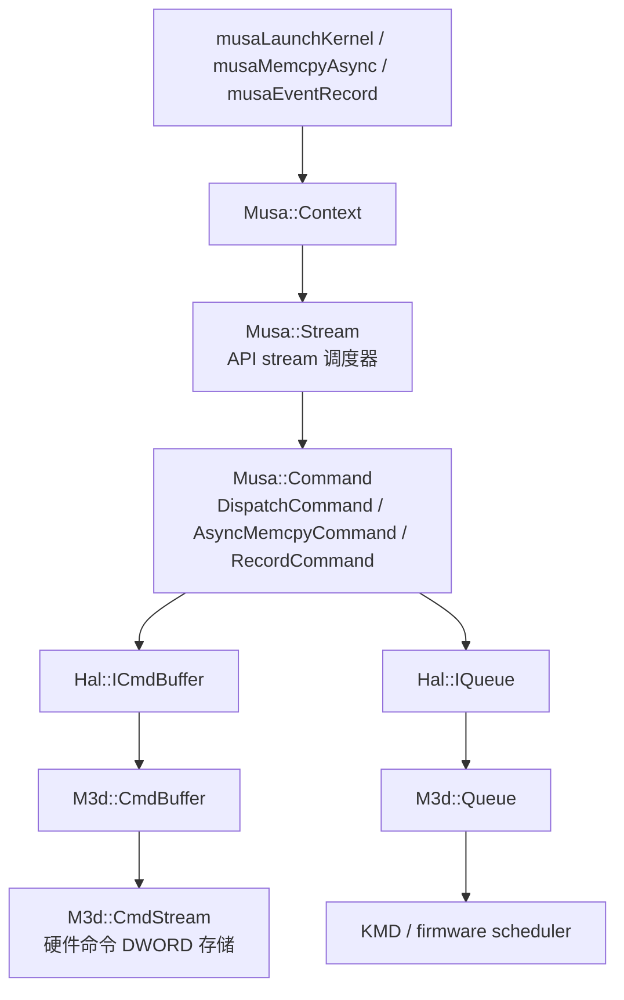

# Command Stream 设计与实现源码解析

本文基于 `linux-ddk/musa` 源码检查 MUSA 的命令调度和底层命令流实现。源码中存在两个层级：

1. `Musa::Stream` 和 `Musa::Command`：Runtime 层的调度结构，负责 API stream 语义、命令入队、依赖关系、异步提交、完成等待。
2. `M3d::CmdBuffer` 和 `M3d::CmdStream`：HAL/M3D 层的命令编码结构，负责把 kernel dispatch、copy、wait、signal 等操作写成硬件可执行的命令流。

这两个层级不能混用。API stream 决定“命令按什么顺序提交”；M3D command stream 决定“提交给硬件的命令内容如何存储和编码”。

## 1. 总体结论

`Stream` 是 Runtime 的异步调度器。每个 `Stream` 持有每个 engine 的 HAL queue、command pool、command buffer 缓存、同步 semaphore，以及两条后台线程：

- `AsyncSubmit`：从 `m_CommandList` 取出命令，构建命令缓冲，处理 command merge，提交到 HAL queue。
- `AsyncWait`：等待提交完成，检查错误，更新 command 状态，释放 command buffer 和临时资源。

`Command` 是 Stream 中的执行单元。kernel launch 对应 `DispatchCommand`，异步 copy 对应 `AsyncMemcpyCommand`，同步 copy 对应 `SyncMemcpyCommand`，event record 对应 `RecordCommand`，event wait 对应 `BarrierCommand`。

`CmdStream` 是 M3D command buffer 的内部存储。它只管理 DWORD 命令空间、chunk 切换、chunk 链接和提交地址，不理解 Runtime 的 stream 依赖。实际硬件命令由各 engine 的 `CmdBuffer` 写入，例如 compute kernel dispatch 会在 `ComputeCmdBuffer::WriteDispatchDirect` 中写入 `MT_CCE_DISPATCH_DIRECT_STRUCT`。

## 2. 分层关系



关键源码：

| 层级 | 文件 | 作用 |
|---|---|---|
| Runtime stream | [stream.h](/home/mtuser/workspace/linux-ddk/musa/src/musa/core/stream.h:26) | 定义 `Musa::Stream` 的队列、线程、semaphore、engine resource。 |
| Runtime stream 实现 | [stream.cpp](/home/mtuser/workspace/linux-ddk/musa/src/musa/core/stream.cpp:895) | 初始化 queue/semaphore/thread，执行入队、提交、等待。 |
| Command 基类 | [command.h](/home/mtuser/workspace/linux-ddk/musa/src/musa/core/command/command.h:33) | 定义 command 状态机、类型、依赖、wait/signal。 |
| Command 实现 | [command.cpp](/home/mtuser/workspace/linux-ddk/musa/src/musa/core/command/command.cpp:27) | 实现状态切换、依赖转 semaphore、提交到 queue。 |
| Kernel command | [dispatchCommand.cpp](/home/mtuser/workspace/linux-ddk/musa/src/musa/core/command/dispatchCommand.cpp:9) | 构建 kernel dispatch command buffer 并提交到 CDM queue。 |
| HAL command buffer | [cmdBuffer.cpp](/home/mtuser/workspace/linux-ddk/musa/src/hal/m3d/cmdBuffer.cpp:72) | 把 HAL cmd buffer 映射到 M3D cmd buffer。 |
| M3D command stream | [cmdStream.h](/home/mtuser/workspace/linux-ddk/musa/src/hal/m3d/m3d/src/core/cmdStream.h:96) | 定义硬件命令流的 chunk 管理和命令空间接口。 |
| M3D command stream 实现 | [cmdStream.cpp](/home/mtuser/workspace/linux-ddk/musa/src/hal/m3d/m3d/src/core/cmdStream.cpp:20) | 实现 `ReserveCommands`、`CommitCommands`、chunk 分配、End。 |
| M3D queue submit | [queue.cpp](/home/mtuser/workspace/linux-ddk/musa/src/hal/m3d/queue.cpp:178) | 把 HAL submit 信息转换成 M3D submit 信息。 |

## 3. Runtime Stream 的设计

### 3.1 Stream 的核心成员

`Stream` 的核心字段位于 [stream.h](/home/mtuser/workspace/linux-ddk/musa/src/musa/core/stream.h:172)：

| 字段 | 含义 |
|---|---|
| `m_CommandList` | API 线程入队后的待构建命令列表。 |
| `m_MergingList` | `AsyncSubmit` 正在尝试合并的一批 command。 |
| `m_InflightList` | 已提交到 HAL queue，正在 GPU 或 host 侧执行的 command。 |
| `m_WaitingList` | `AsyncWait` 当前等待完成的一批 command。 |
| `m_LastCommand` | 当前 stream 上最后一个 command，用于同 stream 顺序依赖。 |
| `m_CurrentDependencies` | 临时依赖列表，主要由 event、peer copy 等路径注入。 |
| `m_SubmitThread` | 后台提交线程，入口是 `Stream::AsyncSubmit`。 |
| `m_WaitThread` | 后台等待线程，入口是 `Stream::AsyncWait`。 |
| `m_TimelineSemaphore` / `m_HardwareSemaphore` | command 之间的同步信号。 |
| `m_InternalTimelineSemaphore` / `m_InternalHardwareSemaphore` | command 内部阶段同步使用。 |
| `m_EngineResources` | 每个 engine 对应的 HAL queue、cmd pool、cmd buffer 缓存。 |
| `m_InflightSubmissionCounts` | CDM/CE 提交限流计数。 |

Stream 初始化在 [stream.cpp](/home/mtuser/workspace/linux-ddk/musa/src/musa/core/stream.cpp:895)：

1. 遍历每个 engine，查询 queue family。
2. 为可用 engine 创建 HAL queue。
3. 为 queue family 创建 command pool。
4. 为 command buffer 缓存创建 list。
5. 创建 timeline semaphore；如果硬件支持 engine sync，再创建 hardware semaphore。
6. 创建 surface 池。
7. 启动 `AsyncSubmit` 和 `AsyncWait` 两个线程。

### 3.2 Command 的状态机

`Command::Status` 定义在 [command.h](/home/mtuser/workspace/linux-ddk/musa/src/musa/core/command/command.h:35)：

```text
created -> queued -> built -> submitted -> completed
                         \-> error
```

状态切换由 [Command::SetStatus](/home/mtuser/workspace/linux-ddk/musa/src/musa/core/command/command.cpp:85) 控制。它使用 CAS 保证状态只能按顺序推进：

| 状态 | 设置位置 | 含义 |
|---|---|---|
| `created` | command 构造函数 | command 对象已创建，还没有进入 stream。 |
| `queued` | `Stream::QueueCommand` | command 已进入 `m_CommandList`。 |
| `built` | `Stream::AsyncSubmit::buildCommand` | command buffer 已经构建，signal semaphore value 已确定。 |
| `submitted` | `Stream::AsyncSubmit::submitMergingList` | command 已提交到 HAL queue 或 host 侧执行路径。 |
| `completed` | `Stream::AsyncWait` | command 已完成，资源可释放。 |
| `error` | `Stream::AsyncWait` 或失败路径 | command 执行失败，stream 记录 sticky error。 |

`built` 状态有额外含义：signal semaphore value 已经确定。后继 command 在构建依赖时需要等待前驱至少进入 `built`，否则无法知道要等待的 semaphore value。

### 3.3 Command 类型

`Command::Type` 定义在 [command.h](/home/mtuser/workspace/linux-ddk/musa/src/musa/core/command/command.h:55)。

| 类型 | 典型类 | engine | 是否支持 merge | 说明 |
|---|---|---:|---:|---|
| `Dispatch` | `DispatchCommand` | CDM | 是 | kernel launch。 |
| `AsyncMemcpy` | `AsyncMemcpyCommand` | copy manager 选择 | 是 | device/array 相关异步 copy，走 command buffer。 |
| `Memcpy` | `SyncMemcpyCommand` | copy manager 选择 | 否 | host 相关或同步 copy，走 CopyManager。 |
| `Memset` | `MemsetCommand` | copy/compute | 是 | memset。 |
| `Record` | `RecordCommand` | CDM/CE | 是 | event record，写 event signal memory。 |
| `Barrier` | `BarrierCommand` | 可能为 CDM/CE，也可能 host wait | 条件支持 | event wait。 |
| `Callback` | `CallbackCommand` | host | 否 | host callback，host 侧等待依赖后执行回调。 |
| `Graph` | `GraphCommand` | graph manager | 否 | graph launch。 |

## 4. Runtime 执行流程

### 4.1 入队路径

以 kernel launch 为例，入口在 [Stream::CmdLaunchKernel](/home/mtuser/workspace/linux-ddk/musa/src/musa/core/stream.cpp:1425)：

1. 创建 `DispatchCommand`。
2. 调用 `Context::ResolveDependencyAndQueueCommand`。
3. 解析默认 stream、blocking stream、barrier stream、current dependencies。
4. 调用 `Stream::QueueCommand`。

`Context::ResolveDependencyAndQueueCommand` 在 [context.cpp](/home/mtuser/workspace/linux-ddk/musa/src/musa/core/context.cpp:1845)：

| stream 类型 | 依赖规则 |
|---|---|
| default stream | 依赖同 context 中所有 blocking stream 的最后一个 command。 |
| barrier stream | 依赖同 context 中其他 stream 的最后一个 command。 |
| blocking stream | 依赖 default stream 的最后一个 command。 |
| non-blocking stream | 不自动依赖 default stream。 |
| 有 barrier command 未完成 | 记录 barrier command 依赖。 |
| `m_CurrentDependencies` 非空 | 消费并记录到当前 command。 |

`Stream::QueueCommand` 在 [stream.cpp](/home/mtuser/workspace/linux-ddk/musa/src/musa/core/stream.cpp:1015)：

1. 检查 `streamAsyncCapacity`，防止无限积压。
2. `m_AsyncCount.fetch_add(1)`。
3. `command->ChoosePerfEngine(m_LastCommand)`。
4. `command->SetPrevCommand(m_LastCommand)` 记录同 stream 前驱。
5. 更新 `m_LastCommand = command`。
6. command 状态切到 `queued`。
7. command 放入 `m_CommandList`。
8. 唤醒 `m_SubmitCv`，通知 `AsyncSubmit`。

### 4.2 提交线程

`AsyncSubmit` 位于 [stream.cpp](/home/mtuser/workspace/linux-ddk/musa/src/musa/core/stream.cpp:1118)。

提交线程有三个核心步骤：

1. `buildCommand`
   - 调用 `command->FilterDependency()` 删除已完成依赖。
   - 调用 `command->CanMergeTo(m_MergingList)` 判断能否合并到当前批次。
   - 如果能合并，使用 primary command 的 signal semaphore value。
   - 如果不能合并，先提交已有 `m_MergingList`，再给当前 command 分配新的 `m_TimelineValue`。
   - 调用 `command->Build(m_MergingList)` 构建 command buffer。
   - 状态切到 `built`。
   - 放入 `m_MergingList`。

2. `submitMergingList`
   - 调用 `EngineSubmissionSchedule` 做 inflight 限流。
   - 为提交分配 submission id。
   - 调用 primary command 的 `Submit()`。
   - 将 merge list 中所有 command 状态切到 `submitted`。
   - 将 `m_MergingList` 移到 `m_InflightList`。
   - 唤醒 `AsyncWait`。

3. `stopMerging`
   - engine 已经 ready，或者 merge list 达到 32 个 command，就停止继续合并并提交。

### 4.3 等待线程

`AsyncWait` 位于 [stream.cpp](/home/mtuser/workspace/linux-ddk/musa/src/musa/core/stream.cpp:1290)。

执行过程：

1. 从 `m_InflightList` 切出一批 command 到 `m_WaitingList`。
2. 如果 primary command 使用 hardware semaphore，就等待 hardware semaphore；成功后同步 signal timeline semaphore。
3. 如果使用 timeline semaphore，就等待 timeline semaphore。
4. 调用 `EngineSubmissionFeedback` 释放 inflight 额度。
5. 调用 `GetEngineLastError` 检查 queue/device 错误。
6. 对 dispatch/graph/ray command 检查 printf/assert 输出。
7. 调用每个 command 的 `Postprocess`。
8. command 状态切到 `completed` 或 `error`。
9. `m_AsyncCount.fetch_sub(1)`。
10. 异步调用 `ReleaseResources` 释放 timestamp memory、PFM 资源等。

### 4.4 同步接口

`Stream::Synchronize` 在 [stream.cpp](/home/mtuser/workspace/linux-ddk/musa/src/musa/core/stream.cpp:221)：

- 如果同步 default stream，调用 `Context::LockedSyncDefaultStream`，等待所有 blocking stream。
- 如果同步普通 stream，调用 `WaitFinish`。

`WaitFinish` 在 [stream.cpp](/home/mtuser/workspace/linux-ddk/musa/src/musa/core/stream.cpp:1077)，它取 `LastCommand()` 并调用 `Command::Wait()`。`Command::Wait()` 在 [command.cpp](/home/mtuser/workspace/linux-ddk/musa/src/musa/core/command/command.cpp:229)，会按 context wait mode 轮询 command 状态，直到 `completed` 或 `error`。

## 5. Command 依赖如何落到 semaphore

`Command::RecordDependency` 在 [command.cpp](/home/mtuser/workspace/linux-ddk/musa/src/musa/core/command/command.cpp:125)：

1. producer command 存入 `m_SubmitDependencies`。
2. 如果上一个 command 已经记录了同一个 producer，当前 command 不重复记录 execution dependency。
3. 需要执行等待的 producer 存入 `m_ExecutionDependencies`。

`Command::Build` 在 [command.cpp](/home/mtuser/workspace/linux-ddk/musa/src/musa/core/command/command.cpp:168)：

1. 对同 stream 前驱 `m_PrevCommand` 构建 semaphore 依赖。
2. 对 `m_ExecutionDependencies` 中的跨 stream 依赖构建 semaphore 依赖。
3. 选择 hardware semaphore 或 timeline semaphore。
4. 把 `(semaphore, value)` 写入 `m_WaitSemaphoreInfos`。

`ResolveSubmitWait` 在 [command.cpp](/home/mtuser/workspace/linux-ddk/musa/src/musa/core/command/command.cpp:294)：

- 如果 wait semaphore 是 timeline semaphore，转成 HAL queue submit 的 wait semaphore。
- 如果 wait semaphore 是 hardware semaphore，可能写成 command buffer 内部的 `CmdWaitMemoryValue`。

`ResolveSubmitSignal` 在 [command.cpp](/home/mtuser/workspace/linux-ddk/musa/src/musa/core/command/command.cpp:343)：

- command 完成时 signal 当前 command 的 timeline/hardware semaphore。
- command 内部同步时 signal internal semaphore。

最后由 `SubmitToQueue` 组装 `QueueSubmitInfo`，调用 `Hal::IQueue::Submit`，源码在 [command.cpp](/home/mtuser/workspace/linux-ddk/musa/src/musa/core/command/command.cpp:648)。

## 6. Kernel Launch 例子

### 6.1 最小 API 形态

```cpp
// 用户代码的最小形态。
musaStream_t s;
musaStreamCreate(&s);

// kernel launch 会进入 Stream::CmdLaunchKernel。
my_kernel<<<grid, block, 0, s>>>(out, in);

// 等待这个 stream 的最后一个 command 完成。
musaStreamSynchronize(s);
```

### 6.2 Runtime 层执行结果

假设这是该 stream 上第一个 kernel，初始状态：

| 项 | 初始值 |
|---|---|
| `m_CommandList` | 空 |
| `m_MergingList` | 空 |
| `m_InflightList` | 空 |
| `m_LastCommand` | 空 |
| `m_TimelineValue` | 0 |

执行变化：

| 步骤 | 源码位置 | 结果 |
|---|---|---|
| 创建 command | [dispatchCommand.cpp](/home/mtuser/workspace/linux-ddk/musa/src/musa/core/command/dispatchCommand.cpp:9) | 生成 `DispatchCommand`，类型为 `Dispatch`，engine 为 CDM，支持 merge。 |
| 解析依赖 | [context.cpp](/home/mtuser/workspace/linux-ddk/musa/src/musa/core/context.cpp:1845) | 第一个 command 无前驱，通常没有依赖。 |
| 入队 | [stream.cpp](/home/mtuser/workspace/linux-ddk/musa/src/musa/core/stream.cpp:1015) | command 状态变为 `queued`，`m_CommandList=[cmd0]`，`m_LastCommand=cmd0`。 |
| 构建 | [stream.cpp](/home/mtuser/workspace/linux-ddk/musa/src/musa/core/stream.cpp:1202) | 分配 signal value `1`，调用 `cmd0->Build()`。 |
| 记录命令 | [dispatchCommand.cpp](/home/mtuser/workspace/linux-ddk/musa/src/musa/core/command/dispatchCommand.cpp:67) | 创建 HAL cmd buffer，写 timestamp、bind kernel、bind kernel state、dispatch。 |
| 提交 | [dispatchCommand.cpp](/home/mtuser/workspace/linux-ddk/musa/src/musa/core/command/dispatchCommand.cpp:235) | cmd buffer `End()`，调用 CDM queue submit。 |
| 等待完成 | [stream.cpp](/home/mtuser/workspace/linux-ddk/musa/src/musa/core/stream.cpp:1290) | 等待 semaphore value `1`，状态变为 `completed`，释放资源。 |

最终状态：

| 项 | 最终值 |
|---|---|
| `cmd0.status` | `completed` |
| `cmd0.signal_value` | 1 |
| `m_AsyncCount` | 0 |
| `m_LastCommand` | `cmd0`，用于后续 command 建立顺序依赖 |

### 6.3 HAL/M3D 层执行结果

`DispatchCommand::Build` 写 HAL command buffer：

```text
Hal::ICmdBuffer::Begin
  -> CmdWriteTimestamp(TopOfPipe)
  -> CmdBindKernel
  -> CmdBindKernelState
  -> CmdSetLLCPersistcyWindow
  -> CmdSetMultiCoreMode
  -> CmdDispatch
  -> CmdWriteTimestamp(BottomOfPipe)
```

`Hal::CmdBuffer::CmdDispatch` 在 [cmdBuffer.cpp](/home/mtuser/workspace/linux-ddk/musa/src/hal/m3d/cmdBuffer.cpp:336) 把 HAL 参数转换成 M3D `DispatchArgs`：

| HAL 字段 | M3D 字段 |
|---|---|
| `workgroupCount` | `dispatchArgs.numGroup` |
| `workgroupSize` | `dispatchArgs.groupSize` |
| `blockClusterSize` | `dispatchArgs.groupClusterSize` |
| `pdlAddress/pdlValue` | `dispatchArgs.pDependency` |

M3D compute command buffer 在 [compute4/computeCmdBuffer.cpp](/home/mtuser/workspace/linux-ddk/musa/src/hal/m3d/m3d/src/core/hw/mthreads/computeip/compute4/computeCmdBuffer.cpp:1012) 处理 dispatch：

1. `PreDispatch()` 准备 dispatch 前状态。
2. `FillSharedUpdateWords()` 填充共享更新字段。
3. `FillWorkloadDispatchWords()` 填充 pipeline dispatch 字段。
4. `GeneratePdsInfo()` 填充 PDS 信息。
5. `WriteDispatchDirect()` 写入真正的 dispatch 命令。

`WriteDispatchDirect` 在 [compute4/computeCmdBuffer.cpp](/home/mtuser/workspace/linux-ddk/musa/src/hal/m3d/m3d/src/core/hw/mthreads/computeip/compute4/computeCmdBuffer.cpp:1360)：

```cpp
uint32* pCmdSpace = m_pCmdStream->ReserveCommands();

// 填写硬件 dispatch 命令字，包括 workgroup 数量、PDL 依赖、cluster、private memory 等。
memcpy(&pCmdSpace[commandOffset], &dispatchDirectWords, sizeof(dispatchDirectWords));

// 提交本次写入的 DWORD 数量，未使用的预留空间会回收。
m_pCmdStream->CommitCommands(&pCmdSpace[predicateSizeInDw + commandSize / sizeof(uint32)]);
```

这里的结果是：kernel launch 最终变成 `CmdStream` 中的一段 DWORD 命令。queue submit 只需要提交这段命令流的 GPU 地址和长度。

## 7. 两个 kernel 同 stream 的 merge 例子

### 7.1 最小 API 形态

```cpp
musaStream_t s;
musaStreamCreate(&s);

kernel_a<<<grid, block, 0, s>>>(a);
kernel_b<<<grid, block, 0, s>>>(b);

musaStreamSynchronize(s);
```

### 7.2 执行过程

假设两个 kernel 都满足 merge 条件：同 engine、支持 merge、没有必须单独提交的执行依赖、没有阻止 merge 的 spill memory 条件。

| 步骤 | `kernel_a` | `kernel_b` |
|---|---|---|
| 入队 | `m_CommandList=[cmdA]` | `m_CommandList=[cmdA, cmdB]` |
| 前驱依赖 | 无 | `cmdB.m_PrevCommand=cmdA` |
| build cmdA | `m_MergingList` 为空，cmdA 为 primary，signal value 分配为 `1` | 未处理 |
| build cmdB | 已有 primary cmdA，`CanMergeTo` 返回 true | cmdB 为 secondary，沿用 cmdA 的 signal value `1` |
| cmd buffer | cmdA 创建并 Begin cmd buffer | cmdB 复用 cmdA 的 cmd buffer |
| submit | 只提交 primary cmdA | cmdB 不单独提交 |
| wait | 等待 signal value `1` | secondary 共享 primary 的完成状态 |

### 7.3 为什么可以减少提交开销

`AsyncSubmit::submitMergingList` 只调用 `m_MergingList.front()->Submit()`，源码在 [stream.cpp](/home/mtuser/workspace/linux-ddk/musa/src/musa/core/stream.cpp:1171)。secondary command 已经写入 primary 的 cmd buffer，因此不需要独立 queue submit。

merge 后状态示例：

| command | merge level | signal value | submit 行为 | 完成判断 |
|---|---|---:|---|---|
| `cmdA` | primary | 1 | 调用 `Submit()` | 等待 semaphore value 1 |
| `cmdB` | secondary | 1 | 不单独提交 | 共享 primary 的完成结果 |

注意：merge 只减少提交次数，不改变同 stream 顺序。secondary command 写入同一个 cmd buffer，硬件仍按命令流顺序执行。

## 8. Event 跨 stream 例子

### 8.1 最小 API 形态

```cpp
musaStream_t s0, s1;
musaEvent_t e;

musaStreamCreate(&s0);
musaStreamCreate(&s1);
musaEventCreate(&e);

kernel_a<<<grid, block, 0, s0>>>(a);
musaEventRecord(e, s0);

musaStreamWaitEvent(s1, e, 0);
kernel_b<<<grid, block, 0, s1>>>(b);
```

### 8.2 record 侧

`musaEventRecord(e, s0)` 进入 [Stream::AsyncSetEvent](/home/mtuser/workspace/linux-ddk/musa/src/musa/core/stream.cpp:1510)：

1. 普通 event 创建 `RecordCommand`。
2. `event->SetRecordCommand(command)` 保存 record command。
3. command 入队到 `s0`。

`RecordCommand::Build` 在 [recordCommand.cpp](/home/mtuser/workspace/linux-ddk/musa/src/musa/core/command/recordCommand.cpp:21)：

- 记录前驱依赖。
- 构建 submit wait。
- 如果硬件支持 engine sync，写 `CmdWriteBuffer` 更新 event signal memory。
- 如果不支持 engine sync，使用 `CmdFillMemory` 写 event signal memory。

结果：event 的 signal memory 被写入新的 `m_SyncTimeline` 值。

### 8.3 wait 侧

`musaStreamWaitEvent(s1, e, 0)` 进入 [Stream::AsyncWaitEvent](/home/mtuser/workspace/linux-ddk/musa/src/musa/core/stream.cpp:1626)：

1. 普通 event 创建 `BarrierCommand`。
2. `BarrierCommand` 入队到 `s1`。
3. `BarrierCommand::Build` 构建对 event signal memory 的等待。

如果 `m_SyncOnDevice=true`，`BarrierCommand::Build` 会写 `CmdWaitMemoryValue`，源码在 [barrierCommand.cpp](/home/mtuser/workspace/linux-ddk/musa/src/musa/core/command/barrierCommand.cpp:82)。

如果 `m_SyncOnDevice=false`，`BarrierCommand::Submit` 走 host wait，源码在 [barrierCommand.cpp](/home/mtuser/workspace/linux-ddk/musa/src/musa/core/command/barrierCommand.cpp:125)。

最终结果：

```text
s0: kernel_a -> RecordCommand(write event signal)
s1: BarrierCommand(wait event signal) -> kernel_b
```

`kernel_b` 不需要直接依赖 `kernel_a`，它依赖的是 `BarrierCommand`。`BarrierCommand` 保证 event 已经被 record。

## 9. Async memcpy 例子

### 9.1 最小 API 形态

```cpp
musaStream_t s;
musaStreamCreate(&s);

// device to device copy 通常可以走 AsyncMemcpyCommand。
musaMemcpyAsync(dst_dev, src_dev, bytes, musaMemcpyDeviceToDevice, s);
musaStreamSynchronize(s);
```

### 9.2 执行过程

`Stream::CmdCopyMemory` 在 [stream.cpp](/home/mtuser/workspace/linux-ddk/musa/src/musa/core/stream.cpp:670)：

1. `GraphMemcpyNode::IsAsyncMemcpyCmd(node)` 判断是否走异步 command buffer 路径。
2. 异步路径创建 `AsyncMemcpyCommand`。
3. 同步路径创建 `SyncMemcpyCommand`。
4. 进入 `ResolveDependencyAndQueueCommand`。

`AsyncMemcpyCommand::Build` 在 [AsyncMemcpyCommand.cpp](/home/mtuser/workspace/linux-ddk/musa/src/musa/core/command/AsyncMemcpyCommand.cpp:27)：

1. primary command 创建并 Begin HAL cmd buffer。
2. secondary command 复用 primary cmd buffer 并插入 barrier。
3. 调用 `Command::Build` 构建依赖。
4. 调用 `ResolveSubmitWait` 写 submit wait。
5. 按 copy direction 写入 copy 命令：
   - `DeviceToDevice`：`BuildCopyMemory`
   - `DeviceToArray`：`BuildCopyMemoryToImage`
   - `ArrayToDevice`：`BuildCopyImageToMemory`
   - `ArrayToArray`：`BuildCopyImage`

`AsyncMemcpyCommand::Submit` 在 [AsyncMemcpyCommand.cpp](/home/mtuser/workspace/linux-ddk/musa/src/musa/core/command/AsyncMemcpyCommand.cpp:102)：

1. 调用 `ResolveSubmitSignal`。
2. command buffer `End()`。
3. 调用 `SubmitToQueue(GetHalQueue(GetEngine()))`。

### 9.3 Sync memcpy 的差异

`SyncMemcpyCommand::Submit` 在 [SyncMemcpyCommand.cpp](/home/mtuser/workspace/linux-ddk/musa/src/musa/core/command/SyncMemcpyCommand.cpp:25) 不走统一的 `AsyncMemcpyCommand::Build` 记录路径，而是直接调用 CopyManager：

| copy direction | 调用 |
|---|---|
| HostToHost | `MemcpyH2H` |
| HostToDevice | `MemcpyH2D` |
| DeviceToHost | `MemcpyD2H` |
| DeviceToDevice | `MemcpyD2D` |

因此，copy API 的底层行为取决于 `IsAsyncMemcpyCmd` 和 CopyManager 选择，不能只根据 API 名称判断。

## 10. M3D CmdStream 的设计

### 10.1 CmdStream 的职责

`M3d::CmdStream` 的类注释位于 [cmdStream.h](/home/mtuser/workspace/linux-ddk/musa/src/hal/m3d/m3d/src/core/cmdStream.h:96)。它的职责是：

1. 管理硬件命令空间。
2. 支持一个 command stream 跨多个 chunk 增长。
3. 从 chunk 头部发放 command space。
4. 从 chunk 尾部发放 embedded data space。
5. 当前 chunk 空间不足时切换到新 chunk。
6. 对多 chunk command stream 插入 link/terminate 类命令。

它不理解 kernel、copy、event 的语义。kernel/copy/event 的语义由上层 `CmdBuffer` 负责，`CmdStream` 只提供“写入 DWORD 命令的位置”。

### 10.2 CmdStream 的关键接口

| 接口 | 源码 | 作用 |
|---|---|---|
| `Begin` | [cmdStream.cpp](/home/mtuser/workspace/linux-ddk/musa/src/hal/m3d/m3d/src/core/cmdStream.cpp:85) | 保存 build flags 和临时 allocator。 |
| `ReserveCommands` | [cmdStream.cpp](/home/mtuser/workspace/linux-ddk/musa/src/hal/m3d/m3d/src/core/cmdStream.cpp:99) | 预留 `m_reserveLimit` 个 DWORD 的命令空间。 |
| `CommitCommands` | [cmdStream.cpp](/home/mtuser/workspace/linux-ddk/musa/src/hal/m3d/m3d/src/core/cmdStream.cpp:128) | 提交实际写入的 DWORD 数量，并回收未使用空间。 |
| `GetChunk` | [cmdStream.cpp](/home/mtuser/workspace/linux-ddk/musa/src/hal/m3d/m3d/src/core/cmdStream.cpp:335) | 确认当前 chunk 是否够用，不够就申请新 chunk。 |
| `GetNextChunk` | [cmdStream.cpp](/home/mtuser/workspace/linux-ddk/musa/src/hal/m3d/m3d/src/core/cmdStream.cpp:220) | 从 retained list 或 command allocator 获取新 chunk。 |
| `End` | [cmdStream.cpp](/home/mtuser/workspace/linux-ddk/musa/src/hal/m3d/m3d/src/core/cmdStream.cpp:444) | finalize 所有 chunk，准备提交。 |
| `IncrementSubmitCount` | [cmdStream.cpp](/home/mtuser/workspace/linux-ddk/musa/src/hal/m3d/m3d/src/core/cmdStream.cpp:488) | 提交时更新 root chunk 和 nested chunk 的提交计数。 |

### 10.3 Reserve/Commit 的最小过程

```cpp
// 伪代码，表达 CmdBuffer 写硬件命令的固定模式。
uint32* p = cmdStream->ReserveCommands();

// CmdBuffer 在 p 指向的空间中写入硬件命令 DWORD。
// 例如写入 MT_CCE_DISPATCH_DIRECT_STRUCT。
p = write_hardware_packet(p);

// CommitCommands 根据 p - reserved_base 计算实际写入的 DWORD 数量。
cmdStream->CommitCommands(p);
```

实际源码中，`ComputeCmdBuffer::WriteDispatchDirect` 使用的就是这个模式，位置在 [compute4/computeCmdBuffer.cpp](/home/mtuser/workspace/linux-ddk/musa/src/hal/m3d/m3d/src/core/hw/mthreads/computeip/compute4/computeCmdBuffer.cpp:1360)。

结果：

| 动作 | 状态变化 |
|---|---|
| `ReserveCommands` | 从当前 chunk 或新 chunk 分配 `m_reserveLimit` DWORD。 |
| 写硬件命令 | command buffer 把结构体拷贝到 command stream 空间。 |
| `CommitCommands` | 计算实际写入长度，回收未使用的 DWORD。 |
| `End` | finalize chunk，生成可提交的 root chunk 信息。 |

### 10.4 chunk 不够时如何处理

`CmdStream::GetChunk` 在 [cmdStream.cpp](/home/mtuser/workspace/linux-ddk/musa/src/hal/m3d/m3d/src/core/cmdStream.cpp:335)：

```text
如果 numDwords > m_chunkDwordsAvailable：
    调用 GetNextChunk(numDwords)
否则：
    继续使用当前 chunk
```

`GetNextChunk` 的关键动作：

1. 优先从 `m_retainedChunkList` 复用 chunk。
2. 如果没有可复用 chunk，从 `CmdAllocator` 分配新 chunk。
3. 如果已有当前 chunk，先调用 `EndCurrentChunk(false)` 结束旧 chunk。
4. 将旧 chunk 的已用 DWORD 累加到 `m_totalChunkDwords`。
5. 把新 chunk 加入 `m_chunkList`。
6. 调用 `BeginCurrentChunk()`，由派生类写入必要的 chunk 前置/链接命令。

对于 compute4，`ComputeCmdStream::BeginCurrentChunk` 在 [compute4/computeCmdStream.cpp](/home/mtuser/workspace/linux-ddk/musa/src/hal/m3d/m3d/src/core/hw/mthreads/computeip/compute4/computeCmdStream.cpp:45) 会向上一个完成的 chunk 写入 `STREAM_LINK`，把旧 chunk 链到新 chunk。

结果：

```text
chunk0: command ... command ... STREAM_LINK -> chunk1
chunk1: command ... command ... STREAM_TERMINATE
```

最终提交给 KMD 的是 root chunk 的 GPU 地址和总长度，硬件或 firmware 按 link 命令继续读取后续 chunk。

## 11. 从 CmdStream 到 KMD 提交

### 11.1 command buffer 提供提交地址

M3D compute command buffer 在 [computeCmdBuffer.cpp](/home/mtuser/workspace/linux-ddk/musa/src/hal/m3d/m3d/src/core/hw/mthreads/computeip/computeCmdBuffer.cpp:1186) 提供 `GetCmdStreamSubmissionInfo`：

1. 如果有 engine-specific context memory，就提交 context memory 中的 submission header。
2. 否则取 `m_pCmdStream->GetFirstChunk()`。
3. `info.address = chunk.gpuVirtAddr + offset`。
4. `info.size = chunk.CmdDwordsToExecute() * sizeof(uint32)`。

### 11.2 queue 保存提交地址

DRM queue 的 `AppendCommandStream` 在 [queue.cpp](/home/mtuser/workspace/linux-ddk/musa/src/hal/m3d/m3d/src/core/os/drm/queue.cpp:400)：

1. 从 command buffer 取 `CmdStreamSubmissionInfo`。
2. 写入 `m_firstCmdStreamAddr`。
3. 写入 `m_firstCmdStreamSize`。

### 11.3 queue 发给 KMD

MThreads DRM queue 的 `LaunchCommandStreams` 在 [mtgpuQueue.cpp](/home/mtuser/workspace/linux-ddk/musa/src/hal/m3d/m3d/src/core/os/drm/mthreads/mtgpuQueue.cpp:443)：

- 如果有 doorbell，调用 `SubmitCommandsWithDoorbell`，随后可能通过 doorbell 通知。
- 如果没有 doorbell，调用 `SubmitCommandsV3`。

`Device::SubmitCommandsV3` 在 [mtgpuDevice.cpp](/home/mtuser/workspace/linux-ddk/musa/src/hal/m3d/m3d/src/core/os/drm/mthreads/mtgpuDevice.cpp:6082)，最终调用 `m_mtProcs.pfnMtgpuCsSubmitV3`。

`Device::SubmitCommandsWithDoorbell` 在 [mtgpuDevice.cpp](/home/mtuser/workspace/linux-ddk/musa/src/hal/m3d/m3d/src/core/os/drm/mthreads/mtgpuDevice.cpp:6124)，最终调用 `m_mtProcs.pfnMtgpuCsSubmitWithDoorbell`。

端到端结果：

```text
DispatchCommand::Submit
  -> Command::SubmitToQueue
  -> Hal::Queue::Submit
  -> M3d::Queue::Submit
  -> M3d::Queue::SubmitInternal
  -> M3d::Queue::SubmitCommandBuffer
  -> DRM/MThreads Queue::AppendCommandStream
  -> DRM/MThreads Queue::LaunchCommandStreams
  -> Device::SubmitCommandsV3 或 Device::SubmitCommandsWithDoorbell
  -> KMD/Firmware
```

## 12. 最小端到端例子：一个 kernel 如何变成硬件命令流

输入：

```cpp
my_kernel<<<dim3(2, 1, 1), dim3(128, 1, 1), 0, s>>>(out);
```

Runtime 层：

| 阶段 | 关键对象 | 结果 |
|---|---|---|
| API 解析 | `GraphKernelNode` | 保存 grid、block、function、kernel resource。 |
| Runtime command | `DispatchCommand` | engine=CDM，type=Dispatch，supportMerge=true。 |
| stream 入队 | `m_CommandList` | command 状态为 `queued`。 |
| submit thread 构建 | `m_MergingList` | command 状态为 `built`，signal value=1。 |
| command submit | HAL queue | command 状态为 `submitted`。 |
| wait thread 完成 | timeline/hardware semaphore | command 状态为 `completed`。 |

HAL/M3D 层：

| 阶段 | 关键对象 | 结果 |
|---|---|---|
| HAL cmd buffer | `Hal::CmdBuffer` | 创建 M3D compute cmd buffer。 |
| M3D cmd buffer begin | `M3d::CmdBuffer::Begin` | 获取 linear allocator，Begin command streams。 |
| Dispatch 编码 | `ComputeCmdBuffer::CmdDispatch` | 填充 dispatch words。 |
| CmdStream 写入 | `CmdStream::ReserveCommands/CommitCommands` | 写入 `MT_CCE_DISPATCH_DIRECT_STRUCT`。 |
| CmdStream finalize | `CmdStream::End` | chunk finalize，root chunk 可提交。 |
| Queue submit | `M3d::Queue` | 提交 root chunk GPU VA 和 size。 |
| KMD submit | `pfnMtgpuCsSubmitV3` | KMD 接收命令流地址、长度、依赖 semaphore。 |

对于这个例子，`dim3(2,1,1)` 会在 `WriteDispatchDirect` 中写入：

```text
workgroup_x = 2 - 1 = 1
workgroup_y = 1 - 1 = 0
workgroup_z = 1 - 1 = 0
```

源码位置是 [compute4/computeCmdBuffer.cpp](/home/mtuser/workspace/linux-ddk/musa/src/hal/m3d/m3d/src/core/hw/mthreads/computeip/compute4/computeCmdBuffer.cpp:1372)。减 1 是因为硬件字段记录的是 `count - 1`。

## 13. 设计特点和风险点

### 13.1 设计特点

| 点 | 说明 |
|---|---|
| Runtime 和 HAL 分层清晰 | `Stream/Command` 处理调度，`CmdBuffer/CmdStream` 处理编码。 |
| 异步提交 | API 线程只负责入队，后台 submit/wait 线程推进执行。 |
| 支持 command merge | 多个同 engine command 可合并进同一个 cmd buffer，减少 queue submit 次数。 |
| semaphore 统一依赖模型 | 同 stream 顺序、跨 stream event、barrier 都会转成 command wait/signal。 |
| engine inflight 限流 | CDM/CE 通过 `m_InflightSubmissionCounts` 控制提交深度。 |
| user queue 适配 | 支持 hardware semaphore、doorbell、user queue submission id。 |
| CmdStream chunk 化 | 命令流可跨 chunk 增长，chunk 不够时通过 link 串联。 |

### 13.2 需要重点检查的风险点

| 风险点 | 代码位置 | 影响 |
|---|---|---|
| `m_AsyncCount` load/add 非原子组合 | [stream.cpp](/home/mtuser/workspace/linux-ddk/musa/src/musa/core/stream.cpp:1021) | 注释说明计数可能短暂超过 async capacity。 |
| command merge 与依赖交互 | [stream.cpp](/home/mtuser/workspace/linux-ddk/musa/src/musa/core/stream.cpp:1202) | secondary command 共享 primary signal value，依赖判断错误会破坏顺序。 |
| hardware semaphore 和 timeline semaphore 混用 | [command.cpp](/home/mtuser/workspace/linux-ddk/musa/src/musa/core/command/command.cpp:178) | 设备、engine、user queue 条件不同，等待路径不同。 |
| `SyncMemcpyCommand` 不走标准 async build | [SyncMemcpyCommand.cpp](/home/mtuser/workspace/linux-ddk/musa/src/musa/core/command/SyncMemcpyCommand.cpp:25) | 同名 copy API 可能走完全不同的底层路径。 |
| CmdStream chunk link | [compute4/computeCmdStream.cpp](/home/mtuser/workspace/linux-ddk/musa/src/hal/m3d/m3d/src/core/hw/mthreads/computeip/compute4/computeCmdStream.cpp:45) | link 地址错误会导致硬件读取后续 chunk 失败。 |
| KMD submit 参数 | [mtgpuQueue.cpp](/home/mtuser/workspace/linux-ddk/musa/src/hal/m3d/m3d/src/core/os/drm/mthreads/mtgpuQueue.cpp:559) | doorbell 与非 doorbell 路径不同，调试时要区分。 |

## 14. 阅读源码的固定顺序

分析 command stream 问题时建议按以下顺序，不要从底层 `CmdStream` 直接开始：

1. API 是否进入 `Stream::CmdLaunchKernel`、`Stream::CmdCopyMemory`、`Stream::CmdSetEvent`、`Stream::CmdWaitEvent`。
2. `Context::ResolveDependencyAndQueueCommand` 是否增加了默认 stream、barrier stream、event、peer copy 依赖。
3. `Stream::QueueCommand` 是否更新 `m_LastCommand` 和 `m_CommandList`。
4. `Stream::AsyncSubmit` 中 command 是否 merge，signal value 是新分配还是复用 primary。
5. command 子类的 `Build` 写了哪些 HAL command。
6. HAL `CmdBuffer` 是否把命令转给 M3D `CmdBuffer`。
7. M3D engine-specific `CmdBuffer` 是否通过 `CmdStream::ReserveCommands/CommitCommands` 写入硬件命令。
8. `CmdStream::End` 是否 finalize chunk。
9. `Command::SubmitToQueue` 是否把 wait/signal semaphore 传给 HAL queue。
10. `M3d::Queue` 是否把 command stream GPU VA/size 交给 KMD。
11. `Stream::AsyncWait` 是否等待正确的 semaphore value 并释放资源。

## 15. 调试建议

如果要确认实际运行路径，应优先增加低开销日志或 trace 点：

| 位置 | 建议记录字段 |
|---|---|
| `Stream::QueueCommand` | stream 指针、command 指针、type、engine、prev command、async count。 |
| `AsyncSubmit::buildCommand` | merge 结果、merge level、signal value、dependency 数量。 |
| `Command::Build` | dependency command、dependency status、semaphore type、wait value。 |
| command 子类 `Build` | command type、cmd buffer 指针、engine、是否 primary。 |
| `CmdStream::ReserveCommands/CommitCommands` | chunk 地址、reserve DWORD、commit DWORD、remaining DWORD。 |
| `M3d::Queue::AppendCommandStream` | root command stream GPU VA、size。 |
| `LaunchCommandStreams` | doorbell 是否启用、submit flags、check/update semaphore 数量。 |
| `AsyncWait` | signal value、wait status、engine last error、command final status。 |

日志必须默认关闭，使用编译开关、环境变量或现有 `tprintf(LOG_CMD, ...)` 控制。`ReserveCommands/CommitCommands` 属于高频路径，只适合采样、条件过滤或 debug build，不应在 release 默认打开逐条日志。

