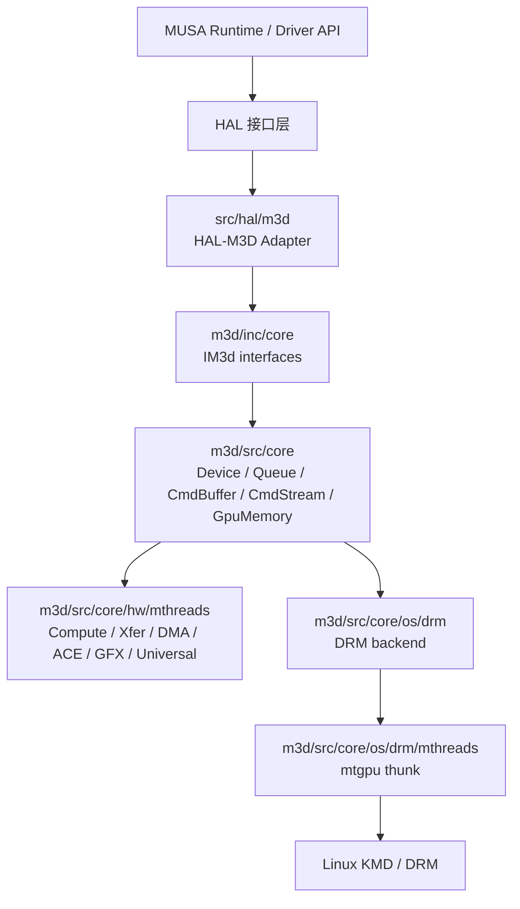
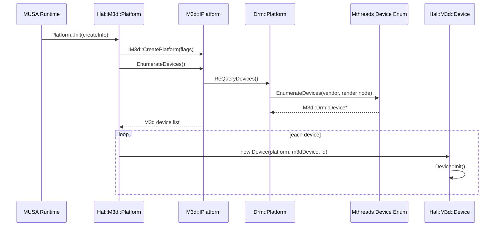
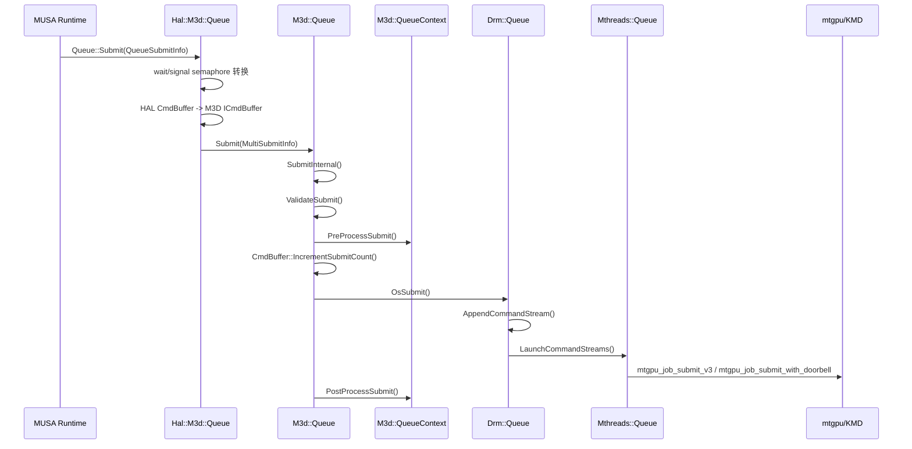
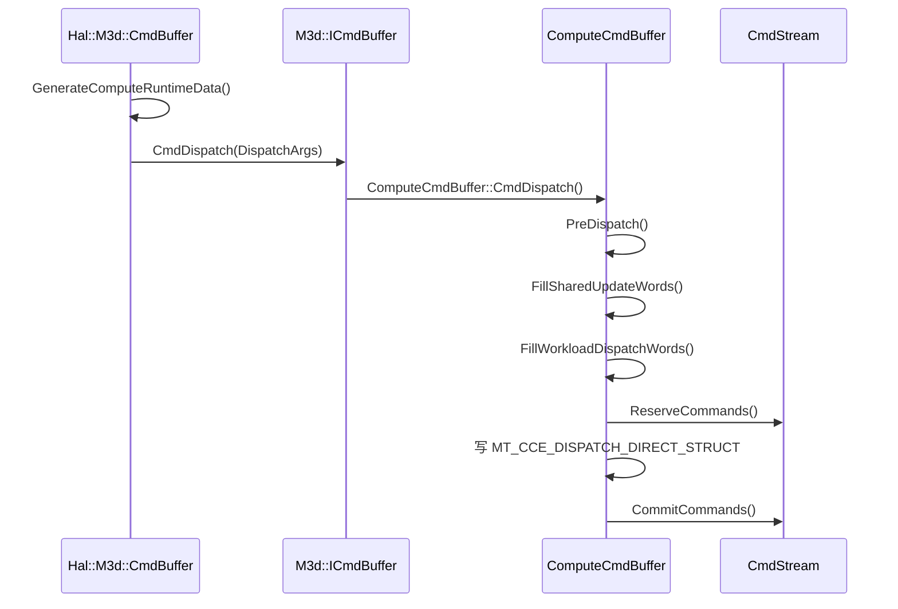
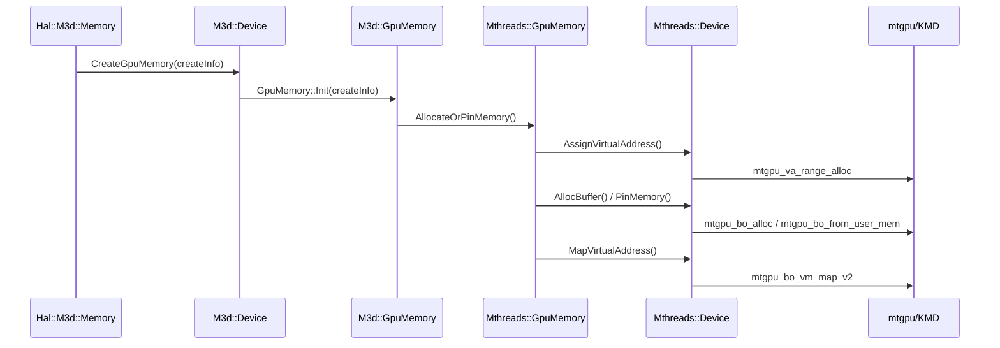

# M3D 技术洞察

## 路径确认

用户给出的远程路径为：

```text
/home/shanfeng/workspace/linux-ddk/musa/m3d
```

远程主机当前没有该目录。实际源码入口为：

```text
/home/shanfeng/workspace/linux-ddk/musa/src/hal/m3d
/home/shanfeng/workspace/linux-ddk/musa/src/hal/m3d/m3d
```

本地工作区对应路径为：

```text
linux-ddk/musa/src/hal/m3d
linux-ddk/musa/src/hal/m3d/m3d
```

其中 `src/hal/m3d` 是 MUSA HAL 到 M3D 的适配层，`src/hal/m3d/m3d` 是 M3D core 子树。

## 总体定位

M3D 位于 MUSA Runtime/Driver 与 KMD 之间，承担三类职责：

1. 把上层 HAL 对象转换成 M3D 对象，例如 `Hal::IQueue`、`Hal::ICmdBuffer`、`Hal::IMemory` 转换成 `M3d::IQueue`、`M3d::ICmdBuffer`、`M3d::IGpuMemory`。
2. 生成硬件命令流，例如 compute dispatch、copy、barrier、timestamp 等命令最终写入 `CmdStream`。
3. 通过 Linux DRM/MThreads 后端提交命令和管理显存，例如 BO 分配、VA 分配、VA map、job submit、doorbell submit。

M3D 不是内核驱动。它是用户态驱动中的硬件抽象层和命令构建层。KMD 的入口位于 `mtgpu_*` 函数，例如 `mtgpu_job_submit_v3`、`mtgpu_bo_vm_map_v2`、`mtgpu_va_range_alloc`。

## 目录分层

| 层级 | 路径 | 主要职责 |
|---|---|---|
| HAL 适配层 | `src/hal/m3d/*.cpp` | 面向 MUSA HAL 接口，实现 Device、Queue、CmdBuffer、Memory、Semaphore、Fence 等对象。 |
| M3D public interface | `src/hal/m3d/m3d/inc/core` | 定义 `IM3d::IDevice`、`IQueue`、`ICmdBuffer`、`IGpuMemory` 等公共接口和结构体。 |
| M3D core | `src/hal/m3d/m3d/src/core` | 实现 Device、Queue、CmdBuffer、CmdStream、CmdAllocator、GpuMemory 等核心对象。 |
| 硬件 IP 层 | `src/hal/m3d/m3d/src/core/hw/mthreads` | 按硬件引擎生成命令，包括 compute、xfer、dma、ace、gfx、universal、tce、codec、raytracing 等。 |
| OS 后端 | `src/hal/m3d/m3d/src/core/os/drm` | Linux DRM 通用后端。 |
| MThreads DRM 后端 | `src/hal/m3d/m3d/src/core/os/drm/mthreads` | 调用 `mtgpu` 用户态 thunk，与 KMD 交互。 |
| 调试与工具层 | `src/hal/m3d/m3d/src/core/layers` | cmd decoder、gpu profiler、trace capture、interface logger、threading 等装饰层。 |

## 架构图



## 模块拆解

### Platform

HAL Platform 负责创建 M3D Platform、枚举设备、构建 HAL Device 列表和 P2P 能力矩阵。

关键源码：

| 文件 | 位置 | 说明 |
|---|---:|---|
| `src/hal/m3d/platform.cpp` | 102 | `Platform::Init` 调用 `CreatePlatform` 和 `CreateDevices`。 |
| `src/hal/m3d/platform.cpp` | 116 | `CreatePlatform` 设置 M3D platform flags，包括 `disableGpuTimeout`、`enableSvmMode`、`enableUvaMode`、`enablePfmLayer`。 |
| `src/hal/m3d/platform.cpp` | 128 | `CreateDevices` 调用 `m_M3dPlatform->EnumerateDevices`，再逐个创建 `Hal::M3d::Device`。 |
| `src/hal/m3d/m3d/src/core/libInit.cpp` | 52 | `GetPlatformSize` 计算真实 platform 加各类 layer 所需空间。 |
| `src/hal/m3d/m3d/src/core/libInit.cpp` | 109 | `CreatePlatform` 是 M3D 对外的 platform 创建入口。 |
| `src/hal/m3d/m3d/src/core/platform.cpp` | 118 | `Platform::Create` 根据配置创建 real platform 或 null device platform。 |
| `src/hal/m3d/m3d/src/core/os/drm/platform.cpp` | 131 | DRM 后端扫描系统 DRM device。 |
| `src/hal/m3d/m3d/src/core/os/drm/platform.cpp` | 243 | 识别 MT 设备后调用 `M3d::Drm::Mthreads::EnumerateDevices`。 |

初始化时序：



### Device

HAL Device 是所有资源对象的工厂。它不直接写硬件命令，而是创建 Queue、CmdPool、CmdBuffer、Memory、Fence、Semaphore 等 HAL 对象，并在对象内部创建对应 M3D 对象。

关键源码：

| 文件 | 位置 | 说明 |
|---|---:|---|
| `src/hal/m3d/device.cpp` | 74 | `CreateQueue` 创建 HAL Queue 并执行 `Queue::Init`。 |
| `src/hal/m3d/device.cpp` | 91 | `CreateCmdPool` 创建命令池。 |
| `src/hal/m3d/device.cpp` | 102 | `CreateCmdBuffer` 创建命令缓冲。 |
| `src/hal/m3d/device.cpp` | 135 | `CreateFence` 创建 fence。 |
| `src/hal/m3d/device.cpp` | 149 | `CreateSemaphore` 创建 semaphore。 |
| `src/hal/m3d/device.cpp` | 169 | `CreateMemory` 创建显存或显存视图。 |
| `src/hal/m3d/device.cpp` | 350 | `Device::Init` 先调用 M3D `CommitSettingsAndInit`，再初始化属性、heap、queue family。 |
| `src/hal/m3d/device.cpp` | 728 | `InitProps` 从 M3D properties 生成 HAL device properties。 |
| `src/hal/m3d/device.cpp` | 1023 | `ConstructQueueFamilies` 根据芯片能力生成 CDM、TDM、CE、ACE、DMA、UNIVERSAL、MMU 队列族。 |
| `src/hal/m3d/device.cpp` | 1119 | `ConstructHeapInfos` 根据 M3D VA partition 生成 HAL heap 信息。 |

Device 初始化流程：

```text
Hal::M3d::Device::Init
  -> M3d::IDevice::CommitSettingsAndInit
     -> FinalizeMemoryHeapProperties
     -> FinalizeQueueProperties
     -> FinalizeFirmwareProperties
     -> LateInit
  -> InitProps
     -> M3d::IDevice::GetProperties
     -> 根据 familyId 获取 devcaps
     -> 生成 memory/compute/ip/texture/pci properties
  -> ConstructHeapInfos
     -> heap -> M3D VA partition
     -> 读取 VA base、VA size、page granularity
  -> ConstructQueueFamilies
     -> CDM/TDM/CE/ACE/DMA/UNIVERSAL/MMU
```

Queue family 的含义：

| Queue family | M3D queue type | M3D engine type | 典型用途 |
|---|---|---|---|
| CDM | `QueueTypeCompute` | `EngineTypeCompute` | kernel dispatch、compute 命令。 |
| TDM | `QueueTypeTransfer` | `EngineTypeTransfer` | transfer 引擎搬运。 |
| CE | `QueueTypeDma` | `EngineTypeDma` | copy engine 搬运。 |
| ACE | `QueueTypeAce` | `EngineTypeAce` | ACE 引擎命令。 |
| DMA | `QueueTypeHdma` | `EngineTypeHdma` | HDMA/DMA 相关路径。 |
| UNIVERSAL | `QueueTypeUniversal` | `EngineTypeUniversal` | compute、copy、graphics 混合提交。 |
| MMU | `QueueTypeCompute` | `EngineTypeCompute` | sparse binding / MMU 相关操作。 |

`ConstructQueueFamilies` 对 `major >= 3` 的非 DMA 队列增加 `queueCapabilityWriteTimestamp` 和 `queueCapabilityDmSemaphore` 能力。

### Queue

HAL Queue 负责把 HAL 的提交信息转换成 `IM3d::MultiSubmitInfo`。M3D Queue 负责校验、预处理、提交到 OS 后端、提交后处理。

关键源码：

| 文件 | 位置 | 说明 |
|---|---:|---|
| `src/hal/m3d/queue.cpp` | 94 | `Queue::Init` 根据 queue family 填充 `M3d::QueueCreateInfo`。 |
| `src/hal/m3d/queue.cpp` | 103 | CDM 映射到 compute queue，支持 user queue 和 doorbell。 |
| `src/hal/m3d/queue.cpp` | 117 | CE 映射到 DMA queue，也支持 user queue 和 doorbell。 |
| `src/hal/m3d/queue.cpp` | 159 | 调用 `GetQueueSize` 获取 M3D queue 对象大小。 |
| `src/hal/m3d/queue.cpp` | 166 | 调用 `CreateQueue` 创建 M3D queue。 |
| `src/hal/m3d/queue.cpp` | 178 | `Queue::Submit` 是 HAL 队列提交入口。 |
| `src/hal/m3d/queue.cpp` | 191 | Linux 下限制单次提交 wait/signal semaphore 数量。 |
| `src/hal/m3d/queue.cpp` | 276 | HAL cmd buffer 转换成 `IM3d::ICmdBuffer*`。 |
| `src/hal/m3d/queue.cpp` | 348 | 调用 `m_M3dQueue->Submit(m3dSubmitInfo)`。 |
| `src/hal/m3d/m3d/src/core/device.cpp` | 1049 | M3D `Device::CreateQueue` 构造 core queue。 |
| `src/hal/m3d/m3d/src/core/queue.cpp` | 150 | M3D `Queue::Submit` 入口。 |
| `src/hal/m3d/m3d/src/core/queue.cpp` | 1393 | `SubmitInternal` 构造 internal submit info。 |
| `src/hal/m3d/m3d/src/core/queue.cpp` | 1427 | `SubmitCommandBuffer` 完成 preprocess、fence 关联、OS submit、postprocess。 |

提交时序：



提交路径中的关键数据：

| 数据 | 来源 | 传递位置 | 作用 |
|---|---|---|---|
| `ppCmdBuffers` | HAL `QueueSubmitInfo` | `IM3d::PerSubQueueSubmitInfo` | 指向要执行的 M3D cmd buffer。 |
| `submissionHash[0]` | HAL `submissionId` | M3D submit info / KMD submit | 用作提交标识。 |
| wait semaphore | HAL wait list | M3D check semaphores | 提交前等待。 |
| signal semaphore | HAL signal list | M3D update semaphores | 提交完成后更新。 |
| fence | HAL fence | M3D fence list | CPU 侧等待提交完成。 |
| `m_firstCmdStreamAddr` | cmd buffer stream | DRM queue | 命令流 GPU VA。 |
| `m_firstCmdStreamSize` | cmd buffer stream | DRM queue | 命令流大小。 |

### CmdPool 和 CmdAllocator

HAL `CmdPool` 对应 M3D `CmdAllocator`。命令池根据 queue family 选择 engine type，并使用 M3D device properties 中的 `preferredCmdAllocInfo` 设置 command data、embedded data、scratch 等分配参数。

关键源码：

| 文件 | 位置 | 说明 |
|---|---:|---|
| `src/hal/m3d/cmdPool.cpp` | 23 | `CmdPool::Init` 保存 queue family index。 |
| `src/hal/m3d/cmdPool.cpp` | 35 | 根据 queue family 映射 engine type。 |
| `src/hal/m3d/cmdPool.cpp` | 53 | 使用 `engineProperties[engineType].preferredCmdAllocInfo`。 |
| `src/hal/m3d/cmdPool.cpp` | 66 | `GetCmdAllocatorSize` 获取对象大小。 |
| `src/hal/m3d/cmdPool.cpp` | 71 | `CreateCmdAllocator` 创建 M3D allocator。 |
| `src/hal/m3d/cmdPool.cpp` | 81 | `GetExternalAllocator` 为 cmd buffer begin 阶段提供临时 CPU allocator。 |

执行流程：

```text
Device::CreateCmdPool
  -> new Hal::M3d::CmdPool
  -> CmdPool::Init
     -> queue family -> M3D engine type
     -> 读取 preferredCmdAllocInfo
     -> M3d::IDevice::GetCmdAllocatorSize
     -> M3d::IDevice::CreateCmdAllocator
     -> 创建 external allocator 池
```

### CmdBuffer 和 CmdStream

HAL `CmdBuffer` 是命令录制入口。M3D `CmdStream` 是硬件命令的连续存储，按 chunk 管理命令空间。

关键源码：

| 文件 | 位置 | 说明 |
|---|---:|---|
| `src/hal/m3d/cmdBuffer.cpp` | 72 | `CmdBuffer::Init` 根据 queue family 创建 M3D cmd buffer。 |
| `src/hal/m3d/cmdBuffer.cpp` | 138 | `Begin` 调用 `m_M3dCmdBuffer->Begin`。 |
| `src/hal/m3d/cmdBuffer.cpp` | 180 | compute/universal command buffer 绑定 border color palette。 |
| `src/hal/m3d/cmdBuffer.cpp` | 191 | `End` 调用 `m_M3dCmdBuffer->End` 并回收 external allocator。 |
| `src/hal/m3d/m3d/src/core/cmdStream.h` | 96 | `CmdStream` 管理硬件命令流。 |
| `src/hal/m3d/m3d/src/core/cmdStream.h` | 101 | `CmdStream` 不理解具体硬件命令，只分配命令空间。 |
| `src/hal/m3d/m3d/src/core/cmdStream.cpp` | 99 | `ReserveCommands` 预留命令空间。 |
| `src/hal/m3d/m3d/src/core/cmdStream.cpp` | 128 | `CommitCommands` 提交已写入的 DWORD 数。 |
| `src/hal/m3d/m3d/src/core/cmdStream.cpp` | 220 | `GetNextChunk` 从 retained list 或 allocator 获取新 chunk。 |
| `src/hal/m3d/m3d/src/core/cmdStream.cpp` | 444 | `End` finalize 所有 chunk。 |
| `src/hal/m3d/m3d/src/core/cmdStream.cpp` | 488 | `IncrementSubmitCount` 更新 root chunk 提交计数。 |

命令录制流程：

```text
CmdBuffer::Begin
  -> 获取 external allocator
  -> M3d::ICmdBuffer::Begin
  -> 对 compute/universal 绑定必要状态

CmdBuffer::Cmd*
  -> 组装 M3D 参数
  -> 调用 M3D ICmdBuffer::Cmd*
  -> 进入具体硬件 IP cmd buffer
  -> CmdStream::ReserveCommands
  -> 写硬件命令结构体
  -> CmdStream::CommitCommands

CmdBuffer::End
  -> M3d::ICmdBuffer::End
  -> CmdStream::End
  -> chunk FinalizeCommands
  -> 回收 external allocator
```

`ReserveCommands` 和 `CommitCommands` 的关系：

```text
uint32* p = CmdStream::ReserveCommands();
写入硬件命令结构体到 p
p += 实际写入的 DWORD 数;
CmdStream::CommitCommands(p);
```

`ReserveCommands` 每次预留 `m_reserveLimit` 大小的空间。`CommitCommands` 根据结束指针计算实际使用的 DWORD 数，并回收未使用空间。chunk 空间不足时，`GetNextChunk` 从 allocator 获取新 chunk，并把旧 chunk 结束。

### Compute Dispatch

HAL `CmdDispatch` 把 MUSA kernel launch 参数转成 M3D `DispatchArgs`。M3D compute IP 再把 `DispatchArgs` 写成硬件 dispatch 命令。

关键源码：

| 文件 | 位置 | 说明 |
|---|---:|---|
| `src/hal/m3d/cmdBuffer.cpp` | 336 | HAL `CmdDispatch` 入口。 |
| `src/hal/m3d/cmdBuffer.cpp` | 351 | `workgroupCount` 转成 `dispatchArgs.numGroup`。 |
| `src/hal/m3d/cmdBuffer.cpp` | 353 | `workgroupSize` 转成 `dispatchArgs.groupSize`。 |
| `src/hal/m3d/cmdBuffer.cpp` | 357 | 设置 dynamic shared memory size。 |
| `src/hal/m3d/cmdBuffer.cpp` | 358 | 调用 `m_M3dCmdBuffer->CmdDispatch(dispatchArgs)`。 |
| `src/hal/m3d/m3d/src/core/hw/mthreads/computeip/compute4/computeCmdBuffer.cpp` | 1012 | compute4 `CmdDispatch`。 |
| `src/hal/m3d/m3d/src/core/hw/mthreads/computeip/compute4/computeCmdBuffer.cpp` | 1022 | `PreDispatch`。 |
| `src/hal/m3d/m3d/src/core/hw/mthreads/computeip/compute4/computeCmdBuffer.cpp` | 1027 | 填充 shared update words。 |
| `src/hal/m3d/m3d/src/core/hw/mthreads/computeip/compute4/computeCmdBuffer.cpp` | 1030 | pipeline 填充 workload dispatch words。 |
| `src/hal/m3d/m3d/src/core/hw/mthreads/computeip/compute4/computeCmdBuffer.cpp` | 1360 | `WriteDispatchDirect` 写 dispatch 命令。 |
| `src/hal/m3d/m3d/src/core/hw/mthreads/computeip/compute4/computeCmdBuffer.cpp` | 1372 | `workgroup_x = numGroup.width - 1`。 |

最小例子：

```cpp
// 上层 kernel launch 的关键参数
DispatchParameter param{};
param.workgroupCount = {2, 1, 1};
param.workgroupSize  = {256, 1, 1};
param.blockClusterSize = {1, 1, 1};

cmdBuffer->CmdDispatch(param);
```

对应执行结果：

```text
HAL DispatchArgs:
  numGroup  = {2, 1, 1}
  groupSize = {256, 1, 1}

compute4 WriteDispatchDirect 写入硬件字段:
  workgroup_x = 2 - 1 = 1
  workgroup_y = 1 - 1 = 0
  workgroup_z = 1 - 1 = 0
```

硬件命令使用减一编码。源码在 `WriteDispatchDirect` 中明确将 `dispatchArgs.numGroup.width/height/depth` 分别减 1 后写入 `MT_CCE_DISPATCH_DIRECT_STRUCT`。

Dispatch 详细时序：



### Copy Memory

HAL `CmdCopyMemory` 负责处理 HAL memory offset、copy region 和 engine 选择。真正的 copy 命令由 M3D 的具体 IP 实现。

关键源码：

| 文件 | 位置 | 说明 |
|---|---:|---|
| `src/hal/m3d/cmdBuffer.cpp` | 446 | HAL `CmdCopyMemory` 入口。 |
| `src/hal/m3d/cmdBuffer.cpp` | 463 | 源 offset 加上 memory 自身 offset。 |
| `src/hal/m3d/cmdBuffer.cpp` | 464 | 目的 offset 加上 memory 自身 offset。 |
| `src/hal/m3d/cmdBuffer.cpp` | 474 | 调用 `m_M3dCmdBuffer->CmdCopyMemory`。 |
| `src/hal/m3d/cmdBuffer.cpp` | 480 | 根据 `engineType` 和 cmd buffer layout 选择 layout engine。 |
| `src/hal/m3d/m3d/src/core/hw/mthreads/universalip/universal2/universalCmdBuffer.cpp` | 183 | universal cmd buffer 的 copy 分发。 |
| `src/hal/m3d/m3d/src/core/hw/mthreads/universalip/universal2/universalCmdBuffer.cpp` | 191 | 根据 engine mask 选择 sub command buffer。 |
| `src/hal/m3d/m3d/src/core/hw/mthreads/xferip/xfer1/transferCmdBuffer.cpp` | 210 | TDM transfer copy 写 `MT_TDM_CMD_COPY_STRUCT`。 |
| `src/hal/m3d/m3d/src/core/hw/mthreads/dmaip/dma1/copyCmdBuffer.cpp` | 119 | CE/DMA copy 命令入口。 |
| `src/hal/m3d/m3d/src/core/hw/mthreads/dmaip/dma1/copyCmdBuffer.cpp` | 154 | CE/DMA copy 使用 `ReserveCommands`。 |
| `src/hal/m3d/m3d/src/core/hw/mthreads/dmaip/dma1/copyCmdBuffer.cpp` | 158 | 写 `MT_CE_CMD_COPY_STRUCT`。 |

最小例子：

```cpp
CopyMemoryParameter param{};
param.pSrcMemory = src;
param.pDstMemory = dst;
param.regionCount = 1;
param.copyRegions[0] = {
    .srcOffset = 64,
    .dstOffset = 128,
    .copySize  = 4096,
};
param.engineType = engineTypeCe;

cmdBuffer->CmdCopyMemory(param);
```

如果 `src` 本身是子分配，`src->GetOffset() = 1024`；`dst->GetOffset() = 2048`，则 HAL 传给 M3D 的 region 为：

```text
srcOffset = 64  + 1024 = 1088
dstOffset = 128 + 2048 = 2176
copySize  = 4096
```

随后：

```text
HAL CmdCopyMemory
  -> M3D CmdCopyMemory
  -> universal cmd buffer 根据 engine mask 选择 compute / transfer / dma
  -> 对应 IP 写硬件 copy 命令
  -> CmdStream Reserve / Commit
```

### Memory

HAL Memory 负责显存类型选择、参数校验和视图打开。M3D GpuMemory 负责 VA、BO、map、pin、export/import。

关键源码：

| 文件 | 位置 | 说明 |
|---|---:|---|
| `src/hal/m3d/memory.cpp` | 115 | `Memory::Init` 根据 memory type 分发。 |
| `src/hal/m3d/memory.cpp` | 130 | device local memory 走 `InitGeneralDeviceMemory`。 |
| `src/hal/m3d/memory.cpp` | 134 | host memory 走 `InitGeneralHostMemory`。 |
| `src/hal/m3d/memory.cpp` | 144 | prealloc memory view。 |
| `src/hal/m3d/memory.cpp` | 147 | locked host memory view。 |
| `src/hal/m3d/memory.cpp` | 153 | shared memory view。 |
| `src/hal/m3d/memory.cpp` | 156 | peer memory view。 |
| `src/hal/m3d/memory.cpp` | 159 | external memory view。 |
| `src/hal/m3d/memory.cpp` | 366 | device local allocation 创建 M3D `GpuMemoryCreateInfo`。 |
| `src/hal/m3d/memory.cpp` | 417 | `CreateGpuMemory` 创建 M3D GPU memory。 |
| `src/hal/m3d/memory.cpp` | 428 | host allocation 创建 GART 或 SVM memory。 |
| `src/hal/m3d/memory.cpp` | 479 | SVM host memory 调用 `CreateSvmGpuMemory`。 |
| `src/hal/m3d/virtualMemory.cpp` | 21 | virtual memory reservation。 |
| `src/hal/m3d/virtualMemory.cpp` | 62 | virtual memory 设置 `svmAlloc` 和 `virtualAlloc`。 |
| `src/hal/m3d/virtualMemory.cpp` | 73 | 调用 `CreateGpuMemory` 预留 VA。 |

device local memory 流程：

```text
Memory::Init(memoryTypeAlloc, memoryAllocTypeDeviceLocal)
  -> ValidateCreateInfo
  -> InitGeneralDeviceMemory
     -> alignment = max(HAL alignment, capability alignment)
     -> heap = GpuHeapLocal
     -> heapAccess = explicit
     -> flags.peerWritable = canMapPeerMemory
     -> Linux: physicalAlloc / discontinuousAlloc
     -> vaRange = Svm 或 Default
     -> flags.globalGpuVa = unifiedAddressing
     -> M3D GetGpuMemorySize
     -> M3D CreateGpuMemory
```

host memory 流程：

```text
Memory::Init(memoryTypeAlloc, memoryAllocTypeHost)
  -> InitGeneralHostMemory
     -> 如果请求 SharedVirtualAddress:
          CreateSvmGpuMemory
          heap = GpuHeapGartUswc 或 GpuHeapGartCacheable
          globalGpuVa = 1
     -> 否则:
          CreateGpuMemory
          heap = GART cacheable / GART USWC
```

virtual memory 流程：

```text
Platform::CreateMemory(memoryTypeVirtual)
  -> new VirtualMemory
  -> VirtualMemory::InitInternal
     -> 检查 unified addressing
     -> 检查 size/address 按 host page 对齐
     -> GpuMemoryCreateInfo
        flags.svmAlloc = 1
        flags.virtualAlloc = 1
        flags.globalGpuVa = unifiedAddressing
     -> M3D CreateGpuMemory
     -> 保存 Desc().gpuVirtAddr
```

### MemoryPool 和 MemMgr

HAL 内部包含一层显存池。它的作用是减少小块分配直接打到 M3D/KMD 的次数，并对 chunk 做子分配。

关键源码：

| 文件 | 位置 | 说明 |
|---|---:|---|
| `src/hal/m3d/memMgr.cpp` | 81 | `MemMgr::Allocate` 查找或创建 memory pool。 |
| `src/hal/m3d/memMgr.cpp` | 122 | 没有合适 pool 时创建 `MemoryPoolCreateInfo`。 |
| `src/hal/m3d/memMgr.cpp` | 144 | 调用 `pPool->FullAllocate`。 |
| `src/hal/m3d/memoryPool.cpp` | 82 | `FullAllocate` 先尝试子分配，失败后扩展 chunk。 |
| `src/hal/m3d/memoryPool.cpp` | 97 | `SubAllocate` 查找 free bucket 并切分 segment。 |
| `src/hal/m3d/memoryPool.cpp` | 153 | `ChunkAllocate` 创建新的底层 chunk memory。 |
| `src/hal/m3d/memoryPool.cpp` | 214 | `Free` 释放子分配并尝试合并左右空闲 segment。 |

最小例子：

```text
请求 4KB device local memory
  -> MemMgr::Allocate
  -> 当前没有合适 pool
  -> CreatePoolNoLock
  -> MemoryPool::FullAllocate
  -> SubAllocate 失败
  -> ChunkAllocate 分配一个较大 chunk
  -> SubAllocate 从 chunk 中切出 4KB
```

释放时：

```text
MemMgr::Free
  -> 根据 memory heap/property 找到 pool
  -> MemoryPool::Free
  -> 标记 segment 空闲
  -> 尝试与左、右空闲 segment 合并
```

### M3D GpuMemory 到 KMD

M3D core 的 `GpuMemory` 做统一校验和描述符维护，MThreads 后端负责实际 BO、VA、map 操作。

关键源码：

| 文件 | 位置 | 说明 |
|---|---:|---|
| `src/hal/m3d/m3d/src/core/device.cpp` | 1265 | `CreateGpuMemory` 构造 `GpuMemory` 并调用 `Init`。 |
| `src/hal/m3d/m3d/src/core/device.cpp` | 1302 | `CreateSvmGpuMemory` 构造 SVM memory。 |
| `src/hal/m3d/m3d/src/core/gpuMemory.cpp` | 199 | `GpuMemory::Map` 处理 pinned、virtual、SVM、CPU visible 等情况。 |
| `src/hal/m3d/m3d/src/core/gpuMemory.cpp` | 950 | 普通 `GpuMemory::Init` 处理 shared / normal allocation。 |
| `src/hal/m3d/m3d/src/core/gpuMemory.cpp` | 1038 | 调用 `AllocateOrPinMemory`。 |
| `src/hal/m3d/m3d/src/core/gpuMemory.cpp` | 1094 | SVM memory 初始化。 |
| `src/hal/m3d/m3d/src/core/gpuMemory.cpp` | 1188 | pinned system memory 初始化。 |
| `src/hal/m3d/m3d/src/core/os/drm/mthreads/mtgpuMemory.cpp` | 387 | MThreads `AllocateOrPinMemory`。 |
| `src/hal/m3d/m3d/src/core/os/drm/mthreads/mtgpuMemory.cpp` | 431 | SVM VA 分配。 |
| `src/hal/m3d/m3d/src/core/os/drm/mthreads/mtgpuMemory.cpp` | 456 | 普通 memory 分配 GPU VA。 |
| `src/hal/m3d/m3d/src/core/os/drm/mthreads/mtgpuMemory.cpp` | 507 | pinned memory 调用 `PinMemory`。 |
| `src/hal/m3d/m3d/src/core/os/drm/mthreads/mtgpuMemory.cpp` | 687 | 普通 BO 分配调用 `AllocBuffer`。 |
| `src/hal/m3d/m3d/src/core/os/drm/mthreads/mtgpuMemory.cpp` | 705 | BO 映射到 GPU VA。 |
| `src/hal/m3d/m3d/src/core/os/drm/mthreads/mtgpuDevice.cpp` | 1051 | `PinMemory` 调用 mtgpu user memory pin 接口。 |
| `src/hal/m3d/m3d/src/core/os/drm/mthreads/mtgpuDevice.cpp` | 1402 | `MapVirtualAddress` 调用 `mtgpu_bo_vm_map_v2`。 |
| `src/hal/m3d/m3d/src/core/os/drm/mthreads/mtgpuDevice.cpp` | 1537 | `AssignVirtualAddress` 调用 `mtgpu_va_range_alloc`。 |

显存分配时序：



### Semaphore 和 Fence

Semaphore 主要用于 GPU 队列间同步，Fence 主要用于 CPU 等待提交完成。

关键源码：

| 文件 | 位置 | 说明 |
|---|---:|---|
| `src/hal/m3d/semaphore.cpp` | 122 | `Semaphore::Init` 根据类型创建或打开 semaphore。 |
| `src/hal/m3d/semaphore.cpp` | 134 | Timeline semaphore 设置 `timeline` 和 `maxCount`。 |
| `src/hal/m3d/semaphore.cpp` | 138 | Hardware semaphore 设置 `hwSignalWait`。 |
| `src/hal/m3d/semaphore.cpp` | 145 | `GetQueueSemaphoreSize`。 |
| `src/hal/m3d/semaphore.cpp` | 148 | `CreateQueueSemaphore`。 |
| `src/hal/m3d/semaphore.cpp` | 47 | CPU 侧 wait 通过循环 Query 实现。 |
| `src/hal/m3d/fence.cpp` | 13 | `Fence::Init` 创建 M3D fence。 |
| `src/hal/m3d/fence.cpp` | 31 | `Fence::GetStatus` 查询 M3D fence 状态。 |
| `src/hal/m3d/m3d/src/core/device.cpp` | 2719 | M3D `GetQueueSemaphoreSize`。 |
| `src/hal/m3d/m3d/src/core/device.cpp` | 2741 | M3D `CreateQueueSemaphore`。 |
| `src/hal/m3d/m3d/src/core/os/drm/mthreads/mtgpuDevice.cpp` | 1872 | 提交 signal semaphore task。 |
| `src/hal/m3d/m3d/src/core/os/drm/mthreads/mtgpuDevice.cpp` | 1904 | 提交 wait semaphore task。 |

同步执行路径：

```text
创建 semaphore:
  Hal::M3d::Semaphore::Init
    -> M3d::IDevice::GetQueueSemaphoreSize
    -> M3d::IDevice::CreateQueueSemaphore

提交时等待/触发:
  Hal::M3d::Queue::Submit
    -> wait semaphore 转为 checkSemaphores
    -> signal semaphore 转为 updateSemaphores
    -> M3d::Queue::Submit
    -> Mthreads::Queue::LaunchCommandStreams
    -> mtgpu_job_submit_v3 携带 check/update semaphore

超出单次提交限制:
  Hal::M3d::Queue::Submit
    -> WaitQueueSemaphore / SignalQueueSemaphore 单独提交
```

### DRM/MThreads 提交后端

M3D 的 Linux 提交路径分为两段：DRM queue 提取 command stream 地址和大小，MThreads queue 调用 KMD submit 接口。

关键源码：

| 文件 | 位置 | 说明 |
|---|---:|---|
| `src/hal/m3d/m3d/src/core/os/drm/queue.cpp` | 143 | `Drm::Queue::OsSubmit`。 |
| `src/hal/m3d/m3d/src/core/os/drm/queue.cpp` | 166 | `OsSubmitInternal` 根据 queue type 分发。 |
| `src/hal/m3d/m3d/src/core/os/drm/queue.cpp` | 400 | `AppendCommandStream` 提取 cmd stream submission info。 |
| `src/hal/m3d/m3d/src/core/os/drm/queue.cpp` | 412 | 保存 `m_firstCmdStreamAddr`。 |
| `src/hal/m3d/m3d/src/core/os/drm/queue.cpp` | 413 | 保存 `m_firstCmdStreamSize`。 |
| `src/hal/m3d/m3d/src/core/os/drm/mthreads/mtgpuQueue.cpp` | 443 | MThreads `LaunchCommandStreams`。 |
| `src/hal/m3d/m3d/src/core/os/drm/mthreads/mtgpuQueue.cpp` | 488 | 准备 semaphore check/update 数据。 |
| `src/hal/m3d/m3d/src/core/os/drm/mthreads/mtgpuQueue.cpp` | 559 | doorbell 路径调用 `SubmitCommandsWithDoorbell`。 |
| `src/hal/m3d/m3d/src/core/os/drm/mthreads/mtgpuQueue.cpp` | 589 | 普通路径调用 `SubmitCommandsV3`。 |
| `src/hal/m3d/m3d/src/core/os/drm/mthreads/mtgpuDevice.cpp` | 6082 | `SubmitCommandsV3` 调用 `pfnMtgpuCsSubmitV3`。 |
| `src/hal/m3d/m3d/src/core/os/drm/mthreads/mtgpuDevice.cpp` | 6124 | `SubmitCommandsWithDoorbell` 调用 `pfnMtgpuCsSubmitWithDoorbell`。 |
| `src/hal/m3d/m3d/src/core/os/drm/mthreads/mtgpuLoader.cpp` | 89 | `pfnMtgpuCsSubmitV3` 绑定到 `mtgpu_job_submit_v3`。 |
| `src/hal/m3d/m3d/src/core/os/drm/mthreads/mtgpuLoader.cpp` | 90 | `pfnMtgpuCsSubmitWithDoorbell` 绑定到 `mtgpu_job_submit_with_doorbell`。 |

普通 submit 和 doorbell submit 的差异：

| 路径 | 触发条件 | KMD 入口 | 参数特点 |
|---|---|---|---|
| 普通 submit | `hDoorbell == 0` | `mtgpu_job_submit_v3` | 携带 command stream VA/size、semaphore、buffer sync fd、submission flags、submission id。 |
| doorbell submit | `hDoorbell != 0` | `mtgpu_job_submit_with_doorbell` | 携带 command stream VA/size、semaphore、submission id、doorbell handle。 |
| doorbell ring | append 模式下已有 doorbell | `mtgpu_job_doorbell_ring` | 不重新提交完整 command stream，只 ring doorbell。 |

## 典型端到端流程

### 例子 1：创建 CDM queue

输入：

```text
QueueCreateInfo:
  familyIndex = CDM 所在 index
  priority    = queuePriorityMedium
```

执行流程：

```text
Hal::M3d::Device::CreateQueue
  -> new Hal::M3d::Queue
  -> Queue::Init
     -> family name == "CDM"
     -> queueType  = M3d::QueueTypeCompute
     -> engineType = M3d::EngineTypeCompute
     -> userQueue  = IsUserQueue()
     -> doorbell   = UseDoorbell()
     -> robustConfig.mmuStatus = 1
     -> robustConfig.exeUnitStatus = 1
     -> robustConfig.mpException = 1
     -> robustConfig.mssError = 1
     -> GetQueueSize
     -> CreateQueue
        -> M3d::Device::CreateQueue
        -> M3d::Queue::Init
        -> ComputeDevice::CreateQueueContext
        -> QueueContext::FinalizeContext
```

输出：

```text
Hal::M3d::Queue:
  m_M3dQueue 指向 M3D core queue
  queue context 已根据 Compute engine 创建
```

### 例子 2：一次 kernel dispatch 的完整路径

输入：

```text
workgroupCount = {2, 1, 1}
workgroupSize  = {256, 1, 1}
dynamicShared  = 0
```

执行流程：

```text
Hal::M3d::CmdBuffer::CmdDispatch
  -> GenerateComputeRuntimeData
  -> dispatchArgs.numGroup = {2,1,1}
  -> dispatchArgs.groupSize = {256,1,1}
  -> M3d::ICmdBuffer::CmdDispatch
  -> ComputeCmdBuffer::CmdDispatch
     -> PreDispatch
     -> FillSharedUpdateWords
     -> FillWorkloadDispatchWords
     -> WriteDispatchDirect
        -> ReserveCommands
        -> workgroup_x = 1
        -> workgroup_y = 0
        -> workgroup_z = 0
        -> CommitCommands
```

输出：

```text
CmdStream 中新增一个 compute dispatch 硬件命令。
该命令提交后，KMD 看到的是 command stream GPU VA 和 command stream size，不再看到 HAL DispatchParameter。
```

### 例子 3：一次 device local memory 分配

输入：

```text
MemoryCreateInfo:
  type = memoryTypeAlloc
  alloc.type = memoryAllocTypeDeviceLocal
  alloc.size = 4096
  alloc.heap = largePage 或 general
```

执行流程：

```text
Hal::M3d::Memory::Init
  -> InitGeneralDeviceMemory
     -> 构造 M3d::GpuMemoryCreateInfo
     -> heap = GpuHeapLocal
     -> vaRange = Svm 或 Default
     -> GetGpuMemorySize
     -> CreateGpuMemory
        -> M3d::GpuMemory::Init
        -> Mthreads::GpuMemory::AllocateOrPinMemory
           -> AssignVirtualAddress
              -> mtgpu_va_range_alloc
           -> AllocBuffer
              -> mtgpu BO allocate
           -> MapVirtualAddress
              -> mtgpu_bo_vm_map_v2
```

输出：

```text
Memory::GetDeviceVirtualAddress()
  -> M3D GpuMemory Desc().gpuVirtAddr + HAL memory offset
```

### 例子 4：一次 queue submit

输入：

```text
QueueSubmitInfo:
  cmdBufferCount = 1
  ppCmdBuffers[0] = 已 End 的 cmd buffer
  waitSemaphoreCount = 1
  signalSemaphoreCount = 1
  pFence = fence
  submissionId = 100
```

执行流程：

```text
Hal::M3d::Queue::Submit
  -> wait semaphore 转成 M3D wait queue semaphore
  -> signal semaphore 转成 M3D signal queue semaphore
  -> HAL cmd buffer 转成 M3D cmd buffer
  -> submissionHash[0] = 100
  -> fence 转成 M3D fence
  -> M3D Queue::Submit
     -> SubmitInternal
     -> SubmitCommandBuffer
        -> ValidateSubmit
        -> QueueContext::PreProcessSubmit
        -> CmdBuffer::IncrementSubmitCount
        -> Fence::AssociateWithContext
        -> Drm::Queue::OsSubmit
           -> AppendCommandStream
           -> Mthreads::Queue::LaunchCommandStreams
              -> SubmitCommandsV3 或 SubmitCommandsWithDoorbell
        -> QueueContext::PostProcessSubmit
```

输出：

```text
KMD submit 看到:
  command stream GPU VA
  command stream size
  check semaphores
  update semaphores
  buffer sync fds
  submission flags
  submission id
```

## 关键设计点

### 1. HAL 与 M3D core 之间使用 placement object

HAL 对象创建 M3D 对象前会先调用 `Get*Size` 获取对象大小，再由 `OwnPtr` 或 placement memory 保存对象。

典型模式：

```text
size = m3dDevice->GetQueueSize(createInfo, &result)
storage.Reserve(size)
m3dDevice->CreateQueue(createInfo, storage.GetAlloc(), &storage())
```

这种设计把对象内存分配权留在调用侧，M3D core 只在给定内存上构造对象。

### 2. 命令参数在 HAL 层结束，硬件命令在 IP 层生成

以 dispatch 为例：

```text
HAL 层:
  DispatchParameter -> DispatchArgs

M3D compute IP:
  DispatchArgs -> MT_CCE_DISPATCH_DIRECT_STRUCT

DRM/MThreads:
  command stream VA/size -> KMD submit
```

KMD 不处理 `DispatchParameter`，它只接收已经写好的命令流。

### 3. CmdStream 只管理空间，不理解具体命令语义

`CmdStream` 的核心职责是 chunk 管理、命令空间预留、提交大小计算、chunk finalize。具体硬件命令由 compute、xfer、dma、ace、gfx 等 IP 层写入。

### 4. Memory 分配分为 VA 和 BO 两个动作

普通 device local allocation 不是单一动作。核心步骤包括：

```text
分配 GPU VA
分配或 pin BO
把 BO 映射到 GPU VA
```

对应 KMD 入口包括：

```text
mtgpu_va_range_alloc
mtgpu_bo_alloc / mtgpu_bo_from_user_mem
mtgpu_bo_vm_map_v2
```

### 5. Queue submit 的核心交付物是 command stream

HAL submit 传入的是 cmd buffer、semaphore、fence。到 DRM/MThreads 后端时，关键交付物变成：

```text
submissionVirtAddr = command stream GPU VA
submissionSize     = command stream size
```

这也是分析 GPU command stream 问题时最重要的两个字段。

## 建议插桩点

用于端到端确认 M3D 调用链时，可以优先在以下位置加低开销日志。日志应默认关闭，通过环境变量或 compile flag 打开，避免影响性能。

| 模块 | 建议位置 | 观察字段 |
|---|---|---|
| Platform | `Hal::M3d::Platform::CreateDevices` | device count、render node、device id。 |
| Device init | `Hal::M3d::Device::Init` | device id、familyId、queue family 列表、heap VA range。 |
| Queue create | `Hal::M3d::Queue::Init` | family name、queue type、engine type、userQueue、doorbell。 |
| CmdBuffer begin/end | `Hal::M3d::CmdBuffer::Begin/End` | queue family、layout engine、recording state。 |
| Dispatch | `Hal::M3d::CmdBuffer::CmdDispatch` | numGroup、groupSize、dynamicShared、kernel name/hash。 |
| CmdStream | `CmdStream::ReserveCommands/CommitCommands` | reserve limit、used dwords、chunk GPU VA。 |
| Queue submit | `Hal::M3d::Queue::Submit` | cmdBufferCount、wait/signal count、fence、submissionId。 |
| Core submit | `M3d::Queue::SubmitCommandBuffer` | preprocess result、submit flags、fence count。 |
| DRM submit | `Drm::Queue::AppendCommandStream` | `m_firstCmdStreamAddr`、`m_firstCmdStreamSize`。 |
| MThreads submit | `Mthreads::Queue::LaunchCommandStreams` | hContext、hDoorbell、submissionFlags、semaphore count。 |
| KMD thunk | `Mthreads::Device::SubmitCommandsV3` | submission VA、size、flags、id。 |
| Memory allocation | `Hal::M3d::Memory::InitGeneralDeviceMemory` | size、alignment、heap、property。 |
| BO/VA map | `Mthreads::GpuMemory::AllocateOrPinMemory` | VA、BO handle、map size、page size、map flags。 |

## 阅读源码的主线

建议按以下顺序阅读，能覆盖 M3D 的主要执行路径：

1. `src/hal/m3d/platform.cpp`
2. `src/hal/m3d/device.cpp`
3. `src/hal/m3d/queue.cpp`
4. `src/hal/m3d/cmdPool.cpp`
5. `src/hal/m3d/cmdBuffer.cpp`
6. `src/hal/m3d/memory.cpp`
7. `src/hal/m3d/memMgr.cpp`
8. `src/hal/m3d/memoryPool.cpp`
9. `src/hal/m3d/semaphore.cpp`
10. `src/hal/m3d/fence.cpp`
11. `src/hal/m3d/m3d/src/core/device.cpp`
12. `src/hal/m3d/m3d/src/core/queue.cpp`
13. `src/hal/m3d/m3d/src/core/cmdStream.cpp`
14. `src/hal/m3d/m3d/src/core/gpuMemory.cpp`
15. `src/hal/m3d/m3d/src/core/hw/mthreads/computeip/compute4/computeCmdBuffer.cpp`
16. `src/hal/m3d/m3d/src/core/os/drm/queue.cpp`
17. `src/hal/m3d/m3d/src/core/os/drm/mthreads/mtgpuQueue.cpp`
18. `src/hal/m3d/m3d/src/core/os/drm/mthreads/mtgpuDevice.cpp`
19. `src/hal/m3d/m3d/src/core/os/drm/mthreads/mtgpuMemory.cpp`

## 总结

M3D 的核心不是单个 API，而是一条完整的用户态驱动链路：

```text
HAL object
  -> M3D core object
  -> hardware IP command generation
  -> CmdStream chunk
  -> DRM/MThreads submit
  -> mtgpu KMD thunk
```

分析 M3D 问题时，需要先判断问题位于哪一段：

| 问题类型 | 优先检查位置 |
|---|---|
| device 初始化失败 | Platform 枚举、Device::Init、M3D properties、queue family、heap info。 |
| kernel launch 参数异常 | HAL `CmdDispatch`、compute IP `WriteDispatchDirect`。 |
| copy 行为异常 | HAL `CmdCopyMemory`、universal/xfer/dma cmd buffer。 |
| 提交失败 | HAL `Queue::Submit`、M3D `SubmitCommandBuffer`、DRM append、MThreads submit。 |
| 显存分配失败 | HAL `Memory::Init`、M3D `GpuMemory::Init`、MThreads `AllocateOrPinMemory`、VA/BO map。 |
| 同步卡住 | semaphore query/wait、submit check/update semaphore、fence context。 |
| command stream 异常 | `CmdStream::ReserveCommands`、`CommitCommands`、chunk 链接、submit VA/size。 |

