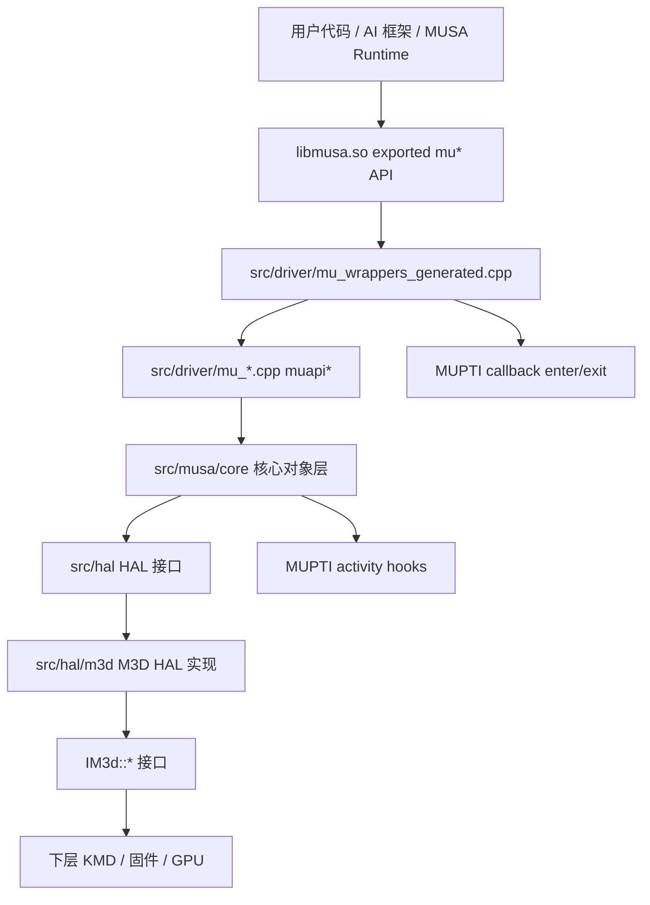
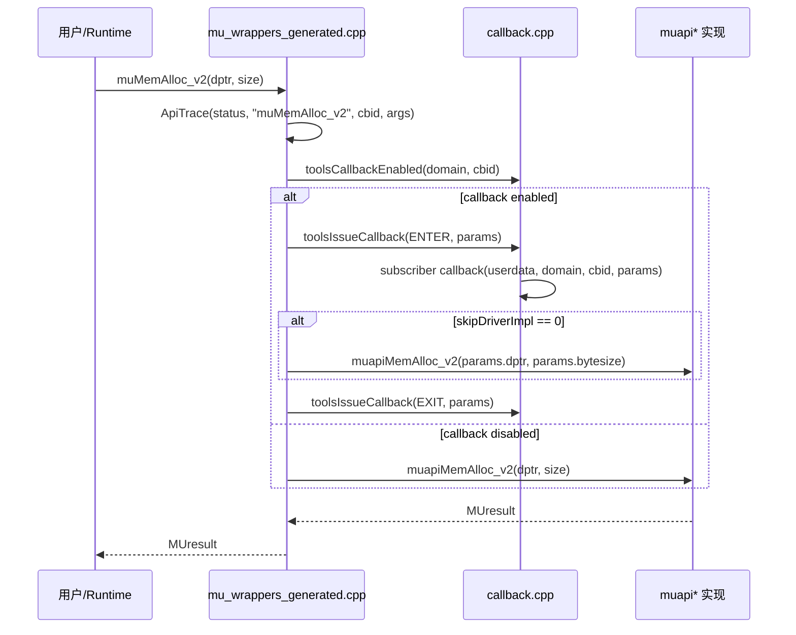
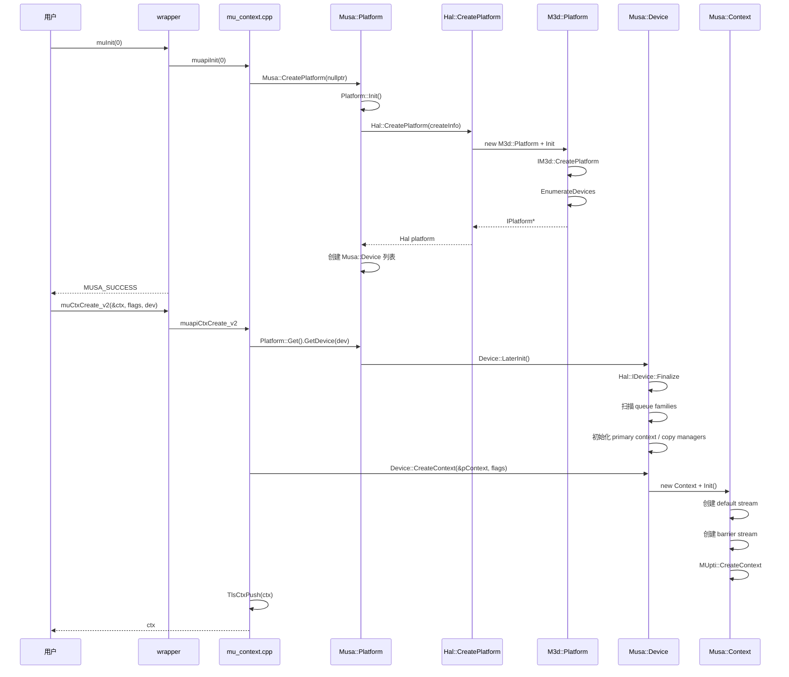
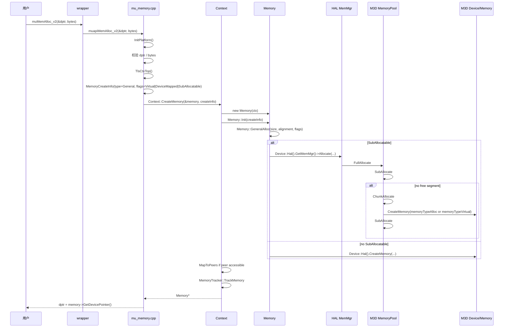
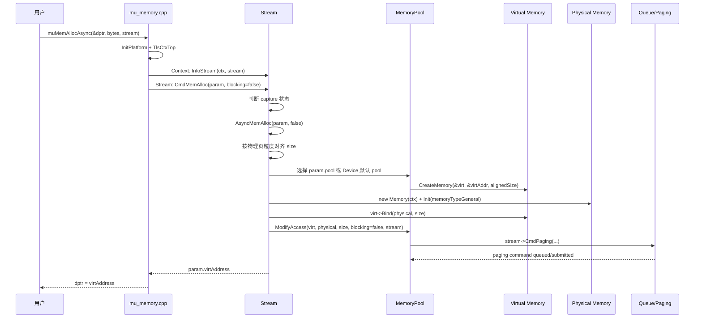
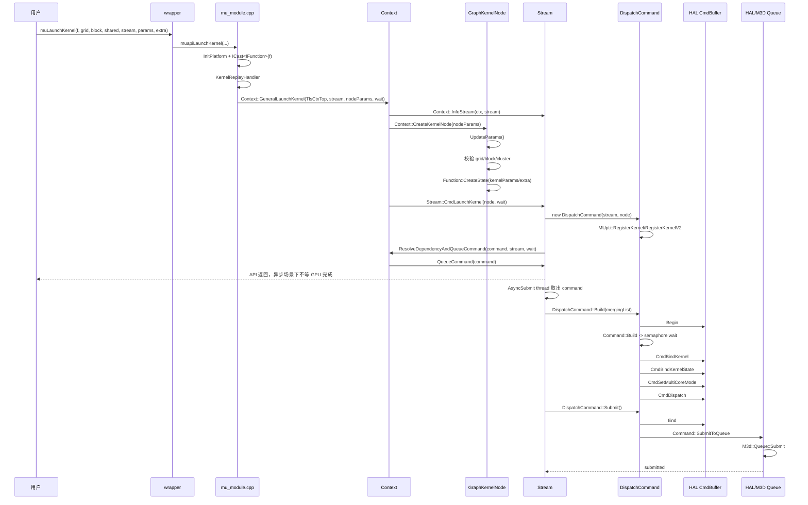
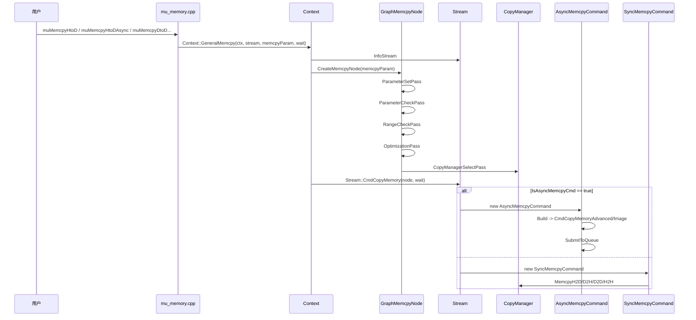
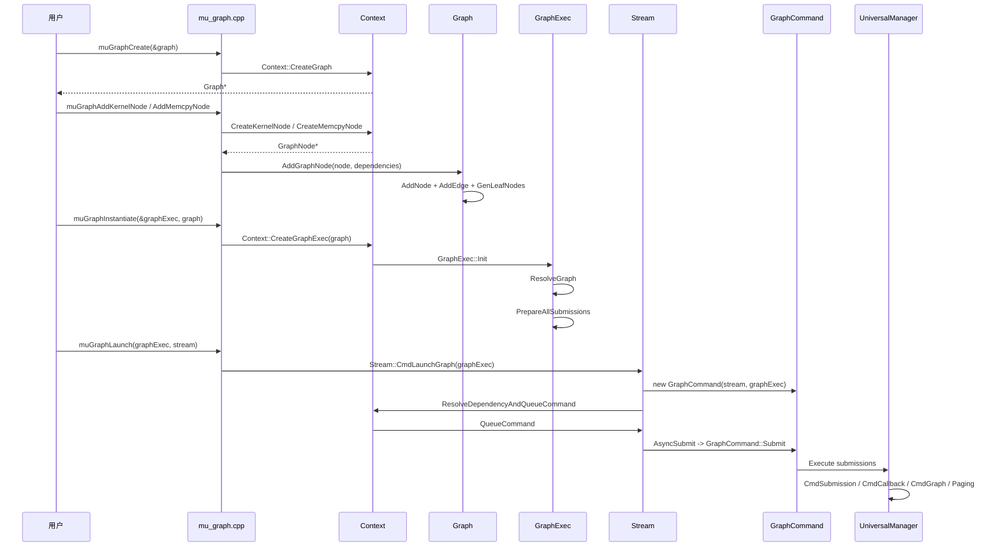
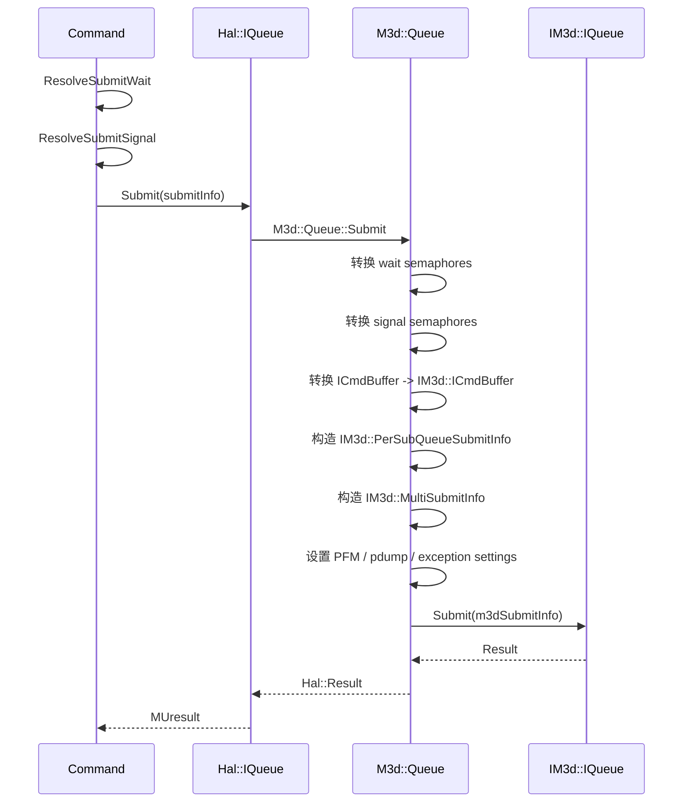

# MUSA DDK `musa` 源码架构与关键路径解析

分析范围：用户指定的 `/home/shanfeng/workspace/linux/musa` 在远程主机上不存在；本报告基于实际存在的 `/home/shanfeng/workspace/linux-ddk/musa`。该目录是 DDK 中的 MUSA 用户态 Driver 源码，核心产物是 `libmusa.so`。

本文只基于当前源码可确认的调用关系展开。已经确认的路径写到函数和文件级别；未追到的下层 KMD/DRM 细节单独标注为待确认，不作为结论。

## 核心结论

`linux-ddk/musa` 的职责是实现 MUSA Driver API。上层可以直接调用 `mu*` API，也可以通过 MUSA Runtime、PyTorch、SGLang 等框架间接进入。Driver 接收 API 请求后，经过 API 包装层、核心对象层、HAL 抽象层和 M3D 实现层，最终通过 M3D 接口提交命令或申请内存。

源码主线如下：

```text
用户 / Runtime / AI 框架
  -> libmusa.so exported mu* API
  -> src/driver/mu_wrappers_generated.cpp
  -> src/driver/mu_*.cpp 中的 muapi* 实现
  -> src/musa/core/* 核心对象
  -> src/hal/* HAL 接口
  -> src/hal/m3d/* M3D HAL 实现
  -> IM3d::* 接口
  -> 下层 KMD / 固件 / GPU
```

最重要的执行链路有 5 条：

| 链路 | 入口 | 核心路径 |
|---|---|---|
| 初始化 | `muInit` | `muapiInit` -> `Musa::CreatePlatform` -> `Platform::Init` -> `Hal::CreatePlatform` -> `M3d::Platform::Init` |
| 上下文 | `muCtxCreate_v2` | `muapiCtxCreate_v2` -> `Platform::GetDevice` -> `Device::CreateContext` -> `Context::Init` |
| 同步显存分配 | `muMemAlloc_v2` | `muapiMemAlloc_v2` -> `Context::CreateMemory` -> `Memory::GeneralAlloc` -> `Hal::MemMgr::Allocate` |
| 异步显存分配 | `muMemAllocAsync` | `muapiMemAllocAsync` -> `Stream::CmdMemAlloc` -> `Stream::AsyncMemAlloc` -> `MemoryPool::CreateMemory` + `MemoryPool::ModifyAccess` |
| Kernel 启动 | `muLaunchKernel` | `muapiLaunchKernel` -> `Context::GeneralLaunchKernel` -> `GraphKernelNode` -> `DispatchCommand` -> `Stream::QueueCommand` -> `Command::SubmitToQueue` -> `M3d::Queue::Submit` |

## 构建结构

源码构建从 `src/CMakeLists.txt` 开始：

```text
src/
  util/
  hal/
  musa/
  driver/
  gdb/
  tools/
```

关键构建关系：

| 构建目标 | 源码位置 | 说明 |
|---|---|---|
| `musaCore` | `src/musa/core/CMakeLists.txt` | 静态库，包含 core、command、node、graph、copyManager2 |
| `halM3d` | `src/hal/m3d/CMakeLists.txt` | M3D HAL 实现 |
| `libmusa.so` | `src/driver/CMakeLists.txt` | Driver 动态库，链接 `musaCore`，包含 driver、mupti、mugdb、muasan |

`src/driver/CMakeLists.txt` 使用 `add_library(${DRIVER_LIB_NAME}_dynamic SHARED ...)` 生成动态库，Linux 下输出名为 `musa`，也就是 `libmusa.so`。

## 总体架构



分层职责如下：

| 层级 | 目录 | 主要职责 |
|---|---|---|
| API 包装层 | `src/driver/mu_wrappers_generated.cpp` | 导出 `mu*` API，创建 `ApiTrace`，触发 MUPTI callback，调用 `muapi*` |
| Driver 实现层 | `src/driver/mu_*.cpp` | API 参数校验、上下文获取、调用 core 对象 |
| Core 对象层 | `src/musa/core/*` | 管理 `Platform`、`Device`、`Context`、`Stream`、`Command`、`Memory`、`Graph`、`Module` |
| Command 层 | `src/musa/core/command/*` | 将 kernel、memcpy、memset、graph 等操作转成可提交命令 |
| Node/Graph 层 | `src/musa/core/node/*`、`src/musa/core/graph/*` | 统一 kernel、memcpy、memset、memory alloc/free 等图节点 |
| CopyManager 层 | `src/musa/core/copyManager2/*` | 选择 CPU、DMA、TDM、CE、CDM、ACE、Shader copy 路径 |
| HAL 接口层 | `src/hal/*.h` | 抽象 `IDevice`、`IQueue`、`ICmdBuffer`、`IMemory`、`IMemoryPool` |
| M3D 实现层 | `src/hal/m3d/*` | 将 HAL 调用翻译为 `IM3d::*` 调用 |
| 工具层 | `src/driver/mupti`、`mugdb`、`muasan` | profiling、debug、sanitizer 接入 |

## 模块拆解

### 1. API 包装层

文件：`src/driver/mu_wrappers_generated.cpp`

该文件导出外部可见的 `mu*` API。典型入口包括：

| API | 源码位置 | 说明 |
|---|---|---|
| `muInit` | `mu_wrappers_generated.cpp:213` | Driver 初始化入口 |
| `muCtxCreate_v2` | `mu_wrappers_generated.cpp:288` | 创建 Context |
| `muLaunchKernel` | `mu_wrappers_generated.cpp:9547` | Kernel 启动入口 |
| `muMemAlloc_v2` | `mu_wrappers_generated.cpp:10177` | 同步显存分配入口 |
| `muMemcpyHtoD_v2` | `mu_wrappers_generated.cpp:11314` | Host 到 Device 同步拷贝 |
| `muMemcpyHtoDAsync_v2` | `mu_wrappers_generated.cpp:11396` | Host 到 Device 异步拷贝 |
| `muStreamCreate` | `mu_wrappers_generated.cpp:17280` | Stream 创建入口 |

每个 wrapper 的固定流程：

1. 创建 `ApiTrace`，记录 API 名、CBID 和参数。
2. 判断该 API 是否启用了 tools callback。
3. 如果启用，构造 `MUtoolsTraceApiMusa` 参数。
4. 触发 `MU_TOOLS_API_ENTER` callback。
5. 如果 callback 没有设置 `skipDriverImpl`，调用对应 `muapi*` 实现。
6. 触发 `MU_TOOLS_API_EXIT` callback。
7. 返回 `MUresult`。

这层不做核心业务。它的主要作用是统一 tracing、callback 和外部 ABI。

### 2. Driver API 实现层

目录：`src/driver/`

该层按 API 域拆分文件：

| 文件 | 主要内容 |
|---|---|
| `mu_context.cpp` | `muapiInit`、`muapiCtxCreate_v2`、context push/pop/sync |
| `mu_device.cpp` | device count、device attribute、primary context |
| `mu_memory.cpp` | memory alloc/free、memcpy、memset、async alloc |
| `mu_mempool.cpp` | memory pool API |
| `mu_stream.cpp` | stream create/sync/query/capture |
| `mu_module.cpp` | module load、function lookup、kernel launch |
| `mu_graph.cpp` | graph create、add node、instantiate、launch |
| `mu_event.cpp` | event create/record/wait/sync |
| `mu_entry.cpp` | export table、tools/gdb/asan/mupti accessor table |
| `internal.cpp` | `DriverEntryPointTable`，支持 `muGetProcAddress` |

该层的典型代码结构是：

```text
muapiXXX
  -> InitPlatform()
  -> 校验指针、flags、handle、context
  -> 获取 TlsCtxTop() 或 Platform::Get()
  -> 构造 core 层参数
  -> 调用 Context / Device / Stream / Module
```

例如 `muapiMemAlloc_v2`：

```text
muapiMemAlloc_v2
  -> InitPlatform()
  -> 校验 dptr 和 bytesize
  -> TlsCtxTop()
  -> MemoryCreateInfo{type=memoryTypeGeneral, flags=Virtual|DeviceMapped|SubAllocatable}
  -> IContext::CreateMemory()
  -> 返回 Memory::GetDevicePointer()
```

### 3. 入口表与动态符号查询

文件：

```text
src/driver/internal.cpp
src/driver/mu_entry.cpp
```

`DriverEntryPointTable` 将字符串 API 名映射到实际函数地址。`muGetProcAddress_v2` 通过这个表查找符号。

关键路径：

```text
muGetProcAddress_v2
  -> static DriverEntryPointTable
  -> s_EntryPointTable.Find(symbol)
  -> Entry::FindBestMatch(musaVersion, flags)
  -> 返回函数指针
```

典型映射：

| API 名称 | 映射目标 |
|---|---|
| `muStreamCreate` | `muStreamCreate` |
| `muLaunchKernel` | `muLaunchKernel` / `muLaunchKernel_ptsz` |
| `muMemAlloc` | `muMemAlloc_v2` |
| `muGetProcAddress` | `muGetProcAddress_v2` |

这说明 `libmusa.so` 既支持直接链接符号，也支持运行时按名称查询 API。

### 4. MUPTI callback 与 hooks

MUPTI 有两类接入点。

第一类是 API callback：

```text
src/driver/callback.cpp
src/driver/mu_wrappers_generated.cpp
```

`callback.cpp` 维护全局 subscriber 和各 domain 的 enabled 数组：

```text
toolsSubscribe
  -> 注册 callback + userdata
toolsEnableCallback
  -> 设置 domain/cbid 是否启用
toolsCallbackEnabled
  -> wrapper 查询是否启用
toolsIssueCallback
  -> 调用 subscriber callback
```

第二类是 driver 内部 activity hooks：

```text
src/driver/mupti/hooks.cpp
src/driver/mupti/tracepoints.h
```

`EnableMUptiDriver` 将外部 MUPTI 提供的函数表写入 `G_MUPTI_DRIVER_HOOKS`，并设置 `ready=true`。Driver 内部通过 `MUpti::CheckMUptiEnabled()` 判断是否调用 hooks。

典型 hooks：

| Hook | 调用位置 | 作用 |
|---|---|---|
| `CreateContext` | `Context::Init` | 记录 context 创建 |
| `CreateStream` | `Context::CreateStream` | 记录 stream 创建 |
| `RegisterKernel` / `RegisterKernelV2` | `DispatchCommand` 构造 | 注册 kernel activity |
| `MarkKernelQueued` | `Stream::QueueCommand` | 标记 kernel queued 时间 |
| `MarkKernelSubmitted` | `Stream::AsyncSubmit` | 标记 kernel submitted 时间 |
| `AssignKernelToKick` | `Stream::AsyncSubmit` | 关联 kernel correlation id 与 submission id |
| `EnterMemcpy` / `ExitMemcpy` | `MemcpyCommand` | 记录 memcpy activity |

### 5. Platform

文件：

```text
src/musa/core/platform.h
src/musa/core/platform.cpp
```

`Platform` 是 Driver 全局对象，负责创建 HAL platform、枚举设备、保存全局设置和全局对象 tracker。

`Platform::Init` 的主要步骤：

1. 初始化 settings loader。
2. 初始化 coredump 属性。
3. 构造 `Hal::PlatformCreateInfo`。
4. 调用 `Hal::CreatePlatform` 创建 HAL platform。
5. 从 HAL 获取 device 数量和 device 指针。
6. 按可见设备配置过滤设备。
7. 为每个可见设备创建 core 层 `Device`。
8. 将 Driver settings 写入 HAL settings。
9. 初始化 MUgdb。

`Platform::GetDevice` 会触发 `Device::LaterInit()`。这表示设备的部分初始化被延迟到第一次真正访问设备时完成。

### 6. Device

文件：

```text
src/musa/core/device.h
src/musa/core/device.cpp
```

`Device` 表示一个 MUSA 设备。它持有 HAL device、primary context、copy managers、memory pools、universal manager 和 engine 属性。

关键职责：

| 函数 | 作用 |
|---|---|
| `Device::Device` | 创建 primary context，读取设备属性 |
| `Device::LaterInit` | finalize HAL device，扫描 queue family，初始化 primary context、copy managers、universal manager |
| `Device::CreateContext` | 创建用户 context |
| `Device::GetDefaultMemoryPool` | 创建默认 device memory pool |
| `Device::InitCopyManagers` | 初始化 CPU、DMA、TDM、CE、CDM、ACE、Shader copy manager |
| `Device::AllocateInternalMem` | 从内部池分配 driver 内部显存 |

`Device::LaterInit` 会识别 HAL queue family 名称：

```text
CDM       -> compute engine
TDM       -> transfer engine
CE        -> copy engine
ACE       -> advanced copy engine
DMA       -> host DMA engine
UNIVERSAL -> graph/unified engine
MMU       -> paging engine
```

这些 engine 后续会被 `Stream` 和 `Command` 使用。

### 7. Context

文件：

```text
src/musa/core/context.h
src/musa/core/context.cpp
```

`Context` 是大多数 Driver API 的执行上下文。它管理 stream、event、module、memory、graph、texture、surface、peer access 和 graph exec。

`Context::Init` 的主要步骤：

1. 初始化 context critical data。
2. 创建 default stream。
3. 加载平台已注册的 library。
4. 创建 barrier stream。
5. 如果 MUPTI 已启用，调用 `MUpti::CreateContext`。

几个核心入口：

| 函数 | 上层入口 | 作用 |
|---|---|---|
| `Context::CreateMemory` | `muMemAlloc_v2` 等 | 创建 `Memory` 对象并跟踪 |
| `Context::CreateStream` | `muStreamCreate` | 创建并初始化 `Stream` |
| `Context::GeneralLaunchKernel` | `muLaunchKernel` | 创建 kernel node，并投递到 stream |
| `Context::GeneralMemcpy` | `muMemcpy*` | 创建 memcpy node，并投递到 stream |
| `Context::ResolveDependencyAndQueueCommand` | stream command | 解析 stream 依赖并入队 |

`Context::ResolveDependencyAndQueueCommand` 是 stream 语义的核心：

```text
default stream
  -> 依赖当前 context 中所有 blocking stream 的最后一条命令

blocking stream
  -> 依赖 default stream 的最后一条命令

barrier stream
  -> 依赖所有普通 stream 的最后一条命令

用户显式依赖
  -> 来自 stream current dependencies
```

依赖最后会转成 command 的 semaphore wait。

### 8. Memory 与 MemoryPool

文件：

```text
src/musa/core/memory.h
src/musa/core/memory.cpp
src/musa/core/memoryPool.h
src/musa/core/memoryPool.cpp
src/hal/m3d/memMgr.cpp
src/hal/m3d/memoryPool.cpp
```

`Memory` 是 core 层内存对象，封装 HAL memory、context、pool、offset、shape、physical tracker 等信息。

`Memory::Init` 根据 `MemoryCreateInfo.type` 分发：

| 类型 | 处理函数 |
|---|---|
| `memoryTypeGeneral` | `GeneralAlloc` |
| `memoryTypePitchedGeneral` | `PitchedGeneralAlloc` |
| `memoryTypePinnedHost` | `PinnedHostAlloc` |
| `memoryTypeRegisteredPinnedHost` | `PinnedHostRegister` |
| `memoryTypeManaged` | `ManagedAlloc` |
| `memoryTypeIpcImport` | `IpcImportAlloc` |
| `memoryTypeExternal` | `ExternalAlloc` |
| `memoryTypePrealloc` | `PreallocAlloc` |
| `memoryTypeVirtual` | `VirtualAlloc` |

同步 `muMemAlloc_v2` 走 `Memory::GeneralAlloc`：

```text
Memory::GeneralAlloc
  -> 填 Hal::MemoryCreateInfo
  -> alloc.type = DeviceLocal
  -> heap = largePage
  -> property 加 Physical + SharedVirtualAddress
  -> 如果 flags 有 SubAllocatable:
       Device::Hal().GetMemMgr()->Allocate(...)
     否则:
       Device::Hal().CreateMemory(...)
```

`MemoryPool` 负责 sub-allocation：

```text
MemoryPool::FullAllocate
  -> SubAllocate
  -> 如果没有空闲 segment:
       ChunkAllocate
       SubAllocate

MemoryPool::Free
  -> 标记 segment 空闲
  -> 尝试与左右邻居合并
```

M3D HAL 层的 `MemoryPool::ChunkAllocate` 会根据属性创建虚拟 chunk 或物理 chunk：

```text
非 physical pool
  -> platform.CreateMemory(memoryTypeVirtual)

physical pool
  -> device.CreateMemory(memoryTypeAlloc)
```

### 9. Stream

文件：

```text
src/musa/core/stream.h
src/musa/core/stream.cpp
```

`Stream` 是命令队列和提交线程的核心对象。每个 stream 初始化时会为可用 engine 创建 HAL queue、command pool、command buffer，并创建 timeline/hardware semaphore。

`Stream::Init` 的关键步骤：

1. 遍历 `Device::Engine`。
2. 对每个有效 queue family 调用 `Hal::IDevice::CreateQueue`。
3. 创建 `Hal::ICmdPool`。
4. 预创建多个 `Hal::ICmdBuffer`。
5. 创建 timeline semaphore。
6. 如果硬件支持 engine sync，创建 hardware semaphore。
7. 创建 surface 对象缓存。
8. 启动两个后台线程：
   - `AsyncSubmit`
   - `AsyncWait`

`Stream::QueueCommand` 的关键步骤：

1. 检查 `streamAsyncCapacity`，做背压控制。
2. `m_AsyncCount++`。
3. `command->ChoosePerfEngine(m_LastCommand)`。
4. `command->SetPrevCommand(m_LastCommand)`。
5. 更新 `m_LastCommand`。
6. 设置 command 状态为 `queued`。
7. 对 dispatch command 记录 queued timestamp。
8. 加入 `m_CommandList`。
9. 唤醒 `m_SubmitCv`。

`Stream::AsyncSubmit` 的职责：

1. 从 `m_CommandList` 取 command。
2. 调用 `command->FilterDependency()`。
3. 判断能否与当前 merging list 合并。
4. 设置 signal semaphore value。
5. 调用 `command->Build()`，把操作编码到 HAL command buffer。
6. 当满足提交条件时调用 `command->Submit()`。
7. 将已提交命令移动到 `m_InflightList`。
8. 唤醒 `AsyncWait`。

`Stream::AsyncWait` 的职责：

1. 等待 inflight command 对应 semaphore。
2. 检查 engine 错误。
3. 处理 printf buffer。
4. 更新 command 状态为 `completed` 或 `error`。
5. 调用 `Postprocess` 和 `ReleaseResources`。
6. `m_AsyncCount--`。

### 10. Command

文件：

```text
src/musa/core/command/command.h
src/musa/core/command/command.cpp
src/musa/core/command/dispatchCommand.cpp
src/musa/core/command/AsyncMemcpyCommand.cpp
src/musa/core/command/SyncMemcpyCommand.cpp
src/musa/core/command/graphCommand.cpp
```

`Command` 是可提交工作的抽象基类。状态机如下：

```mermaid
stateDiagram-v2
    [*] --> created
    created --> queued: Stream::QueueCommand
    queued --> built: Stream::AsyncSubmit -> Command::Build
    built --> submitted: Command::Submit
    submitted --> completed: Stream::AsyncWait success
    submitted --> error: Stream::AsyncWait error
```

常见 command 类型：

| 类型 | 类 | 说明 |
|---|---|---|
| `Dispatch` | `DispatchCommand` | kernel launch |
| `Memcpy` | `SyncMemcpyCommand` | 同步 copy path |
| `AsyncMemcpy` | `AsyncMemcpyCommand` | 异步 device/array copy path |
| `Memset` | `MemsetCommand` | memset |
| `Graph` | `GraphCommand` | graph exec launch |
| `Paging` | `PagingCommand` | virtual memory remap |
| `Callback` | `CallbackCommand` | host callback |
| `Record` | `RecordCommand` | event record |

`Command::Build` 负责把依赖转成 semaphore wait：

```text
Command::Build
  -> 处理同 stream 前序命令 m_PrevCommand
  -> 遍历 m_ExecutionDependencies
  -> 根据 timeline/hardware semaphore 选择 wait semaphore
  -> 写入 m_WaitSemaphoreInfos
```

`Command::SubmitToQueue` 负责构造 HAL submit 参数：

```text
Command::SubmitToQueue
  -> 准备 wait semaphores
  -> 准备 signal semaphores
  -> 设置 submissionId
  -> 设置 perf experiment
  -> IQueue::Submit(submitInfo)
```

### 11. Kernel Module 与 Function

文件：

```text
src/driver/mu_module.cpp
src/musa/core/module.cpp
src/musa/core/module.h
src/musa/core/symbol.cpp
src/musa/core/symbol.h
```

Module 管理 fat binary、kernel function symbol 和 global variable symbol。

`muModuleLoad` 路径：

```text
muapiModuleLoad
  -> 读取文件到内存
  -> muapiModuleLoadData
  -> Context::CreateModule
  -> Module::LoadFatBinary
  -> Device::Hal().CreateLibrary
  -> 如果 eager loading:
       Module::LoadImage
```

`Module::LoadFatBinary` 会创建 HAL library：

```text
Hal::LibraryCreateInfo
  sourceType = librarySourceTypeMusaFatBin
  pSource = fatMubin
  lazyLoad = settings.moduleLoadingMode != EAGER
```

`muModuleGetFunction` 路径：

```text
muapiModuleGetFunction
  -> ICast<IModule>
  -> Module::GetFunction
  -> Module::FindSymbolByName
  -> Function::Init
  -> Device::Hal().CreateKernel
```

`Function::CreateState` 在 kernel launch 前创建 kernel 参数状态：

```text
Function::CreateState
  -> Hal::KernelState::Create
  -> 如果使用 kernelParams:
       遍历 resource mappings
       将用户参数写入 KernelState
  -> 如果使用 extra:
       解析 MU_LAUNCH_PARAM_BUFFER_POINTER / BUFFER_SIZE
       写入 KernelState
  -> 校验 dynamic shared memory
```

### 12. Kernel Launch

入口：

```text
src/driver/mu_module.cpp: muapiLaunchKernel
src/musa/core/context.cpp: Context::GeneralLaunchKernel
src/musa/core/node/graphKernelNode.cpp
src/musa/core/command/dispatchCommand.cpp
```

完整执行流程：

```text
muLaunchKernel
  -> wrapper
  -> muapiLaunchKernel
  -> KernelReplayHandler
  -> MUSA_KERNEL_NODE_PARAMS
  -> Context::GeneralLaunchKernel
  -> Context::InfoStream
  -> Context::CreateKernelNode
  -> GraphKernelNode::UpdateParams
       校验 grid/block
       校验 cluster
       Function::CreateState
       RegisteredHostPointerCheckout
  -> Stream::CmdLaunchKernel
  -> new DispatchCommand
  -> Context::ResolveDependencyAndQueueCommand
  -> Stream::QueueCommand
  -> Stream::AsyncSubmit
  -> DispatchCommand::Build
       CmdBuffer::Begin
       Command::Build
       CmdBindKernel
       CmdBindKernelState
       CmdSetMultiCoreMode
       CmdDispatch
  -> DispatchCommand::Submit
       CmdBuffer::End
       MUgdb::KernelLoadingProcess
       MUasan::KernelLoadingProcess
       Command::SubmitToQueue
  -> Hal::IQueue::Submit
  -> M3d::Queue::Submit
  -> IM3d::IQueue::Submit
```

Kernel launch 的关键点：

1. API 层不会直接提交 kernel。
2. `muapiLaunchKernel` 先把参数封装成 `MUSA_KERNEL_NODE_PARAMS`。
3. Core 层先创建 `GraphKernelNode`，即普通 launch 也复用 graph node 表示。
4. `GraphKernelNode::UpdateParams` 完成 launch 参数校验和 `KernelState` 创建。
5. 真正提交的是 `DispatchCommand`。
6. `DispatchCommand::Build` 负责把 kernel 编码进 HAL command buffer。
7. `DispatchCommand::Submit` 负责把 command buffer 提交给 queue。

### 13. Memcpy 与 CopyManager

入口文件：

```text
src/driver/mu_memory.cpp
src/musa/core/context.cpp
src/musa/core/node/graphMemcpyNode.cpp
src/musa/core/command/AsyncMemcpyCommand.cpp
src/musa/core/command/SyncMemcpyCommand.cpp
src/musa/core/copyManager2/*
```

Memcpy 的共同入口是 `Context::GeneralMemcpy`：

```text
muMemcpy*
  -> muapiMemcpy*
  -> Context::GeneralMemcpy
  -> Context::CreateMemcpyNode
  -> GraphMemcpyNode::Init
  -> Stream::CmdCopyMemory
```

`GraphMemcpyNode::Init` 会执行 4 个 pass：

```text
MemcpyLegalize
  -> ParameterSetPass
  -> ParameterCheckPass
  -> RangeCheckPass
  -> OptimizationPass
  -> CopyManagerSelectPass
```

`CopyManagerSelectPass` 决定使用哪条 copy 路径：

| CopyManager | 典型 engine | 适用场景 |
|---|---|---|
| CPU | Host CPU | Host 可直接访问的内存，或小数据 fallback |
| DMA | DMA | host/device DMA copy |
| TDM | TDM | transfer engine copy |
| CE | CE | copy engine copy |
| ACE | ACE | 支持 ACE 的设备间 copy |
| CDM | CDM | compute engine copy |
| Shader | CDM | shader 实现 copy |

`Stream::CmdCopyMemory` 根据 `GraphMemcpyNode::IsAsyncMemcpyCmd` 选择命令类型：

```text
如果方向是 DeviceToDevice / DeviceToArray / ArrayToDevice / ArrayToArray
且 CopyManager engine 是 CDM/TDM/CE
  -> AsyncMemcpyCommand
否则
  -> SyncMemcpyCommand
```

`AsyncMemcpyCommand` 会编码 HAL command buffer：

```text
AsyncMemcpyCommand::Build
  -> CmdBuffer::Begin
  -> Command::Build
  -> ResolveSubmitWait
  -> CmdCopyMemoryAdvanced / CmdCopyMemoryToImage / CmdCopyImageToMemory / CmdCopyImage
```

`SyncMemcpyCommand` 直接调用 CopyManager：

```text
SyncMemcpyCommand::Submit
  -> MemcpyH2H / MemcpyH2D / MemcpyD2H / MemcpyD2D / ...
```

### 14. Graph

文件：

```text
src/driver/mu_graph.cpp
src/musa/core/graph.cpp
src/musa/core/graph/graph1/graphExec.cpp
src/musa/core/command/graphCommand.cpp
src/musa/core/graph/graph1/universalManager.cpp
```

Graph 的基本流程：

```text
muGraphCreate
  -> Context::CreateGraph
  -> Graph

muGraphAddKernelNode / muGraphAddMemcpyNode / ...
  -> Context::CreateXXXNode
  -> Graph::AddGraphNode
  -> Graph::AddEdge

muGraphInstantiate
  -> Context::CreateGraphExec
  -> GraphExec::Init
  -> GraphExec::ResolveGraph
  -> GraphExec::PrepareAllSubmissions

muGraphLaunch
  -> Stream::CmdLaunchGraph
  -> GraphCommand
  -> Context::ResolveDependencyAndQueueCommand
  -> Stream::QueueCommand
```

`Graph` 本身维护 DAG：

| 成员 | 作用 |
|---|---|
| `m_Vertices` | graph nodes |
| `m_Edges` | node 依赖边 |
| `m_NodeInDegree` | 入度 |
| `m_NodeOutDegree` | 出度 |
| `m_LeafNodes` | 叶子节点 |
| `m_Resource` | graph 级资源，例如 graph memory |

`GraphExec` 将 DAG 解析成 submissions。`GraphCommand::Submit` 调用 `Execute()`，由 `UniversalManager` 执行不同类型 submission：

| submission 类型 | 执行方式 |
|---|---|
| `MUSA_SUBMISSION_DEVICE` | 通过 HAL command buffer 提交到 queue |
| `MUSA_SUBMISSION_HOST` | 执行 host callback |
| `MUSA_SUBMISSION_HOST_DEVICE` | host/device 混合路径 |
| child graph | 递归执行子图 |
| conditional graph | 根据条件 handle 执行分支 |

### 15. HAL 接口层

目录：`src/hal/`

HAL 是 core 层和具体硬件实现之间的接口。核心接口包括：

| 接口 | 文件 | 作用 |
|---|---|---|
| `IPlatform` | `halPlatform.h` | 设备枚举、平台内存属性、平台级 memory |
| `IDevice` | `halDevice.h` | 创建 queue、cmd pool、cmd buffer、memory、library、kernel |
| `IQueue` | `halQueue.h` | submit、paging、wait idle、robust info |
| `ICmdBuffer` | `halCmdBuffer.h` | begin/end、dispatch、copy、barrier、timestamp |
| `IMemory` | `halMemory.h` | memory 对象、map/unmap、peer memory |
| `IMemoryPool` | `halMemoryPool.h` | pool 分配和释放 |
| `IMemMgr` | `halMemMgr.h` | 按属性管理 memory pool |
| `ISemaphore` | `halSemaphore.h` | timeline/hardware semaphore |
| `ILibrary` / `IKernel` | `halLibrary.h` / `halKernel.h` | fatbin 和 kernel 元数据 |

HAL 的价值是让 core 层只依赖抽象接口，不直接依赖 M3D。

### 16. M3D HAL 实现层

目录：`src/hal/m3d/`

M3D 层实现 HAL 接口，并把调用转成 `IM3d::*` 接口调用。

关键对象：

| 对象 | 文件 | 说明 |
|---|---|---|
| `M3d::Platform` | `platform.cpp` | 创建 IM3d platform、枚举 IM3d device、构建 P2P topology |
| `M3d::Device` | `device.cpp` | 创建 queue/cmd buffer/memory/library/kernel/semaphore |
| `M3d::Queue` | `queue.cpp` | 将 HAL submit 转成 `IM3d::MultiSubmitInfo` |
| `M3d::CmdBuffer` | `cmdBuffer.cpp` | 将 HAL command 转成 IM3d command buffer 记录 |
| `M3d::Memory` | `memory.cpp` | 封装 IM3d GPU memory |
| `M3d::MemMgr` | `memMgr.cpp` | 按属性复用 memory pool |
| `M3d::MemoryPool` | `memoryPool.cpp` | 分段 sub-allocation |
| `M3d::Library` / `Kernel` | `library.cpp` / `kernel.cpp` | fatbin 和 kernel metadata |

`Hal::CreatePlatform` 的 M3D 实现：

```text
Hal::CreatePlatform
  -> new M3d::Platform
  -> M3d::Platform::Init
  -> M3d::Platform::CreatePlatform
  -> IM3d::CreatePlatform
  -> M3d::Platform::CreateDevices
  -> IM3d::IPlatform::EnumerateDevices
  -> new M3d::Device
  -> Device::Init
```

`M3d::Queue::Submit` 的核心流程：

```text
M3d::Queue::Submit
  -> 校验 user queue + fence 组合
  -> 准备 wait semaphores
  -> 准备 signal semaphores
  -> 转换 HAL cmd buffers 为 IM3d cmd buffers
  -> 构造 IM3d::PerSubQueueSubmitInfo
  -> 构造 IM3d::MultiSubmitInfo
  -> 设置 PFM、Pdump、exception settings
  -> m_M3dQueue->Submit(m3dSubmitInfo)
  -> 超出 submit 限制的 signal semaphore 独立提交
```

当前分析确认到 `IM3d::IQueue::Submit`。该接口下层如何进入 DRM ioctl、KMD runlist 或 firmware，需要继续追 `src/hal/m3d/m3d` 目录或增加日志确认。

## 模块实现细节与示例

本节按前面的模块顺序补充实现细节。每个示例都对应一个实际源码路径，用于说明模块在真实调用中的行为。

### 1. API 包装层实现细节

API wrapper 的核心不是业务逻辑，而是统一处理 API tracing、MUPTI callback、错误状态和真实实现函数调用。

以 `muLaunchKernel` 为例，wrapper 会创建如下信息：

| 字段 | 来源 | 用途 |
|---|---|---|
| `functionName` | 固定字符串 `"muLaunchKernel"` | MUPTI callback 识别 API 名 |
| `functionId` | `MUPTI_DRIVER_TRACE_CBID_muLaunchKernel` | MUPTI callback 识别 API ID |
| `context` | `TlsCtxTop()` | 当前线程的 MUSA context |
| `contextId` | `Context::GetSeqID()` | profiling 中区分 context |
| `params` | `muLaunchKernel_params` | 保存 API 入参 |
| `apiEnterOrExit` | `MU_TOOLS_API_ENTER/EXIT` | 区分进入和退出 |
| `pSkipDriverImpl` | `skipDriverImpl` 地址 | callback 可选择跳过真实 driver 实现 |

示例：调用 `muMemAlloc_v2(&dptr, 4096)`。

```text
用户调用:
  muMemAlloc_v2(&dptr, 4096)

wrapper 内部:
  ApiTrace trace(status, "muMemAlloc_v2", cbid, dptr, 4096)
  params.dptr = &dptr
  params.bytesize = 4096

如果 callback 未启用:
  直接调用 muapiMemAlloc_v2(dptr, 4096)

如果 callback 启用:
  toolsIssueCallback(ENTER, &inParams)
  muapiMemAlloc_v2(params.dptr, params.bytesize)
  toolsIssueCallback(EXIT, &inParams)
```

这个设计的结果是：所有 `mu*` API 都能在不修改业务实现的情况下被 MUPTI 或 tools 观察。

### 2. Driver API 实现层实现细节

Driver API 实现层把 C 风格 API 参数转换成 core 层对象调用。它主要处理三类工作：

1. 运行前置初始化：`InitPlatform()`。
2. 参数和 handle 校验：空指针、非法 flags、无效 context、无效 stream。
3. 构造 core 层参数：例如 `MemoryCreateInfo`、`MUSA_KERNEL_NODE_PARAMS`、`MUSA_MEMCPY3D_PEER`。

示例：`muStreamCreate(&stream, MU_STREAM_NON_BLOCKING)`。

```text
muStreamCreate
  -> muapiStreamCreate
  -> muapiStreamCreateWithPriority(phStream, Flags, 0)
  -> InitPlatform()
  -> pContext = TlsCtxTop()
  -> 校验 phStream != nullptr
  -> 校验 flags 是 MU_STREAM_DEFAULT 或 MU_STREAM_NON_BLOCKING
  -> pContext->CreateStream(&pStream, flags, priority)
  -> *phStream = pStream
```

示例：`muLaunchKernel` 参数转换。

```text
用户传入:
  f, gridDimX/Y/Z, blockDimX/Y/Z, sharedMemBytes, hStream, kernelParams, extra

muapiLaunchKernel 构造:
  MUSA_KERNEL_NODE_PARAMS nodeParams = {}
  nodeParams.func = f
  nodeParams.gridDimX = gridDimX
  nodeParams.blockDimX = blockDimX
  nodeParams.sharedMemBytes = sharedMemBytes
  nodeParams.kernelParams = kernelParams
  nodeParams.extra = extra

然后调用:
  Context::GeneralLaunchKernel(TlsCtxTop(), hStream, nodeParams, ..., launchBlocking)
```

Driver API 层不直接操作 HAL queue，也不直接编码 command buffer。它把请求交给 core 层。

### 3. 入口表实现细节

`DriverEntryPointTable` 解决运行时按字符串查找 API 的问题。上层 runtime 不一定直接链接所有 `mu*` 符号，也可能通过 `muGetProcAddress` 获取函数指针。

示例：查询 `muMemAlloc`。

```text
用户/Runtime:
  muGetProcAddress("muMemAlloc", &fn, 40300, flags)

driver:
  DriverEntryPointTable::Find("muMemAlloc")
  -> 找到 Entry
  -> Entry::FindBestMatch(40300, flags)
  -> 返回 reinterpret_cast<void*>(&muMemAlloc_v2)
```

映射中可以同时保存默认版本和 per-thread stream 版本。例如：

```text
muLaunchKernel
  default -> muLaunchKernel
  ptsz    -> muLaunchKernel_ptsz
```

这类设计使 Driver 能兼容不同 API 版本，也能支持默认 stream 行为差异。

### 4. MUPTI callback 与 hooks 实现细节

MUPTI 的 API callback 和 activity hooks 覆盖不同层次。

API callback 记录“用户调用了哪个 API”：

```text
muMemcpyHtoDAsync_v2 ENTER
muMemcpyHtoDAsync_v2 EXIT
```

activity hooks 记录“driver 内部命令生命周期”：

```text
RegisterKernel
MarkKernelQueued
MarkKernelSubmitted
AssignKernelToKick
MarkCommandBeginEnd
```

示例：一次 kernel launch 的 MUPTI 事件顺序。

```text
1. wrapper:
   toolsIssueCallback(ENTER, muLaunchKernel)

2. DispatchCommand 构造:
   MUpti::RegisterKernelV2(this)

3. Stream::QueueCommand:
   MUpti::MarkKernelQueued(correlationId)

4. Stream::AsyncSubmit:
   MUpti::MarkKernelSubmitted(correlationId)
   MUpti::AssignKernelToKick(correlationId, submissionId)

5. wrapper:
   toolsIssueCallback(EXIT, muLaunchKernel)

6. GPU command 完成后:
   MUpti::MarkCommandBeginEnd(...)
```

`correlationId` 来自 `Util::ThreadInfo::Get().ApiSeqNum()`，用于把 API 调用、command、submission 关联起来。

### 5. Platform 实现细节

`Platform::Init` 是全局初始化入口。它只执行一次，内部使用 `std::call_once` 保证并发安全。

关键实现点：

| 实现点 | 说明 |
|---|---|
| settings loader | 读取 driver 配置，例如 visible devices、timeout、page size |
| `Hal::CreatePlatform` | 创建 HAL platform，实际走 M3D 实现 |
| device reorder/filter | 先从 HAL 获取全部设备，再按配置过滤可见设备 |
| `m_Devices` | core 层 `Device` 列表，ordinal 使用过滤后的顺序 |
| `CommitSettings` | 将部分 driver settings 下发到 HAL |

示例：设备枚举。

```text
HAL 返回物理设备:
  halDevices = [GPU0, GPU1, GPU2]

visibleDevices 配置假设只暴露 2,0:
  visibleDeviceIndices = [2, 0]

Platform 创建:
  m_Devices[0] -> Device(seqId=0, halDevice=GPU2)
  m_Devices[1] -> Device(seqId=1, halDevice=GPU0)

用户看到:
  MUdevice 0 对应物理 GPU2
  MUdevice 1 对应物理 GPU0
```

因此源码分析 device ordinal 时，要区分“用户可见 ordinal”和“底层 HAL 设备顺序”。

### 6. Device 实现细节

`Device` 的初始化分成构造阶段和延迟初始化阶段。

构造阶段：

```text
Device::Device(seqId, halDevice)
  -> 保存 HAL device
  -> 创建 primary context 对象
  -> 读取并转换 device properties
  -> 注册 primary context
```

延迟初始化阶段：

```text
Device::LaterInit()
  -> m_pHalDevice->Finalize(finalizeInfo)
  -> 读取 queue families
  -> 识别 CDM/TDM/CE/ACE/DMA/UNIVERSAL/MMU
  -> 初始化 primary context
  -> 设置 LLC persistency
  -> InitCopyManagers()
  -> 如果有 UNIVERSAL engine，创建 UniversalManager
```

示例：stream 创建时如何用到 Device 的 engine 信息。

```text
Device::LaterInit 记录:
  CDM queueFamilyIndex = 0
  TDM queueFamilyIndex = 1
  CE  queueFamilyIndex = 2

Stream::Init 遍历 engine:
  engine=cdm -> Device::GetQueueFamilyIndex(cdm) -> 0 -> CreateQueue(CDM)
  engine=tdm -> Device::GetQueueFamilyIndex(tdm) -> 1 -> CreateQueue(TDM)
  engine=ce  -> Device::GetQueueFamilyIndex(ce)  -> 2 -> CreateQueue(CE)
```

如果某个 engine 不存在，`GetQueueFamilyIndex` 返回 invalid index，`Stream::Init` 不会为该 engine 创建 queue。

### 7. Context 实现细节

`Context` 是当前线程执行 API 的核心状态。Driver API 常通过 `TlsCtxTop()` 获取当前 context。

`Context::Init` 默认创建两个内部 stream：

| Stream | 作用 |
|---|---|
| default stream | 用户未指定 stream 时使用 |
| barrier stream | 用于跨 stream 同步和全局依赖 |

示例：blocking stream 与 default stream 的依赖。

```text
已有命令:
  default stream:  D0
  stream A:        A0

现在向 stream A 投递 A1，且 stream A 不是 non-blocking:
  Context::ResolveDependencyAndQueueCommand
    -> A1.RecordDependency(default stream 的 LastCommand = D0)
    -> A1.SetPrevCommand(A0)

执行约束:
  A1 必须等 D0
  A1 也必须排在 A0 后面
```

示例：向 default stream 投递命令。

```text
已有命令:
  default stream:  D0
  stream A:        A0，blocking
  stream B:        B0，non-blocking

现在向 default stream 投递 D1:
  D1 依赖 A0
  D1 不依赖 B0
  D1 依赖 D0，作为同 stream 前序命令
```

这解释了为什么同样的 kernel launch，在 default stream 和 non-blocking stream 上可能产生不同同步行为。

### 8. Memory 与 MemoryPool 实现细节

同步分配和异步分配是两条不同路径。

同步 `muMemAlloc_v2`：

```text
muapiMemAlloc_v2
  createInfo.type = memoryTypeGeneral
  createInfo.general.flags =
    memoryPropertyVirtual |
    memoryPropertyDeviceMapped |
    memoryPropertySubAllocatable
```

`Memory::GeneralAlloc` 会补充属性：

```text
alloc.property += memoryPropertyPhysical
alloc.property += memoryPropertySharedVirtualAddress

如果带 memoryPropertyVirtual:
  alloc.property += DeviceVisible
  alloc.property += HostVisible
  alloc.property += HostCoherent
  alloc.property += DeviceWriteable
  alloc.property += DeviceCached
```

示例：分配 4096 字节。

```text
用户:
  muMemAlloc_v2(&dptr, 4096)

core:
  Memory::GeneralAlloc(size=4096, flags=Virtual|DeviceMapped|SubAllocatable)

HAL:
  MemMgr 按 {type, heap, property, viewCapability, numaId} 查找 pool

如果 pool 有空闲 segment:
  SubAllocate 返回已有 chunk 内的一段 offset

如果 pool 没有空闲 segment:
  ChunkAllocate 申请一个更大的 chunk
  再从 chunk 中切出 4096 字节

返回:
  dptr = chunkGpuVa + offset
```

异步 `muMemAllocAsync`：

```text
Stream::AsyncMemAlloc
  -> allocSize = AlignUp(requestSize, physicalPageSize)
  -> 从 memory pool 创建 virtual memory
  -> 单独创建 physical memory
  -> virt->Bind(physical)
  -> MemoryPool::ModifyAccess
  -> stream->CmdPaging
```

示例：异步分配 4096 字节，底层推荐粒度为 65536 字节。

```text
requestSize = 4096
physPageSize = 65536
allocSize = AlignUp(4096, 65536) = 65536

结果:
  用户得到一个 virtual address
  实际映射的物理页大小至少是 65536
  映射动作通过 paging command 排入指定 stream
```

因此 `muMemAllocAsync` 的返回表示“虚拟地址已分配，映射命令已安排”，不是简单的同步内存申请。

### 9. Stream 实现细节

`Stream` 内部有三个队列概念：

| 队列 | 说明 |
|---|---|
| `m_CommandList` | API 线程放入的新 command |
| `m_MergingList` | submit 线程正在构建、可能合并的一组 command |
| `m_InflightList` | 已提交给 HAL queue，等待完成的 command |

示例：同一个 stream 连续投递两个 kernel。

```text
用户线程:
  muLaunchKernel(K0, stream)
  muLaunchKernel(K1, stream)

Stream::QueueCommand:
  K0 -> m_CommandList
  K1 -> m_CommandList
  K1.SetPrevCommand(K0)

AsyncSubmit:
  取 K0，Build
  取 K1，判断能否 merge
  如果 engine 相同、无外部依赖、command 支持 merge:
    K1 作为 secondary，复用 primary command buffer
  否则:
    先提交 K0
    再构建 K1
```

示例：`streamAsyncCapacity` 背压。

```text
如果 m_AsyncCount >= streamAsyncCapacity:
  QueueCommand 不再继续入队
  当前 API 线程 yield

AsyncWait 完成 command 后:
  m_AsyncCount--
  新命令才能继续入队
```

这避免 API 线程无限制地产生 command，导致 stream 内存和提交队列失控。

### 10. Command 实现细节

`Command` 把“逻辑依赖”转成“硬件可执行的同步”。

依赖有两类：

| 依赖字段 | 来源 | 用途 |
|---|---|---|
| `m_PrevCommand` | 同一 stream 的上一条 command | 保证 stream 内顺序 |
| `m_ExecutionDependencies` | default stream、barrier stream、event 等外部依赖 | 保证跨 stream 或用户显式同步 |

`Command::Build` 会为每个依赖选择 semaphore：

```text
如果两个 command 都偏好 hardware semaphore，且在同一 device:
  使用 dependant->GetHardwareSemaphore()
否则:
  使用 dependant->GetTimelineSemaphore()
```

示例：两个 stream 之间的 event wait。

```text
stream A:
  kernel A0
  event E record

stream B:
  wait event E
  kernel B0

实现上:
  wait event 将 A0 或 event record 对应 command 记入 stream B 的 current dependencies
  B0 入队时读取 current dependencies
  B0.RecordDependency(A0/event record command)
  B0.Build 时把依赖转换成 wait semaphore
```

`Command::SubmitToQueue` 不关心具体命令类型。它只处理提交共同字段：

```text
QueueSubmitInfo
  ppCmdBuffers
  wait semaphores
  signal semaphores
  submissionId
  perf experiment
  pfm dump config
```

具体命令如何写 command buffer，由派生类实现。

### 11. Kernel Module 与 Function 实现细节

Module 的加载分为 fatbin library 创建和 symbol 解析两步。

示例：lazy loading 模式。

```text
muModuleLoadData(image)
  -> Module::LoadFatBinary(image)
  -> Hal::CreateLibrary(createInfo)
  -> 不立即 LoadImage

muModuleGetFunction(module, "kernel")
  -> Module::FindSymbolByName("kernel")
  -> 如果还没 LoadImage:
       Module::LoadImage()
  -> 从 symbol map 查找 kernel symbol
  -> Function::Init()
  -> Hal::CreateKernel
```

`Module::LoadImage` 会把 HAL library symbols 转成 core 层 symbol：

| HAL symbol 类型 | Core 对象 |
|---|---|
| `librarySymbolTypeFunction` | `Function` |
| `librarySymbolTypeGlobalVariable` | `VariableSymbol` |

示例：kernel 参数写入。

```text
用户 kernel:
  __global__ void add(float* x, float* y, int n)

launch 参数:
  kernelParams[0] -> &x_dev
  kernelParams[1] -> &y_dev
  kernelParams[2] -> &n

Function::CreateState:
  遍历 Hal::KernelResourceMapping
  跳过 implicit mapping
  将 x_dev、y_dev、n 写到 KernelState 对应 offset
```

`KernelState` 是后续 `CmdBindKernelState` 绑定到 command buffer 的对象。

### 12. Kernel Launch 实现细节

普通 kernel launch 会先创建 `GraphKernelNode`，再创建 `DispatchCommand`。这使普通 launch 和 graph launch 能复用 node 结构。

示例：最小 kernel launch。

```text
用户:
  muLaunchKernel(f,
                 gridDimX=1, gridDimY=1, gridDimZ=1,
                 blockDimX=64, blockDimY=1, blockDimZ=1,
                 sharedMemBytes=0,
                 stream=s,
                 kernelParams=params,
                 extra=nullptr)
```

`GraphKernelNode::UpdateParams` 校验：

```text
gridDimX/Y/Z 必须 > 0
gridDimX/Y/Z 不能超过 device maxGridSize
blockDimX/Y/Z 必须 > 0
blockDimX/Y/Z 不能超过 maxThreadsDim
blockDimX * blockDimY * blockDimZ 不能超过 maxThreadsPerBlock
block size 不能超过 function maxBlockSize
clusterDim 必须能整除 gridDim
```

`DispatchCommand::Build` 编码内容：

```text
CmdBuffer::Begin
Command::Build                      # 写依赖 wait
CmdBindKernel                       # 绑定 kernel 程序
CmdBindKernelState                  # 绑定参数状态
CmdSetLLCPersistcyWindow            # 设置 L2 persist window
CmdSetMultiCoreMode                 # 设置多核执行模式
CmdBindSpillMemoryRange             # 如果使用 per-stream spill memory
CmdDispatch                         # 写入 grid/block/cluster
CmdWriteTimestamp                   # 如果启用 MUPTI timestamp
```

`DispatchCommand::Submit` 编码结束并提交：

```text
CmdBuffer::End
MUgdb::KernelLoadingProcess
MUasan::KernelLoadingProcess
QueueSubmitInfo{cmdBufferCount=1}
SubmitToQueue(CDM queue)
```

因此 kernel launch 的性能开销包括：API wrapper、node 构造、参数校验、KernelState 写入、command 构建、queue submit 和硬件执行。

### 13. Memcpy 与 CopyManager 实现细节

Memcpy 的关键不是 API 名称，而是最终识别出的 copy direction 和 copy manager。

示例：`muMemcpyHtoDAsync(dstDevice, srcHost, 4096, stream)`。

```text
muapiMemcpyHtoDAsync_v2
  -> 构造 MUSA_MEMCPY3D_PEER
       srcMemoryType = HOST
       dstMemoryType = DEVICE
       WidthInBytes = 4096
  -> Context::GeneralMemcpy(wait=false)
  -> GraphMemcpyNode::MemcpyLegalize
```

`GraphMemcpyNode::ParameterCheckPass` 会判断 host/device memory 的可访问性：

```text
如果 src 是 HOST 且 srcHost 对应 MUSA pinned/registered/managed memory:
  可以转换成 DEVICE 类型，使用 device pointer

如果 src 是普通 pageable host memory:
  pSrcMemory 为空
  wait 可能被置为 true
  后续需要 CopyManager 选择可处理 pageable host 的路径
```

示例：`muMemcpyDtoDAsync(dst, src, 4096, stream)`。

```text
copyDirection = DeviceToDevice
CopyManagerSelectPass 选择 CDM/TDM/CE/ACE/CPU/Shader 中的一种

如果选择的 manager engine 是 CDM/TDM/CE:
  Stream::CmdCopyMemory -> AsyncMemcpyCommand
  AsyncMemcpyCommand::Build -> CmdCopyMemoryAdvanced
  SubmitToQueue(engine 对应 queue)

如果选择 CPU 或不满足 async 条件:
  Stream::CmdCopyMemory -> SyncMemcpyCommand
  SyncMemcpyCommand::Submit -> CopyManager::MemcpyD2D
```

这说明 `Async` API 名称不保证最终一定是 GPU queue 异步 copy；实际路径取决于参数、内存类型、设备能力和 CopyManager 选择结果。

### 14. Graph 实现细节

Graph 分成构建期和执行期。

构建期：

```text
Graph::AddGraphNode
  -> AddNode
  -> 对每个 dependency AddEdge(parent, child)
  -> 更新入度、出度、叶子节点
```

执行期：

```text
GraphExec::Init
  -> ResolveGraph
  -> 将 DAG 转成 MusaSubmission
  -> PrepareAllSubmissions

GraphCommand::Submit
  -> Execute
  -> UniversalManager 执行 submissions
```

示例：一个最小 graph。

```text
节点:
  K0: kernel
  M0: memcpy
  K1: kernel

依赖:
  K0 -> M0 -> K1

Graph 内部:
  m_Vertices = [K0, M0, K1]
  m_Edges[K0] = [M0]
  m_Edges[M0] = [K1]
  m_NodeInDegree[K0] = 0
  m_NodeInDegree[M0] = 1
  m_NodeInDegree[K1] = 1
  m_LeafNodes = [K1]
```

`GraphExec` 可能把节点分组成一个或多个 submission。分组依据包括节点类型、engine、依赖关系、host/device 边界和 graph 内同步。

### 15. HAL 接口层实现细节

HAL 接口把 core 层请求整理成硬件无关的对象和参数。

示例：kernel command 只依赖 HAL 接口。

```text
DispatchCommand::Build
  -> Hal::ICmdBuffer::Begin
  -> Hal::ICmdBuffer::CmdBindKernel
  -> Hal::ICmdBuffer::CmdBindKernelState
  -> Hal::ICmdBuffer::CmdDispatch
  -> Hal::ICmdBuffer::End

DispatchCommand::Submit
  -> Hal::IQueue::Submit
```

Core 层不关心 `CmdDispatch` 是如何被 M3D 编码的，也不直接调用 DRM ioctl。它只依赖 `halCmdBuffer.h` 和 `halQueue.h` 定义的接口。

示例：memory allocation 只依赖 HAL memory 抽象。

```text
Memory::GeneralAlloc
  -> Hal::MemoryCreateInfo
  -> Hal::IDevice::CreateMemory
  或 Hal::IMemMgr::Allocate

Memory::~Memory
  -> 如果是 suballocatable:
       pool/memMgr Free
     否则:
       Hal::IMemory::Destroy
```

这使 memory、command、graph 等 core 逻辑可以复用同一套 HAL 抽象。

### 16. M3D HAL 实现层实现细节

M3D 层负责把 HAL 对象转成 `IM3d::*` 对象。

示例：queue 创建。

```text
M3d::Device::CreateQueue
  -> new M3d::Queue
  -> Queue::Init
  -> 根据 HAL queue family name 选择 IM3d queueType / engineType
       CDM -> QueueTypeCompute / EngineTypeCompute
       TDM -> QueueTypeTransfer / EngineTypeTransfer
       CE  -> QueueTypeDma / EngineTypeDma
       ACE -> QueueTypeAce / EngineTypeAce
  -> IM3d::IDevice::CreateQueue
```

示例：command buffer dispatch。

```text
Hal::ICmdBuffer::CmdDispatch(param)
  -> M3d::CmdBuffer::CmdDispatch
  -> GenerateComputeRuntimeData
  -> IM3d::DispatchArgs
       numGroup = gridDim
       groupSize = blockDim
       groupClusterSize = clusterDim
       dynamicSharedSize = KernelState dynamic shared memory
  -> m_M3dCmdBuffer->CmdDispatch(dispatchArgs)
```

示例：queue submit。

```text
M3d::Queue::Submit
  -> wait semaphores 转成 IM3d::IQueueSemaphore
  -> signal semaphores 转成 IM3d::IQueueSemaphore
  -> Hal::ICmdBuffer 转成 IM3d::ICmdBuffer
  -> 构造 IM3d::PerSubQueueSubmitInfo
  -> 构造 IM3d::MultiSubmitInfo
  -> m_M3dQueue->Submit(m3dSubmitInfo)
```

示例：memory pool 分配。

```text
M3d::MemMgr::Allocate
  -> 按 MemoryPoolInfo 查找 pool
  -> 没有合适 pool 时 CreatePoolNoLock
  -> pool->FullAllocate

M3d::MemoryPool::FullAllocate
  -> SubAllocate
  -> 如果没有 segment:
       ChunkAllocate
       SubAllocate
```

M3D 层已经接近硬件实现，但当前文档只确认到 `IM3d::*` 调用。`IM3d::*` 内部是否使用 DRM ioctl、doorbell、KMD queue 或 firmware 消息，需要继续追 `src/hal/m3d/m3d`。

## 关键时序图

### API wrapper 与 MUPTI callback



### 初始化与 Context 创建



### 同步显存分配 `muMemAlloc_v2`



### 异步显存分配 `muMemAllocAsync`



异步分配不是简单调用同步分配。它先申请虚拟地址，再申请物理 memory，然后通过 paging/remap 建立虚拟页到物理页的映射。

### Kernel launch



### Memcpy



### Graph launch



### HAL/M3D 提交流程



## 典型路径源码索引

| 主题 | 关键源码 |
|---|---|
| 构建入口 | `src/CMakeLists.txt`、`src/driver/CMakeLists.txt`、`src/musa/core/CMakeLists.txt` |
| API wrapper | `src/driver/mu_wrappers_generated.cpp` |
| API 实现 | `src/driver/mu_context.cpp`、`mu_memory.cpp`、`mu_stream.cpp`、`mu_module.cpp`、`mu_graph.cpp` |
| 动态入口表 | `src/driver/internal.cpp`、`src/driver/mu_entry.cpp` |
| MUPTI callback | `src/driver/callback.cpp` |
| MUPTI hooks | `src/driver/mupti/hooks.cpp`、`src/driver/mupti/tracepoints.h` |
| 平台初始化 | `src/musa/core/platform.cpp` |
| 设备初始化 | `src/musa/core/device.cpp` |
| 上下文 | `src/musa/core/context.cpp` |
| Stream | `src/musa/core/stream.cpp` |
| Command 基类 | `src/musa/core/command/command.cpp` |
| Kernel command | `src/musa/core/command/dispatchCommand.cpp` |
| Memcpy command | `src/musa/core/command/AsyncMemcpyCommand.cpp`、`SyncMemcpyCommand.cpp` |
| Memory | `src/musa/core/memory.cpp` |
| MemoryPool | `src/musa/core/memoryPool.cpp`、`src/hal/m3d/memoryPool.cpp` |
| CopyManager | `src/musa/core/copyManager2/*` |
| Graph | `src/musa/core/graph.cpp`、`src/musa/core/graph/graph1/graphExec.cpp`、`src/musa/core/command/graphCommand.cpp` |
| Module/Function | `src/musa/core/module.cpp`、`src/musa/core/symbol.cpp` |
| HAL 接口 | `src/hal/halPlatform.h`、`halDevice.h`、`halQueue.h`、`halCmdBuffer.h`、`halMemory.h` |
| M3D 平台 | `src/hal/m3d/platform.cpp` |
| M3D 设备 | `src/hal/m3d/device.cpp` |
| M3D 队列 | `src/hal/m3d/queue.cpp` |
| M3D command buffer | `src/hal/m3d/cmdBuffer.cpp` |
| M3D memory | `src/hal/m3d/memory.cpp`、`memMgr.cpp`、`memoryPool.cpp` |

## 待继续确认的点

当前文档已确认到 `IM3d::*` 接口层。下面内容需要继续追踪 `src/hal/m3d/m3d` 或增加日志后确认：

1. `IM3d::IQueue::Submit` 之后进入 KMD 的具体 ioctl 名称、参数结构和返回路径。
2. `IM3d::CreatePlatform` 中打开设备节点、枚举 GPU、建立用户态对象的完整路径。
3. `IM3d::IGpuMemory` 分配时对应的 BO/GEM 或页表映射细节。
4. user queue 和 doorbell 模式下，命令提交是否绕过传统 submit ioctl，以及具体 doorbell 写入位置。
5. engine sync、timeline semaphore、hardware semaphore 在下层 KMD/FW 中的真实同步对象。

建议后续在以下位置加轻量日志，确认下层路径：

| 位置 | 目的 |
|---|---|
| `src/hal/m3d/queue.cpp:348` 附近 | 确认每次 `m_M3dQueue->Submit` 的 submission id、cmd buffer 数、wait/signal 数 |
| `src/hal/m3d/platform.cpp:125` 附近 | 确认 `IM3d::CreatePlatform` 入参和返回对象 |
| `src/hal/m3d/memory.cpp` 的 memory init 分支 | 确认每类 memory 最终调用的 IM3d memory API |
| `src/hal/m3d/memoryPool.cpp:153` 附近 | 确认 chunk allocation 触发条件 |
| `src/hal/m3d/cmdBuffer.cpp:335`、`:703` 附近 | 确认 dispatch/copy command 记录参数 |
