# MUSA Driver 模块与调用时序分析

分析对象：`linux-ddk/musa/`

该仓库产物是 `libmusa.so`，对应 MUSA Driver API 实现。`MUSA-Runtime/libmusart.so` 属于 Runtime 层，负责 `musa*` API 兼容封装；Driver 层负责 `mu*` API、设备上下文、内存、流、模块、Graph、命令提交和 HAL/M3D 后端交互。

## 1. 总体分层

```text
MUSA-Runtime / 用户 Driver API
        |
        v
src/driver/
  muapi* API 入口、参数检查、TLS Context、导出表、MUPTI/MUGDB/MUASAN hook
        |
        v
src/musa/core/
  Platform / Device / Context / Stream / Memory / Module / Event / Graph / Command
        |
        v
src/hal/
  IDevice / IQueue / IMemory / ICmdBuffer / ISemaphore 等硬件抽象接口
        |
        v
src/hal/m3d/
  MTGPU 后端实现：Device / Queue / Memory / CmdBuffer / Semaphore / Kernel
        |
        v
M3D SDK + libdrm-mt + DRM ioctl + gr-kmd
        |
        v
GPU 硬件
```

构建关系：

```text
src/util        -> util
src/hal/m3d     -> halM3d
src/musa/core   -> musaCore，静态链接 halM3d
src/driver      -> libmusa.so，动态库，静态链接 musaCore
```

源码依据：

| 层级 | 目录 | 主要文件 |
|---|---|---|
| Driver API | `src/driver/` | `muapi.h`、`mu_wrappers_generated.cpp`、`mu_entry.cpp`、`internal.cpp`、`mu_memory.cpp`、`mu_module.cpp`、`mu_stream.cpp`、`mu_graph.cpp` |
| Core | `src/musa/core/` | `platform.cpp`、`device.cpp`、`context.cpp`、`stream.cpp`、`memory.cpp`、`module.cpp`、`event.cpp`、`graph.cpp` |
| Command | `src/musa/core/command/` | `command.cpp`、`dispatchCommand.cpp`、`memcpyCommand.cpp`、`memsetCommand.cpp`、`graphCommand.cpp` |
| Graph Node | `src/musa/core/node/` | `graphKernelNode.cpp`、`graphMemcpyNode.cpp`、`graphMemsetNode.cpp`、`graphHostNode.cpp` |
| CopyManager | `src/musa/core/copyManager2/` | `cpuCopyManager`、`dmaCopyManager`、`gpuCopyManager`、`shaderCopyManager` |
| HAL | `src/hal/` | `halDevice.h`、`halQueue.h`、`halMemory.h`、`halCmdBuffer.h` |
| M3D | `src/hal/m3d/` | `device.cpp`、`queue.cpp`、`memory.cpp`、`cmdBuffer.cpp`、`semaphore.cpp` |
| 公共头 | `src/musa_shared_include/` | `musa.h`、`export_table.h`、`generated_musa_meta.h`、`mupti/` |

### 1.1 逐模块源码入口索引

下表用于把模块职责和源码入口对齐。分析调用链时先定位模块，再沿“上游入口 -> 本层对象 -> 下游对象”继续展开。

| 模块 | 上游入口 | 本层关键函数 | 下游对象 |
|---|---|---|---|
| 构建与产物 | `src/CMakeLists.txt:1`、`src/driver/CMakeLists.txt:7` | `add_library(${DRIVER_LIB_NAME}_dynamic)`、`target_link_libraries(... musaCore)` | `musaCore`、`halM3d` |
| Driver wrapper | `src/driver/mu_wrappers_generated.cpp:215` | `ApiTrace` 包装公开 `mu*` API，再调用 `muapi*` | `src/driver/mu_*.cpp` |
| Driver 入口表 | `src/driver/mu_entry.cpp:1029`、`src/driver/internal.cpp:164` | `muapiGetProcAddress`、`muapiGetExportTable`、`DriverEntryPointTable` | Runtime、MUPTI、外部工具 |
| API Trace | `src/driver/internal.h:73`、`src/driver/internal.h:212` | `ApiInvocationGuard`、`ApiTrace` | correlation id、MUPTI callback、错误日志 |
| Platform | `src/musa/core/platform.cpp:12` | `Platform::Get`、device 列表、MemoryTracker、Context registry | Core Device、HAL Platform |
| M3D Platform | `src/hal/m3d/platform.cpp:102`、`src/hal/m3d/platform.cpp:128` | `Platform::Init`、`CreateDevices` | M3D SDK device |
| Device | `src/musa/core/device.cpp:665`、`src/musa/core/device.cpp:1000` | `Device` 构造、`InitCopyManagers` | HAL Device、CopyManager2、Primary Context |
| M3D Device | `src/hal/m3d/device.cpp:74`、`src/hal/m3d/device.cpp:169` | `CreateQueue`、`CreateMemory` | M3D Queue、M3D Memory |
| Context | `src/musa/core/context.cpp:619`、`src/musa/core/context.cpp:685`、`src/musa/core/context.cpp:901`、`src/musa/core/context.cpp:1845` | `GeneralLaunchKernel`、`GeneralMemcpy`、`CreateMemory`、`ResolveDependencyAndQueueCommand` | Stream、Memory、GraphNode、Command |
| Stream | `src/musa/core/stream.cpp:221`、`src/musa/core/stream.cpp:279`、`src/musa/core/stream.cpp:670`、`src/musa/core/stream.cpp:1015`、`src/musa/core/stream.cpp:1425` | `Synchronize`、`CmdLaunchGraph`、`CmdCopyMemory`、`QueueCommand`、`CmdLaunchKernel` | Command、submit/wait thread、HAL Queue |
| Command | `src/musa/core/command/command.cpp:648` | `Command::SubmitToQueue` | `Hal::IQueue::Submit` |
| Kernel Command | `src/musa/core/command/dispatchCommand.cpp:67`、`src/musa/core/command/dispatchCommand.cpp:235` | `DispatchCommand::Build`、`DispatchCommand::Submit` | HAL CmdBuffer、HAL Queue |
| Memcpy Command | `src/musa/core/command/AsyncMemcpyCommand.cpp:27`、`src/musa/core/command/AsyncMemcpyCommand.cpp:102`、`src/musa/core/command/SyncMemcpyCommand.cpp:25` | `AsyncMemcpyCommand::Build/Submit`、`SyncMemcpyCommand::Submit` | CopyManager2、HAL Queue |
| Memset Command | `src/musa/core/command/memsetCommand.cpp:107`、`src/musa/core/command/memsetCommand.cpp:201` | `MemsetCommand::Build/Submit` | CopyManager2、HAL CmdBuffer |
| Event Command | `src/musa/core/command/recordCommand.cpp:21`、`src/musa/core/command/recordCommand.cpp:106` | `RecordCommand::Build/Submit` | semaphore/timestamp、HAL Queue |
| Memory | `src/driver/mu_memory.cpp:265`、`src/musa/core/memory.cpp:462`、`src/hal/m3d/device.cpp:169` | `muapiMemAlloc_v2`、`Memory::GeneralAlloc`、`Device::CreateMemory` | HAL memory、M3D memory、KMD |
| CopyManager2 | `src/musa/core/node/graphMemcpyNode.cpp:397`、`src/musa/core/copyManager2/gpuCopyManager/gpuCopyManager.cpp:111`、`src/musa/core/copyManager2/shaderCopyManager/shaderCopyManager.cpp:422` | `CopyManagerSelectPass`、GPU/DMA/Shader copy path | HAL CmdBuffer、HAL Queue |
| Graph | `src/driver/mu_graph.cpp:2332`、`src/musa/core/stream.cpp:279`、`src/musa/core/graph.cpp:233` | `muapiGraphLaunch`、`CmdLaunchGraph`、`Graph::AddGraphNode` | GraphCommand 或普通 Command |
| Graph Exec | `src/musa/core/graph/graph1/graphExec.cpp:708`、`src/musa/core/graph/graph2/graphExec.cpp:362` | `GraphExec::Init`、`GraphExec2::Init` | Graph node flatten、submission 或 BFS 展开 |
| Graph Node | `src/musa/core/node/graphKernelNode.cpp:20`、`src/musa/core/node/graphMemcpyNode.cpp:26`、`src/musa/core/node/graphMemsetNode.cpp:95` | kernel/memcpy/memset node 参数校验和资源准备 | Stream command 创建 |
| Event / Sync | `src/driver/mu_event.cpp:96`、`src/driver/mu_event.cpp:104`、`src/driver/mu_stream.cpp:345`、`src/musa/core/event.cpp:97`、`src/musa/core/stream.cpp:425` | `muEventRecord`、`muEventSynchronize`、`muStreamWaitEvent`、`Event::Synchronize`、`CmdWaitEvent` | RecordCommand、BarrierCommand、Command dependency |
| HAL | `src/hal/halDevice.h:258`、`src/hal/halQueue.h:262`、`src/hal/halCmdBuffer.h:341`、`src/hal/halMemory.h:271` | `IDevice`、`IQueue`、`ICmdBuffer`、`IMemory` | M3D backend |
| M3D Queue | `src/hal/m3d/queue.cpp:178` | `Queue::Submit` | M3D SDK `IQueue::Submit` |
| M3D CmdBuffer | `src/hal/m3d/cmdBuffer.cpp:446` | `CmdCopyMemory`、dispatch/copy/barrier 录制 | M3D SDK cmd buffer |
| MUPTI hooks | `src/driver/mupti/hooks.cpp:9`、`src/driver/mupti/tracepoints.h:108`、`src/driver/mupti/tracepoints.h:200`、`src/driver/mupti/tracepoints.h:281` | `EnableMUptiDriver`、`RegisterKernel`、`RegisterStreamSynchronize`、`MarkCommandBeginEnd` | 外部 MUPTI 实现 |
| MUGDB hooks | `src/driver/mugdb/hooks.cpp:16` | `EnableMUgdbDriver` | 调试器 hook |
| MUASAN hooks | `src/driver/muasan/hooks.cpp:9`、`src/driver/muasan/tracepoints.h:41` | `EnableMUasanDriver`、`MarkAddrBegin2/End2` | 地址检查工具 |

以上行号来自当前工作区源码。若源码分支变更，应以函数名重新检索，避免依赖固定行号。

## 2. 模块依赖时序

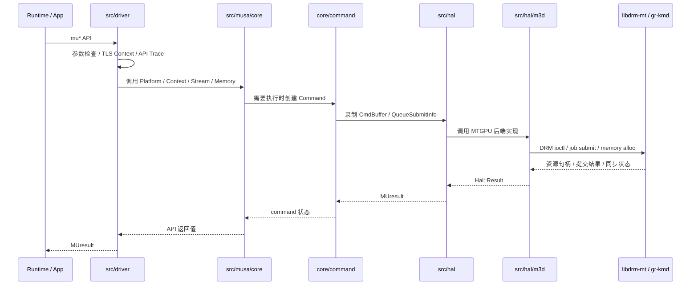

## 3. Driver API 层

目录：`src/driver/`

Driver API 层是 `libmusa.so` 的外部入口。它接收 `mu*` API 调用，完成参数检查、Context 查询、API trace、MUPTI 回调、错误码转换，然后调用 Core 层对象。

### 3.1 入口表与导出表

关键文件：

| 文件 | 作用 |
|---|---|
| `muapi.h` | `muapi*` 内部函数声明，覆盖 Driver API 各领域 |
| `mu_wrappers_generated.cpp` | 自动生成的公开 API wrapper，负责把 `mu*` 转到 `muapi*` |
| `mu_entry.cpp` | `muInit`、`muGetExportTable`、`muGetProcAddress` 等入口 |
| `internal.cpp` | `DriverEntryPointTable`，按 API 名称注册版本化函数指针 |
| `export_table.h` | Runtime、Driver、Profiler、MUPTI 等导出表结构 |

调用路径：

```text
muGetExportTable / muGetProcAddress
  -> mu_entry.cpp
  -> DriverEntryPointTable / ExportTable
  -> 返回函数指针表
```

`internal.cpp` 中的 `DriverEntryPointTable` 会注册 API 名称、版本号和函数指针，例如 `muStreamCreate`、`muStreamSynchronize`、`muMemAlloc_v2` 等。Runtime 或工具侧可以通过导出表获取这些入口。

### 3.2 API 域划分

| 文件 | 领域 | 典型 API |
|---|---|---|
| `mu_context.cpp` | 初始化、Context | `muInit`、`muCtxCreate`、`muCtxSynchronize` |
| `mu_device.cpp` | Device | `muDeviceGetCount`、`muDeviceGetAttribute` |
| `mu_memory.cpp` | Memory / Memcpy | `muMemAlloc_v2`、`muMemFree_v2`、`muMemcpyAsync` |
| `mu_stream.cpp` | Stream | `muStreamCreate`、`muStreamSynchronize` |
| `mu_event.cpp` | Event | `muEventCreate`、`muEventRecord`、`muEventSynchronize` |
| `mu_module.cpp` | Module / Kernel | `muModuleLoad`、`muModuleGetFunction`、`muLaunchKernel` |
| `mu_graph.cpp` | Graph | `muGraphCreate`、`muGraphInstantiate`、`muGraphLaunch` |
| `mu_mempool.cpp` | Memory Pool | `muMemPoolCreate`、`muMemAllocFromPoolAsync` |
| `mu_vmm.cpp` | Virtual Memory | `muMemAddressReserve`、`muMemMap`、`muMemUnmap` |
| `mu_library.cpp` | Library | `muLibraryLoadData`、`muLibraryGetKernel` |
| `mu_tensor.cpp` | Tensor Map | Tensor map encode / descriptor |
| `mu_peer.cpp` | Peer Access | `muDeviceCanAccessPeer`、`muCtxEnablePeerAccess` |
| `mu_external.cpp` | External Resource | external memory / semaphore import |
| `mu_texture.cpp` | Texture / Array | texture object、array、mipmapped array |
| `mu_graph.cpp` | Graph | graph node、graph exec、capture/replay |

### 3.3 API Trace 与工具 hook

关键文件：

| 文件 | 作用 |
|---|---|
| `internal.h` | `ApiInvocationGuard`、`ApiTrace`、TLS last error、Context stack |
| `callback.cpp` | Driver callback |
| `mupti/hooks.cpp` | MUPTI hook 入口 |
| `mugdb/hooks.cpp` | 调试器 hook |
| `muasan/hooks.cpp` | 地址检查 hook |

`ApiInvocationGuard` 做三件事：

1. 记录 API 进入/退出。
2. 分配 correlation id。
3. 在失败时输出错误日志和 backtrace。

这也是 Driver API 性能建模或埋点分析时最直接的入口之一。

## 4. Platform 模块

目录：`src/musa/core/platform.*`

`Platform` 是 Core 层全局对象，负责设备枚举、全局内存跟踪、Context 管理、Graph capture 全局状态、settings 和跨设备关系。

主要职责：

| 职责 | 说明 |
|---|---|
| 全局初始化 | Driver 首次调用时通过 `InitPlatform()` 初始化 |
| 设备管理 | 枚举 M3D/HAL device，维护 device 列表 |
| MemoryTracker | 按 device pointer 查找 Memory 对象 |
| Context 注册 | 添加、删除、校验 Context |
| Capture 管理 | 记录当前处于 capture 的 Stream |
| Virtual Memory | `Platform::CreateMemory` 处理 `memoryTypeVirtual` |

典型路径：

```text
InitPlatform()
  -> Platform::Get()
  -> 初始化 M3D platform/device
  -> 创建 Musa::Device
  -> 建立 P2P topology / settings / memory tracker
```

`Platform::CreateMemory` 只处理 virtual memory。普通 device memory 由 `Context::CreateMemory` 进入 `Memory::GeneralAlloc`。

## 5. Device 模块

目录：`src/musa/core/device.*`

`Device` 是 Core 层对 GPU 设备的封装，向上提供属性、queue family、memory manager、HAL device 等能力。

主要职责：

| 职责 | 说明 |
|---|---|
| 设备属性 | 保存 `Hal::DeviceProperties`，对外支持 `muDeviceGetAttribute` |
| Queue family | 记录 CDM、CE、DMA 等 engine 对应的 queue family |
| HAL Device | 持有底层 `Hal::IDevice` |
| MemMgr | 通过 HAL memory manager 支持 sub-allocation |
| PFM/PC sampling | 为命令层提供性能采样配置 |

典型下游：

```text
Device
  -> Hal::IDevice
  -> Hal::IQueue
  -> Hal::IMemMgr
  -> Hal::IMemory
```

## 6. Context 模块

目录：`src/musa/core/context.*`

`Context` 是大部分 Driver API 的运行状态容器。它管理当前设备上的 Stream、Memory、Module、Event、Graph、默认流和同步关系。

主要职责：

| 职责 | 说明 |
|---|---|
| Stream 管理 | `CreateStream`、`DestroyStream`、默认流、barrier stream |
| Memory 管理 | `CreateMemory`、`DestroyMemory`、Memory 列表 |
| Module 管理 | 加载 module、查找 function |
| Graph 管理 | 创建 node、validate graph exec、graph launch 支持 |
| 依赖解析 | `ResolveDependencyAndQueueCommand` 处理默认流、blocking stream、barrier stream 依赖 |
| 同步 | `Synchronize`、`LockedSyncDefaultStream`、`LockedWait` |

### 6.1 Context 依赖解析

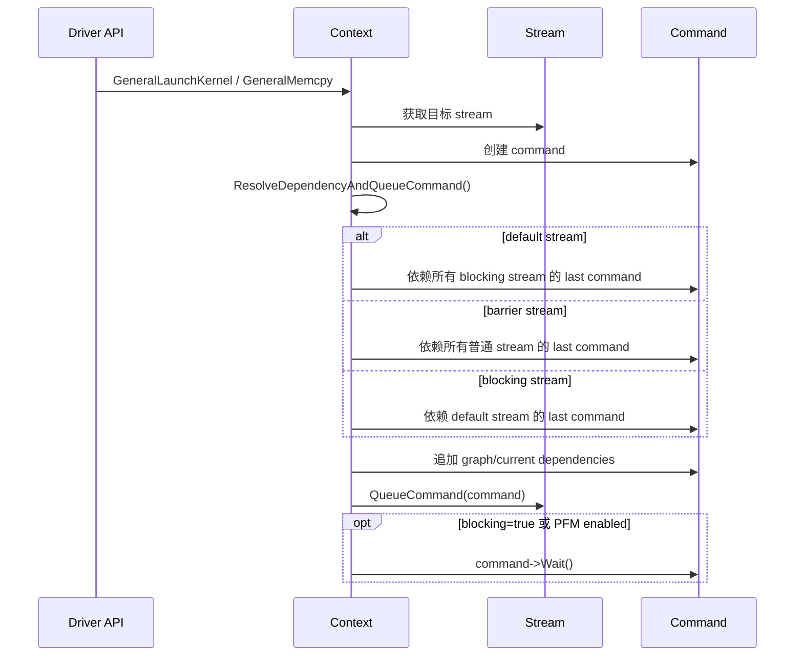

这是 Stream 语义的核心：Driver API 在提交命令前，会根据默认流、blocking stream、barrier stream 和 graph dependency 补齐 command 依赖。

## 7. Stream 模块

目录：`src/musa/core/stream.*`

`Stream` 是命令队列抽象。它把 kernel、memcpy、memset、event、graph node 转换为 `Command` 对象，并通过异步 submit/wait 线程推动执行。

主要职责：

| 职责 | 说明 |
|---|---|
| 命令入队 | `QueueCommand` 设置 seq id、prev command、queued timestamp |
| 异步提交 | `AsyncSubmit` 从 command list 取命令并提交 |
| 异步等待 | `AsyncWait` 回收完成命令，更新状态 |
| Capture | `BeginCapture`、`CaptureNode`、`EndCapture` |
| 同步 | `Synchronize`、`WaitFinish` |
| 命令创建 | `CmdLaunchKernel`、`CmdCopyMemory`、`CmdMemset`、`CmdLaunchGraph` |

### 7.1 Stream 入队时序

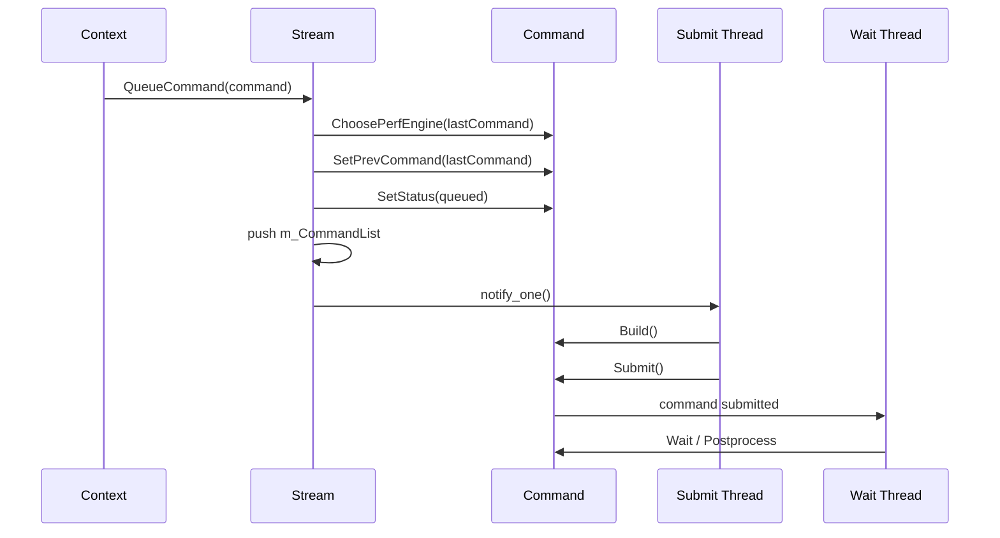

### 7.2 Stream 同步时序

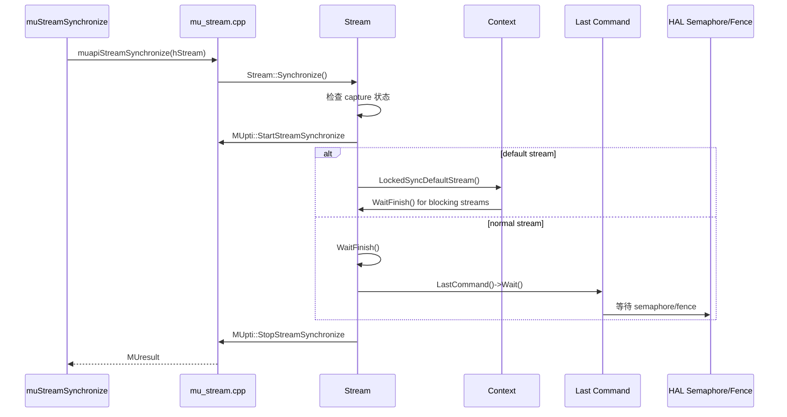

## 8. Command 模块

目录：`src/musa/core/command/`

`Command` 是所有 GPU 工作的统一调度单元。Kernel、Memcpy、Memset、Graph、Event、Atomic 等都被封装成不同的 Command 子类。

主要职责：

| 职责 | 说明 |
|---|---|
| 状态机 | `created -> queued -> built -> submitted -> completed/error` |
| 依赖 | `RecordDependency`、`ResolveSubmitWait`、`ResolveSubmitSignal` |
| CmdBuffer | `Build` 阶段向 HAL CmdBuffer 录制命令 |
| Submit | `SubmitToQueue` 组装 `Hal::QueueSubmitInfo` 并调用 `IQueue::Submit` |
| Timestamp | 支持 MUPTI / Graph trace 的 timestamp |
| PFM/PC sampling | 性能采样配置和 dump |
| 错误处理 | GPU exception、coredump、sticky error |

主要 Command 子类：

| 子类 | 文件 | 用途 |
|---|---|---|
| `DispatchCommand` | `dispatchCommand.cpp` | Kernel launch |
| `SyncMemcpyCommand` / `AsyncMemcpyCommand` | `SyncMemcpyCommand.cpp` / `AsyncMemcpyCommand.cpp` | 同步/异步 memcpy |
| `MemsetCommand` | `memsetCommand.cpp` | memset |
| `GraphCommand` | `graphCommand.cpp` | Graph v1 launch |
| `RecordCommand` | `recordCommand.cpp` | Event record |
| `BarrierCommand` | `barrierCommand.cpp` | barrier |
| `MemoryAtomicCommand` | `memoryAtomicCommand.cpp` | stream memory atomic |
| `MemoryWaitWriteCommand` | `memoryWaitWriteCommand.cpp` | memory wait/write |
| `PagingCommand` | `pagingCommand.cpp` | VMM paging |

### 8.1 Command 提交到 HAL

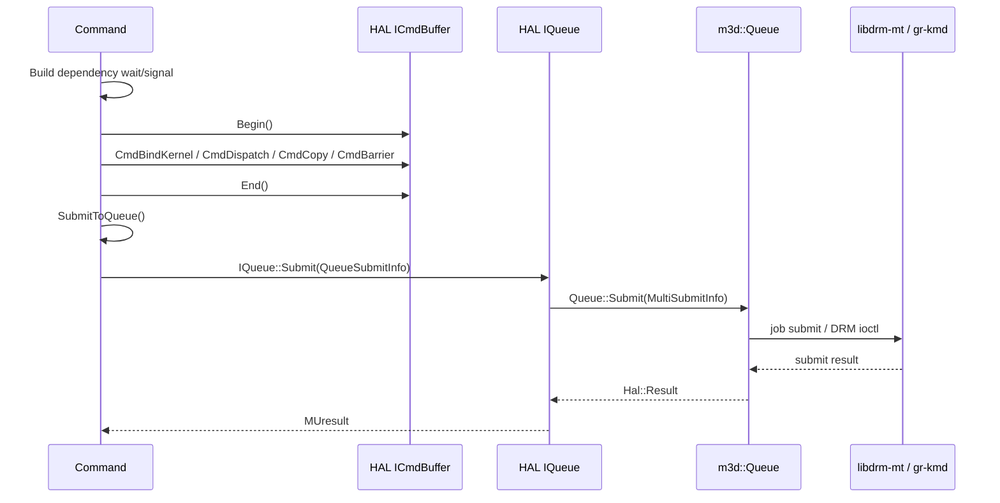

`Command::SubmitToQueue` 会把 `m_SubWaitSemaphoreInfos` 和 `m_SubSignalSemaphoreInfo` 转换为 `QueueSubmitInfo` 的 wait/signal semaphore，再交给 HAL Queue。

## 9. Memory 模块

目录：`src/musa/core/memory.*`、`memoryPool.*`、`memoryTracker.*`

Memory 模块负责 device memory、pinned host memory、managed memory、IPC/import、external memory、VMM 等路径。

主要对象：

| 对象 | 作用 |
|---|---|
| `Memory` | Core 层内存对象，保存 device pointer、host pointer、HAL memory |
| `MemoryPool` | Core 层内存池 |
| `MemoryTracker` | Platform 级指针区间查询 |
| `Hal::IMemMgr` | HAL 层 sub-allocation 管理 |
| `m3d::MemoryPool` | M3D 后端内存池 |

### 9.1 `muMemAlloc` 时序

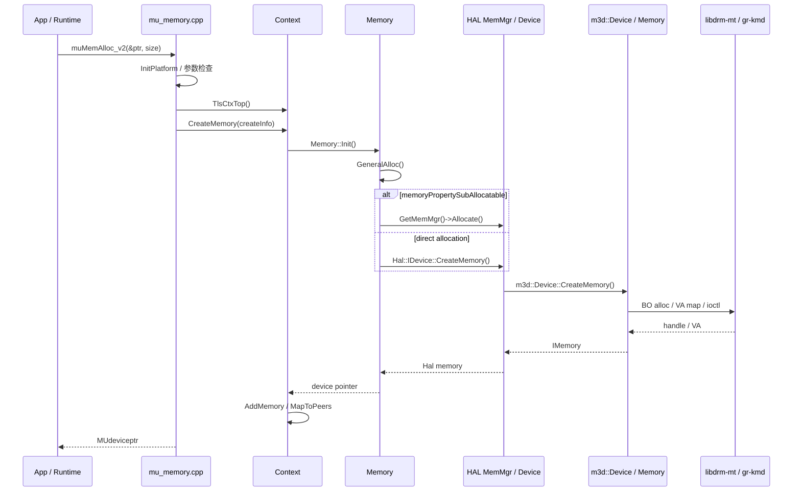

关键点：

- `muapiMemAlloc_v2` 设置 `memoryPropertyVirtual | memoryPropertyDeviceMapped | memoryPropertySubAllocatable`。
- `Memory::GeneralAlloc` 如果带 `SubAllocatable`，优先进入 HAL MemMgr 子分配路径。
- `Context::CreateMemory` 负责把 Memory 加入 context，并处理 peer accessible mapping。
- `Platform::MemoryTracker` 用于后续按 device pointer 反查 Memory。

## 10. Module / Function / Kernel 模块

目录：`src/musa/core/module.*`、`library.*`、`symbol.*`、`src/driver/mu_module.cpp`

Module 模块负责加载二进制、查找 kernel function，并把 kernel launch 参数转换为 GraphKernelNode。

主要路径：

```text
muModuleLoad / muModuleLoadData
  -> Core Module / Library
  -> HAL / M3D Library
  -> Function / Kernel metadata

muModuleGetFunction
  -> Module::GetFunction(name)
  -> Function handle

muLaunchKernel
  -> Context::GeneralLaunchKernel
  -> CreateKernelNode
  -> Stream::CmdLaunchKernel
  -> DispatchCommand
```

### 10.1 Kernel Launch 时序

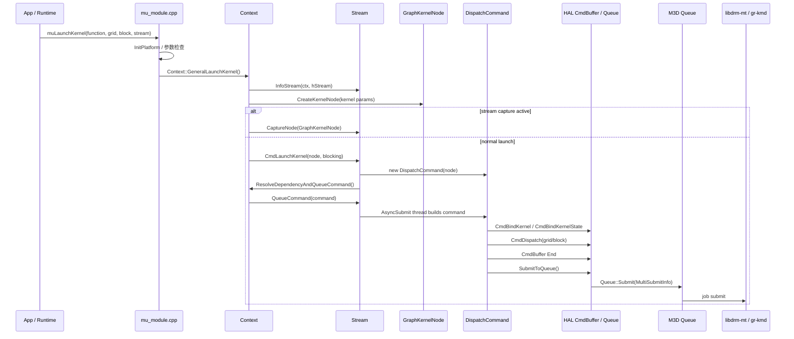

关键点：

- `muapiLaunchKernel` 不直接提交硬件。
- `Context::GeneralLaunchKernel` 会先创建 `GraphKernelNode`，非 Graph capture 场景也复用 node 参数结构。
- 普通 launch 由 `Stream::CmdLaunchKernel` 转成 `DispatchCommand`。
- `DispatchCommand::Build` 录制 `CmdBindKernel`、`CmdBindKernelState`、`CmdDispatch`。
- `DispatchCommand::Submit` 调用 `SubmitToQueue`，最终进入 M3D Queue。

## 11. CopyManager / Memcpy 模块

目录：`src/musa/core/copyManager2/`、`src/musa/core/command/*Memcpy*`

Memcpy 路径会先标准化为 `MUSA_MEMCPY3D_PEER`，然后创建 `GraphMemcpyNode`，再选择 `SyncMemcpyCommand` 或 `AsyncMemcpyCommand`。具体 copy 后端由 CopyManager 决定。

CopyManager 后端：

| 后端 | 目录 | 适用方向 |
|---|---|---|
| CPU copy | `copyManager2/cpuCopyManager` | Host 可直接访问的小拷贝或特殊路径 |
| DMA copy | `copyManager2/dmaCopyManager` | DMA 引擎拷贝 |
| GPU copy | `copyManager2/gpuCopyManager` | GPU 引擎拷贝 |
| Shader copy | `copyManager2/shaderCopyManager` | 用内部 shader/kernel 完成 copy |

### 11.1 Memcpy 时序

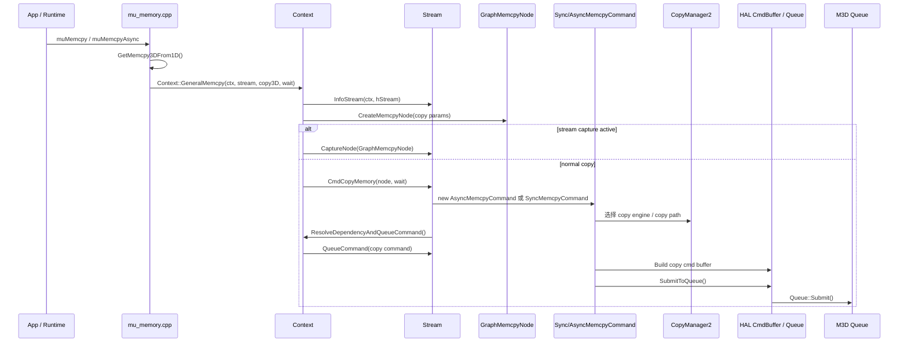

关键点：

- `muMemcpy` 传 `wait=true`，`muMemcpyAsync` 传 `wait=false`。
- 同步或异步不只取决于 API 名称，还取决于 command 类型、stream 和 copy path。
- Peer copy 会额外创建 event/record command，保证源和目标 context 的依赖关系。

## 12. Graph 模块

目录：`src/musa/core/graph/`、`src/musa/core/node/`、`src/driver/mu_graph.cpp`

Graph 模块分为 graph 对象、graph exec、node 和 graph launch。源码中存在 graph1 和 graph2 两套实现。

主要对象：

| 对象 | 作用 |
|---|---|
| `Graph` | 原始 graph，保存 node 和依赖 |
| `GraphExec` / `GraphExec2` | 实例化后的可执行 graph |
| `GraphNode` | node 基类 |
| `GraphKernelNode` | kernel node |
| `GraphMemcpyNode` | memcpy node |
| `GraphMemsetNode` | memset node |
| `GraphHostNode` | host callback node |

### 12.1 Graph Launch 时序

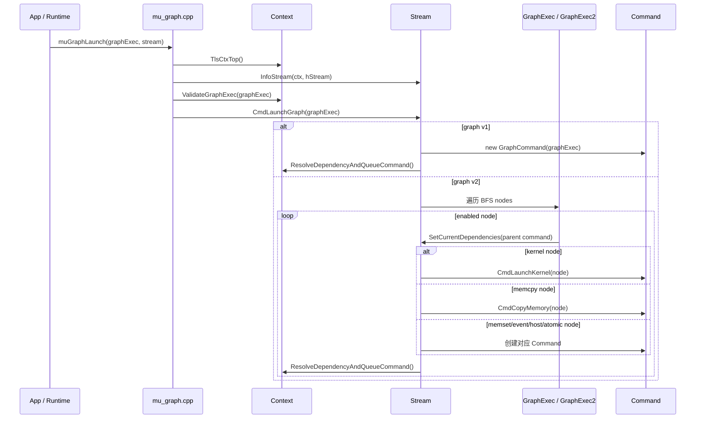

关键点：

- capture 期间不会立即提交硬件，而是把 API 操作转为 GraphNode。
- graph2 launch 时按 BFS node 顺序展开。
- 跨 stream 依赖通过 `SetCurrentDependencies` 转入普通 command dependency 体系。
- Graph kernel/memcpy/memset 最终仍复用普通 `CmdLaunchKernel`、`CmdCopyMemory`、`CmdMemset` 路径。

## 13. Event 与同步模块

目录：`src/musa/core/event.*`、`src/musa/core/command/recordCommand.*`、`mu_event.cpp`

Event 用于 stream 间依赖、计时和同步。核心机制是把 event record/wait 转成 command 或 semaphore dependency。

主要职责：

| 职责 | 说明 |
|---|---|
| Event record | 在 stream 上记录 event 对应 command |
| Event wait | 当前 stream 依赖 event 所属 command |
| Event query | 查询 command 是否完成 |
| Event synchronize | 等待 event command 完成 |
| elapsed time | 从 event timestamp 计算 GPU 时间 |

同步相关的 Driver API：

```text
muStreamSynchronize
muCtxSynchronize
muEventSynchronize
muStreamWaitEvent
```

`Stream::Synchronize` 会注册 MUPTI 同步事件；普通 stream 等待 last command，default stream 会等待同一 context 下所有 blocking stream。

## 14. 扩展资源与辅助 API 模块

这些模块通常位于 kernel/memcpy 主路径之外，但仍使用同一套 Driver/Core/HAL 框架。判断这类 API 的执行方式时，重点看它是否创建资源、是否创建 stream command、是否进入 HAL/M3D。

| 模块 | 入口文件 | Core 对象 | 执行特点 |
|---|---|---|---|
| Memory Pool | `src/driver/mu_mempool.cpp`、`src/driver/mu_memory.cpp:342` | `MemoryPool` | 管理可复用内存池；`muMemAllocFromPoolAsync` 进入 stream-ordered allocation 路径。 |
| VMM | `src/driver/mu_vmm.cpp:14`、`:75`、`:174`、`:224`、`:245` | `Memory`、`MemoryPool`、`Platform` | 拆分 VA reservation、generic allocation handle、map/unmap、access control。 |
| Peer Access | `src/driver/mu_peer.cpp:13`、`:39` | `Platform`、`Device`、`Context` | 查询 P2P capability，启用跨 context peer mapping。 |
| External Memory | `src/driver/mu_external.cpp:146`、`:167` | `ExternalMemory` | 导入外部 memory handle，并通过 `GetMappedBuffer` 生成可用于 Driver API 的 device pointer。 |
| External Semaphore | `src/driver/mu_external.cpp:18`、`:39`、`:83` | `ExternalSemaphore`、`Stream` | signal/wait 会创建 stream command，进入普通依赖和提交体系。 |
| Texture / Surface / Array | `src/driver/mu_texture.cpp:13`、`src/driver/mu_memory.cpp:1846`、`:2151` | `Texture`、`Surface`、`Array` | 负责资源描述、array storage、texture/sampler state 生成。 |
| Graphics / GL Interop | `src/driver/mu_oglinterop.cpp:14`、`:53`、`src/driver/mu_gfxinterop.cpp:15`、`:189` | `GraphicsResource` | 注册、map、unmap GL 资源，并提供 mapped pointer 或 mapped array。 |
| Library | `src/driver/mu_library.cpp:168`、`:284` | `Library`、`Module`、`Function` | 加载 library，解析 kernel/global/managed symbol，可转为 module/function 供 launch 使用。 |
| Occupancy | `src/driver/mu_occupancy.cpp:13`、`:56`、`:152` | `Function`、`Device` | 依据 kernel 属性和设备资源估算 block/cluster 配置，不创建 GPU command。 |
| Tensor Descriptor | `src/driver/mu_tensor.cpp:82`、`:189`、`:235`、`:295` | descriptor 数据结构 | 编码 tensor map、im2col/direct conv 参数，属于 host 侧描述符构造。 |
| GreenContext | `src/driver/mu_greencontext.cpp:72`、`:100` | `GreenContext` | 继承 `Context`，用于资源切分后的 context 和 stream 创建。 |
| Raytracing | `src/driver/mu_raytracing.cpp:11`、`:34`、`:57`、`:136` | `DispatchRayCommand`、`AccelStruct*Command` | build/copy/emit accel structure 和 launch rays 都进入 Stream/Command/HAL 路径。 |
| Coredump / Profiler | `src/driver/mu_coredump.cpp:13`、`src/driver/mu_profiler.cpp:13` | `Platform`、settings、工具状态 | 配置诊断和 profiler 开关；通常不创建普通 GPU command。 |
| Notification / Logs | `src/driver/mu_notification.cpp:129`、`src/driver/mu_log.cpp:5` | `NotificationManager`、`LogsManager` | 提供内存阈值异步通知和日志查询/导出。 |

### 14.1 VMM 与 Memory Pool 时序

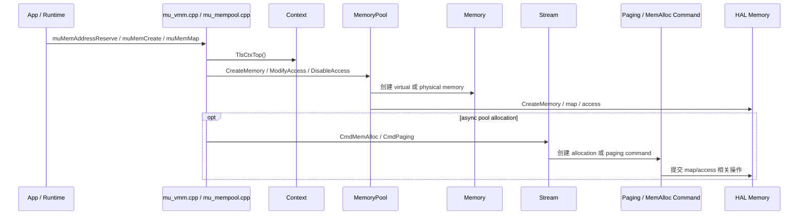

该路径把“申请地址空间”和“提交执行命令”分开：VMM API 管理虚拟地址和物理 allocation，stream-ordered allocation 需要通过 Stream/Command 保证顺序。

### 14.2 External Semaphore 时序

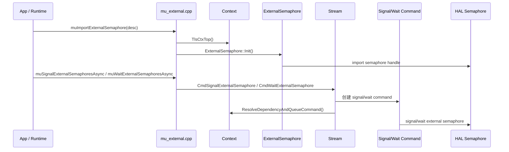

External semaphore 是跨 API 或跨进程同步资源。导入阶段创建资源对象，signal/wait 阶段进入 stream command 调度。

### 14.3 Raytracing 时序

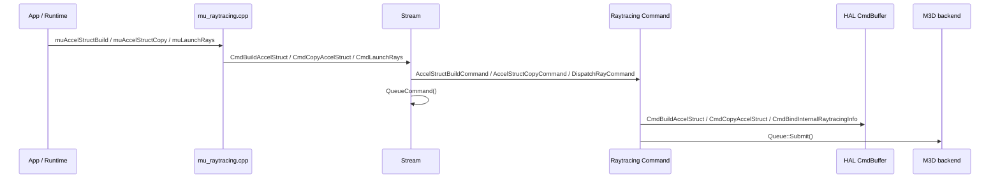

Raytracing 与普通 kernel launch 的差异主要在 command 类型和 HAL command 内容。依赖解析、入队、提交和等待仍复用 Stream/Command 主框架。

## 15. HAL 层

目录：`src/hal/`

HAL 层定义设备无关接口。Core 层通过 HAL 接口访问后端能力，具体实现由 M3D 或 OS backend 提供。

主要接口：

| 接口 | 文件 | 作用 |
|---|---|---|
| `IDevice` | `halDevice.h` | 创建 Queue、Memory、Semaphore、Kernel、PerfExperiment |
| `IQueue` | `halQueue.h` | 提交 command buffer、等待/发送 semaphore、查询错误 |
| `IMemory` | `halMemory.h` | 内存映射、VA、属性、host pointer |
| `ICmdBuffer` | `halCmdBuffer.h` | 录制 dispatch、copy、barrier、timestamp、wait/write |
| `ISemaphore` | `halSemaphore.h` | timeline/hardware semaphore |
| `IMemoryPool` | `halMemoryPool.h` | pool 分配和释放 |
| `IKernel` / `ILibrary` | `halKernel.h` / `halLib.h` | kernel metadata 和 module/library |

HAL 层的作用是稳定 Core 与硬件后端之间的契约。Core 的 `Command` 只依赖 `CmdDispatch`、`CmdCopy`、`Queue::Submit` 等接口，具体 OS 后端由 HAL/M3D 层处理。

## 16. M3D 后端

目录：`src/hal/m3d/`

M3D 后端是 HAL 接口的 MTGPU 实现。它把 HAL 的抽象对象转成 M3D SDK 对象，再通过 OS 后端进入 libdrm-mt / DRM ioctl / gr-kmd。

主要模块：

| 模块 | 文件 | 职责 |
|---|---|---|
| Platform | `platform.cpp` | 创建设备、处理 virtual memory |
| Device | `device.cpp` | 创建 queue、memory、semaphore、kernel、library |
| Queue | `queue.cpp` | 把 `Hal::QueueSubmitInfo` 转成 `M3d::MultiSubmitInfo` 并提交 |
| CmdBuffer | `cmdBuffer.cpp` | 录制底层 M3D command |
| Memory | `memory.cpp` | device memory、host mapping、peer memory |
| MemoryPool | `memoryPool.cpp` | M3D 层内存池和子分配 |
| MemMgr | `memMgr.cpp` | memory pool 管理 |
| Semaphore | `semaphore.cpp` | queue semaphore |
| Kernel / Library | `kernel.cpp`、`library.cpp` | kernel metadata、module/library 加载 |
| InternalShaderMgr | `InternalShaderMgr.cpp` | 内部 shader copy/memset 等辅助 kernel |

### 16.1 Queue Submit 时序

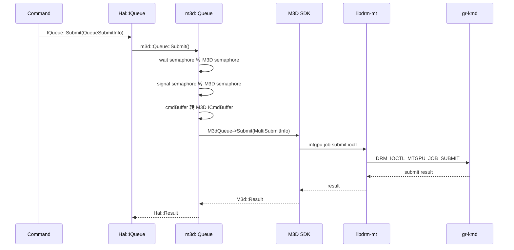

`m3d::Queue::Submit` 处理了这些细节：

- wait semaphore 数量限制和超出部分的独立提交。
- signal semaphore 数量限制和超出部分的独立提交。
- cmdBuffer 列表转换为 `IM3d::PerSubQueueSubmitInfo`。
- PFM 信息、pdump view、异常设置和 free schedule 标志。
- 最终调用 `m_M3dQueue->Submit(m3dSubmitInfo)`。

## 17. MUPTI / MUGDB / MUASAN 工具模块

目录：`src/driver/mupti/`、`src/driver/mugdb/`、`src/driver/muasan/`

这些模块不改变主执行语义，但会在 API、Command、Kernel、Memcpy、Graph、Synchronize 等位置记录事件或插入检查。

| 模块 | 作用 | 典型切点 |
|---|---|---|
| MUPTI | profiling / activity / callback | API enter/exit、kernel、memcpy、graph、stream sync |
| MUGDB | debugger hook | kernel loading、调试事件 |
| MUASAN | 地址检查 | kernel 参数、struct param、memory range |

典型切点：

```text
ApiInvocationGuard
  -> API enter/exit

DispatchCommand
  -> RegisterKernel / RegisterKernelV2
  -> MarkKernelQueued / submitted / begin-end

MemcpyCommand
  -> EnterMemcpy / ExitMemcpy / MarkCommandBeginEnd

Stream::Synchronize
  -> RegisterStreamSynchronize / Start / Stop

GraphExec2
  -> Graph trace resource / Graph node timestamp
```

这些位置适合做 driver 白盒性能建模埋点，因为它们覆盖 API 边界、命令排队、命令提交、硬件开始结束和同步等待。

## 18. 公共头文件与 ABI

目录：`src/musa_shared_include/`

主要文件：

| 文件 | 作用 |
|---|---|
| `musa.h` | Driver API 对外声明 |
| `driver_types.h` | 共享类型定义 |
| `export_table.h` | Runtime、Driver、Profiler、MUPTI 导出表 |
| `generated_musa_meta.h` | API 元数据 |
| `mupti/mupti_driver_cbid.h` | Driver API callback id |
| `mupti/mupti_runtime_cbid.h` | Runtime API callback id |

该目录是 Runtime、Driver、MUPTI、工具之间共享 ABI 的基础。修改这里会影响多个仓库和工具。

## 19. Tools、UT 与调试辅助

| 目录 | 作用 |
|---|---|
| `src/tools/` | `muInfo` 等命令行工具 |
| `src/gdb/` | gdb 调试接口 |
| `unittest/driver/` | Driver API 领域测试 |
| `unittest/hal/` | HAL 层测试 |
| `unittest/musa/` | Core 层测试 |
| `tests/` | 集成或专项测试 |

`unittest/driver/` 的目录按 Driver API 领域组织，例如 Memory、Stream、Event、Graph、Module、VMM、Device、Context 等，和 `src/driver/mu_*.cpp` 基本对应。

## 20. 关键调用链汇总

### 20.1 初始化

```text
muInit / muGetExportTable
  -> mu_entry.cpp
  -> InitPlatform()
  -> Platform::Get()
  -> HAL/M3D device 枚举
  -> ExportTable / EntryPointTable
```

### 20.2 内存分配

```text
muMemAlloc_v2
  -> TlsCtxTop()
  -> Context::CreateMemory
  -> Memory::Init
  -> Memory::GeneralAlloc
  -> Hal::IMemMgr::Allocate 或 Hal::IDevice::CreateMemory
  -> m3d::Device::CreateMemory
  -> DRM/KMD
```

### 20.3 Kernel Launch

```text
muLaunchKernel
  -> Context::GeneralLaunchKernel
  -> Context::CreateKernelNode
  -> Stream::CmdLaunchKernel
  -> DispatchCommand
  -> Context::ResolveDependencyAndQueueCommand
  -> Stream::QueueCommand
  -> DispatchCommand::Build
  -> CmdBindKernel / CmdBindKernelState / CmdDispatch
  -> DispatchCommand::Submit
  -> Command::SubmitToQueue
  -> Hal::IQueue::Submit
  -> m3d::Queue::Submit
  -> DRM/KMD job submit
```

### 20.4 Memcpy

```text
muMemcpy / muMemcpyAsync
  -> GetMemcpy3DFrom1D
  -> Context::GeneralMemcpy
  -> Context::CreateMemcpyNode
  -> Stream::CmdCopyMemory
  -> SyncMemcpyCommand / AsyncMemcpyCommand
  -> CopyManager2
  -> Command::SubmitToQueue
  -> Hal::IQueue::Submit
  -> m3d::Queue::Submit
```

### 20.5 Stream 同步

```text
muStreamSynchronize
  -> Stream::Synchronize
  -> MUPTI StreamSynchronize begin
  -> default stream: Context::LockedSyncDefaultStream
  -> normal stream: Stream::WaitFinish
  -> LastCommand::Wait
  -> MUPTI StreamSynchronize end
```

### 20.6 Graph Launch

```text
muGraphLaunch
  -> Context::ValidateGraphExec
  -> Stream::CmdLaunchGraph
  -> graph v1: GraphCommand
  -> graph v2: BFS node 展开
       kernel node -> CmdLaunchKernel
       memcpy node -> CmdCopyMemory
       memset node -> CmdMemset
       event/host/atomic node -> 对应 Command
  -> ResolveDependencyAndQueueCommand
  -> QueueCommand
```

## 21. 分析结论

`linux-ddk/musa` 是完整的用户态驱动栈：

```text
API 兼容入口
  -> Core 对象模型
  -> Stream/Command 调度
  -> HAL 抽象
  -> M3D 后端
  -> DRM/KMD
```

源码阅读时应先判断当前代码位于哪一层：

| 看到的代码 | 应判断的问题 |
|---|---|
| `muapi*` | 参数如何校验，进入哪个 Core 对象 |
| `Context::*` | 是否涉及默认流、capture、memory/module/event 生命周期 |
| `Stream::*` | 是入队、capture、同步，还是直接创建 command |
| `Command::*` | Build 阶段录制了什么，Submit 阶段交给哪个 HAL queue |
| `Hal::*` | 抽象接口是什么，是否屏蔽具体硬件 |
| `m3d::*` | 如何转成 M3D SDK 调用，是否进入 DRM/KMD |
| `MUpti/MUGDB/MUASAN` | 是工具 hook，还是会改变主路径语义 |

最核心的两条主线：

```text
资源主线：
muMemAlloc -> Context -> Memory -> HAL/M3D Memory -> KMD

执行主线：
muLaunchKernel -> Context -> Stream -> DispatchCommand -> HAL/M3D Queue -> KMD
```
