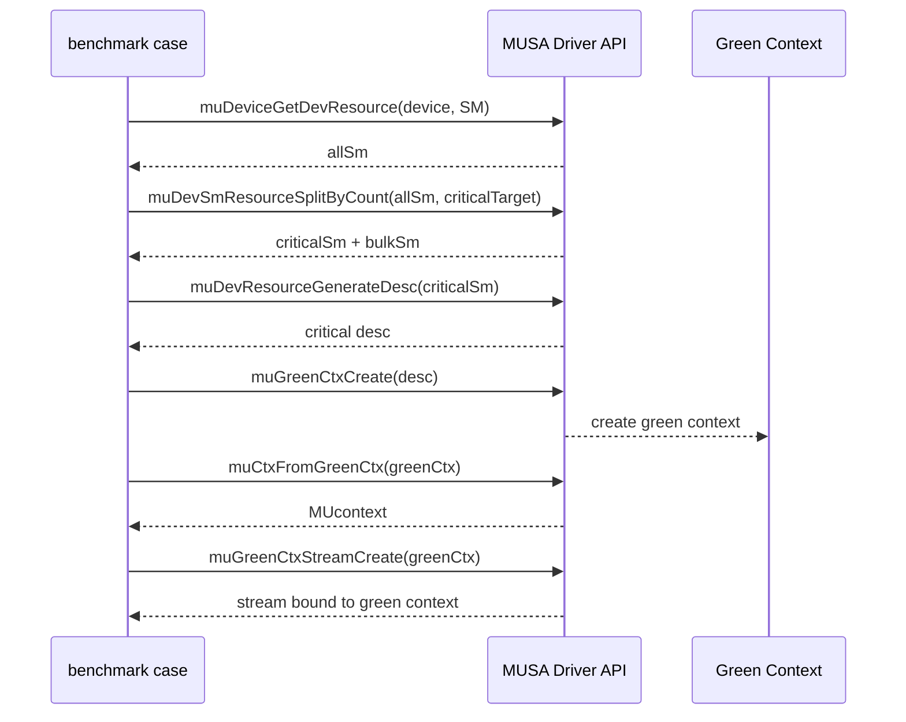

# Green Context 性能看护用例设计与实现记录

## 1. 目标

在 `musa_benchmarks` 中新增一个可自动化执行的 Green Context 性能看护用例，用于持续观察两类风险：

- Green Context 的 SM 隔离是否仍然有效。
- Green Context 的创建和销毁开销是否出现回归。

本次实现最终采用两个独立 executable 承载两类 benchmark，避免不同 UDM schema 写入同一个 CSV：

- `greenContextIsolation` / `greenContextLatency`：验证隔离收益。
- `greenContextLifecycle` / `greenContextLifecycle`：验证创建/销毁成本。

远程实现位置：

```text
/home/shanfeng/workspace/musa_benchmarks/schedule/greenContextIsolation.cu
/home/shanfeng/workspace/musa_benchmarks/schedule/greenContextLifecycle.cu
/home/shanfeng/workspace/musa_benchmarks/schedule/greenContextIsolation_common.h
```

用例放在 `schedule/`，原因是该目录会同时参与 `ENABLE_MCC` 和 `ENABLE_NVCC` 构建。
源码以 MUSA API 为主：

- 源文件直接使用 `musa.h`、`musa_runtime.h`、`muGreenCtx*`、`muDevResource*`。
- CUDA 版本通过 musify 将 `musaXXX` / `muXXX` 自动转换为 `cudaXXX` / `cuXXX`，不在源码中手写双后端映射。
- 如果 CUDA 头文件版本低于 12.4，源码会编译为 unsupported marker case，避免旧 CUDA 环境直接编译失败。

## 2. 已完成改动

远程仓库：

```text
/home/shanfeng/workspace/musa_benchmarks
```

新增文件：

```text
schedule/greenContextIsolation.cu
schedule/greenContextLifecycle.cu
schedule/greenContextIsolation_common.h
```

修改文件：

```text
scripts/autorun.py
TestSuitConfig.json
```

集成方式：

- `greenContextIsolation.cu` 只保留 latency/isolation benchmark，注册 `greenContextLatency`。
- `greenContextLifecycle.cu` 只保留 lifecycle benchmark，注册 `greenContextLifecycle`。
- `greenContextIsolation_common.h` 以 MUSA API 为源实现 Green Context helper、kernel 和 dynamic shared memory 自动选择逻辑；CUDA 版本由 musify 自动转换。
- `scripts/autorun.py` 的 `graphAndScheduleCases` 增加 `greenContextIsolation` 和 `greenContextLifecycle`。
- `TestSuitConfig.json` 的 `graphAndSchedule` suite 增加 `greenContextIsolation` 和 `greenContextLifecycle`。
- `schedule/CMakeLists.txt` 使用 `*.cu` 自动发现，无需修改 CMake 文件。

该调整使同一个 case 在 MUSA 与 CUDA 构建路径下都可被发现：

```text
ENABLE_MCC=ON  -> 使用 MUSA 后端
ENABLE_NVCC=ON -> 使用 CUDA 后端
```

## 3. 用例设计

### 3.1 核心思路

Green Context 的价值不是让所有 kernel 更快，而是在后台负载存在时，为关键 workload 保留稳定的 SM 资源。

因此用例不测总耗时，而是测：

```text
critical kernel 在后台 delay kernel 已经运行时的完成时间
```

如果 Green Context 有效，critical kernel 的耗时应接近无干扰时的 solo 耗时。

### 3.2 资源划分

用例先获取设备全部 SM 资源：

```cpp
muDeviceGetDevResource(device, &allSm, MU_DEV_RESOURCE_TYPE_SM);
```

然后按目标 critical SM 数切分：

```cpp
muDevSmResourceSplitByCount(
    &criticalSm,
    &nbGroups,
    &allSm,
    &bulkSm,
    0,
    criticalTarget);
```

在 S5000 上，本次验证得到的分区为：

| critical 目标 | critical 实际 SM | bulk SM |
|---:|---:|---:|
| 8 | 8 | 48 |
| 16 | 16 | 40 |

### 3.3 kernel 设计

用例使用同一个 kernel 模拟 critical workload 和 background workload：

```cpp
sm_occupancy_spin_kernel(spinCycles, startedFlags, marker)
```

关键设计：

- kernel 使用 `extern __shared__` 动态 shared memory，而不是固定 static shared memory。
- `threads/block`、`sharedBytes` 和 `activeBlocksPerSM` 由运行时根据当前设备选择。
- 选择规则：遍历 block size 和 shared memory size，优先选择 `activeBlocksPerSM == 1` 的配置；如果没有满足条件的候选值，则选择 `activeBlocksPerSM` 最小的候选值。
- 通过 `musaFuncSetAttribute` / `cudaFuncSetAttribute` 设置最大 dynamic shared memory。
- 输出增加 `block`、`smem(KiB)` 和 `blk/SM`，用于确认实际选择的 block size、shared memory 和 occupancy。
- 大 shared memory 限制 occupancy，使一个 block 接近独占一个 SM。
- block 数约等于占用 SM 数。
- `clock64()` busy wait 控制 kernel 运行时间。
- mapped host flag 用于确认 delay kernel 的所有 block 已经启动。

静态 shared memory 不能在运行时自动选择，因此当前实现改为动态 shared memory。
MUSA/S5000 当前自动选择约 `188 KiB`，CUDA/RTX 3060 当前自动选择约 `47 KiB`，两端都达到 `blk/SM=1`。

这样可以把实验解释为：

```text
delayBlocks 个 block 先占住 delayBlocks 个 SM；
然后测 criticalBlocks 个 block 在这种背景负载下的完成时间。
```

### 3.4 为什么需要 mapped host flag

如果直接先 launch delay kernel 再 launch critical kernel，host 侧无法确认 delay kernel
是否已经占住目标 SM。这样会导致 critical kernel 可能在 delay kernel 尚未稳定运行时
开始计时，结果不可靠。

因此 delay kernel 启动后，每个 block 写一个 mapped host flag：

```text
startedFlags[blockIdx.x] = marker
```

host 轮询到所有 flag 都被写入后，再记录 critical kernel 的 event start。

注意：flag 等待发生在 critical event start 之前，不计入 critical latency。

## 4. Benchmark 分组

### 4.1 `greenContextLatency`

该组用于看护隔离收益。包含三个实验。

#### `primaryFullContention`

基线场景。

```text
delay kernel:    Primary Context，占用全部 SM
critical kernel: Primary Context，占用 critical SM 数量的 block
```

含义：

- 无 Green Context。
- 后台负载占满全卡。
- 观察关键 workload 在普通多流并发下的最差干扰。

#### `primaryBulkOnly`

对照场景。

```text
delay kernel:    Primary Context，只启动 bulk SM 数量的 block
critical kernel: Primary Context，占用 critical SM 数量的 block
```

含义：

- 仍然不使用 Green Context。
- delay kernel 的 block 数与 Green Context bulk 分区一致。
- 用于区分“后台 block 少了”与“Green Context 隔离生效”。

#### `greenPartitioned`

目标场景。

```text
delay kernel:    Bulk Green Context
critical kernel: Critical Green Context
```

含义：

- 后台负载和关键 workload 使用不同 Green Context。
- 两者绑定不同 SM 资源。
- 预期 critical kernel latency 接近 solo latency。

### 4.2 `greenContextLifecycle`

该组用于看护 Green Context 创建/销毁成本。

实验：

```text
createDestroyPair
```

单轮动作：

```text
创建 critical Green Context
创建 bulk Green Context
device synchronize
销毁 critical Green Context
销毁 bulk Green Context
```

输出每对 critical+bulk Green Context 的平均创建/销毁耗时。

## 5. 指标定义

### 5.1 latency 指标

| 指标 | 含义 |
|---|---|
| `solo(ms)` | critical kernel 无后台负载时的耗时 |
| `crit(ms)` | critical kernel 在后台负载存在时的耗时 |
| `*Iso` | `solo(ms) / crit(ms)` |
| `critSM` | critical 分区实际 SM 数 |
| `bulkSM` | bulk 分区实际 SM 数 |

`*Iso` 是评分列，含义如下：

| `*Iso` | 解释 |
|---:|---|
| 接近 1 | critical latency 基本不受后台负载影响 |
| 明显小于 1 | critical latency 被后台负载拉长 |
| 大于 1 | contended 结果略快于 solo，通常来自计时波动或调度差异 |

### 5.2 lifecycle 指标

| 指标 | 含义 |
|---|---|
| `create(us)` | 一对 critical+bulk Green Context 创建/销毁的平均耗时 |
| `*CreateTP(s^-1)` | 每秒可完成的 create/destroy pair 数量 |
| `critSM` | critical 分区实际 SM 数 |
| `bulkSM` | bulk 分区实际 SM 数 |

`create(us)` 不是单个 `muGreenCtxCreate()` 或 `cuGreenCtxCreate()` 的耗时。当前用例测量
一对 critical+bulk Green Context 的完整生命周期，包含：

```text
critical Green Context create
bulk Green Context create
ctxFromGreenCtx
ctxSetCurrent
Green Context stream create
Green Context resource query
nop kernel warmup launch
stream synchronize
device synchronize
stream destroy
Green Context destroy
```

因此，`create(us)` 只能解释为 lifecycle pair 成本，不能直接归因到 `criticalSM`
数量本身。

## 6. 端到端流程

### 6.1 Green Context 创建流程



### 6.2 latency 测试流程

```mermaid
sequenceDiagram
    participant Host as Host benchmark
    participant Delay as Delay stream/context
    participant Critical as Critical stream/context

    Host->>Delay: launch delay kernel
    Delay-->>Host: write mapped started flags
    Host->>Host: wait until all delay blocks started
    Host->>Critical: record critical start event
    Host->>Critical: launch critical kernel
    Host->>Critical: record critical stop event
    Host->>Critical: synchronize stop event
    Critical-->>Host: critical elapsed time
    Host->>Delay: synchronize delay stream
```

## 7. 双后端适配方式

### 7.1 API 映射

源码以 MUSA API 为唯一源实现，不再在文件顶部维护手写双后端映射。CUDA 版本通过 `musify`
把 MUSA Runtime / Driver API 自动转换为 CUDA Runtime / Driver API。源码中的 `TEST_ON_NVIDIA`
仅用于 CUDA header 版本降级保护以及少量编译器属性差异，不承担完整后端抽象职责。

| API 家族 | MUSA 源实现 | musify 后 CUDA 形式 |
|---|---|---|
| Runtime error | `musaError_t` | `cudaError_t` |
| Runtime stream | `musaStream_t` | `cudaStream_t` |
| Runtime event | `musaEvent_t` | `cudaEvent_t` |
| Driver result | `MUresult` | `CUresult` |
| Device | `MUdevice` | `CUdevice` |
| Context | `MUcontext` | `CUcontext` |
| Green Context | `MUgreenCtx` | `CUgreenCtx` |
| SM resource | `MUdevResource` | `CUdevResource` |
| Resource split | `muDevSmResourceSplitByCount` | `cuDevSmResourceSplitByCount` |
| Green Context create | `muGreenCtxCreate` | `cuGreenCtxCreate` |
| Green Context stream | `muGreenCtxStreamCreate` | `cuGreenCtxStreamCreate` |

### 7.2 为什么不能继续放在 `musaOnly`

`musaOnly/` 只在 `ENABLE_MCC` 下加入构建：

```cmake
if (ENABLE_MCC)
    add_subdirectory(musaOnly)
endif()
```

因此放在 `musaOnly/` 的用例不会进入 CUDA 构建。迁移到 `schedule/` 后，`ENABLE_MCC`
和 `ENABLE_NVCC` 都会拾取该 `.cu` 文件。

### 7.3 CUDA 版本要求

CUDA Green Context API 属于较新的 CUDA Driver API。源码中加入了编译期保护：

```cpp
#if !defined(CUDA_VERSION) || CUDA_VERSION < 12040
#define GREEN_CONTEXT_UNSUPPORTED_BUILD 1
#endif
```

当 CUDA 头文件版本不满足要求时，用例仍可编译，但只输出 `*Supported=0` 的 unsupported
marker，不执行 Green Context 测试。这样做可以避免旧 CUDA 环境因为缺少 `CUgreenCtx`
等类型而直接编译失败。

## 8. 远程验证结果

### 8.1 重构目标与结果

本次重构解决两个问题：

1. `greenContextIsolation.cu` 文件过于臃肿，后端适配、公共 helper、latency 和 lifecycle 逻辑混在一起，不符合仓库中多数 `.cu` case 的组织方式。
2. 一个 executable 同时输出 `greenContextLatency` 和 `greenContextLifecycle`，而两组 benchmark 的 UDM schema 不同。`autorun.py` 按 executable 写一个 CSV 时会产生混合表头，影响自动化看护和评分解释。

最终结构：

| 文件 | 作用 |
|---|---|
| `schedule/greenContextIsolation.cu` | latency/isolation benchmark，只注册 `greenContextLatency` |
| `schedule/greenContextLifecycle.cu` | lifecycle benchmark，只注册 `greenContextLifecycle` |
| `schedule/greenContextIsolation_common.h` | MUSA API 源实现，包含 Green Context helper、kernel、dynamic shared memory 选择；CUDA 由 musify 转换 |
| `scripts/autorun.py` | `graphAndScheduleCases` 增加 `greenContextLifecycle` |
| `TestSuitConfig.json` | `graphAndSchedule` suite 增加 `greenContextLifecycle` |

拆分后，一个 executable 对应一套 benchmark 目的和一套 CSV schema：

- `greenContextIsolation.csv` 只包含 latency columns：`solo(ms)`、`crit(ms)`、`*Iso`、`critSM`、`bulkSM`、`block`、`smem(KiB)`、`blk/SM`。
- `greenContextLifecycle.csv` 只包含 lifecycle columns：`create(us)`、`*CreateTP(s^-1)`、`critSM`、`bulkSM`。

### 8.2 MUSA 重构后验证结果

验证环境：

```text
Host: shanfeng@10.18.32.25
Repo: /home/shanfeng/workspace/musa_benchmarks
GPU: MTT S5000
Backend: MUSA
```

直接编译和链接均通过：

```text
/tmp/greenContextIsolation_refactor
/tmp/greenContextLifecycle_refactor
```

注册检查：

```text
/tmp/greenContextIsolation_refactor  -> greenContextLatency
/tmp/greenContextLifecycle_refactor  -> greenContextLifecycle
```

MUSA latency 结果：

| Experiment | criticalSM | solo(ms) Mean | crit(ms) Mean | `*Iso` Mean | critSM | bulkSM | block | smem(KiB) | blk/SM |
|---|---:|---:|---:|---:|---:|---:|---:|---:|---:|
| `primaryFullContention` | 8 | 3.64 | 17.66 | 0.21 | 8 | 48 | 1024 | 188 | 1 |
| `primaryFullContention` | 16 | 3.62 | 17.65 | 0.21 | 16 | 40 | 1024 | 188 | 1 |
| `primaryBulkOnly` | 8 | 3.62 | 16.94 | 0.25 | 8 | 48 | 1024 | 188 | 1 |
| `primaryBulkOnly` | 16 | 3.62 | 3.45 | 1.05 | 16 | 40 | 1024 | 188 | 1 |
| `greenPartitioned` | 8 | 3.46 | 3.45 | 1.00 | 8 | 48 | 1024 | 188 | 1 |
| `greenPartitioned` | 16 | 3.45 | 3.45 | 1.00 | 16 | 40 | 1024 | 188 | 1 |

MUSA lifecycle 结果：

| criticalSM | create(us) Mean | create(us) Min | create(us) Max | `*CreateTP(s^-1)` Mean | critSM | bulkSM |
|---:|---:|---:|---:|---:|---:|---:|
| 8 | 8349.83 | 7912.71 | 14715.58 | 121.95 | 8 | 48 |
| 16 | 8203.45 | 7972.73 | 8375.62 | 121.93 | 16 | 40 |

结论：

- MUSA 后端编译、链接、注册和运行均通过。
- 动态 shared memory 自动选择结果为 `smem(KiB)=188`、`blk/SM=1`。
- `primaryFullContention` 下 critical latency 被拉长到约 `17.6 ms`，`*Iso≈0.21`。
- `greenPartitioned` 下 critical latency 保持约 `3.45 ms`，`*Iso≈1.00`，隔离效果符合预期。
- lifecycle pair 成本约 `8.2–8.3 ms`，仍存在 `criticalSM=8` 的长尾。

### 8.3 CUDA musify 转换验证

本轮去掉了 `greenContextIsolation_common.h` 中手写的 `gpu*` / `drv*` 抽象层，以及 `musaXXX` / `cudaXXX` 双后端映射。源文件保持 MUSA API 写法，CUDA 侧通过 musify 转换。

验证方式：

1. 在 MUSA 远程使用 `/usr/local/musa-5.1.0/tools/musify-text -d m2c` 对三份源码做 MUSA→CUDA 转换。
2. 将转换后的 `greenContextIsolation.cu`、`greenContextLifecycle.cu`、`greenContextIsolation_common.h` 同步到 CUDA 远程。
3. 使用 CUDA 12.8 `nvcc` 编译、链接并运行两个 benchmark。

结果：

- musify 成功将 `musaStream*`、`musaEvent*`、`musaFuncSetAttribute`、`muGreenCtx*`、`muDevResource*` 等调用转换为 CUDA Runtime/Driver API。
- CUDA 编译、链接、注册和运行均通过。
- 指标与手写双后端映射版本一致：`smem(KiB)=47`、`blk/SM=1`、`primaryFullContention *Iso≈0.20`、`greenPartitioned *Iso≈1.00`。

### 8.4 CUDA 重构后验证结果

验证环境：

```text
Host: shanfeng@172.31.8.45
Repo: /home/shanfeng/musa_benchmarks
GPU: NVIDIA GeForce RTX 3060
CUDA: 12.8
nvcc: /usr/local/cuda-12.8/bin/nvcc
```

直接编译和链接均通过：

```text
/tmp/greenContextIsolation_cuda_refactor
/tmp/greenContextLifecycle_cuda_refactor
```

注册检查：

```text
/tmp/greenContextIsolation_cuda_refactor  -> greenContextLatency
/tmp/greenContextLifecycle_cuda_refactor  -> greenContextLifecycle
```

CUDA latency 结果：

| Experiment | criticalSM | solo(ms) Mean | crit(ms) Mean | `*Iso` Mean | critSM | bulkSM | block | smem(KiB) | blk/SM |
|---|---:|---:|---:|---:|---:|---:|---:|---:|---:|
| `primaryFullContention` | 8 | 3.21 | 16.43 | 0.20 | 8 | 20 | 1024 | 47 | 1 |
| `primaryFullContention` | 16 | 3.10 | 15.88 | 0.20 | 16 | 12 | 1024 | 47 | 1 |
| `primaryBulkOnly` | 8 | 3.10 | 3.10 | 1.00 | 8 | 20 | 1024 | 47 | 1 |
| `primaryBulkOnly` | 16 | 3.10 | 3.10 | 1.00 | 16 | 12 | 1024 | 47 | 1 |
| `greenPartitioned` | 8 | 3.10 | 3.10 | 1.00 | 8 | 20 | 1024 | 47 | 1 |
| `greenPartitioned` | 16 | 3.10 | 3.10 | 1.00 | 16 | 12 | 1024 | 47 | 1 |

CUDA lifecycle 结果：

| criticalSM | create(us) Mean | create(us) Min | create(us) Max | `*CreateTP(s^-1)` Mean | critSM | bulkSM |
|---:|---:|---:|---:|---:|---:|---:|
| 8 | 2187.44 | 1856.53 | 8142.34 | 513.09 | 8 | 20 |
| 16 | 1866.96 | 1855.07 | 1883.43 | 535.64 | 16 | 12 |

结论：

- CUDA 后端编译、链接、注册和运行均通过。
- 动态 shared memory 自动选择结果为 `smem(KiB)=47`、`blk/SM=1`。
- `primaryFullContention` 下 critical latency 明显增大，`*Iso≈0.20`。
- `greenPartitioned` 下 critical latency 接近 solo latency，`*Iso≈1.00`。
- lifecycle pair 成本约 `1.9–2.2 ms`，`criticalSM=8` 存在一次长尾。
### 8.5 错误检查封装整改验证

本轮将 GreenContext 中自定义的 `CHECK_MUSA` / `CHECK_MU` 封装替换为仓库标准封装：

- Runtime API 统一使用 `checkMusaErrors(...)`。
- Driver API 统一使用 `checkMuErrors(...)`。
- `greenContextIsolation_common.h` 新增引用 `helper_musa.h` 与 `helper_musa_drvapi.h`。
- 删除自定义 `check_musa_errors`、`check_mu_errors` 以及 `CHECK_MUSA` / `CHECK_MU` 宏。
- 检查 `greenContextIsolation_common.h`、`greenContextIsolation.cu`、`greenContextLifecycle.cu` 后，未发现上述自定义封装残留。

验证结果：

- MUSA / S5000：`greenContextIsolation_check` 与 `greenContextLifecycle_check` 均直接编译、链接、注册和运行通过。
- MUSA latency：`smem(KiB)=188`、`blk/SM=1`，`primaryFullContention *Iso≈0.21`，`greenPartitioned *Iso≈1.00`。
- MUSA lifecycle：`criticalSM=8/16` 均输出独立 lifecycle schema，create pair 约 `7.9–8.2 ms`。
- CUDA / RTX 3060：通过 musify 生成 CUDA 源码后，`greenContextIsolation_cuda_check` 与 `greenContextLifecycle_cuda_check` 均编译、链接、注册和运行通过。
- CUDA latency：`smem(KiB)=47`、`blk/SM=1`，`primaryFullContention *Iso≈0.20`，`greenPartitioned *Iso≈1.00`。
- CUDA lifecycle：`criticalSM=8/16` 均输出独立 lifecycle schema，create pair 约 `1.9–2.2 ms`。

CUDA 验证注意事项：当前 CUDA 远程仓库没有预置 `build/common/libbenchmark_common.a`，本轮在 `/tmp/green_common_cuda_check` 临时编译 common 静态库完成直连验证；另外 CUDA 侧需要使用 musify 后的 helper 头参与编译验证，MUSA 源码本身不保留手写 CUDA/MUSA 条件映射。

### 8.6 create 成本差异分析

从重构后结果看，MUSA 与 CUDA 的 lifecycle pair 成本量级仍存在明显差异：

| 后端 | create pair 量级 |
|---|---:|
| CUDA / RTX 3060 | 约 2 ms |
| MUSA / S5000 | 约 8 ms |

`create(us)` 仍是完整 critical+bulk Green Context lifecycle pair 成本，包含 resource desc、Green Context create、context 转换、stream create、warmup launch/sync、destroy 等多个步骤，不能直接归因到某一个 API。

如果后续要定位成本来源，建议将 lifecycle 计时拆成分项：`T_desc`、`T_green_ctx_create`、`T_ctx_from_green_ctx`、`T_ctx_set_current`、`T_stream_create`、`T_get_resource`、`T_warmup_launch_sync`、`T_stream_destroy`、`T_green_ctx_destroy`，并输出 p50、p90、max。

### 8.7 2026-05-28 复查结果

复查对象为远端 `/home/shanfeng/workspace/musa_benchmarks` 中的 `schedule/greenContextIsolation.cu`
和 `schedule/greenContextLifecycle.cu`。全量 CMake 仍受 `hotPotKernels/qy2Only`
既有构建问题影响，因此本轮使用 `/usr/local/musa/bin/clang++` 对两个用例做直接编译链接验证。

验证结果：

- 两个用例均可直接编译链接；链接旧版 `build/common/libbenchmark_common.a` 时需要 `-no-pie`。
- `greenContextIsolation_check_new -l` 只注册 `greenContextLatency`。
- `greenContextLifecycle_check_new -l` 只注册 `greenContextLifecycle`。
- MUSA / S5000 latency：`smem(KiB)=188`、`blk/SM=1`；`greenPartitioned` 的 `crit(ms)` 约 `3.45 ms`，`*Iso≈1.00`；`primaryFullContention` 的 `crit(ms)` 约 `17.66–17.67 ms`，`*Iso≈0.20–0.21`。
- `primaryBulkOnly` 是普通 stream 调度对照项，本轮 `criticalSM=8` 与 `criticalSM=16` 出现不同调度表现，不建议作为准入阈值；看护应以 `greenPartitioned` 的 `*Iso` 和 `crit(ms)` 稳定性为主。
- MUSA / S5000 lifecycle：`criticalSM=8` 的 `create(us)` 为 `mean=15876.64`、`min=8154.02`、`max=18449.90`；`criticalSM=16` 的 `create(us)` 为 `mean=11670.40`、`min=8364.94`、`max=18457.09`。

结论：latency/isolation 看护路径成立；lifecycle 的低位仍约 8 ms，但存在 18 ms 级长尾，
正式看护不宜只看 mean，建议同时保留 p50、p90、max 或至少 min/mean/max。

### 8.8 代码精简后验证结果

本轮精简了重复的 SM resource split 逻辑和 critical kernel 计时代码，并删除无效的
critical `startedFlags` 清理路径。远端 `/home/shanfeng/workspace/musa_benchmarks` 已同步相同源码。

验证结果：

- `greenContextIsolation.cu` 与 `greenContextLifecycle.cu` 均可直接编译链接。
- `greenContextIsolation_check_new -l` 只注册 `greenContextLatency`。
- `greenContextLifecycle_check_new -l` 只注册 `greenContextLifecycle`。
- MUSA / S5000 latency：`greenPartitioned` 在 `criticalSM=8/16` 下 `crit(ms)` 均约 `3.45 ms`，`*Iso≈1.00`；`primaryFullContention` 和 `primaryBulkOnly` 仍存在普通 stream 调度波动。
- MUSA / S5000 lifecycle：`criticalSM=8` 的 `create(us)` 为 `mean=15151.42`、`min=8143.60`、`max=17601.09`；`criticalSM=16` 的 `create(us)` 为 `mean=12549.93`、`min=8536.09`、`max=19020.31`。

## 9. 当前构建限制

直接编译和运行已经通过。

MUSA 完整 CMake 构建当前被远程仓库既有环境问题阻塞：

- `hotPotKernels/qy2Only/link_asms.sh` 依赖 `mcc`。
- 修正 PATH 后，构建继续失败在 `hotPotKernels/qy2Only/musa_sgemm_core8x8.o`。
- 该 `.o` 文件为 root 用户所有，当前用户无法覆盖。

因此本次没有修改或删除 `build/`、`.o`、`.elf` 等生成产物。后续若需要完整跑
`./install.sh` 或 CMake 全量构建，需要先清理 root-owned build 产物，或在干净构建目录
重新构建。

CUDA 完整 CMake 构建当前被仓库既有 PTX 依赖阻塞：

```text
CMake Error: File /home/shanfeng/musa_benchmarks/schedule/elf/CopyKernel.ptx does not exist.
```

该问题与 `greenContextIsolation.cu` 本身无关。直接编译已经覆盖了该用例的源码编译、
benchmark common 链接、CUDA Driver/Runtime 链接、用例注册和运行路径。

## 10. 建议验收标准

建议将该 case 作为性能看护项，不作为功能正确性的唯一判断。

推荐阈值：

| 指标 | 建议阈值 |
|---|---|
| `greenPartitioned` 的 `*Iso` | 不低于 0.90 |
| `greenPartitioned` 的 `crit(ms)` | 不高于对应 `solo(ms)` 的 1.10 倍 |
| `primaryFullContention` 与 `greenPartitioned` 的 `crit(ms)` 差异 | Green Context 场景应明显更低 |
| `create(us)` | 与基线相比不应出现超过 20% 的持续回归 |

如果某次回归只表现为 `primary*` 场景变化，而 `greenPartitioned` 稳定，优先检查普通
stream 调度和 occupancy 变化。如果 `greenPartitioned` 的 `*Iso` 明显下降，优先检查
Green Context SM partition、stream 绑定、context 切换和 KMD resource scheduling。

## 11. 后续工作

- 建立 `greenContextIsolation` 与 `greenContextLifecycle` 两个正式 baseline CSV，并纳入 `calculateScoreOfSuit.py` 的常规评分流程。
- 在干净构建目录中完成全量 CMake 构建验证。
- 补齐 `schedule/elf/CopyKernel.ptx` 或调整 CMake 依赖后，完成 CUDA `ENABLE_NVCC=ON` 全量构建验证。
- 补充不同 SDK/driver 版本的横向结果，用于确定正式 CI 阈值。
- 如需更细粒度定位，可增加 MUPTI 采集，记录 Green Context kernel 的 context、stream、
  kernel duration 和 SM 资源信息。
