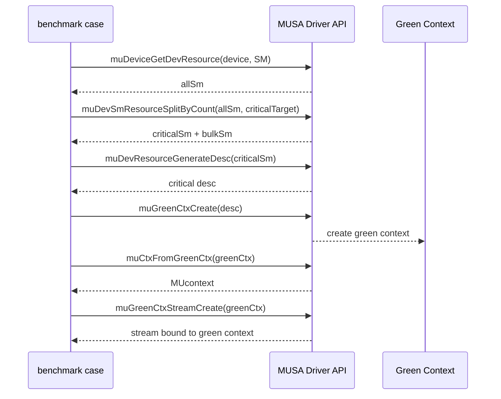

# Green Context 性能看护用例设计与实现记录

## 1. 目标

在 `musa_benchmarks` 中新增一个可自动化执行的 Green Context 性能看护用例，用于持续观察两类风险：

- Green Context 的 SM 隔离是否仍然有效。
- Green Context 的创建和销毁开销是否出现回归。

本次实现采用一个可执行文件承载两组 benchmark：

- `greenContextLatency`：验证隔离收益。
- `greenContextLifecycle`：验证创建/销毁成本。

远程实现位置：

```text
/home/shanfeng/workspace/musa_benchmarks/schedule/greenContextIsolation.cu
```

用例放在 `schedule/`，原因是该目录会同时参与 `ENABLE_MCC` 和 `ENABLE_NVCC` 构建。
源码内部通过 `TEST_ON_NVIDIA` 区分后端：

- MUSA 后端使用 `musa.h`、`musa_runtime.h`、`muGreenCtx*`、`muDevResource*`。
- CUDA 后端使用 `cuda.h`、`cuda_runtime.h`、`cuGreenCtx*`、`cuDevResource*`。
- 如果 CUDA 头文件版本低于 12.4，源码会编译为 unsupported marker case，避免旧 CUDA 环境直接编译失败。

## 2. 已完成改动

远程仓库：

```text
/home/shanfeng/workspace/musa_benchmarks
```

新增文件：

```text
schedule/greenContextIsolation.cu
```

修改文件：

```text
scripts/autorun.py
TestSuitConfig.json
```

集成方式：

- `scripts/autorun.py` 的 `graphAndScheduleCases` 增加 `greenContextIsolation`。
- `TestSuitConfig.json` 的 `graphAndSchedule` suite 增加 `greenContextIsolation`。
- `schedule/CMakeLists.txt` 使用 `*.cu` 自动发现，无需修改 CMake 文件。

该调整使同一个 case 在 MUSA 与 CUDA 构建路径下都可被发现：

```text
ENABLE_MCC=ON  -> 使用 MUSA 后端
ENABLE_NVCC=ON -> 使用 CUDA 后端
```

## 3. 用例设计

### 3.1 核心思路

Green Context 的价值不是让所有 kernel 更快，而是在后台负载存在时，为关键 workload 保留稳定的 SM 资源。

因此用例不测总耗时，而是测：

```text
critical kernel 在后台 delay kernel 已经运行时的完成时间
```

如果 Green Context 有效，critical kernel 的耗时应接近无干扰时的 solo 耗时。

### 3.2 资源划分

用例先获取设备全部 SM 资源：

```cpp
muDeviceGetDevResource(device, &allSm, MU_DEV_RESOURCE_TYPE_SM);
```

然后按目标 critical SM 数切分：

```cpp
muDevSmResourceSplitByCount(
    &criticalSm,
    &nbGroups,
    &allSm,
    &bulkSm,
    0,
    criticalTarget);
```

在 S5000 上，本次验证得到的分区为：

| critical 目标 | critical 实际 SM | bulk SM |
|---:|---:|---:|
| 8 | 8 | 48 |
| 16 | 16 | 40 |

### 3.3 kernel 设计

用例使用同一个 kernel 模拟 critical workload 和 background workload：

```cpp
sm_occupancy_spin_kernel(spinCycles, startedFlags, marker)
```

关键设计：

- MUSA 和 CUDA 后端当前统一使用接近 48 KiB 的静态 shared memory。
- `threads/block` 不再写死，由运行时根据当前设备选择。
- 选择规则：遍历 `1024、768、512、384、256、128、64`，优先选择 `activeBlocksPerSM == 1`
  的 block size；如果没有满足条件的候选值，则选择 `activeBlocksPerSM` 最小的候选值。
- 输出增加 `block` 和 `blk/SM` 两列，用于确认实际选择的 block size 和 occupancy。
- 大 shared memory 限制 occupancy，使一个 block 接近独占一个 SM。
- block 数约等于占用 SM 数。
- `clock64()` busy wait 控制 kernel 运行时间。
- mapped host flag 用于确认 delay kernel 的所有 block 已经启动。

统一规格用于 MUSA/CUDA 对比。历史版本在 MUSA 上使用 192 KiB static shared memory。
RTX 3060 在 CUDA 编译时无法接受 192 KiB static shared memory，会在 `ptxas` 阶段报错。
为了同规格对比，当前统一为 48 KiB，并用 occupancy API 动态选择 block size。

这样可以把实验解释为：

```text
delayBlocks 个 block 先占住 delayBlocks 个 SM；
然后测 criticalBlocks 个 block 在这种背景负载下的完成时间。
```

### 3.4 为什么需要 mapped host flag

如果直接先 launch delay kernel 再 launch critical kernel，host 侧无法确认 delay kernel
是否已经占住目标 SM。这样会导致 critical kernel 可能在 delay kernel 尚未稳定运行时
开始计时，结果不可靠。

因此 delay kernel 启动后，每个 block 写一个 mapped host flag：

```text
startedFlags[blockIdx.x] = marker
```

host 轮询到所有 flag 都被写入后，再记录 critical kernel 的 event start。

注意：flag 等待发生在 critical event start 之前，不计入 critical latency。

## 4. Benchmark 分组

### 4.1 `greenContextLatency`

该组用于看护隔离收益。包含三个实验。

#### `primaryFullContention`

基线场景。

```text
delay kernel:    Primary Context，占用全部 SM
critical kernel: Primary Context，占用 critical SM 数量的 block
```

含义：

- 无 Green Context。
- 后台负载占满全卡。
- 观察关键 workload 在普通多流并发下的最差干扰。

#### `primaryBulkOnly`

对照场景。

```text
delay kernel:    Primary Context，只启动 bulk SM 数量的 block
critical kernel: Primary Context，占用 critical SM 数量的 block
```

含义：

- 仍然不使用 Green Context。
- delay kernel 的 block 数与 Green Context bulk 分区一致。
- 用于区分“后台 block 少了”与“Green Context 隔离生效”。

#### `greenPartitioned`

目标场景。

```text
delay kernel:    Bulk Green Context
critical kernel: Critical Green Context
```

含义：

- 后台负载和关键 workload 使用不同 Green Context。
- 两者绑定不同 SM 资源。
- 预期 critical kernel latency 接近 solo latency。

### 4.2 `greenContextLifecycle`

该组用于看护 Green Context 创建/销毁成本。

实验：

```text
createDestroyPair
```

单轮动作：

```text
创建 critical Green Context
创建 bulk Green Context
device synchronize
销毁 critical Green Context
销毁 bulk Green Context
```

输出每对 critical+bulk Green Context 的平均创建/销毁耗时。

## 5. 指标定义

### 5.1 latency 指标

| 指标 | 含义 |
|---|---|
| `solo(ms)` | critical kernel 无后台负载时的耗时 |
| `crit(ms)` | critical kernel 在后台负载存在时的耗时 |
| `*Iso` | `solo(ms) / crit(ms)` |
| `critSM` | critical 分区实际 SM 数 |
| `bulkSM` | bulk 分区实际 SM 数 |

`*Iso` 是评分列，含义如下：

| `*Iso` | 解释 |
|---:|---|
| 接近 1 | critical latency 基本不受后台负载影响 |
| 明显小于 1 | critical latency 被后台负载拉长 |
| 大于 1 | contended 结果略快于 solo，通常来自计时波动或调度差异 |

### 5.2 lifecycle 指标

| 指标 | 含义 |
|---|---|
| `create(us)` | 一对 critical+bulk Green Context 创建/销毁的平均耗时 |
| `*CreateTP(s^-1)` | 每秒可完成的 create/destroy pair 数量 |
| `critSM` | critical 分区实际 SM 数 |
| `bulkSM` | bulk 分区实际 SM 数 |

`create(us)` 不是单个 `muGreenCtxCreate()` 或 `cuGreenCtxCreate()` 的耗时。当前用例测量
一对 critical+bulk Green Context 的完整生命周期，包含：

```text
critical Green Context create
bulk Green Context create
ctxFromGreenCtx
ctxSetCurrent
Green Context stream create
Green Context resource query
nop kernel warmup launch
stream synchronize
device synchronize
stream destroy
Green Context destroy
```

因此，`create(us)` 只能解释为 lifecycle pair 成本，不能直接归因到 `criticalSM`
数量本身。

## 6. 端到端流程

### 6.1 Green Context 创建流程



### 6.2 latency 测试流程

```mermaid
sequenceDiagram
    participant Host as Host benchmark
    participant Delay as Delay stream/context
    participant Critical as Critical stream/context

    Host->>Delay: launch delay kernel
    Delay-->>Host: write mapped started flags
    Host->>Host: wait until all delay blocks started
    Host->>Critical: record critical start event
    Host->>Critical: launch critical kernel
    Host->>Critical: record critical stop event
    Host->>Critical: synchronize stop event
    Critical-->>Host: critical elapsed time
    Host->>Delay: synchronize delay stream
```

## 7. 双后端适配方式

### 7.1 API 映射

源码不在业务逻辑中直接写死 `musa*` 或 `cuda*`，而是在文件顶部做后端映射。

| 抽象层 | MUSA 后端 | CUDA 后端 |
|---|---|---|
| Runtime error | `musaError_t` | `cudaError_t` |
| Runtime stream | `musaStream_t` | `cudaStream_t` |
| Runtime event | `musaEvent_t` | `cudaEvent_t` |
| Driver result | `MUresult` | `CUresult` |
| Device | `MUdevice` | `CUdevice` |
| Context | `MUcontext` | `CUcontext` |
| Green Context | `MUgreenCtx` | `CUgreenCtx` |
| SM resource | `MUdevResource` | `CUdevResource` |
| Resource split | `muDevSmResourceSplitByCount` | `cuDevSmResourceSplitByCount` |
| Green Context create | `muGreenCtxCreate` | `cuGreenCtxCreate` |
| Green Context stream | `muGreenCtxStreamCreate` | `cuGreenCtxStreamCreate` |

### 7.2 为什么不能继续放在 `musaOnly`

`musaOnly/` 只在 `ENABLE_MCC` 下加入构建：

```cmake
if (ENABLE_MCC)
    add_subdirectory(musaOnly)
endif()
```

因此放在 `musaOnly/` 的用例不会进入 CUDA 构建。迁移到 `schedule/` 后，`ENABLE_MCC`
和 `ENABLE_NVCC` 都会拾取该 `.cu` 文件。

### 7.3 CUDA 版本要求

CUDA Green Context API 属于较新的 CUDA Driver API。源码中加入了编译期保护：

```cpp
#if !defined(CUDA_VERSION) || CUDA_VERSION < 12040
#define GREEN_CONTEXT_UNSUPPORTED_BUILD 1
#endif
```

当 CUDA 头文件版本不满足要求时，用例仍可编译，但只输出 `*Supported=0` 的 unsupported
marker，不执行 Green Context 测试。这样做可以避免旧 CUDA 环境因为缺少 `CUgreenCtx`
等类型而直接编译失败。

## 8. 远程验证结果

### 8.1 MUSA 编译命令

直接编译命令：

```bash
cd /home/shanfeng/workspace/musa_benchmarks
/usr/local/musa/bin/clang++ -std=c++17 -x musa -mtgpu --cuda-gpu-arch=mp_31 \
  -Icommon/include -I/usr/local/musa/include -I/usr/include/libcpuid -I/usr/include/eigen3 \
  -c schedule/greenContextIsolation.cu -o /tmp/greenContextIsolation.o
```

链接命令：

```bash
cd /home/shanfeng/workspace/musa_benchmarks
/usr/local/musa/bin/clang++ /tmp/greenContextIsolation.o build/common/libbenchmark_common.a \
  -L/usr/local/musa/lib -lmusa -lmusart -lpthread -lcpuid -no-pie \
  -o /tmp/greenContextIsolation
```

`-no-pie` 的原因：当前 `build/common/libbenchmark_common.a` 按 non-PIE 方式构建，直接链接时需要保持一致。

### 8.2 用例注册检查

命令：

```bash
LD_LIBRARY_PATH=/usr/local/musa/lib /tmp/greenContextIsolation -l
```

输出：

```text
## /tmp/greenContextIsolation on:MTT S5000 backend:MUSA
Avaliable tests:
    greenContextLatency
    greenContextLifecycle
```

### 8.3 lifecycle 结果

命令：

```bash
LD_LIBRARY_PATH=/usr/local/musa/lib /tmp/greenContextIsolation -g greenContextLifecycle
```

结果：

| criticalSM | create(us) Mean | create(us) Min | create(us) Max | `*CreateTP(s^-1)` Mean | critSM | bulkSM |
|---:|---:|---:|---:|---:|---:|---:|
| 8 | 8415.58 | 7890.73 | 14760.64 | 120.97 | 8 | 48 |
| 16 | 8088.91 | 7933.09 | 8398.44 | 123.65 | 16 | 40 |

### 8.4 latency 结果

命令：

```bash
LD_LIBRARY_PATH=/usr/local/musa/lib /tmp/greenContextIsolation -g greenContextLatency
```

结果：

| Experiment | criticalSM | solo(ms) Mean | crit(ms) Mean | `*Iso` Mean | critSM | bulkSM |
|---|---:|---:|---:|---:|---:|---:|
| `primaryFullContention` | 8 | 3.69 | 17.70 | 0.21 | 8 | 48 |
| `primaryFullContention` | 16 | 3.67 | 17.70 | 0.21 | 16 | 40 |
| `primaryBulkOnly` | 8 | 3.67 | 17.71 | 0.21 | 8 | 48 |
| `primaryBulkOnly` | 16 | 3.67 | 3.50 | 1.05 | 16 | 40 |
| `greenPartitioned` | 8 | 3.51 | 3.50 | 1.00 | 8 | 48 |
| `greenPartitioned` | 16 | 3.50 | 3.50 | 1.00 | 16 | 40 |

结论：

- `primaryFullContention` 下，critical latency 从约 3.7 ms 拉长到约 17.7 ms，`*Iso` 约 0.21。
- `greenPartitioned` 下，critical latency 保持在约 3.5 ms，`*Iso` 约 1.00。
- 结果能体现 Green Context 对 critical workload 的隔离价值。
- `primaryBulkOnly` 是必要对照项。它说明只减少后台 block 数不一定稳定等价于
  Green Context 隔离，具体结果仍受 primary context 调度影响。

### 8.5 MUSA 同规格验证结果

同规格：

```text
static shared memory: 48 KiB - 16 bytes
threads per block: runtime selected by occupancy API
```

命令：

```bash
LD_LIBRARY_PATH=/usr/local/musa/lib /tmp/greenContextIsolation_same_spec -g greenContextLifecycle
LD_LIBRARY_PATH=/usr/local/musa/lib /tmp/greenContextIsolation_same_spec -g greenContextLatency
```

MUSA 同规格 lifecycle 结果：

| criticalSM | create(us) Mean | create(us) Min | create(us) Max | `*CreateTP(s^-1)` Mean | critSM | bulkSM |
|---:|---:|---:|---:|---:|---:|---:|
| 8 | 8464.58 | 7891.31 | 15028.70 | 120.36 | 8 | 48 |
| 16 | 8285.29 | 8253.60 | 8438.41 | 120.70 | 16 | 40 |

MUSA 同规格 latency 结果：

| Experiment | criticalSM | solo(ms) Mean | crit(ms) Mean | `*Iso` Mean | critSM | bulkSM | block | blk/SM |
|---|---:|---:|---:|---:|---:|---:|---:|---:|
| `primaryFullContention` | 8 | 3.62 | 3.44 | 1.05 | 8 | 48 | 1024 | 2 |
| `primaryFullContention` | 16 | 3.61 | 3.44 | 1.05 | 16 | 40 | 1024 | 2 |
| `primaryBulkOnly` | 8 | 3.61 | 3.44 | 1.05 | 8 | 48 | 1024 | 2 |
| `primaryBulkOnly` | 16 | 3.61 | 3.44 | 1.05 | 16 | 40 | 1024 | 2 |
| `greenPartitioned` | 8 | 3.44 | 3.44 | 1.00 | 8 | 48 | 1024 | 2 |
| `greenPartitioned` | 16 | 3.44 | 3.44 | 1.00 | 16 | 40 | 1024 | 2 |

结论：

- 同规格下 MUSA 编译、注册检查、lifecycle 和 latency 均通过。
- 动态选择结果为 `block=1024`，`blk/SM=2`。
- 同规格下 `greenPartitioned` 仍然稳定，`*Iso` 约 1.00。
- 同规格下 `primaryFullContention` 没有出现 192 KiB 版本中的 17 ms 级别延迟放大。
- 这说明 `48 KiB` 静态 shared memory 在 S5000 上仍允许每 SM 同时驻留 2 个 block，
  没有形成原 192 KiB 版本那样强的 SM 独占压力。该规格适合 MUSA/CUDA 横向兼容验证，
  但不如 192 KiB 规格适合在 S5000 上放大普通 primary context 的竞争影响。

### 8.6 CUDA 验证结果

CUDA 验证环境：

```text
Host: shanfeng@172.31.8.45
Repo: /home/shanfeng/musa_benchmarks
GPU: NVIDIA GeForce RTX 3060
CUDA: 12.8
nvcc: /usr/local/cuda-12.8/bin/nvcc
```

CUDA 12.8 头文件已确认包含：

```text
CUgreenCtx
cuGreenCtxCreate
cuDevSmResourceSplitByCount
CU_DEV_RESOURCE_TYPE_SM
```

直接编译方式：

```bash
cd /home/shanfeng/musa_benchmarks
rm -rf /tmp/green_cuda_build
mkdir -p /tmp/green_cuda_build/common

for f in common/src/*.cpp; do
  g++ -std=c++17 -Icommon/include -I/usr/include/libcpuid -I/usr/include/eigen3 \
    -c "$f" -o "/tmp/green_cuda_build/common/$(basename ${f%.cpp}).o"
done

ar rcs /tmp/green_cuda_build/libbenchmark_common.a /tmp/green_cuda_build/common/*.o

/usr/local/cuda-12.8/bin/nvcc -std=c++17 -DTEST_ON_NVIDIA -arch=sm_86 \
  -Icommon/include \
  -I/usr/local/cuda-12.8/targets/x86_64-linux/include \
  -I/usr/include/libcpuid \
  -I/usr/include/eigen3 \
  -c schedule/greenContextIsolation.cu \
  -o /tmp/green_cuda_build/greenContextIsolation.o

/usr/local/cuda-12.8/bin/nvcc \
  /tmp/green_cuda_build/greenContextIsolation.o \
  /tmp/green_cuda_build/libbenchmark_common.a \
  -L/usr/local/cuda-12.8/targets/x86_64-linux/lib \
  -L/usr/local/cuda-12.8/lib64 \
  -lcuda -lcudart -lpthread -lcpuid \
  -o /tmp/greenContextIsolation_cuda
```

注册检查：

```bash
LD_LIBRARY_PATH=/usr/local/cuda-12.8/targets/x86_64-linux/lib:/usr/local/cuda-12.8/lib64:$LD_LIBRARY_PATH \
  /tmp/greenContextIsolation_cuda -l
```

输出：

```text
## /tmp/greenContextIsolation_cuda on:NVIDIA GeForce RTX 3060 backend:CUDA
Avaliable tests:
    greenContextLatency
    greenContextLifecycle
```

CUDA lifecycle 结果：

| criticalSM | create(us) Mean | create(us) Min | create(us) Max | `*CreateTP(s^-1)` Mean | critSM | bulkSM |
|---:|---:|---:|---:|---:|---:|---:|
| 8 | 2276.77 | 1945.41 | 8219.20 | 489.80 | 8 | 20 |
| 16 | 1957.23 | 1944.40 | 1968.37 | 510.93 | 16 | 12 |

CUDA latency 结果：

| Experiment | criticalSM | solo(ms) Mean | crit(ms) Mean | `*Iso` Mean | critSM | bulkSM | block | blk/SM |
|---|---:|---:|---:|---:|---:|---:|---:|---:|
| `primaryFullContention` | 8 | 3.22 | 16.44 | 0.20 | 8 | 20 | 1024 | 1 |
| `primaryFullContention` | 16 | 3.10 | 15.89 | 0.20 | 16 | 12 | 1024 | 1 |
| `primaryBulkOnly` | 8 | 3.12 | 3.12 | 1.00 | 8 | 20 | 1024 | 1 |
| `primaryBulkOnly` | 16 | 3.12 | 3.12 | 1.00 | 16 | 12 | 1024 | 1 |
| `greenPartitioned` | 8 | 3.12 | 3.12 | 1.00 | 8 | 20 | 1024 | 1 |
| `greenPartitioned` | 16 | 3.12 | 3.12 | 1.00 | 16 | 12 | 1024 | 1 |

结论：

- CUDA 后端编译、链接和运行均通过。
- CUDA Green Context API 在 RTX 3060 上可用。
- 动态选择结果为 `block=1024`，`blk/SM=1`。
- `primaryFullContention` 下 critical latency 明显增大，`*Iso` 约 0.20。
- `greenPartitioned` 下 critical latency 接近 solo latency，`*Iso` 约 1.00。
- 在 RTX 3060 上，`primaryBulkOnly` 也接近 solo latency，说明该平台在 bulk block 数不占满全卡时，
  primary context 已能给 critical workload 留出调度空间。该结果不影响 Green Context 用例的有效性，
  但说明不同 GPU 的对照项解释应结合 SM 数量和 occupancy 参数。

### 8.7 create 成本差异分析

从当前结果看，`create(us)` 有两个层面的差异。

第一，`criticalSM=8` 与 `criticalSM=16` 的均值差异主要受长尾影响，不能直接解释为
SM 数量越少或越多导致 create 更慢。

CUDA 同规格结果：

| criticalSM | create(us) Mean | create(us) Min | create(us) Max |
|---:|---:|---:|---:|
| 8 | 2276.77 | 1945.41 | 8219.20 |
| 16 | 1957.23 | 1944.40 | 1968.37 |

`criticalSM=8` 的 min 与 `criticalSM=16` 接近，均在 1.9 ms 左右。`criticalSM=8`
出现一次 8.2 ms 长尾，拉高了 mean。

MUSA 同规格结果：

| criticalSM | create(us) Mean | create(us) Min | create(us) Max |
|---:|---:|---:|---:|
| 8 | 8464.58 | 7891.31 | 15028.70 |
| 16 | 8285.29 | 8253.60 | 8438.41 |

`criticalSM=8` 同样存在一次 15 ms 级别长尾。只看 mean 容易误判，后续应同时输出
p50、p90 和 max。

第二，MUSA 与 CUDA 的平台差异更明显：

| 后端 | create pair 量级 |
|---|---:|
| CUDA / RTX 3060 | 约 2 ms |
| MUSA / S5000 | 约 8 ms |

该差异说明 MUSA 的 Green Context 生命周期路径整体开销更高，但当前指标还不能说明
高在哪一层。原因是 `create(us)` 包含 resource desc、Green Context create、context
转换、stream create、warmup launch/sync、destroy 等多个步骤。

如果要定位差异来源，应将 lifecycle 计时拆成以下分项：

| 分项 | 说明 |
|---|---|
| `T_desc` | `muDevResourceGenerateDesc` / `cuDevResourceGenerateDesc` |
| `T_green_ctx_create` | `muGreenCtxCreate` / `cuGreenCtxCreate` |
| `T_ctx_from_green_ctx` | `muCtxFromGreenCtx` / `cuCtxFromGreenCtx` |
| `T_ctx_set_current` | `muCtxSetCurrent` / `cuCtxSetCurrent` |
| `T_stream_create` | `muGreenCtxStreamCreate` / `cuGreenCtxStreamCreate` |
| `T_get_resource` | `muGreenCtxGetDevResource` / `cuGreenCtxGetDevResource` |
| `T_warmup_launch_sync` | `nop_kernel` launch 和 stream synchronize |
| `T_stream_destroy` | `muStreamDestroy` / `cuStreamDestroy` |
| `T_green_ctx_destroy` | `muGreenCtxDestroy` / `cuGreenCtxDestroy` |

建议后续将 `createDestroyPair` 扩展为分项计时版本，输出 p50、p90、max，避免单次冷启动
或偶发调度长尾影响判断。

## 9. 当前构建限制

直接编译和运行已经通过。

MUSA 完整 CMake 构建当前被远程仓库既有环境问题阻塞：

- `hotPotKernels/qy2Only/link_asms.sh` 依赖 `mcc`。
- 修正 PATH 后，构建继续失败在 `hotPotKernels/qy2Only/musa_sgemm_core8x8.o`。
- 该 `.o` 文件为 root 用户所有，当前用户无法覆盖。

因此本次没有修改或删除 `build/`、`.o`、`.elf` 等生成产物。后续若需要完整跑
`./install.sh` 或 CMake 全量构建，需要先清理 root-owned build 产物，或在干净构建目录
重新构建。

CUDA 完整 CMake 构建当前被仓库既有 PTX 依赖阻塞：

```text
CMake Error: File /home/shanfeng/musa_benchmarks/schedule/elf/CopyKernel.ptx does not exist.
```

该问题与 `greenContextIsolation.cu` 本身无关。直接编译已经覆盖了该用例的源码编译、
benchmark common 链接、CUDA Driver/Runtime 链接、用例注册和运行路径。

## 10. 建议验收标准

建议将该 case 作为性能看护项，不作为功能正确性的唯一判断。

推荐阈值：

| 指标 | 建议阈值 |
|---|---|
| `greenPartitioned` 的 `*Iso` | 不低于 0.90 |
| `greenPartitioned` 的 `crit(ms)` | 不高于对应 `solo(ms)` 的 1.10 倍 |
| `primaryFullContention` 与 `greenPartitioned` 的 `crit(ms)` 差异 | Green Context 场景应明显更低 |
| `create(us)` | 与基线相比不应出现超过 20% 的持续回归 |

如果某次回归只表现为 `primary*` 场景变化，而 `greenPartitioned` 稳定，优先检查普通
stream 调度和 occupancy 变化。如果 `greenPartitioned` 的 `*Iso` 明显下降，优先检查
Green Context SM partition、stream 绑定、context 切换和 KMD resource scheduling。

## 11. 后续工作

- 建立正式 baseline CSV，并纳入 `calculateScoreOfSuit.py` 的常规评分流程。
- 在干净构建目录中完成全量 CMake 构建验证。
- 补齐 `schedule/elf/CopyKernel.ptx` 或调整 CMake 依赖后，完成 CUDA `ENABLE_NVCC=ON` 全量构建验证。
- 补充不同 SDK/driver 版本的横向结果，用于确定正式 CI 阈值。
- 如需更细粒度定位，可增加 MUPTI 采集，记录 Green Context kernel 的 context、stream、
  kernel duration 和 SM 资源信息。
